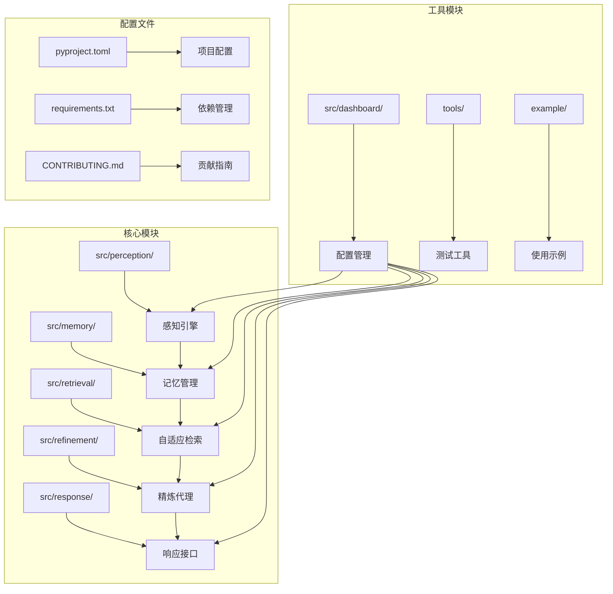
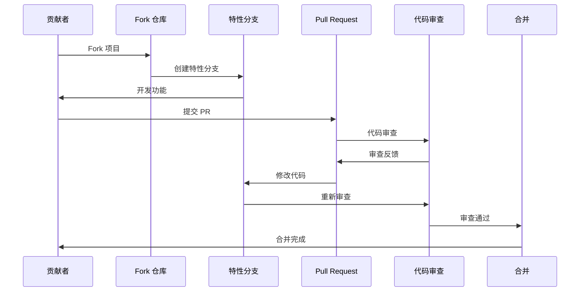
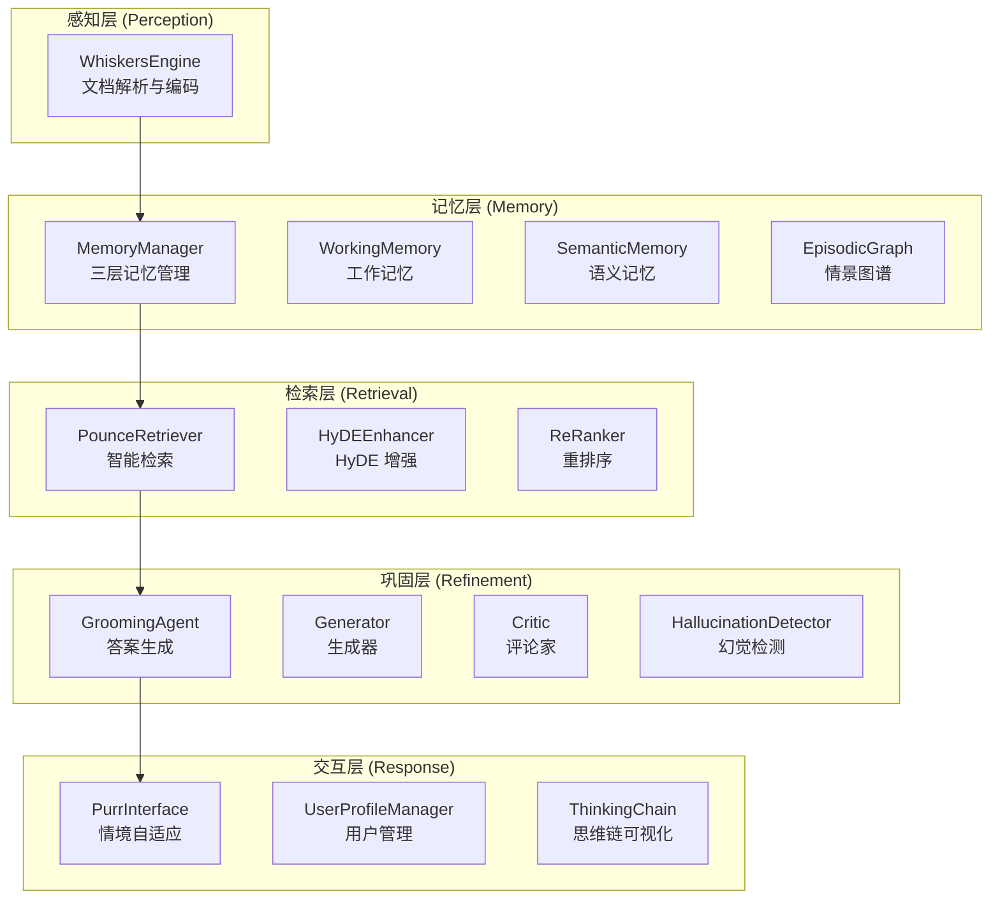
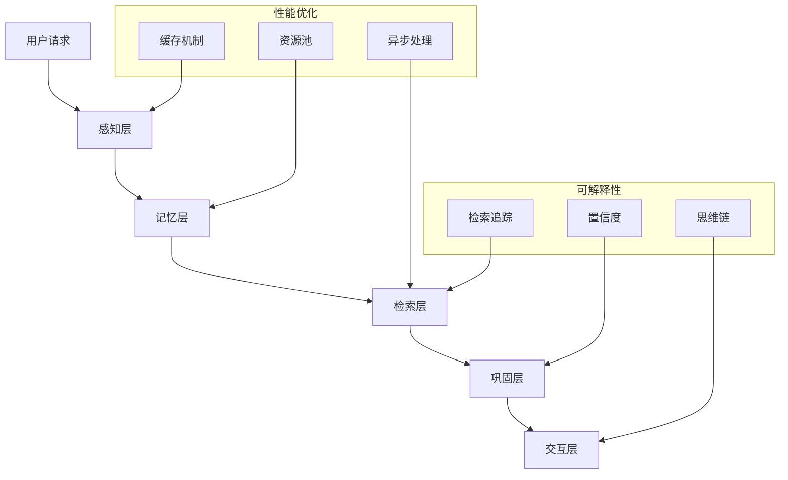
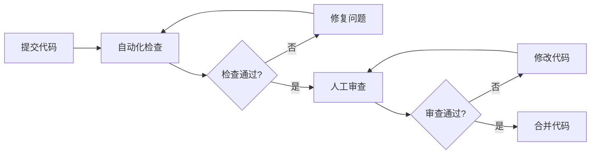

# 贡献指南

<cite>
**本文档引用的文件**
- [CONTRIBUTING.md](file://CONTRIBUTING.md)
- [README.md](file://README.md)
- [QUICKSTART.md](file://QUICKSTART.md)
- [pyproject.toml](file://pyproject.toml)
- [requirements.txt](file://requirements.txt)
- [test_init.py](file://test_init.py)
- [tools/test_imports.py](file://tools/test_imports.py)
- [example/example_usage.py](file://example/example_usage.py)
- [src/perception/README.md](file://src/perception/README.md)
- [src/memory/README.md](file://src/memory/README.md)
- [src/dashboard/README.md](file://src/dashboard/README.md)
</cite>

## 目录
1. [简介](#简介)
2. [项目结构](#项目结构)
3. [核心贡献方式](#核心贡献方式)
4. [开发环境设置](#开发环境设置)
5. [代码规范](#代码规范)
6. [提交规范](#提交规范)
7. [Pull Request 流程](#pull-request-流程)
8. [模块结构](#模块结构)
9. [测试指南](#测试指南)
10. [设计原则](#设计原则)
11. [性能基准](#性能基准)
12. [代码审查标准](#代码审查标准)
13. [故障排除](#故障排除)
14. [许可证](#许可证)

## 简介

欢迎来到 NecoRAG 项目！NecoRAG 是一个创新的认知型 RAG 框架，模拟人脑的双系统记忆理论和神经认知科学原理。通过五层架构设计，实现了从感知到交互的完整认知闭环。

本项目采用"五层认知"分层架构，每一层对应人脑认知机制的不同阶段：
- 🎨 Layer 5: Response Interface (交互层) - 情境自适应生成与可解释性输出
- 🔄 Layer 4: Refinement Agent (巩固层) - 异步固化、幻觉自检与记忆修剪  
- ⚡ Layer 3: Adaptive Retrieval (检索层) - 混合检索与重排序
- 💾 Layer 2: Hierarchical Memory (记忆层) - 分层存储与管理
- 📄 Layer 1: Perception Engine (感知层) - 多模态数据的高精度编码与情境标记

## 项目结构

NecoRAG 采用模块化的项目组织方式，主要包含以下核心模块：



**图表来源**
- [src/perception/README.md:1-158](file://src/perception/README.md#L1-L158)
- [src/memory/README.md:1-244](file://src/memory/README.md#L1-L244)
- [src/dashboard/README.md:1-417](file://src/dashboard/README.md#L1-L417)

**章节来源**
- [README.md:35-85](file://README.md#L35-L85)
- [CONTRIBUTING.md:108-118](file://CONTRIBUTING.md#L108-L118)

## 核心贡献方式

### 1. 报告问题 🐛

发现 Bug 或有功能建议时，请遵循以下流程：

1. 在 Issues 中搜索是否已存在相同问题
2. 如果不存在，创建新 Issue
3. 使用清晰的标题和详细的描述
4. 提供复现步骤（如果是 Bug）

### 2. 提交代码 💻

#### 开发环境设置

```bash
# 1. Fork 项目
# 在 Gitee 上点击 Fork

# 2. 克隆你的 Fork
git clone https://gitee.com/YOUR_USERNAME/NecoRAG.git
cd NecoRAG

# 3. 创建虚拟环境
python -m venv venv
source venv/bin/activate  # Linux/Mac
venv\Scripts\activate     # Windows

# 4. 安装依赖
pip install -r requirements.txt

# 5. 运行测试
python test_imports.py
```

#### 代码规范

- **Python 版本**: 3.9+
- **代码风格**: PEP 8
- **类型注解**: 尽量添加类型注解
- **文档字符串**: 使用中文文档字符串

#### 提交规范

使用语义化提交消息：

```
feat: 新功能
fix: 修复 bug
docs: 文档更新
style: 代码格式调整
refactor: 重构
test: 测试相关
chore: 构建/工具链
```

示例：
```
feat(memory): 添加 L3 图谱权重衰减机制
fix(retrieval): 修复 Pounce 阈值判断逻辑
docs(whiskers): 更新分块策略文档
```

#### Pull Request 流程

1. **创建特性分支**
   ```bash
   git checkout -b feature/amazing-feature
   ```

2. **提交更改**
   ```bash
   git add .
   git commit -m "feat: 添加某某功能"
   ```

3. **推送到 Fork**
   ```bash
   git push origin feature/amazing-feature
   ```

4. **创建 Pull Request**
   - 在 Gitee 上创建 PR
   - 填写 PR 模板
   - 等待审核

### 3. 改进文档 📝

文档改进是最容易的贡献方式：

- 修复拼写错误
- 改进表述
- 添加示例
- 翻译文档

### 4. 分享想法 💡

- 在 Discussions 中分享你的想法
- 写博客文章介绍 NecoRAG
- 在社交媒体上分享

**章节来源**
- [CONTRIBUTING.md:7-179](file://CONTRIBUTING.md#L7-L179)

## 开发环境设置

### 系统要求

- **Python 版本**: 3.9+
- **操作系统**: Linux, macOS, Windows
- **内存**: 至少 4GB RAM
- **磁盘空间**: 至少 1GB 可用空间

### 详细安装步骤

#### 步骤 1: 克隆仓库
```bash
git clone https://github.com/NecoRAG/core.git
cd core
```

#### 步骤 2: 创建虚拟环境
```bash
# 使用 venv 创建虚拟环境
python -m venv .venv

# 激活虚拟环境
# Linux/Mac:
source .venv/bin/activate
# Windows:
.venv\Scripts\activate
```

#### 步骤 3: 安装依赖
```bash
# 安装核心依赖
pip install -r requirements.txt

# 安装开发依赖
pip install -e ".[dev]"
```

#### 步骤 4: 验证安装
```bash
# 测试模块导入
python -c "import src; print('NecoRAG 导入成功')"

# 运行导入测试
python tools/test_imports.py

# 运行示例
python example/example_usage.py
```

### 开发工具配置

#### IDE 设置建议

1. **VS Code 配置** (.vscode/settings.json)
```json
{
    "python.defaultInterpreterPath": "./.venv/bin/python",
    "python.linting.enabled": true,
    "python.linting.flake8Enabled": true,
    "python.formatting.provider": "black",
    "editor.formatOnSave": true,
    "editor.codeActionsOnSave": {
        "source.fixAll": true
    }
}
```

2. **Black 格式化配置** (pyproject.toml)
```toml
[tool.black]
line-length = 100
target-version = ['py39', 'py310', 'py311', 'py312']
```

3. **MyPy 类型检查配置** (pyproject.toml)
```toml
[tool.mypy]
python_version = "3.9"
warn_return_any = true
warn_unused_configs = true
disallow_untyped_defs = false
```

**章节来源**
- [QUICKSTART.md:5-66](file://QUICKSTART.md#L5-L66)
- [pyproject.toml:1-59](file://pyproject.toml#L1-L59)
- [requirements.txt:1-57](file://requirements.txt#L1-L57)

## 代码规范

### Python 版本兼容性

NecoRAG 支持 Python 3.9+，并在以下版本进行测试：
- Python 3.9
- Python 3.10  
- Python 3.11
- Python 3.12

### PEP 8 代码风格

遵循 PEP 8 标准，重点关注：

#### 命名约定
- **模块名**: snake_case
- **类名**: CamelCase
- **函数名**: snake_case
- **常量名**: UPPERCASE
- **变量名**: snake_case

#### 代码布局
- **缩进**: 4 个空格
- **行长**: 最大 100 字符
- **空行**: 函数之间 2 行，类之间 2 行
- **导入顺序**: 标准库、第三方库、本地导入

#### 注释规范
- **模块注释**: 文件顶部的文档字符串
- **函数注释**: 详细的 docstring
- **行内注释**: 仅在必要时使用

### 类型注解

强烈建议为所有函数参数和返回值添加类型注解：

```python
from typing import List, Dict, Optional, Union

def process_data(
    items: List[str], 
    config: Dict[str, Union[str, int]] = None
) -> Optional[List[str]]:
    """处理数据列表
    
    Args:
        items: 输入的字符串列表
        config: 配置参数
        
    Returns:
        处理后的字符串列表或 None
    """
    pass
```

### 文档字符串

使用中文文档字符串，遵循 Google 风格：

```python
def calculate_weight(
    memory_item: MemoryItem,
    decay_rate: float = 0.1,
    time_passed: float = 0.0
) -> float:
    """计算记忆权重衰减
    
    Args:
        memory_item: 记忆项对象
        decay_rate: 衰减速率
        time_passed: 经过的时间
        
    Returns:
        衰减后的权重值
        
    Raises:
        ValueError: 当参数无效时
    """
    pass
```

### 代码质量工具

#### Black 格式化
```bash
# 自动格式化代码
black src/

# 检查格式但不修改
black --check src/
```

#### Flake8 代码检查
```bash
# 检查代码质量问题
flake8 src/

# 生成报告
flake8 src/ --format='%(row)s:%(col)s: %(code)s %(text)s (%(path)s)' --max-complexity=10
```

#### MyPy 类型检查
```bash
# 检查类型注解
mypy src/

# 严格模式
mypy src/ --strict
```

**章节来源**
- [CONTRIBUTING.md:40-66](file://CONTRIBUTING.md#L40-L66)
- [pyproject.toml:50-59](file://pyproject.toml#L50-L59)

## 提交规范

### 语义化版本控制

NecoRAG 使用语义化版本控制，遵循以下规则：

#### 版本号格式
```
MAJOR.MINOR.PATCH
```

- **MAJOR**: 破坏性更新
- **MINOR**: 向后兼容的功能新增
- **PATCH**: 向后兼容的问题修复

#### 提交类型

| 类型 | 用途 | 示例 |
|------|------|------|
| `feat` | 新功能 | feat(memory): 添加新的记忆算法 |
| `fix` | 修复 Bug | fix(retrieval): 修复检索结果排序 |
| `docs` | 文档更新 | docs: 更新 API 文档 |
| `style` | 代码格式调整 | style: 修正代码格式问题 |
| `refactor` | 重构 | refactor(core): 优化核心算法 |
| `test` | 测试相关 | test: 添加单元测试 |
| `chore` | 构建/工具链 | chore: 更新依赖 |

#### 提交消息格式

```bash
# 基本格式
<type>(<scope>): <subject>

# 详细格式
<type>(<scope>): <subject>

<Body>

<Footer>
```

**章节来源**
- [CONTRIBUTING.md:47-66](file://CONTRIBUTING.md#L47-L66)

## Pull Request 流程

### PR 创建流程



**图表来源**
- [CONTRIBUTING.md:68-90](file://CONTRIBUTING.md#L68-L90)

### PR 审查流程

1. **自动检查**
   - 代码格式检查
   - 类型注解检查
   - 单元测试运行

2. **人工审查**
   - 代码质量评估
   - 功能正确性验证
   - 性能影响分析

3. **合并条件**
   - 所有检查通过
   - 至少一名维护者批准
   - 无冲突的代码合并

### PR 模板

```markdown
## 变更类型

- [ ] 新功能 (feat)
- [ ] 修复 Bug (fix)
- [ ] 文档更新 (docs)
- [ ] 代码重构 (refactor)
- [ ] 性能优化 (perf)
- [ ] 测试添加 (test)

## 变更描述

## 相关问题

## 变更影响

## 测试计划

## 部署注意事项
```

**章节来源**
- [CONTRIBUTING.md:68-90](file://CONTRIBUTING.md#L68-L90)

## 模块结构

### 五层架构设计

NecoRAG 采用"五层认知"分层架构，每一层都有明确的职责和接口：



**图表来源**
- [README.md:35-85](file://README.md#L35-L85)
- [src/perception/README.md:1-158](file://src/perception/README.md#L1-L158)
- [src/memory/README.md:1-244](file://src/memory/README.md#L1-L244)
- [src/dashboard/README.md:1-417](file://src/dashboard/README.md#L1-L417)

### 核心模块职责

#### 感知引擎 (Whiskers Engine)
- 多模态数据的高精度编码
- 情境标签生成
- 文档解析与分块

#### 记忆管理 (Memory Manager)
- 三层记忆系统的协调
- 动态权重衰减
- 记忆巩固与遗忘

#### 自适应检索 (Adaptive Retriever)
- 混合检索策略
- HyDE 增强
- 早停机制

#### 精炼代理 (Grooming Agent)
- 答案生成与验证
- 幻觉检测
- 知识固化

#### 响应接口 (Purr Interface)
- 情境自适应生成
- 思维链可视化
- 用户偏好管理

**章节来源**
- [CONTRIBUTING.md:120-126](file://CONTRIBUTING.md#L120-L126)

## 测试指南

### 测试环境设置

```bash
# 安装测试依赖
pip install pytest pytest-asyncio pytest-cov

# 运行所有测试
pytest

# 运行特定模块测试
pytest src/perception/test_

# 生成覆盖率报告
pytest --cov=src --cov-report=html
```

### 测试策略

#### 单元测试
- 每个模块至少 80% 的覆盖率
- 边界条件测试
- 错误处理测试

#### 集成测试
- 模块间接口测试
- 端到端工作流测试
- 性能基准测试

#### 文档测试
- 示例代码验证
- API 文档同步
- 使用指南更新

### 测试工具

#### 导入测试
```python
# tools/test_imports.py
def test_imports():
    """测试所有模块导入"""
    print("测试 NecoRAG 模块导入...")
    
    # 测试主模块
    import src
    
    # 测试子模块
    from src.perception import WhiskersEngine
    from src.memory import MemoryManager
    from src.retrieval import PounceRetriever
    from src.refinement import GroomingAgent
    from src.response import PurrInterface
    
    print("所有模块导入成功！")
```

#### 示例测试
```python
# example/example_usage.py
def main():
    """主函数：演示完整的 NecoRAG 工作流程"""
    print("NecoRAG 完整工作流程演示")
    
    # 1. 感知层：Perception Engine
    encoded_chunks = example_perception()
    
    # 2. 记忆层：Memory Manager
    memory = example_memory(encoded_chunks)
    
    # 3. 检索层：Adaptive Retriever
    retrieval_results = example_retrieval(memory)
    
    # 4. 巩固层：Refinement Agent
    refinement_result = example_refinement(retrieval_results)
    
    # 5. 交互层：Response Interface
    response = example_response(refinement_result, memory)
    
    print("演示完成！")
```

**章节来源**
- [tools/test_imports.py:1-64](file://tools/test_imports.py#L1-L64)
- [example/example_usage.py:1-252](file://example/example_usage.py#L1-L252)
- [QUICKSTART.md:15-41](file://QUICKSTART.md#L15-L41)

## 设计原则

### 核心设计原则

NecoRAG 遵循以下设计原则：

1. **模块化 (Modular)**: 每个模块独立，职责单一
   - 清晰的接口定义
   - 最小的模块耦合
   - 易于替换和扩展

2. **可扩展 (Extensible)**: 预留接口，易于扩展
   - 插件化架构
   - 配置驱动
   - 标准化接口

3. **可解释 (Explainable)**: 输出可追溯，过程可视化
   - 思维链可视化
   - 检索路径追踪
   - 置信度评估

4. **高效 (Efficient)**: 优化性能，减少冗余
   - 缓存策略
   - 异步处理
   - 资源管理

### 架构设计



**章节来源**
- [CONTRIBUTING.md:140-146](file://CONTRIBUTING.md#L140-L146)

## 性能基准

### 性能目标

为确保 NecoRAG 的高性能表现，制定了以下性能基准：

| 指标类别 | 目标值 | 说明 |
|----------|--------|------|
| **导入时间** | < 2 秒 | 模块导入延迟 |
| **基础操作** | < 100 毫秒 | 基本功能执行时间 |
| **Dashboard 启动** | < 5 秒 | Web 界面启动时间 |
| **简单查询延迟** | < 800 毫秒 | 首字延迟 |
| **复杂查询延迟** | < 1500 毫秒 | 多跳+重排 |
| **检索准确率** | +20% | 相比传统 Vector RAG |
| **幻觉率** | < 5% | 通过 Refinement Agent |

### 性能监控

#### 内存使用
- L1 工作记忆: < 5ms 访问延迟
- L2 语义记忆: < 100ms 检索延迟  
- L3 情景图谱: < 500ms 查询延迟

#### 并发处理
- 支持多线程并发
- 异步 I/O 操作
- 连接池管理

### 性能测试

```python
# 性能基准测试示例
import time
import pytest

@pytest.mark.performance
def test_memory_access_performance():
    """测试记忆访问性能"""
    start_time = time.time()
    
    # 执行多次访问操作
    for i in range(1000):
        memory.get_item(f"test_{i}")
    
    end_time = time.time()
    assert end_time - start_time < 1.0  # 1秒内完成

@pytest.mark.performance  
def test_retrieval_speed():
    """测试检索速度"""
    query = "测试查询"
    start_time = time.time()
    
    results = retriever.retrieve(query, top_k=10)
    
    end_time = time.time()
    assert end_time - start_time < 0.5  # 500毫秒内完成
```

**章节来源**
- [CONTRIBUTING.md:147-154](file://CONTRIBUTING.md#L147-L154)
- [README.md:465-474](file://README.md#L465-L474)

## 代码审查标准

### 审查清单

每次代码审查都必须检查以下方面：

#### 代码质量
- [ ] 符合 PEP 8 规范
- [ ] 类型注解完整
- [ ] 文档字符串清晰
- [ ] 错误处理完善
- [ ] 代码注释充分

#### 功能正确性
- [ ] 单元测试覆盖
- [ ] 边界条件处理
- [ ] 异常情况处理
- [ ] 性能考虑
- [ ] 兼容性保证

#### 设计原则
- [ ] 模块化设计
- [ ] 接口稳定性
- [ ] 可扩展性
- [ ] 可解释性
- [ ] 可维护性

### 审查流程



**图表来源**
- [CONTRIBUTING.md:155-163](file://CONTRIBUTING.md#L155-L163)

### 审查标准

#### 代码质量标准
- **可读性**: 代码清晰易懂，命名规范
- **健壮性**: 完善的错误处理和边界检查
- **效率性**: 合理的算法选择和资源使用
- **安全性**: 输入验证和安全考虑

#### 文档标准
- **API 文档**: 完整的函数和类文档
- **使用示例**: 清晰的使用示例
- **变更日志**: 详细的变更说明
- **架构文档**: 架构设计说明

#### 测试标准
- **测试覆盖率**: 至少 80%
- **测试质量**: 覆盖边界条件和异常情况
- **持续集成**: 通过所有 CI 检查

**章节来源**
- [CONTRIBUTING.md:155-163](file://CONTRIBUTING.md#L155-L163)

## 故障排除

### 常见问题

#### 环境问题

**问题**: Python 版本不兼容
**解决方案**: 
```bash
# 检查 Python 版本
python --version

# 使用正确的 Python 版本
pyenv global 3.9.16
```

**问题**: 依赖安装失败
**解决方案**:
```bash
# 清理缓存
pip cache purge

# 重新安装
pip install --no-cache-dir -r requirements.txt
```

#### 代码问题

**问题**: 导入错误
**解决方案**:
```python
# 检查模块路径
import sys
print(sys.path)

# 添加项目路径
sys.path.insert(0, '/path/to/necorag')
```

**问题**: 类型检查错误
**解决方案**:
```python
# 添加类型注解
from typing import Optional, List

def process_data(items: List[str]) -> Optional[str]:
    """处理数据"""
    return items[0] if items else None
```

#### 性能问题

**问题**: 程序运行缓慢
**解决方案**:
```python
# 添加性能分析
import cProfile
import pstats

pr = cProfile.Profile()
pr.enable()

# 执行代码
# ...

pr.disable()
ps = pstats.Stats(pr)
ps.sort_stats('cumulative')
ps.print_stats(10)
```

### 调试技巧

#### 日志记录
```python
import logging

logging.basicConfig(
    level=logging.DEBUG,
    format='%(asctime)s - %(name)s - %(levelname)s - %(message)s'
)

logger = logging.getLogger(__name__)
logger.debug("调试信息")
logger.info("普通信息")
logger.warning("警告信息")
logger.error("错误信息")
```

#### 断点调试
```python
import pdb

def problematic_function():
    x = 10
    y = 20
    pdb.set_trace()  # 设置断点
    return x + y
```

### 支持渠道

- **GitHub Issues**: https://github.com/NecoRAG/core/issues
- **文档**: https://github.com/NecoRAG/core#readme
- **社区讨论**: GitHub Discussions

**章节来源**
- [QUICKSTART.md:237-277](file://QUICKSTART.md#L237-L277)

## 许可证

通过贡献代码，你同意你的代码将在 MIT 许可证下发布。

### MIT 许可证条款

- 可自由使用、复制、修改、分发和再许可
- 保留版权声明和许可证声明
- 无担保，使用风险自负
- 适用于商业和非商业用途

### 贡献声明

当你提交代码时，表示你有权授予这些权利，并且你同意：

1. 你的贡献受 MIT 许可证保护
2. 你拥有对贡献内容的完整版权
3. 你授权项目维护者进行分发和修改
4. 你不会对你的贡献提出任何版权主张

### 法律声明

- 本项目按"现状"提供，不提供任何明示或暗示的担保
- 作者不对因使用本软件而产生的任何损害承担责任
- 使用本软件即表示接受所有适用的法律条款

**章节来源**
- [CONTRIBUTING.md:164-167](file://CONTRIBUTING.md#L164-L167)