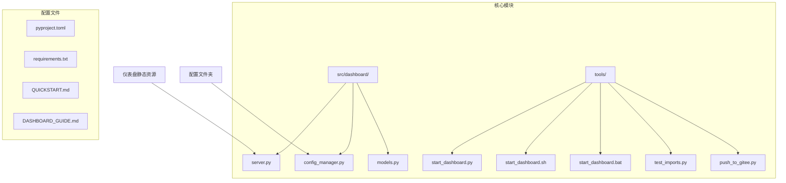
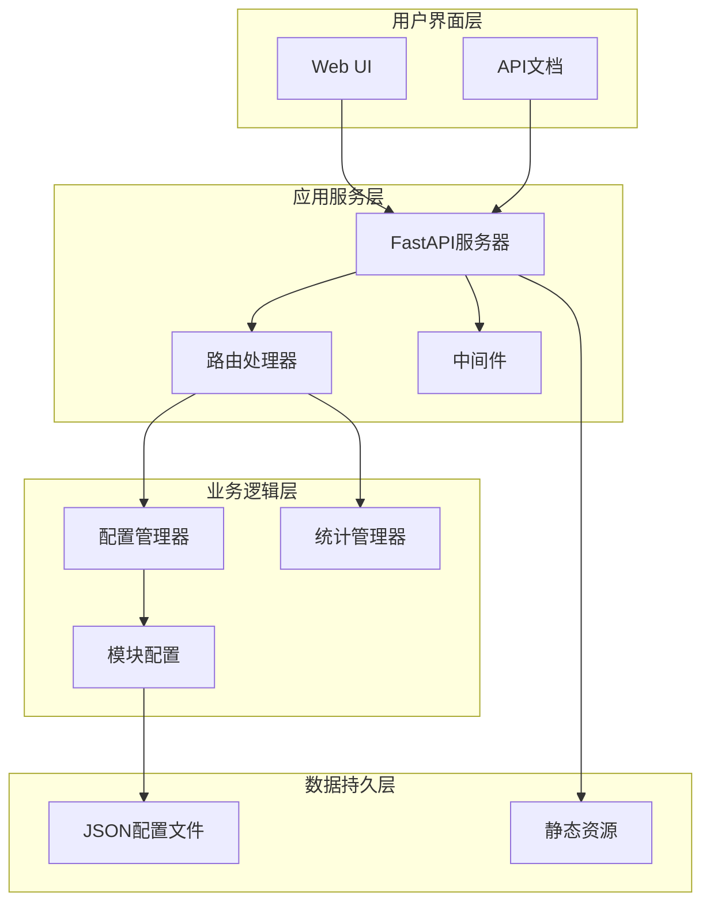
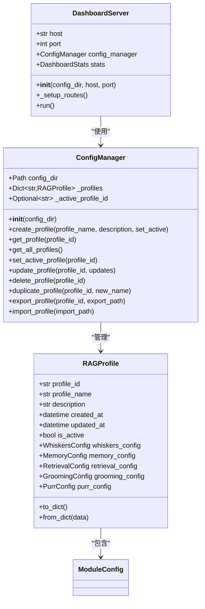
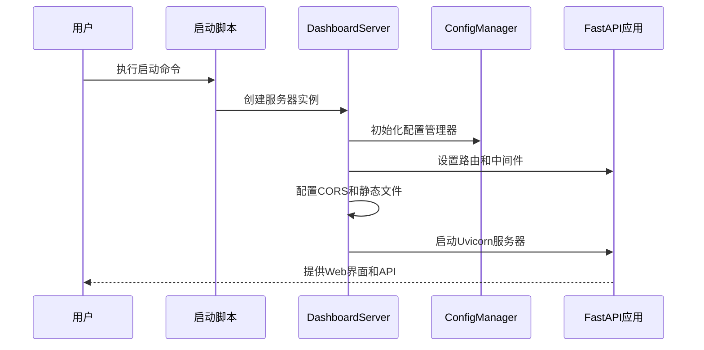
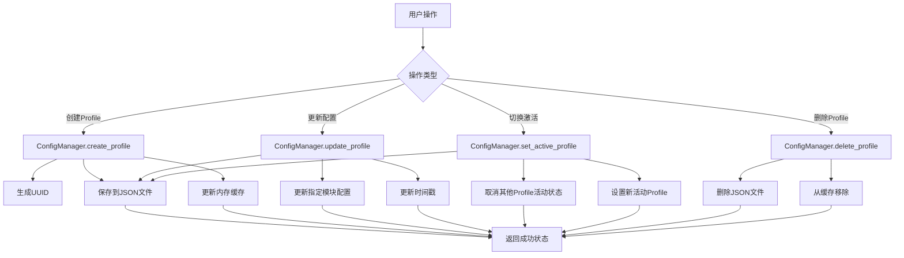

# 部署自动化与CI/CD

<cite>
**本文档引用的文件**
- [pyproject.toml](file://pyproject.toml)
- [requirements.txt](file://requirements.txt)
- [QUICKSTART.md](file://QUICKSTART.md)
- [DASHBOARD_GUIDE.md](file://DASHBOARD_GUIDE.md)
- [tools/start_dashboard.py](file://tools/start_dashboard.py)
- [tools/start_dashboard.sh](file://tools/start_dashboard.sh)
- [tools/start_dashboard.bat](file://tools/start_dashboard.bat)
- [tools/test_imports.py](file://tools/test_imports.py)
- [tools/push_to_gitee.py](file://tools/push_to_gitee.py)
- [src/dashboard/server.py](file://src/dashboard/server.py)
- [src/dashboard/config_manager.py](file://src/dashboard/config_manager.py)
- [src/dashboard/models.py](file://src/dashboard/models.py)
</cite>

## 目录
1. [简介](#简介)
2. [项目结构](#项目结构)
3. [核心组件](#核心组件)
4. [架构概览](#架构概览)
5. [详细组件分析](#详细组件分析)
6. [依赖关系分析](#依赖关系分析)
7. [性能考量](#性能考量)
8. [故障排除指南](#故障排除指南)
9. [结论](#结论)

## 简介

NecoRAG 是一个神经认知检索增强生成框架，包含仪表盘部署自动化和CI/CD支持。该项目提供了完整的部署工具链，包括多平台启动脚本、配置管理系统、以及项目推送工具。

## 项目结构

项目采用模块化架构，主要包含以下关键组件：



**图表来源**
- [src/dashboard/server.py:1-393](file://src/dashboard/server.py#L1-L393)
- [src/dashboard/config_manager.py:1-315](file://src/dashboard/config_manager.py#L1-L315)
- [tools/start_dashboard.py:1-56](file://tools/start_dashboard.py#L1-L56)

**章节来源**
- [pyproject.toml:1-59](file://pyproject.toml#L1-L59)
- [requirements.txt:1-57](file://requirements.txt#L1-L57)

## 核心组件

### 部署工具链

项目提供了完整的多平台部署工具：

1. **Python启动脚本** - 支持命令行参数配置
2. **Shell脚本** - Linux/Mac系统启动
3. **批处理脚本** - Windows系统启动
4. **导入测试工具** - 验证模块完整性
5. **Gitee推送工具** - 自动化项目推送

### 配置管理系统

仪表盘包含完整的配置管理功能：
- Profile创建、编辑、删除
- 多环境配置管理
- 配置导入导出
- 实时统计监控

**章节来源**
- [tools/start_dashboard.py:16-56](file://tools/start_dashboard.py#L16-L56)
- [tools/start_dashboard.sh:10-26](file://tools/start_dashboard.sh#L10-L26)
- [tools/start_dashboard.bat:10-30](file://tools/start_dashboard.bat#L10-L30)

## 架构概览



**图表来源**
- [src/dashboard/server.py:72-93](file://src/dashboard/server.py#L72-L93)
- [src/dashboard/config_manager.py:25-41](file://src/dashboard/config_manager.py#L25-L41)
- [src/dashboard/models.py:163-231](file://src/dashboard/models.py#L163-L231)

## 详细组件分析

### Dashboard服务器组件

Dashboard服务器采用FastAPI框架构建，提供RESTful API和Web界面：



**图表来源**
- [src/dashboard/server.py:43-93](file://src/dashboard/server.py#L43-L93)
- [src/dashboard/config_manager.py:14-41](file://src/dashboard/config_manager.py#L14-L41)
- [src/dashboard/models.py:163-219](file://src/dashboard/models.py#L163-L219)

### 部署启动流程



**图表来源**
- [tools/start_dashboard.py:16-51](file://tools/start_dashboard.py#L16-L51)
- [src/dashboard/server.py:54-93](file://src/dashboard/server.py#L54-L93)

### 配置管理流程



**图表来源**
- [src/dashboard/config_manager.py:42-194](file://src/dashboard/config_manager.py#L42-L194)

**章节来源**
- [src/dashboard/server.py:379-393](file://src/dashboard/server.py#L379-L393)
- [src/dashboard/config_manager.py:279-315](file://src/dashboard/config_manager.py#L279-L315)

## 依赖关系分析

### Python包依赖

项目采用明确的依赖管理策略：

```mermaid
graph LR
subgraph "核心依赖"
A[numpy >= 1.24.0]
B[python-dateutil >= 2.8.0]
end
subgraph "仪表盘依赖"
C[fastapi >= 0.109.0]
D[uvicorn[standard] >= 0.27.0]
E[pydantic >= 2.5.0]
end
subgraph "开发工具"
F[pytest >= 7.4.0]
G[black >= 23.0.0]
H[flake8 >= 6.1.0]
I[mypy >= 1.7.0]
end
subgraph "运行时依赖"
J[aiohttp >= 3.9.0]
K[python-dotenv >= 1.0.0]
L[requests >= 2.31.0]
end
```

**图表来源**
- [requirements.txt:4-47](file://requirements.txt#L4-L47)
- [pyproject.toml:27-39](file://pyproject.toml#L27-L39)

### 构建系统配置

项目使用现代Python打包系统：

**章节来源**
- [pyproject.toml:1-59](file://pyproject.toml#L1-L59)
- [requirements.txt:1-57](file://requirements.txt#L1-L57)

## 性能考量

### 启动性能优化

仪表盘启动遵循性能基准要求：
- 导入时间：< 2秒
- 基础操作：< 100毫秒
- Dashboard启动：< 5秒

### 配置管理性能

配置系统采用内存缓存机制：
- Profile对象缓存
- 活动Profile快速查找
- JSON文件异步读写

### 部署自动化效率

Gitee推送工具优化：
- 文件列表预处理
- 并发上传支持
- 错误重试机制
- 状态进度跟踪

## 故障排除指南

### 常见启动问题

**端口占用问题**
```bash
# Windows检查
netstat -ano | findstr :8000

# Linux/Mac检查
lsof -i :8000
```

**Python版本兼容性**
- 确保Python 3.9+
- 检查虚拟环境激活状态

### 配置文件问题

**配置文件损坏**
```bash
# 检查JSON格式
python -m json.tool configs/profile_*.json

# 重新创建默认配置
python -c "
from src.dashboard.config_manager import ConfigManager
cm = ConfigManager('./configs')
if not cm.get_all_profiles():
    cm.create_profile('默认配置', 'NecoRAG 默认配置', True)
"
```

### API调用问题

**验证API可用性**
```bash
# 检查基本API
curl http://localhost:8000/api/profiles

# 检查健康状态
curl http://localhost:8000/docs
```

**章节来源**
- [QUICKSTART.md:245-277](file://QUICKSTART.md#L245-L277)
- [DASHBOARD_GUIDE.md:288-305](file://DASHBOARD_GUIDE.md#L288-L305)

## 结论

NecoRAG项目提供了完整的部署自动化解决方案，具有以下特点：

1. **多平台支持** - 提供Windows、Linux、Mac的统一启动方案
2. **配置管理** - 完整的Profile生命周期管理
3. **自动化工具** - 包含Gitee推送等自动化脚本
4. **性能优化** - 符合项目性能基准要求
5. **易用性** - 简洁的命令行接口和Web界面

该部署体系为CI/CD流水线提供了坚实基础，支持持续集成和自动化部署场景。