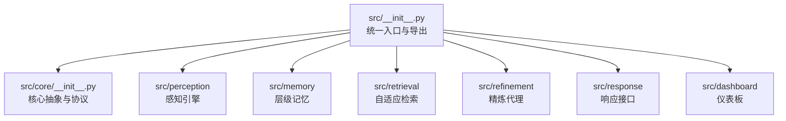
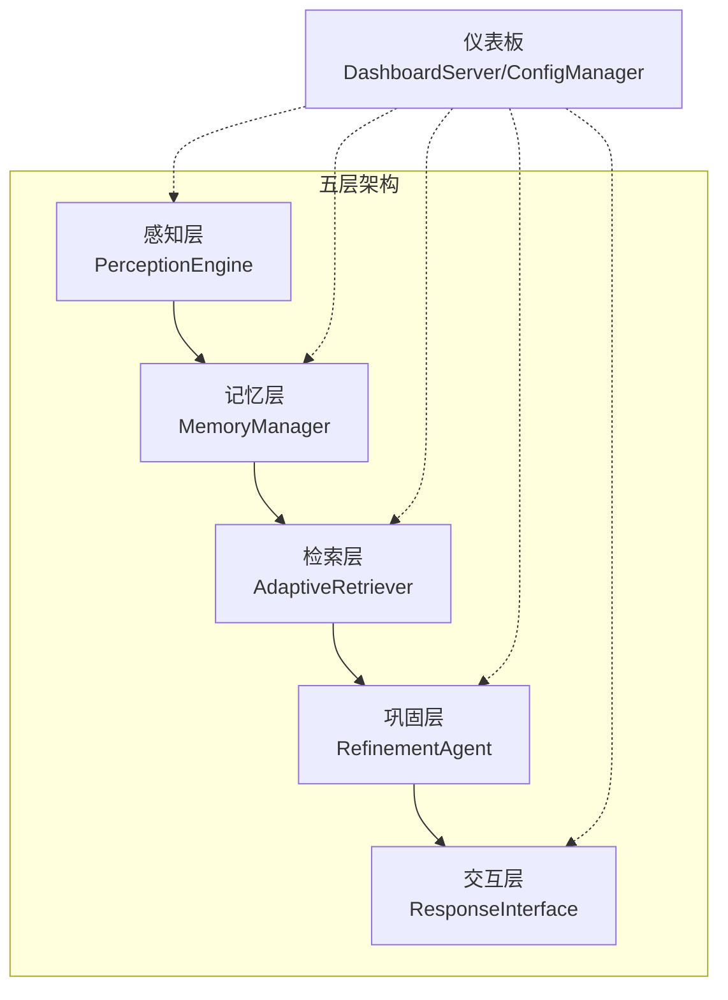
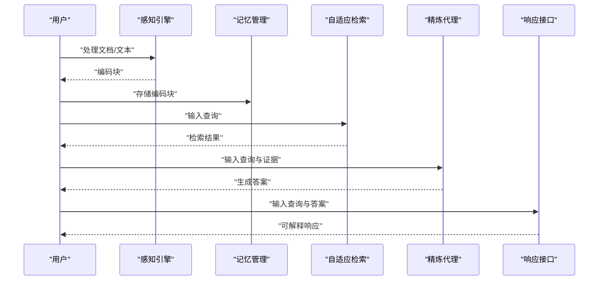
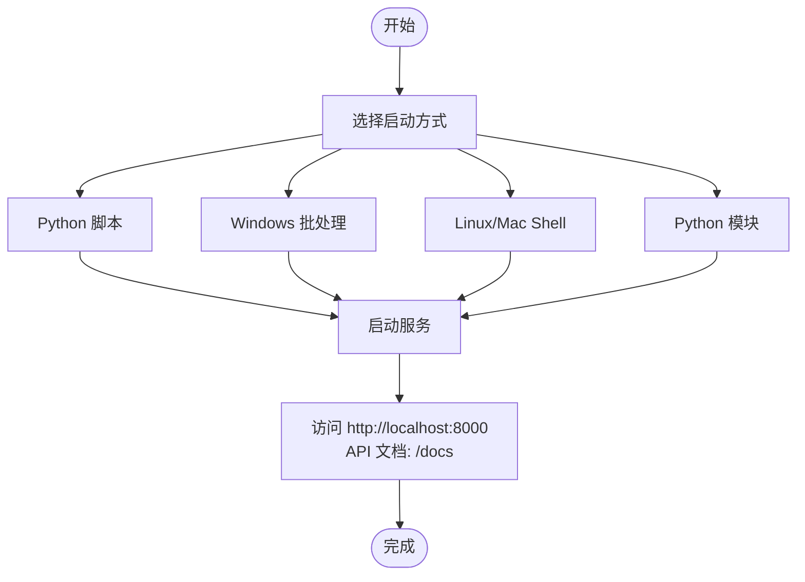
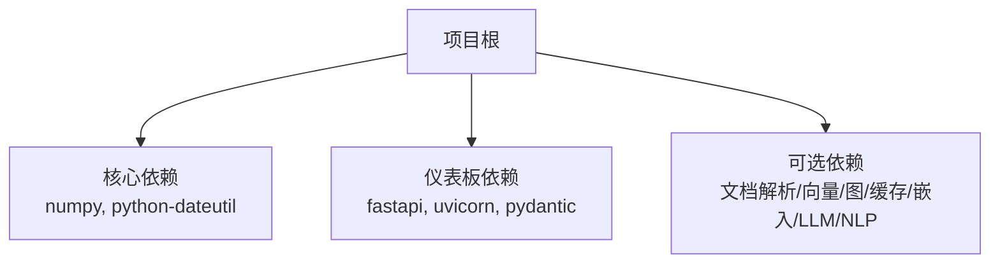

# 快速开始

<cite>
**本文引用的文件**
- [README.md](file://README.md)
- [QUICKSTART.md](file://QUICKSTART.md)
- [requirements.txt](file://requirements.txt)
- [pyproject.toml](file://pyproject.toml)
- [example/example_usage.py](file://example/example_usage.py)
- [tools/start_dashboard.py](file://tools/start_dashboard.py)
- [tools/start_dashboard.sh](file://tools/start_dashboard.sh)
- [tools/start_dashboard.bat](file://tools/start_dashboard.bat)
- [DASHBOARD_GUIDE.md](file://DASHBOARD_GUIDE.md)
- [src/__init__.py](file://src/__init__.py)
- [src/core/__init__.py](file://src/core/__init__.py)
- [src/dashboard/__init__.py](file://src/dashboard/__init__.py)
</cite>

## 目录
1. [简介](#简介)
2. [项目结构](#项目结构)
3. [核心组件](#核心组件)
4. [架构总览](#架构总览)
5. [详细组件分析](#详细组件分析)
6. [依赖分析](#依赖分析)
7. [性能考虑](#性能考虑)
8. [故障排除指南](#故障排除指南)
9. [结论](#结论)
10. [附录](#附录)

## 简介
本指南面向首次接触 NecoRAG 的用户，目标是在最短时间内完成安装、运行示例，并启动 Web 仪表板进行配置管理。内容涵盖环境要求、依赖安装、基础使用流程、仪表板启动方式与访问说明，以及常见问题排查。

## 项目结构
NecoRAG 采用模块化分层设计，核心分为五层（感知、记忆、检索、巩固、交互），并通过统一入口导出关键组件。仪表板模块位于独立子包中，提供 Web 界面与 REST API。

图表来源
- [src/__init__.py:1-111](file://src/__init__.py#L1-L111)
- [src/core/__init__.py:1-195](file://src/core/__init__.py#L1-L195)

章节来源
- [src/__init__.py:1-111](file://src/__init__.py#L1-L111)
- [src/core/__init__.py:1-195](file://src/core/__init__.py#L1-L195)

## 核心组件
- 统一入口与导出：通过统一入口导出核心模块与仪表板组件，便于直接从 necorag 包导入。
- 核心抽象与协议：提供各层抽象基类、数据协议与配置管理，保证模块间契约一致。
- 仪表板模块：提供 DashboardServer 与 ConfigManager，支持配置 Profile 管理、模块参数配置与实时统计。

章节来源
- [src/__init__.py:1-111](file://src/__init__.py#L1-L111)
- [src/core/__init__.py:1-195](file://src/core/__init__.py#L1-L195)
- [src/dashboard/__init__.py:1-16](file://src/dashboard/__init__.py#L1-L16)

## 架构总览
NecoRAG 五层架构从感知到交互形成完整闭环，仪表板贯穿其中，提供配置与监控能力。

图表来源
- [README.md:37-85](file://README.md#L37-L85)
- [src/__init__.py:35-41](file://src/__init__.py#L35-L41)

章节来源
- [README.md:37-85](file://README.md#L37-L85)
- [src/__init__.py:35-41](file://src/__init__.py#L35-L41)

## 详细组件分析

### 安装与环境要求
- Python 版本：3.9 及以上
- 依赖安装：推荐使用 requirements.txt 安装完整依赖；如仅需核心功能，安装基础依赖即可
- 项目打包：pyproject.toml 定义了项目元信息与依赖

章节来源
- [pyproject.toml:10-25](file://pyproject.toml#L10-L25)
- [requirements.txt:1-57](file://requirements.txt#L1-L57)
- [README.md:511-522](file://README.md#L511-L522)

### 基础使用示例（从初始化到输出响应）
- 初始化组件：感知引擎、记忆管理、自适应检索、精炼代理、响应接口
- 处理文档：对文件或文本进行编码
- 存储知识：将编码后的块写入记忆
- 检索与生成：检索相关证据，交给精炼代理生成答案
- 交互响应：根据用户偏好与语气生成可解释的响应

图表来源
- [example/example_usage.py:12-252](file://example/example_usage.py#L12-L252)

章节来源
- [README.md:103-136](file://README.md#L103-L136)
- [example/example_usage.py:12-252](file://example/example_usage.py#L12-L252)

### 启动仪表板（多种方式与访问）
- Python 脚本：直接运行启动脚本，默认监听本地回环地址与默认端口
- Windows 批处理：双击启动批处理文件
- Linux/Mac Shell：赋予执行权限后运行
- Python 模块：以模块方式运行仪表板主程序
- 访问地址：Web UI 与 API 文档地址

图表来源
- [tools/start_dashboard.py:16-56](file://tools/start_dashboard.py#L16-L56)
- [tools/start_dashboard.sh:16-25](file://tools/start_dashboard.sh#L16-L25)
- [tools/start_dashboard.bat:18-27](file://tools/start_dashboard.bat#L18-L27)
- [DASHBOARD_GUIDE.md:26-55](file://DASHBOARD_GUIDE.md#L26-L55)

章节来源
- [README.md:138-157](file://README.md#L138-L157)
- [DASHBOARD_GUIDE.md:26-55](file://DASHBOARD_GUIDE.md#L26-L55)
- [tools/start_dashboard.py:16-56](file://tools/start_dashboard.py#L16-L56)
- [tools/start_dashboard.sh:16-25](file://tools/start_dashboard.sh#L16-L25)
- [tools/start_dashboard.bat:18-27](file://tools/start_dashboard.bat#L18-L27)

### 仪表板使用要点（配置 Profile 与参数）
- 创建 Profile：在 Web 界面新建配置并填写名称与描述
- 配置模块参数：切换到对应模块页签，修改参数后保存
- 激活 Profile：选择目标 Profile 并激活
- 查看统计信息：底部实时显示文档、块、查询与会话等统计

章节来源
- [DASHBOARD_GUIDE.md:57-91](file://DASHBOARD_GUIDE.md#L57-L91)

## 依赖分析
- 核心依赖：numpy、python-dateutil
- 仪表板依赖：fastapi、uvicorn、pydantic
- 可选依赖：文档解析、向量库、图数据库、缓存、嵌入模型、LLM 集成、NLP 工具等（注释形式，按需启用）

图表来源
- [requirements.txt:3-47](file://requirements.txt#L3-L47)
- [pyproject.toml:27-30](file://pyproject.toml#L27-L30)

章节来源
- [requirements.txt:1-57](file://requirements.txt#L1-L57)
- [pyproject.toml:27-30](file://pyproject.toml#L27-L30)

## 性能考虑
- 合理设置分块大小、检索数量与扑击阈值
- 根据数据规模调整记忆衰减参数
- 在生产环境中优先使用官方推荐的开源组件版本

章节来源
- [DASHBOARD_GUIDE.md:281-287](file://DASHBOARD_GUIDE.md#L281-L287)
- [README.md:511-522](file://README.md#L511-L522)

## 故障排除指南
- 依赖安装失败：确认 Python 版本满足要求，使用 requirements.txt 安装完整依赖
- 仪表板启动失败：检查端口占用情况，必要时更换端口
- 仪表板无法访问：确认防火墙设置与主机绑定地址
- 配置不生效：保存配置后需重新初始化模块以应用新参数

章节来源
- [QUICKSTART.md:237-277](file://QUICKSTART.md#L237-L277)
- [DASHBOARD_GUIDE.md:288-305](file://DASHBOARD_GUIDE.md#L288-L305)

## 结论
通过本快速开始指南，您已完成了 NecoRAG 的安装、运行示例与仪表板启动。建议在仪表板中创建并激活一个 Profile，随后逐步调整各模块参数，结合示例代码熟悉完整工作流。

## 附录
- 进一步阅读：模块详细文档与项目总结
- 获取帮助：GitHub Issues 与文档链接

章节来源
- [README.md:524-543](file://README.md#L524-L543)
- [QUICKSTART.md:280-315](file://QUICKSTART.md#L280-L315)