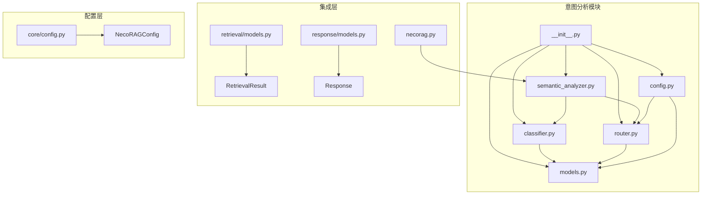
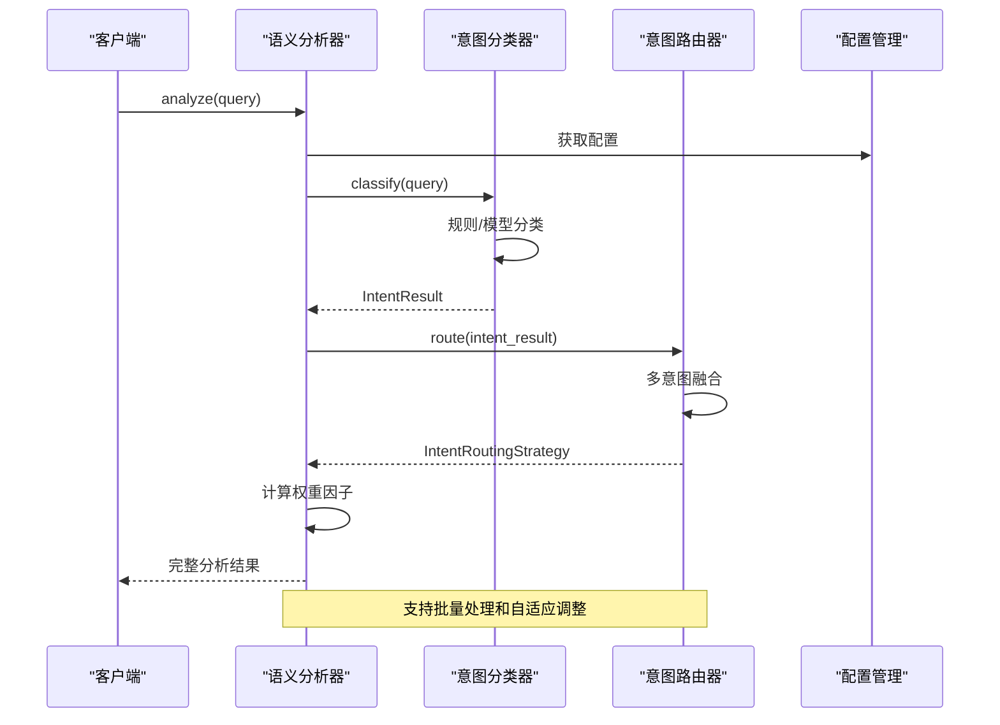
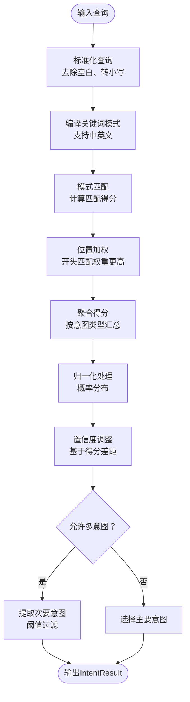
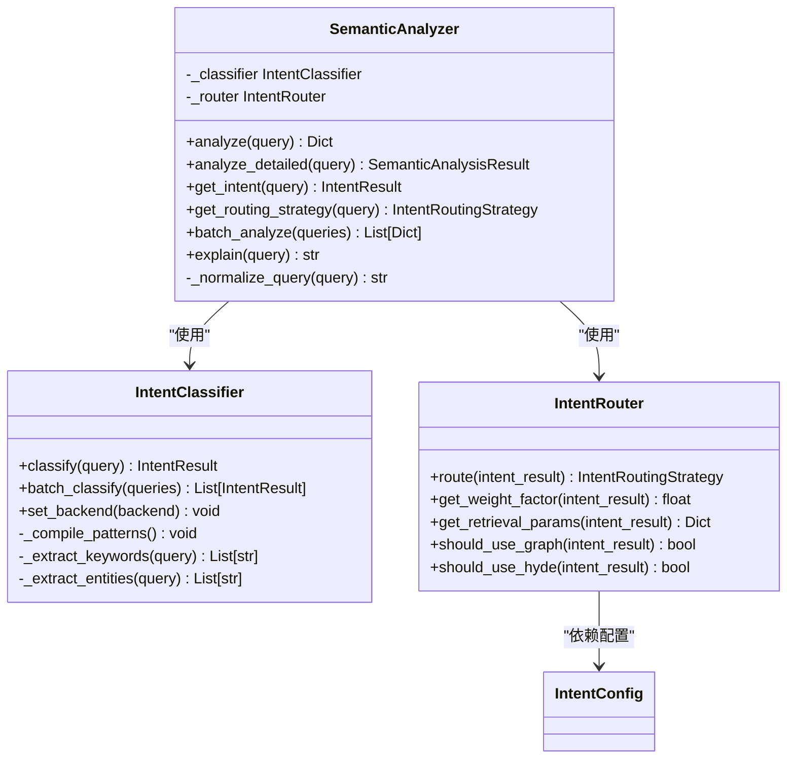
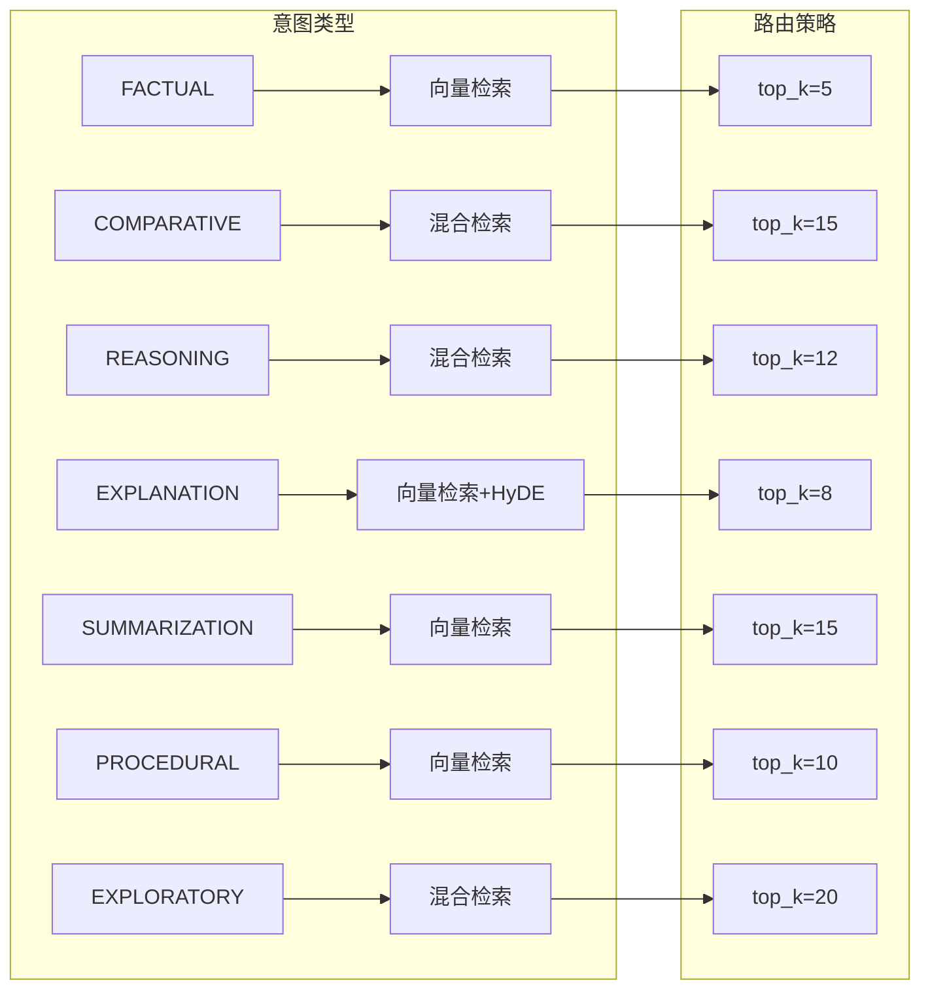
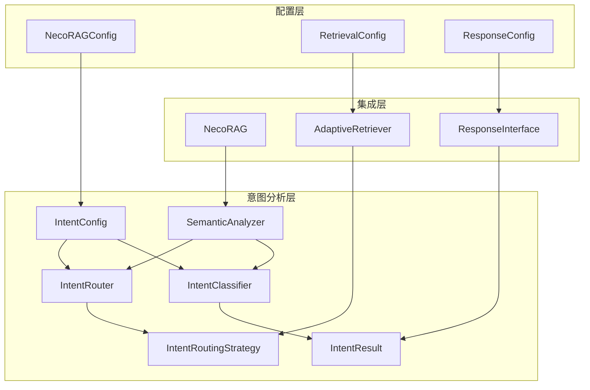
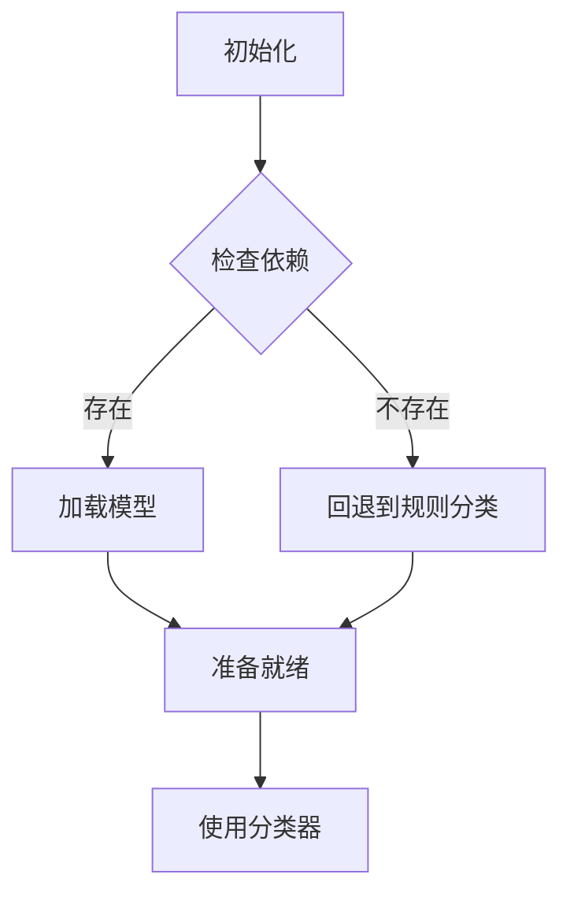
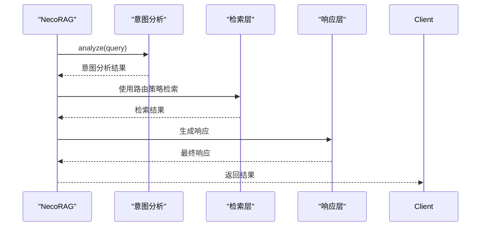

# 意图分析系统

<cite>
**本文档引用的文件**
- [src/intent/__init__.py](file://src/intent/__init__.py)
- [src/intent/classifier.py](file://src/intent/classifier.py)
- [src/intent/semantic_analyzer.py](file://src/intent/semantic_analyzer.py)
- [src/intent/router.py](file://src/intent/router.py)
- [src/intent/models.py](file://src/intent/models.py)
- [src/intent/config.py](file://src/intent/config.py)
- [src/necorag.py](file://src/necorag.py)
- [src/retrieval/models.py](file://src/retrieval/models.py)
- [src/response/models.py](file://src/response/models.py)
- [src/core/config.py](file://src/core/config.py)
</cite>

## 目录
1. [简介](#简介)
2. [项目结构](#项目结构)
3. [核心组件](#核心组件)
4. [架构概览](#架构概览)
5. [详细组件分析](#详细组件分析)
6. [依赖分析](#依赖分析)
7. [性能考虑](#性能考虑)
8. [故障排除指南](#故障排除指南)
9. [结论](#结论)
10. [附录](#附录)

## 简介
意图分析系统是 NecoRAG 框架中的关键模块，负责在用户查询到达检索层之前进行语义分析和意图识别。该系统通过多种分类后端（规则分类、FastText、Transformer）提供灵活的意图识别能力，并通过路由策略将查询分发到最适合的处理模块。

系统的核心目标是：
- 准确识别用户查询的意图类型
- 为检索层提供优化的路由策略
- 支持查询增强和权重调整
- 提供完整的配置管理和调优能力

## 项目结构
意图分析系统位于 `src/intent/` 目录下，包含以下核心文件：

**图表来源**
- [src/intent/__init__.py:1-83](file://src/intent/__init__.py#L1-L83)
- [src/intent/classifier.py:1-487](file://src/intent/classifier.py#L1-L487)
- [src/intent/semantic_analyzer.py:1-352](file://src/intent/semantic_analyzer.py#L1-L352)
- [src/intent/router.py:1-349](file://src/intent/router.py#L1-L349)

**章节来源**
- [src/intent/__init__.py:1-83](file://src/intent/__init__.py#L1-L83)

## 核心组件
意图分析系统由四个核心组件构成，每个组件都有明确的职责分工：

### 1. 意图类型枚举
系统定义了8种不同的意图类型，每种类型对应特定的查询特征和处理策略：

| 意图类型 | 描述 | 特征关键词 | 检索策略 |
|---------|------|-----------|----------|
| FACTUAL | 事实查询 | "是多少"、"多少"、"哪里" | 向量检索，top_k=5 |
| COMPARATIVE | 比较分析 | "区别"、"差异"、"对比" | 混合检索，图谱+HyDE |
| REASONING | 推理演绎 | "为什么"、"因果"、"机制" | 混合检索，强调图谱 |
| EXPLANATION | 概念解释 | "什么是"、"定义"、"解释" | 向量检索，启用HyDE |
| SUMMARIZATION | 摘要总结 | "总结"、"概括"、"要点" | 向量检索，top_k=15 |
| PROCEDURAL | 操作指导 | "如何"、"步骤"、"配置" | 向量检索，强调关键词 |
| EXPLORATORY | 探索发散 | "有哪些"、"列举"、"推荐" | 混合检索，多样性优先 |

### 2. 意图分类器
意图分类器支持三种不同的分类后端，提供从轻量级到高性能的完整解决方案：

- **规则分类后端**：无需外部依赖，使用正则表达式模式匹配
- **FastText后端**：基于 Facebook AI Research 的 FastText 模型
- **Transformer后端**：基于 Hugging Face Transformers 的预训练模型

### 3. 语义分析器
语义分析器提供统一的接口，整合意图分类和路由功能，支持批量处理和详细分析。

### 4. 意图路由器
路由器根据意图分类结果确定最优的检索策略，支持多意图融合和自适应调整。

**章节来源**
- [src/intent/models.py:12-25](file://src/intent/models.py#L12-L25)
- [src/intent/config.py:81-153](file://src/intent/config.py#L81-L153)

## 架构概览
意图分析系统采用分层架构设计，确保模块间的松耦合和高内聚：

**图表来源**
- [src/intent/semantic_analyzer.py:69-122](file://src/intent/semantic_analyzer.py#L69-L122)
- [src/intent/classifier.py:84-112](file://src/intent/classifier.py#L84-L112)
- [src/intent/router.py:54-77](file://src/intent/router.py#L54-L77)

## 详细组件分析

### 意图分类器实现原理

#### 规则分类算法
规则分类器使用正则表达式模式匹配实现，具有以下特点：

**图表来源**
- [src/intent/classifier.py:113-205](file://src/intent/classifier.py#L113-L205)

#### 关键词提取策略
系统实现了多层次的关键词提取机制：

1. **基于 jieba 的高级提取**：使用 TF-IDF 算法提取关键词
2. **简单关键词提取**：不依赖外部库的基础实现
3. **实体识别**：使用词性标注识别命名实体

#### 性能特性
- **时间复杂度**：O(n*m)，其中 n 是查询长度，m 是模式数量
- **空间复杂度**：O(k)，其中 k 是匹配结果数量
- **延迟加载**：模型和分词器按需加载，减少内存占用

**章节来源**
- [src/intent/classifier.py:113-323](file://src/intent/classifier.py#L113-L323)

### 语义分析器工作流程

#### 统一接口设计
语义分析器提供多种分析模式：

**图表来源**
- [src/intent/semantic_analyzer.py:24-314](file://src/intent/semantic_analyzer.py#L24-L314)
- [src/intent/classifier.py:19-58](file://src/intent/classifier.py#L19-L58)
- [src/intent/router.py:17-52](file://src/intent/router.py#L17-L52)

#### 查询增强策略
语义分析器支持多种查询增强技术：

1. **归一化处理**：去除多余空白和标点符号
2. **关键词提取**：识别查询中的关键信息
3. **实体识别**：提取命名实体用于检索优化
4. **权重调整**：根据意图类型调整检索权重

**章节来源**
- [src/intent/semantic_analyzer.py:69-148](file://src/intent/semantic_analyzer.py#L69-L148)

### 意图路由机制设计

#### 路由策略配置
每个意图类型都配置了专门的路由策略：

**图表来源**
- [src/intent/config.py:81-153](file://src/intent/config.py#L81-L153)

#### 多意图融合算法
当检测到多个意图时，系统使用加权融合策略：

1. **置信度加权**：主要意图权重占主导地位
2. **比例分配**：次要意图按置信度比例分配权重
3. **策略合并**：对路由参数进行加权平均

**章节来源**
- [src/intent/router.py:79-120](file://src/intent/router.py#L79-L120)

### 配置选项和调优方法

#### 分类器配置参数
| 参数 | 类型 | 默认值 | 说明 |
|------|------|--------|------|
| classifier_backend | str | "rule_based" | 分类后端选择 |
| confidence_threshold | float | 0.6 | 置信度阈值 |
| enable_multi_intent | bool | True | 是否支持多意图 |
| max_intents | int | 3 | 最大意图数量 |
| model_name | str | "bert-base-chinese" | Transformer模型名 |
| fasttext_model_path | Optional[str] | None | FastText模型路径 |

#### 路由策略配置
每个意图类型都有独立的路由策略配置，包括：
- 检索模式（vector、graph、hybrid、hyde）
- Top-K参数设置
- 图谱搜索开关
- HyDE增强开关
- 重排序策略

**章节来源**
- [src/intent/config.py:18-68](file://src/intent/config.py#L18-L68)
- [src/intent/config.py:246-256](file://src/intent/config.py#L246-L256)

## 依赖分析

### 组件间依赖关系

**图表来源**
- [src/intent/classifier.py:12-13](file://src/intent/classifier.py#L12-L13)
- [src/intent/router.py:10-11](file://src/intent/router.py#L10-L11)
- [src/intent/semantic_analyzer.py:16-18](file://src/intent/semantic_analyzer.py#L16-L18)

### 外部依赖管理
系统采用延迟加载策略管理外部依赖：

**图表来源**
- [src/intent/classifier.py:334-348](file://src/intent/classifier.py#L334-L348)

**章节来源**
- [src/intent/classifier.py:324-457](file://src/intent/classifier.py#L324-L457)

## 性能考虑

### 时间复杂度分析
- **规则分类**：O(n*m)，其中 n 是查询长度，m 是模式数量
- **FastText分类**：O(1)，模型已加载
- **Transformer分类**：O(L)，L为序列长度
- **批量处理**：线性扩展，适合大规模查询

### 内存优化策略
1. **延迟加载**：模型和分词器按需加载
2. **缓存机制**：关键词和实体提取结果缓存
3. **权重调整**：动态调整top_k参数优化内存使用

### 并发处理能力
- 支持批量分类处理
- 线程安全的配置管理
- 异步处理模式支持

## 故障排除指南

### 常见问题及解决方案

#### 分类器初始化失败
**症状**：分类器无法正常工作
**原因**：
- 外部依赖缺失
- 模型文件路径错误
- 配置参数不正确

**解决方案**：
1. 检查依赖包安装情况
2. 验证模型文件路径
3. 使用默认配置测试

#### 性能问题
**症状**：分类速度慢
**原因**：
- 模型过大
- 正则表达式过于复杂
- 批量处理参数不当

**解决方案**：
1. 使用规则分类后端
2. 简化正则表达式模式
3. 调整批量处理大小

#### 配置错误
**症状**：路由策略不符合预期
**原因**：
- 意图权重配置错误
- 路由策略参数不当
- 关键词模式不匹配

**解决方案**：
1. 检查意图权重配置
2. 验证路由策略设置
3. 调整关键词模式

**章节来源**
- [src/intent/classifier.py:334-348](file://src/intent/classifier.py#L334-L348)
- [src/intent/router.py:320-341](file://src/intent/router.py#L320-L341)

## 结论
意图分析系统通过精心设计的多层架构，提供了高效、准确的查询意图识别能力。系统的主要优势包括：

1. **灵活性**：支持多种分类后端，可根据需求选择
2. **可扩展性**：模块化设计便于功能扩展
3. **性能优化**：延迟加载和缓存机制提升性能
4. **易用性**：统一接口简化使用复杂度

系统在实际应用中能够有效提升检索质量和用户体验，为构建智能问答系统奠定了坚实基础。

## 附录

### 集成使用示例
系统与检索层和响应层的集成方式：

**图表来源**
- [src/necorag.py:351-421](file://src/necorag.py#L351-L421)

### 准确性评估指标
系统支持多种评估方法：
- **置信度阈值**：控制分类准确性
- **多意图融合**：提高复杂查询处理能力
- **自适应调整**：基于历史反馈优化策略

### 错误处理机制
- **异常捕获**：外部依赖加载失败时自动回退
- **日志记录**：详细的执行过程记录
- **降级策略**：关键功能失效时的备用方案