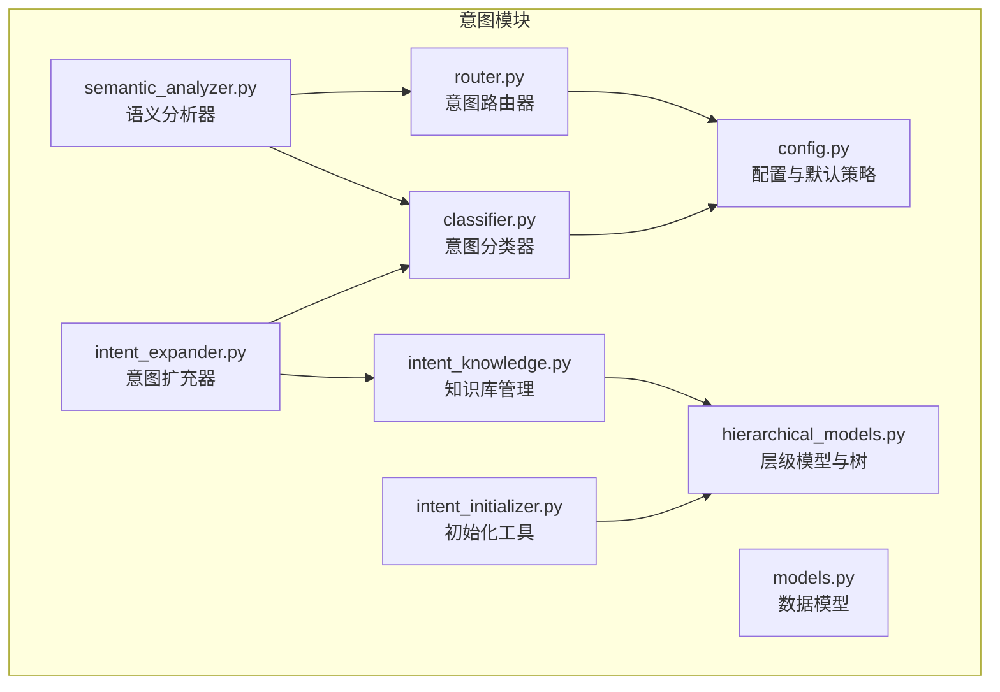
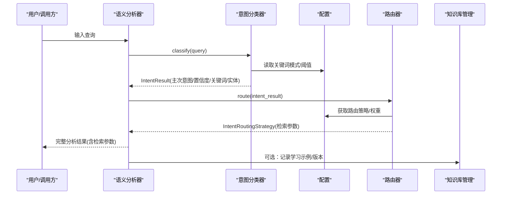
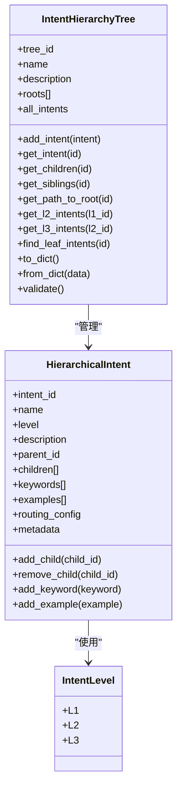
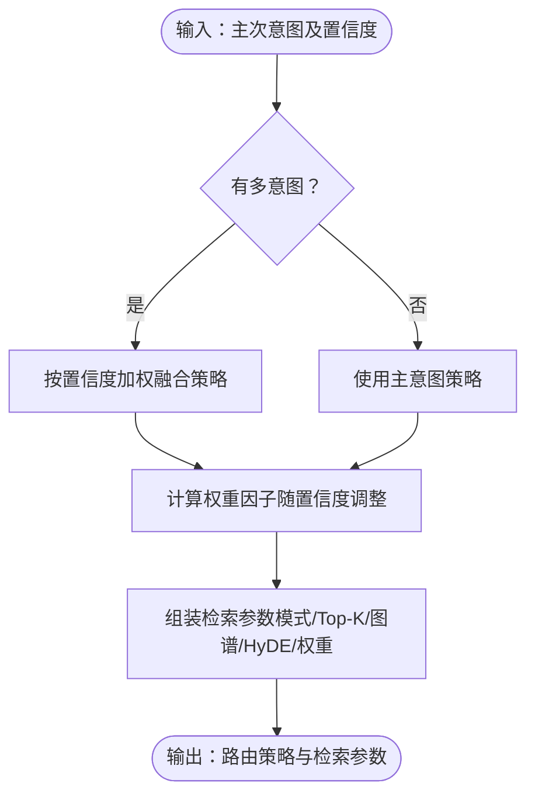
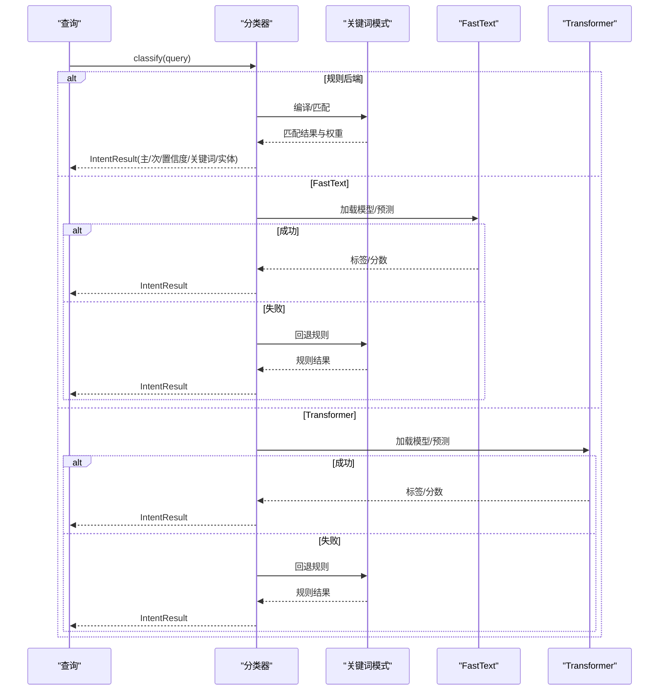
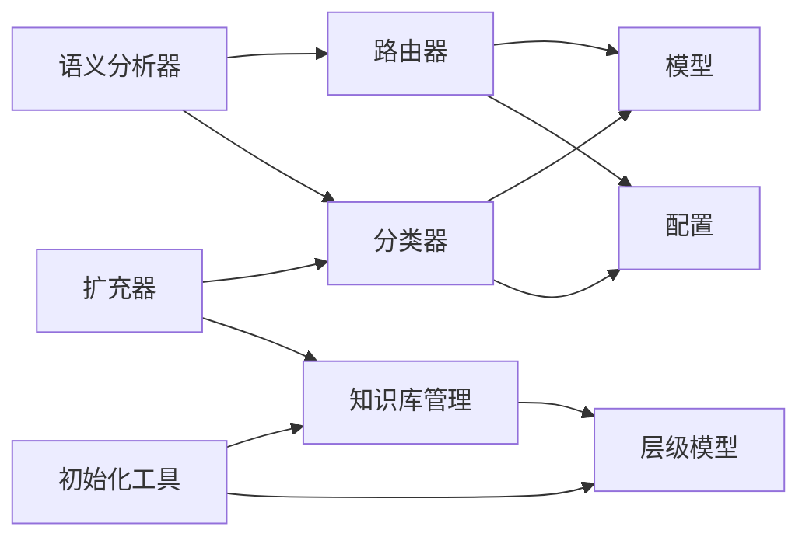

# 层次化模型

<cite>
**本文引用的文件**
- [hierarchical_models.py](file://src/intent/hierarchical_models.py)
- [classifier.py](file://src/intent/classifier.py)
- [models.py](file://src/intent/models.py)
- [router.py](file://src/intent/router.py)
- [intent_knowledge.py](file://src/intent/intent_knowledge.py)
- [config.py](file://src/intent/config.py)
- [intent_initializer.py](file://src/intent/intent_initializer.py)
- [semantic_analyzer.py](file://src/intent/semantic_analyzer.py)
- [intent_expander.py](file://src/intent/intent_expander.py)
- [test_classifier.py](file://tests/test_intent/test_classifier.py)
- [my_intent_system.json.json](file://src/intent/intent_knowledge/trees/my_intent_system.json.json)
- [v_20260319_171230.json](file://src/intent/intent_knowledge/versions/v_20260319_171230.json)
- [__init__.py](file://src/intent/__init__.py)
</cite>

## 目录
1. [简介](#简介)
2. [项目结构](#项目结构)
3. [核心组件](#核心组件)
4. [架构总览](#架构总览)
5. [详细组件分析](#详细组件分析)
6. [依赖分析](#依赖分析)
7. [性能考虑](#性能考虑)
8. [故障排查指南](#故障排查指南)
9. [结论](#结论)
10. [附录](#附录)

## 简介
本文件围绕 NecoRAG 的“层次化意图模型”展开，系统阐述三级意图体系（L1 宏观意图、L2 详细意图、L3 原子意图）的设计原理、层次结构组织、继承与决策流程、训练与评估方法、配置与参数调优、性能优化策略、使用示例与最佳实践，以及模型更新与版本管理流程，并提供与传统分类器的对比与迁移指南。

## 项目结构
层次化意图模型位于 src/intent 目录下，核心文件包括：
- hierarchical_models.py：定义层级枚举、节点与树结构，提供树的增删改查、路径遍历、叶子节点查找与完整性校验。
- models.py：定义意图类型、分类结果、路由策略与语义分析结果的数据结构。
- config.py：定义意图分类配置，含关键词模式、默认路由策略、意图权重等。
- classifier.py：基于规则、FastText、Transformer 的意图分类器。
- router.py：根据分类结果生成路由策略，支持多意图融合与权重因子计算。
- semantic_analyzer.py：统一语义分析入口，串联分类与路由。
- intent_knowledge.py：意图知识库管理，支持持久化、版本控制、学习数据缓存与统计。
- intent_initializer.py：意图初始化工具，快速构建自定义三级意图体系。
- intent_expander.py：意图扩充器，基于查询聚类与关键词提取自动扩展层级。

图表来源
- [hierarchical_models.py:1-400](file://src/intent/hierarchical_models.py#L1-L400)
- [models.py:1-231](file://src/intent/models.py#L1-L231)
- [config.py:1-333](file://src/intent/config.py#L1-L333)
- [classifier.py:1-493](file://src/intent/classifier.py#L1-L493)
- [router.py:1-350](file://src/intent/router.py#L1-L350)
- [semantic_analyzer.py:1-352](file://src/intent/semantic_analyzer.py#L1-L352)
- [intent_knowledge.py:1-407](file://src/intent/intent_knowledge.py#L1-L407)
- [intent_initializer.py:1-406](file://src/intent/intent_initializer.py#L1-L406)
- [intent_expander.py:1-451](file://src/intent/intent_expander.py#L1-L451)

章节来源
- [__init__.py:1-135](file://src/intent/__init__.py#L1-L135)

## 核心组件
- 层级模型与树
  - IntentLevel：L1/L2/L3 枚举。
  - HierarchicalIntent：节点，包含 ID、名称、层级、描述、父子关系、关键词、示例、路由配置与元数据。
  - IntentHierarchyTree：树，维护根节点集合、全部节点映射，提供添加节点、查询子/兄弟、路径到根、L2/L3 查询、叶子节点查找、序列化/反序列化与完整性校验（循环依赖检测）。
- 数据模型
  - IntentType：意图类型枚举（事实、比较、推理、解释、摘要、过程、探索）。
  - IntentResult：主次意图、置信度、关键词、实体。
  - IntentRoutingStrategy：检索模式、权重调整、图谱搜索开关、HyDE 开关、Top-K、重排序策略。
  - SemanticAnalysisResult：整合意图结果与路由策略的完整分析结果。
- 配置
  - IntentConfig：分类后端、模型名、置信度阈值、多意图开关、最大意图数、意图权重、路由策略、关键词模式。
- 分类器
  - IntentClassifier：规则、FastText、Transformer 三后端；关键词模式编译、规则分类打分、关键词/实体提取、批量分类、后端切换。
- 路由器
  - IntentRouter：基于主次意图的路由策略融合、权重因子计算、检索参数组装、是否使用图谱/ HyDE、Top-K 推荐、解释路由决策。
- 语义分析器
  - SemanticAnalyzer：统一入口，执行分类、路由、权重计算与检索参数生成，提供批量分析与解释。
- 知识库管理
  - IntentKnowledgeManager：树的创建、加载默认树、文件持久化、版本保存/加载、学习示例缓存、相似意图搜索、统计信息、版本列表。
- 初始化工具
  - IntentInitializer：自定义 L1/L2 构建、快速设置模板、添加 L3、自动填充 L3、保存/加载配置、设置指南。
- 意图扩充器
  - IntentExpander：查询模式分析、新意图发现、子意图扩展、意图细节细化、合并相似意图、关键词提取、路由配置推断。

章节来源
- [hierarchical_models.py:16-400](file://src/intent/hierarchical_models.py#L16-L400)
- [models.py:12-231](file://src/intent/models.py#L12-L231)
- [config.py:18-333](file://src/intent/config.py#L18-L333)
- [classifier.py:20-493](file://src/intent/classifier.py#L20-L493)
- [router.py:18-350](file://src/intent/router.py#L18-L350)
- [semantic_analyzer.py:24-352](file://src/intent/semantic_analyzer.py#L24-L352)
- [intent_knowledge.py:25-407](file://src/intent/intent_knowledge.py#L25-L407)
- [intent_initializer.py:21-406](file://src/intent/intent_initializer.py#L21-L406)
- [intent_expander.py:30-451](file://src/intent/intent_expander.py#L30-L451)

## 架构总览
层次化意图模型采用“配置驱动 + 规则优先”的设计，结合规则分类器与路由策略，形成可演进的三层意图体系。其核心流程如下：

图表来源
- [semantic_analyzer.py:69-122](file://src/intent/semantic_analyzer.py#L69-L122)
- [classifier.py:85-206](file://src/intent/classifier.py#L85-L206)
- [router.py:55-78](file://src/intent/router.py#L55-L78)
- [config.py:246-256](file://src/intent/config.py#L246-L256)
- [intent_knowledge.py:202-234](file://src/intent/intent_knowledge.py#L202-L234)

## 详细组件分析

### 层次化意图树与节点
- 设计要点
  - 以树形结构承载 L1-L3 三层关系，节点具备父子关系与关键词/示例等语义信息。
  - 提供路径到根、兄弟节点、L2/L3 查询、叶子节点收集等查询能力。
  - 完整性校验包含父节点存在性检查与循环依赖检测。
- 关键方法
  - add_intent、get_intent、get_children、get_siblings、get_path_to_root、get_l2_intents、get_l3_intents、find_leaf_intents、to_dict/from_dict、validate。
- 复杂度
  - 查询子/兄弟/路径：O(k)（k 为子节点数或层级深度）。
  - 完整性校验：O(N+E)，N 为节点数，E 为边数（父子关系）。
- 优化建议
  - 对频繁查询的兄弟/子节点缓存映射。
  - 循环检测可复用访问标记避免重复遍历。

图表来源
- [hierarchical_models.py:16-323](file://src/intent/hierarchical_models.py#L16-L323)

章节来源
- [hierarchical_models.py:105-323](file://src/intent/hierarchical_models.py#L105-L323)

### 意图类型与路由策略
- 意图类型
  - FACTUAL、COMPARATIVE、REASONING、EXPLANATION、SUMMARIZATION、PROCEDURAL、EXPLORATORY。
- 路由策略
  - 每种意图类型绑定检索模式、权重调整、图谱搜索、HyDE、Top-K、重排序策略。
  - 支持多意图融合：按置信度加权合并策略，权重因子随置信度动态调整。
- 关键方法
  - IntentRouter.route/_merge_strategies、get_weight_factor、get_retrieval_params、should_use_graph/should_use_hyde/get_optimal_top_k、explain_routing。
  - IntentRoutingStrategy.merge_with、to_dict/from_dict。

图表来源
- [router.py:55-121](file://src/intent/router.py#L55-L121)
- [router.py:123-197](file://src/intent/router.py#L123-L197)

章节来源
- [models.py:12-187](file://src/intent/models.py#L12-L187)
- [router.py:18-270](file://src/intent/router.py#L18-L270)

### 意图分类器（规则/ML 后端）
- 规则分类
  - 编译关键词模式（中/英），按匹配位置加权，归一化得分，按阈值与差距调整置信度，支持多意图与次要意图筛选。
- ML 后端
  - FastText：本地模型加载失败回退规则。
  - Transformer：模型加载失败回退规则。
- 关键方法
  - classify/_rule_based_classify/_fasttext_classify/_transformer_classify、关键词/实体提取、batch_classify、set_backend。
- 性能
  - 规则分类 O(n_words)；ML 后端受模型与张量运算影响。

图表来源
- [classifier.py:85-458](file://src/intent/classifier.py#L85-L458)

章节来源
- [classifier.py:20-493](file://src/intent/classifier.py#L20-L493)
- [config.py:155-244](file://src/intent/config.py#L155-L244)

### 语义分析器与统一接口
- 功能
  - 联合分类与路由，生成标准化分析结果，提供批量分析、解释路由、便捷函数 quick_analyze。
- 输出
  - 完整字段：原始/归一化查询、主/次意图、置信度、关键词/实体、路由策略、意图权重因子、检索参数。

章节来源
- [semantic_analyzer.py:24-352](file://src/intent/semantic_analyzer.py#L24-L352)

### 意图知识库与版本管理
- 能力
  - 创建/加载/保存树；保存版本；学习示例缓存与导出/导入；相似意图搜索；统计信息；版本列表。
- 使用场景
  - 模型上线后持续学习用户查询，自动扩充 L3 子意图，版本化管理意图树变更。

章节来源
- [intent_knowledge.py:25-407](file://src/intent/intent_knowledge.py#L25-L407)

### 意图初始化与自动扩充
- 初始化
  - 快速设置模板（3-6 个基础意图），自定义 L2 子意图，保存/加载配置。
- 自动扩充
  - 基于查询聚类与关键词提取，自动创建 L3 子意图，细化关键词与示例，合并相似意图。

章节来源
- [intent_initializer.py:21-406](file://src/intent/intent_initializer.py#L21-L406)
- [intent_expander.py:30-451](file://src/intent/intent_expander.py#L30-L451)

## 依赖分析
- 模块耦合
  - SemanticAnalyzer 依赖 IntentClassifier 与 IntentRouter；IntentRouter 依赖 IntentConfig；IntentClassifier 依赖 IntentConfig 与 models。
  - IntentKnowledgeManager 依赖 hierarchical_models 与 config；IntentInitializer 依赖 hierarchical_models、intent_knowledge、intent_expander。
  - IntentExpander 依赖 knowledge_manager、classifier、models。
- 外部依赖
  - 规则分类：纯 Python，无外部依赖。
  - FastText：可选，缺失时回退规则。
  - Transformers：可选，缺失时回退规则。

图表来源
- [semantic_analyzer.py:56-67](file://src/intent/semantic_analyzer.py#L56-L67)
- [classifier.py:40-58](file://src/intent/classifier.py#L40-L58)
- [router.py:45-53](file://src/intent/router.py#L45-L53)
- [intent_knowledge.py:37-67](file://src/intent/intent_knowledge.py#L37-L67)
- [intent_initializer.py:28-38](file://src/intent/intent_initializer.py#L28-L38)
- [intent_expander.py:37-49](file://src/intent/intent_expander.py#L37-L49)

章节来源
- [__init__.py:93-135](file://src/intent/__init__.py#L93-L135)

## 性能考虑
- 规则分类
  - 关键词模式编译一次，后续匹配线性扫描；建议：
    - 控制关键词数量与复杂度，避免过多正则。
    - 对高频查询建立轻量缓存（如关键词命中缓存）。
- ML 后端
  - FastText/Transformer 模型加载成本高，建议：
    - 预热加载，进程内复用。
    - 批量推理，减少模型调用次数。
- 路由策略
  - 多意图融合按置信度加权，注意避免过度拆分导致策略碎片化。
- 树查询
  - 对兄弟/子节点查询频繁的场景，可缓存映射以降低遍历成本。
- I/O 与持久化
  - 知识库与版本保存建议异步或批量执行，避免阻塞主线程。

## 故障排查指南
- 分类结果异常
  - 检查关键词模式是否覆盖目标查询；调整置信度阈值与多意图开关。
  - 使用 explain_routing 获取路由决策说明，定位策略问题。
- 后端不可用
  - FastText/Transformer 缺失或加载失败时自动回退规则；检查依赖安装与模型路径。
- 树结构问题
  - 使用 validate 检查父节点缺失与循环依赖；必要时重建树或修复父子关系。
- 学习数据与版本
  - 导入/导出失败检查文件权限与 JSON 格式；版本加载失败检查版本 ID 与文件存在性。

章节来源
- [router.py:238-269](file://src/intent/router.py#L238-L269)
- [classifier.py:325-458](file://src/intent/classifier.py#L325-L458)
- [hierarchical_models.py:273-323](file://src/intent/hierarchical_models.py#L273-L323)
- [intent_knowledge.py:271-298](file://src/intent/intent_knowledge.py#L271-L298)

## 结论
层次化意图模型通过“规则优先 + 配置驱动 + 可演进树结构”，在无需大规模标注的前提下实现稳健的意图识别与路由。配合知识库与自动扩充工具，可在生产环境中持续优化意图体系，提升检索质量与用户体验。建议在工程实践中重视配置管理、版本控制与性能优化，确保系统稳定与高效。

## 附录

### 训练与评估方法
- 训练
  - 规则分类：通过关键词模式与权重迭代优化；可引入人工标注示例增强规则。
  - ML 后端：准备标注数据，训练 FastText/Transformer 分类器；评估指标见下节。
- 评估
  - 常用指标：准确率、召回率、F1、Top-K 检索命中率、重排序效果（NDCG/MRR）。
  - A/B 测试：对比规则与 ML 后端在真实流量上的表现，动态切换后端。
  - 业务指标：检索相关性、用户满意度、响应时间。

章节来源
- [test_classifier.py:1-493](file://tests/test_intent/test_classifier.py#L1-L493)

### 配置管理与参数调优
- 关键配置项
  - 分类后端、置信度阈值、多意图开关、最大意图数、意图权重、路由策略、关键词模式。
- 调优建议
  - 置信度阈值：根据误检率与漏检率平衡；多意图开启需结合业务场景。
  - 路由策略：针对不同意图类型调整检索模式、Top-K 与权重因子。
  - 关键词模式：覆盖典型查询变体，避免过度泛化。

章节来源
- [config.py:18-333](file://src/intent/config.py#L18-L333)

### 使用示例与最佳实践
- 快速上手
  - 使用 quick_analyze 获取基本分析结果；通过 create_analyzer 指定后端与参数。
- 构建三级意图体系
  - 使用 IntentInitializer 快速设置模板，随后自动填充 L3 子意图。
- 持续优化
  - 收集用户查询，使用 IntentKnowledgeManager 记录学习示例，定期保存版本。
- 最佳实践
  - 从模板起步，逐步细化；数据驱动优化；定期评估与 A/B 测试；版本化管理。

章节来源
- [semantic_analyzer.py:340-352](file://src/intent/semantic_analyzer.py#L340-L352)
- [intent_initializer.py:311-393](file://src/intent/intent_initializer.py#L311-L393)
- [intent_knowledge.py:118-179](file://src/intent/intent_knowledge.py#L118-L179)

### 模型更新与版本管理
- 流程
  - 基于学习数据与用户反馈扩展 L3 子意图；调整关键词与路由策略；保存当前树与版本；回滚时加载历史版本。
- 文件参考
  - 自定义树文件与版本文件示例：my_intent_system.json.json、v_20260319_171230.json。

章节来源
- [intent_knowledge.py:118-179](file://src/intent/intent_knowledge.py#L118-L179)
- [my_intent_system.json.json:1-273](file://src/intent/intent_knowledge/trees/my_intent_system.json.json#L1-L273)
- [v_20260319_171230.json:1-508](file://src/intent/intent_knowledge/versions/v_20260319_171230.json#L1-L508)

### 与传统分类器的对比与迁移
- 对比
  - 规则分类：无需训练、可解释性强、部署简单；对未覆盖场景鲁棒性有限。
  - ML 分类：泛化能力强；依赖数据与资源；需持续训练与评估。
- 迁移建议
  - 以规则分类为基线，逐步引入 ML 后端；通过 A/B 测试验证收益；回退策略确保稳定性。

章节来源
- [classifier.py:20-60](file://src/intent/classifier.py#L20-L60)
- [test_classifier.py:334-373](file://tests/test_intent/test_classifier.py#L334-L373)