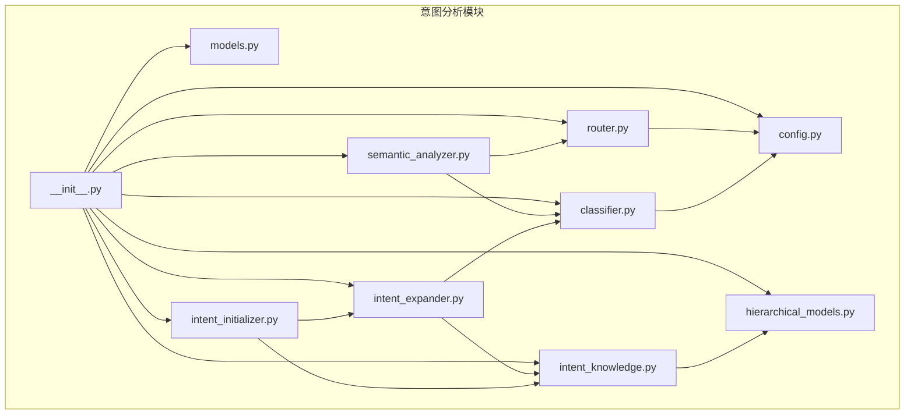
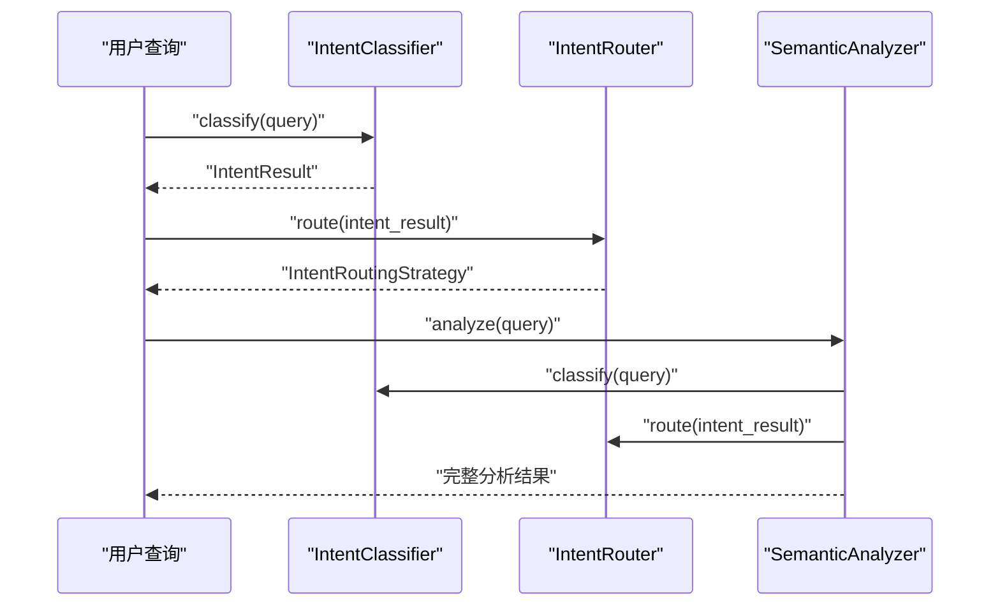
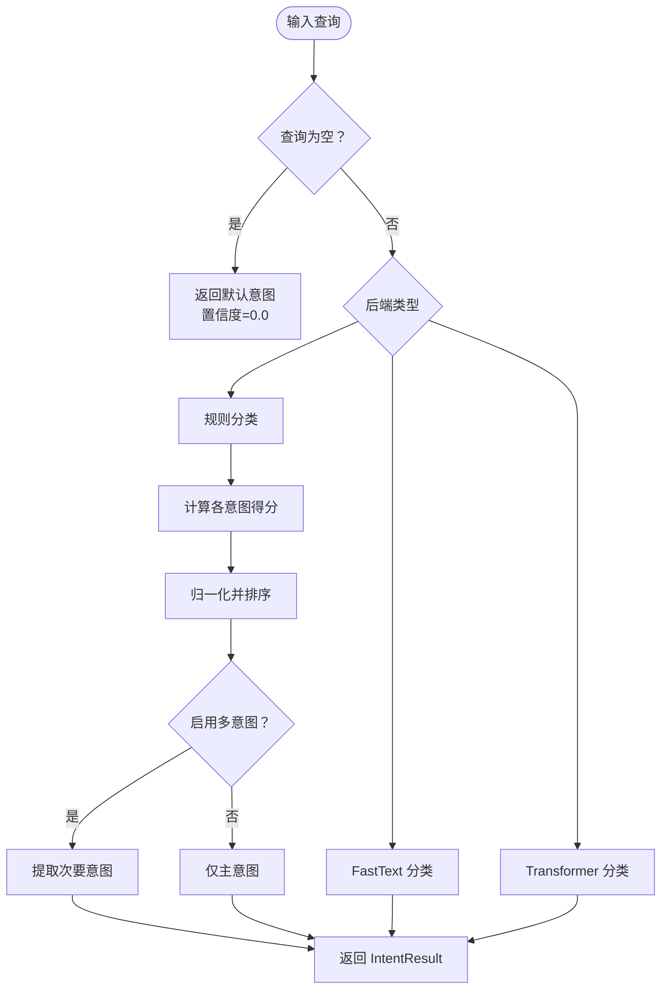
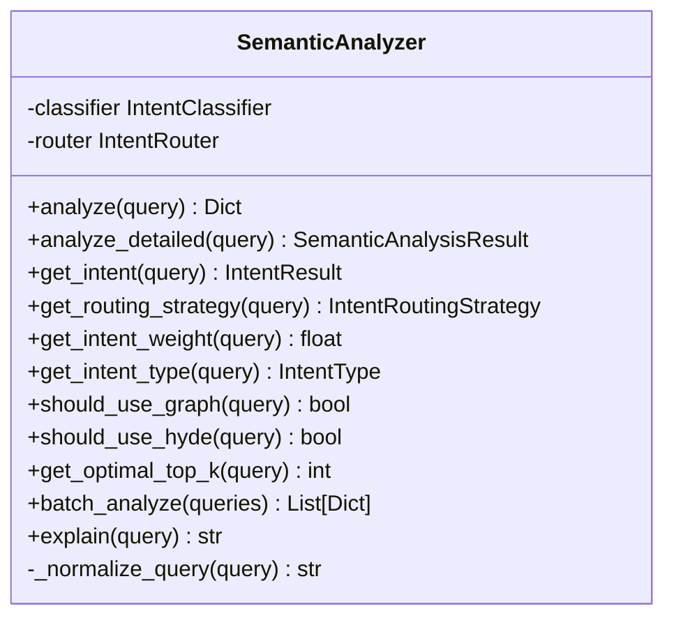
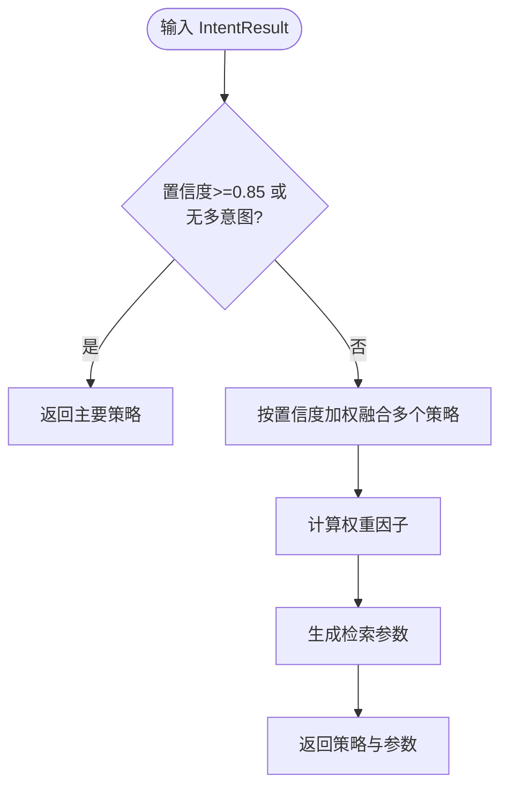
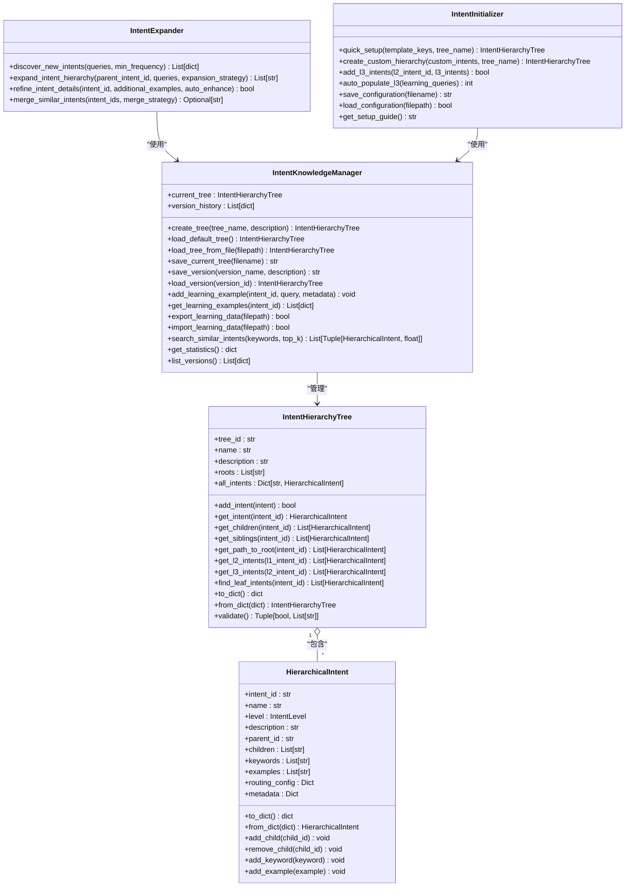
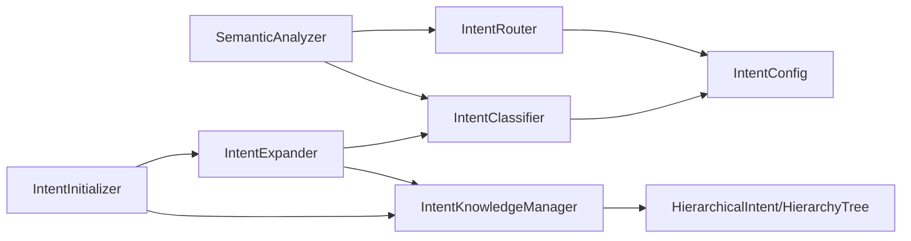

# 意图分析系统

<cite>
**本文引用的文件**   
- [README.md](file://src/intent/README.md)
- [classifier.py](file://src/intent/classifier.py)
- [router.py](file://src/intent/router.py)
- [semantic_analyzer.py](file://src/intent/semantic_analyzer.py)
- [models.py](file://src/intent/models.py)
- [config.py](file://src/intent/config.py)
- [hierarchical_models.py](file://src/intent/hierarchical_models.py)
- [intent_knowledge.py](file://src/intent/intent_knowledge.py)
- [intent_expander.py](file://src/intent/intent_expander.py)
- [intent_initializer.py](file://src/intent/intent_initializer.py)
- [__init__.py](file://src/intent/__init__.py)
- [test_classifier.py](file://tests/test_intent/test_classifier.py)
- [my_intent_system.json.json](file://src/intent/intent_knowledge/trees/my_intent_system.json.json)
- [v_20260319_171230.json](file://src/intent/intent_knowledge/versions/v_20260319_171230.json)
- [intent_initialization_complete.py](file://example/intent_initialization_complete.py)
</cite>

## 目录
1. [简介](#简介)
2. [项目结构](#项目结构)
3. [核心组件](#核心组件)
4. [架构总览](#架构总览)
5. [详细组件分析](#详细组件分析)
6. [依赖关系分析](#依赖关系分析)
7. [性能考虑](#性能考虑)
8. [故障排查指南](#故障排查指南)
9. [结论](#结论)
10. [附录](#附录)

## 简介
本文件为 NecoRAG 意图分析系统的实现文档，聚焦于多级分类体系的意图识别机制、语义分析器、意图路由器、意图扩展与演化、层次化意图管理、意图知识库管理以及准确率评估与性能优化策略。系统支持 7 大类语义意图，提供规则、FastText、Transformer 三种分类后端，并通过自适应路由器与检索策略映射实现智能分发。

## 项目结构
意图分析模块位于 src/intent 目录，包含分类器、语义分析器、路由器、配置、数据模型、层次化意图模型、知识库管理、意图扩充与初始化工具等核心文件。模块对外通过 __init__.py 统一导出，便于上层检索与智能路由引擎集成。

**图表来源**
- [__init__.py:1-135](file://src/intent/__init__.py#L1-L135)
- [classifier.py:1-493](file://src/intent/classifier.py#L1-L493)
- [semantic_analyzer.py:1-352](file://src/intent/semantic_analyzer.py#L1-L352)
- [router.py:1-350](file://src/intent/router.py#L1-L350)
- [models.py:1-231](file://src/intent/models.py#L1-L231)
- [config.py:1-333](file://src/intent/config.py#L1-L333)
- [hierarchical_models.py:1-400](file://src/intent/hierarchical_models.py#L1-L400)
- [intent_knowledge.py:1-407](file://src/intent/intent_knowledge.py#L1-L407)
- [intent_expander.py:1-451](file://src/intent/intent_expander.py#L1-L451)
- [intent_initializer.py:1-406](file://src/intent/intent_initializer.py#L1-L406)

**章节来源**
- [README.md:1-416](file://src/intent/README.md#L1-L416)
- [__init__.py:1-135](file://src/intent/__init__.py#L1-L135)

## 核心组件
- 意图分类器：支持规则、FastText、Transformer 三类后端，提供关键词匹配、实体/关键词提取、多意图检测与批量分类。
- 语义分析器：整合分类与路由，提供统一分析接口、查询归一化、权重因子与检索参数输出。
- 意图路由器：依据置信度与意图类型，选择单一或融合策略，支持自适应调整与解释输出。
- 数据模型与配置：定义意图类型、结果、路由策略、配置参数与默认策略映射。
- 层次化意图模型：三级意图树（L1/L2/L3），支持父子关系、路径查询、叶子节点查找与校验。
- 意图知识库：持久化意图树、版本管理、学习数据缓存与导出、相似意图搜索、统计信息。
- 意图扩充器：基于查询模式发现新意图、自动扩展子意图、合并相似意图、细化意图细节。
- 意图初始化器：模板快速构建、自定义层级、自动填充 L3、保存/加载与版本管理。

**章节来源**
- [classifier.py:20-493](file://src/intent/classifier.py#L20-L493)
- [semantic_analyzer.py:24-352](file://src/intent/semantic_analyzer.py#L24-L352)
- [router.py:18-350](file://src/intent/router.py#L18-L350)
- [models.py:12-231](file://src/intent/models.py#L12-L231)
- [config.py:18-333](file://src/intent/config.py#L18-L333)
- [hierarchical_models.py:16-400](file://src/intent/hierarchical_models.py#L16-L400)
- [intent_knowledge.py:25-407](file://src/intent/intent_knowledge.py#L25-L407)
- [intent_expander.py:30-451](file://src/intent/intent_expander.py#L30-L451)
- [intent_initializer.py:21-406](file://src/intent/intent_initializer.py#L21-L406)

## 架构总览
意图分析系统采用“分类-路由-分析”三层协作架构：分类器识别意图类型与置信度；路由器根据置信度与策略映射选择检索模式；语义分析器提供统一接口与检索参数，同时可输出解释。层次化意图模型与知识库支撑意图体系的演进与版本控制。

**图表来源**
- [semantic_analyzer.py:69-148](file://src/intent/semantic_analyzer.py#L69-L148)
- [router.py:55-78](file://src/intent/router.py#L55-L78)
- [classifier.py:85-113](file://src/intent/classifier.py#L85-L113)

## 详细组件分析

### 意图分类器（IntentClassifier）
- 多后端支持：规则（默认）、FastText、Transformer；自动回退至规则分类。
- 关键词与实体提取：内置简单分词/实体提取，支持 jieba 依赖时增强。
- 多意图检测：基于置信度排序与阈值过滤，支持次要意图输出。
- 批量分类与后端切换：便于批处理与运行时切换。

**图表来源**
- [classifier.py:85-206](file://src/intent/classifier.py#L85-L206)
- [classifier.py:325-383](file://src/intent/classifier.py#L325-L383)
- [classifier.py:385-458](file://src/intent/classifier.py#L385-L458)

**章节来源**
- [classifier.py:20-493](file://src/intent/classifier.py#L20-L493)
- [test_classifier.py:18-493](file://tests/test_intent/test_classifier.py#L18-L493)

### 语义分析器（SemanticAnalyzer）
- 统一接口：封装分类与路由，输出标准化结果，包含意图、置信度、关键词、实体、路由策略、权重因子与检索参数。
- 查询归一化：去除多余空白与尾部标点，便于下游检索。
- 辅助查询：快速获取意图、路由策略、权重因子、意图类型、是否使用图谱/ HyDE、最优 top_k 等。
- 批量分析与解释：支持批量与人类可读解释输出。

**图表来源**
- [semantic_analyzer.py:24-352](file://src/intent/semantic_analyzer.py#L24-L352)

**章节来源**
- [semantic_analyzer.py:24-352](file://src/intent/semantic_analyzer.py#L24-L352)

### 意图路由器（IntentRouter）
- 单策略路由：高置信度（>0.7）直接采用主要意图策略。
- 双策略融合：中置信度下，按置信度加权融合多个意图策略。
- 自适应路由器：记录策略历史反馈，动态调整 top_k 等参数。
- 权重因子：结合基础权重与置信度，计算综合权重因子，支持次要意图贡献。
- 检索参数：输出检索模式、top_k、图谱开关、HyDE 开关、重排序策略与权重调整。

**图表来源**
- [router.py:55-78](file://src/intent/router.py#L55-L78)
- [router.py:80-121](file://src/intent/router.py#L80-L121)
- [router.py:123-164](file://src/intent/router.py#L123-L164)
- [router.py:166-197](file://src/intent/router.py#L166-L197)

**章节来源**
- [router.py:18-350](file://src/intent/router.py#L18-L350)

### 层次化意图模型与知识库
- 层次化模型：支持 L1（宏观）、L2（具体）、L3（原子）三级结构，提供父子关系、路径查询、兄弟节点、叶子节点查找与树校验。
- 意图知识库：持久化意图树、版本管理、学习数据缓存与导出、相似意图搜索、统计信息与版本列表。
- 意图扩充器：发现新意图候选、自动扩展子意图、合并相似意图、细化意图细节。
- 意图初始化器：模板快速构建、自定义层级、自动填充 L3、保存/加载与版本管理。

**图表来源**
- [hierarchical_models.py:23-400](file://src/intent/hierarchical_models.py#L23-L400)
- [intent_knowledge.py:25-407](file://src/intent/intent_knowledge.py#L25-L407)
- [intent_expander.py:30-451](file://src/intent/intent_expander.py#L30-L451)
- [intent_initializer.py:21-406](file://src/intent/intent_initializer.py#L21-L406)

**章节来源**
- [hierarchical_models.py:16-400](file://src/intent/hierarchical_models.py#L16-L400)
- [intent_knowledge.py:25-407](file://src/intent/intent_knowledge.py#L25-L407)
- [intent_expander.py:30-451](file://src/intent/intent_expander.py#L30-L451)
- [intent_initializer.py:21-406](file://src/intent/intent_initializer.py#L21-L406)

### 概念解释与上下文分析
- 概念解释：强调语义检索与层级上下文，适合解释性与定义性问题。
- 上下文分析：通过关键词、实体、复杂度评估与领域识别，辅助路由策略选择。
- 多语言处理：中文使用深度语义模型，英文使用工业级 NLP，其他语言采用规则匹配。

**章节来源**
- [README.md:107-153](file://src/intent/README.md#L107-L153)

### 智能路由与策略选择
- 策略映射：每类意图对应检索模式、图谱开关、HyDE 开关、top_k 与重排序策略。
- 路由决策：高置信度单策略、中置信度融合策略、低置信度通用降级。
- 自适应调整：基于历史反馈动态调整 top_k，提升检索效率与效果。

**章节来源**
- [README.md:61-105](file://src/intent/README.md#L61-L105)
- [router.py:18-350](file://src/intent/router.py#L18-L350)

### 意图扩展与演化
- 发现新意图：统计查询模式、提取共同关键词、计算置信度与建议层级。
- 自动扩展：为父意图创建子意图，生成名称与描述，填充关键词与示例。
- 合并与细化：合并相似意图、保留最佳意图并合并特征、自动增强关键词与路由配置。

**章节来源**
- [intent_expander.py:80-200](file://src/intent/intent_expander.py#L80-L200)
- [intent_expander.py:245-331](file://src/intent/intent_expander.py#L245-L331)

### 层次化意图管理与版本控制
- 意图树：支持 L1/L2/L3 三级结构，父子关系与路径查询。
- 版本管理：保存当前树与历史版本，支持版本加载与统计信息。
- 初始化与填充：模板快速构建、自定义层级、自动填充 L3、保存/加载。

**章节来源**
- [hierarchical_models.py:105-323](file://src/intent/hierarchical_models.py#L105-L323)
- [intent_knowledge.py:141-201](file://src/intent/intent_knowledge.py#L141-L201)
- [intent_initializer.py:107-284](file://src/intent/intent_initializer.py#L107-L284)

### 意图知识库管理
- 学习数据：缓存学习示例，支持导出/导入，便于迁移与备份。
- 统计与搜索：统计总数、层级分布、示例与关键词数量；相似意图搜索。
- 版本维护：版本列表、版本详情与加载。

**章节来源**
- [intent_knowledge.py:202-298](file://src/intent/intent_knowledge.py#L202-L298)
- [intent_knowledge.py:343-393](file://src/intent/intent_knowledge.py#L343-L393)

### v3.3.0-alpha 版本特性
- 本仓库未提供 v3.3.0-alpha 的独立变更记录，但意图模块持续迭代，包含：
  - 意图初始化器的模板快速构建与自动填充 L3。
  - 意图知识库的版本管理与学习数据导出。
  - 意图扩充器的发现、扩展、合并与细化能力。
  - 语义分析器与路由器的统一接口与解释输出。

**章节来源**
- [intent_initialization_complete.py:1-407](file://example/intent_initialization_complete.py#L1-L407)
- [my_intent_system.json.json:1-273](file://src/intent/intent_knowledge/trees/my_intent_system.json.json#L1-L273)
- [v_20260319_171230.json:1-508](file://src/intent/intent_knowledge/versions/v_20260319_171230.json#L1-L508)

## 依赖关系分析
- 组件耦合：语义分析器依赖分类器与路由器；路由器依赖配置；分类器依赖配置与模型；知识库管理器依赖层次化模型；扩充器与初始化器依赖知识库管理器。
- 外部依赖：FastText、Transformers、PyTorch（可选），jieba（可选），spaCy（可选）。
- 循环依赖：模块间通过接口与数据类传递，未见循环导入。

**图表来源**
- [semantic_analyzer.py:56-67](file://src/intent/semantic_analyzer.py#L56-L67)
- [router.py:45-53](file://src/intent/router.py#L45-L53)
- [classifier.py:40-58](file://src/intent/classifier.py#L40-L58)
- [intent_knowledge.py:37-67](file://src/intent/intent_knowledge.py#L37-L67)
- [intent_expander.py:37-49](file://src/intent/intent_expander.py#L37-L49)
- [intent_initializer.py:28-38](file://src/intent/intent_initializer.py#L28-L38)

**章节来源**
- [models.py:12-231](file://src/intent/models.py#L12-L231)
- [config.py:18-333](file://src/intent/config.py#L18-L333)

## 性能考虑
- 缓存机制：配置项支持缓存与 TTL，减少重复计算。
- 批量处理：分类器与分析器均支持批量输入，提升吞吐。
- 异步处理：语义分析器提供异步风格的分析流程。
- 模型量化：FastText 支持量化以加速推理。
- 自适应调整：路由器根据历史反馈动态调整 top_k，平衡效果与性能。

**章节来源**
- [README.md:187-204](file://src/intent/README.md#L187-L204)
- [config.py:318-332](file://src/intent/config.py#L318-L332)
- [router.py:289-342](file://src/intent/router.py#L289-L342)

## 故障排查指南
- 意图识别不准确：检查训练数据质量、调整置信度阈值、添加自定义规则。
- 中文理解效果差：确保使用更强模型、提供领域示例、检查 API Key。
- 多意图处理不当：启用多意图检测、查看检测结果权重、调整阈值。
- FastText/Transformer 未安装：回退至规则分类，或安装相应依赖。
- 版本加载失败：检查版本文件路径与格式，确认树结构有效性。

**章节来源**
- [README.md:314-363](file://src/intent/README.md#L314-L363)
- [test_classifier.py:334-373](file://tests/test_intent/test_classifier.py#L334-L373)

## 结论
NecoRAG 意图分析系统通过规则、FastText、Transformer 三类后端实现稳健的多语言意图识别，结合语义分析器与路由器提供统一的检索策略分发。层次化意图模型与知识库管理支撑意图体系的持续演化与版本控制，配合意图扩充器实现从数据驱动的自动细化与扩展。系统具备良好的可扩展性与可维护性，适用于生产环境的智能检索与问答场景。

## 附录
- API 参考与使用示例可参考模块文档与示例脚本。
- 配置项与默认策略映射详见配置模块。
- 测试覆盖了分类器初始化、规则分类、关键词/实体提取、多意图、后端切换与批量处理等场景。

**章节来源**
- [README.md:365-398](file://src/intent/README.md#L365-L398)
- [intent_initialization_complete.py:1-407](file://example/intent_initialization_complete.py#L1-L407)