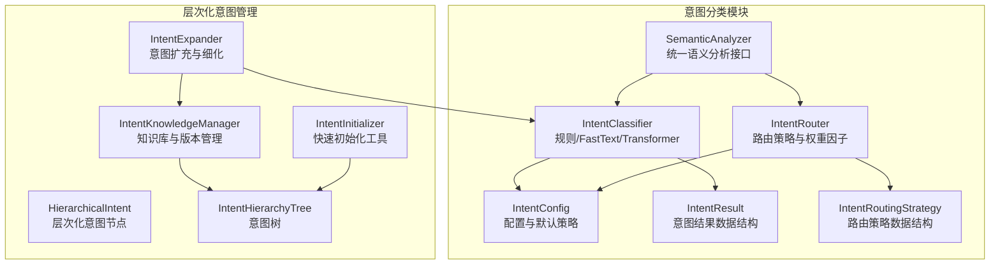
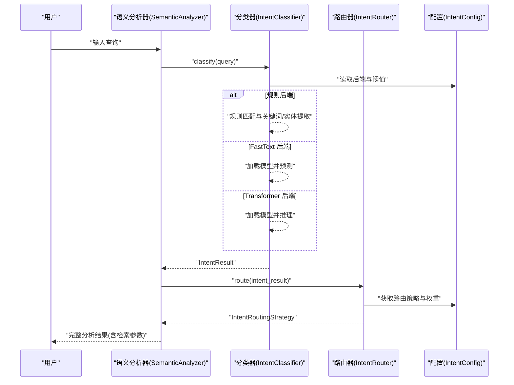
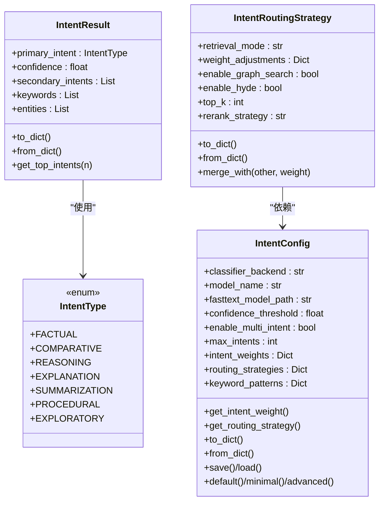
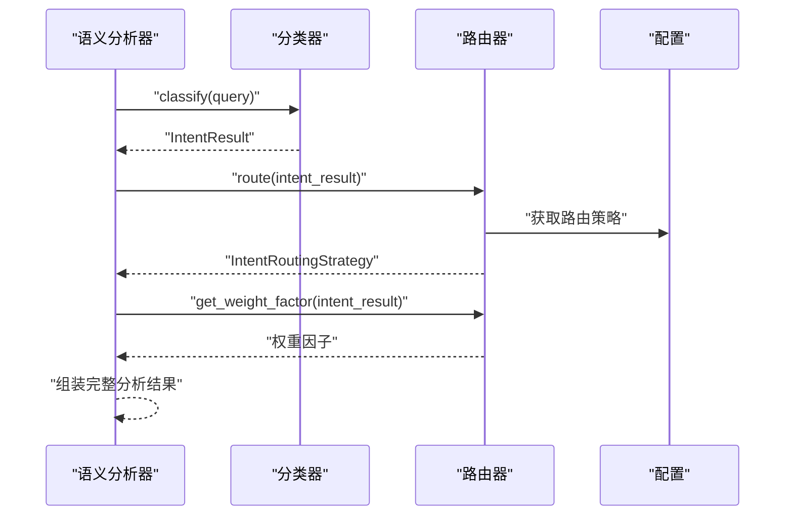
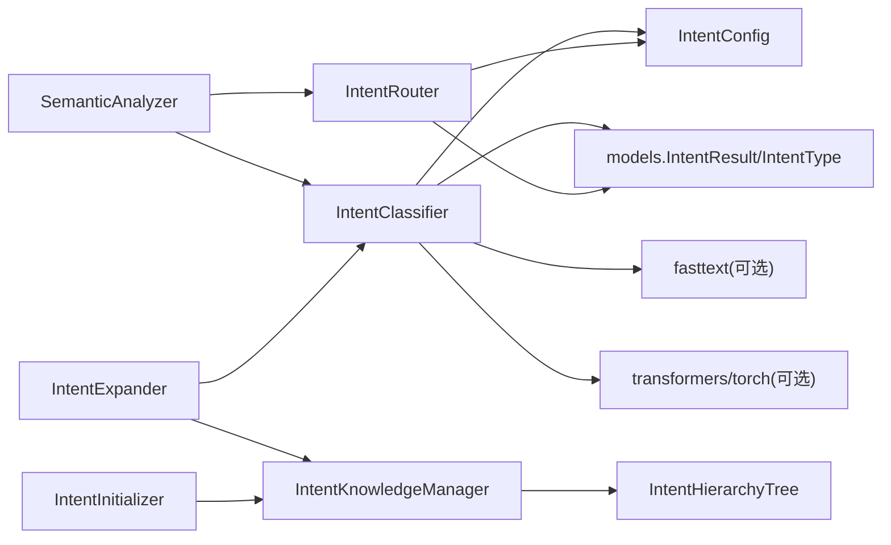

# 意图分类器

<cite>
**本文档引用的文件**
- [classifier.py](file://src/intent/classifier.py)
- [config.py](file://src/intent/config.py)
- [models.py](file://src/intent/models.py)
- [router.py](file://src/intent/router.py)
- [semantic_analyzer.py](file://src/intent/semantic_analyzer.py)
- [intent_knowledge.py](file://src/intent/intent_knowledge.py)
- [intent_expander.py](file://src/intent/intent_expander.py)
- [hierarchical_models.py](file://src/intent/hierarchical_models.py)
- [intent_initializer.py](file://src/intent/intent_initializer.py)
- [base.py](file://src/core/base.py)
- [test_classifier.py](file://tests/test_intent/test_classifier.py)
- [__init__.py](file://src/intent/__init__.py)
</cite>

## 目录
1. [简介](#简介)
2. [项目结构](#项目结构)
3. [核心组件](#核心组件)
4. [架构总览](#架构总览)
5. [详细组件分析](#详细组件分析)
6. [依赖关系分析](#依赖关系分析)
7. [性能考虑](#性能考虑)
8. [故障排查指南](#故障排查指南)
9. [结论](#结论)
10. [附录](#附录)

## 简介
本文件为 NecoRAG 意图分类器的详细实现文档，涵盖七类语义意图的定义与识别算法，以及规则基础、FastText、Transformer 等多种分类后端的实现原理与适用场景。文档还解释了意图置信度计算、次要意图识别、关键词提取、配置管理、性能优化与准确率评估方法，并提供不同后端的使用示例与性能对比分析。

## 项目结构
意图分类器位于 src/intent 目录下，采用模块化设计，包含分类器、路由器、语义分析器、配置与数据模型、层次化意图管理与扩充工具等组件。整体遵循“规则优先、可插拔后端”的设计理念，既保证零依赖即可运行，又支持高性能的机器学习后端。

图表来源
- [classifier.py:20-493](file://src/intent/classifier.py#L20-L493)
- [router.py:18-350](file://src/intent/router.py#L18-L350)
- [semantic_analyzer.py:24-352](file://src/intent/semantic_analyzer.py#L24-L352)
- [config.py:18-333](file://src/intent/config.py#L18-L333)
- [models.py:12-231](file://src/intent/models.py#L12-L231)
- [intent_knowledge.py:25-407](file://src/intent/intent_knowledge.py#L25-L407)
- [intent_expander.py:30-451](file://src/intent/intent_expander.py#L30-L451)
- [hierarchical_models.py:23-400](file://src/intent/hierarchical_models.py#L23-L400)
- [intent_initializer.py:21-406](file://src/intent/intent_initializer.py#L21-L406)

章节来源
- [__init__.py:1-135](file://src/intent/__init__.py#L1-L135)

## 核心组件
- 意图类型枚举：定义七类语义意图（事实查询、比较分析、推理演绎、概念解释、摘要总结、操作指导、探索发散），用于统一建模与跨模块共享。
- 意图结果数据结构：封装主要意图、置信度、次要意图列表、关键词与实体，支持序列化与反序列化。
- 路由策略数据结构：定义检索模式、图谱搜索开关、HyDE 增强、Top-K、重排序策略与权重因子，用于将意图映射到检索配置。
- 配置类：集中管理分类后端、模型名称、置信度阈值、多意图开关、最大意图数、意图权重与路由策略模板。
- 分类器：支持规则、FastText、Transformer 三种后端；内置关键词提取与实体抽取；支持批量分类与后端切换。
- 路由器：根据意图结果与配置生成路由策略，计算权重因子，支持多意图融合与自适应调整。
- 语义分析器：提供统一接口，整合分类与路由，输出完整分析结果与检索参数。
- 层次化意图管理：支持意图树的创建、保存/加载、版本管理、学习数据导入导出、相似意图搜索与统计。
- 意图扩充器：基于查询模式与关键词聚类自动发现新意图、扩展现有意图树、细化意图细节与合并相似意图。
- 意图初始化器：提供模板化快速设置与自定义层级意图树构建。

章节来源
- [models.py:12-231](file://src/intent/models.py#L12-L231)
- [config.py:18-333](file://src/intent/config.py#L18-L333)
- [classifier.py:20-493](file://src/intent/classifier.py#L20-L493)
- [router.py:18-350](file://src/intent/router.py#L18-L350)
- [semantic_analyzer.py:24-352](file://src/intent/semantic_analyzer.py#L24-L352)
- [intent_knowledge.py:25-407](file://src/intent/intent_knowledge.py#L25-L407)
- [intent_expander.py:30-451](file://src/intent/intent_expander.py#L30-L451)
- [hierarchical_models.py:23-400](file://src/intent/hierarchical_models.py#L23-L400)
- [intent_initializer.py:21-406](file://src/intent/intent_initializer.py#L21-L406)

## 架构总览
意图分类器采用“规则优先 + 可插拔后端”的架构，规则分类作为默认后端，无需外部依赖；当启用 FastText 或 Transformer 后端时，按需加载模型并进行预测。路由器将意图结果映射为检索策略，语义分析器提供统一入口。

图表来源
- [semantic_analyzer.py:69-122](file://src/intent/semantic_analyzer.py#L69-L122)
- [classifier.py:85-112](file://src/intent/classifier.py#L85-L112)
- [router.py:55-78](file://src/intent/router.py#L55-L78)
- [config.py:36-50](file://src/intent/config.py#L36-L50)

## 详细组件分析

### 意图类型与识别算法
- 事实查询（factual）：聚焦具体事实与数据，关键词模式偏向疑问词与时间地点等限定词。
- 比较分析（comparative）：强调对比、差异与优劣，关键词模式包含“区别/对比/哪个好”等。
- 推理演绎（reasoning）：关注因果关系与逻辑推导，关键词模式包含“为什么/因为/所以/导致”等。
- 概念解释（explanation）：要求定义、含义与解释，关键词模式包含“什么是/定义/解释”等。
- 摘要总结（summarization）：要求概括与要点提炼，关键词模式包含“总结/概括/要点/摘要”等。
- 操作指导（procedural）：强调步骤、方法与流程，关键词模式包含“如何/怎么/步骤/方法/教程”等。
- 探索发散（exploratory）：开放式探索与列举，关键词模式包含“有哪些/有什么/列举/推荐”等。

识别算法要点
- 规则分类：对中英文关键词模式进行正则匹配，按匹配位置与权重计算得分，归一化后排序，得到主次意图与置信度。
- FastText 分类：加载本地模型，进行预测并解析标签，转换为意图类型与置信度。
- Transformer 分类：使用 AutoModelForSequenceClassification，编码后 softmax 得到概率分布，取 top-k 作为结果。

章节来源
- [models.py:12-25](file://src/intent/models.py#L12-L25)
- [config.py:155-244](file://src/intent/config.py#L155-L244)
- [classifier.py:114-206](file://src/intent/classifier.py#L114-L206)
- [classifier.py:325-383](file://src/intent/classifier.py#L325-L383)
- [classifier.py:385-458](file://src/intent/classifier.py#L385-L458)

### 关键词与实体提取
- 关键词提取：优先使用 jieba（TF-IDF）提取，若不可用则使用简单分词与停用词过滤策略；英文按单词提取，中文按连续字符片段提取。
- 实体提取：优先使用 jieba 词性标注（名词、专有名词），若不可用则提取引号内容、大写开头英文词与包含大写字母/数字的术语。

章节来源
- [classifier.py:208-323](file://src/intent/classifier.py#L208-L323)

### 置信度计算与次要意图识别
- 规则后端置信度：基于得分差距与阈值差调整，避免相近意图的高置信度误判；默认置信度范围限制在 0.3~0.95。
- 多意图识别：当开启多意图且置信度分布存在显著差距时，返回 top-k 次要意图；次要意图阈值相对较低。
- 置信度归一化：将各意图得分求和后归一化，确保概率分布特性。

章节来源
- [classifier.py:166-198](file://src/intent/classifier.py#L166-L198)

### 路由策略与权重因子
- 路由策略：根据意图类型配置默认策略，包含检索模式（向量/图谱/混合/HyDE）、Top-K、重排序策略与权重因子调整。
- 权重因子：结合意图基础权重与置信度进行加权，次要意图贡献按比例折算；最终权重限制在合理区间，用于调整检索结果的最终得分。

章节来源
- [config.py:81-153](file://src/intent/config.py#L81-L153)
- [router.py:123-164](file://src/intent/router.py#L123-L164)

### 分类后端实现与适用场景
- 规则后端（rule_based）
  - 优点：零依赖、轻量、可解释性强、适合中小规模部署。
  - 适用：开发调试、低资源环境、对准确性要求不高的场景。
- FastText 后端（fasttext）
  - 优点：速度快、模型体积小、适合在线推理。
  - 适用：实时性要求较高、已有训练好的模型。
  - 注意：需正确配置模型路径，否则回退到规则后端。
- Transformer 后端（transformer）
  - 优点：准确性高、泛化能力强、可微调。
  - 适用：对准确性要求高、有 GPU 资源与训练数据。
  - 注意：需安装 transformers 与 torch，推理时进行截断与 softmax。

章节来源
- [classifier.py:325-383](file://src/intent/classifier.py#L325-L383)
- [classifier.py:385-458](file://src/intent/classifier.py#L385-L458)
- [config.py:37-39](file://src/intent/config.py#L37-L39)

### 类图：核心数据结构与关系

图表来源
- [models.py:12-231](file://src/intent/models.py#L12-L231)
- [config.py:18-333](file://src/intent/config.py#L18-L333)

### 语义分析器与路由器协作流程

图表来源
- [semantic_analyzer.py:69-122](file://src/intent/semantic_analyzer.py#L69-L122)
- [router.py:55-78](file://src/intent/router.py#L55-L78)
- [router.py:123-164](file://src/intent/router.py#L123-L164)

### 层次化意图管理与扩充
- 意图树：支持 L1（宏观）、L2（具体）、L3（原子）三级结构，提供父子关系维护与路径查询。
- 知识库：支持意图树的持久化、版本管理、学习数据导入导出与统计信息。
- 扩充器：基于查询聚类与关键词分析自动发现新意图，细化意图细节，合并相似意图。
- 初始化器：提供模板化快速设置与自定义层级意图树构建。

章节来源
- [hierarchical_models.py:105-323](file://src/intent/hierarchical_models.py#L105-L323)
- [intent_knowledge.py:25-407](file://src/intent/intent_knowledge.py#L25-L407)
- [intent_expander.py:30-451](file://src/intent/intent_expander.py#L30-L451)
- [intent_initializer.py:21-406](file://src/intent/intent_initializer.py#L21-L406)

## 依赖关系分析
- 分类器依赖配置类与数据模型；可插拔后端依赖外部库（fasttext、transformers/torch）。
- 路由器依赖配置类与数据模型；语义分析器组合分类器与路由器。
- 层次化管理组件独立于分类器，但与分类器共享意图类型与结果结构。

图表来源
- [classifier.py:40-58](file://src/intent/classifier.py#L40-L58)
- [router.py:45-53](file://src/intent/router.py#L45-L53)
- [semantic_analyzer.py:56-66](file://src/intent/semantic_analyzer.py#L56-L66)
- [intent_knowledge.py:37-67](file://src/intent/intent_knowledge.py#L37-L67)
- [intent_expander.py:37-49](file://src/intent/intent_expander.py#L37-L49)
- [intent_initializer.py:28-38](file://src/intent/intent_initializer.py#L28-L38)

## 性能考虑
- 规则后端
  - 优势：无需外部依赖，启动快，内存占用低。
  - 优化：正则编译一次复用；关键词模式尽量简洁；避免复杂回溯。
- FastText 后端
  - 优势：推理速度快，适合在线服务。
  - 优化：模型文件放置在本地 SSD；批处理推理；合理设置 Top-K。
- Transformer 后端
  - 优势：准确性高。
  - 优化：GPU 推理；批处理；max_length 截断；softmax 后 top-k 限制；模型量化（可选）。
- 通用优化
  - 关键词与实体提取：优先使用 jieba；不可用时降级到简单实现。
  - 置信度阈值：根据业务需求调整，避免过多低置信度请求进入下游。
  - 多意图：谨慎开启，避免过多次要意图影响检索效率。

[本节为通用性能讨论，不直接分析具体文件]

## 故障排查指南
- FastText/Transformer 后端不可用
  - 现象：分类器回退到规则后端。
  - 排查：检查依赖是否安装、模型路径是否正确、日志是否有异常。
- 空查询或空白查询
  - 现象：返回事实查询与默认置信度。
  - 处理：前端过滤空输入；后端已做容错。
- 多意图识别异常
  - 现象：次要意图为空或置信度过低。
  - 处理：调整阈值与最大意图数；检查关键词模式覆盖度。
- 路由策略不符合预期
  - 现象：检索模式或 Top-K 与预期不符。
  - 处理：检查配置文件与默认策略；必要时手动覆盖。

章节来源
- [classifier.py:335-350](file://src/intent/classifier.py#L335-L350)
- [classifier.py:396-413](file://src/intent/classifier.py#L396-L413)
- [test_classifier.py:354-373](file://tests/test_intent/test_classifier.py#L354-L373)

## 结论
NecoRAG 意图分类器通过规则、FastText 与 Transformer 三类后端满足不同场景需求，结合层次化意图管理与语义分析器，实现了从意图识别到检索策略映射的完整闭环。规则后端保证零依赖与可解释性，机器学习后端提升准确性；路由器与权重因子确保检索配置与业务目标一致。通过配置管理、性能优化与故障排查指南，可在生产环境中稳定落地。

[本节为总结性内容，不直接分析具体文件]

## 附录

### 使用示例与性能对比
- 规则后端示例
  - 适用：开发调试、低资源环境。
  - 特点：无需安装额外依赖，启动即用。
- FastText 后端示例
  - 适用：实时性要求高、已有模型。
  - 注意：需配置模型路径，否则回退规则。
- Transformer 后端示例
  - 适用：准确性优先、具备 GPU 资源。
  - 注意：需安装 transformers 与 torch，推理时进行截断与 softmax。

章节来源
- [classifier.py:27-38](file://src/intent/classifier.py#L27-L38)
- [config.py:315-332](file://src/intent/config.py#L315-L332)
- [test_classifier.py:354-373](file://tests/test_intent/test_classifier.py#L354-L373)

### 配置管理与评估方法
- 配置管理
  - 通过 IntentConfig 控制后端、阈值、多意图与路由策略；支持保存/加载与最小/高级配置。
- 准确率评估
  - 建议：准备标注数据集，分别评估规则、FastText、Transformer 后端在七类意图上的准确率、召回率与 F1；结合置信度阈值调优与多意图策略。

章节来源
- [config.py:298-332](file://src/intent/config.py#L298-L332)
- [test_classifier.py:403-445](file://tests/test_intent/test_classifier.py#L403-L445)