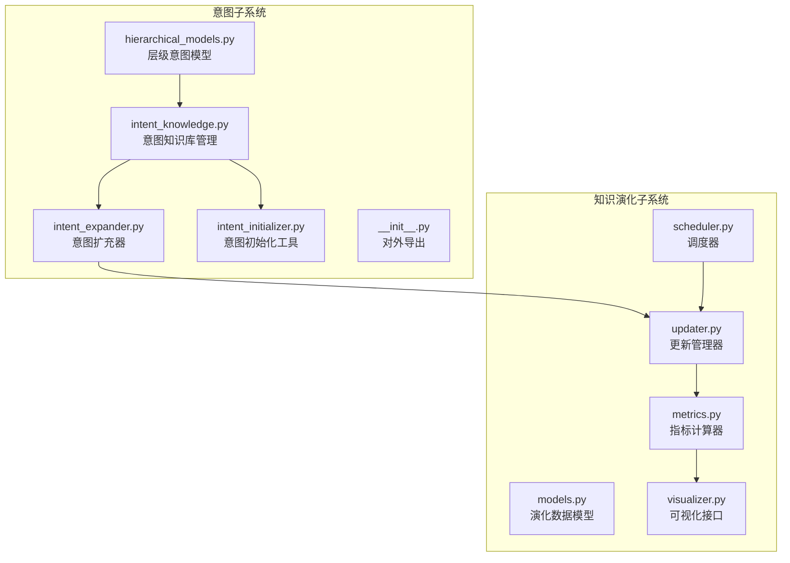
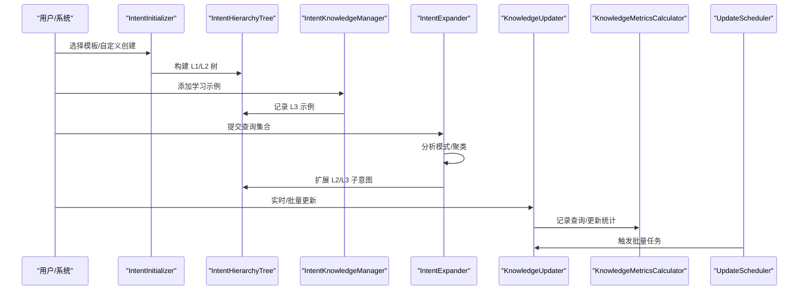
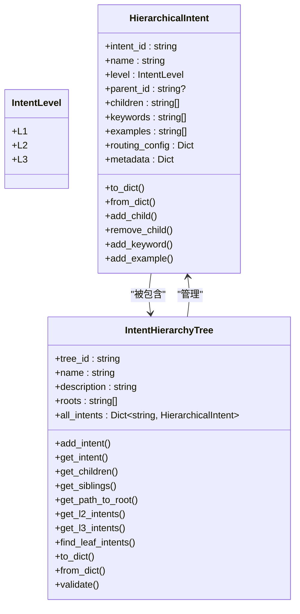
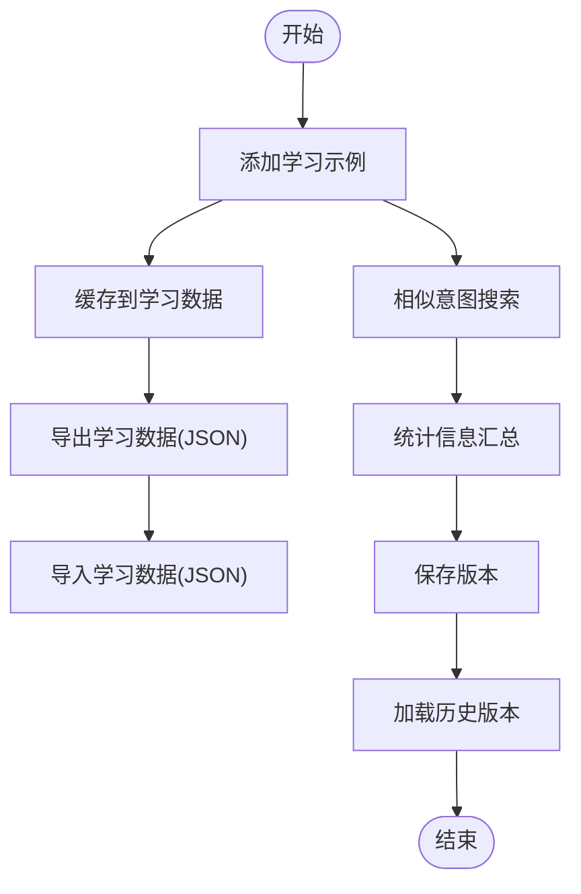
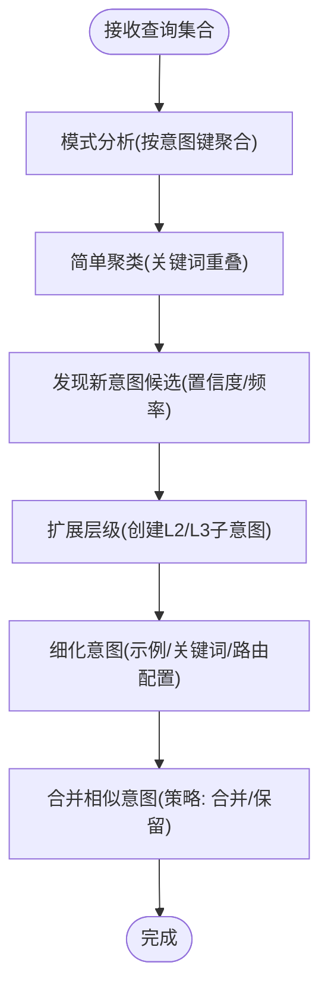
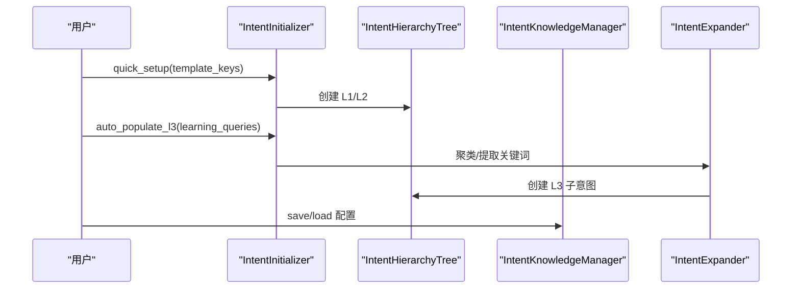
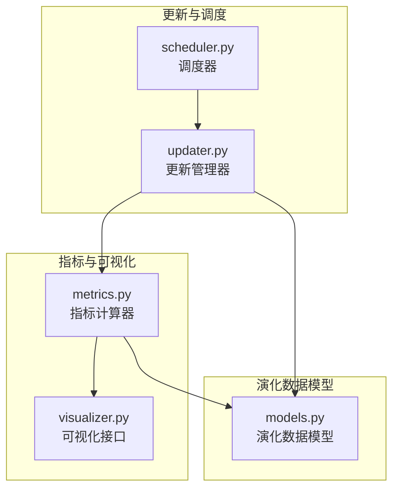
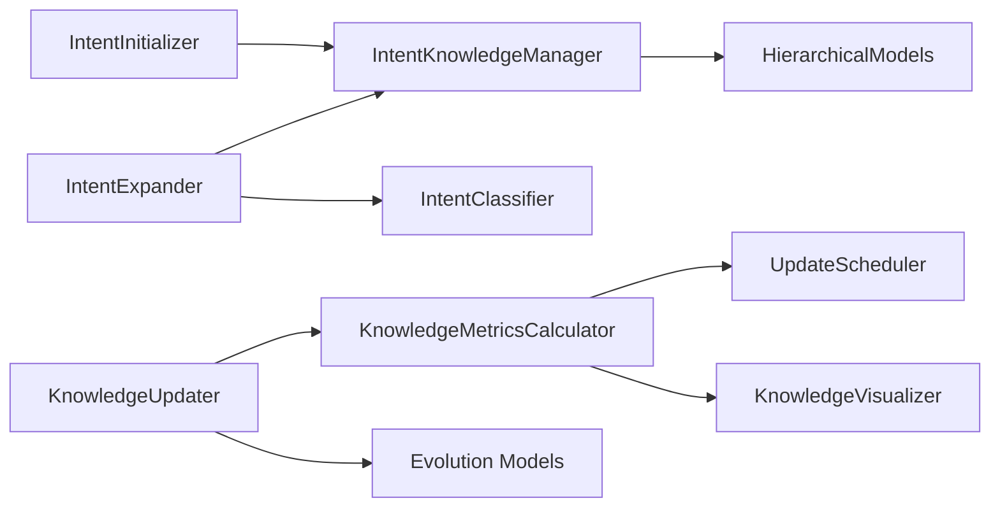

# 意图扩展

<cite>
**本文引用的文件**
- [INTENT_IMPLEMENTATION_SUMMARY.md](file://src/intent/INTENT_IMPLEMENTATION_SUMMARY.md)
- [INTENT_QUICKREF.md](file://src/intent/INTENT_QUICKREF.md)
- [INTENT_SETUP_GUIDE.md](file://src/intent/INTENT_SETUP_GUIDE.md)
- [__init__.py](file://src/intent/__init__.py)
- [hierarchical_models.py](file://src/intent/hierarchical_models.py)
- [intent_knowledge.py](file://src/intent/intent_knowledge.py)
- [intent_expander.py](file://src/intent/intent_expander.py)
- [intent_initializer.py](file://src/intent/intent_initializer.py)
- [models.py](file://src/knowledge_evolution/models.py)
- [metrics.py](file://src/knowledge_evolution/metrics.py)
- [updater.py](file://src/knowledge_evolution/updater.py)
- [scheduler.py](file://src/knowledge_evolution/scheduler.py)
- [visualizer.py](file://src/knowledge_evolution/visualizer.py)
</cite>

## 目录
1. [简介](#简介)
2. [项目结构](#项目结构)
3. [核心组件](#核心组件)
4. [架构总览](#架构总览)
5. [详细组件分析](#详细组件分析)
6. [依赖分析](#依赖分析)
7. [性能考量](#性能考量)
8. [故障排查指南](#故障排查指南)
9. [结论](#结论)
10. [附录](#附录)

## 简介
本文件面向“意图扩展”功能，系统化阐述 NecoRAG v3.3.0-alpha 中引入的三层级意图管理体系与知识演化机制。内容覆盖：
- 意图演化追踪与知识更新流程
- 意图知识库的采集、存储与版本维护
- 意图树结构的构建与维护策略
- 基于学习数据的意图扩展算法与自动更新机制
- 意图知识库的备份、恢复与迁移
- 演化监控指标与质量评估方法

## 项目结构
意图扩展相关模块位于 src/intent 与 src/knowledge_evolution 两大子系统：
- 意图子系统：提供三层级意图模型、知识库管理、意图扩充器与初始化工具
- 知识演化子系统：提供指标计算、更新管理、调度与可视化接口

**图表来源**
- [hierarchical_models.py:1-400](file://src/intent/hierarchical_models.py#L1-L400)
- [intent_knowledge.py:1-407](file://src/intent/intent_knowledge.py#L1-L407)
- [intent_expander.py:1-451](file://src/intent/intent_expander.py#L1-L451)
- [intent_initializer.py:1-406](file://src/intent/intent_initializer.py#L1-L406)
- [__init__.py:1-135](file://src/intent/__init__.py#L1-L135)
- [models.py:1-367](file://src/knowledge_evolution/models.py#L1-L367)
- [metrics.py:1-725](file://src/knowledge_evolution/metrics.py#L1-L725)
- [updater.py:1-864](file://src/knowledge_evolution/updater.py#L1-L864)
- [scheduler.py:1-688](file://src/knowledge_evolution/scheduler.py#L1-L688)
- [visualizer.py:1-599](file://src/knowledge_evolution/visualizer.py#L1-L599)

**章节来源**
- [INTENT_IMPLEMENTATION_SUMMARY.md:1-394](file://src/intent/INTENT_IMPLEMENTATION_SUMMARY.md#L1-L394)
- [INTENT_QUICKREF.md:1-270](file://src/intent/INTENT_QUICKREF.md#L1-L270)
- [INTENT_SETUP_GUIDE.md:1-449](file://src/intent/INTENT_SETUP_GUIDE.md#L1-L449)

## 核心组件
- 层次化意图模型：定义 L1/L2/L3 意图节点、父子关系与树结构管理
- 意图知识库管理：持久化存储、版本控制、学习数据采集与统计
- 意图扩充器：基于查询模式发现新意图、自动聚类与扩展
- 意图初始化工具：模板化快速搭建、自定义层级与 AI 填充 L3
- 知识演化子系统：指标计算、更新管理、调度与可视化

**章节来源**
- [hierarchical_models.py:16-400](file://src/intent/hierarchical_models.py#L16-L400)
- [intent_knowledge.py:25-407](file://src/intent/intent_knowledge.py#L25-L407)
- [intent_expander.py:30-451](file://src/intent/intent_expander.py#L30-L451)
- [intent_initializer.py:21-406](file://src/intent/intent_initializer.py#L21-L406)
- [models.py:14-367](file://src/knowledge_evolution/models.py#L14-L367)

## 架构总览
意图扩展的整体流程如下：
- 初始化阶段：通过初始化工具快速生成 L1/L2 意图树，或完全自定义
- 学习阶段：收集用户查询作为学习数据，扩充 L3 细节意图
- 扩展阶段：基于查询模式与关键词聚类，自动发现新意图并扩展层级
- 管理阶段：版本控制、统计分析、备份恢复与迁移
- 演化阶段：结合知识演化子系统，持续计算健康度指标、调度批量更新与可视化展示

**图表来源**
- [intent_initializer.py:107-196](file://src/intent/intent_initializer.py#L107-L196)
- [hierarchical_models.py:105-272](file://src/intent/hierarchical_models.py#L105-L272)
- [intent_knowledge.py:202-300](file://src/intent/intent_knowledge.py#L202-L300)
- [intent_expander.py:56-200](file://src/intent/intent_expander.py#L56-L200)
- [updater.py:82-132](file://src/knowledge_evolution/updater.py#L82-L132)
- [metrics.py:66-135](file://src/knowledge_evolution/metrics.py#L66-L135)
- [scheduler.py:169-246](file://src/knowledge_evolution/scheduler.py#L169-L246)

## 详细组件分析

### 层次化意图模型与树管理
- 数据结构：IntentLevel（L1/L2/L3）、HierarchicalIntent（节点属性：ID/名称/层级/父ID/子ID/关键词/示例/路由配置/元数据）、IntentHierarchyTree（树容器：ID/名称/描述/根节点/全部节点）
- 核心能力：
  - 添加节点、获取子节点、兄弟节点、路径到根、L2/L3 查询、叶子节点查找
  - 树结构校验（父子关系、循环依赖）
  - 默认树工厂：创建包含 5 个 L1 与若干 L2 的默认体系
- 复杂度与性能：树遍历与查询为 O(n)，父子关系建立为 O(1)，校验复杂度受节点数影响

**图表来源**
- [hierarchical_models.py:16-400](file://src/intent/hierarchical_models.py#L16-L400)

**章节来源**
- [hierarchical_models.py:16-400](file://src/intent/hierarchical_models.py#L16-L400)

### 意图知识库管理（学习数据、版本与统计）
- 存储与版本：
  - 当前树保存/加载、版本保存/加载、版本历史记录
  - 学习数据缓存与导出/导入（JSON）
- 学习与统计：
  - 为意图添加学习示例、按意图检索示例
  - 搜索相似意图（关键词/名称/描述匹配）
  - 统计信息：总数、L1/L2/L3 数量、示例/关键词总量、平均子节点数
- 复杂度与性能：保存/加载为 O(n)（序列化/反序列化），搜索相似意图为 O(n×k)（n 为节点数，k 为关键词匹配）

**图表来源**
- [intent_knowledge.py:202-300](file://src/intent/intent_knowledge.py#L202-L300)
- [intent_knowledge.py:343-394](file://src/intent/intent_knowledge.py#L343-L394)

**章节来源**
- [intent_knowledge.py:25-407](file://src/intent/intent_knowledge.py#L25-L407)

### 意图扩充器（学习算法与自动更新）
- 查询模式分析：使用分类器识别主意图，按意图键聚合查询
- 新意图发现：统计查询共同关键词，计算置信度与建议层级（L2/L3）
- 扩展策略：对簇聚类，生成子意图名称/描述，创建 L2/L3 子节点
- 细化与合并：为意图补充示例与关键词，合并相似意图（保留/合并策略）
- 复杂度与性能：模式分析 O(n)；聚类与关键词提取 O(n·k)；置信度与层级建议为 O(1)

**图表来源**
- [intent_expander.py:56-200](file://src/intent/intent_expander.py#L56-L200)
- [intent_expander.py:245-331](file://src/intent/intent_expander.py#L245-L331)

**章节来源**
- [intent_expander.py:30-451](file://src/intent/intent_expander.py#L30-L451)

### 意图初始化工具（模板化与 AI 填充）
- 模板化快速设置：选择 3-6 个模板，自动生成 L1 与默认 L2
- 自定义层级：完全自定义 L1/L2 结构
- AI 填充 L3：基于学习查询自动聚类并创建 L3 子意图
- 配置保存/加载：保存/加载意图树 JSON

**图表来源**
- [intent_initializer.py:160-196](file://src/intent/intent_initializer.py#L160-L196)
- [intent_initializer.py:236-284](file://src/intent/intent_initializer.py#L236-L284)
- [intent_knowledge.py:118-140](file://src/intent/intent_knowledge.py#L118-L140)

**章节来源**
- [intent_initializer.py:21-406](file://src/intent/intent_initializer.py#L21-L406)

### 知识演化子系统（指标、更新、调度与可视化）
- 指标计算：规模、新鲜度、质量、连通性、健康度综合评分；查询统计与增长趋势
- 更新管理：候选池、质量评估（相关性/新颖性/可信度）、实时/批量更新、变更日志、回滚
- 调度器：定时批量更新、索引重建、指标计算；支持内置线程轮询与 APScheduler 集成
- 可视化：健康度仪表盘、增长曲线、层级分布、衰减雷达、更新时间线、质量趋势

**图表来源**
- [metrics.py:21-135](file://src/knowledge_evolution/metrics.py#L21-L135)
- [visualizer.py:18-67](file://src/knowledge_evolution/visualizer.py#L18-L67)
- [updater.py:24-80](file://src/knowledge_evolution/updater.py#L24-L80)
- [scheduler.py:124-168](file://src/knowledge_evolution/scheduler.py#L124-L168)
- [models.py:63-367](file://src/knowledge_evolution/models.py#L63-L367)

**章节来源**
- [models.py:14-367](file://src/knowledge_evolution/models.py#L14-L367)
- [metrics.py:21-725](file://src/knowledge_evolution/metrics.py#L21-L725)
- [updater.py:24-864](file://src/knowledge_evolution/updater.py#L24-L864)
- [scheduler.py:124-688](file://src/knowledge_evolution/scheduler.py#L124-L688)
- [visualizer.py:18-599](file://src/knowledge_evolution/visualizer.py#L18-L599)

## 依赖分析
- 意图子系统内部耦合：初始化工具依赖知识库管理器；扩充器依赖知识库管理器与分类器；知识库管理器依赖层级意图模型
- 意图子系统与知识演化子系统：扩充器与更新管理器双向交互；指标计算器与可视化接口消费更新管理器与指标数据
- 外部依赖：分类器（意图分类）、内存管理器（知识库底层存储抽象）

**图表来源**
- [__init__.py:66-91](file://src/intent/__init__.py#L66-L91)
- [intent_expander.py:37-49](file://src/intent/intent_expander.py#L37-L49)
- [intent_knowledge.py:17-22](file://src/intent/intent_knowledge.py#L17-L22)
- [metrics.py:13-16](file://src/knowledge_evolution/metrics.py#L13-L16)
- [updater.py:13-19](file://src/knowledge_evolution/updater.py#L13-L19)
- [scheduler.py:14-16](file://src/knowledge_evolution/scheduler.py#L14-L16)
- [visualizer.py:11-13](file://src/knowledge_evolution/visualizer.py#L11-L13)

**章节来源**
- [__init__.py:1-135](file://src/intent/__init__.py#L1-L135)

## 性能考量
- 模型与树操作：O(n) 遍历与查询，校验复杂度与节点数相关
- 学习数据：JSON 导出/导入为 O(n)；相似意图搜索为 O(n×k)
- 扩展算法：模式分析 O(n)；聚类与关键词提取 O(n·k)；置信度与层级建议 O(1)
- 指标计算：按需缓存，缓存 TTL 控制；历史记录限制防止无限增长
- 建议：在大规模场景下采用分页/增量处理、缓存热点查询、异步批量更新

[本节为通用性能讨论，无需特定文件引用]

## 故障排查指南
- 树结构异常：使用树校验方法定位缺失父节点、循环依赖等问题
- 版本回滚：通过变更日志 ID 执行回滚，注意回滚窗口限制
- 候选池溢出：自动拒绝低分候选，必要时人工审核
- 指标异常：检查查询日志与更新统计，核对阈值配置
- 调度失效：确认调度器运行状态与任务启用状态

**章节来源**
- [hierarchical_models.py:273-323](file://src/intent/hierarchical_models.py#L273-L323)
- [updater.py:626-694](file://src/knowledge_evolution/updater.py#L626-L694)
- [updater.py:341-358](file://src/knowledge_evolution/updater.py#L341-L358)
- [metrics.py:508-573](file://src/knowledge_evolution/metrics.py#L508-L573)
- [scheduler.py:321-394](file://src/knowledge_evolution/scheduler.py#L321-L394)

## 结论
v3.3.0-alpha 的意图扩展功能通过三层级意图体系与知识演化子系统，实现了从“模板化初始化”到“AI 自动扩展”的闭环。借助学习数据采集、版本控制、指标监控与可视化，系统具备良好的可维护性与可扩展性，能够持续优化意图体系以适应真实业务场景。

[本节为总结性内容，无需特定文件引用]

## 附录

### v3.3.0-alpha 新特性概览
- 三层级意图体系：L1（宏观）、L2（具体）、L3（原子）
- 模板化快速初始化与完全自定义
- AI 驱动的意图发现与自动填充 L3
- 意图知识库的版本控制与统计分析
- 知识演化子系统：指标计算、更新管理、调度与可视化

**章节来源**
- [INTENT_IMPLEMENTATION_SUMMARY.md:3-11](file://src/intent/INTENT_IMPLEMENTATION_SUMMARY.md#L3-L11)
- [INTENT_QUICKREF.md:116-126](file://src/intent/INTENT_QUICKREF.md#L116-L126)
- [INTENT_SETUP_GUIDE.md:7-23](file://src/intent/INTENT_SETUP_GUIDE.md#L7-L23)