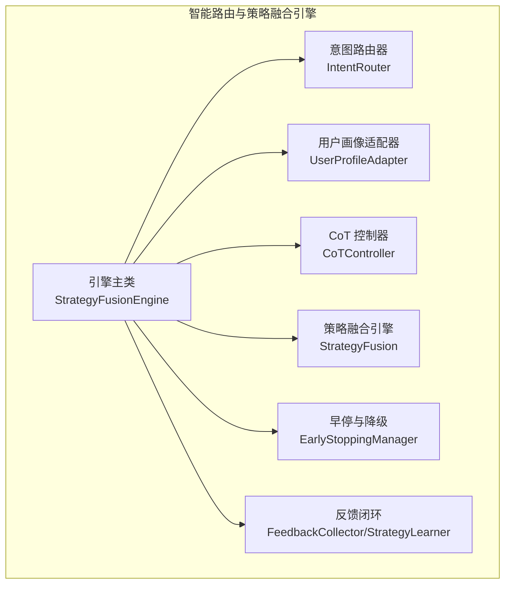
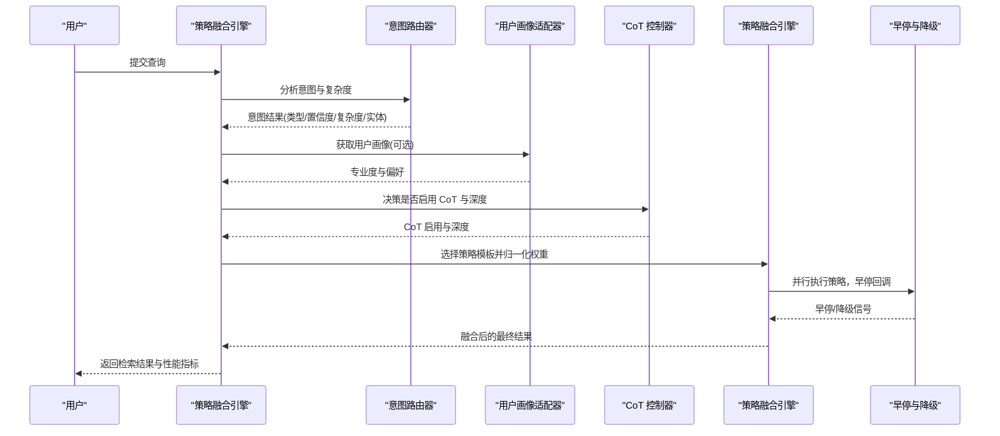
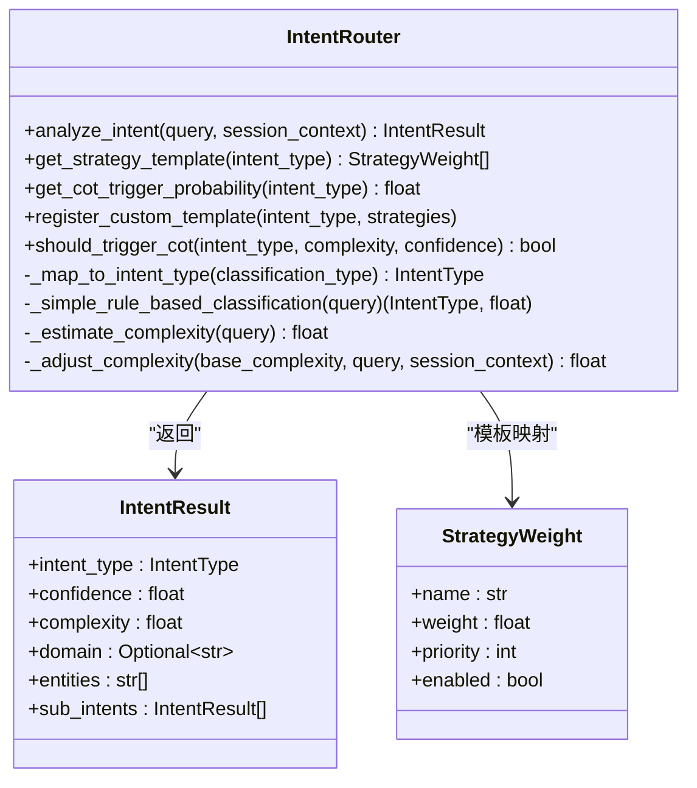
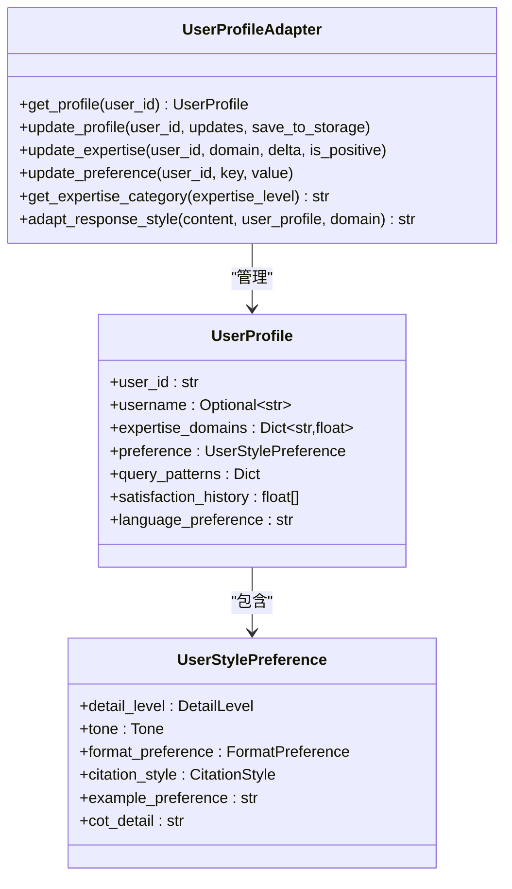
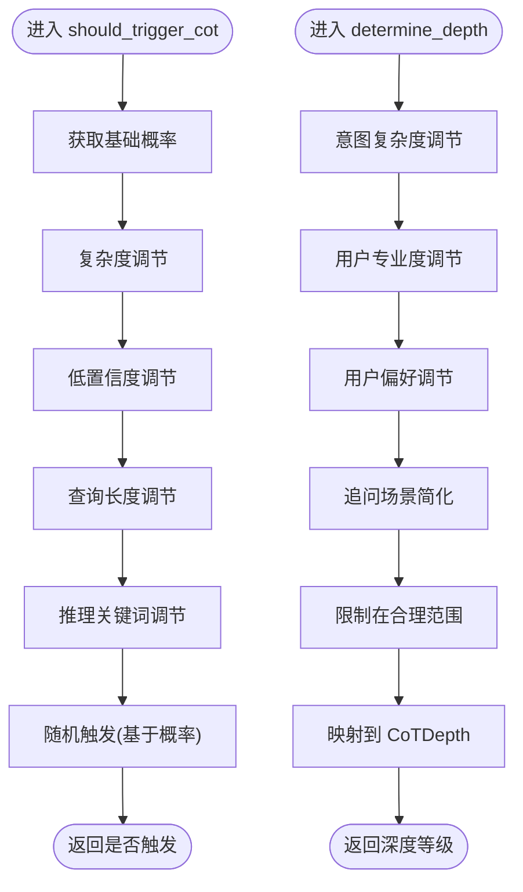
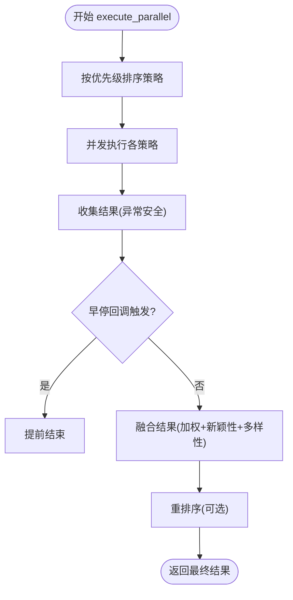
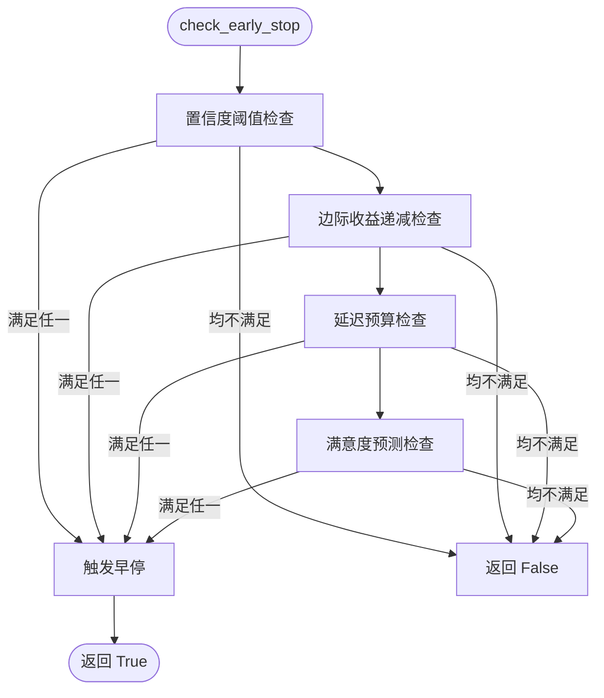
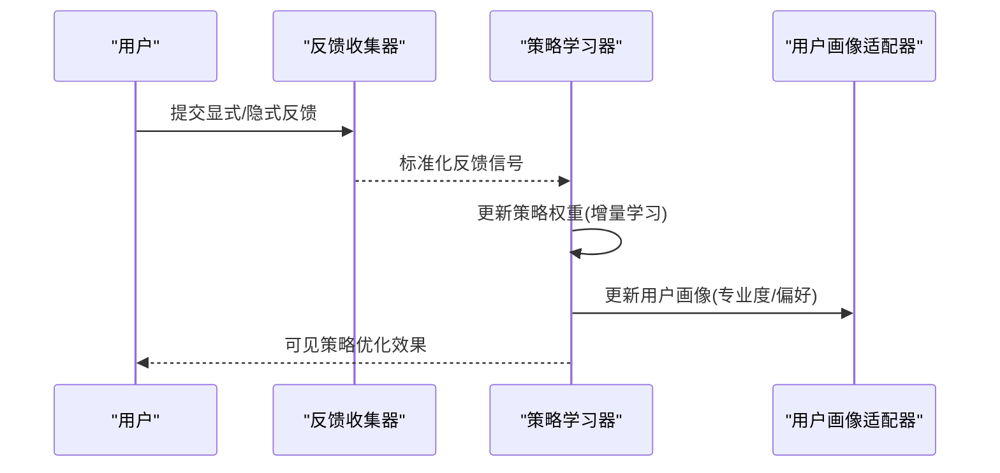
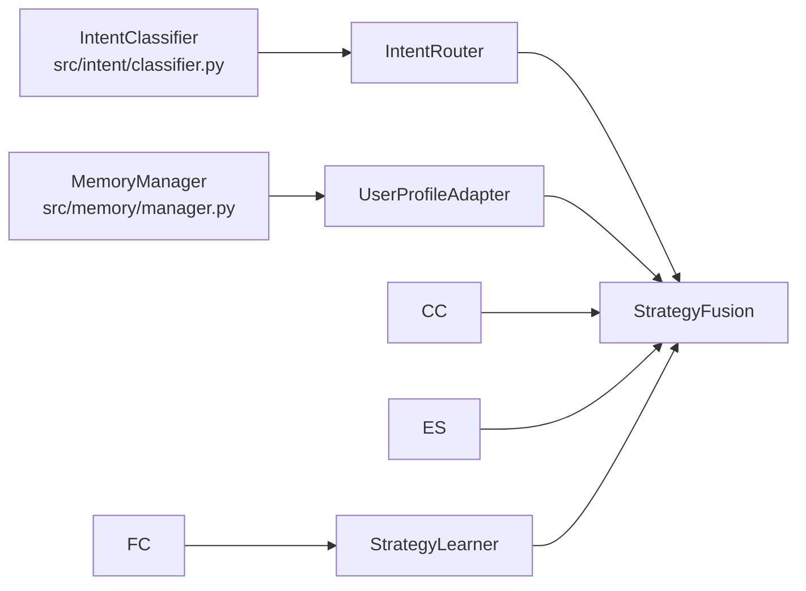

# 意图路由器

<cite>
**本文引用的文件**
- [intent_router.py](file://src/retrieval/smart_routing/intent_router.py)
- [engine.py](file://src/retrieval/smart_routing/engine.py)
- [strategy_fusion.py](file://src/retrieval/smart_routing/strategy_fusion.py)
- [cot_controller.py](file://src/retrieval/smart_routing/cot_controller.py)
- [user_adapter.py](file://src/retrieval/smart_routing/user_adapter.py)
- [early_stopping.py](file://src/retrieval/smart_routing/early_stopping.py)
- [feedback_loop.py](file://src/retrieval/smart_routing/feedback_loop.py)
- [example_usage.py](file://src/retrieval/smart_routing/example_usage.py)
- [IMPLEMENTATION_SUMMARY.md](file://src/retrieval/smart_routing/IMPLEMENTATION_SUMMARY.md)
- [test_smart_routing.py](file://tests/test_retrieval/test_smart_routing.py)
- [classifier.py](file://src/intent/classifier.py)
- [config.py](file://src/intent/config.py)
- [hyde.py](file://src/retrieval/hyde.py)
</cite>

## 目录
1. [简介](#简介)
2. [项目结构](#项目结构)
3. [核心组件](#核心组件)
4. [架构总览](#架构总览)
5. [详细组件分析](#详细组件分析)
6. [依赖分析](#依赖分析)
7. [性能考量](#性能考量)
8. [故障排除指南](#故障排除指南)
9. [结论](#结论)
10. [附录](#附录)

## 简介
本文件面向“意图路由器”模块，系统化阐述其在智能路由策略中的设计原理与实现细节，包括：
- 意图识别与复杂度评估
- 策略模板映射与权重计算
- HyDE 增强、图谱搜索、重排序等策略的选择机制
- 路由决策流程与性能优化策略
- 与智能路由引擎的集成关系与策略融合机制
- 配置示例与效果评估方法
- 故障排除与性能调优指南

## 项目结构
意图路由器位于检索层的“智能路由与策略融合引擎”子模块中，围绕三层决策架构组织：
- 意图识别层：识别问题类型与复杂度，决定是否启用思维链推理
- 用户画像层：匹配用户专业度与偏好，调节策略权重与响应风格
- 策略融合层：并行执行多策略检索，融合结果并进行多样性控制与重排序

图表来源
- [engine.py:34-129](file://src/retrieval/smart_routing/engine.py#L34-L129)
- [intent_router.py:91-278](file://src/retrieval/smart_routing/intent_router.py#L91-L278)
- [user_adapter.py:98-331](file://src/retrieval/smart_routing/user_adapter.py#L98-L331)
- [cot_controller.py:21-202](file://src/retrieval/smart_routing/cot_controller.py#L21-L202)
- [strategy_fusion.py:43-349](file://src/retrieval/smart_routing/strategy_fusion.py#L43-L349)
- [early_stopping.py:39-326](file://src/retrieval/smart_routing/early_stopping.py#L39-L326)
- [feedback_loop.py:30-435](file://src/retrieval/smart_routing/feedback_loop.py#L30-L435)

章节来源
- [engine.py:34-129](file://src/retrieval/smart_routing/engine.py#L34-L129)
- [IMPLEMENTATION_SUMMARY.md:44-63](file://src/retrieval/smart_routing/IMPLEMENTATION_SUMMARY.md#L44-L63)

## 核心组件
- 意图路由器：负责 7 类语义意图识别、复杂度评估、策略模板映射与 CoT 触发概率判定
- 用户画像适配器：维护用户专业度、偏好风格，提供响应风格适配与偏好更新
- CoT 控制器：根据意图复杂度、置信度与用户偏好，智能触发与调节思维链深度
- 策略融合引擎：多策略并行执行、结果融合、多样性控制与重排序
- 早停与降级：基于置信度、边际收益、延迟预算与满意度预测的多维早停与降级
- 反馈闭环：收集显式/隐式反馈，驱动策略权重在线学习与用户画像更新

章节来源
- [intent_router.py:91-278](file://src/retrieval/smart_routing/intent_router.py#L91-L278)
- [user_adapter.py:98-331](file://src/retrieval/smart_routing/user_adapter.py#L98-L331)
- [cot_controller.py:21-202](file://src/retrieval/smart_routing/cot_controller.py#L21-L202)
- [strategy_fusion.py:43-349](file://src/retrieval/smart_routing/strategy_fusion.py#L43-L349)
- [early_stopping.py:39-326](file://src/retrieval/smart_routing/early_stopping.py#L39-L326)
- [feedback_loop.py:30-435](file://src/retrieval/smart_routing/feedback_loop.py#L30-L435)

## 架构总览
三层决策架构与策略融合流程如下：

图表来源
- [engine.py:68-129](file://src/retrieval/smart_routing/engine.py#L68-L129)
- [strategy_fusion.py:78-158](file://src/retrieval/smart_routing/strategy_fusion.py#L78-L158)
- [early_stopping.py:57-109](file://src/retrieval/smart_routing/early_stopping.py#L57-L109)

## 详细组件分析

### 意图路由器（IntentRouter）
- 7 类语义意图：事实查询、比较分析、推理演绎、概念解释、摘要总结、操作指导、探索发散
- 策略模板映射：每类意图对应一组策略及其初始权重
- 复杂度评估：基于查询长度、问号数量、连接词数量的综合评分，并结合上下文进行调整
- CoT 触发概率：基于意图类型的基础概率，结合复杂度与置信度进行动态调节
- 集成方式：可注入现有意图分类器（如 src.intent.classifier），否则使用规则匹配作为回退

图表来源
- [intent_router.py:91-278](file://src/retrieval/smart_routing/intent_router.py#L91-L278)
- [strategy_fusion.py:13-20](file://src/retrieval/smart_routing/strategy_fusion.py#L13-L20)

章节来源
- [intent_router.py:115-278](file://src/retrieval/smart_routing/intent_router.py#L115-L278)
- [IMPLEMENTATION_SUMMARY.md:65-91](file://src/retrieval/smart_routing/IMPLEMENTATION_SUMMARY.md#L65-L91)

### 用户画像适配器（UserProfileAdapter）
- 用户画像字段：专业度（领域→数值）、偏好风格（详细度、语调、格式、引用风格、示例偏好、CoT详细度）、查询模式、满意度历史、语言偏好
- 专业度分类：专家/中级/新手，用于策略权重与响应风格的差异化
- 偏好适配：根据专业度与偏好风格调整响应内容的详细度、术语密度与呈现格式
- 在线更新：支持更新专业度与偏好，并持久化到记忆管理器

图表来源
- [user_adapter.py:98-331](file://src/retrieval/smart_routing/user_adapter.py#L98-L331)

章节来源
- [user_adapter.py:133-331](file://src/retrieval/smart_routing/user_adapter.py#L133-L331)
- [IMPLEMENTATION_SUMMARY.md:92-108](file://src/retrieval/smart_routing/IMPLEMENTATION_SUMMARY.md#L92-L108)

### CoT 控制器（CoTController）
- 触发判断：基于意图类型的基础概率，结合复杂度、置信度、查询长度与推理关键词进行动态调节
- 深度调节：依据意图复杂度、用户专业度与偏好，映射到 L1-L4 四级深度
- 性能监控：记录触发次数与总查询数，提供触发率统计

图表来源
- [cot_controller.py:55-107](file://src/retrieval/smart_routing/cot_controller.py#L55-L107)
- [cot_controller.py:109-172](file://src/retrieval/smart_routing/cot_controller.py#L109-L172)

章节来源
- [cot_controller.py:55-172](file://src/retrieval/smart_routing/cot_controller.py#L55-L172)
- [IMPLEMENTATION_SUMMARY.md:109-141](file://src/retrieval/smart_routing/IMPLEMENTATION_SUMMARY.md#L109-L141)

### 策略融合引擎（StrategyFusion）
- 多策略并行：按优先级排序，异步并发执行策略
- 结果融合：基于策略权重与归一化分数，引入新颖性加成与多样性惩罚
- 多样性控制：限制同一领域占比、避免单一来源主导
- 重排序：预留接口，可接入 BGE-Reranker 等模型
- 执行监控：与早停回调配合，动态终止

图表来源
- [strategy_fusion.py:78-158](file://src/retrieval/smart_routing/strategy_fusion.py#L78-L158)
- [strategy_fusion.py:217-328](file://src/retrieval/smart_routing/strategy_fusion.py#L217-L328)

章节来源
- [strategy_fusion.py:78-349](file://src/retrieval/smart_routing/strategy_fusion.py#L78-L349)
- [IMPLEMENTATION_SUMMARY.md:142-157](file://src/retrieval/smart_routing/IMPLEMENTATION_SUMMARY.md#L142-L157)

### 早停与降级（EarlyStoppingManager）
- 多维早停：置信度阈值、边际收益递减、延迟预算、满意度预测
- 降级等级：NONE/L1/L2/L3/L4，分别对应减少并行策略、跳过 CoT、仅向量检索、返回缓存等动作
- 动态配置：根据意图置信度与用户专业度调整延迟预算

图表来源
- [early_stopping.py:57-156](file://src/retrieval/smart_routing/early_stopping.py#L57-L156)

章节来源
- [early_stopping.py:57-326](file://src/retrieval/smart_routing/early_stopping.py#L57-L326)
- [IMPLEMENTATION_SUMMARY.md:159-176](file://src/retrieval/smart_routing/IMPLEMENTATION_SUMMARY.md#L159-L176)

### 反馈闭环（FeedbackCollector/StrategyLearner）
- 显式反馈：评分标准化到 [-1,1]，权重可配置
- 隐式反馈：查询改写、会话放弃、二次检索、停留时长、引用行为等
- 在线学习：基于增量误差更新策略权重，维持平滑范围

图表来源
- [feedback_loop.py:57-282](file://src/retrieval/smart_routing/feedback_loop.py#L57-L282)
- [feedback_loop.py:297-435](file://src/retrieval/smart_routing/feedback_loop.py#L297-L435)

章节来源
- [feedback_loop.py:57-435](file://src/retrieval/smart_routing/feedback_loop.py#L57-L435)
- [IMPLEMENTATION_SUMMARY.md:177-203](file://src/retrieval/smart_routing/IMPLEMENTATION_SUMMARY.md#L177-L203)

## 依赖分析
- 与意图分析系统集成：可通过注入 src.intent.classifier.IntentClassifier，复用深度语义理解能力
- 与记忆管理层集成：用户画像从 L1 工作记忆加载，支持缓存与持久化
- 与检索层集成：引擎提供 execute_and_monitor，便于注入实际检索器（向量、图谱、HyDE、重排序）

图表来源
- [engine.py:68-129](file://src/retrieval/smart_routing/engine.py#L68-L129)
- [IMPLEMENTATION_SUMMARY.md:240-269](file://src/retrieval/smart_routing/IMPLEMENTATION_SUMMARY.md#L240-L269)

章节来源
- [engine.py:68-129](file://src/retrieval/smart_routing/engine.py#L68-L129)
- [IMPLEMENTATION_SUMMARY.md:240-269](file://src/retrieval/smart_routing/IMPLEMENTATION_SUMMARY.md#L240-L269)

## 性能考量
- 早停与降级：通过置信度阈值、边际收益与延迟预算，显著降低简单问题的延迟与资源消耗
- 并行策略：在复杂问题上保持并行执行，确保结果质量
- 多样性控制：避免单一来源与领域过度集中，提升结果覆盖面
- 在线学习：策略权重随反馈自适应调整，长期提升命中率与满意度

[本节为通用性能讨论，无需引用具体文件]

## 故障排除指南
- 意图识别不准确
  - 检查是否注入了 IntentClassifier；若未注入，将使用规则匹配回退，准确性可能下降
  - 参考：[intent_router.py:130-155](file://src/retrieval/smart_routing/intent_router.py#L130-L155)
- CoT 未触发或深度不当
  - 调整复杂度与置信度阈值，检查推理关键词配置
  - 参考：[cot_controller.py:55-107](file://src/retrieval/smart_routing/cot_controller.py#L55-L107)
- 策略融合结果重复或单一来源过多
  - 调整多样性配置（领域占比上限、跨领域最少数量、来源多样性）
  - 参考：[strategy_fusion.py:324-328](file://src/retrieval/smart_routing/strategy_fusion.py#L324-L328)
- 早停过早导致质量下降
  - 提高置信度阈值或放宽延迟预算比例；专家用户的延迟预算会自动下调
  - 参考：[early_stopping.py:210-243](file://src/retrieval/smart_routing/early_stopping.py#L210-L243)
- 反馈学习未生效
  - 确认反馈信号权重与学习率配置；检查策略权重存储与更新逻辑
  - 参考：[feedback_loop.py:297-357](file://src/retrieval/smart_routing/feedback_loop.py#L297-L357)

章节来源
- [intent_router.py:130-155](file://src/retrieval/smart_routing/intent_router.py#L130-L155)
- [cot_controller.py:55-107](file://src/retrieval/smart_routing/cot_controller.py#L55-L107)
- [strategy_fusion.py:324-328](file://src/retrieval/smart_routing/strategy_fusion.py#L324-L328)
- [early_stopping.py:210-243](file://src/retrieval/smart_routing/early_stopping.py#L210-L243)
- [feedback_loop.py:297-357](file://src/retrieval/smart_routing/feedback_loop.py#L297-L357)

## 结论
意图路由器通过三层决策架构，实现了从语义意图到策略模板再到个性化响应的全链路智能路由。其核心优势在于：
- 基于意图与复杂度的策略模板映射与权重归一化
- 用户画像驱动的专业度与风格适配
- 智能 CoT 触发与深度调节
- 多策略并行融合与多样性控制
- 早停与降级机制保障性能
- 反馈闭环驱动的在线学习

这些能力共同提升了检索质量与用户体验，并为后续与实际检索器（向量、图谱、HyDE、重排序）的深度集成奠定了坚实基础。

[本节为总结性内容，无需引用具体文件]

## 附录

### 配置示例与使用方法
- 基础使用：初始化各组件并创建引擎，提交查询后执行检索
  - 参考：[example_usage.py:18-58](file://src/retrieval/smart_routing/example_usage.py#L18-L58)
- 用户画像适配：模拟专家与新手用户，查看专业度分类与偏好适配
  - 参考：[example_usage.py:61-96](file://src/retrieval/smart_routing/example_usage.py#L61-L96)
- 反馈学习：收集显式/隐式反馈，更新策略权重并选择最优策略
  - 参考：[example_usage.py:99-138](file://src/retrieval/smart_routing/example_usage.py#L99-L138)
- 早停机制：配置早停阈值，检查是否早停与降级等级
  - 参考：[example_usage.py:141-173](file://src/retrieval/smart_routing/example_usage.py#L141-L173)

章节来源
- [example_usage.py:18-173](file://src/retrieval/smart_routing/example_usage.py#L18-L173)

### 与智能路由引擎的集成关系
- 引擎主类 StrategyFusionEngine 负责串联意图识别、用户画像、策略融合、CoT 控制、早停与反馈闭环
- 通过 execute_and_monitor 注入实际检索器，实现与检索层的无缝对接
- 参考：[engine.py:68-249](file://src/retrieval/smart_routing/engine.py#L68-L249)

章节来源
- [engine.py:68-249](file://src/retrieval/smart_routing/engine.py#L68-L249)

### HyDE 增强与图谱搜索、重排序策略
- HyDE 增强：通过生成假设性答案并进行向量化检索，提升模糊查询的召回质量
  - 参考：[hyde.py:17-213](file://src/retrieval/hyde.py#L17-L213)
- 图谱搜索：用于推理与关系挖掘，适合比较分析与推理演绎
  - 参考：策略模板映射（INTENT_STRATEGY_TEMPLATES）
- 重排序：预留 BGE-Reranker 等模型接口，提升最终排序质量
  - 参考：[strategy_fusion.py:324-328](file://src/retrieval/smart_routing/strategy_fusion.py#L324-L328)

章节来源
- [hyde.py:17-213](file://src/retrieval/hyde.py#L17-L213)
- [strategy_fusion.py:324-328](file://src/retrieval/smart_routing/strategy_fusion.py#L324-L328)

### 评估方法与指标
- 满意度评分：显式评分标准化到 [-1,1]，结合停留时长、引用行为等隐式信号
  - 参考：[feedback_loop.py:57-282](file://src/retrieval/smart_routing/feedback_loop.py#L57-L282)
- 引擎统计：请求总量、平均处理时间、策略权重分布、CoT 触发率
  - 参考：[engine.py:266-274](file://src/retrieval/smart_routing/engine.py#L266-L274)
- 测试覆盖：单元测试与集成测试验证各模块功能
  - 参考：[test_smart_routing.py:19-324](file://tests/test_retrieval/test_smart_routing.py#L19-L324)

章节来源
- [feedback_loop.py:57-282](file://src/retrieval/smart_routing/feedback_loop.py#L57-L282)
- [engine.py:266-274](file://src/retrieval/smart_routing/engine.py#L266-L274)
- [test_smart_routing.py:19-324](file://tests/test_retrieval/test_smart_routing.py#L19-L324)