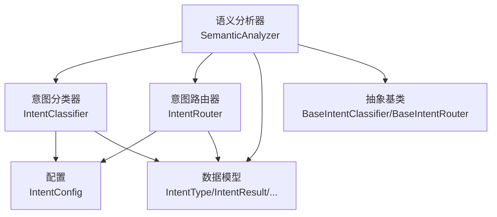
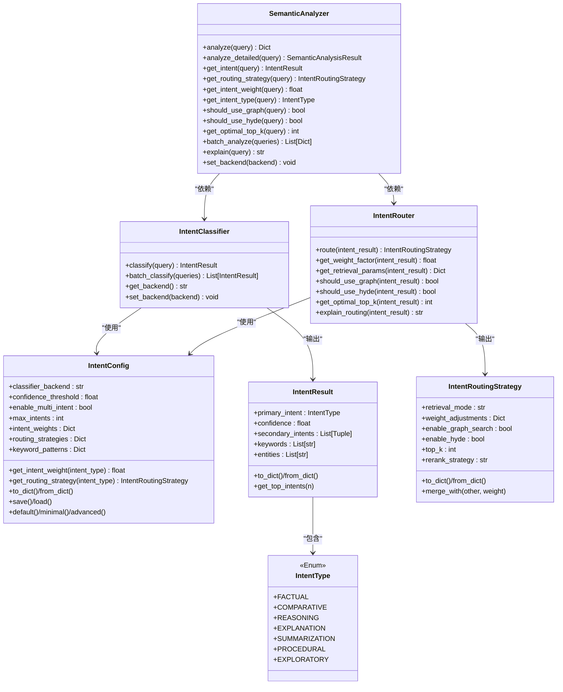
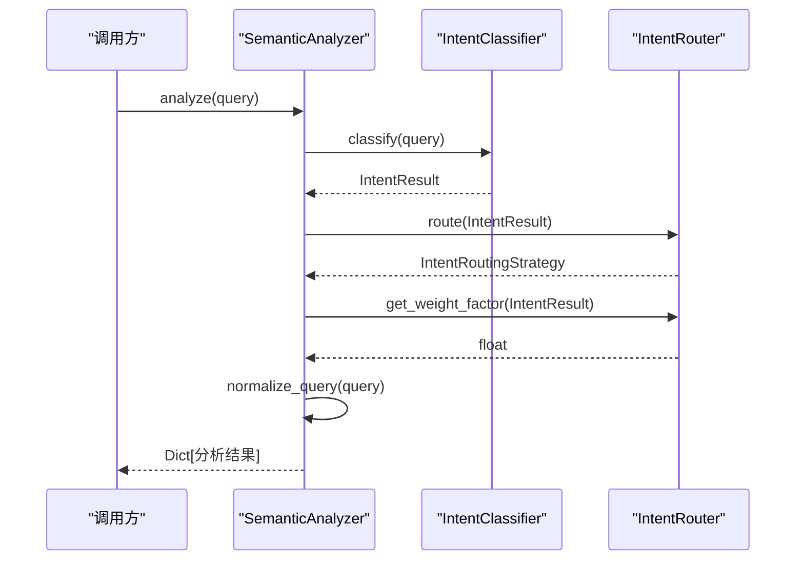
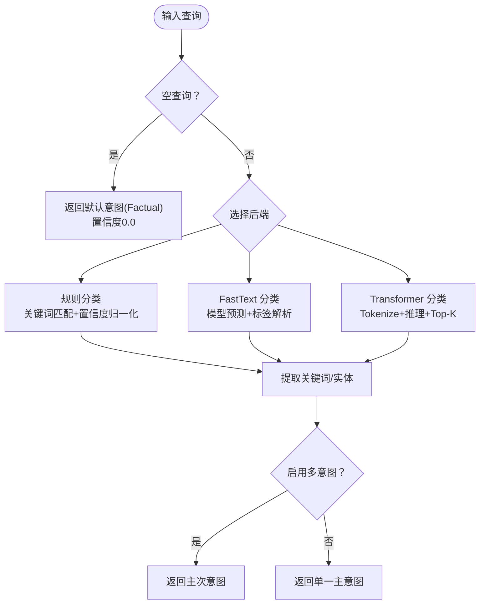
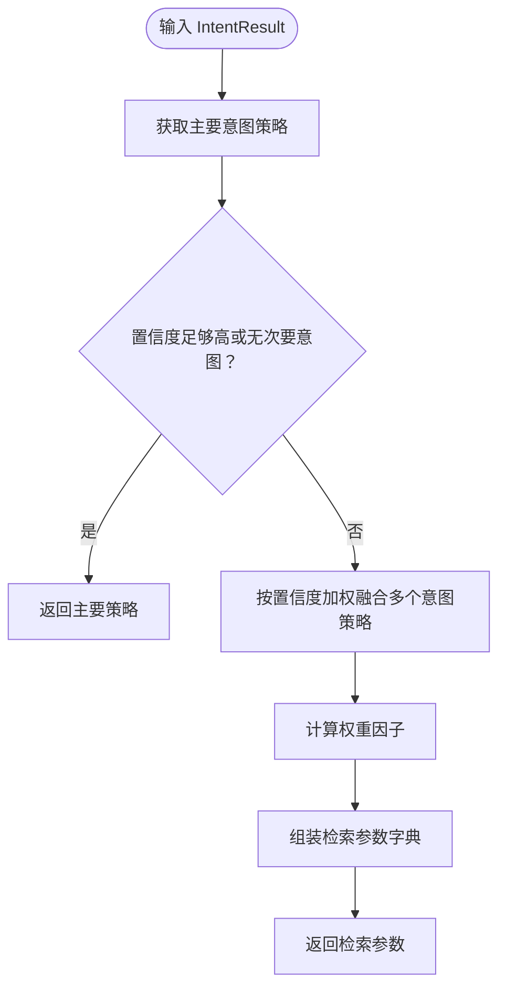
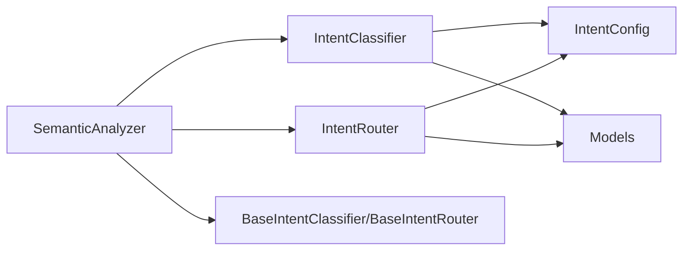

# 语义分析器

<cite>
**本文引用的文件**
- [semantic_analyzer.py](file://src/intent/semantic_analyzer.py)
- [classifier.py](file://src/intent/classifier.py)
- [router.py](file://src/intent/router.py)
- [models.py](file://src/intent/models.py)
- [config.py](file://src/intent/config.py)
- [base.py](file://src/core/base.py)
- [__init__.py](file://src/intent/__init__.py)
- [test_classifier.py](file://tests/test_intent/test_classifier.py)
- [intent_knowledge.py](file://src/intent/intent_knowledge.py)
</cite>

## 目录
1. [简介](#简介)
2. [项目结构](#项目结构)
3. [核心组件](#核心组件)
4. [架构总览](#架构总览)
5. [详细组件分析](#详细组件分析)
6. [依赖关系分析](#依赖关系分析)
7. [性能考量](#性能考量)
8. [故障排查指南](#故障排查指南)
9. [结论](#结论)
10. [附录](#附录)

## 简介
本文件为 NecoRAG 语义分析器的实现文档，聚焦于统一的意图分类与路由接口设计，涵盖分析流程（意图分类、路由策略确定、查询归一化）、分析方法（analyze、get_intent、get_routing_strategy 等）、批量分析与解释生成机制、配置管理与后端切换、性能优化与最佳实践等内容。目标读者既包括需要快速上手的开发者，也包括希望深入理解架构与实现细节的高级用户。

## 项目结构
语义分析器位于 src/intent 目录下，围绕“意图分类器 + 意图路由器 + 语义分析器”的分层设计组织，配合配置与数据模型，形成可插拔、可扩展的统一接口。

图表来源
- [semantic_analyzer.py:24-352](file://src/intent/semantic_analyzer.py#L24-L352)
- [classifier.py:20-493](file://src/intent/classifier.py#L20-L493)
- [router.py:18-350](file://src/intent/router.py#L18-L350)
- [models.py:12-231](file://src/intent/models.py#L12-L231)
- [config.py:18-333](file://src/intent/config.py#L18-L333)
- [base.py:661-725](file://src/core/base.py#L661-L725)

章节来源
- [__init__.py:1-135](file://src/intent/__init__.py#L1-L135)

## 核心组件
- 语义分析器（SemanticAnalyzer）：对外统一入口，封装意图分类、路由策略、查询归一化、权重因子、检索参数、批量分析与解释生成。
- 意图分类器（IntentClassifier）：支持规则、FastText、Transformer 三种后端；内置关键词模式匹配与多意图识别；提供批量分类与后端切换。
- 意图路由器（IntentRouter）：根据意图结果确定检索策略（模式、图谱/HyDE开关、Top-K、重排序策略），并计算权重因子；提供解释生成。
- 数据模型（models.py）：定义意图类型、分类结果、路由策略、完整分析结果等数据结构。
- 配置（config.py）：集中管理分类后端、置信度阈值、多意图开关、意图权重、路由策略、关键词模式等。
- 抽象基类（base.py）：定义 IntentClassifier 与 IntentRouter 的抽象接口，保证实现一致性与可替换性。

章节来源
- [semantic_analyzer.py:24-352](file://src/intent/semantic_analyzer.py#L24-L352)
- [classifier.py:20-493](file://src/intent/classifier.py#L20-L493)
- [router.py:18-350](file://src/intent/router.py#L18-L350)
- [models.py:12-231](file://src/intent/models.py#L12-L231)
- [config.py:18-333](file://src/intent/config.py#L18-L333)
- [base.py:661-725](file://src/core/base.py#L661-L725)

## 架构总览
语义分析器采用“高层统一接口 + 低层可插拔组件”的分层架构：
- 上层：SemanticAnalyzer 提供 analyze、batch_analyze、explain 等高层 API。
- 中层：IntentClassifier 与 IntentRouter 分别负责意图分类与路由策略。
- 下层：IntentConfig 提供配置，IntentType/IntentResult/IntentRoutingStrategy 等模型承载数据结构。
- 基类层：BaseIntentClassifier/BaseIntentRouter 约束实现契约。

图表来源
- [semantic_analyzer.py:24-352](file://src/intent/semantic_analyzer.py#L24-L352)
- [classifier.py:20-493](file://src/intent/classifier.py#L20-L493)
- [router.py:18-350](file://src/intent/router.py#L18-L350)
- [models.py:12-231](file://src/intent/models.py#L12-L231)
- [config.py:18-333](file://src/intent/config.py#L18-L333)

## 详细组件分析

### 语义分析器（SemanticAnalyzer）
- 统一入口：提供 analyze、analyze_detailed、batch_analyze、explain 等高层 API。
- 核心流程：
  - 意图分类：调用 IntentClassifier.classify。
  - 路由策略：调用 IntentRouter.route。
  - 权重因子：调用 IntentRouter.get_weight_factor。
  - 检索参数：调用 IntentRouter.get_retrieval_params。
  - 查询归一化：去除多余空白与末尾标点。
- 辅助方法：get_intent、get_routing_strategy、get_intent_weight、get_intent_type、should_use_graph、should_use_hyde、get_optimal_top_k。
- 工厂函数：create_analyzer、quick_analyze。

图表来源
- [semantic_analyzer.py:69-122](file://src/intent/semantic_analyzer.py#L69-L122)
- [classifier.py:85-113](file://src/intent/classifier.py#L85-L113)
- [router.py:55-78](file://src/intent/router.py#L55-L78)

章节来源
- [semantic_analyzer.py:24-352](file://src/intent/semantic_analyzer.py#L24-L352)

### 意图分类器（IntentClassifier）
- 后端支持：rule_based（默认，无需额外依赖）、fasttext、transformer。
- 规则分类：预编译关键词正则模式（中英文），按匹配位置与权重计算得分，归一化后排序，支持多意图。
- 关键词与实体提取：优先使用 jieba（TF-IDF、词性标注），不可用时使用简单实现。
- 批量分类：对列表逐条分类。
- 后端切换：set_backend，非法后端回退至当前后端。

图表来源
- [classifier.py:85-206](file://src/intent/classifier.py#L85-L206)
- [classifier.py:325-458](file://src/intent/classifier.py#L325-L458)

章节来源
- [classifier.py:20-493](file://src/intent/classifier.py#L20-L493)

### 意图路由器（IntentRouter）
- 路由策略：根据主要意图策略与置信度阈值决定是否融合次要意图；使用置信度加权融合。
- 权重因子：结合基础意图权重与置信度，计算综合权重因子，并考虑次要意图贡献。
- 检索参数：汇总检索模式、Top-K、图谱/HyDE开关、重排序策略、权重调整、意图类型与置信度等。
- 解释生成：输出人类可读的路由决策说明。

图表来源
- [router.py:55-78](file://src/intent/router.py#L55-L78)
- [router.py:123-164](file://src/intent/router.py#L123-L164)
- [router.py:166-197](file://src/intent/router.py#L166-L197)

章节来源
- [router.py:18-350](file://src/intent/router.py#L18-L350)

### 数据模型（models.py）
- 意图类型（IntentType）：包含 7 种意图枚举。
- 意图结果（IntentResult）：主意图、置信度、次要意图列表、关键词、实体；提供序列化/反序列化与 Top-N 获取。
- 路由策略（IntentRoutingStrategy）：检索模式、权重调整、图谱/HyDE开关、Top-K、重排序策略；支持策略融合。
- 完整分析结果（SemanticAnalysisResult）：组合 IntentResult、路由策略、归一化查询、权重因子与元数据。

章节来源
- [models.py:12-231](file://src/intent/models.py#L12-L231)

### 配置（config.py）
- 分类器配置：后端、模型名、FastText 模型路径、置信度阈值、多意图开关、最大意图数。
- 意图权重：不同意图的基础权重因子。
- 路由策略：每种意图的默认策略（检索模式、Top-K、图谱/HyDE开关、重排序策略、权重调整）。
- 关键词模式：每种意图的中英文关键词正则模式与权重。
- 工具方法：to_dict/from_dict、save/load、default/minimal/advanced。

章节来源
- [config.py:18-333](file://src/intent/config.py#L18-L333)

### 抽象基类（base.py）
- BaseIntentClassifier：定义 classify、batch_classify、backend 抽象属性。
- BaseIntentRouter：定义 route、get_weight_factor 抽象方法。
- 保证实现一致性与可替换性，便于扩展新后端或新路由策略。

章节来源
- [base.py:661-725](file://src/core/base.py#L661-L725)

### 批量分析与解释生成
- 批量分析：batch_analyze 对查询列表逐一执行 analyze。
- 解释生成：explain 组合查询、路由解释、关键词与实体，输出人类可读文本。

章节来源
- [semantic_analyzer.py:240-276](file://src/intent/semantic_analyzer.py#L240-L276)

### 配置管理与后端切换
- 后端切换：IntentClassifier.set_backend 支持 rule_based/fasttext/transformer，非法值回退。
- 配置持久化：IntentConfig.save/load 支持 JSON 序列化。
- 快速创建：create_analyzer、quick_analyze 提供便捷入口。

章节来源
- [classifier.py:481-492](file://src/intent/classifier.py#L481-L492)
- [config.py:298-332](file://src/intent/config.py#L298-L332)
- [semantic_analyzer.py:316-351](file://src/intent/semantic_analyzer.py#L316-L351)

## 依赖关系分析
- 语义分析器依赖意图分类器与路由器，二者均依赖配置与数据模型。
- 抽象基类约束实现契约，确保不同后端与策略可替换。
- 测试覆盖了分类器初始化、规则分类、关键词/实体提取、多意图、后端切换、批量分类、配置与策略合并等场景。

图表来源
- [semantic_analyzer.py:10-18](file://src/intent/semantic_analyzer.py#L10-L18)
- [classifier.py:12-14](file://src/intent/classifier.py#L12-L14)
- [router.py:10-12](file://src/intent/router.py#L10-L12)
- [base.py:661-725](file://src/core/base.py#L661-L725)

章节来源
- [test_classifier.py:1-493](file://tests/test_intent/test_classifier.py#L1-L493)

## 性能考量
- 规则分类（rule_based）：无需外部依赖，启动快、内存占用低，适合轻量部署与快速验证。
- FastText/Transformer：准确率更高但依赖外部模型与库，推理耗时较长；建议在生产环境中按需启用。
- 关键词与实体提取：优先使用 jieba；若不可用，使用简单实现，避免阻塞。
- 批量处理：使用列表推导与内置循环，避免不必要的重复计算；可结合外部批处理框架进一步优化。
- 路由策略融合：按置信度加权，复杂度与意图数线性相关；建议限制 max_intents 以控制开销。
- 查询归一化：去除多余空白与标点，减少检索噪声，提升检索效率。

[本节为通用性能建议，不直接分析具体代码文件]

## 故障排查指南
- 分类结果异常
  - 检查配置：置信度阈值、多意图开关、最大意图数。
  - 检查后端：是否正确设置后端，模型路径是否存在。
  - 关键词模式：确认关键词模式是否覆盖目标查询。
- 路由策略不符合预期
  - 检查各意图的默认策略与权重因子。
  - 多意图融合：确认次要意图置信度是否过高导致策略被覆盖。
- 解释生成不完整
  - 确认 explain 调用链是否正确，关键词与实体提取是否成功。
- 批量分析性能问题
  - 评估后端与模型推理耗时，必要时拆分批次或启用缓存。

章节来源
- [test_classifier.py:136-174](file://tests/test_intent/test_classifier.py#L136-L174)
- [test_classifier.py:334-373](file://tests/test_intent/test_classifier.py#L334-L373)

## 结论
语义分析器通过统一接口整合意图分类与路由策略，提供灵活的配置与后端切换能力，支持批量分析与解释生成。其分层设计与抽象基类约束保证了可扩展性与可维护性。在实际部署中，可根据业务需求选择合适的后端与配置，平衡准确性与性能。

[本节为总结性内容，不直接分析具体代码文件]

## 附录

### 使用示例与最佳实践
- 快速分析：使用 quick_analyze 获取基本分析结果。
- 自定义后端：通过 create_analyzer 指定后端与配置项。
- 批量处理：使用 batch_analyze 对查询列表进行统一分析。
- 解释生成：使用 explain 输出人类可读的分析说明。
- 配置持久化：使用 IntentConfig.save/load 保存与恢复配置。
- 层次化意图管理：结合 IntentKnowledgeManager 管理意图树与学习数据。

章节来源
- [semantic_analyzer.py:316-351](file://src/intent/semantic_analyzer.py#L316-L351)
- [config.py:298-332](file://src/intent/config.py#L298-L332)
- [intent_knowledge.py:25-407](file://src/intent/intent_knowledge.py#L25-L407)