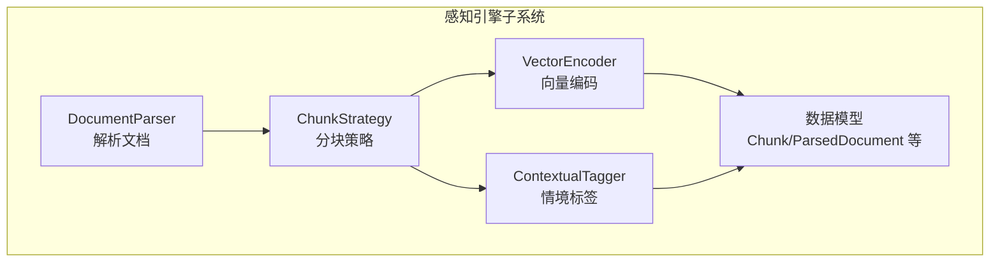
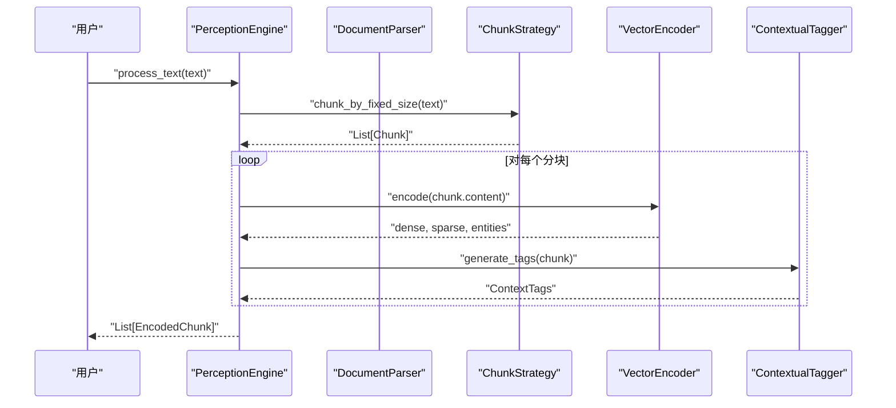
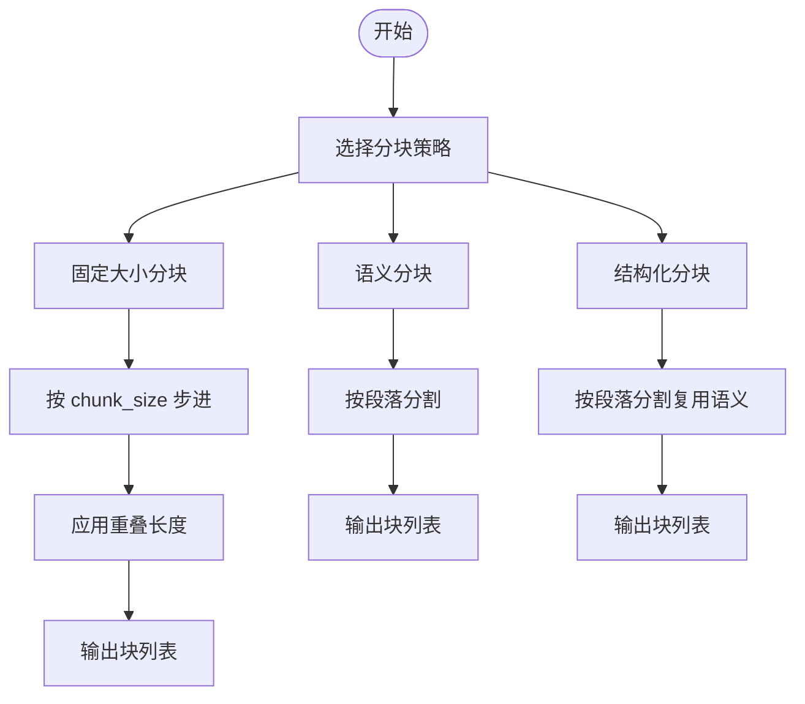
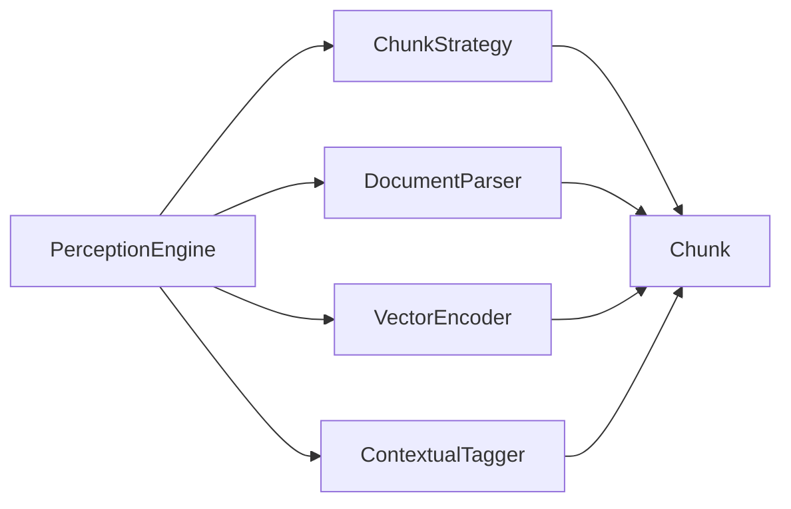

# 分块策略

<cite>
**本文引用的文件**
- [chunker.py](file://src/perception/chunker.py)
- [models.py](file://src/perception/models.py)
- [parser.py](file://src/perception/parser.py)
- [engine.py](file://src/perception/engine.py)
- [tagger.py](file://src/perception/tagger.py)
- [encoder.py](file://src/perception/encoder.py)
- [example_usage.py](file://example/example_usage.py)
- [README.md](file://src/perception/README.md)
</cite>

## 目录
1. [简介](#简介)
2. [项目结构](#项目结构)
3. [核心组件](#核心组件)
4. [架构总览](#架构总览)
5. [详细组件分析](#详细组件分析)
6. [依赖关系分析](#依赖关系分析)
7. [性能考量](#性能考量)
8. [故障排查指南](#故障排查指南)
9. [结论](#结论)
10. [附录](#附录)

## 简介
本章节介绍分块策略在文档预处理中的关键作用，涵盖固定大小分块、语义分块、结构化分块等策略，并结合仓库现有实现，说明分块重叠、边界处理与语义连贯性保障机制。同时提供配置参数说明、性能调优建议与实际应用案例，帮助读者根据业务需求选择合适的分块策略。

## 项目结构
感知引擎子系统围绕“文档解析 → 分块策略 → 向量化与情境标签 → 编码输出”的流水线组织，其中分块策略位于解析之后、编码之前，负责将原始文本切分为便于后续处理的片段。

图表来源
- [engine.py:14-41](file://src/perception/engine.py#L14-L41)
- [parser.py:11-26](file://src/perception/parser.py#L11-L26)
- [chunker.py:10-27](file://src/perception/chunker.py#L10-L27)
- [encoder.py:24-49](file://src/perception/encoder.py#L24-L49)
- [tagger.py:10-31](file://src/perception/tagger.py#L10-L31)
- [models.py:11-69](file://src/perception/models.py#L11-L69)

章节来源
- [README.md:1-158](file://src/perception/README.md#L1-L158)
- [engine.py:14-41](file://src/perception/engine.py#L14-L41)

## 核心组件
- 分块策略（ChunkStrategy）：提供固定大小分块、语义分块、结构化分块三种策略的接口与实现骨架，支持通过构造参数设置分块大小与重叠长度。
- 文档解析（DocumentParser）：负责将文件内容读取为统一的字符串，并提供简单分块示例。
- 编码器（VectorEncoder）：为每个分块生成稠密向量、稀疏向量与实体三元组，支撑检索与知识图谱构建。
- 情境标签（ContextualTagger）：为每个分块生成时间、情感、重要性、主题等标签，提升检索与排序的上下文相关性。
- 数据模型（Chunk、ParsedDocument 等）：定义分块、解析后文档、编码块等核心数据结构。

章节来源
- [chunker.py:10-98](file://src/perception/chunker.py#L10-L98)
- [parser.py:11-112](file://src/perception/parser.py#L11-L112)
- [encoder.py:24-254](file://src/perception/encoder.py#L24-L254)
- [tagger.py:10-144](file://src/perception/tagger.py#L10-L144)
- [models.py:11-69](file://src/perception/models.py#L11-L69)

## 架构总览
下图展示了从输入文本到编码块的完整流程，以及分块策略在其中的位置与职责。

图表来源
- [engine.py:108-130](file://src/perception/engine.py#L108-L130)
- [chunker.py:58-82](file://src/perception/chunker.py#L58-L82)
- [encoder.py:72-86](file://src/perception/encoder.py#L72-L86)
- [tagger.py:32-47](file://src/perception/tagger.py#L32-L47)

## 详细组件分析

### 分块策略（ChunkStrategy）
- 角色定位：在感知引擎中承担“文本切片”职责，为后续向量化与标签生成提供粒度可控的输入单元。
- 关键方法
  - 固定大小分块（chunk_by_fixed_size）：按指定大小滑窗切分，支持通过 overlap 参数控制相邻块的重叠长度，保证语义连续性。
  - 语义分块（chunk_by_semantic）：当前实现为按段落切分，保留段内语义完整性；未来可扩展为基于语义相似度的智能切分。
  - 结构化分块（chunk_by_structure）：当前实现复用语义分块；未来可基于标题、表格、列表等结构元素进行更细粒度切分。
- 参数与行为
  - chunk_size：默认 512 字符，决定每块的近似长度。
  - chunk_overlap：默认 50 字符，用于前后块重叠，缓解跨边界语义断裂。
- 边界处理与重叠机制
  - 固定大小分块通过步长为 (chunk_size - chunk_overlap) 进行滑窗，确保最后一块覆盖到文本末尾。
  - 语义分块按段落边界切分，避免跨段落截断导致的语义不完整。
- 适用场景
  - 固定大小分块：对检索效率敏感、需要稳定向量维度与批量处理的场景。
  - 语义分块：对语义完整性要求较高、文档段落清晰的场景。
  - 结构化分块：对文档结构（标题、表格）有明确利用需求的场景。

图表来源
- [chunker.py:17-98](file://src/perception/chunker.py#L17-L98)

章节来源
- [chunker.py:10-98](file://src/perception/chunker.py#L10-L98)

### 文档解析（DocumentParser）
- 角色定位：将文件内容读取为统一字符串，并提供简单分块示例，便于演示与测试。
- 关键方法
  - parse：读取文件内容，调用内部简单分块逻辑生成 Chunk 列表。
  - _simple_chunk：固定大小简单分块，作为最小可用实现。
- 与分块策略的关系
  - 当直接处理字符串时，感知引擎会调用 ChunkStrategy 的固定大小分块；当处理文件时，解析器内部已有简单分块示例。

章节来源
- [parser.py:11-112](file://src/perception/parser.py#L11-L112)

### 向量编码（VectorEncoder）
- 角色定位：为每个分块生成多类型向量表示，支撑检索与下游任务。
- 关键能力
  - 稠密向量：优先通过 LLM 客户端嵌入，回退到内置确定性实现。
  - 稀疏向量：基于 TF-IDF 风格的词频统计，生成关键词权重字典。
  - 实体抽取：基于正则规则提取三元组（主体-关系-客体），可扩展为更强的 NLP 模型。
- 与分块策略的衔接
  - 分块策略输出的每个 Chunk 内容作为编码器输入，逐块生成向量与实体。

章节来源
- [encoder.py:24-254](file://src/perception/encoder.py#L24-L254)

### 情境标签（ContextualTagger）
- 角色定位：为每个分块生成时间、情感、重要性、主题等标签，增强检索与排序的上下文相关性。
- 关键方法
  - generate_time_tag：检测文档元数据中的创建时间等信息，生成时间标签。
  - generate_sentiment_tag：基于关键词统计判断情感倾向。
  - generate_importance_tag：基于长度与词汇多样性计算重要性评分。
  - generate_topic_tags：提取高频词作为主题标签。
- 与分块策略的衔接
  - 分块策略输出的 Chunk 作为标签生成的输入，逐块打标。

章节来源
- [tagger.py:10-144](file://src/perception/tagger.py#L10-L144)

### 数据模型（Chunk、ParsedDocument、EncodedChunk）
- 角色定位：定义感知引擎各阶段的数据结构，确保跨模块的数据一致性。
- 关键字段
  - Chunk：content、index、start_char、end_char、metadata。
  - ParsedDocument：file_path、content、chunks、tables、images、metadata、parsed_at。
  - EncodedChunk：content、chunk_id、dense_vector、sparse_vector、entities、context_tags、metadata、created_at。
- 与分块策略的衔接
  - 分块策略输出的 Chunk 列表被封装为 ParsedDocument 的 chunks 字段，随后进入编码与打标流程。

章节来源
- [models.py:11-69](file://src/perception/models.py#L11-L69)

## 依赖关系分析
感知引擎的依赖关系清晰，模块间耦合度低，便于扩展与替换。

图表来源
- [engine.py:14-41](file://src/perception/engine.py#L14-L41)
- [chunker.py:10-27](file://src/perception/chunker.py#L10-L27)
- [parser.py:11-26](file://src/perception/parser.py#L11-L26)
- [encoder.py:24-49](file://src/perception/encoder.py#L24-L49)
- [tagger.py:10-31](file://src/perception/tagger.py#L10-L31)
- [models.py:11-69](file://src/perception/models.py#L11-L69)

章节来源
- [engine.py:14-41](file://src/perception/engine.py#L14-L41)

## 性能考量
- 分块大小与重叠
  - 较大的 chunk_size 可减少向量数量，提高检索吞吐，但可能降低语义对齐精度；较小的 chunk_size 更利于语义对齐，但增加向量规模与内存占用。
  - 合理的 chunk_overlap（如 50）有助于缓解跨边界语义断裂，提升检索召回。
- 编码与标签开销
  - 向量化与标签生成均为 O(n) 级别，主要受文本长度与分块数量影响；批量处理可显著提升吞吐。
- I/O 与解析
  - 文件解析阶段的 I/O 通常为瓶颈之一，建议在大规模处理时采用流式读取与缓存策略。
- 实践建议
  - 对长文档优先采用固定大小分块并设置适度重叠，平衡召回与性能。
  - 对段落清晰的文档可尝试语义分块，进一步提升语义连贯性。
  - 对结构化文档（报告、论文）可考虑结构化分块，按章节或段落精细切分。

[本节为通用性能指导，无需特定文件来源]

## 故障排查指南
- 分块边界异常
  - 症状：跨段落或跨句子截断导致语义不完整。
  - 排查：确认是否使用了语义分块；若仍出现截断，检查段落分隔符与文本格式。
  - 参考实现位置：[chunker.py:28-56](file://src/perception/chunker.py#L28-L56)
- 重叠无效或缺失
  - 症状：相邻块重复过多或语义断裂明显。
  - 排查：核对 chunk_overlap 参数设置；确认固定大小分块的步长是否正确应用。
  - 参考实现位置：[chunker.py:58-82](file://src/perception/chunker.py#L58-L82)
- 向量化失败或维度异常
  - 症状：向量维度与预期不符或编码报错。
  - 排查：确认模型名称与向量维度配置；检查 LLM 客户端可用性与回退逻辑。
  - 参考实现位置：[encoder.py:32-61](file://src/perception/encoder.py#L32-L61)
- 标签生成异常
  - 症状：时间标签为空、情感标签偏差较大、重要性评分不合理。
  - 排查：检查输入文本与元数据；调整情感关键词集合与重要性评分阈值。
  - 参考实现位置：[tagger.py:32-144](file://src/perception/tagger.py#L32-L144)

章节来源
- [chunker.py:17-98](file://src/perception/chunker.py#L17-L98)
- [encoder.py:32-61](file://src/perception/encoder.py#L32-L61)
- [tagger.py:32-144](file://src/perception/tagger.py#L32-L144)

## 结论
分块策略是文档预处理的关键环节，直接影响后续向量化与检索效果。在本仓库中，固定大小分块提供了稳定的吞吐与可控的重叠机制，语义分块与结构化分块为未来的智能化切分预留了扩展空间。结合向量化与情境标签，分块策略能够有效提升检索召回与语义对齐质量。建议根据文档类型与业务目标选择合适的策略，并通过参数调优与批量处理实现性能与效果的平衡。

[本节为总结性内容，无需特定文件来源]

## 附录

### 配置参数与默认值
- 分块策略
  - chunk_size：默认 512（字符）
  - chunk_overlap：默认 50（字符）
- 感知引擎
  - model：默认 BGE-M3
  - enable_ocr：默认 True
- 情境标签
  - sentiment_model：默认 default
  - importance_threshold：默认 0.5

章节来源
- [chunker.py:17-26](file://src/perception/chunker.py#L17-L26)
- [engine.py:21-36](file://src/perception/engine.py#L21-L36)
- [tagger.py:17-30](file://src/perception/tagger.py#L17-L30)

### 代码示例路径
- 使用感知引擎处理文本并输出编码块
  - [example_usage.py:12-47](file://example/example_usage.py#L12-L47)
- 引擎一站式处理文件与文本
  - [engine.py:92-130](file://src/perception/engine.py#L92-L130)
- 固定大小分块调用
  - [chunker.py:58-82](file://src/perception/chunker.py#L58-L82)
- 语义分块调用
  - [chunker.py:28-56](file://src/perception/chunker.py#L28-L56)

### 实际应用案例
- 场景一：学术论文与技术报告
  - 建议：采用结构化分块（按章节/段落）或固定大小分块配合适度重叠，确保公式、图表说明与正文的语义完整性。
- 场景二：长文档问答
  - 建议：固定大小分块 + 语义标签（情感、重要性）提升检索相关性，结合稀疏向量增强关键词召回。
- 场景三：多模态文档（含表格/图片）
  - 建议：先进行表格与图片提取（解析器预留接口），再对文本部分采用固定大小分块，必要时对表格行进行单独切分。

[本节为概念性应用建议，无需特定文件来源]