# 向量化编码器

<cite>
**本文档引用的文件**
- [encoder.py](file://src/perception/encoder.py)
- [models.py](file://src/perception/models.py)
- [engine.py](file://src/perception/engine.py)
- [chunker.py](file://src/perception/chunker.py)
- [tagger.py](file://src/perception/tagger.py)
- [base.py](file://src/core/llm/base.py)
- [mock.py](file://src/core/llm/mock.py)
- [memory_store.py](file://src/memory/backends/memory_store.py)
- [example_usage.py](file://example/example_usage.py)
- [README.md](file://README.md)
</cite>

## 目录
1. [简介](#简介)
2. [项目结构](#项目结构)
3. [核心组件](#核心组件)
4. [架构概览](#架构概览)
5. [详细组件分析](#详细组件分析)
6. [依赖关系分析](#依赖关系分析)
7. [性能考虑](#性能考虑)
8. [故障排除指南](#故障排除指南)
9. [结论](#结论)
10. [附录](#附录)

## 简介

向量化编码器是 NecoRAG 框架感知层的核心组件，负责将多模态数据转换为机器可理解的数学表示。该组件支持生成多种类型的向量表示，包括稠密向量、稀疏向量和实体三元组，为后续的记忆存储、检索和推理提供基础。

该编码器采用灵活的设计架构，既可以直接使用外部 LLM 客户端进行向量化，也可以使用内置的确定性实现，确保在不同环境下都能稳定运行。

## 项目结构

NecoRAG 项目采用模块化的分层架构设计，向量化编码器位于感知层，与其他四个层级协同工作：

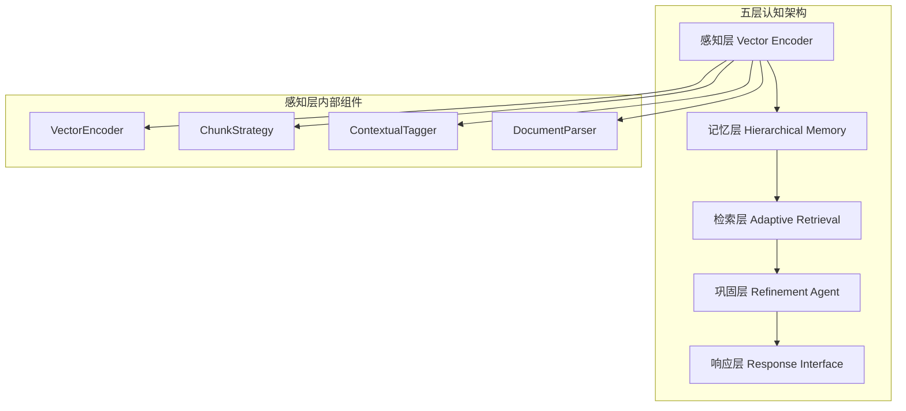

**图表来源**
- [engine.py:14-41](file://src/perception/engine.py#L14-L41)
- [README.md:35-85](file://README.md#L35-L85)

**章节来源**
- [engine.py:14-41](file://src/perception/engine.py#L14-L41)
- [README.md:35-85](file://README.md#L35-L85)

## 核心组件

向量化编码器由多个核心组件构成，每个组件都有明确的职责和功能：

### VectorEncoder 类
VectorEncoder 是编码器的核心类，负责执行主要的编码任务。它支持三种类型的向量生成：
- **稠密向量**：使用 LLM 客户端或内置实现生成高维向量
- **稀疏向量**：基于 TF-IDF 风格的词频统计生成关键词权重
- **实体三元组**：提取文本中的主体-关系-客体结构

### 数据模型
编码器使用标准化的数据模型来表示编码结果：
- **EncodedChunk**：包含编码后的文本块及其所有相关信息
- **Chunk**：表示原始文本块的基本结构
- **ContextTags**：包含情境标签的完整信息

### 编码策略
编码器支持多种编码策略：
- **模型驱动编码**：使用外部 LLM 客户端进行高质量向量化
- **内置编码**：使用确定性算法生成伪向量，确保可重现性
- **混合策略**：根据可用性和需求自动选择最佳编码方式

**章节来源**
- [encoder.py:24-71](file://src/perception/encoder.py#L24-L71)
- [models.py:11-41](file://src/perception/models.py#L11-L41)

## 架构概览

向量化编码器在整个 NecoRAG 框架中扮演着关键角色，它与感知引擎的其他组件紧密协作：

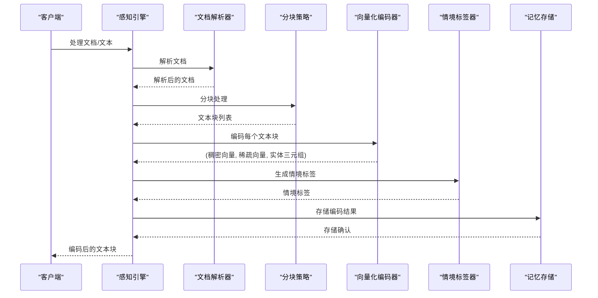

**图表来源**
- [engine.py:54-90](file://src/perception/engine.py#L54-L90)

**章节来源**
- [engine.py:54-90](file://src/perception/engine.py#L54-L90)

## 详细组件分析

### VectorEncoder 类分析

VectorEncoder 类是编码器的核心实现，提供了完整的编码功能：

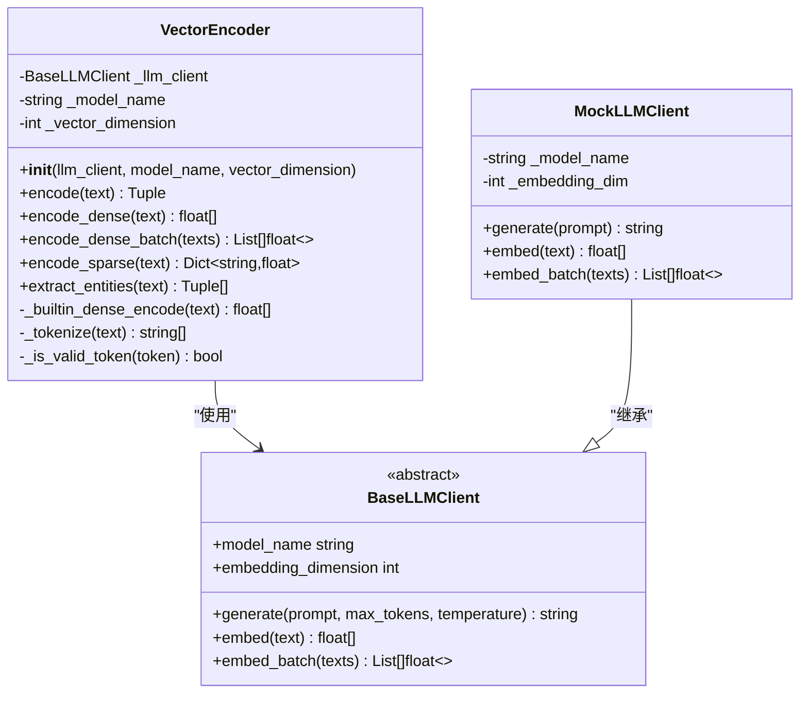

**图表来源**
- [encoder.py:24-71](file://src/perception/encoder.py#L24-L71)
- [base.py:11-72](file://src/core/llm/base.py#L11-L72)
- [mock.py:16-71](file://src/core/llm/mock.py#L16-L71)

#### 编码流程分析

向量化编码器的编码流程包含三个主要步骤：

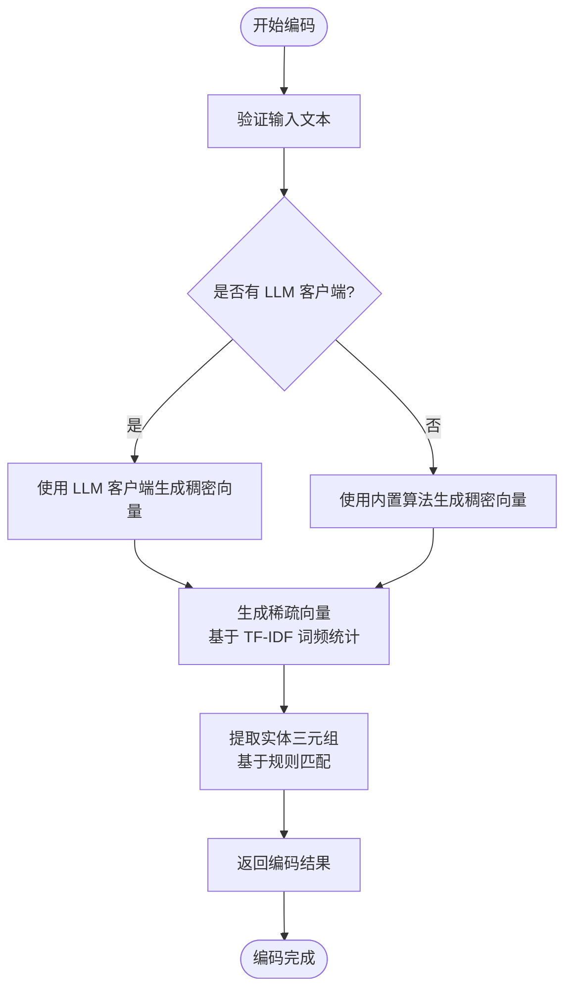

**图表来源**
- [encoder.py:72-86](file://src/perception/encoder.py#L72-L86)

#### 稠密向量生成策略

稠密向量生成支持两种策略：

1. **外部模型驱动**：使用配置的 LLM 客户端进行高质量向量化
2. **内置确定性编码**：基于文本哈希生成确定性向量，确保可重现性

内置编码算法特点：
- 使用 MD5 哈希作为随机种子
- 生成高斯分布的随机向量
- 进行向量归一化处理
- 确保相同输入始终产生相同输出

**章节来源**
- [encoder.py:88-118](file://src/perception/encoder.py#L88-L118)
- [encoder.py:191-212](file://src/perception/encoder.py#L191-L212)

#### 稀疏向量生成机制

稀疏向量基于 TF-IDF 风格的词频统计生成：

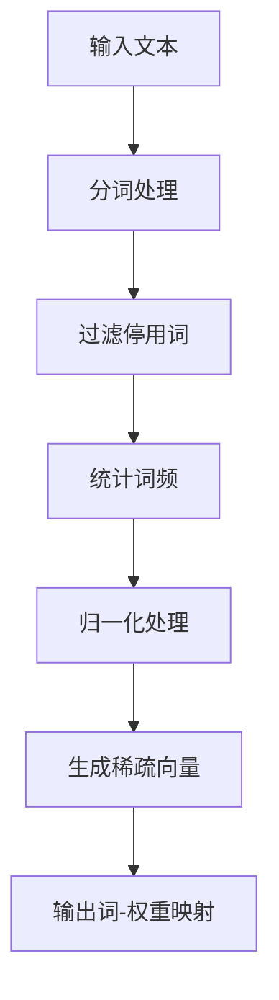

**图表来源**
- [encoder.py:120-146](file://src/perception/encoder.py#L120-L146)

稀疏向量生成的关键特性：
- 支持中英文混合文本
- 自动识别中文字符和英文单词
- 过滤停用词和短词
- 使用最大频率进行归一化

**章节来源**
- [encoder.py:120-146](file://src/perception/encoder.py#L120-L146)

#### 实体提取算法

实体提取使用基于正则表达式的规则匹配：

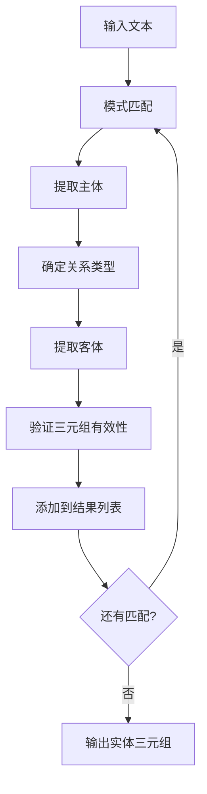

**图表来源**
- [encoder.py:148-189](file://src/perception/encoder.py#L148-L189)

支持的关系类型：
- `is_a`：等同关系（"是"、"is"）
- `belongs_to`：归属关系（"属于"）
- `contains`：包含关系（"包含"）

**章节来源**
- [encoder.py:148-189](file://src/perception/encoder.py#L148-L189)

### 数据模型设计

编码器使用标准化的数据模型来确保数据的一致性和完整性：

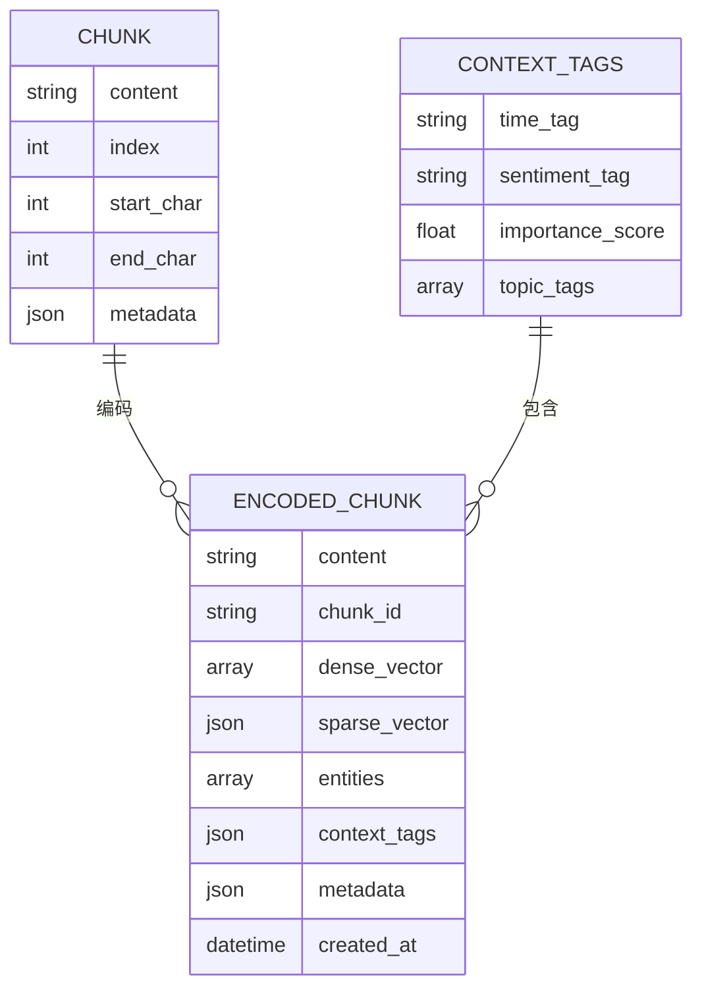

**图表来源**
- [models.py:11-41](file://src/perception/models.py#L11-L41)

**章节来源**
- [models.py:11-41](file://src/perception/models.py#L11-L41)

### 分块策略集成

感知引擎集成了多种分块策略，为编码器提供预处理的文本块：

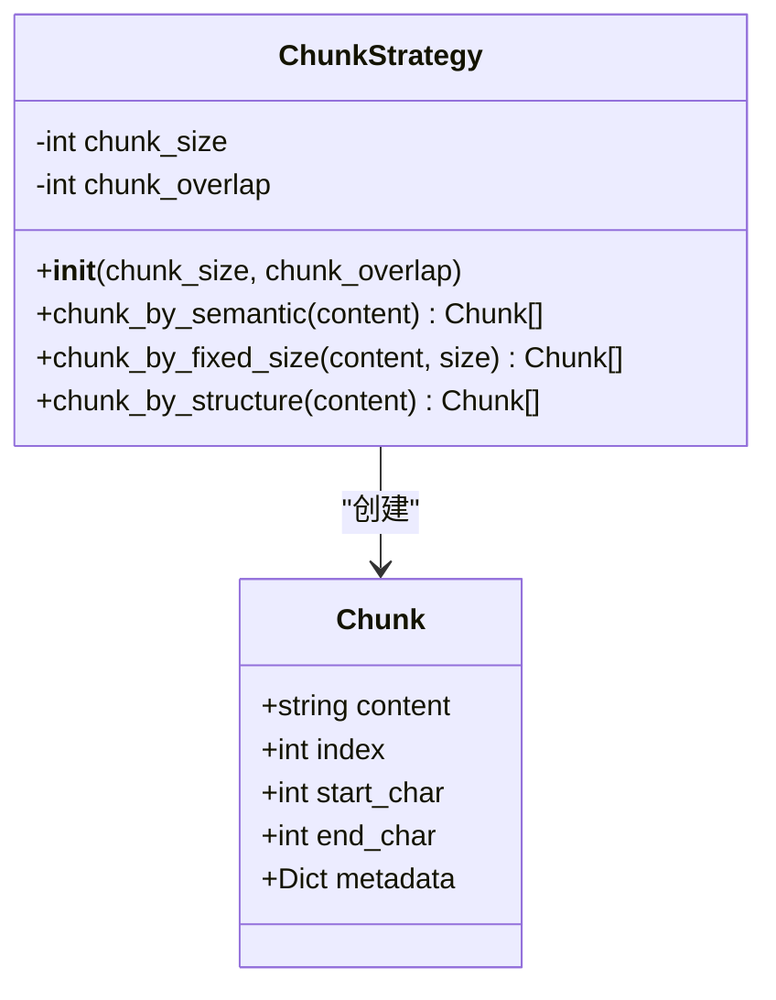

**图表来源**
- [chunker.py:10-27](file://src/perception/chunker.py#L10-L27)

**章节来源**
- [chunker.py:10-27](file://src/perception/chunker.py#L10-L27)

### 情境标签生成

编码器还集成了情境标签生成功能，为每个编码块提供额外的上下文信息：

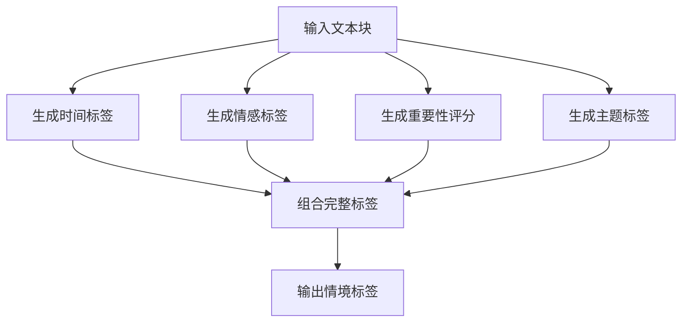

**图表来源**
- [tagger.py:32-47](file://src/perception/tagger.py#L32-L47)

**章节来源**
- [tagger.py:32-47](file://src/perception/tagger.py#L32-L47)

## 依赖关系分析

向量化编码器的依赖关系相对简洁，主要依赖于核心的 LLM 客户端接口：

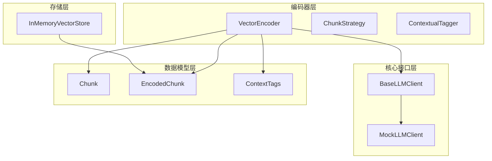

**图表来源**
- [encoder.py:18-21](file://src/perception/encoder.py#L18-L21)
- [base.py:11-72](file://src/core/llm/base.py#L11-L72)
- [mock.py:16-71](file://src/core/llm/mock.py#L16-L71)
- [models.py:11-41](file://src/perception/models.py#L11-L41)
- [memory_store.py:20-36](file://src/memory/backends/memory_store.py#L20-L36)

**章节来源**
- [encoder.py:18-21](file://src/perception/encoder.py#L18-L21)
- [base.py:11-72](file://src/core/llm/base.py#L11-L72)
- [mock.py:16-71](file://src/core/llm/mock.py#L16-L71)
- [models.py:11-41](file://src/perception/models.py#L11-L41)
- [memory_store.py:20-36](file://src/memory/backends/memory_store.py#L20-L36)

## 性能考虑

向量化编码器在设计时充分考虑了性能优化：

### 向量相似度计算

编码器使用高效的余弦相似度计算方法：

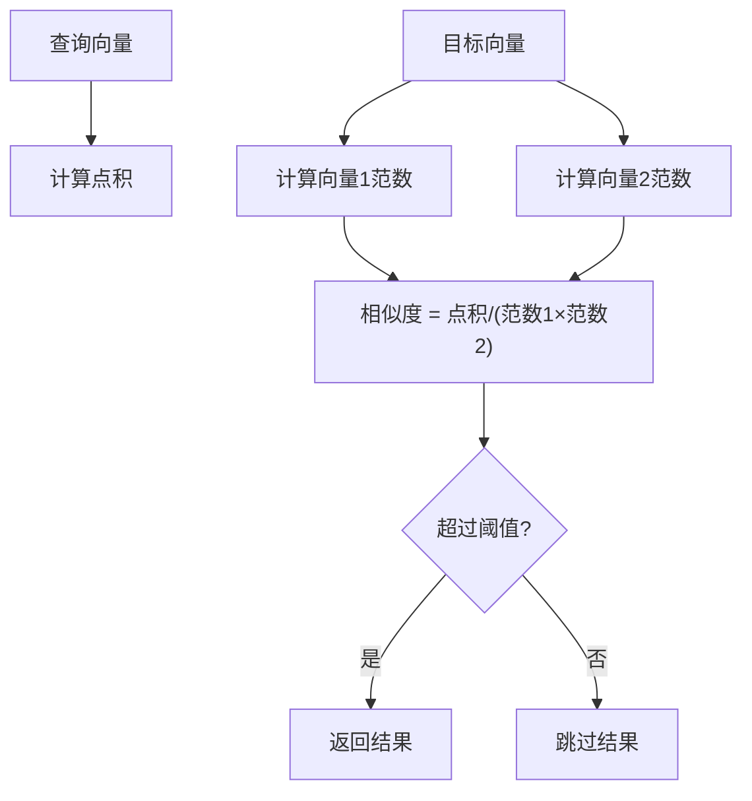

**图表来源**
- [memory_store.py:116-125](file://src/memory/backends/memory_store.py#L116-L125)

### 批量处理优化

编码器支持批量向量化处理，提高整体性能：

- **批量稠密向量生成**：使用 LLM 客户端的批量接口
- **内存优化**：避免重复的向量计算
- **并行处理**：利用底层实现的并发能力

### 内存管理

编码器采用内存友好的设计：
- **惰性加载**：只在需要时生成向量
- **确定性编码**：减少不必要的计算开销
- **向量归一化**：确保数值稳定性

**章节来源**
- [memory_store.py:116-125](file://src/memory/backends/memory_store.py#L116-L125)
- [encoder.py:105-118](file://src/perception/encoder.py#L105-L118)

## 故障排除指南

### 常见问题及解决方案

#### 向量维度不匹配
**问题**：查询向量与存储向量维度不一致
**解决方案**：检查编码器配置的向量维度设置

#### 编码性能问题
**问题**：大量文本编码耗时过长
**解决方案**：使用批量编码接口或调整分块大小

#### 实体提取不准确
**问题**：实体三元组提取结果不符合预期
**解决方案**：扩展正则表达式模式或集成更强大的 NLP 模型

#### 情境标签异常
**问题**：生成的情境标签不符合实际情况
**解决方案**：调整标签生成策略或集成专业的 NLP 模型

**章节来源**
- [memory_store.py:45-50](file://src/memory/backends/memory_store.py#L45-L50)
- [encoder.py:164-169](file://src/perception/encoder.py#L164-L169)

## 结论

向量化编码器作为 NecoRAG 框架的核心组件，展现了优秀的架构设计和实现质量。其主要优势包括：

1. **灵活性**：支持多种编码策略和模型选择
2. **可扩展性**：基于接口设计，易于集成新的编码模型
3. **性能优化**：提供批量处理和内存优化
4. **可靠性**：内置确定性编码确保可重现性
5. **易用性**：简洁的 API 设计和完整的文档支持

该编码器为整个 NecoRAG 框架奠定了坚实的基础，为后续的记忆存储、检索和推理提供了高质量的向量表示。

## 附录

### 使用示例

以下是一个完整的使用示例，展示了如何使用向量化编码器：

```python
# 初始化感知引擎
engine = PerceptionEngine(
    model="BGE-M3",
    chunk_size=512,
    chunk_overlap=50
)

# 处理文本
text = "深度学习是机器学习的一个分支..."
encoded_chunks = engine.process_text(text)

# 访问编码结果
for chunk in encoded_chunks:
    print(f"稠密向量维度: {len(chunk.dense_vector)}")
    print(f"稀疏向量键数: {len(chunk.sparse_vector)}")
    print(f"实体三元组数量: {len(chunk.entities)}")
```

### 配置选项

| 参数 | 类型 | 默认值 | 说明 |
|------|------|--------|------|
| model | string | "BGE-M3" | 向量化模型名称 |
| chunk_size | int | 512 | 分块大小 |
| chunk_overlap | int | 50 | 分块重叠长度 |
| enable_ocr | bool | True | 是否启用 OCR |

### 支持的编码模型

- **BGE-M3**：支持多语言的通用嵌入模型
- **自定义模型**：通过实现 BaseLLMClient 接口支持其他模型