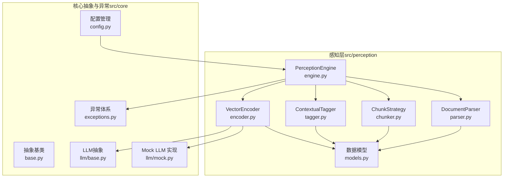
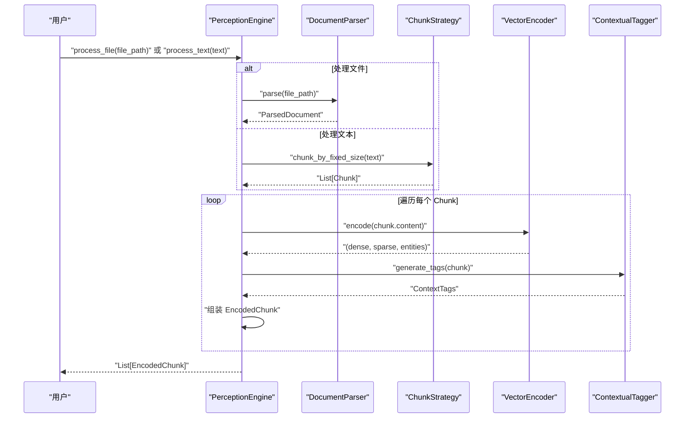
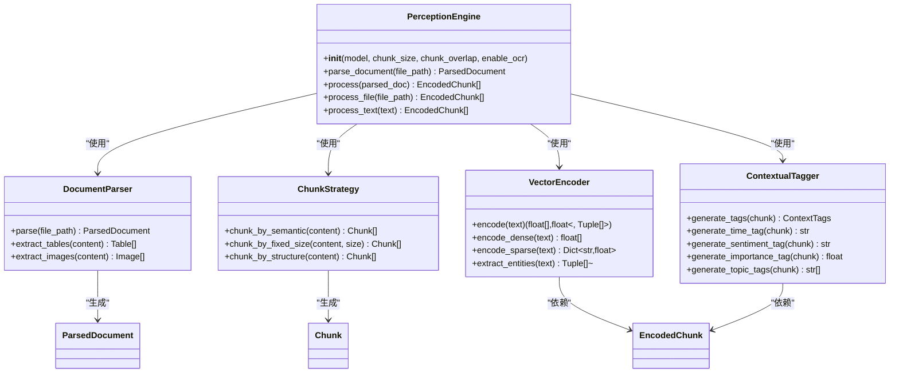
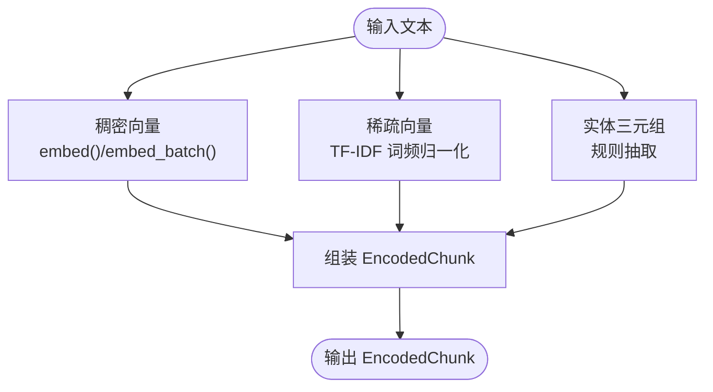
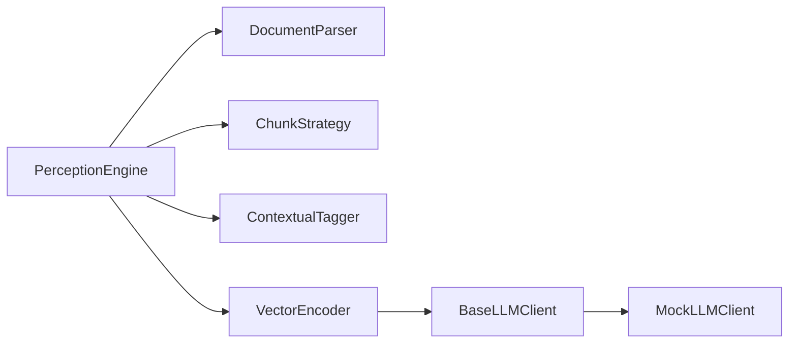

# 处理流程与集成

<cite>
**本文引用的文件**
- [engine.py](file://src/perception/engine.py)
- [parser.py](file://src/perception/parser.py)
- [chunker.py](file://src/perception/chunker.py)
- [tagger.py](file://src/perception/tagger.py)
- [encoder.py](file://src/perception/encoder.py)
- [models.py](file://src/perception/models.py)
- [base.py](file://src/core/base.py)
- [base.py（LLM抽象）](file://src/core/llm/base.py)
- [mock.py](file://src/core/llm/mock.py)
- [exceptions.py](file://src/core/exceptions.py)
- [config.py](file://src/core/config.py)
- [example_usage.py](file://example/example_usage.py)
- [README.md](file://README.md)
- [README.md（感知引擎）](file://src/perception/README.md)
- [requirements.txt](file://requirements.txt)
</cite>

## 目录
1. [引言](#引言)
2. [项目结构](#项目结构)
3. [核心组件](#核心组件)
4. [架构总览](#架构总览)
5. [详细组件分析](#详细组件分析)
6. [依赖分析](#依赖分析)
7. [性能考虑](#性能考虑)
8. [故障排除指南](#故障排除指南)
9. [结论](#结论)
10. [附录](#附录)

## 引言
本文件面向“感知引擎”的整体处理流程，从文档输入到编码输出的全过程进行技术说明。文档涵盖：
- 各组件的协作关系、数据流转与处理顺序
- 端到端使用示例（初始化、处理不同输入、获取编码结果）
- 错误处理机制、性能监控与调试方法
- 集成指南、最佳实践与故障排除技巧

感知引擎位于 NecoRAG 五层架构的最底层（感知层），负责将多模态输入转化为高精度的编码块，包含稠密向量、稀疏向量、实体三元组以及情境标签。

## 项目结构
感知引擎相关代码集中在 src/perception 目录，核心文件如下：
- engine.py：感知引擎主类，编排解析、分块、编码、打标与输出
- parser.py：文档解析器，负责将文件解析为统一结构化文档
- chunker.py：分块策略，支持固定大小、语义与结构化分块
- tagger.py：情境标签生成器，为每个文本块生成时间、情感、重要性与主题标签
- encoder.py：向量编码器，生成稠密向量、稀疏向量与实体三元组
- models.py：感知层数据模型（Chunk、EncodedChunk、ParsedDocument 等）

此外，核心抽象与异常体系位于 src/core，统一了各层接口与错误类型；示例与使用说明位于 example 与根目录文档。

**图表来源**
- [engine.py:14-130](file://src/perception/engine.py#L14-L130)
- [parser.py:11-112](file://src/perception/parser.py#L11-L112)
- [chunker.py:10-98](file://src/perception/chunker.py#L10-L98)
- [tagger.py:10-144](file://src/perception/tagger.py#L10-L144)
- [encoder.py:24-254](file://src/perception/encoder.py#L24-L254)
- [models.py:11-69](file://src/perception/models.py#L11-L69)
- [base.py:20-143](file://src/core/base.py#L20-L143)
- [base.py（LLM抽象）:11-134](file://src/core/llm/base.py#L11-L134)
- [mock.py:16-313](file://src/core/llm/mock.py#L16-L313)
- [exceptions.py:10-296](file://src/core/exceptions.py#L10-L296)
- [config.py:45-370](file://src/core/config.py#L45-L370)

**章节来源**
- [README.md:158-196](file://README.md#L158-L196)
- [README.md（感知引擎）:1-158](file://src/perception/README.md#L1-L158)

## 核心组件
- PerceptionEngine：感知引擎主类，负责编排解析、分块、编码、打标与输出，提供 process_file/process_text/process 三种入口。
- DocumentParser：将文件解析为统一结构化文档，包含内容、文本块、表格、图片与元数据。
- ChunkStrategy：提供多种分块策略（固定大小、语义、结构化），默认使用固定大小分块。
- ContextualTagger：为每个文本块生成情境标签（时间、情感、重要性、主题）。
- VectorEncoder：生成多类型向量表示（稠密向量、稀疏向量、实体三元组），支持 LLM 客户端注入与 Mock 回退。
- 数据模型：Chunk、EncodedChunk、ParsedDocument、ContextTags 等，承载感知层的数据结构。

**章节来源**
- [engine.py:14-130](file://src/perception/engine.py#L14-L130)
- [parser.py:11-112](file://src/perception/parser.py#L11-L112)
- [chunker.py:10-98](file://src/perception/chunker.py#L10-L98)
- [tagger.py:10-144](file://src/perception/tagger.py#L10-L144)
- [encoder.py:24-254](file://src/perception/encoder.py#L24-L254)
- [models.py:11-69](file://src/perception/models.py#L11-L69)

## 架构总览
感知引擎的处理流程遵循“输入 → 解析 → 分块 → 编码 → 打标 → 输出”的线性流水线，同时支持直接处理文本与文件两种入口。

**图表来源**
- [engine.py:42-130](file://src/perception/engine.py#L42-L130)
- [parser.py:27-59](file://src/perception/parser.py#L27-L59)
- [chunker.py:58-82](file://src/perception/chunker.py#L58-L82)
- [encoder.py:72-86](file://src/perception/encoder.py#L72-L86)
- [tagger.py:32-47](file://src/perception/tagger.py#L32-L47)

## 详细组件分析

### PerceptionEngine（感知引擎）
- 职责：编排解析、分块、编码、打标与输出；提供一站式 process_file/process_text/process 三种入口。
- 关键流程：
  - process_file：先解析文档，再对解析结果逐块编码与打标。
  - process_text：直接按固定大小分块，构造临时文档后处理。
  - process：遍历 ParsedDocument.chunks，对每块执行 encode 与 generate_tags，组装 EncodedChunk。
- 输出：List[EncodedChunk]，包含 content、dense_vector、sparse_vector、entities、context_tags、metadata 等字段。

**图表来源**
- [engine.py:14-130](file://src/perception/engine.py#L14-L130)
- [parser.py:11-112](file://src/perception/parser.py#L11-L112)
- [chunker.py:10-98](file://src/perception/chunker.py#L10-L98)
- [tagger.py:10-144](file://src/perception/tagger.py#L10-L144)
- [encoder.py:24-254](file://src/perception/encoder.py#L24-L254)
- [models.py:11-69](file://src/perception/models.py#L11-L69)

**章节来源**
- [engine.py:21-130](file://src/perception/engine.py#L21-L130)

### DocumentParser（文档解析器）
- 职责：将文件解析为统一结构化文档，包含 content、chunks、tables、images、metadata 等。
- 当前实现：读取文本文件，简单分块；表格与图片提取为占位实现（TODO）。
- 错误处理：文件不存在时抛出 FileNotFoundError。

**章节来源**
- [parser.py:27-112](file://src/perception/parser.py#L27-L112)

### ChunkStrategy（分块策略）
- 职责：将文档内容按策略切分为多个 Chunk。
- 支持策略：
  - 语义分块：按段落切分（最小实现）
  - 固定大小分块：支持 overlap 控制
  - 结构化分块：按标题/段落切分（最小实现）
- 输出：List[Chunk]，包含 content、index、start_char、end_char、metadata。

**章节来源**
- [chunker.py:28-98](file://src/perception/chunker.py#L28-L98)

### ContextualTagger（情境标签生成器）
- 职责：为每个 Chunk 生成情境标签，包含时间、情感、重要性与主题。
- 当前实现：情感标签基于关键词计数，重要性评分基于词多样性与长度，主题标签基于高频词提取。
- 可扩展：通过配置项控制是否启用各类标签。

**章节来源**
- [tagger.py:32-144](file://src/perception/tagger.py#L32-L144)

### VectorEncoder（向量编码器）
- 职责：生成多类型向量表示与实体三元组。
- 多类型输出：
  - 稠密向量：优先使用注入的 LLM 客户端 embed/embed_batch，否则回退至内置确定性实现
  - 稀疏向量：TF-IDF 风格的词频归一化
  - 实体三元组：基于规则的简单抽取（如“A 是 B”）
- Tokenization：支持中英文，中文按双字词切分，英文按单词过滤停用词。
- LLM 客户端：支持 BaseLLMClient 注入，MockLLMClient 用于演示与测试。

**图表来源**
- [encoder.py:72-190](file://src/perception/encoder.py#L72-L190)
- [base.py（LLM抽象）:36-60](file://src/core/llm/base.py#L36-L60)
- [mock.py:118-134](file://src/core/llm/mock.py#L118-L134)

**章节来源**
- [encoder.py:72-254](file://src/perception/encoder.py#L72-L254)
- [base.py（LLM抽象）:11-134](file://src/core/llm/base.py#L11-L134)
- [mock.py:16-313](file://src/core/llm/mock.py#L16-L313)

### 数据模型（Models）
- Chunk：文本块，包含 content、index、start_char、end_char、metadata
- EncodedChunk：编码后的文本块，包含 dense_vector、sparse_vector、entities、context_tags、metadata、created_at
- ParsedDocument：解析后的文档，包含 file_path、content、chunks、tables、images、metadata、parsed_at
- ContextTags：情境标签，包含 time_tag、sentiment_tag、importance_score、topic_tags

**章节来源**
- [models.py:11-69](file://src/perception/models.py#L11-L69)

## 依赖分析
- 组件耦合：
  - PerceptionEngine 依赖 Parser、Chunker、Tagger、Encoder，形成清晰的编排关系
  - Encoder 可通过 LLM 客户端注入，支持 Mock 回退，提升可测试性
- 外部依赖：
  - numpy（可选，用于向量运算时的确定性实现）
  - LLM 客户端（BaseLLMClient/MockLLMClient）用于 embed/embed_batch
  - 可选：RAGFlow、BGE-M3、Qdrant、Neo4j、Redis 等（在 requirements.txt 中标注）

**图表来源**
- [engine.py:37-40](file://src/perception/engine.py#L37-L40)
- [encoder.py:46-61](file://src/perception/encoder.py#L46-L61)
- [base.py（LLM抽象）:11-134](file://src/core/llm/base.py#L11-L134)
- [mock.py:16-313](file://src/core/llm/mock.py#L16-L313)

**章节来源**
- [requirements.txt:1-66](file://requirements.txt#L1-L66)

## 性能考虑
- 向量化性能：内置确定性向量生成保证稳定但非最优；推荐注入真实 LLM 客户端以获得更高质量向量与批处理加速。
- 分块策略：固定大小分块简单高效；语义/结构化分块可提升检索质量但成本更高，需权衡。
- 标签生成：当前实现为启发式规则，计算开销低；可引入模型以提升准确性。
- I/O 与内存：解析与分块为 CPU 密集；建议在大文档场景使用流式处理与分块缓存。

[本节为通用性能讨论，无需特定文件引用]

## 故障排除指南
- 常见异常类型（感知层）：
  - ParseError：解析阶段文件/格式错误
  - ChunkingError：分块策略异常
  - EncodingError：向量编码失败（可携带 model_name）
- 统一异常基类：NecoRAGError，提供 code/message/details，便于日志与监控
- 调试建议：
  - 使用 MockLLMClientWithMemory 记录 embed/generate 调用历史，辅助定位问题
  - 在编码前后打印向量维度与样本内容，确认数据通路
  - 检查分块边界与 overlap 设置，避免信息截断

**章节来源**
- [exceptions.py:46-92](file://src/core/exceptions.py#L46-L92)
- [mock.py:267-313](file://src/core/llm/mock.py#L267-L313)

## 结论
感知引擎通过“解析—分块—编码—打标”的流水线，将多模态输入转化为结构化的编码块，为后续记忆层、检索层与巩固层提供高质量输入。其模块化设计与 LLM 客户端注入机制，既保证了灵活性，又便于测试与扩展。结合统一异常体系与可配置参数，可在不同场景下实现稳定高效的端到端处理。

[本节为总结性内容，无需特定文件引用]

## 附录

### 端到端使用示例（初始化与处理）
- 初始化感知引擎：指定模型、分块大小与重叠、OCR 开关
- 处理文件：process_file 返回 EncodedChunk 列表
- 处理文本：process_text 直接对字符串进行分块与编码
- 输出解读：每个 EncodedChunk 包含稠密/稀疏向量、实体三元组与情境标签

参考示例脚本与说明：
- [example_usage.py:12-47](file://example/example_usage.py#L12-L47)
- [README.md（感知引擎）:100-119](file://src/perception/README.md#L100-L119)

**章节来源**
- [example_usage.py:12-47](file://example/example_usage.py#L12-L47)
- [README.md（感知引擎）:100-119](file://src/perception/README.md#L100-L119)

### 集成指南与最佳实践
- 集成步骤：
  - 安装依赖（requirements.txt）
  - 初始化 PerceptionEngine
  - 选择输入：process_file 或 process_text
  - 获取 EncodedChunk 列表，后续接入记忆/检索/巩固/交互层
- 最佳实践：
  - 根据文档类型调整 chunk_size 与 chunk_overlap
  - 在生产环境注入真实 LLM 客户端以提升向量质量
  - 使用 MockLLMClientWithMemory 进行单元测试与回归验证
  - 通过统一异常体系捕获与上报错误，便于监控

**章节来源**
- [README.md:87-157](file://README.md#L87-L157)
- [requirements.txt:1-66](file://requirements.txt#L1-L66)
- [mock.py:267-313](file://src/core/llm/mock.py#L267-L313)

### 配置管理与参数
- 全局配置：NecoRAGConfig，包含感知层、记忆层、检索层、巩固层、响应层与领域权重配置
- 感知层配置：chunk_size、chunk_overlap、chunk_strategy、标签开关、支持格式等
- 环境变量覆盖：load_config 支持通过环境变量覆盖关键参数

**章节来源**
- [config.py:105-123](file://src/core/config.py#L105-L123)
- [config.py:232-284](file://src/core/config.py#L232-L284)
- [config.py:288-327](file://src/core/config.py#L288-L327)