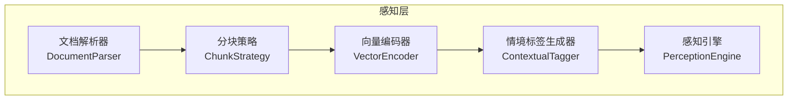
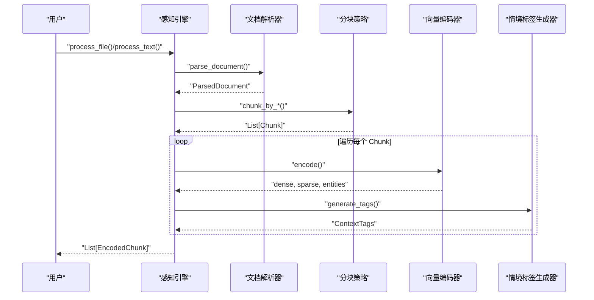
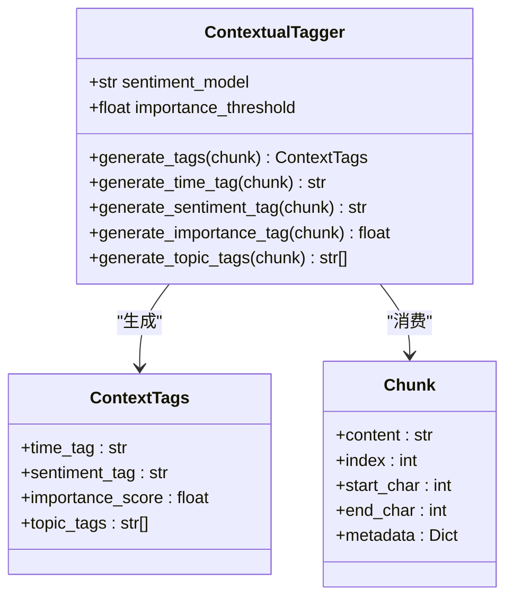
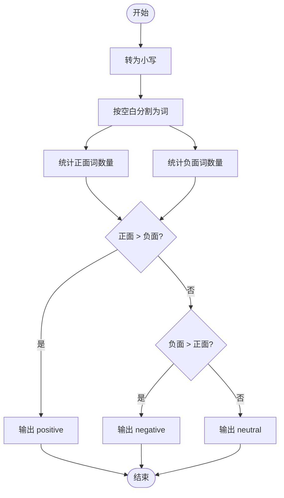
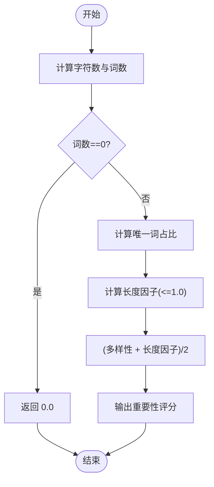
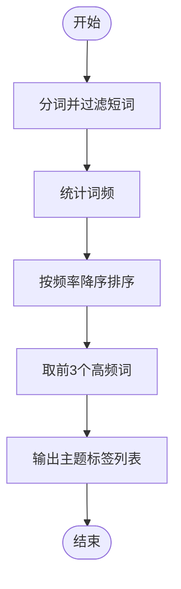
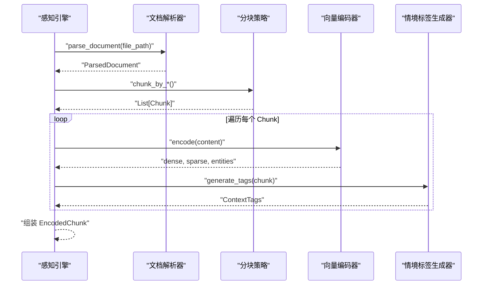
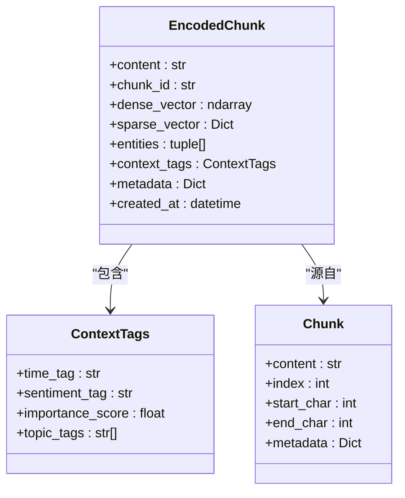
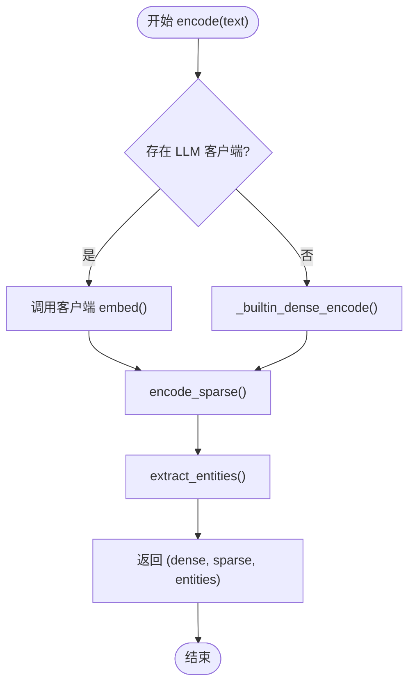
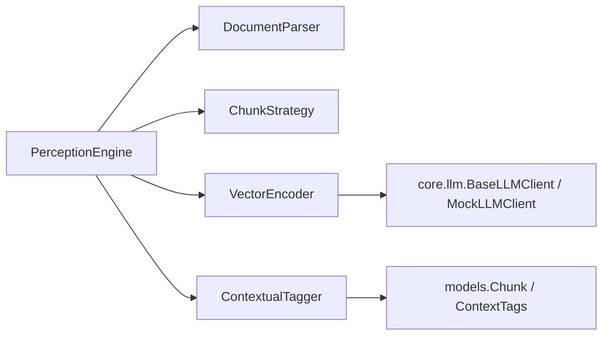

# 情境标记器

<cite>
**本文档引用的文件**
- [src/perception/tagger.py](file://src/perception/tagger.py)
- [src/perception/models.py](file://src/perception/models.py)
- [src/perception/engine.py](file://src/perception/engine.py)
- [src/perception/chunker.py](file://src/perception/chunker.py)
- [src/perception/parser.py](file://src/perception/parser.py)
- [src/perception/encoder.py](file://src/perception/encoder.py)
- [src/perception/README.md](file://src/perception/README.md)
- [src/core/base.py](file://src/core/base.py)
- [src/core/llm/base.py](file://src/core/llm/base.py)
- [src/core/llm/mock.py](file://src/core/llm/mock.py)
- [example/example_usage.py](file://example/example_usage.py)
</cite>

## 目录
1. [简介](#简介)
2. [项目结构](#项目结构)
3. [核心组件](#核心组件)
4. [架构总览](#架构总览)
5. [详细组件分析](#详细组件分析)
6. [依赖关系分析](#依赖关系分析)
7. [性能考量](#性能考量)
8. [故障排查指南](#故障排查指南)
9. [结论](#结论)
10. [附录](#附录)

## 简介
情境标记器是感知层的核心组件之一，负责为每个文本块生成“情境标签”，包括时间标签、情感标签、重要性评分和主题标签。其目标是在语义理解和上下文建模中提供细粒度的元数据，辅助后续的记忆、检索与生成阶段进行更精准的决策。当前实现采用最小可行方案（MVP），通过规则与统计方法快速产出标签；同时预留扩展点，便于集成更强大的模型（如情感分析、主题分类、实体抽取等）。

## 项目结构
感知层围绕“文档解析 → 文本分块 → 向量编码 → 情境标记 → 编码输出”的流水线组织，情境标记器位于编码阶段之后，作为上下文增强环节。

图表来源
- [src/perception/engine.py:14-130](file://src/perception/engine.py#L14-L130)
- [src/perception/parser.py:11-112](file://src/perception/parser.py#L11-L112)
- [src/perception/chunker.py:10-98](file://src/perception/chunker.py#L10-L98)
- [src/perception/encoder.py:24-254](file://src/perception/encoder.py#L24-L254)
- [src/perception/tagger.py:10-144](file://src/perception/tagger.py#L10-L144)

章节来源
- [src/perception/README.md:1-158](file://src/perception/README.md#L1-L158)
- [src/perception/engine.py:14-130](file://src/perception/engine.py#L14-L130)

## 核心组件
- 文档解析器：将多种格式文档解析为统一结构化表示，提供基础元数据。
- 分块策略：将长文档按固定大小、语义或结构进行分块，形成 Chunk。
- 向量编码器：生成稠密向量、稀疏向量与实体三元组，支撑检索与知识图谱。
- 情境标签生成器：为每个 Chunk 生成时间、情感、重要性与主题标签，作为上下文特征。
- 感知引擎：串联上述组件，提供一站式处理接口。

章节来源
- [src/perception/models.py:11-69](file://src/perception/models.py#L11-L69)
- [src/perception/tagger.py:10-144](file://src/perception/tagger.py#L10-L144)
- [src/perception/engine.py:14-130](file://src/perception/engine.py#L14-L130)

## 架构总览
情境标记器在整体流程中的位置如下：

图表来源
- [src/perception/engine.py:54-130](file://src/perception/engine.py#L54-L130)
- [src/perception/tagger.py:32-47](file://src/perception/tagger.py#L32-L47)
- [src/perception/encoder.py:72-86](file://src/perception/encoder.py#L72-L86)

## 详细组件分析

### 情境标签生成器（ContextualTagger）
ContextualTagger 负责为每个 Chunk 生成四类情境标签：
- 时间标签：来源于 Chunk 的元数据（如创建时间），若无则标记为 unknown。
- 情感标签：基于关键词计数的简单规则，区分正面、负面与中性。
- 重要性评分：基于文本长度与词汇多样性（唯一词占比）的统计指标，归一化到 0-1。
- 主题标签：提取高频词作为候选主题，返回前若干个最频繁的词。

图表来源
- [src/perception/tagger.py:10-144](file://src/perception/tagger.py#L10-L144)
- [src/perception/models.py:21-28](file://src/perception/models.py#L21-L28)
- [src/perception/models.py:11-19](file://src/perception/models.py#L11-L19)

章节来源
- [src/perception/tagger.py:17-144](file://src/perception/tagger.py#L17-L144)
- [src/perception/models.py:21-28](file://src/perception/models.py#L21-L28)

#### 情感标签生成流程

图表来源
- [src/perception/tagger.py:66-92](file://src/perception/tagger.py#L66-L92)

#### 重要性评分计算流程

图表来源
- [src/perception/tagger.py:94-119](file://src/perception/tagger.py#L94-L119)

#### 主题标签提取流程

图表来源
- [src/perception/tagger.py:121-143](file://src/perception/tagger.py#L121-L143)

### 感知引擎（PerceptionEngine）
感知引擎负责编排解析、分块、编码与打标，并将最终结果封装为 EncodedChunk，其中包含向量、实体与情境标签。

图表来源
- [src/perception/engine.py:54-130](file://src/perception/engine.py#L54-L130)
- [src/perception/tagger.py:32-47](file://src/perception/tagger.py#L32-L47)
- [src/perception/encoder.py:72-86](file://src/perception/encoder.py#L72-L86)

章节来源
- [src/perception/engine.py:14-130](file://src/perception/engine.py#L14-L130)

### 数据模型与上下文标签
- Chunk：文本块的基本单元，包含内容、索引、字符边界与元数据。
- ContextTags：情境标签容器，包含时间、情感、重要性与主题标签。
- EncodedChunk：编码后的文本块，包含向量、实体与情境标签，用于后续检索与生成。

图表来源
- [src/perception/models.py:11-69](file://src/perception/models.py#L11-L69)

章节来源
- [src/perception/models.py:11-69](file://src/perception/models.py#L11-L69)

### 向量编码器与实体抽取
向量编码器支持两种模式：
- 通过 LLM 客户端（如 MockLLMClient）进行嵌入与批量嵌入。
- 若未提供客户端，则回退到内置的确定性向量生成（基于文本哈希，确保可重复性）。
- 实体抽取采用正则规则匹配，提取“主谓宾”等三元组关系。

图表来源
- [src/perception/encoder.py:72-86](file://src/perception/encoder.py#L72-L86)
- [src/perception/encoder.py:98-103](file://src/perception/encoder.py#L98-L103)
- [src/perception/encoder.py:120-146](file://src/perception/encoder.py#L120-L146)
- [src/perception/encoder.py:148-189](file://src/perception/encoder.py#L148-L189)

章节来源
- [src/perception/encoder.py:24-254](file://src/perception/encoder.py#L24-L254)
- [src/core/llm/mock.py:16-313](file://src/core/llm/mock.py#L16-L313)

### 文档解析与分块策略
- 文档解析器：读取文本文件，生成 ParsedDocument，包含内容、分块与元数据。
- 分块策略：支持固定大小分块、语义分块与结构化分块（当前最小实现为按段落分块）。

章节来源
- [src/perception/parser.py:27-112](file://src/perception/parser.py#L27-L112)
- [src/perception/chunker.py:28-98](file://src/perception/chunker.py#L28-L98)

## 依赖关系分析
- ContextualTagger 依赖 Chunk 与 ContextTags 数据模型。
- PerceptionEngine 组合使用 DocumentParser、ChunkStrategy、VectorEncoder、ContextualTagger。
- VectorEncoder 可选依赖 LLM 客户端（MockLLMClient），否则使用内置实现。
- 整体遵循抽象基类约定，便于替换与扩展。

图表来源
- [src/perception/engine.py:37-40](file://src/perception/engine.py#L37-L40)
- [src/perception/tagger.py](file://src/perception/tagger.py#L7)
- [src/perception/encoder.py:32-61](file://src/perception/encoder.py#L32-L61)
- [src/core/llm/base.py:11-72](file://src/core/llm/base.py#L11-L72)
- [src/core/llm/mock.py:16-313](file://src/core/llm/mock.py#L16-L313)

章节来源
- [src/core/base.py:128-143](file://src/core/base.py#L128-L143)
- [src/core/llm/base.py:11-72](file://src/core/llm/base.py#L11-L72)

## 性能考量
- 当前实现以规则与统计为主，计算开销低，适合大规模批处理。
- 向量编码器在无 LLM 客户端时使用确定性向量生成，避免外部依赖，但语义质量受限。
- 情感与主题标签的复杂度与文本长度线性相关，建议在上游进行合理的分块与预处理。
- 批量嵌入接口已提供，可在高并发场景下提升吞吐。

章节来源
- [src/perception/tagger.py:94-143](file://src/perception/tagger.py#L94-L143)
- [src/perception/encoder.py:105-118](file://src/perception/encoder.py#L105-L118)

## 故障排查指南
- 情感标签恒为中性：确认输入文本包含足够的正面/负面关键词，或考虑扩展情感词表。
- 重要性评分为 0：当文本为空或分词失败时可能出现，需检查输入与分词逻辑。
- 主题标签为空：文本过短或高频词较少，可调整过滤阈值或引入更丰富的分词策略。
- 向量编码异常：若使用 MockLLMClient，请确认嵌入维度设置正确；若依赖外部 LLM，请检查客户端可用性与网络连接。
- 时间标签为 unknown：确保 Chunk.metadata 中包含创建时间字段。

章节来源
- [src/perception/tagger.py:49-92](file://src/perception/tagger.py#L49-L92)
- [src/perception/encoder.py:115-118](file://src/perception/encoder.py#L115-L118)

## 结论
情境标记器通过简单而稳健的规则与统计方法，为每个文本块提供了时间、情感、重要性与主题四个维度的上下文标签。它与感知引擎的其他组件紧密协作，构成从原始文档到语义向量与情境特征的完整管线。随着业务需求演进，可逐步引入更强大的模型与规则，以提升标签质量与语义一致性。

## 附录

### 使用示例与最佳实践
- 基础使用：参考示例脚本，展示如何通过感知引擎处理文本并查看情境标签。
- 多语言支持：向量编码器具备中英文分词与实体抽取的基础能力，主题标签提取亦可处理混合语言。
- 个性化标记：通过调整情感词表、主题词过滤阈值与重要性评分权重，实现面向领域的定制化标签策略。
- 标签质量控制：建议在下游检索与生成阶段结合置信度阈值与一致性校验，确保标签驱动的决策稳定可靠。

章节来源
- [example/example_usage.py:12-47](file://example/example_usage.py#L12-L47)
- [src/perception/encoder.py:214-254](file://src/perception/encoder.py#L214-L254)
- [src/perception/tagger.py:17-31](file://src/perception/tagger.py#L17-L31)