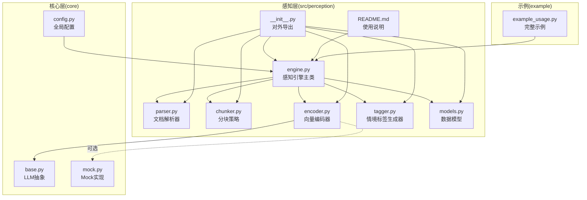
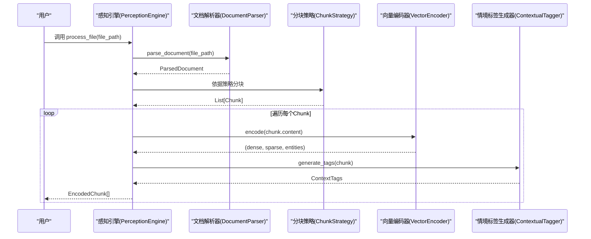
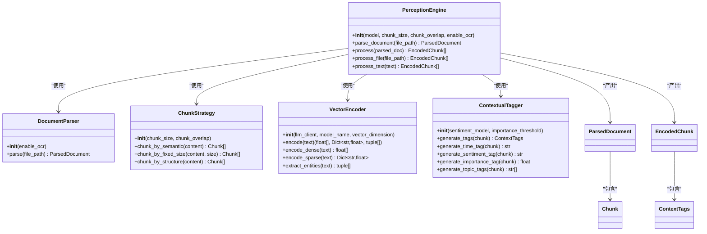
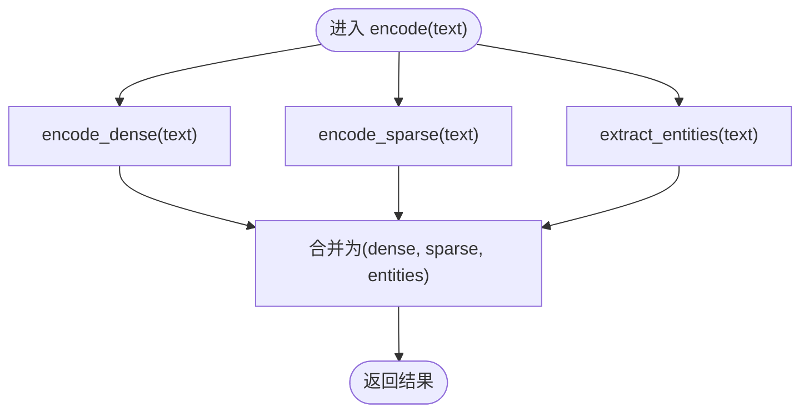
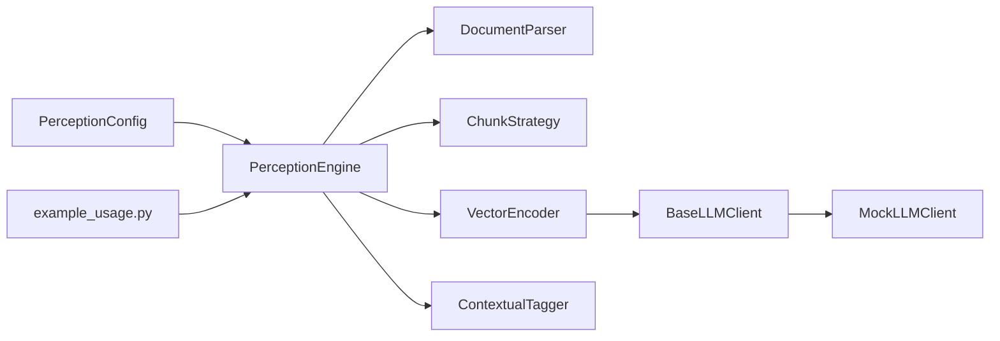

# 感知引擎

<cite>
**本文引用的文件**
- [engine.py](file://src/perception/engine.py)
- [parser.py](file://src/perception/parser.py)
- [chunker.py](file://src/perception/chunker.py)
- [encoder.py](file://src/perception/encoder.py)
- [tagger.py](file://src/perception/tagger.py)
- [models.py](file://src/perception/models.py)
- [__init__.py](file://src/perception/__init__.py)
- [README.md](file://src/perception/README.md)
- [config.py](file://src/core/config.py)
- [base.py](file://src/core/llm/base.py)
- [mock.py](file://src/core/llm/mock.py)
- [example_usage.py](file://example/example_usage.py)
</cite>

## 目录
1. [简介](#简介)
2. [项目结构](#项目结构)
3. [核心组件](#核心组件)
4. [架构总览](#架构总览)
5. [组件详解](#组件详解)
6. [依赖关系分析](#依赖关系分析)
7. [性能与优化](#性能与优化)
8. [故障排查](#故障排查)
9. [结论](#结论)
10. [附录](#附录)

## 简介
感知引擎是 NecoRAG 框架的“感知层”核心组件，负责多模态数据的高精度编码与情境标记。其目标如同猫的胡须一般，能够敏锐感知输入数据的细微变化，并将其转化为可用于后续检索、记忆与响应的高质量结构化表示。感知引擎通过文档解析、分块策略、向量化编码与情境标签生成四个关键环节，形成一条完整的“感知-编码-打标”流水线，为上层模块提供稳定、可扩展且可配置的输入。

## 项目结构
感知引擎位于 src/perception 目录下，包含以下核心文件：
- engine.py：感知引擎主类，协调解析、分块、编码与打标流程
- parser.py：文档解析器，负责将多格式文档转为统一结构
- chunker.py：分块策略，支持固定大小、语义与结构化分块
- encoder.py：向量编码器，生成稠密向量、稀疏向量与实体三元组
- tagger.py：情境标签生成器，为每个文本块添加时间、情感、重要性与主题标签
- models.py：感知层数据模型，定义 Chunk、EncodedChunk、ParsedDocument 等
- __init__.py：对外导出感知引擎相关类与模型
- README.md：感知引擎的使用说明与架构概览
- config.py：全局配置，包含感知层配置项
- base.py、mock.py：LLM 抽象与 Mock 实现，用于向量化编码器的依赖注入
- example_usage.py：完整工作流示例，展示感知引擎的典型用法

图表来源
- [engine.py:14-130](file://src/perception/engine.py#L14-L130)
- [parser.py:11-112](file://src/perception/parser.py#L11-L112)
- [chunker.py:10-98](file://src/perception/chunker.py#L10-L98)
- [encoder.py:24-254](file://src/perception/encoder.py#L24-L254)
- [tagger.py:10-144](file://src/perception/tagger.py#L10-L144)
- [models.py:11-69](file://src/perception/models.py#L11-L69)
- [__init__.py:6-22](file://src/perception/__init__.py#L6-L22)
- [README.md:1-158](file://src/perception/README.md#L1-L158)
- [config.py:105-123](file://src/core/config.py#L105-L123)
- [base.py:11-178](file://src/core/llm/base.py#L11-L178)
- [mock.py:16-313](file://src/core/llm/mock.py#L16-L313)
- [example_usage.py:12-47](file://example/example_usage.py#L12-L47)

章节来源
- [engine.py:14-130](file://src/perception/engine.py#L14-L130)
- [README.md:1-158](file://src/perception/README.md#L1-L158)

## 核心组件
- 感知引擎主类（PerceptionEngine）：协调解析、分块、编码与打标，提供一站式处理接口
- 文档解析器（DocumentParser）：将多格式文档转换为统一结构化表示
- 分块策略（ChunkStrategy）：支持固定大小、语义与结构化分块
- 向量编码器（VectorEncoder）：生成稠密向量、稀疏向量与实体三元组，支持 LLM 客户端注入
- 情境标签生成器（ContextualTagger）：为每个文本块生成时间、情感、重要性与主题标签
- 数据模型（models.py）：定义 Chunk、EncodedChunk、ParsedDocument 等结构化数据

章节来源
- [engine.py:14-130](file://src/perception/engine.py#L14-L130)
- [parser.py:11-112](file://src/perception/parser.py#L11-L112)
- [chunker.py:10-98](file://src/perception/chunker.py#L10-L98)
- [encoder.py:24-254](file://src/perception/encoder.py#L24-L254)
- [tagger.py:10-144](file://src/perception/tagger.py#L10-L144)
- [models.py:11-69](file://src/perception/models.py#L11-L69)

## 架构总览
感知引擎采用“流水线式”架构，将输入数据依次通过解析、分块、编码与打标四个阶段，最终输出结构化的编码块集合。引擎支持两种主要入口：
- 文件入口：process_file(file_path) 一键完成解析、编码与打标
- 文本入口：process_text(text) 仅对纯文本进行分块与编码打标

图表来源
- [engine.py:42-106](file://src/perception/engine.py#L42-L106)
- [parser.py:27-59](file://src/perception/parser.py#L27-L59)
- [chunker.py:28-82](file://src/perception/chunker.py#L28-L82)
- [encoder.py:72-86](file://src/perception/encoder.py#L72-L86)
- [tagger.py:32-47](file://src/perception/tagger.py#L32-L47)

## 组件详解

### 感知引擎主类（PerceptionEngine）
- 职责：协调解析、分块、编码与打标；提供 process_file 与 process_text 两种入口
- 关键方法：
  - parse_document：委托给 DocumentParser
  - process：遍历 ParsedDocument.chunks，调用 VectorEncoder 与 ContextualTagger，组装 EncodedChunk
  - process_file：解析后直接编码打标
  - process_text：先分块再编码打标
- 配置参数：
  - model：向量化模型名称，默认 BGE-M3
  - chunk_size：分块大小，默认 512
  - chunk_overlap：分块重叠，默认 50
  - enable_ocr：是否启用 OCR（传递给 DocumentParser）

图表来源
- [engine.py:14-130](file://src/perception/engine.py#L14-L130)
- [parser.py:11-112](file://src/perception/parser.py#L11-L112)
- [chunker.py:10-98](file://src/perception/chunker.py#L10-L98)
- [encoder.py:24-254](file://src/perception/encoder.py#L24-L254)
- [tagger.py:10-144](file://src/perception/tagger.py#L10-L144)
- [models.py:11-69](file://src/perception/models.py#L11-L69)

章节来源
- [engine.py:21-130](file://src/perception/engine.py#L21-L130)

### 文档解析器（DocumentParser）
- 职责：将多格式文档转换为统一结构化表示 ParsedDocument
- 当前实现：读取文本文件，简单分块，返回 ParsedDocument
- 可扩展点：集成 RAGFlow 进行深度解析、OCR、表格与图片提取等（TODO 注释）
- 关键方法：
  - parse：校验文件存在性，读取内容并简单分块
  - extract_tables / extract_images：当前返回空列表（预留实现）

章节来源
- [parser.py:18-112](file://src/perception/parser.py#L18-L112)

### 分块策略（ChunkStrategy）
- 职责：将长文本切分为多个 Chunk，支持多种策略
- 策略实现：
  - 语义分块：按段落分割（最小实现）
  - 固定大小分块：按 chunk_size 与 chunk_overlap 切分
  - 结构化分块：按标题、段落等结构切分（最小实现为语义分块）
- 关键方法：
  - chunk_by_semantic
  - chunk_by_fixed_size
  - chunk_by_structure

章节来源
- [chunker.py:17-98](file://src/perception/chunker.py#L17-L98)

### 向量编码器（VectorEncoder）
- 职责：生成多类型向量表示与实体三元组
- 能力：
  - 稠密向量：优先使用 LLM 客户端 embed/embed_batch；若未提供则回退到内置确定性实现
  - 稀疏向量：基于 TF-IDF 风格的词频统计，返回关键词权重字典
  - 实体三元组：基于规则提取（主体-关系-客体），可由 LLM 增强
- 依赖注入：通过构造函数注入 BaseLLMClient 或使用 MockLLMClient
- 关键方法：
  - encode / encode_dense / encode_dense_batch
  - encode_sparse
  - extract_entities

图表来源
- [encoder.py:72-86](file://src/perception/encoder.py#L72-L86)
- [encoder.py:88-118](file://src/perception/encoder.py#L88-L118)
- [encoder.py:120-146](file://src/perception/encoder.py#L120-L146)
- [encoder.py:148-189](file://src/perception/encoder.py#L148-L189)

章节来源
- [encoder.py:32-254](file://src/perception/encoder.py#L32-L254)
- [base.py:11-72](file://src/core/llm/base.py#L11-L72)
- [mock.py:16-134](file://src/core/llm/mock.py#L16-L134)

### 情境标签生成器（ContextualTagger）
- 职责：为每个 Chunk 生成情境标签，模拟猫胡须对环境微变化的感知
- 标签类型：
  - 时间标签：基于元数据（如 created_at）或 unknown
  - 情感标签：基于关键词检测（positive/negative/neutral）
  - 重要性评分：基于信息密度与长度因子的综合评分
  - 主题标签：基于高频词提取的主题关键词
- 关键方法：
  - generate_tags：组合四类标签
  - generate_time_tag / generate_sentiment_tag / generate_importance_tag / generate_topic_tags

章节来源
- [tagger.py:17-144](file://src/perception/tagger.py#L17-L144)

### 数据模型（models.py）
- Chunk：文本块，包含内容、索引、字符范围与元数据
- ContextTags：情境标签，包含时间、情感、重要性与主题标签
- EncodedChunk：编码后的文本块，包含稠密向量、稀疏向量、实体三元组、情境标签与元数据
- ParsedDocument：解析后的文档，包含文件路径、内容、分块、表格、图片与元数据

章节来源
- [models.py:11-69](file://src/perception/models.py#L11-L69)

## 依赖关系分析
- 感知引擎主类依赖四大组件：DocumentParser、ChunkStrategy、VectorEncoder、ContextualTagger
- VectorEncoder 可依赖 LLM 抽象 BaseLLMClient，若未提供则回退到 MockLLMClient
- 全局配置（config.py）提供感知层配置项，如分块大小、重叠、策略与标签开关
- 示例（example_usage.py）展示了从感知到记忆、检索、精炼与响应的完整工作流

图表来源
- [engine.py:37-40](file://src/perception/engine.py#L37-L40)
- [encoder.py:46-60](file://src/perception/encoder.py#L46-L60)
- [base.py:11-72](file://src/core/llm/base.py#L11-L72)
- [mock.py:16-134](file://src/core/llm/mock.py#L16-L134)
- [config.py:105-123](file://src/core/config.py#L105-L123)
- [example_usage.py:12-47](file://example/example_usage.py#L12-L47)

章节来源
- [engine.py:37-40](file://src/perception/engine.py#L37-L40)
- [encoder.py:46-60](file://src/perception/encoder.py#L46-L60)
- [config.py:105-123](file://src/core/config.py#L105-L123)

## 性能与优化
- 向量化性能
  - 稠密向量：优先使用 LLM 客户端 embed_batch 进行批量向量化，减少调用开销
  - 稀疏向量：基于词频统计，复杂度与文本长度线性相关，建议控制分块大小
  - 实体抽取：基于正则规则，复杂度较低，但可考虑引入 LLM 增强以提升召回
- 分块策略
  - 固定大小分块：适合大规模文档批处理，重叠可保证语义连续性
  - 语义分块：按段落切分，适合保留结构信息
  - 结构化分块：按标题、段落等结构切分，需结合文档类型选择
- 标签生成
  - 情感与主题标签：基于关键词与高频词统计，复杂度低，适合实时生成
  - 重要性评分：信息密度与长度因子的加权平均，可作为后续重排序的特征
- 配置建议
  - 分块大小与重叠：根据下游检索与记忆系统的向量维度与存储成本平衡
  - 向量维度：根据硬件与内存资源选择合适的维度，兼顾精度与性能
  - 标签开关：在资源受限场景可关闭非必要标签，降低计算开销

[本节为通用性能讨论，无需列出章节来源]

## 故障排查
- 文件不存在
  - 现象：解析阶段抛出 FileNotFoundError
  - 排查：确认文件路径正确，权限可读
  - 参考位置：[parser.py:41-42](file://src/perception/parser.py#L41-L42)
- 向量化客户端缺失
  - 现象：未提供 LLM 客户端时回退到 Mock 实现，确保 Mock 可用
  - 排查：检查 core 模块是否可用，或显式传入 llm_client
  - 参考位置：[encoder.py:50-60](file://src/perception/encoder.py#L50-L60)
- 分块为空
  - 现象：分块结果为空导致编码失败
  - 排查：检查输入文本长度与分块策略参数
  - 参考位置：[chunker.py:72-81](file://src/perception/chunker.py#L72-L81)
- 标签生成异常
  - 现象：情感或主题标签为空
  - 排查：检查文本内容与停用词过滤逻辑
  - 参考位置：[tagger.py:78-92](file://src/perception/tagger.py#L78-L92)

章节来源
- [parser.py:41-42](file://src/perception/parser.py#L41-L42)
- [encoder.py:50-60](file://src/perception/encoder.py#L50-L60)
- [chunker.py:72-81](file://src/perception/chunker.py#L72-L81)
- [tagger.py:78-92](file://src/perception/tagger.py#L78-L92)

## 结论
感知引擎通过“解析-分块-编码-打标”的流水线设计，实现了对多模态数据的高精度编码与情境标记。其模块化结构便于扩展与替换，既可与真实 LLM 客户端集成，也可在离线或演示环境下使用 Mock 实现。配合全局配置与示例用法，开发者可以快速搭建从感知到响应的完整工作流，并根据业务需求进行定制化优化。

[本节为总结性内容，无需列出章节来源]

## 附录

### 使用示例与配置参数
- 使用示例
  - 参考路径：[example_usage.py:12-47](file://example/example_usage.py#L12-L47)
- 配置参数（感知层）
  - 分块大小：chunk_size（默认 512）
  - 分块重叠：chunk_overlap（默认 50）
  - 分块策略：chunk_strategy（fixed/semantic/structural）
  - 标签开关：enable_time_tag、enable_emotion_tag、enable_importance_tag、enable_topic_tag
  - 支持格式：supported_formats（默认 txt/md/pdf/docx/html）
  - 参考路径：[config.py:105-123](file://src/core/config.py#L105-L123)
- 感知引擎初始化参数
  - model：向量化模型名称（默认 BGE-M3）
  - chunk_size：分块大小（默认 512）
  - chunk_overlap：分块重叠（默认 50）
  - enable_ocr：是否启用 OCR（默认 True）
  - 参考路径：[engine.py:21-27](file://src/perception/engine.py#L21-L27)

章节来源
- [example_usage.py:12-47](file://example/example_usage.py#L12-L47)
- [config.py:105-123](file://src/core/config.py#L105-L123)
- [engine.py:21-27](file://src/perception/engine.py#L21-L27)