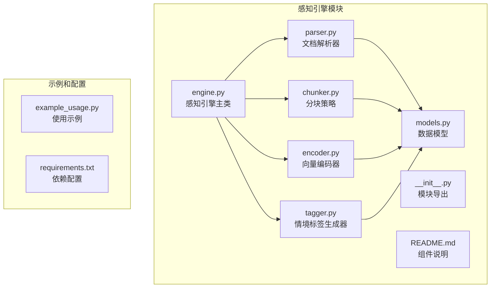
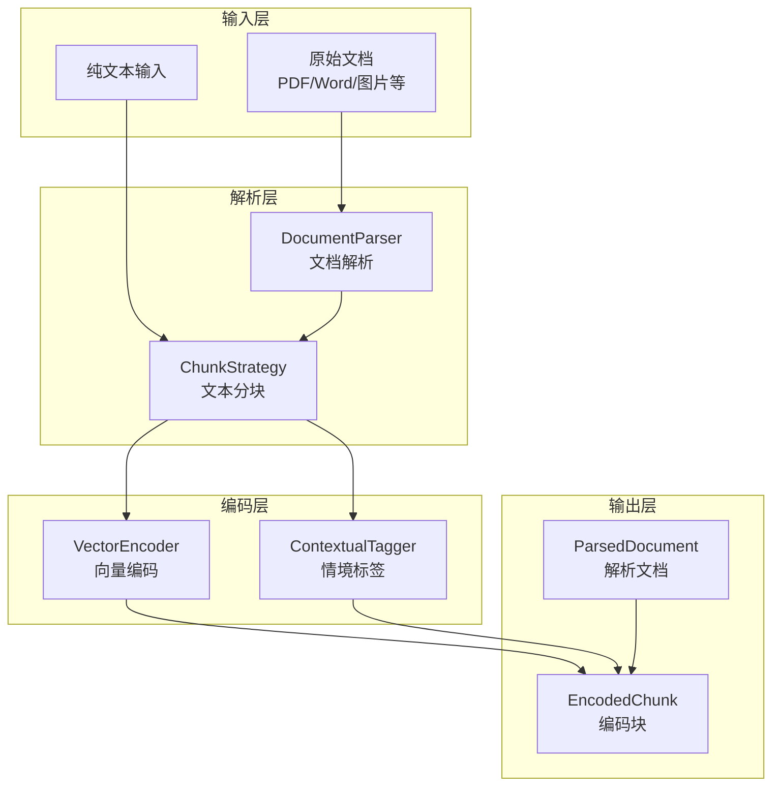
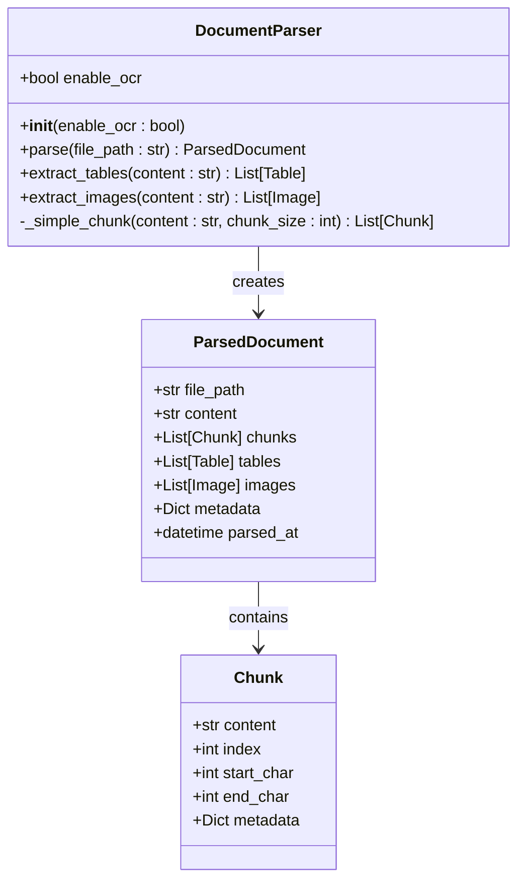
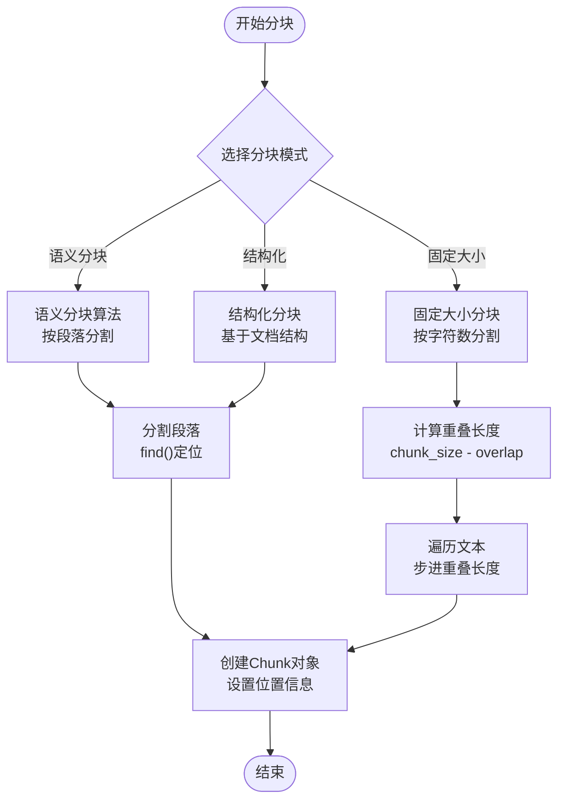
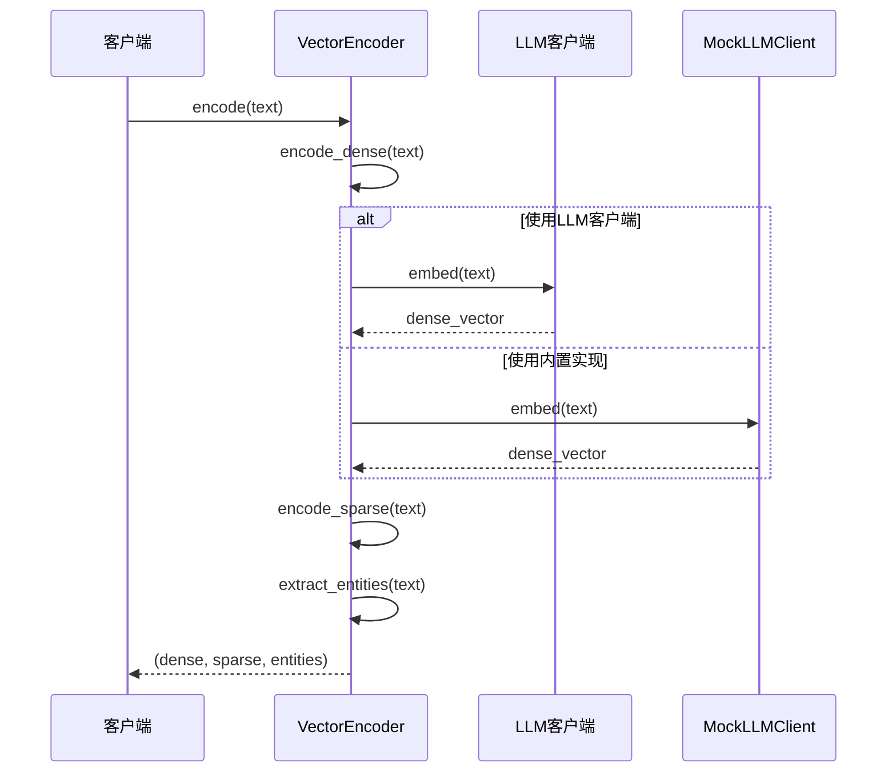
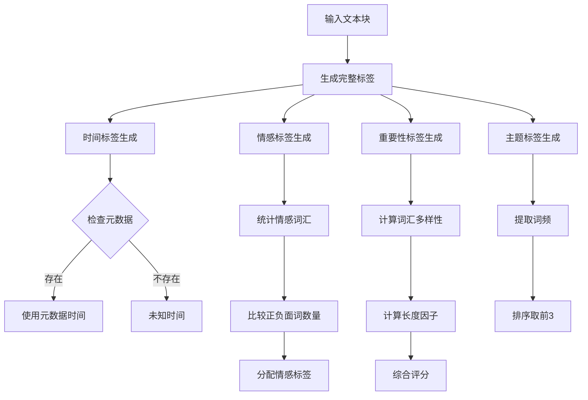
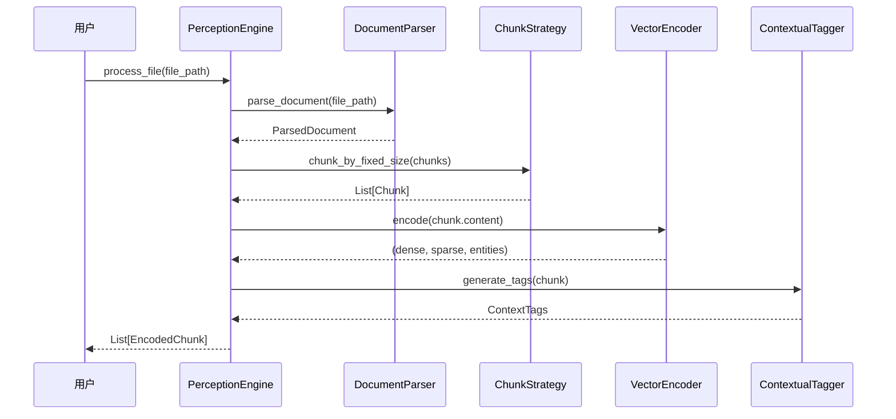
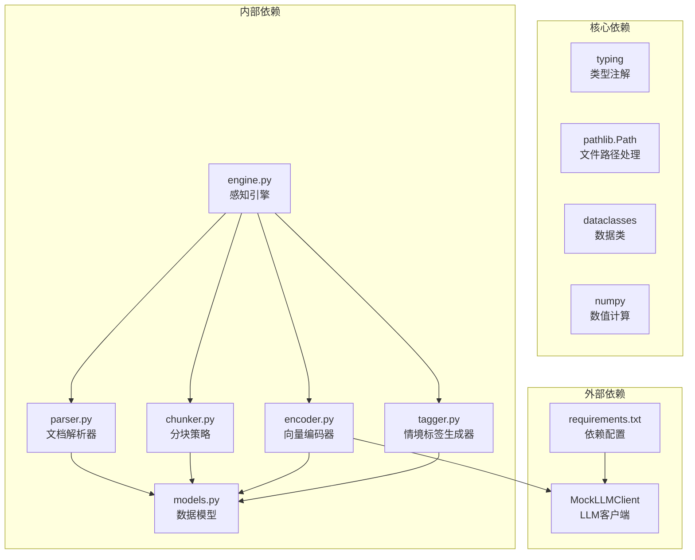
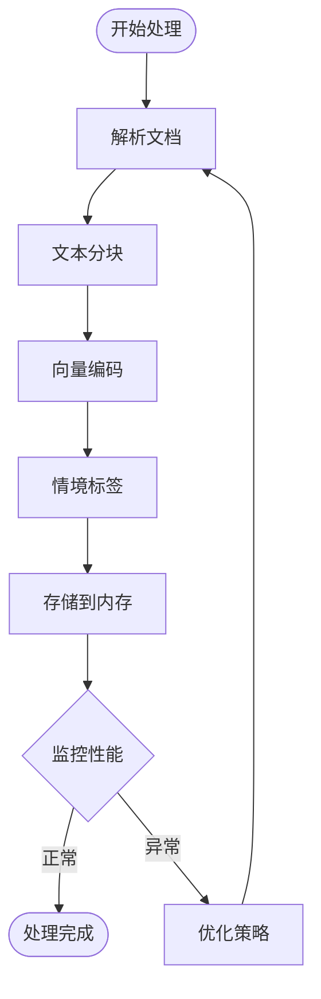
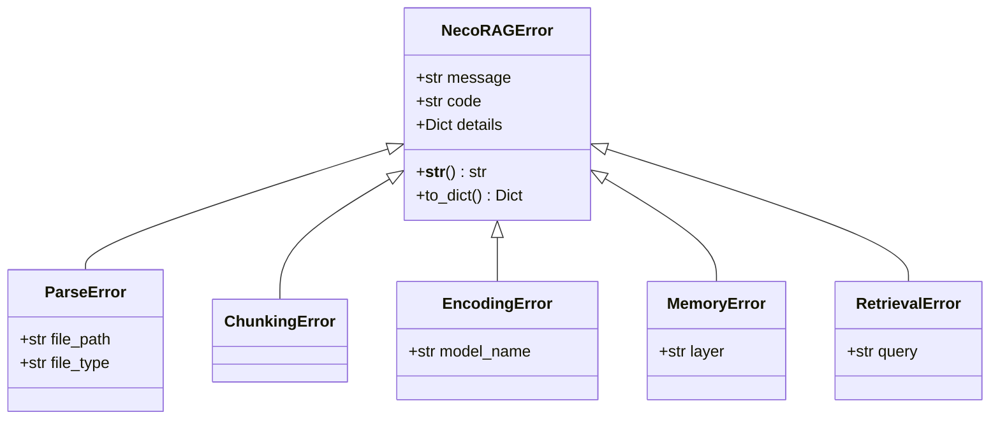

# 文档解析器

<cite>
**本文档引用的文件**
- [parser.py](file://src/perception/parser.py)
- [engine.py](file://src/perception/engine.py)
- [chunker.py](file://src/perception/chunker.py)
- [encoder.py](file://src/perception/encoder.py)
- [tagger.py](file://src/perception/tagger.py)
- [models.py](file://src/perception/models.py)
- [README.md](file://src/perception/README.md)
- [__init__.py](file://src/perception/__init__.py)
- [example_usage.py](file://example/example_usage.py)
- [requirements.txt](file://requirements.txt)
- [mock.py](file://src/core/llm/mock.py)
- [exceptions.py](file://src/core/exceptions.py)
</cite>

## 目录
1. [简介](#简介)
2. [项目结构](#项目结构)
3. [核心组件](#核心组件)
4. [架构概览](#架构概览)
5. [详细组件分析](#详细组件分析)
6. [依赖分析](#依赖分析)
7. [性能考虑](#性能考虑)
8. [故障排除指南](#故障排除指南)
9. [结论](#结论)
10. [附录](#附录)

## 简介

文档解析器是 NecoRAG 框架感知层的核心组件，负责将各种格式的文档转换为统一的结构化表示。该组件支持多格式文档解析、OCR 光学字符识别、元数据提取和文档结构分析，为后续的向量化处理和智能检索提供基础。

文档解析器的设计理念是"像猫的胡须一样敏锐感知环境变化"，能够精确地理解和处理输入的各种数据形式。通过集成 RAGFlow 进行深度文档解析，支持 OCR 功能，以及表格结构还原，为用户提供全面的文档处理能力。

## 项目结构

文档解析器组件位于 `src/perception/` 目录下，包含以下核心文件：



**图表来源**
- [parser.py:1-112](file://src/perception/parser.py#L1-L112)
- [engine.py:1-130](file://src/perception/engine.py#L1-L130)
- [chunker.py:1-98](file://src/perception/chunker.py#L1-L98)
- [encoder.py:1-254](file://src/perception/encoder.py#L1-L254)
- [tagger.py:1-144](file://src/perception/tagger.py#L1-L144)
- [models.py:1-69](file://src/perception/models.py#L1-L69)

**章节来源**
- [parser.py:1-112](file://src/perception/parser.py#L1-L112)
- [engine.py:1-130](file://src/perception/engine.py#L1-L130)
- [chunker.py:1-98](file://src/perception/chunker.py#L1-L98)
- [encoder.py:1-254](file://src/perception/encoder.py#L1-L254)
- [tagger.py:1-144](file://src/perception/tagger.py#L1-L144)
- [models.py:1-69](file://src/perception/models.py#L1-L69)

## 核心组件

文档解析器由五个核心组件构成，每个组件都有明确的职责和接口：

### 1. 文档解析器 (DocumentParser)
负责将各种格式的文档转换为统一的结构化表示，支持文件存在性验证和基础文本提取。

### 2. 分块策略 (ChunkStrategy)
提供多种文本分块算法，包括语义分块、固定大小分块和结构化分块，支持自定义分块参数。

### 3. 向量编码器 (VectorEncoder)
生成多类型向量表示，包括稠密向量、稀疏向量和实体三元组，支持 LLM 客户端集成。

### 4. 情境标签生成器 (ContextualTagger)
为每个文本块生成丰富的情境标签，包括时间标签、情感标签、重要性评分和主题标签。

### 5. 感知引擎 (PerceptionEngine)
协调各个组件的工作流程，提供一站式文档处理服务。

**章节来源**
- [parser.py:11-112](file://src/perception/parser.py#L11-L112)
- [chunker.py:10-98](file://src/perception/chunker.py#L10-L98)
- [encoder.py:24-254](file://src/perception/encoder.py#L24-L254)
- [tagger.py:10-144](file://src/perception/tagger.py#L10-L144)
- [engine.py:14-130](file://src/perception/engine.py#L14-L130)

## 架构概览

文档解析器采用模块化设计，各组件之间通过清晰的接口进行通信：



**图表来源**
- [engine.py:42-106](file://src/perception/engine.py#L42-L106)
- [parser.py:27-59](file://src/perception/parser.py#L27-L59)
- [chunker.py:28-82](file://src/perception/chunker.py#L28-L82)
- [encoder.py:72-86](file://src/perception/encoder.py#L72-L86)
- [tagger.py:32-47](file://src/perception/tagger.py#L32-L47)

## 详细组件分析

### 文档解析器 (DocumentParser)

文档解析器是感知引擎的核心组件，负责将各种格式的文档转换为统一的结构化表示。

#### 核心功能

1. **文件存在性验证**：检查输入文件是否存在
2. **基础文本提取**：读取 UTF-8 编码的文本内容
3. **元数据收集**：提取文件名、扩展名、文件大小等信息
4. **文本分块**：将长文本分割为适中的块大小

#### 主要方法



**图表来源**
- [parser.py:11-112](file://src/perception/parser.py#L11-L112)
- [models.py:60-69](file://src/perception/models.py#L60-L69)
- [models.py:11-19](file://src/perception/models.py#L11-L19)

#### 配置选项

| 参数名 | 类型 | 默认值 | 说明 |
|--------|------|--------|------|
| `enable_ocr` | bool | True | 是否启用 OCR 功能 |

**章节来源**
- [parser.py:18-25](file://src/perception/parser.py#L18-L25)
- [parser.py:27-59](file://src/perception/parser.py#L27-L59)

### 分块策略 (ChunkStrategy)

分块策略提供了多种文本分块算法，支持灵活的文本处理需求。

#### 支持的分块模式

1. **语义分块**：基于段落和语义单元进行分割
2. **固定大小分块**：按照指定的字符数进行均匀分割
3. **结构化分块**：基于文档结构（标题、段落等）进行分割

#### 分块算法流程



**图表来源**
- [chunker.py:28-56](file://src/perception/chunker.py#L28-L56)
- [chunker.py:58-82](file://src/perception/chunker.py#L58-L82)
- [chunker.py:84-97](file://src/perception/chunker.py#L84-L97)

#### 配置参数

| 参数名 | 类型 | 默认值 | 说明 |
|--------|------|--------|------|
| `chunk_size` | int | 512 | 分块大小（字符数） |
| `chunk_overlap` | int | 50 | 分块重叠长度 |

**章节来源**
- [chunker.py:17-26](file://src/perception/chunker.py#L17-L26)
- [chunker.py:28-82](file://src/perception/chunker.py#L28-L82)

### 向量编码器 (VectorEncoder)

向量编码器生成多类型向量表示，为文档检索和相似度计算提供基础。

#### 多类型向量生成

1. **稠密向量**：高维语义表示，使用 BGE-M3 模型
2. **稀疏向量**：关键词权重表示，使用 TF-IDF 风格
3. **实体三元组**：知识图谱构建基础，提取主体-关系-客体三元组

#### 编码流程



**图表来源**
- [encoder.py:72-86](file://src/perception/encoder.py#L72-L86)
- [encoder.py:98-103](file://src/perception/encoder.py#L98-L103)
- [encoder.py:120-146](file://src/perception/encoder.py#L120-L146)
- [encoder.py:148-189](file://src/perception/encoder.py#L148-L189)

#### 向量编码策略

| 向量类型 | 编码方法 | 特点 |
|----------|----------|------|
| 稠密向量 | LLM嵌入/内置哈希 | 高维语义表示，支持批量处理 |
| 稀疏向量 | TF-IDF词频统计 | 关键词权重，可解释性强 |
| 实体三元组 | 规则匹配 | 知识图谱基础，关系抽取 |

**章节来源**
- [encoder.py:24-61](file://src/perception/encoder.py#L24-L61)
- [encoder.py:88-118](file://src/perception/encoder.py#L88-L118)
- [encoder.py:120-189](file://src/perception/encoder.py#L120-L189)

### 情境标签生成器 (ContextualTagger)

情境标签生成器为每个文本块添加丰富的元数据标签，模拟猫胡须的环境感知能力。

#### 标签类型

1. **时间标签**：文档创建时间、更新时间、时效性
2. **情感标签**：正面/负面/中性情感，情绪强度
3. **重要性标签**：基于内容质量、信息密度的评分
4. **主题标签**：自动分类、关键词提取

#### 标签生成算法



**图表来源**
- [tagger.py:32-47](file://src/perception/tagger.py#L32-L47)
- [tagger.py:49-64](file://src/perception/tagger.py#L49-L64)
- [tagger.py:66-92](file://src/perception/tagger.py#L66-L92)
- [tagger.py:94-119](file://src/perception/tagger.py#L94-L119)
- [tagger.py:121-143](file://src/perception/tagger.py#L121-L143)

**章节来源**
- [tagger.py:17-30](file://src/perception/tagger.py#L17-L30)
- [tagger.py:32-143](file://src/perception/tagger.py#L32-L143)

### 感知引擎 (PerceptionEngine)

感知引擎是文档解析器的协调中心，整合各个组件的功能。

#### 工作流程



**图表来源**
- [engine.py:92-106](file://src/perception/engine.py#L92-L106)
- [engine.py:54-90](file://src/perception/engine.py#L54-L90)
- [engine.py:108-129](file://src/perception/engine.py#L108-L129)

#### 配置参数

| 参数名 | 类型 | 默认值 | 说明 |
|--------|------|--------|------|
| `model` | str | "BGE-M3" | 向量化模型名称 |
| `chunk_size` | int | 512 | 分块大小 |
| `chunk_overlap` | int | 50 | 分块重叠长度 |
| `enable_ocr` | bool | True | 是否启用 OCR |

**章节来源**
- [engine.py:21-40](file://src/perception/engine.py#L21-L40)
- [engine.py:42-129](file://src/perception/engine.py#L42-L129)

## 依赖分析

文档解析器组件之间的依赖关系如下：



**图表来源**
- [parser.py:6-8](file://src/perception/parser.py#L6-L8)
- [models.py:5-8](file://src/perception/models.py#L5-L8)
- [encoder.py:8-21](file://src/perception/encoder.py#L8-L21)
- [engine.py:5-11](file://src/perception/engine.py#L5-L11)

### 外部依赖

文档解析器支持多种外部依赖，可根据需要启用：

| 依赖类型 | 包名 | 版本要求 | 用途 |
|----------|------|----------|------|
| 文档解析 | ragflow | - | 深度文档解析 |
| PDF处理 | PyMuPDF | >=1.23.0 | PDF文档解析 |
| Word处理 | python-docx | >=0.8.11 | Word文档解析 |
| HTML解析 | beautifulsoup4 | >=4.12.0 | HTML文档解析 |
| 向量数据库 | qdrant-client | >=1.7.0 | 向量存储 |
| 图数据库 | neo4j | >=5.14.0 | 图存储 |
| 缓存 | redis | >=5.0.0 | 内存缓存 |
| 嵌入模型 | FlagEmbedding | >=1.2.0 | BGE-M3, BGE-Reranker |
| LLM集成 | langchain | >=0.1.0 | LLM客户端 |

**章节来源**
- [requirements.txt:12-41](file://requirements.txt#L12-L41)
- [README.md:139-142](file://src/perception/README.md#L139-L142)

## 性能考虑

### 性能指标

根据组件设计文档，文档解析器具有以下性能特征：

- **文档解析速度**：PDF 约 10-20 页/秒
- **向量化速度**：约 1000 chunks/秒（GPU）
- **标签生成速度**：约 500 chunks/秒

### 优化策略

1. **批处理优化**：向量编码器支持批量处理，减少 LLM 调用开销
2. **内存管理**：合理设置分块大小和重叠长度，平衡内存使用和信息完整性
3. **缓存机制**：利用 MockLLMClient 的确定性特性，便于测试和缓存
4. **异步处理**：可扩展为异步处理模式，提高并发性能

### 性能监控



## 故障排除指南

### 常见错误类型

文档解析器定义了完善的异常处理机制：



**图表来源**
- [exceptions.py:10-41](file://src/core/exceptions.py#L10-L41)
- [exceptions.py:46-66](file://src/core/exceptions.py#L46-L66)
- [exceptions.py:69-74](file://src/core/exceptions.py#L69-L74)
- [exceptions.py:77-92](file://src/core/exceptions.py#L77-L92)

### 错误处理策略

1. **文件不存在错误**：在文档解析阶段捕获 FileNotFoundError
2. **解析错误**：使用 ParseError 包含文件路径和类型信息
3. **编码错误**：使用 EncodingError 包含模型名称信息
4. **内存错误**：使用 MemoryError 包含层级信息

### 调试技巧

1. **启用详细日志**：检查文件路径和权限
2. **验证依赖安装**：确认外部依赖正确安装
3. **测试向量维度**：验证编码器输出的向量维度
4. **检查分块结果**：验证文本分块的边界和重叠

**章节来源**
- [parser.py:41-42](file://src/perception/parser.py#L41-L42)
- [exceptions.py:46-92](file://src/core/exceptions.py#L46-L92)

## 结论

文档解析器组件为 NecoRAG 框架提供了强大的多格式文档处理能力。通过模块化的架构设计，组件间职责清晰，易于扩展和维护。

### 主要优势

1. **多格式支持**：支持 PDF、Word、Markdown、HTML 等多种文档格式
2. **灵活配置**：提供丰富的配置选项，适应不同使用场景
3. **可扩展性**：基于抽象接口设计，易于集成新的解析器和编码器
4. **性能优化**：支持批量处理和缓存机制，提高处理效率

### 发展方向

1. **增强 OCR 功能**：集成更先进的 OCR 引擎
2. **表格理解**：提升表格结构识别和还原能力
3. **多模态处理**：支持文本、图片、表格的联合处理
4. **增量处理**：支持文档的增量更新和增量索引

## 附录

### 使用示例

#### 基础使用

```python
from src.perception.engine import PerceptionEngine

# 初始化引擎
engine = PerceptionEngine(
    model="BGE-M3",
    chunk_size=512,
    chunk_overlap=50,
    enable_ocr=True
)

# 处理文本
text = "这是一个示例文本..."
encoded_chunks = engine.process_text(text)
```

#### 高级配置

```python
# 自定义分块策略
chunker = ChunkStrategy(chunk_size=1024, chunk_overlap=100)

# 自定义标签生成器
tagger = ContextualTagger(
    sentiment_model="advanced",
    importance_threshold=0.7
)

# 自定义向量编码器
encoder = VectorEncoder(
    model_name="custom-model",
    vector_dimension=1024
)
```

### 最佳实践

1. **合理设置分块参数**：根据文档类型调整 chunk_size 和 chunk_overlap
2. **启用适当的 OCR**：对于扫描版文档启用 OCR 功能
3. **监控性能指标**：定期检查处理速度和内存使用情况
4. **错误处理**：实现完善的异常处理和日志记录
5. **测试验证**：使用示例代码验证组件功能

**章节来源**
- [example_usage.py:12-47](file://example/example_usage.py#L12-L47)
- [README.md:100-158](file://src/perception/README.md#L100-L158)