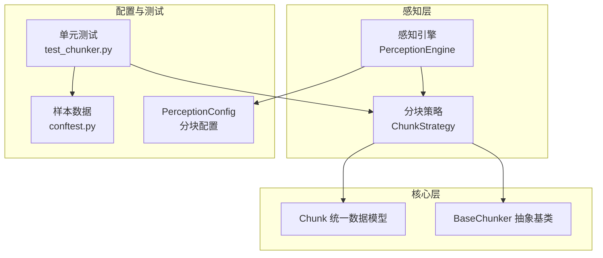
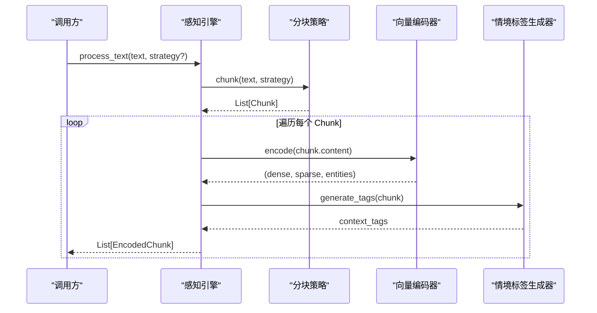
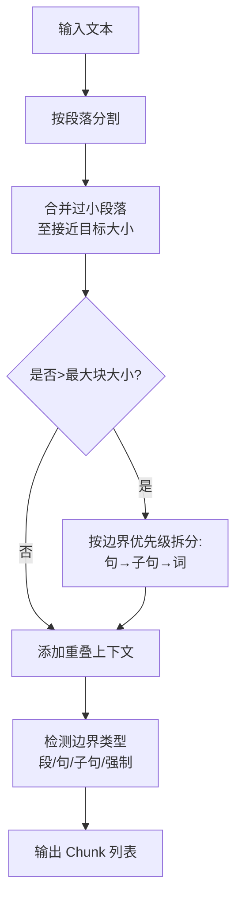
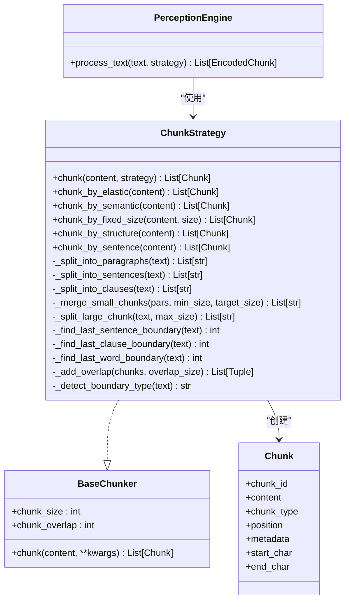

# 分块策略

<cite>
**本文引用的文件**
- [src/perception/chunker.py](file://src/perception/chunker.py)
- [src/core/base.py](file://src/core/base.py)
- [src/core/protocols.py](file://src/core/protocols.py)
- [src/perception/engine.py](file://src/perception/engine.py)
- [src/core/config.py](file://src/core/config.py)
- [tests/test_perception/test_chunker.py](file://tests/test_perception/test_chunker.py)
- [tests/conftest.py](file://tests/conftest.py)
- [example/example_usage.py](file://example/example_usage.py)
</cite>

## 目录
1. [引言](#引言)
2. [项目结构](#项目结构)
3. [核心组件](#核心组件)
4. [架构总览](#架构总览)
5. [详细组件分析](#详细组件分析)
6. [依赖分析](#依赖分析)
7. [性能考量](#性能考量)
8. [故障排查指南](#故障排查指南)
9. [结论](#结论)
10. [附录](#附录)

## 引言
本文件面向开发者与架构师，系统化阐述分块策略模块的设计与实现，覆盖弹性切割、语义切割、固定大小切割、结构化切割与句子级切割五种策略，解释其原理、参数配置、边界检测与重叠机制，并提供性能对比、质量控制方法与实践建议。文档同时给出策略选择指南与优化建议，帮助在不同业务场景下做出最优决策。

## 项目结构
分块策略位于感知层（Perception），与解析、编码、打标等模块协同工作。核心文件与职责如下：
- 分块策略实现：src/perception/chunker.py
- 抽象基类与统一数据模型：src/core/base.py、src/core/protocols.py
- 感知引擎入口：src/perception/engine.py
- 配置与预设：src/core/config.py
- 单元测试与样本数据：tests/test_perception/test_chunker.py、tests/conftest.py
- 使用示例：example/example_usage.py

图表来源
- [src/perception/chunker.py:12-86](file://src/perception/chunker.py#L12-L86)
- [src/core/base.py:66-101](file://src/core/base.py#L66-L101)
- [src/core/protocols.py:100-117](file://src/core/protocols.py#L100-L117)
- [src/perception/engine.py:20-76](file://src/perception/engine.py#L20-L76)
- [src/core/config.py:105-132](file://src/core/config.py#L105-L132)
- [tests/test_perception/test_chunker.py:1-532](file://tests/test_perception/test_chunker.py#L1-L532)
- [tests/conftest.py:94-330](file://tests/conftest.py#L94-L330)

章节来源
- [src/perception/chunker.py:12-86](file://src/perception/chunker.py#L12-L86)
- [src/core/base.py:66-101](file://src/core/base.py#L66-L101)
- [src/core/protocols.py:100-117](file://src/core/protocols.py#L100-L117)
- [src/perception/engine.py:20-76](file://src/perception/engine.py#L20-L76)
- [src/core/config.py:105-132](file://src/core/config.py#L105-L132)
- [tests/test_perception/test_chunker.py:1-532](file://tests/test_perception/test_chunker.py#L1-L532)
- [tests/conftest.py:94-330](file://tests/conftest.py#L94-L330)

## 核心组件
- 分块策略类（ChunkStrategy）
  - 支持统一入口 chunk(content, strategy) 路由至具体策略
  - 默认策略由 enable_elastic 控制：开启则弹性切割，否则固定大小切割
  - 关键参数：chunk_size、chunk_overlap、min_chunk_size、target_chunk_size、max_chunk_size、enable_elastic、semantic_boundaries
- 抽象基类 BaseChunker
  - 规范 chunk 方法签名与 chunk_size/chunk_overlap 属性
- 统一数据模型 Chunk
  - 统一的分块结构，包含 content、position、metadata、start_char/end_char 等

章节来源
- [src/perception/chunker.py:19-47](file://src/perception/chunker.py#L19-L47)
- [src/perception/chunker.py:49-85](file://src/perception/chunker.py#L49-L85)
- [src/core/base.py:66-101](file://src/core/base.py#L66-L101)
- [src/core/protocols.py:100-117](file://src/core/protocols.py#L100-L117)

## 架构总览
分块策略在感知引擎中作为“分块器”被调用，随后进入编码与情境打标阶段。整体流程如下：

图表来源
- [src/perception/engine.py:156-195](file://src/perception/engine.py#L156-L195)
- [src/perception/chunker.py:49-85](file://src/perception/chunker.py#L49-L85)

章节来源
- [src/perception/engine.py:156-195](file://src/perception/engine.py#L156-L195)
- [src/perception/chunker.py:49-85](file://src/perception/chunker.py#L49-L85)

## 详细组件分析

### 统一入口与策略路由
- 统一入口：chunk(content, strategy=None)
  - strategy 为空时，依据 enable_elastic 自动选择弹性或固定大小策略
  - 支持策略："elastic"、"semantic"、"fixed"、"structural"、"sentence"
  - 无效策略将抛出错误

章节来源
- [src/perception/chunker.py:49-85](file://src/perception/chunker.py#L49-L85)
- [tests/test_perception/test_chunker.py:131-138](file://tests/test_perception/test_chunker.py#L131-L138)

### 弹性分块（elastic）
- 设计目标：在语义边界处智能切割，兼顾块大小范围与上下文连贯性
- 算法流程
  1) 按段落分割
  2) 合并过小段落（< min_chunk_size），倾向合并至接近 target_size
  3) 拆分过大段落（> max_chunk_size），优先按句子边界，其次子句边界，最后强制词边界
  4) 添加重叠上下文（前一块末尾）
  5) 检测边界类型（paragraph/sentence/clause/forced），写入 metadata
- 边界检测与优先级
  - 句子边界：中文句号、感叹号、问号；英文句号、感叹号、问号
  - 子句边界：中文逗号、分号、顿号；英文逗号、分号
  - 词边界：英文空格；中文按 CJK 字符比例估算位置
- 重叠机制
  - overlap_size 字符的前一块末尾拼接至当前块开头，避免检索/编码断层
- 典型适用场景
  - 长文档、段落清晰、需兼顾语义完整性与块大小上限
- 参数建议
  - min_chunk_size：建议≥1000，避免过度碎片化
  - target_chunk_size：建议≥2000，平衡召回与效率
  - max_chunk_size：建议≥5000，结合下游检索/嵌入能力设定
  - chunk_overlap：建议 5%-10% 的 target_chunk_size，兼顾上下文与存储成本

图表来源
- [src/perception/chunker.py:89-141](file://src/perception/chunker.py#L89-L141)
- [src/perception/chunker.py:381-433](file://src/perception/chunker.py#L381-L433)
- [src/perception/chunker.py:502-538](file://src/perception/chunker.py#L502-L538)
- [src/perception/chunker.py:540-566](file://src/perception/chunker.py#L540-L566)

章节来源
- [src/perception/chunker.py:89-141](file://src/perception/chunker.py#L89-L141)
- [src/perception/chunker.py:381-433](file://src/perception/chunker.py#L381-L433)
- [src/perception/chunker.py:502-538](file://src/perception/chunker.py#L502-L538)
- [src/perception/chunker.py:540-566](file://src/perception/chunker.py#L540-L566)
- [tests/test_perception/test_chunker.py:144-218](file://tests/test_perception/test_chunker.py#L144-L218)

### 语义分块（semantic）
- 设计目标：按段落保持语义完整性，适合结构化文档
- 实现要点
  - 以双换行符分割段落
  - 逐段构建 Chunk，记录起止位置与语义边界类型为 paragraph
- 适用场景
  - 结构清晰的长文档（如说明文档、报告）
- 参数建议
  - 与弹性分块配合使用，先语义后弹性，或直接使用弹性分块替代

章节来源
- [src/perception/chunker.py:185-216](file://src/perception/chunker.py#L185-L216)
- [tests/test_perception/test_chunker.py:224-243](file://tests/test_perception/test_chunker.py#L224-L243)

### 固定大小分块（fixed）
- 设计目标：滑动窗口固定长度切割，简单高效
- 实现要点
  - 步长为 chunk_size - chunk_overlap
  - 最后一块不足时仍输出
- 适用场景
  - 对性能敏感、对语义完整性要求较低的场景
- 参数建议
  - chunk_size：根据下游嵌入/检索模型 token 上限设定
  - chunk_overlap：建议 5%-10%，兼顾召回与成本

章节来源
- [src/perception/chunker.py:218-248](file://src/perception/chunker.py#L218-L248)
- [tests/test_perception/test_chunker.py:278-305](file://tests/test_perception/test_chunker.py#L278-L305)

### 结构化分块（structural）
- 设计目标：在语义分块基础上标注结构化策略标识
- 实现要点
  - 复用语义分块逻辑，仅更新 metadata 的 chunk_strategy 为 structural
- 适用场景
  - 需要在语义完整性基础上进一步标注“结构化”策略的场景

章节来源
- [src/perception/chunker.py:250-265](file://src/perception/chunker.py#L250-L265)
- [tests/test_perception/test_chunker.py:310-318](file://tests/test_perception/test_chunker.py#L310-L318)

### 句子级分块（sentence）
- 设计目标：按句子边界切割，适合细粒度检索与问答
- 实现要点
  - 支持中英文标点，使用正则分割
  - 逐句构建 Chunk，语义边界类型为 sentence
- 适用场景
  - 问答系统、对话上下文、细粒度检索
- 参数建议
  - 若文本句子边界不明显，建议结合弹性分块

章节来源
- [src/perception/chunker.py:143-183](file://src/perception/chunker.py#L143-L183)
- [tests/test_perception/test_chunker.py:248-273](file://tests/test_perception/test_chunker.py#L248-L273)

### 辅助方法与边界检测
- 段落分割：按双换行符切分
- 句子分割：中英文句号、感叹号、问号
- 子句分割：中英文逗号、分号、顿号
- 边界定位：优先句→子句→词；词边界对英文按空格，对中文按 CJK 比例估算
- 重叠添加：将前一块末 tail 拼接到当前块开头，形成平滑过渡

章节来源
- [src/perception/chunker.py:269-284](file://src/perception/chunker.py#L269-L284)
- [src/perception/chunker.py:286-314](file://src/perception/chunker.py#L286-L314)
- [src/perception/chunker.py:316-333](file://src/perception/chunker.py#L316-L333)
- [src/perception/chunker.py:435-427](file://src/perception/chunker.py#L435-L427)
- [src/perception/chunker.py:477-500](file://src/perception/chunker.py#L477-L500)
- [src/perception/chunker.py:502-538](file://src/perception/chunker.py#L502-L538)

## 依赖分析
- 组件耦合
  - ChunkStrategy 依赖统一数据模型 Chunk（protocols）
  - ChunkStrategy 实现 BaseChunker 抽象接口
  - PerceptionEngine 依赖 ChunkStrategy 作为分块器
- 外部依赖
  - 正则表达式用于边界识别
  - 统一日志与时间统计用于性能观测

图表来源
- [src/core/base.py:66-101](file://src/core/base.py#L66-L101)
- [src/perception/chunker.py:12-86](file://src/perception/chunker.py#L12-L86)
- [src/core/protocols.py:100-117](file://src/core/protocols.py#L100-L117)
- [src/perception/engine.py:156-195](file://src/perception/engine.py#L156-L195)

章节来源
- [src/core/base.py:66-101](file://src/core/base.py#L66-L101)
- [src/perception/chunker.py:12-86](file://src/perception/chunker.py#L12-L86)
- [src/core/protocols.py:100-117](file://src/core/protocols.py#L100-L117)
- [src/perception/engine.py:156-195](file://src/perception/engine.py#L156-L195)

## 性能考量
- 时间复杂度
  - 弹性分块：O(n) 线性扫描与少量正则匹配，受段落数与边界数量影响
  - 固定大小分块：O(n/窗口大小)，最简单高效
  - 句子级分块：O(n) + 正则分割，受句子数量影响
- 空间复杂度
  - 与输出块数量线性相关，重叠会增加总体长度
- 影响因素
  - chunk_overlap：越大，重叠拼接开销越高
  - max_chunk_size：过大导致拆分代价上升
  - 语义边界优先级：正则匹配次数越多，CPU 开销越大
- 建议
  - 长文档优先弹性分块，兼顾召回与上下文
  - 对性能敏感场景采用固定大小分块
  - 句子级分块适合问答与检索增强，但注意正则开销

[本节为通用性能讨论，不直接分析具体文件]

## 故障排查指南
- 常见问题
  - 策略无效：确认 strategy 名称是否在支持集合内
  - 空文本/纯空白：各策略均返回空列表或安全处理
  - 超长文本：弹性分块会强制拆分，确保 max_chunk_size 合理
  - 句子边界缺失：中文/英文标点不规范时，可能退化为词边界或强制拆分
- 定位方法
  - 检查边界检测函数返回值（句/子句/词）
  - 校验重叠拼接是否正确
  - 使用测试用例中的样本数据复现问题
- 相关测试
  - 初始化参数校验、策略路由、边界检测、重叠与元数据、参数影响等

章节来源
- [tests/test_perception/test_chunker.py:43-74](file://tests/test_perception/test_chunker.py#L43-L74)
- [tests/test_perception/test_chunker.py:131-138](file://tests/test_perception/test_chunker.py#L131-L138)
- [tests/test_perception/test_chunker.py:323-387](file://tests/test_perception/test_chunker.py#L323-L387)
- [tests/test_perception/test_chunker.py:448-490](file://tests/test_perception/test_chunker.py#L448-L490)

## 结论
分块策略模块提供了从简单到智能的多种切割方式，满足不同场景对召回、性能与成本的权衡。弹性分块在语义完整性与块大小之间取得良好平衡，适合大多数长文档；固定大小分块简单高效，适合对性能敏感的场景；句子级分块适合细粒度检索；语义与结构化分块提供更丰富的元信息标注。结合合理的参数配置与边界检测，可在实际工程中稳定落地。

[本节为总结性内容，不直接分析具体文件]

## 附录

### 配置与参数详解
- 分块策略配置（PerceptionConfig）
  - chunk_size：固定分块大小（兼容模式）
  - chunk_overlap：分块重叠长度
  - chunk_strategy：默认策略（semantic/fixed/structural/elastic/sentence）
  - min_chunk_size：弹性分块最小块大小
  - target_chunk_size：弹性分块目标块大小
  - max_chunk_size：弹性分块最大块大小
  - enable_elastic_chunking：是否启用弹性切割
  - semantic_boundaries：语义边界优先级列表
- 示例：感知引擎初始化
  - 通过 PerceptionEngine 构造函数传入上述参数，内部构造 ChunkStrategy

章节来源
- [src/core/config.py:105-132](file://src/core/config.py#L105-L132)
- [src/perception/engine.py:28-76](file://src/perception/engine.py#L28-L76)

### 使用示例与最佳实践
- 使用示例
  - PerceptionEngine.process_text(text, strategy?)：统一入口，支持多种策略
- 最佳实践
  - 长文档优先弹性分块，结合语义边界与重叠
  - 固定大小分块用于批处理与大规模索引
  - 句子级分块用于问答与检索增强
  - 结合测试用例与样本数据验证策略效果

章节来源
- [example/example_usage.py:12-47](file://example/example_usage.py#L12-L47)
- [src/perception/engine.py:156-195](file://src/perception/engine.py#L156-L195)
- [tests/conftest.py:257-310](file://tests/conftest.py#L257-L310)