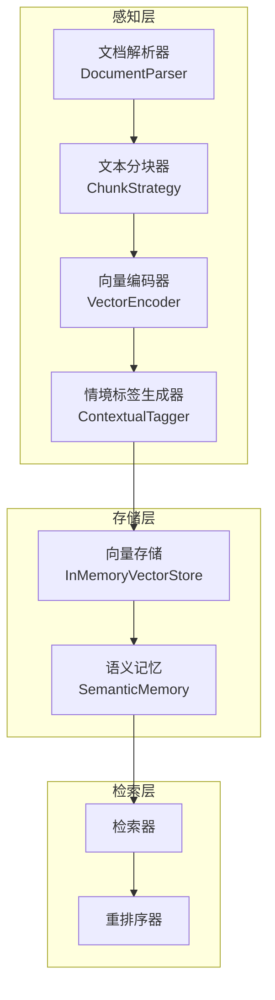
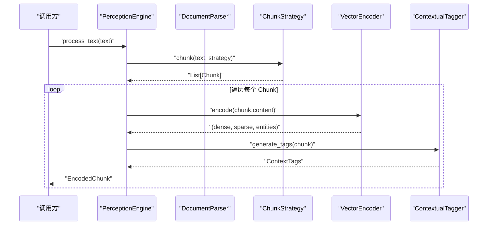
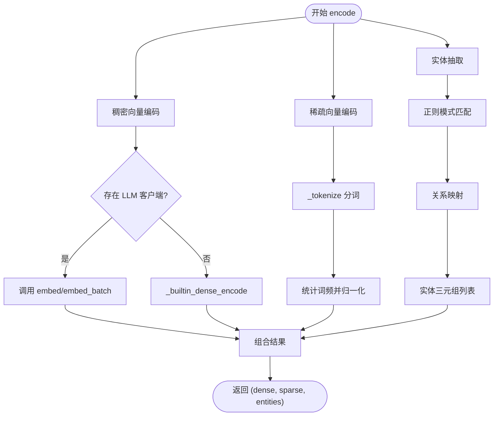
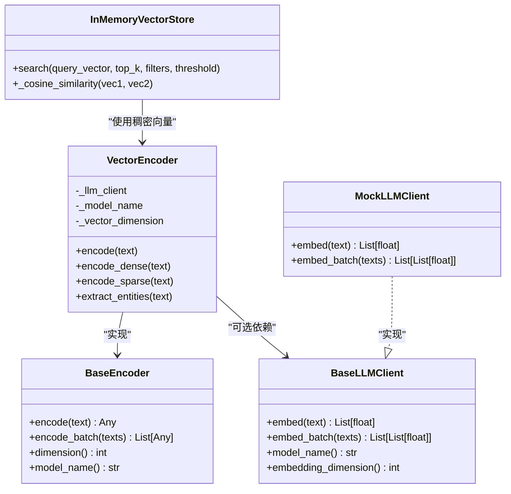

# 向量编码器

<cite>
**本文引用的文件**
- [src/perception/encoder.py](file://src/perception/encoder.py)
- [src/perception/engine.py](file://src/perception/engine.py)
- [src/perception/chunker.py](file://src/perception/chunker.py)
- [src/perception/parser.py](file://src/perception/parser.py)
- [src/perception/tagger.py](file://src/perception/tagger.py)
- [src/perception/models.py](file://src/perception/models.py)
- [src/core/base.py](file://src/core/base.py)
- [src/core/config.py](file://src/core/config.py)
- [src/core/llm/mock.py](file://src/core/llm/mock.py)
- [src/memory/backends/memory_store.py](file://src/memory/backends/memory_store.py)
- [src/memory/semantic_memory.py](file://src/memory/semantic_memory.py)
- [example/example_usage.py](file://example/example_usage.py)
- [src/perception/README.md](file://src/perception/README.md)
- [wiki/wiki/核心架构设计/五层认知架构/感知层 (L1)/向量编码器.md](file://wiki/wiki/核心架构设计/五层认知架构/感知层 (L1)/向量编码器.md)
</cite>

## 目录
1. [简介](#简介)
2. [项目结构](#项目结构)
3. [核心组件](#核心组件)
4. [架构总览](#架构总览)
5. [详细组件分析](#详细组件分析)
6. [依赖分析](#依赖分析)
7. [性能考虑](#性能考虑)
8. [故障排除指南](#故障排除指南)
9. [结论](#结论)
10. [附录](#附录)

## 简介
本文件面向向量编码器的使用者与维护者，系统性阐述在 NecoRAG 框架中，如何利用 BGE-M3 嵌入模型与多模态向量生成技术，完成稠密向量、稀疏向量与实体三元组的编码，并将其与情境标签、检索与记忆系统集成。文档涵盖：
- BGE-M3 嵌入模型的应用与配置
- 多模态向量生成（稠密/稀疏/实体）的技术细节
- 向量相似度计算与检索性能优化
- 质量控制、性能优化与内存管理策略
- 参数调优、使用示例与故障排除

## 项目结构
感知层（L1）围绕“解析-分块-编码-打标”流水线组织，向量编码器位于核心位置，负责将 Chunk 转换为多模态向量表示，并生成情境标签与实体三元组。

**图表来源**
- [src/perception/engine.py:20-195](file://src/perception/engine.py#L20-L195)
- [src/perception/parser.py:28-113](file://src/perception/parser.py#L28-L113)
- [src/perception/chunker.py:49-567](file://src/perception/chunker.py#L49-L567)
- [src/perception/encoder.py:25-255](file://src/perception/encoder.py#L25-L255)
- [src/perception/tagger.py:33-163](file://src/perception/tagger.py#L33-L163)
- [src/memory/backends/memory_store.py:20-381](file://src/memory/backends/memory_store.py#L20-L381)
- [src/memory/semantic_memory.py:70-114](file://src/memory/semantic_memory.py#L70-L114)

**章节来源**
- [src/perception/engine.py:20-195](file://src/perception/engine.py#L20-L195)
- [src/perception/parser.py:28-113](file://src/perception/parser.py#L28-L113)
- [src/perception/chunker.py:49-567](file://src/perception/chunker.py#L49-L567)
- [src/perception/encoder.py:25-255](file://src/perception/encoder.py#L25-L255)
- [src/perception/tagger.py:33-163](file://src/perception/tagger.py#L33-L163)
- [src/memory/backends/memory_store.py:20-381](file://src/memory/backends/memory_store.py#L20-L381)
- [src/memory/semantic_memory.py:70-114](file://src/memory/semantic_memory.py#L70-L114)

## 核心组件
- 向量编码器（VectorEncoder）
  - 生成稠密向量、稀疏向量与实体三元组
  - 支持通过 LLM 客户端注入外部向量化能力，未提供时回退到内置确定性编码
- 文档解析器（DocumentParser）
  - 将多种格式文档转换为统一结构化表示
- 文本分块器（ChunkStrategy）
  - 支持弹性分块、语义分块、固定大小分块、结构化分块、句子分块
- 情境标签生成器（ContextualTagger）
  - 为每个 Chunk 生成时间、情感、重要性与主题标签
- 感知引擎（PerceptionEngine）
  - 协调解析、分块、编码与打标流程，统一对外接口

**章节来源**
- [src/perception/encoder.py:25-255](file://src/perception/encoder.py#L25-L255)
- [src/perception/parser.py:28-113](file://src/perception/parser.py#L28-L113)
- [src/perception/chunker.py:49-567](file://src/perception/chunker.py#L49-L567)
- [src/perception/tagger.py:33-163](file://src/perception/tagger.py#L33-L163)
- [src/perception/engine.py:20-195](file://src/perception/engine.py#L20-L195)

## 架构总览
向量编码器在感知引擎中承担“多模态向量生成”的职责，其输入为 Chunk，输出为包含稠密向量、稀疏向量与实体三元组的编码块，并与情境标签生成器协作，形成可检索、可理解的知识单元。

**图表来源**
- [src/perception/engine.py:96-195](file://src/perception/engine.py#L96-L195)
- [src/perception/chunker.py:49-85](file://src/perception/chunker.py#L49-L85)
- [src/perception/encoder.py:73-190](file://src/perception/encoder.py#L73-L190)
- [src/perception/tagger.py:33-66](file://src/perception/tagger.py#L33-L66)

## 详细组件分析

### 向量编码器（VectorEncoder）
- 稠密向量生成
  - 优先使用 LLM 客户端 embed/embed_batch；若未提供则使用内置确定性编码（基于文本哈希生成单位向量）
  - 维度可配置，默认 768
- 稀疏向量生成
  - 采用 TF-IDF 风格的词频归一化，返回关键词到权重的字典
  - 分词支持中英文混合，过滤停用词与短词
- 实体抽取
  - 基于规则的三元组抽取（主体-关系-客体），支持中文“是/属于/包含”与英文“is”等模式
- 批量处理
  - encode_dense_batch 默认逐个调用内置 encode；子类可覆盖以提升吞吐

**图表来源**
- [src/perception/encoder.py:73-190](file://src/perception/encoder.py#L73-L190)
- [src/perception/encoder.py:192-255](file://src/perception/encoder.py#L192-L255)

**章节来源**
- [src/perception/encoder.py:25-255](file://src/perception/encoder.py#L25-L255)

### 文档解析器（DocumentParser）
- 最小实现：读取文本文件，简单分块
- 预留 OCR、表格与图片提取扩展点
- 与感知引擎集成，提供统一的 ParsedDocument

**章节来源**
- [src/perception/parser.py:28-113](file://src/perception/parser.py#L28-L113)

### 文本分块器（ChunkStrategy）
- 支持多种策略：弹性分块、语义分块、固定大小、结构化、句子级
- 弹性分块：按段落合并小块、拆分大块、添加重叠上下文
- 句子级分块：中英文标点分割，保持语义边界
- 结构化分块：以段落为基础，适合作为结构化文档的分块策略

**章节来源**
- [src/perception/chunker.py:49-567](file://src/perception/chunker.py#L49-L567)

### 情境标签生成器（ContextualTagger）
- 时间标签：基于元数据（最小实现）
- 情感标签：基于关键词计数（最小实现）
- 重要性评分：基于长度与词汇多样性（最小实现）
- 主题标签：基于高频词（最小实现）

**章节来源**
- [src/perception/tagger.py:33-163](file://src/perception/tagger.py#L33-L163)

### 感知引擎（PerceptionEngine）
- 统一入口：process_file/process_text/process
- 集成解析、分块、编码、打标全流程
- 可配置默认分块策略与弹性切割参数

**章节来源**
- [src/perception/engine.py:20-195](file://src/perception/engine.py#L20-L195)

### 数据模型
- EncodedChunk：包含稠密向量、稀疏向量、实体三元组与情境标签
- LocalEncodedChunk：模块特有版本，使用 numpy 数组
- ParsedDocument、Chunk、Table、Image 等统一数据结构

**章节来源**
- [src/perception/models.py:14-62](file://src/perception/models.py#L14-L62)

## 依赖分析
- 抽象基类
  - BaseEncoder：定义 encode/encode_batch/dimension/model_name 接口
  - BaseParser/BaseChunker/BaseTagger：统一抽象，便于替换实现
- LLM 客户端
  - BaseLLMClient：提供 embed/embed_batch 接口
  - MockLLMClient：在未提供外部 LLM 时的回退实现
- 存储与检索
  - InMemoryVectorStore：最小可用向量存储，使用余弦相似度
  - SemanticMemory：语义记忆封装，提供向量检索接口

**图表来源**
- [src/core/base.py:104-143](file://src/core/base.py#L104-L143)
- [src/perception/encoder.py:25-120](file://src/perception/encoder.py#L25-L120)
- [src/core/llm/mock.py:248-264](file://src/core/llm/mock.py#L248-L264)
- [src/memory/backends/memory_store.py:116-125](file://src/memory/backends/memory_store.py#L116-L125)

**章节来源**
- [src/core/base.py:104-143](file://src/core/base.py#L104-L143)
- [src/perception/encoder.py:25-120](file://src/perception/encoder.py#L25-L120)
- [src/core/llm/mock.py:248-264](file://src/core/llm/mock.py#L248-L264)
- [src/memory/backends/memory_store.py:116-125](file://src/memory/backends/memory_store.py#L116-L125)

## 性能考虑
- 向量相似度计算
  - 使用余弦相似度：点积除以范数乘积，避免零向量与数值不稳定
- 批量处理优化
  - encode_dense_batch 优先委托 LLM 客户端批量接口；若无客户端则逐个 fallback
- 内存管理
  - InMemoryVectorStore 采用字典存储，适合小规模数据；大规模建议引入索引或外部向量数据库
- 分块策略
  - 弹性分块在语义边界处切割，兼顾召回与上下文连续性
- 配置与参数
  - 分块大小、重叠、弹性参数影响召回与检索效率
  - 向量维度与 LLM 嵌入维度需保持一致

**章节来源**
- [src/memory/backends/memory_store.py:116-125](file://src/memory/backends/memory_store.py#L116-L125)
- [src/perception/encoder.py:106-119](file://src/perception/encoder.py#L106-L119)
- [src/perception/chunker.py:89-141](file://src/perception/chunker.py#L89-L141)
- [src/core/config.py:105-132](file://src/core/config.py#L105-L132)

## 故障排除指南
- 向量维度不匹配
  - 现象：存储器报维度不一致
  - 处理：确保编码器维度与存储器初始化维度一致；检查 LLM 客户端 embedding_dimension
- 文本编码失败
  - 现象：encode 过程异常
  - 处理：检查输入文本非空；验证 LLM 客户端连接；确认 Mock 客户端确定性设置
- 实体抽取不准确
  - 现象：三元组抽取结果不符合预期
  - 处理：调整正则模式；扩展关系映射；考虑集成更强的 NLP 能力
- 检索性能差
  - 现象：相似度计算耗时长
  - 处理：小规模使用内存存储；大规模引入索引或外部向量数据库；优化分块策略与过滤条件

**章节来源**
- [src/perception/encoder.py:149-190](file://src/perception/encoder.py#L149-L190)
- [src/memory/backends/memory_store.py:116-125](file://src/memory/backends/memory_store.py#L116-L125)

## 结论
向量编码器通过 BGE-M3 嵌入模型与多模态向量生成，为检索与记忆系统提供高质量的语义表示。结合弹性分块、情境标签与实体抽取，形成可解释、可检索的知识单元。在工程实践中，建议：
- 明确维度与模型配置，确保一致性
- 优先使用 LLM 客户端批量接口提升吞吐
- 在小规模场景使用内存存储，大规模迁移至外部向量数据库
- 持续优化分块策略与实体抽取规则，提升召回与准确性

## 附录

### BGE-M3 嵌入模型应用与配置
- 模型名称与维度
  - 默认模型名："BGE-M3"，默认向量维度：768
- LLM 客户端注入
  - 通过构造函数注入 BaseLLMClient；未提供时使用 MockLLMClient 回退
- 配置项
  - 可在感知引擎初始化时传入 model 参数，或在 LLM 配置中指定

**章节来源**
- [src/perception/encoder.py:33-61](file://src/perception/encoder.py#L33-L61)
- [src/core/config.py:81-101](file://src/core/config.py#L81-L101)

### 多模态向量生成技术
- 稠密向量
  - 语义高维表示，适合语义检索
- 稀疏向量
  - 关键词权重表示，适合关键词检索与可解释性
- 实体三元组
  - 知识图谱基础，支持关系推理与溯源

**章节来源**
- [src/perception/encoder.py:73-190](file://src/perception/encoder.py#L73-L190)

### RAGFlow 集成方案
- 文档解析器预留“集成 RAGFlow 进行深度文档解析”的 TODO
- 建议在生产环境中接入 RAGFlow，以获得更高质量的解析与结构化输出

**章节来源**
- [src/perception/parser.py:38-40](file://src/perception/parser.py#L38-L40)
- [src/perception/README.md:9-14](file://src/perception/README.md#L9-L14)

### 质量控制与参数调优
- 分块策略参数
  - chunk_size、chunk_overlap、min/target/max_chunk_size、enable_elastic、semantic_boundaries
- 标签生成参数
  - importance_threshold 等
- 向量相似度与过滤
  - 在检索阶段设置 min_score 与 filters，提升相关性与性能

**章节来源**
- [src/core/config.py:105-132](file://src/core/config.py#L105-L132)
- [src/memory/backends/memory_store.py:127-140](file://src/memory/backends/memory_store.py#L127-L140)

### 使用示例
- 完整工作流示例
  - 包含感知层编码、记忆存储、检索与重排序、答案生成与响应生成的端到端演示
- 向量相似度计算
  - 展示余弦相似度在检索中的应用

**章节来源**
- [example/example_usage.py:12-252](file://example/example_usage.py#L12-L252)
- [src/memory/backends/memory_store.py:116-125](file://src/memory/backends/memory_store.py#L116-L125)