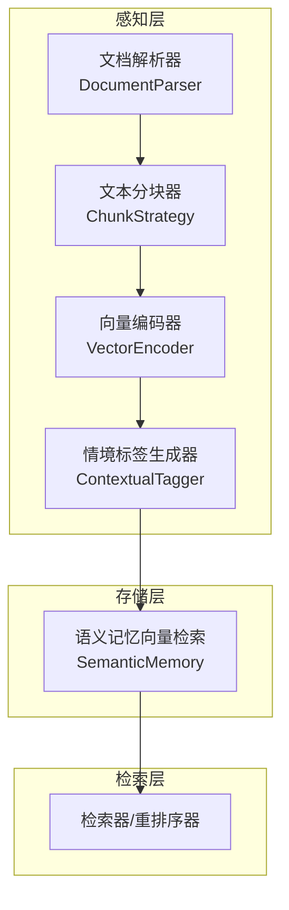
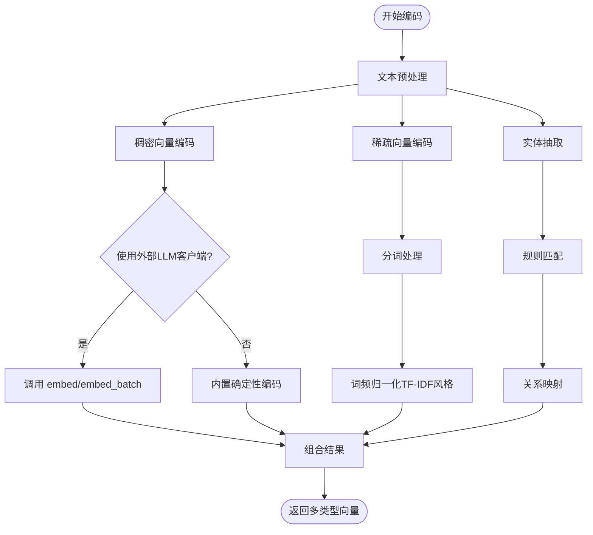
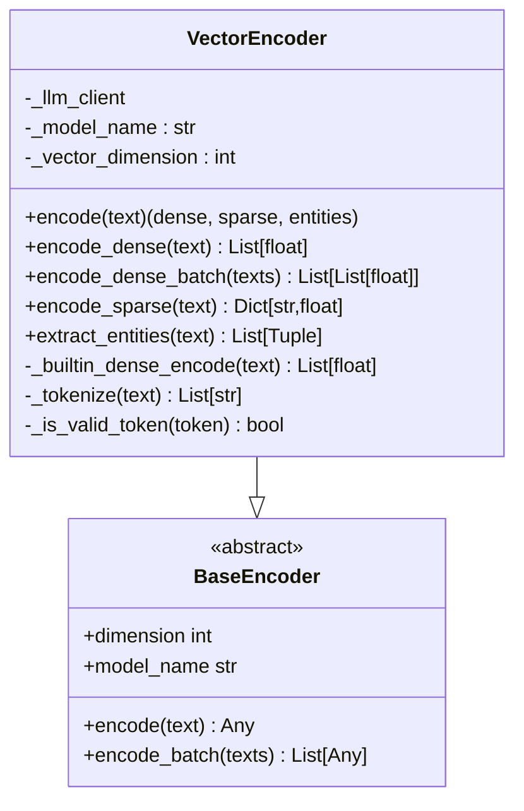
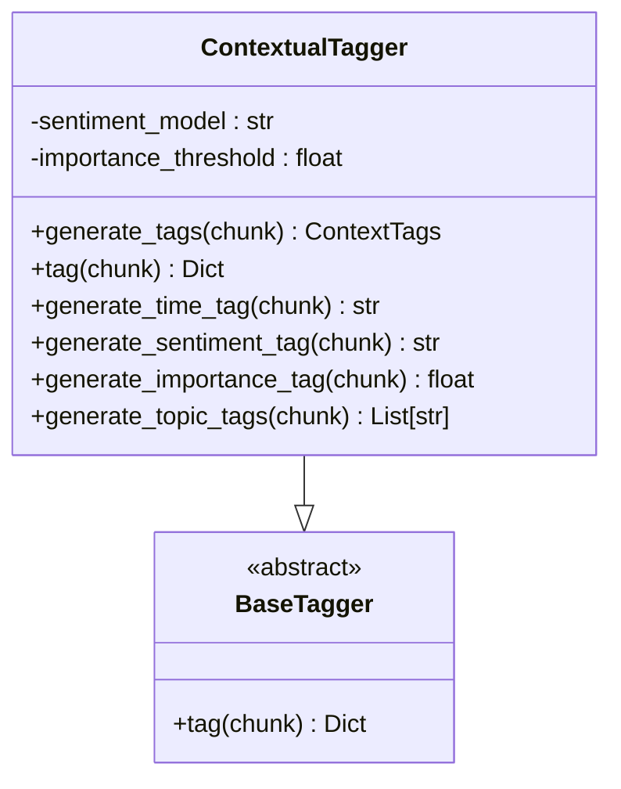
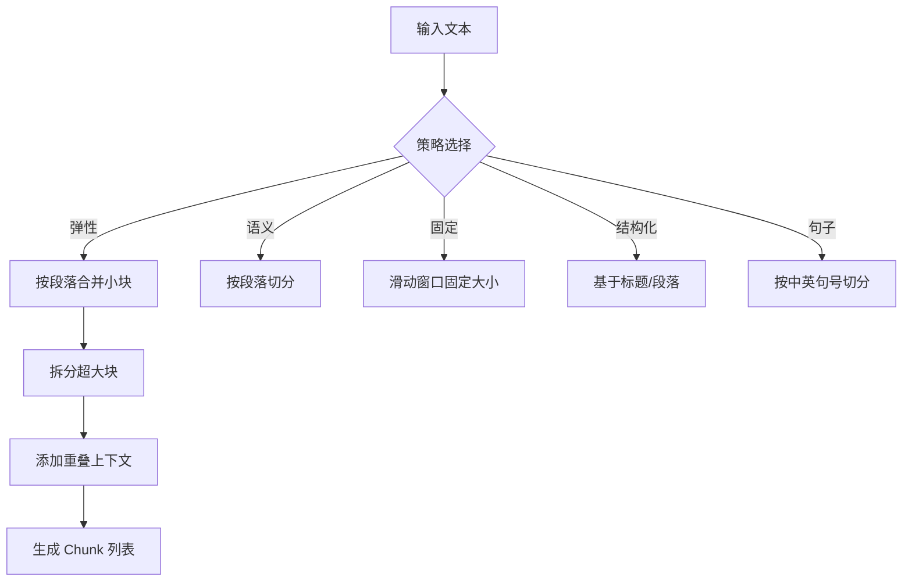
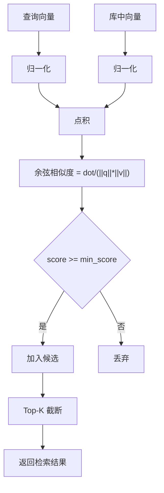
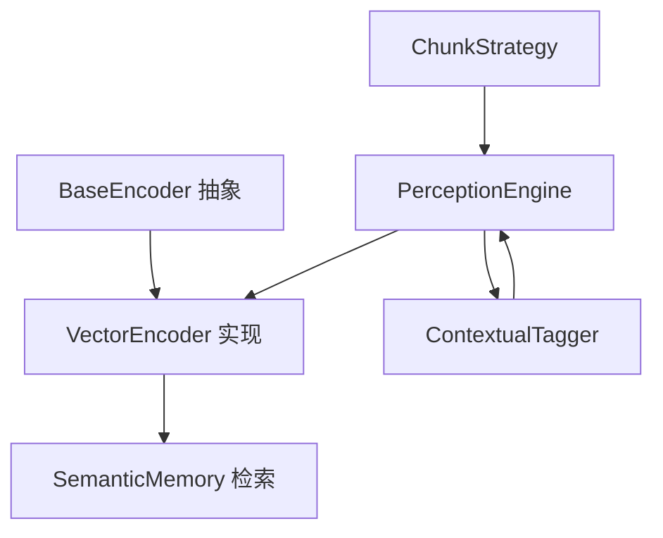

# 向量编码器

<cite>
**本文引用的文件**
- [encoder.py](file://src/perception/encoder.py)
- [engine.py](file://src/perception/engine.py)
- [tagger.py](file://src/perception/tagger.py)
- [chunker.py](file://src/perception/chunker.py)
- [models.py](file://src/perception/models.py)
- [base.py](file://src/core/base.py)
- [semantic_memory.py](file://src/memory/semantic_memory.py)
- [向量编码器.md](file://wiki/wiki/核心架构设计/五层认知架构/感知层 (L1)/向量编码器.md)
- [example_usage.py](file://example/example_usage.py)
</cite>

## 目录
1. [简介](#简介)
2. [项目结构](#项目结构)
3. [核心组件](#核心组件)
4. [架构总览](#架构总览)
5. [详细组件分析](#详细组件分析)
6. [依赖分析](#依赖分析)
7. [性能考量](#性能考量)
8. [故障排除指南](#故障排除指南)
9. [结论](#结论)
10. [附录](#附录)

## 简介
本文件面向“向量编码器”的实现与使用，聚焦以下目标：
- 解释 BGE-M3 模型在项目中的使用方式与可替换性
- 详解多维度向量化技术：稠密向量(dense_vector)与稀疏向量(sparse_vector)的生成流程
- 说明实体识别(entities)的实现机制（命名实体识别与关键词抽取）
- 提供向量编码的质量评估方法与相似度计算策略
- 给出模型配置选项、性能优化技巧与内存管理策略
- 展示检索最佳实践与代码示例路径

## 项目结构
感知层负责将原始文本转化为多模态表示（稠密向量、稀疏向量、实体三元组），并与情境标签生成器配合，最终进入存储与检索阶段。

图表来源
- [engine.py:20-155](file://src/perception/engine.py#L20-L155)
- [encoder.py:25-255](file://src/perception/encoder.py#L25-L255)
- [tagger.py:11-163](file://src/perception/tagger.py#L11-L163)
- [chunker.py:12-567](file://src/perception/chunker.py#L12-L567)
- [semantic_memory.py:80-114](file://src/memory/semantic_memory.py#L80-L114)

章节来源
- [engine.py:20-155](file://src/perception/engine.py#L20-L155)
- [encoder.py:25-255](file://src/perception/encoder.py#L25-L255)
- [tagger.py:11-163](file://src/perception/tagger.py#L11-L163)
- [chunker.py:12-567](file://src/perception/chunker.py#L12-L567)
- [semantic_memory.py:80-114](file://src/memory/semantic_memory.py#L80-L114)

## 核心组件
- 向量编码器(VectorEncoder)
  - 生成稠密向量、稀疏向量、实体三元组
  - 支持通过 LLM 客户端进行向量化，也支持独立运行（内置确定性实现）
  - 模型名称默认为 BGE-M3，向量维度可配置
- 情境标签生成器(ContextualTagger)
  - 为每个文本块生成时间、情感、重要性、主题等标签
- 文本分块器(ChunkStrategy)
  - 支持弹性分块、语义分块、固定大小分块、结构化分块、句子分块
- 语义记忆(SemanticMemory)
  - 向量检索（当前为余弦相似度 O(N) 实现）

章节来源
- [encoder.py:25-255](file://src/perception/encoder.py#L25-L255)
- [tagger.py:11-163](file://src/perception/tagger.py#L11-L163)
- [chunker.py:12-567](file://src/perception/chunker.py#L12-L567)
- [semantic_memory.py:80-114](file://src/memory/semantic_memory.py#L80-L114)

## 架构总览
向量编码器位于感知层核心，承担“多类型向量 + 实体”的统一编码职责。整体流程如下：

图表来源
- [encoder.py:73-190](file://src/perception/encoder.py#L73-L190)
- [向量编码器.md:201-224](file://wiki/wiki/核心架构设计/五层认知架构/感知层 (L1)/向量编码器.md#L201-L224)

章节来源
- [encoder.py:73-190](file://src/perception/encoder.py#L73-L190)
- [向量编码器.md:157-224](file://wiki/wiki/核心架构设计/五层认知架构/感知层 (L1)/向量编码器.md#L157-L224)

## 详细组件分析

### 向量编码器（VectorEncoder）
- 模型与维度
  - 默认模型名称：BGE-M3
  - 默认向量维度：768
  - 可通过构造函数注入 LLM 客户端以替换底层嵌入实现
- 稠密向量编码
  - 优先使用 LLM 客户端的 embed/embed_batch
  - 若未提供客户端，则回退到内置确定性伪向量生成
- 稀疏向量编码
  - 基于分词与词频统计，采用 TF-IDF 风格的归一化权重
- 实体抽取
  - 使用简单规则匹配（如“A 是 B”、“A is B”等），并映射到关系类型
- 内置确定性编码
  - 基于文本哈希生成随机种子，生成高斯噪声向量并归一化，确保相同输入产生相同输出

图表来源
- [encoder.py:25-255](file://src/perception/encoder.py#L25-L255)
- [base.py:104-143](file://src/core/base.py#L104-L143)

章节来源
- [encoder.py:25-255](file://src/perception/encoder.py#L25-L255)
- [base.py:104-143](file://src/core/base.py#L104-L143)

### 情境标签生成器（ContextualTagger）
- 生成时间标签、情感标签、重要性评分、主题标签
- 当前为最小实现（情感关键词检测、主题高频词提取、重要性基于长度与多样性）

图表来源
- [tagger.py:11-163](file://src/perception/tagger.py#L11-L163)
- [base.py:145-160](file://src/core/base.py#L145-L160)

章节来源
- [tagger.py:11-163](file://src/perception/tagger.py#L11-L163)
- [base.py:145-160](file://src/core/base.py#L145-L160)

### 文本分块器（ChunkStrategy）
- 支持多种策略：弹性分块、语义分块、固定大小分块、结构化分块、句子分块
- 弹性分块通过段落合并与拆分、句/子句边界优先、重叠上下文等策略保证块大小与语义完整性

图表来源
- [chunker.py:49-141](file://src/perception/chunker.py#L49-L141)
- [chunker.py:185-216](file://src/perception/chunker.py#L185-L216)
- [chunker.py:218-248](file://src/perception/chunker.py#L218-L248)
- [chunker.py:250-265](file://src/perception/chunker.py#L250-L265)
- [chunker.py:143-183](file://src/perception/chunker.py#L143-L183)

章节来源
- [chunker.py:49-141](file://src/perception/chunker.py#L49-L141)
- [chunker.py:185-216](file://src/perception/chunker.py#L185-L216)
- [chunker.py:218-248](file://src/perception/chunker.py#L218-L248)
- [chunker.py:250-265](file://src/perception/chunker.py#L250-L265)
- [chunker.py:143-183](file://src/perception/chunker.py#L143-L183)

### 语义记忆与相似度计算
- 语义记忆采用余弦相似度进行检索，当前为 O(N) 线性扫描
- 可扩展为 HNSW/FAISS/Qdrant 等索引以降低检索复杂度

图表来源
- [semantic_memory.py:80-114](file://src/memory/semantic_memory.py#L80-L114)

章节来源
- [semantic_memory.py:80-114](file://src/memory/semantic_memory.py#L80-L114)

## 依赖分析
- 向量编码器依赖抽象基类 BaseEncoder，确保可替换性
- 感知引擎将解析、分块、编码、打标串联，形成端到端流水线
- 语义记忆提供向量检索能力，支持后续检索与重排序

图表来源
- [base.py:104-143](file://src/core/base.py#L104-L143)
- [encoder.py:25-255](file://src/perception/encoder.py#L25-L255)
- [engine.py:20-155](file://src/perception/engine.py#L20-L155)
- [semantic_memory.py:80-114](file://src/memory/semantic_memory.py#L80-L114)

章节来源
- [base.py:104-143](file://src/core/base.py#L104-L143)
- [encoder.py:25-255](file://src/perception/encoder.py#L25-L255)
- [engine.py:20-155](file://src/perception/engine.py#L20-L155)
- [semantic_memory.py:80-114](file://src/memory/semantic_memory.py#L80-L114)

## 性能考量
- 向量编码
  - 稠密向量：若使用 LLM 客户端，建议批量化调用 embed_batch 以减少往返开销
  - 稀疏向量：分词与词频统计为 O(n) 线性扫描，可结合停用词过滤与词干化进一步优化
  - 实体抽取：规则匹配为 O(n) 字符扫描，可预编译正则表达式以提升性能
- 检索
  - 当前语义记忆为 O(N) 余弦相似度计算，建议引入索引（如 HNSW/FAISS/Qdrant）以降至 O(log N)/O(k)
  - 控制 top_k 与 min_score，避免返回过多候选导致重排序成本上升
- 内存管理
  - 批量编码时控制批次大小，避免一次性加载过多文本
  - 对向量与元数据进行必要的压缩与池化策略（如按需序列化）
- 并发与稳定性
  - 在多线程/多进程环境中，确保 LLM 客户端与向量存储实现具备线程安全或使用连接池

## 故障排除指南
- 向量维度不匹配
  - 确认编码器输出维度与存储/检索配置一致
- 检索无结果
  - 检查查询向量非空且维度一致；核对 min_score 与 top_k 设置
- 实体抽取效果差
  - 增加更多规则或引入 LLM 客户端增强抽取能力
- 相似度异常
  - 确保向量已归一化；检查是否存在零向量或 NaN
- 性能瓶颈
  - 优先启用 embed_batch；引入索引；限制 top_k；缓存热点查询结果

章节来源
- [semantic_memory.py:80-114](file://src/memory/semantic_memory.py#L80-L114)
- [encoder.py:89-120](file://src/perception/encoder.py#L89-L120)

## 结论
本实现以 VectorEncoder 为核心，提供多类型向量与实体的统一编码能力，并通过抽象基类确保与 LLM 客户端的可替换性。结合 ContextualTagger 与 ChunkStrategy，形成从文本到向量的完整感知链路。当前检索采用余弦相似度线性扫描，建议在生产环境引入高性能索引与批量化策略以满足大规模与低延迟需求。

## 附录

### 模型配置选项
- 模型名称：BGE-M3（可替换为其他嵌入模型）
- 向量维度：768（可按下游存储/检索要求调整）
- 分块策略：弹性/语义/固定/结构化/句子（可在引擎初始化时配置）

章节来源
- [engine.py:28-76](file://src/perception/engine.py#L28-L76)
- [encoder.py:33-49](file://src/perception/encoder.py#L33-L49)

### 向量编码质量评估方法
- 稀疏向量权重
  - 基于词频归一化，可结合停用词表与词形还原提升稳定性
- 实体抽取
  - 使用规则匹配与 LLM 增强相结合，持续扩展关系映射
- 相似度计算
  - 余弦相似度；可引入归一化与阈值过滤；必要时引入向量压缩与近似检索

章节来源
- [encoder.py:121-147](file://src/perception/encoder.py#L121-L147)
- [encoder.py:149-190](file://src/perception/encoder.py#L149-L190)
- [semantic_memory.py:99-114](file://src/memory/semantic_memory.py#L99-L114)

### 相似度计算与检索最佳实践
- 查询向量预处理：与训练/编码阶段一致（分词、归一化）
- 检索参数调优：min_score、top_k、重叠上下文长度
- 结果后处理：重排序（如 BGE-Reranker）、去重与多样性（MMR）

章节来源
- [semantic_memory.py:80-114](file://src/memory/semantic_memory.py#L80-L114)
- [example/example_usage.py:103-136](file://example/example_usage.py#L103-L136)