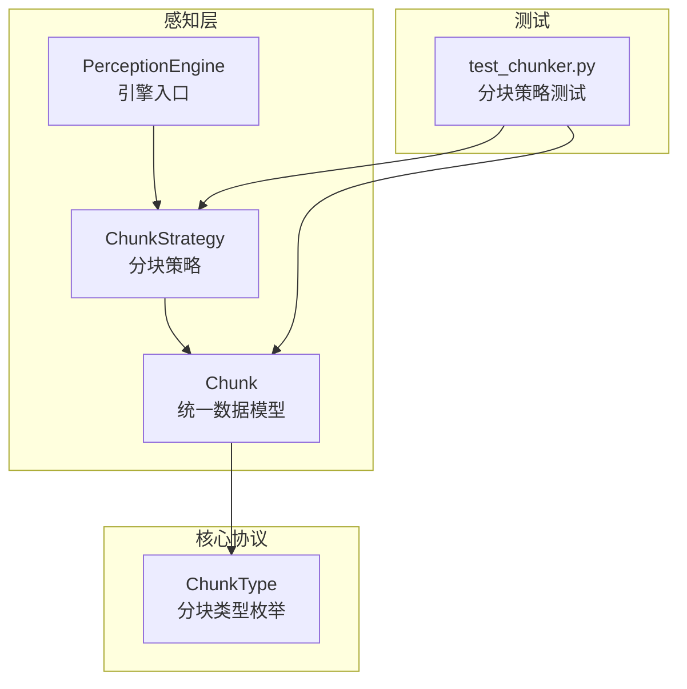
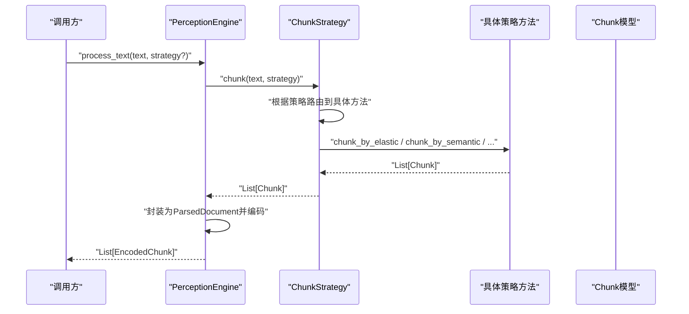
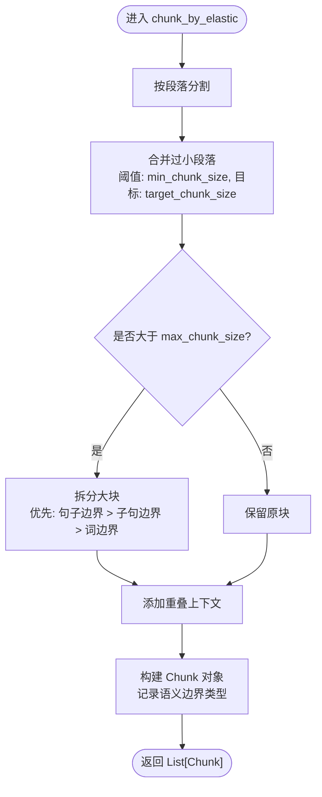
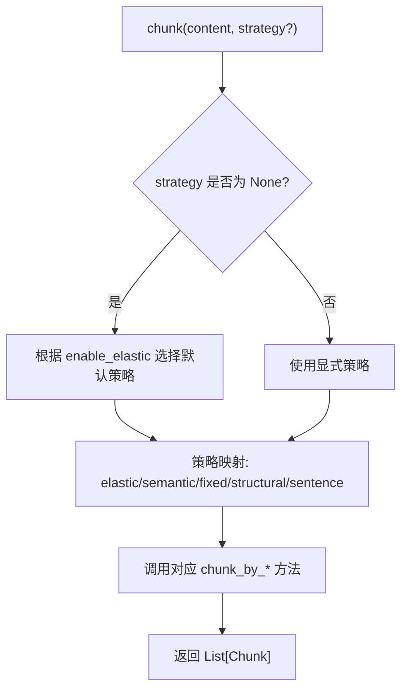
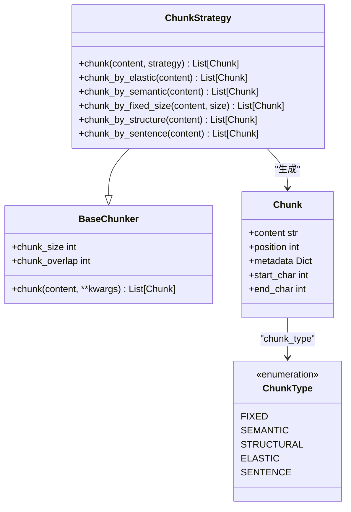

# 弹性分块策略

<cite>
**本文引用的文件**
- [src/perception/chunker.py](file://src/perception/chunker.py)
- [src/perception/engine.py](file://src/perception/engine.py)
- [src/core/protocols.py](file://src/core/protocols.py)
- [src/perception/models.py](file://src/perception/models.py)
- [tests/test_perception/test_chunker.py](file://tests/test_perception/test_chunker.py)
- [wiki/wiki/配置管理/感知层配置.md](file://wiki/wiki/配置管理/感知层配置.md)
</cite>

## 目录
1. [引言](#引言)
2. [项目结构](#项目结构)
3. [核心组件](#核心组件)
4. [架构总览](#架构总览)
5. [详细组件分析](#详细组件分析)
6. [依赖分析](#依赖分析)
7. [性能考量](#性能考量)
8. [故障排查指南](#故障排查指南)
9. [结论](#结论)
10. [附录](#附录)

## 引言
本文件围绕“弹性分块策略”展开，系统阐述多种分块策略的工作原理与实现细节，重点解析弹性分块的核心算法与参数作用，并给出语义边界的识别机制、优先级设定、使用场景、性能对比、质量评估方法与参数调优建议。文档同时提供代码级架构图与流程图，帮助读者快速理解与落地应用。

## 项目结构
与弹性分块策略直接相关的模块位于感知层（perception），核心文件如下：
- 分块策略实现：src/perception/chunker.py
- 感知引擎入口：src/perception/engine.py
- 统一数据协议与Chunk模型：src/core/protocols.py
- 感知层模型（含Chunk）：src/perception/models.py
- 分块策略测试：tests/test_perception/test_chunker.py
- 配置说明与流程图：wiki/wiki/配置管理/感知层配置.md

**图表来源**
- [src/perception/engine.py:20-76](file://src/perception/engine.py#L20-L76)
- [src/perception/chunker.py:12-47](file://src/perception/chunker.py#L12-L47)
- [src/core/protocols.py:101-117](file://src/core/protocols.py#L101-L117)
- [tests/test_perception/test_chunker.py:12-532](file://tests/test_perception/test_chunker.py#L12-L532)

**章节来源**
- [src/perception/chunker.py:1-567](file://src/perception/chunker.py#L1-L567)
- [src/perception/engine.py:1-195](file://src/perception/engine.py#L1-L195)
- [src/core/protocols.py:1-298](file://src/core/protocols.py#L1-L298)
- [src/perception/models.py:1-62](file://src/perception/models.py#L1-L62)
- [tests/test_perception/test_chunker.py:1-532](file://tests/test_perception/test_chunker.py#L1-L532)
- [wiki/wiki/配置管理/感知层配置.md:119-154](file://wiki/wiki/配置管理/感知层配置.md#L119-L154)

## 核心组件
- 分块策略类：ChunkStrategy，提供统一入口与多种分块策略实现，包括弹性分块、语义分块、固定大小分块、结构化分块、句子级分块。
- 引擎入口：PerceptionEngine，负责文档解析、分块、编码与情境标签生成的流水线。
- 统一数据模型：Chunk（含content、position、metadata、start_char、end_char等），以及ChunkType枚举，统一各策略输出格式。

关键职责与关系：
- ChunkStrategy负责将文本按策略切分为Chunk对象，维护min_chunk_size、target_chunk_size、max_chunk_size、enable_elastic、semantic_boundaries等参数。
- PerceptionEngine将ChunkStrategy注入，统一对外提供process_text/process_file等接口。
- 测试用例覆盖了弹性分块、固定大小分块、句子级分块、结构化分块等策略的行为与边界条件。

**章节来源**
- [src/perception/chunker.py:12-141](file://src/perception/chunker.py#L12-L141)
- [src/perception/engine.py:20-76](file://src/perception/engine.py#L20-L76)
- [src/core/protocols.py:101-117](file://src/core/protocols.py#L101-L117)

## 架构总览
下图展示了从文本输入到分块输出的整体流程，以及弹性分块在其中的关键步骤。

**图表来源**
- [src/perception/engine.py:156-194](file://src/perception/engine.py#L156-L194)
- [src/perception/chunker.py:49-85](file://src/perception/chunker.py#L49-L85)

## 详细组件分析

### 弹性分块（elastic strategy）
弹性分块的核心思想是在语义边界处智能切割，同时通过min_chunk_size、target_chunk_size、max_chunk_size三个参数控制块大小范围，避免碎片化与超大块，再结合重叠上下文提升检索召回。

- 算法步骤
  1) 按段落分割文本
  2) 合并过小的段落（< min_chunk_size），尽量接近target_size
  3) 拆分过大的段落（> max_chunk_size），优先按句子/子句边界，最后按词边界强制切割
  4) 添加重叠上下文，构建Chunk对象并记录语义边界类型

- 关键参数
  - min_chunk_size：最小块大小，避免过度碎片化
  - target_chunk_size：目标块大小，理想切割大小
  - max_chunk_size：最大块大小，超过则强制切割
  - enable_elastic：是否启用弹性分块
  - semantic_boundaries：语义边界优先级列表（如["paragraph","sentence","clause"]）

- 边界识别与优先级
  - 句子边界：中文句号、感叹号、问号；英文句号、感叹号、问号
  - 子句边界：中文逗号、分号、顿号；英文逗号、分号
  - 词边界：英文空格；中文按CJK比例估算位置

- 重叠上下文
  - 通过_add_overlap在相邻块间添加重叠，提升检索召回

**图表来源**
- [src/perception/chunker.py:89-141](file://src/perception/chunker.py#L89-L141)
- [src/perception/chunker.py:381-433](file://src/perception/chunker.py#L381-L433)
- [src/perception/chunker.py:502-538](file://src/perception/chunker.py#L502-L538)

**章节来源**
- [src/perception/chunker.py:89-141](file://src/perception/chunker.py#L89-L141)
- [src/perception/chunker.py:381-433](file://src/perception/chunker.py#L381-L433)
- [src/perception/chunker.py:502-538](file://src/perception/chunker.py#L502-L538)
- [tests/test_perception/test_chunker.py:141-217](file://tests/test_perception/test_chunker.py#L141-L217)

### 语义分块（semantic strategy）
按段落分割，保持语义完整性，适合段落边界清晰的文档。

- 特点：简单可靠，块大小受段落影响，适合结构化文档。
- 适用：论文、报告、手册等。

**章节来源**
- [src/perception/chunker.py:185-216](file://src/perception/chunker.py#L185-L216)

### 固定大小分块（fixed strategy）
使用滑动窗口按固定大小切割，支持重叠。

- 特点：简单高效，块大小一致，适合向量化模型对固定长度的偏好。
- 注意：可能破坏语义边界，需配合重叠提升召回。

**章节来源**
- [src/perception/chunker.py:218-248](file://src/perception/chunker.py#L218-L248)

### 结构化分块（structural strategy）
基于语义分块的扩展，将每一段视为一个块，便于后续结构化处理。

- 特点：保留段落结构，便于后续标题/段落级别的检索与重排序。
- 适用：带标题的文档、章节分明的资料。

**章节来源**
- [src/perception/chunker.py:250-265](file://src/perception/chunker.py#L250-L265)

### 句子级分块（sentence strategy）
按句子边界分割，每个句子作为一个独立块。

- 特点：粒度最细，适合需要精确定位的场景。
- 注意：可能产生大量小块，需结合重叠或后续合并策略。

**章节来源**
- [src/perception/chunker.py:143-183](file://src/perception/chunker.py#L143-L183)

### 统一分块入口与策略路由
ChunkStrategy提供统一入口chunk(content, strategy)，根据strategy参数或enable_elastic自动选择策略，并将请求路由到具体实现。

**图表来源**
- [src/perception/chunker.py:49-85](file://src/perception/chunker.py#L49-L85)
- [wiki/wiki/配置管理/感知层配置.md:127-139](file://wiki/wiki/配置管理/感知层配置.md#L127-L139)

**章节来源**
- [src/perception/chunker.py:49-85](file://src/perception/chunker.py#L49-L85)
- [wiki/wiki/配置管理/感知层配置.md:127-139](file://wiki/wiki/配置管理/感知层配置.md#L127-L139)

## 依赖分析
- ChunkStrategy依赖Chunk统一模型与BaseChunker抽象基类，确保策略实现遵循统一接口。
- PerceptionEngine依赖ChunkStrategy进行分块，并将Chunk转换为EncodedChunk进行编码与打标。
- 测试用例覆盖了弹性分块、固定大小分块、句子级分块、结构化分块等策略，验证边界条件与参数行为。

**图表来源**
- [src/core/base.py:66-101](file://src/core/base.py#L66-L101)
- [src/perception/chunker.py:12-47](file://src/perception/chunker.py#L12-L47)
- [src/core/protocols.py:101-117](file://src/core/protocols.py#L101-L117)

**章节来源**
- [src/core/base.py:66-101](file://src/core/base.py#L66-L101)
- [src/perception/chunker.py:12-47](file://src/perception/chunker.py#L12-L47)
- [src/core/protocols.py:101-117](file://src/core/protocols.py#L101-L117)

## 性能考量
- 弹性分块
  - 时间复杂度：主要由段落合并、大块拆分与边界查找决定，整体近似O(n)线性扫描，其中n为文本长度。
  - 空间复杂度：输出Chunk列表，额外空间与块数量成正比。
  - 优势：兼顾语义完整性与块大小控制，减少碎片化与超大块。
  - 劣势：边界识别与重叠计算带来一定开销。
- 固定大小分块
  - 时间/空间复杂度：O(n)，实现简单，适合大规模批处理。
  - 适用：对语义完整性要求不高、追求稳定吞吐的场景。
- 语义/结构/句子分块
  - 语义分块：适合段落清晰文档；结构化分块：适合带标题文档；句子分块：适合需要精确定位的场景。

[本节为通用性能讨论，不直接分析具体文件]

## 故障排查指南
- 空文本或空白文本
  - 行为：返回空列表，避免无意义处理。
  - 排查：确认输入是否为空或仅包含空白字符。
- 超长文本
  - 行为：弹性分块会拆分大块，确保不超过max_chunk_size的合理上限。
  - 排查：检查max_chunk_size与chunk_overlap设置，避免过大导致内存压力。
- 中英文混合文本
  - 行为：句子/子句边界识别支持中英文标点，确保正确切割。
  - 排查：确认标点使用是否符合预期（如缩写、省略号等）。
- 无段落分隔符
  - 行为：仍可按目标大小拆分，但可能产生较多小块。
  - 排查：适当提高min_chunk_size或启用弹性合并。
- 重叠上下文异常
  - 行为：重叠可能导致块长度略超max_chunk_size，属正常现象。
  - 排查：确认chunk_overlap与max_chunk_size的比例是否合理。

**章节来源**
- [tests/test_perception/test_chunker.py:141-217](file://tests/test_perception/test_chunker.py#L141-L217)
- [tests/test_perception/test_chunker.py:275-305](file://tests/test_perception/test_chunker.py#L275-L305)
- [tests/test_perception/test_chunker.py:356-387](file://tests/test_perception/test_chunker.py#L356-L387)

## 结论
弹性分块策略通过“语义边界优先 + 参数约束 + 重叠上下文”的组合，在保证语义完整性的前提下，有效控制块大小范围，兼顾召回与效率。结合不同场景选择合适的策略与参数，可显著提升检索与生成效果。建议在生产环境中结合测试用例与性能监控持续调优。

[本节为总结性内容，不直接分析具体文件]

## 附录

### 使用场景与策略选择建议
- 弹性分块：通用文档、长文本、对语义完整性与块大小平衡有要求的场景。
- 语义分块：段落清晰、结构稳定的文档（如论文、报告）。
- 固定大小分块：大规模批处理、对吞吐量敏感、向量化模型偏好固定长度的场景。
- 结构化分块：带标题/章节的文档，便于后续结构化检索与重排序。
- 句子级分块：需要精确定位、逐句检索或证据抽取的场景。

**章节来源**
- [src/perception/chunker.py:49-85](file://src/perception/chunker.py#L49-L85)

### 参数调优指南
- min_chunk_size
  - 影响：越小越容易合并，减少碎片化；过大则合并效果有限。
  - 建议：根据业务文档平均段落长度设置，或通过测试集验证。
- target_chunk_size
  - 影响：决定理想块大小，影响召回与上下文覆盖。
  - 建议：结合向量化模型的上下文长度与任务需求设定。
- max_chunk_size
  - 影响：限制最大块大小，防止超大块影响检索与生成。
  - 建议：略高于target_chunk_size，留出重叠与边界对齐的空间。
- enable_elastic
  - 影响：开启后启用弹性合并与拆分；关闭则退化为固定大小分块。
  - 建议：通用场景建议开启，特殊场景可关闭以简化流程。
- semantic_boundaries
  - 影响：决定边界识别优先级，影响拆分粒度与语义完整性。
  - 建议：按业务文档特点调整顺序，如先句后子句再词边界。

**章节来源**
- [src/perception/chunker.py:19-47](file://src/perception/chunker.py#L19-L47)
- [tests/test_perception/test_chunker.py:492-531](file://tests/test_perception/test_chunker.py#L492-L531)

### 分块质量评估方法
- 块大小分布统计：记录最小/最大/平均块大小，评估是否满足目标范围。
- 语义完整性评估：人工抽样检查块内主题一致性与上下文连贯性。
- 检索召回评估：以块为粒度进行检索实验，比较不同策略的命中率与相关性。
- 生成一致性评估：在问答/摘要任务中对比不同策略下的回答质量与引用准确性。

[本节为通用评估方法，不直接分析具体文件]

### 代码示例与最佳实践
- 统一入口调用
  - 通过PerceptionEngine.process_text(text, strategy)调用，默认策略由enable_elastic与chunk_strategy共同决定。
- 显式策略指定
  - 在调用时传入strategy参数，如"elastic"、"semantic"、"fixed"、"structural"、"sentence"。
- 参数配置
  - 在PerceptionEngine初始化时传入min_chunk_size、target_chunk_size、max_chunk_size、enable_elastic_chunking、chunk_strategy等参数。
- 元数据与边界信息
  - Chunk.metadata包含chunk_strategy与semantic_boundary，便于后续分析与优化。

**章节来源**
- [src/perception/engine.py:156-194](file://src/perception/engine.py#L156-L194)
- [src/perception/chunker.py:49-85](file://src/perception/chunker.py#L49-L85)
- [src/perception/chunker.py:128-141](file://src/perception/chunker.py#L128-L141)