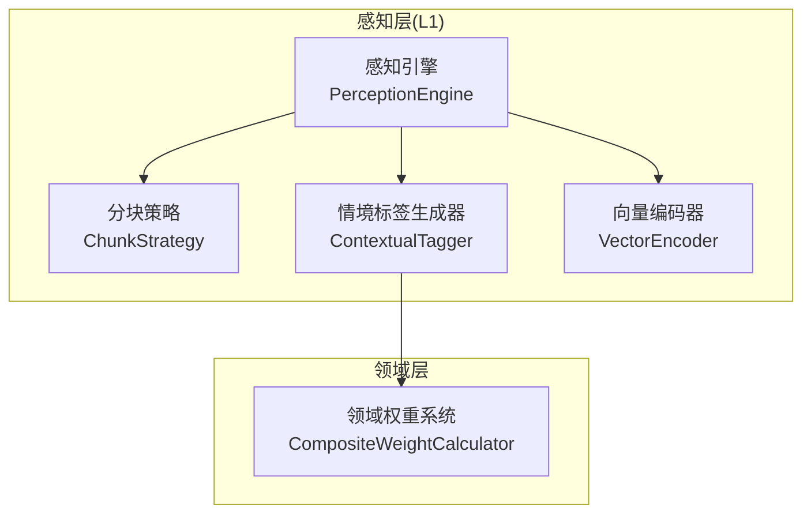
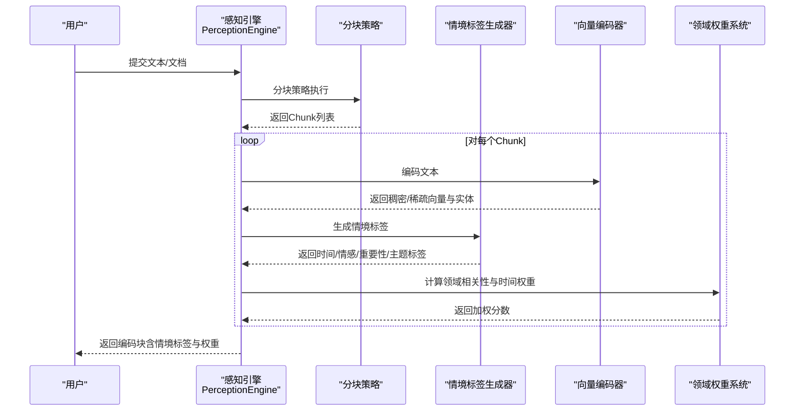
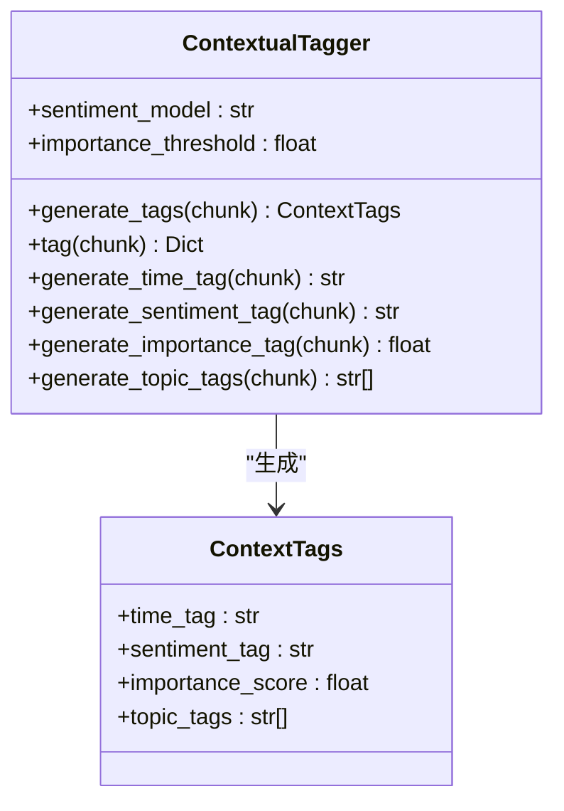
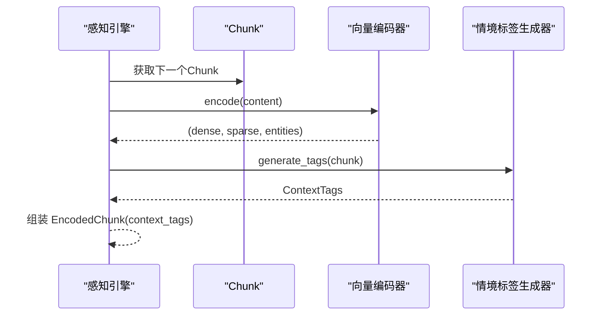
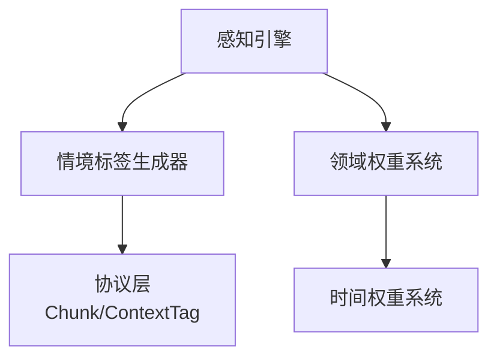

# 情境标签生成器

<cite>
**本文档引用的文件**
- [src/perception/tagger.py](file://src/perception/tagger.py)
- [src/perception/engine.py](file://src/perception/engine.py)
- [src/perception/models.py](file://src/perception/models.py)
- [src/perception/chunker.py](file://src/perception/chunker.py)
- [src/perception/encoder.py](file://src/perception/encoder.py)
- [src/core/base.py](file://src/core/base.py)
- [src/core/protocols.py](file://src/core/protocols.py)
- [src/domain/relevance.py](file://src/domain/relevance.py)
- [src/domain/temporal_weight.py](file://src/domain/temporal_weight.py)
- [src/domain/weight_calculator.py](file://src/domain/weight_calculator.py)
- [src/domain/config.py](file://src/domain/config.py)
- [example/example_usage.py](file://example/example_usage.py)
- [example/domain_weight_example.py](file://example/domain_weight_example.py)
</cite>

## 目录
1. [简介](#简介)
2. [项目结构](#项目结构)
3. [核心组件](#核心组件)
4. [架构总览](#架构总览)
5. [详细组件分析](#详细组件分析)
6. [依赖关系分析](#依赖关系分析)
7. [性能考量](#性能考量)
8. [故障排查指南](#故障排查指南)
9. [结论](#结论)
10. [附录](#附录)

## 简介
本文件面向 NecoRAG 情境标签生成器，系统性阐述情境标签的生成算法、特征工程与应用场景，覆盖时间标签、情感标签、主题标签与重要性评分的识别机制；解释 TF-IDF 权重计算、词向量聚合与上下文建模；梳理标签系统的层次结构与标签传播机制；并通过具体代码示例展示标签生成流程，包括输入文本处理、标签预测与置信度评估；最后说明情境标签在后续检索与排序中的应用价值。

## 项目结构
情境标签生成器位于感知层（L1），与分块策略、向量编码器、领域权重系统协同工作，为后续检索与排序提供高质量的上下文信号。

**图表来源**
- [src/perception/engine.py:20-138](file://src/perception/engine.py#L20-L138)
- [src/perception/tagger.py:11-66](file://src/perception/tagger.py#L11-L66)
- [src/perception/encoder.py:73-87](file://src/perception/encoder.py#L73-L87)
- [src/domain/weight_calculator.py:56-146](file://src/domain/weight_calculator.py#L56-L146)

**章节来源**
- [src/perception/engine.py:20-138](file://src/perception/engine.py#L20-L138)
- [src/perception/tagger.py:11-66](file://src/perception/tagger.py#L11-L66)
- [src/perception/encoder.py:73-87](file://src/perception/encoder.py#L73-L87)
- [src/domain/weight_calculator.py:56-146](file://src/domain/weight_calculator.py#L56-L146)

## 核心组件
- 情境标签生成器（ContextualTagger）
  - 生成时间标签：从 Chunk 元数据中提取创建时间，若无则标记为未知。
  - 生成情感标签：基于关键词集合进行简单统计，输出积极/消极/中性。
  - 生成重要性评分：基于文本长度与词汇多样性，归一化得到 0-1 区间分数。
  - 生成主题标签：统计高频词（过滤短词），返回前若干个高频词作为主题标签。
- 特征工程要点
  - 情感标签：关键词集合（中英文混合），通过计数比较决定极性。
  - 重要性评分：信息密度（独特词占比）与长度因子的加权平均。
  - 主题标签：基于词频统计，过滤短词以减少噪声。
- 置信度评估
  - 情感标签：基于匹配到的关键词数量与分布，提供置信度说明（可扩展）。
  - 重要性评分：基于密度与长度的稳定性，提供相对置信度。
- 应用场景
  - 检索前筛选：高重要性块优先参与检索。
  - 排序加权：结合领域权重与时间权重，提升相关高价值内容的排名。

**章节来源**
- [src/perception/tagger.py:18-163](file://src/perception/tagger.py#L18-L163)
- [src/perception/models.py:14-34](file://src/perception/models.py#L14-L34)

## 架构总览
情境标签生成器在感知引擎中承担“打标”角色，与分块与编码紧密协作，同时与领域权重系统对接，为后续检索与排序提供高质量的上下文信号。

**图表来源**
- [src/perception/engine.py:96-138](file://src/perception/engine.py#L96-L138)
- [src/perception/tagger.py:33-66](file://src/perception/tagger.py#L33-L66)
- [src/perception/encoder.py:73-87](file://src/perception/encoder.py#L73-L87)
- [src/domain/weight_calculator.py:81-146](file://src/domain/weight_calculator.py#L81-L146)

## 详细组件分析

### 情境标签生成器（ContextualTagger）
- 类关系与职责
  - 继承自 BaseTagger，实现 tag 接口。
  - 生成 ContextTags 数据类，包含 time_tag、sentiment_tag、importance_score、topic_tags。
- 标签生成方法
  - generate_time_tag：检测元数据中的 created_at，否则标记 unknown。
  - generate_sentiment_tag：统计正负关键词数量，决定情感极性。
  - generate_importance_tag：计算词多样性与长度因子的加权平均。
  - generate_topic_tags：过滤短词后统计词频，返回前若干高频词。
- 输出格式
  - tag 返回字典，便于与其他模块集成。

**图表来源**
- [src/perception/tagger.py:11-66](file://src/perception/tagger.py#L11-L66)
- [src/perception/models.py:14-21](file://src/perception/models.py#L14-L21)

**章节来源**
- [src/perception/tagger.py:11-163](file://src/perception/tagger.py#L11-L163)
- [src/perception/models.py:14-21](file://src/perception/models.py#L14-L21)

### 标签系统层次结构与传播机制
- 层次结构
  - 时间标签：文档元数据驱动，体现时效性。
  - 情感标签：基于关键词统计，反映文本倾向。
  - 重要性评分：基于信息密度与长度，衡量内容价值。
  - 主题标签：基于高频词统计，形成主题指纹。
- 传播机制
  - 通过 Chunk 边界重叠，相邻块共享上下文，提升主题一致性。
  - 通过实体三元组（编码器提取）建立实体-关系-实体的轻量知识图谱，辅助主题传播。
  - 通过领域权重系统，将高价值主题与高时效内容在排序阶段进一步放大。

**章节来源**
- [src/perception/chunker.py:502-538](file://src/perception/chunker.py#L502-L538)
- [src/perception/encoder.py:149-190](file://src/perception/encoder.py#L149-L190)
- [src/domain/weight_calculator.py:122-146](file://src/domain/weight_calculator.py#L122-L146)

### 标签生成流程（代码级）

**图表来源**
- [src/perception/engine.py:111-134](file://src/perception/engine.py#L111-L134)
- [src/perception/tagger.py:33-48](file://src/perception/tagger.py#L33-L48)
- [src/perception/encoder.py:73-87](file://src/perception/encoder.py#L73-L87)

## 依赖关系分析
- 模块耦合
  - 感知引擎依赖分块策略、编码器与标签生成器，耦合度适中。
  - 标签生成器依赖协议层的 Chunk 与 ContextTag 数据结构。
  - 领域权重系统与时间权重系统通过组合方式被权重计算器调用。
- 外部依赖
  - 编码器依赖底层 LLM 客户端或向量服务（接口抽象）。
  - 时间权重系统支持指数衰减与分层权重两种计算方法。

**图表来源**
- [src/perception/tagger.py:7-8](file://src/perception/tagger.py#L7-L8)
- [src/core/protocols.py:101-127](file://src/core/protocols.py#L101-L127)
- [src/perception/engine.py:10-13](file://src/perception/engine.py#L10-L13)
- [src/domain/weight_calculator.py:69-74](file://src/domain/weight_calculator.py#L69-L74)

**章节来源**
- [src/perception/tagger.py:7-8](file://src/perception/tagger.py#L7-L8)
- [src/core/protocols.py:101-127](file://src/core/protocols.py#L101-L127)
- [src/perception/engine.py:10-13](file://src/perception/engine.py#L10-L13)
- [src/domain/weight_calculator.py:69-74](file://src/domain/weight_calculator.py#L69-L74)

## 性能考量
- 分块策略
  - 弹性分块在保证语义完整性的同时控制块大小，避免过小碎片化与过大块导致的上下文丢失。
  - 句子级分块适合严格句内检索，但可能增加块数量。
- 编码性能
  - 向量编码器支持批量编码，建议在实际部署中使用 LLM 客户端以获得更优稠密向量。
  - TF-IDF 稀疏向量计算复杂度与词汇表规模相关，建议在预处理阶段做词干化或词形还原。
- 权重计算
  - 综合权重计算为 O(n) 线性操作，适合在线重排序。
  - 指数衰减与分层权重计算开销较小，可按需选择方法。

**章节来源**
- [src/perception/chunker.py:89-141](file://src/perception/chunker.py#L89-L141)
- [src/perception/encoder.py:73-87](file://src/perception/encoder.py#L73-L87)
- [src/domain/weight_calculator.py:122-146](file://src/domain/weight_calculator.py#L122-L146)

## 故障排查指南
- 情感标签异常
  - 症状：情感标签恒为中性或极端偏向某一极。
  - 排查：检查关键词集合是否覆盖目标领域；确认文本是否包含足够关键词。
- 重要性评分偏低
  - 症状：所有块重要性评分接近阈值。
  - 排查：确认文本长度与词汇多样性；调整重要性阈值。
- 主题标签不稳定
  - 症状：主题标签频繁变化。
  - 排查：调整高频词过滤阈值；考虑引入词干化或同义词归并。
- 时间权重不符合预期
  - 症状：历史内容权重过高或过低。
  - 排查：检查时间层级划分与衰减系数；确认文档创建/更新时间字段。
- 领域权重不生效
  - 症状：关键字权重与领域权重未显著影响最终分数。
  - 排查：核对 DomainConfig 中的权重因子（α、β、γ）与领域权重乘数；确认内容与关键字匹配情况。

**章节来源**
- [src/perception/tagger.py:85-163](file://src/perception/tagger.py#L85-L163)
- [src/domain/relevance.py:198-241](file://src/domain/relevance.py#L198-L241)
- [src/domain/temporal_weight.py:160-195](file://src/domain/temporal_weight.py#L160-L195)
- [src/domain/weight_calculator.py:207-223](file://src/domain/weight_calculator.py#L207-L223)

## 结论
情境标签生成器通过时间、情感、重要性与主题四个维度对 Chunk 进行上下文标注，结合向量编码与领域权重系统，为检索与排序提供高质量的信号。弹性分块与实体三元组增强了语义连贯性与主题传播能力。在实际应用中，建议根据业务领域定制关键词集合与权重因子，并结合时间衰减策略动态调整内容优先级。

## 附录

### 标签系统配置与自定义
- 情感模型与阈值
  - sentiment_model：情感分析模型标识（当前为占位，预留扩展）。
  - importance_threshold：重要性阈值（用于二值化或筛选）。
- 关键词与领域权重
  - 通过领域配置（DomainConfig）添加关键字、设置权重与别名。
  - 调整权重因子 α、β、γ 控制关键字、时间、领域对最终分数的影响比例。
- 时间衰减策略
  - 选择分层权重、指数衰减或混合方法。
  - 预设配置适用于快速变化、正常与缓慢变化领域。

**章节来源**
- [src/perception/tagger.py:18-31](file://src/perception/tagger.py#L18-L31)
- [src/domain/config.py](file://src/domain/config.py)
- [src/domain/weight_calculator.py:76-79](file://src/domain/weight_calculator.py#L76-L79)
- [src/domain/temporal_weight.py:231-271](file://src/domain/temporal_weight.py#L231-L271)

### 标签质量评估与准确性优化
- 情感标签
  - 增加领域专用关键词集；引入词性标注与否定词处理；使用外部情感词典。
- 重要性评分
  - 引入句法复杂度指标；结合 TF-IDF 重要词；加入停用词过滤。
- 主题标签
  - 使用词干提取与同义词归并；引入主题模型（如 LDA）辅助聚类。
- 置信度评估
  - 基于匹配覆盖率与分布均匀性；引入交叉验证与 A/B 测试。

**章节来源**
- [src/perception/tagger.py:85-163](file://src/perception/tagger.py#L85-L163)
- [src/domain/relevance.py:95-241](file://src/domain/relevance.py#L95-L241)

### 标签使用最佳实践
- 在感知引擎中顺序执行：分块 → 编码 → 打标 → 权重计算。
- 将 context_tags 注入 EncodedChunk，便于下游检索与排序模块直接使用。
- 在检索前对高重要性块进行优先处理；在排序阶段叠加领域权重与时间权重。

**章节来源**
- [src/perception/engine.py:96-138](file://src/perception/engine.py#L96-L138)
- [example/example_usage.py:12-47](file://example/example_usage.py#L12-L47)
- [example/domain_weight_example.py:145-202](file://example/domain_weight_example.py#L145-L202)