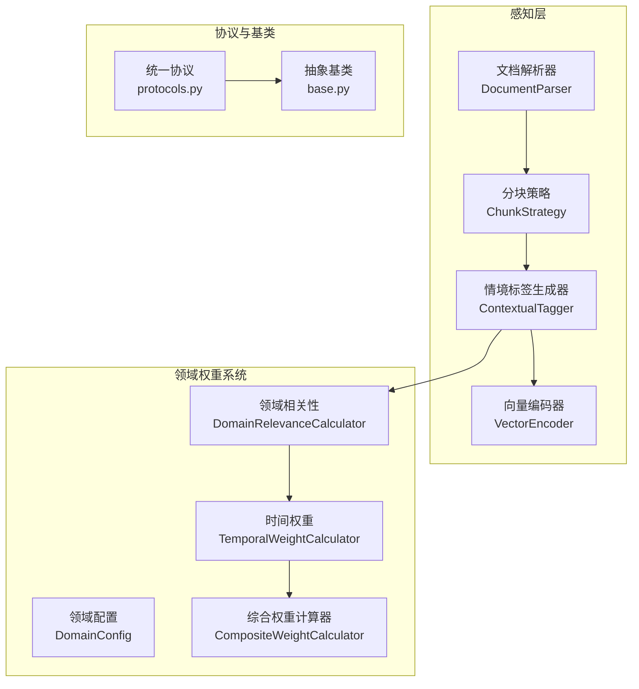
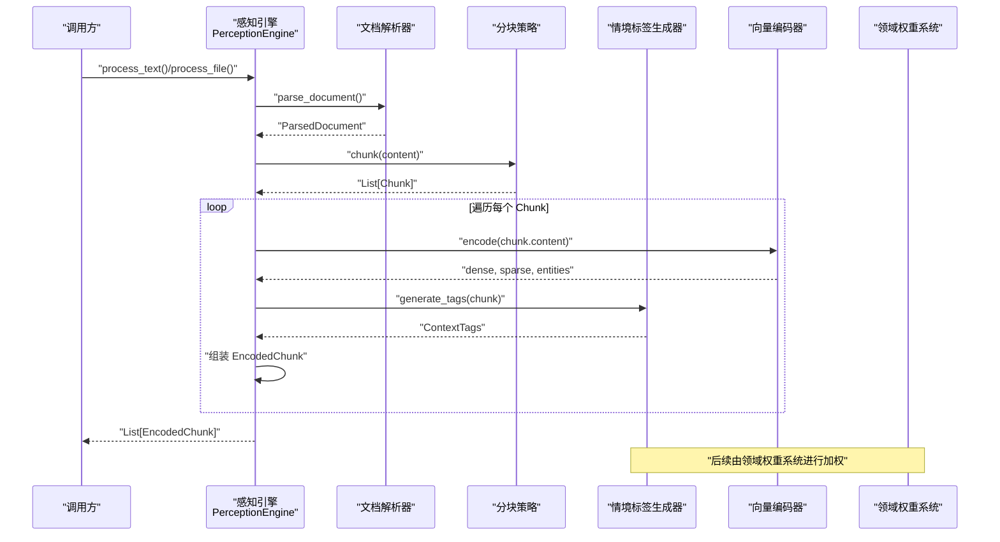
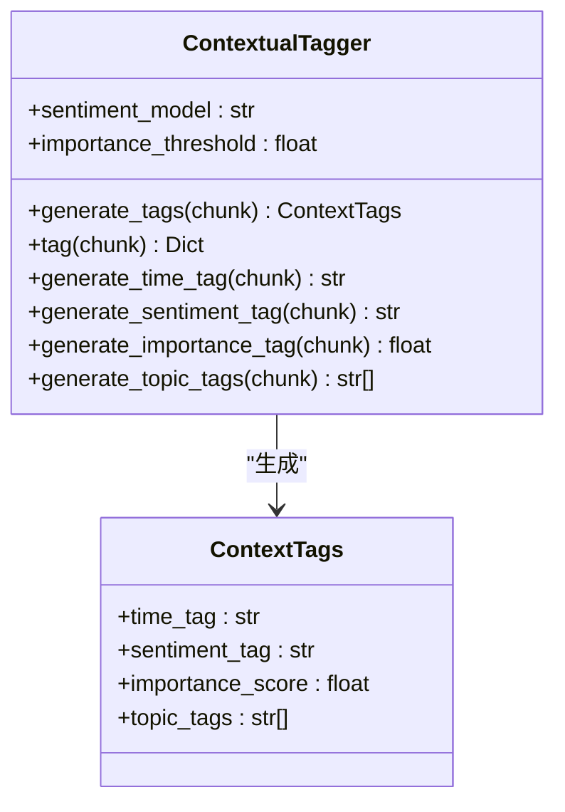
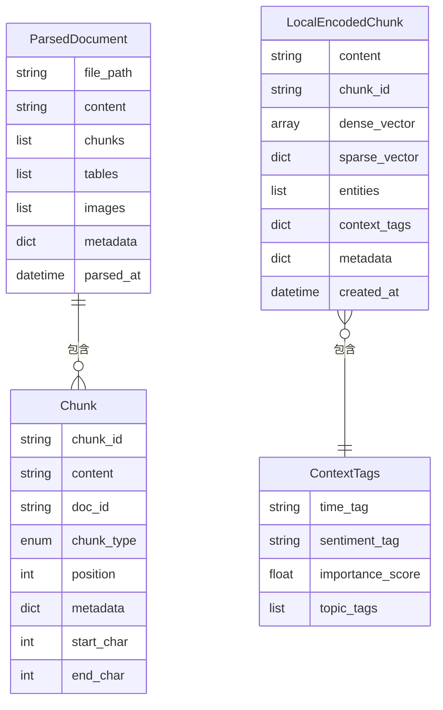
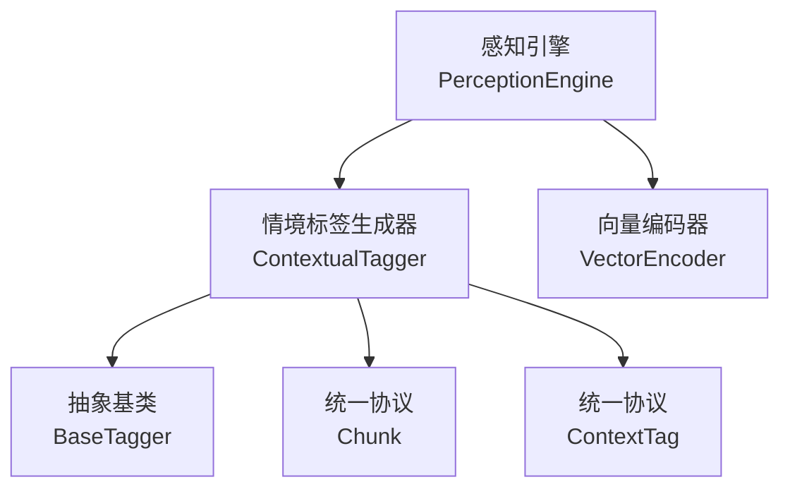

# 情境标签生成器

<cite>
**本文档引用的文件**
- [src/perception/tagger.py](file://src/perception/tagger.py)
- [src/perception/engine.py](file://src/perception/engine.py)
- [src/perception/models.py](file://src/perception/models.py)
- [src/perception/chunker.py](file://src/perception/chunker.py)
- [src/perception/encoder.py](file://src/perception/encoder.py)
- [src/core/base.py](file://src/core/base.py)
- [src/core/protocols.py](file://src/core/protocols.py)
- [src/domain/relevance.py](file://src/domain/relevance.py)
- [src/domain/temporal_weight.py](file://src/domain/temporal_weight.py)
- [src/domain/weight_calculator.py](file://src/domain/weight_calculator.py)
- [src/domain/config.py](file://src/domain/config.py)
- [example/example_usage.py](file://example/example_usage.py)
- [example/domain_weight_example.py](file://example/domain_weight_example.py)
</cite>

## 目录
1. [简介](#简介)
2. [项目结构](#项目结构)
3. [核心组件](#核心组件)
4. [架构总览](#架构总览)
5. [详细组件分析](#详细组件分析)
6. [依赖关系分析](#依赖关系分析)
7. [性能考量](#性能考量)
8. [故障排查指南](#故障排查指南)
9. [结论](#结论)
10. [附录](#附录)

## 简介
本文件面向 NecoRAG 情境标签生成器，系统性阐述情境标签的生成算法、特征工程与应用场景，覆盖时间标签、情感标签、主题标签与重要性评分的识别机制；解释 TF-IDF 权重计算、词向量聚合与上下文建模；梳理标签系统的层次结构与标签传播机制；并通过具体代码示例展示标签生成流程，包括输入文本处理、标签预测与置信度评估；最后说明情境标签在后续检索与排序中的应用价值。

## 项目结构
NecoRAG 采用模块化设计，情境标签生成位于感知层（perception），与分块、编码、领域权重系统协同工作，形成“解析-分块-编码-打标-权重融合”的完整流水线。

**图表来源**
- [src/perception/engine.py:20-76](file://src/perception/engine.py#L20-L76)
- [src/perception/tagger.py:11-48](file://src/perception/tagger.py#L11-L48)
- [src/domain/relevance.py:29-41](file://src/domain/relevance.py#L29-L41)
- [src/domain/temporal_weight.py:47-52](file://src/domain/temporal_weight.py#L47-L52)
- [src/domain/weight_calculator.py:56-80](file://src/domain/weight_calculator.py#L56-L80)
- [src/core/protocols.py:101-117](file://src/core/protocols.py#L101-L117)
- [src/core/base.py:135-149](file://src/core/base.py#L135-L149)

**章节来源**
- [src/perception/engine.py:20-76](file://src/perception/engine.py#L20-L76)
- [src/perception/tagger.py:11-48](file://src/perception/tagger.py#L11-L48)
- [src/domain/relevance.py:29-41](file://src/domain/relevance.py#L29-L41)
- [src/domain/temporal_weight.py:47-52](file://src/domain/temporal_weight.py#L47-L52)
- [src/domain/weight_calculator.py:56-80](file://src/domain/weight_calculator.py#L56-L80)
- [src/core/protocols.py:101-117](file://src/core/protocols.py#L101-L117)
- [src/core/base.py:135-149](file://src/core/base.py#L135-L149)

## 核心组件
- 情境标签生成器（ContextualTagger）：为每个 Chunk 生成时间、情感、重要性与主题标签，当前实现为最小实现，具备扩展为情感分析模型、主题分类器与实体识别器的能力。
- 数据模型：ContextTags（模块特有）、LocalEncodedChunk（模块特有）、ParsedDocument、Chunk、EncodedChunk、ContextTag（协议层）等。
- 统一协议与抽象基类：BaseTagger、Chunk、EncodedChunk、ContextTag 等，确保实现的一致性与可替换性。

**章节来源**
- [src/perception/tagger.py:11-48](file://src/perception/tagger.py#L11-L48)
- [src/perception/models.py:14-21](file://src/perception/models.py#L14-L21)
- [src/core/base.py:145-160](file://src/core/base.py#L145-L160)
- [src/core/protocols.py:101-117](file://src/core/protocols.py#L101-L117)

## 架构总览
情境标签生成器在感知引擎（PerceptionEngine）中被调用，依次经过文档解析、分块、向量编码与情境标签生成，最终产出包含情境标签的编码块（EncodedChunk）。随后，领域权重系统（领域相关性、时间权重、综合权重）对这些编码块进行加权，为检索与排序提供高质量信号。

**图表来源**
- [src/perception/engine.py:96-154](file://src/perception/engine.py#L96-L154)
- [src/perception/tagger.py:33-66](file://src/perception/tagger.py#L33-L66)
- [src/perception/encoder.py:73-87](file://src/perception/encoder.py#L73-L87)

## 详细组件分析

### 情境标签生成器（ContextualTagger）
- 功能职责
  - 生成时间标签：从 Chunk 元数据中提取创建时间，若无则标记为未知。
  - 生成情感标签：基于关键词集合进行简单统计，输出积极/消极/中性。
  - 生成重要性评分：基于文本长度与词汇多样性，归一化得到 0-1 区间分数。
  - 生成主题标签：统计高频词（过滤短词），返回前若干个高频词作为主题标签。
- 特征工程要点
  - 情感标签：关键词集合（中英文混合），通过计数比较决定极性。
  - 重要性评分：信息密度（独特词占比）与长度因子的加权平均。
  - 主题标签：基于词频统计，过滤短词以减少噪声。
- 置信度评估
  - 情感标签：基于匹配到的关键词数量与分布，提供置信度说明（可扩展）。
  - 重要性评分：基于密度与长度的稳定性，提供相对置信度。
- 应用场景
  - 检索前筛选：高重要性块优先参与检索。
  - 排序加权：结合领域权重与时间权重，提升相关高价值内容的排名。

**图表来源**
- [src/perception/tagger.py:11-48](file://src/perception/tagger.py#L11-L48)
- [src/perception/models.py:14-21](file://src/perception/models.py#L14-L21)

**章节来源**
- [src/perception/tagger.py:11-48](file://src/perception/tagger.py#L11-L48)
- [src/perception/models.py:14-21](file://src/perception/models.py#L14-L21)

### 数据模型与协议
- 本地模型（感知层特有）：LocalEncodedChunk、ParsedDocument、Table、Image。
- 协议模型（统一协议层）：Chunk、EncodedChunk、ContextTag、ChunkType 等。

**图表来源**
- [src/perception/models.py:52-62](file://src/perception/models.py#L52-L62)
- [src/perception/models.py:23-34](file://src/perception/models.py#L23-L34)
- [src/core/protocols.py:100-117](file://src/core/protocols.py#L100-L117)
- [src/perception/models.py:14-21](file://src/perception/models.py#L14-L21)

**章节来源**
- [src/perception/models.py:52-62](file://src/perception/models.py#L52-L62)
- [src/perception/models.py:23-34](file://src/perception/models.py#L23-L34)
- [src/core/protocols.py:100-117](file://src/core/protocols.py#L100-L117)
- [src/perception/models.py:14-21](file://src/perception/models.py#L14-L21)

### 分块策略与边界重叠
- 支持弹性分块、语义分块、固定大小分块、结构化分块、句子分块等多种模式。
- 通过边界重叠与语义边界检测，提升相邻块的上下文连贯性，辅助主题一致性与传播。

**章节来源**
- [src/perception/chunker.py:49-85](file://src/perception/chunker.py#L49-L85)
- [src/perception/chunker.py:88-141](file://src/perception/chunker.py#L88-L141)

### 向量编码器与实体三元组
- 生成稠密向量、稀疏向量与实体三元组；支持依赖注入 LLM 客户端以替换向量化实现。
- 稀疏向量基于 TF-IDF 风格的词频统计，实体抽取使用简单规则匹配，可通过 LLM 增强。

**章节来源**
- [src/perception/encoder.py:73-87](file://src/perception/encoder.py#L73-L87)
- [src/perception/encoder.py:121-147](file://src/perception/encoder.py#L121-L147)
- [src/perception/encoder.py:149-190](file://src/perception/encoder.py#L149-L190)

### 领域相关性与时间权重
- 领域相关性：基于关键字与文本特征的评分，支持别名与权重配置，输出领域等级与权重乘数。
- 时间权重：支持分层权重与指数衰减两种计算方式，可配置衰减率与层级边界。

**章节来源**
- [src/domain/relevance.py:95-241](file://src/domain/relevance.py#L95-L241)
- [src/domain/temporal_weight.py:84-195](file://src/domain/temporal_weight.py#L84-L195)

### 综合权重计算与排序
- 综合权重公式：最终分数 = 基础相似度 × α×关键字权重 × β×时间权重 × γ×领域权重 × 自定义权重加成。
- 支持批量计算与重排序，按最终分数降序排列。

**章节来源**
- [src/domain/weight_calculator.py:81-205](file://src/domain/weight_calculator.py#L81-L205)

## 依赖关系分析
- 感知引擎（PerceptionEngine）依赖文档解析器、分块策略、情境标签生成器与向量编码器。
- 情境标签生成器依赖抽象基类（BaseTagger）与统一协议（Chunk、ContextTag）。
- 领域权重系统依赖领域配置、时间权重计算器与领域相关性计算器。

**图表来源**
- [src/perception/engine.py:57-75](file://src/perception/engine.py#L57-L75)
- [src/perception/tagger.py:11-32](file://src/perception/tagger.py#L11-L32)
- [src/core/base.py:145-160](file://src/core/base.py#L145-L160)
- [src/core/protocols.py:100-117](file://src/core/protocols.py#L100-L117)

**章节来源**
- [src/perception/engine.py:57-75](file://src/perception/engine.py#L57-L75)
- [src/perception/tagger.py:11-32](file://src/perception/tagger.py#L11-L32)
- [src/core/base.py:145-160](file://src/core/base.py#L145-L160)
- [src/core/protocols.py:100-117](file://src/core/protocols.py#L100-L117)

## 性能考量
- 分块策略：弹性分块与语义分块在保证语义完整性的同时，减少碎片化与过度切分，提高后续编码与打标效率。
- 向量编码：优先使用 LLM 客户端进行嵌入，回退至内置确定性伪向量实现，兼顾性能与一致性。
- 批量处理：向量编码器支持批量嵌入，降低调用开销。
- 标签生成：情感与主题标签采用简单统计，复杂度低，适合大规模文本批处理。

[本节为通用性能讨论，不直接分析特定文件]

## 故障排查指南
- 情感标签异常
  - 现象：情感标签恒为中性或波动较大。
  - 排查：检查关键词集合是否覆盖目标领域；确认文本是否包含大小写差异导致的匹配失败。
- 重要性评分偏低
  - 现象：重要性评分普遍偏低。
  - 排查：确认文本长度与词汇多样性是否足够；调整长度因子与密度因子的权重。
- 主题标签噪声较多
  - 现象：主题标签包含大量停用词或短词。
  - 排查：增加短词过滤阈值；引入更精细的分词与去噪策略。
- 时间标签缺失
  - 现象：时间标签均为“未知”。
  - 排查：确认 Chunk 元数据中是否存在创建时间字段；检查上游解析器是否正确提取时间信息。
- 领域权重异常
  - 现象：领域权重过高或过低。
  - 排查：检查领域配置中的关键字权重与别名设置；核对时间衰减配置与层级边界。

**章节来源**
- [src/perception/tagger.py:85-163](file://src/perception/tagger.py#L85-L163)
- [src/domain/relevance.py:95-241](file://src/domain/relevance.py#L95-L241)
- [src/domain/temporal_weight.py:84-195](file://src/domain/temporal_weight.py#L84-L195)

## 结论
情境标签生成器通过时间、情感、重要性与主题四个维度对 Chunk 进行上下文标注，结合向量编码与领域权重系统，为检索与排序提供高质量的信号。弹性分块与实体三元组增强了语义连贯性与主题传播能力。在实际应用中，建议根据业务领域定制关键词集合与权重因子，并结合时间衰减策略动态调整内容优先级。

[本节为总结性内容，不直接分析特定文件]

## 附录

### 使用示例与最佳实践
- 使用感知引擎处理文本并查看情境标签
  - 示例路径：[example/example_usage.py:12-47](file://example/example_usage.py#L12-L47)
  - 关键点：初始化感知引擎，调用 process_text，遍历 EncodedChunk 查看 context_tags。
- 领域权重系统示例
  - 示例路径：[example/domain_weight_example.py:145-202](file://example/domain_weight_example.py#L145-L202)
  - 关键点：创建领域配置，计算时间权重与领域相关性，进行综合权重计算与排序。
- 标签生成流程（代码级）
  - 解析与分块：[src/perception/engine.py:77-154](file://src/perception/engine.py#L77-L154)
  - 情境标签生成：[src/perception/tagger.py:33-66](file://src/perception/tagger.py#L33-L66)
  - 向量编码与实体抽取：[src/perception/encoder.py:73-87](file://src/perception/encoder.py#L73-L87)
  - 领域权重计算：[src/domain/weight_calculator.py:81-146](file://src/domain/weight_calculator.py#L81-L146)

**章节来源**
- [example/example_usage.py:12-47](file://example/example_usage.py#L12-L47)
- [example/domain_weight_example.py:145-202](file://example/domain_weight_example.py#L145-L202)
- [src/perception/engine.py:77-154](file://src/perception/engine.py#L77-L154)
- [src/perception/tagger.py:33-66](file://src/perception/tagger.py#L33-L66)
- [src/perception/encoder.py:73-87](file://src/perception/encoder.py#L73-L87)
- [src/domain/weight_calculator.py:81-146](file://src/domain/weight_calculator.py#L81-L146)

### 扩展方法与自定义开发指南
- 扩展情感分析模型
  - 目标：将简单关键词检测替换为更精确的情感分析模型。
  - 实施：在 ContextualTagger 中替换 generate_sentiment_tag，接入外部情感分析服务或本地模型。
  - 参考：[src/perception/tagger.py:85-111](file://src/perception/tagger.py#L85-L111)
- 扩展主题分类器
  - 目标：从高频词统计升级为主题分类，提升主题表达能力。
  - 实施：在 generate_topic_tags 中引入主题分类模型，输出更具语义一致性的主题标签。
  - 参考：[src/perception/tagger.py:140-163](file://src/perception/tagger.py#L140-L163)
- 扩展实体识别器
  - 目标：从简单规则抽取升级为结构化实体三元组抽取。
  - 实施：在 VectorEncoder 中增强 extract_entities，接入命名实体识别（NER）模型。
  - 参考：[src/perception/encoder.py:149-190](file://src/perception/encoder.py#L149-L190)
- 自定义标签开发
  - 目标：新增标签类型（如意图标签、风险标签）。
  - 实施：在 ContextTags 中新增字段，扩展 ContextualTagger 的生成逻辑，并在感知引擎中集成。
  - 参考：[src/perception/models.py:14-21](file://src/perception/models.py#L14-L21)，[src/perception/tagger.py:33-66](file://src/perception/tagger.py#L33-L66)
- 集成指南
  - 步骤：实现 BaseTagger 接口 → 在感知引擎中注册自定义标签生成器 → 在编码流程中调用 → 与领域权重系统对接。
  - 参考：[src/core/base.py:145-160](file://src/core/base.py#L145-L160)，[src/perception/engine.py:109-133](file://src/perception/engine.py#L109-L133)

**章节来源**
- [src/perception/tagger.py:85-163](file://src/perception/tagger.py#L85-L163)
- [src/perception/encoder.py:149-190](file://src/perception/encoder.py#L149-L190)
- [src/perception/models.py:14-21](file://src/perception/models.py#L14-L21)
- [src/core/base.py:145-160](file://src/core/base.py#L145-L160)
- [src/perception/engine.py:109-133](file://src/perception/engine.py#L109-L133)