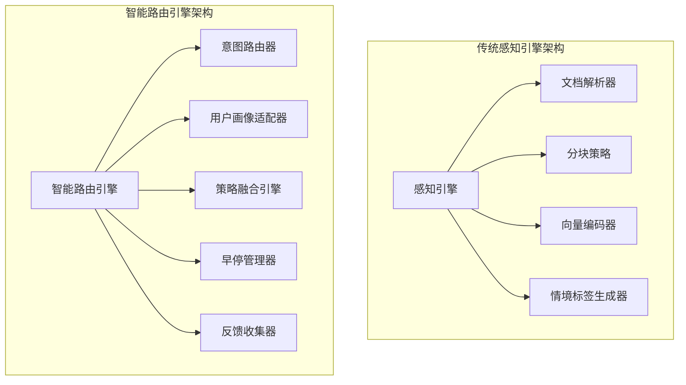
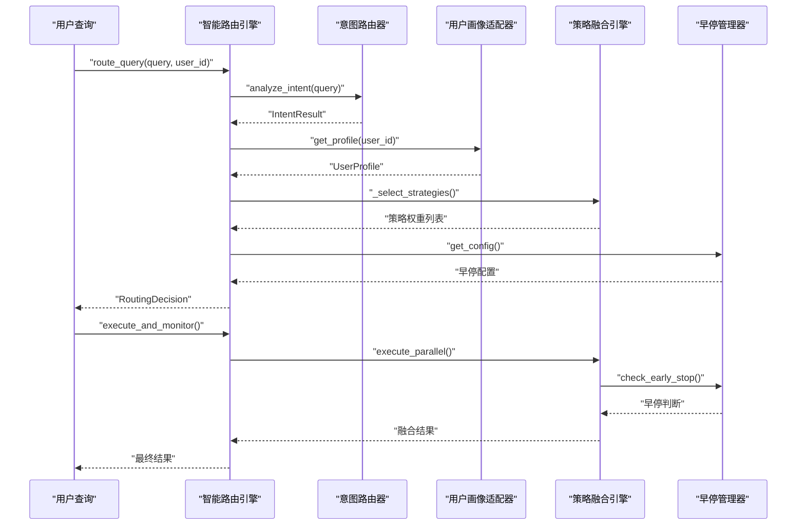
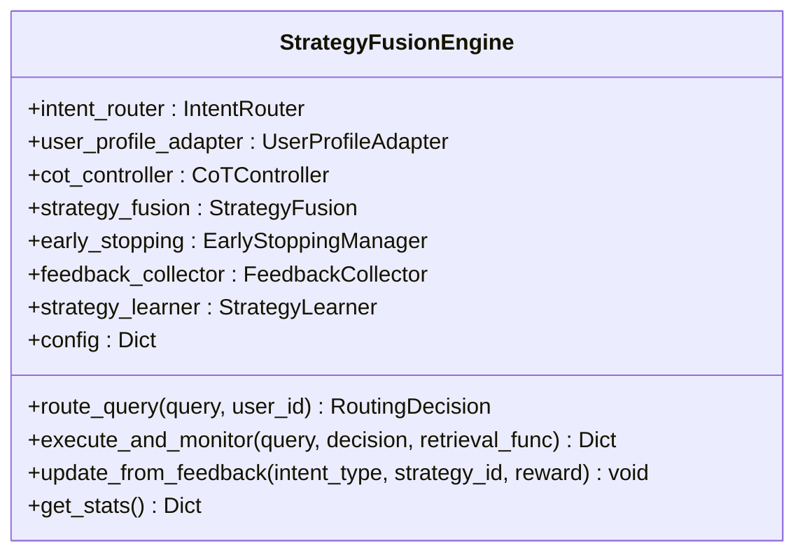
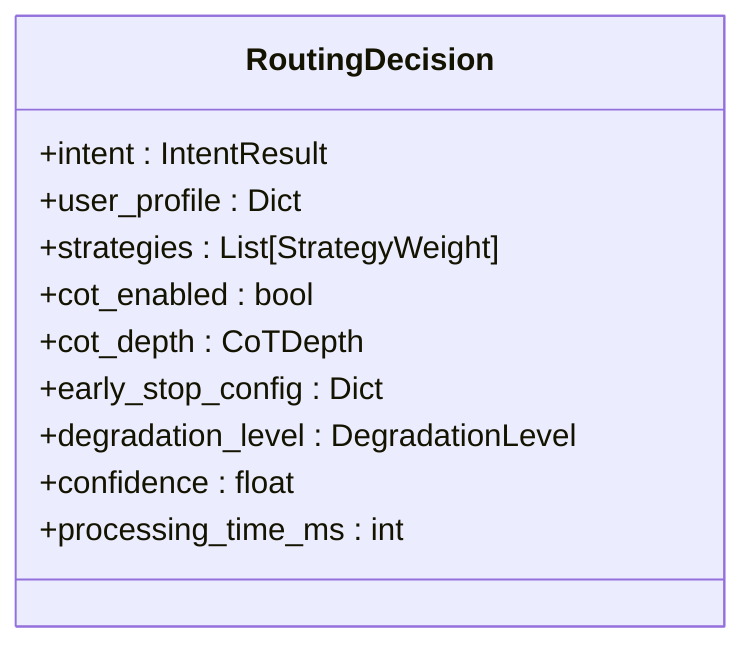
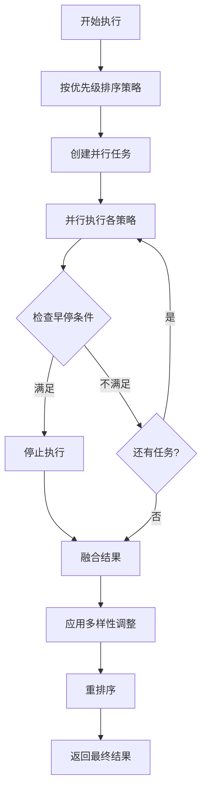
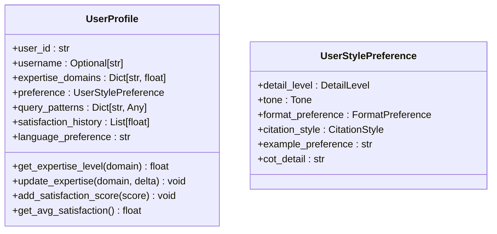
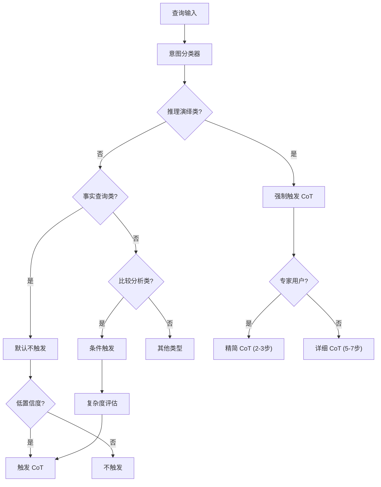

# 感知引擎模块

<cite>
**本文引用的文件**
- [engine.py](file://src/retrieval/smart_routing/engine.py)
- [intent_router.py](file://src/retrieval/smart_routing/intent_router.py)
- [user_adapter.py](file://src/retrieval/smart_routing/user_adapter.py)
- [strategy_fusion.py](file://src/retrieval/smart_routing/strategy_fusion.py)
- [README.md](file://src/retrieval/smart_routing/README.md)
- [IMPLEMENTATION_SUMMARY.md](file://src/retrieval/smart_routing/IMPLEMENTATION_SUMMARY.md)
- [design.md](file://design/design.md)
- [engine.py](file://src/perception/engine.py)
- [parser.py](file://src/perception/parser.py)
- [chunker.py](file://src/perception/chunker.py)
- [encoder.py](file://src/perception/encoder.py)
- [tagger.py](file://src/perception/tagger.py)
- [models.py](file://src/perception/models.py)
- [base.py](file://src/core/base.py)
- [config.py](file://src/core/config.py)
- [README.md](file://src/perception/README.md)
- [test_chunker.py](file://tests/test_perception/test_chunker.py)
- [example_usage.py](file://example/example_usage.py)
- [necorag.py](file://src/necorag.py)
</cite>

## 更新摘要
**变更内容**
- 感知引擎模块已被智能路由引擎的统一架构所替代
- 传统感知层的文档解析、分块、编码、标签生成功能整合到三层决策架构中
- 新架构采用意图驱动路由、用户画像适配和策略融合的统一引擎设计
- 保留了感知引擎的配置参数和使用示例，但功能实现已完全重构

## 目录
1. [简介](#简介)
2. [架构演进](#架构演进)
3. [智能路由引擎架构](#智能路由引擎架构)
4. [核心组件详解](#核心组件详解)
5. [三层决策架构](#三层决策架构)
6. [策略融合与执行](#策略融合与执行)
7. [用户画像与个性化](#用户画像与个性化)
8. [CoT思维链推理](#cot思维链推理)
9. [性能优化与早停机制](#性能优化与早停机制)
10. [配置与使用指南](#配置与使用指南)
11. [迁移指南](#迁移指南)
12. [故障排除](#故障排除)
13. [结论](#结论)

## 简介
感知引擎模块原本负责多模态数据的高精度编码与情境标记，是 NecoRAG 感知层的核心。随着智能路由引擎的引入，传统的感知引擎已被统一的三层决策架构所替代。新的智能路由引擎整合了语义意图分类、用户画像适配和策略融合三大核心能力，构建了智能化的检索-响应决策系统。

**更新** 感知引擎模块已被智能路由引擎完全替代，传统感知层功能已整合到新的统一架构中

## 架构演进
从传统的感知引擎到智能路由引擎的架构演进体现了从"数据处理管道"到"智能决策系统"的根本转变：



**图表来源**
- [engine.py:34-129](file://src/retrieval/smart_routing/engine.py#L34-L129)
- [engine.py:131-168](file://src/retrieval/smart_routing/engine.py#L131-L168)

## 智能路由引擎架构
智能路由引擎采用统一的三层决策架构，实现了从查询到最优响应的智能化决策过程：



**图表来源**
- [engine.py:68-129](file://src/retrieval/smart_routing/engine.py#L68-L129)
- [engine.py:205-249](file://src/retrieval/smart_routing/engine.py#L205-L249)

## 核心组件详解
智能路由引擎由六个核心组件构成，每个组件都有明确的职责和接口：

### StrategyFusionEngine（主引擎）
智能路由引擎的主类，负责协调所有子模块的协同工作：



**图表来源**
- [engine.py:34-67](file://src/retrieval/smart_routing/engine.py#L34-L67)

### RoutingDecision（路由决策）
封装路由决策的所有相关信息：



**图表来源**
- [engine.py:20-32](file://src/retrieval/smart_routing/engine.py#L20-L32)

**章节来源**
- [engine.py:34-274](file://src/retrieval/smart_routing/engine.py#L34-L274)

## 三层决策架构
智能路由引擎的核心是三层决策架构，每一层都有特定的决策职责：

### 第一层：意图识别层
负责语义意图分类、复杂度评估和CoT触发判断：

**意图类型**（7大类语义意图）:
- 事实查询（Factual Query）
- 比较分析（Comparative Analysis）  
- 推理演绎（Reasoning Inference）
- 概念解释（Concept Explanation）
- 摘要总结（Summarization）
- 操作指导（Procedural）
- 探索发散（Exploratory）

**章节来源**
- [intent_router.py:13-22](file://src/retrieval/smart_routing/intent_router.py#L13-L22)
- [intent_router.py:42-77](file://src/retrieval/smart_routing/intent_router.py#L42-L77)

### 第二层：用户画像层
基于用户个人工作空间数据进行个性化定制：

**专业度适配矩阵**:
- 专家（≥0.8）：增加深度检索权重，减少基础概念检索
- 中级（0.5-0.8）：平衡深度和广度
- 新手（<0.5）：增加基础概念和示例检索

**风格偏好适配**:
- 详细度级别：简洁/平衡/详细
- 语调风格：正式/随意/幽默
- 格式偏好：文本/要点/表格/图表
- 引用风格：内联/脚注/尾注/无

**章节来源**
- [user_adapter.py:56-96](file://src/retrieval/smart_routing/user_adapter.py#L56-L96)
- [user_adapter.py:127-131](file://src/retrieval/smart_routing/user_adapter.py#L127-L131)

### 第三层：策略融合层
负责多策略权重分配、资源约束优化和动态早停机制：

**策略权重动态调整公式**:
```
strategy_weight_i = base_weight_i × α_intent × β_user × γ_context
```

**章节来源**
- [engine.py:131-168](file://src/retrieval/smart_routing/engine.py#L131-L168)
- [design.md:700-704](file://design/design.md#L700-L704)

## 策略融合与执行
策略融合引擎负责多策略并行执行和结果融合：

### 多策略并行执行


**图表来源**
- [strategy_fusion.py:78-158](file://src/retrieval/smart_routing/strategy_fusion.py#L78-L158)

### 结果融合算法
采用融合评分公式进行多策略结果融合：

```
fusion_score(d) = Σ w_s × norm(score_s,d) × (1 + novelty_d) × diversity_penalty
```

**多样性控制参数**:
- max_same_domain_ratio: 0.6（同一领域结果最多占60%）
- min_cross_domain_count: 2（至少包含2个跨领域结果）
- temporal_diversity: True（混合新旧知识）
- source_diversity: True（避免单一来源垄断）

**章节来源**
- [strategy_fusion.py:217-271](file://src/retrieval/smart_routing/strategy_fusion.py#L217-L271)
- [strategy_fusion.py:286-322](file://src/retrieval/smart_routing/strategy_fusion.py#L286-L322)

## 用户画像与个性化
用户画像适配器提供了完整的用户画像管理和个性化适配功能：

### 用户画像数据结构


**图表来源**
- [user_adapter.py:56-96](file://src/retrieval/smart_routing/user_adapter.py#L56-L96)
- [user_adapter.py:44-52](file://src/retrieval/smart_routing/user_adapter.py#L44-L52)

### 个性化响应生成
根据用户画像调整响应风格和详细程度：

**响应风格调整算法**:
- 专家用户：简洁、专业术语、假设已知背景
- 中级用户：适度解释专业术语，提供背景链接  
- 新手用户：通俗易懂、类比解释、逐步引导

**章节来源**
- [user_adapter.py:248-288](file://src/retrieval/smart_routing/user_adapter.py#L248-L288)
- [design.md:712-757](file://design/design.md#L712-L757)

## CoT思维链推理
智能路由引擎集成了自适应的CoT思维链推理机制：

### CoT触发决策树


**图表来源**
- [design.md:763-800](file://design/design.md#L763-L800)

### CoT深度分级
| 深度等级 | 推理步数 | 适用场景 | 展示内容 |
|---------|---------|---------|---------|
| L1 - 精简版 | 1-2 步 | 专家用户、简单问题 | 关键推理跳跃，省略中间步骤 |
| L2 - 标准版 | 3-4 步 | 中级用户、中等复杂度 | 完整逻辑链，标注关键节点 |
| L3 - 详细版 | 5-7 步 | 新手用户、复杂推理 | 每步详细说明，附带示例和类比 |
| L4 - 探索版 | 7+ 步 | 探索性问题、跨领域整合 | 多路径推理，展示不同视角 |

**章节来源**
- [design.md:802-842](file://design/design.md#L802-L842)

## 性能优化与早停机制
智能路由引擎实现了多层次的性能优化和早停机制：

### 早停配置
```python
early_stop_config = {
    'enabled': True,
    'confidence_threshold': 0.95,
    'diminishing_returns_threshold': 0.02,
    'latency_budget_ratio': 0.8,
    'satisfaction_threshold': 4.5,
    'max_allowed_latency_ms': 1000,
    'level1_latency_ms': 500,
    'level2_latency_ms': 700,
    'level3_latency_ms': 900,
    'level4_latency_ms': 1000,
}
```

### 性能预期
- **简单问题**: 仅执行1个策略，延迟从800ms → 300ms (-62.5%)
- **中等问题**: 执行2-3个策略，延迟从1200ms → 600ms (-50%)
- **复杂问题**: 执行全部策略，并行化保持延迟<1000ms

### 资源优化
- **初期**: 计算资源增加20%（并行检索）
- **优化后**: 总体资源节省40%（早停 + 降级）
- **内存**: 占用增加10-15%（缓存策略）

**章节来源**
- [README.md:165-179](file://src/retrieval/smart_routing/README.md#L165-L179)
- [IMPLEMENTATION_SUMMARY.md:273-288](file://src/retrieval/smart_routing/IMPLEMENTATION_SUMMARY.md#L273-L288)

## 配置与使用指南
智能路由引擎提供了灵活的配置选项和使用示例：

### 基础使用
```python
from src.retrieval.smart_routing import StrategyFusionEngine

# 初始化引擎
engine = StrategyFusionEngine(
    intent_router=IntentRouter(),
    user_profile_adapter=UserProfileAdapter(),
    cot_controller=CoTController(),
    strategy_fusion=StrategyFusion(),
    early_stopping=EarlyStoppingManager(),
    feedback_collector=FeedbackCollector(),
    strategy_learner=StrategyLearner(feedback_collector),
)

# 路由决策
decision = await engine.route_query(
    query="为什么微服务架构更适合大规模系统？",
    user_id="user_123"
)

# 执行检索
results = await engine.execute_and_monitor(
    query=query,
    decision=decision,
    retrieval_func=your_retrieval_function
)
```

**章节来源**
- [README.md:72-130](file://src/retrieval/smart_routing/README.md#L72-L130)
- [IMPLEMENTATION_SUMMARY.md:298-348](file://src/retrieval/smart_routing/IMPLEMENTATION_SUMMARY.md#L298-L348)

## 迁移指南
从传统感知引擎迁移到智能路由引擎的步骤：

### 1. 更新导入路径
```python
# 传统感知引擎
from src.perception.engine import PerceptionEngine

# 智能路由引擎
from src.retrieval.smart_routing import StrategyFusionEngine
```

### 2. 更新配置参数
```python
# 传统配置
perception_config = {
    'chunk_size': 512,
    'chunk_overlap': 50,
    'enable_ocr': True,
    'model': 'BGE-M3'
}

# 智能路由配置
routing_config = {
    'intent_router': IntentRouter(),
    'user_profile_adapter': UserProfileAdapter(),
    'strategy_fusion': StrategyFusion(),
    'early_stopping': EarlyStoppingManager()
}
```

### 3. 更新使用方式
```python
# 传统方式
engine = PerceptionEngine()
encoded_chunks = engine.process_text(text)

# 智能路由方式
engine = StrategyFusionEngine(...)
decision = await engine.route_query(query, user_id)
results = await engine.execute_and_monitor(query, decision, retrieval_func)
```

**章节来源**
- [README.md:72-130](file://src/retrieval/smart_routing/README.md#L72-L130)

## 故障排除
智能路由引擎的常见问题和解决方案：

### 1. 意图识别失败
**现象**: 意图分类器无法识别查询类型
**排查**: 检查意图分类器配置和训练数据
**解决方案**: 使用规则匹配作为后备方案

### 2. 用户画像加载失败  
**现象**: 用户画像适配器无法获取用户数据
**排查**: 检查记忆管理器连接和用户ID有效性
**解决方案**: 使用默认用户画像作为后备

### 3. 策略执行超时
**现象**: 多策略并行执行超时
**排查**: 检查早停配置和各策略的性能
**解决方案**: 调整早停阈值或减少策略数量

### 4. 结果融合异常
**现象**: 融合后的结果质量不佳
**排查**: 检查策略权重配置和多样性参数
**解决方案**: 调整融合权重和多样性控制参数

**章节来源**
- [engine.py:68-129](file://src/retrieval/smart_routing/engine.py#L68-L129)
- [strategy_fusion.py:123-158](file://src/retrieval/smart_routing/strategy_fusion.py#L123-L158)

## 结论
智能路由引擎的引入标志着 NecoRAG 从传统的数据处理管道转向智能化的决策系统。新的三层决策架构不仅继承了传统感知引擎的数据处理能力，更重要的是增加了语义意图理解、用户画像个性化和策略智能选择等高级功能。

通过意图驱动路由、用户画像适配和策略融合的有机结合，智能路由引擎能够根据查询特征、用户偏好和历史行为动态选择最优的检索策略组合，显著提升了系统的智能化水平和用户体验。

虽然传统感知引擎的组件已被替代，但其设计理念和配置参数在新的架构中得到了延续和优化，为开发者提供了更加智能和高效的多模态数据处理解决方案。