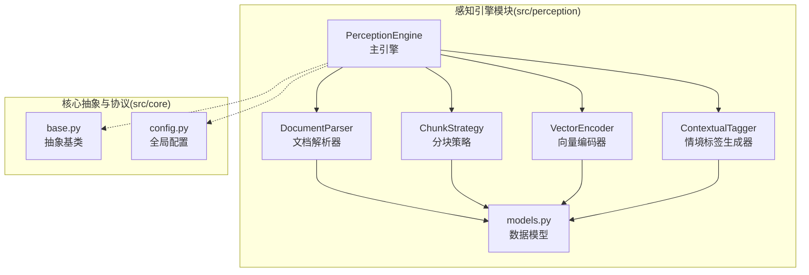
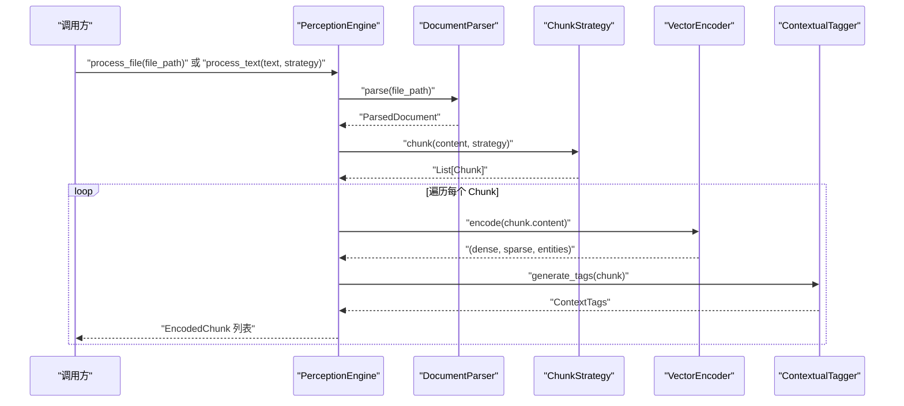
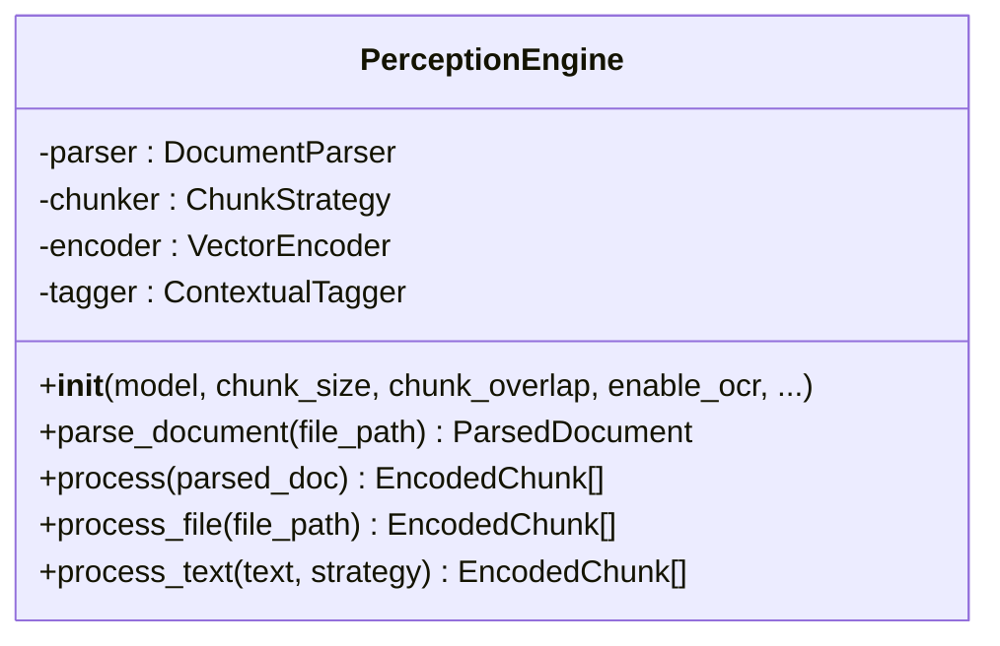
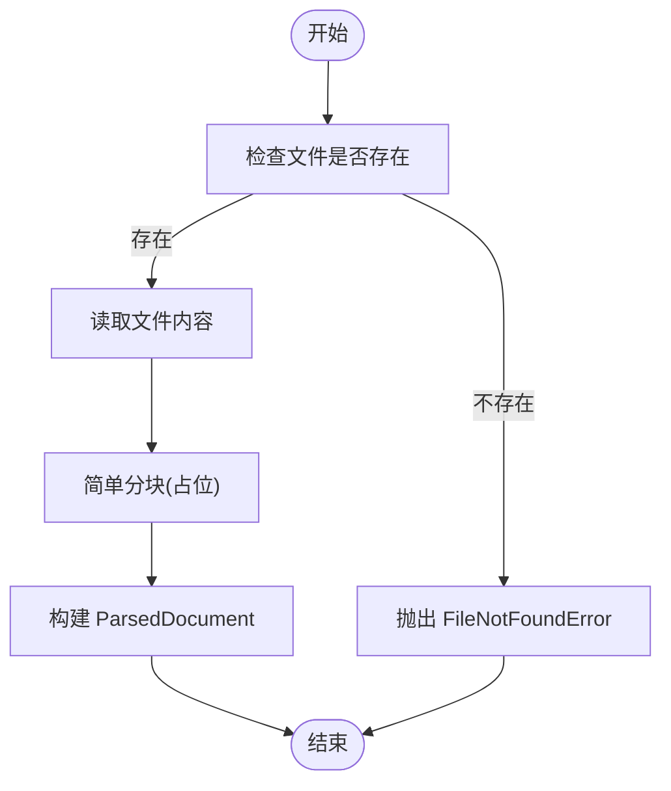
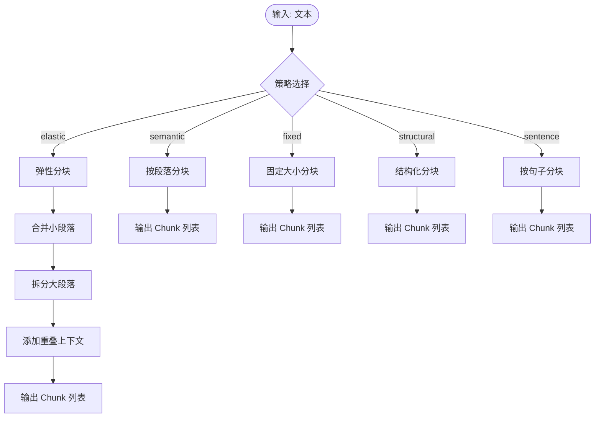
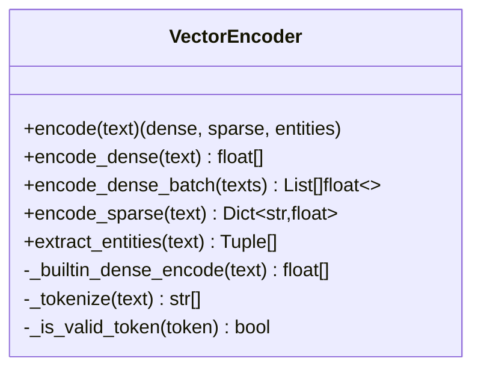
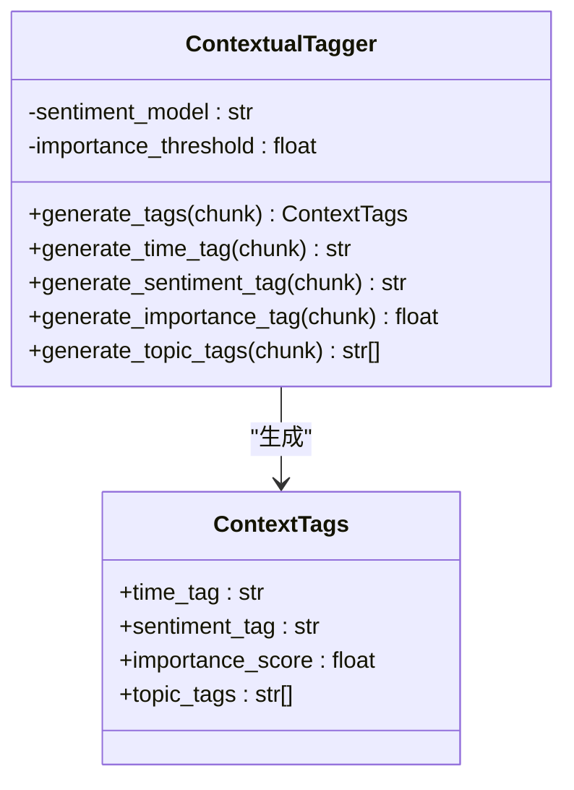
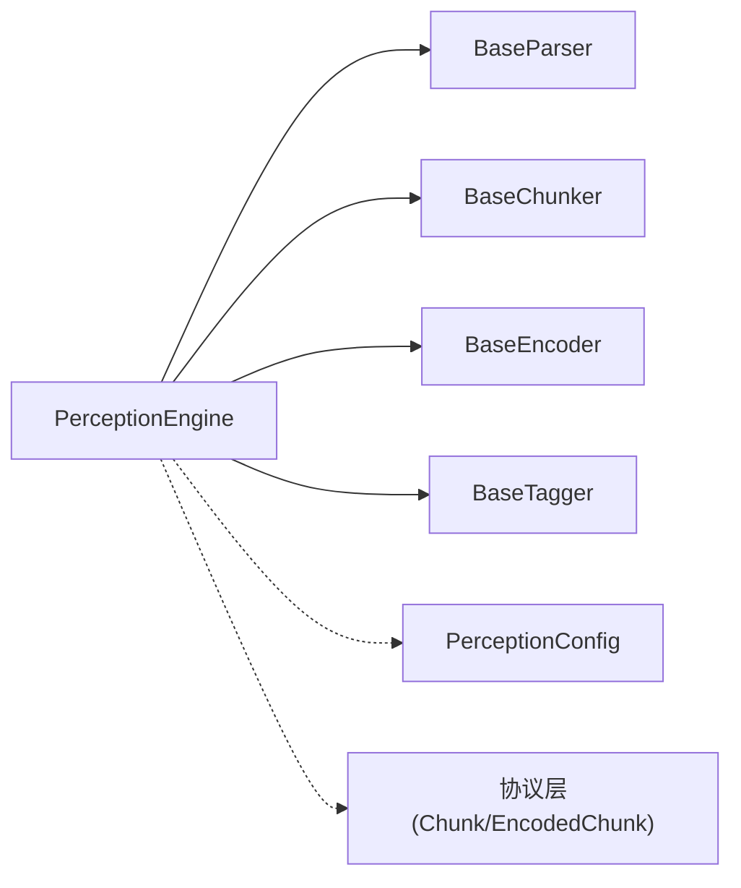

# 感知引擎模块

<cite>
**本文引用的文件**
- [engine.py](file://src/perception/engine.py)
- [parser.py](file://src/perception/parser.py)
- [chunker.py](file://src/perception/chunker.py)
- [encoder.py](file://src/perception/encoder.py)
- [tagger.py](file://src/perception/tagger.py)
- [models.py](file://src/perception/models.py)
- [base.py](file://src/core/base.py)
- [config.py](file://src/core/config.py)
- [README.md](file://src/perception/README.md)
- [test_chunker.py](file://tests/test_perception/test_chunker.py)
- [example_usage.py](file://example/example_usage.py)
- [necorag.py](file://src/necorag.py)
</cite>

## 目录
1. [简介](#简介)
2. [项目结构](#项目结构)
3. [核心组件](#核心组件)
4. [架构总览](#架构总览)
5. [详细组件分析](#详细组件分析)
6. [依赖分析](#依赖分析)
7. [性能考量](#性能考量)
8. [故障排除指南](#故障排除指南)
9. [结论](#结论)
10. [附录](#附录)

## 简介
感知引擎模块负责多模态数据的高精度编码与情境标记，是 NecoRAG 感知层的核心。它支持文档解析、多种分块策略、向量编码（稠密/稀疏/实体三元组）、情境标签生成，并提供与 RAGFlow 的集成方案、BGE-M3 嵌入模型的应用以及 OCR 功能的扩展点。本文面向开发者，系统阐述数据处理流程、算法选择依据、质量控制与性能优化，并提供配置参数说明、使用示例与故障排除建议。

## 项目结构
感知引擎位于 src/perception 目录下，围绕“文档解析 → 分块 → 向量编码 → 情境标签”的流水线组织，同时通过统一的抽象基类与协议层解耦具体实现，便于替换与扩展。

图表来源
- [engine.py:20-195](file://src/perception/engine.py#L20-L195)
- [parser.py:12-113](file://src/perception/parser.py#L12-L113)
- [chunker.py:12-567](file://src/perception/chunker.py#L12-L567)
- [encoder.py:25-255](file://src/perception/encoder.py#L25-L255)
- [tagger.py:11-163](file://src/perception/tagger.py#L11-L163)
- [models.py:14-62](file://src/perception/models.py#L14-L62)
- [base.py:32-160](file://src/core/base.py#L32-L160)
- [config.py:105-132](file://src/core/config.py#L105-L132)

章节来源
- [engine.py:20-195](file://src/perception/engine.py#L20-L195)
- [README.md:1-158](file://src/perception/README.md#L1-L158)

## 核心组件
- PerceptionEngine：多模态数据处理主入口，协调解析、分块、编码与打标。
- DocumentParser：文档解析器，支持多种格式，预留 RAGFlow 集成与 OCR 能力。
- ChunkStrategy：多策略分块器，支持弹性、语义、固定大小、结构化、句子级分块。
- VectorEncoder：多类型向量编码器，支持稠密向量、稀疏向量与实体三元组抽取。
- ContextualTagger：情境标签生成器，为每个文本块生成时间、情感、重要性、主题标签。
- 数据模型：统一的数据结构，包括 ParsedDocument、Chunk、EncodedChunk、ContextTags 等。

章节来源
- [engine.py:20-195](file://src/perception/engine.py#L20-L195)
- [parser.py:12-113](file://src/perception/parser.py#L12-L113)
- [chunker.py:12-567](file://src/perception/chunker.py#L12-L567)
- [encoder.py:25-255](file://src/perception/encoder.py#L25-L255)
- [tagger.py:11-163](file://src/perception/tagger.py#L11-L163)
- [models.py:14-62](file://src/perception/models.py#L14-L62)

## 架构总览
感知引擎采用“流水线 + 插件化”的架构设计，通过抽象基类与协议层实现松耦合，支持替换 LLM 客户端、向量编码器、标签生成器等组件。

图表来源
- [engine.py:77-194](file://src/perception/engine.py#L77-L194)
- [parser.py:28-60](file://src/perception/parser.py#L28-L60)
- [chunker.py:49-85](file://src/perception/chunker.py#L49-L85)
- [encoder.py:73-87](file://src/perception/encoder.py#L73-L87)
- [tagger.py:33-48](file://src/perception/tagger.py#L33-L48)

## 详细组件分析

### PerceptionEngine（主引擎）
- 职责：统一编排解析、分块、编码与打标；提供一站式处理接口。
- 关键能力：
  - 文档解析：委托 DocumentParser。
  - 分块策略：委托 ChunkStrategy，支持策略切换。
  - 向量编码：委托 VectorEncoder，生成稠密/稀疏向量与实体三元组。
  - 情境标签：委托 ContextualTagger，生成时间、情感、重要性、主题标签。
- 性能与可观测性：记录处理耗时、日志级别控制。

图表来源
- [engine.py:20-195](file://src/perception/engine.py#L20-L195)

章节来源
- [engine.py:20-195](file://src/perception/engine.py#L20-L195)

### DocumentParser（文档解析器）
- 职责：将多格式文档转换为统一结构化表示，预留 RAGFlow 集成与 OCR 能力。
- 当前实现：读取文本文件，简单分块；表格与图片提取为占位实现。
- 扩展点：支持 PDF、Word、Markdown、HTML 等格式；可接入 OCR 与表格还原。

图表来源
- [parser.py:28-60](file://src/perception/parser.py#L28-L60)

章节来源
- [parser.py:12-113](file://src/perception/parser.py#L12-L113)

### ChunkStrategy（分块策略）
- 职责：提供多种分块策略，统一入口方法根据策略路由到具体实现。
- 支持策略：
  - elastic：弹性分块（智能调整块大小，按语义边界合并/拆分，添加重叠）。
  - semantic：按段落语义分块。
  - fixed：固定大小分块（滑动窗口，支持重叠）。
  - structural：结构化分块（基于标题/段落等）。
  - sentence：按句子边界分块（中英文标点）。
- 边界与重叠：提供句子/子句/词边界查找与重叠添加逻辑，保障语义完整性与上下文连贯。

图表来源
- [chunker.py:49-85](file://src/perception/chunker.py#L49-L85)
- [chunker.py:89-141](file://src/perception/chunker.py#L89-L141)
- [chunker.py:185-216](file://src/perception/chunker.py#L185-L216)
- [chunker.py:218-248](file://src/perception/chunker.py#L218-L248)
- [chunker.py:250-265](file://src/perception/chunker.py#L250-L265)
- [chunker.py:143-183](file://src/perception/chunker.py#L143-L183)

章节来源
- [chunker.py:12-567](file://src/perception/chunker.py#L12-L567)
- [test_chunker.py:1-532](file://tests/test_perception/test_chunker.py#L1-L532)

### VectorEncoder（向量编码器）
- 职责：生成多类型向量表示，支持稠密向量、稀疏向量与实体三元组抽取。
- 稠密向量：优先使用 LLM 客户端 embed/embed_batch；若不可用回退到内置确定性伪向量生成。
- 稀疏向量：基于 TF-IDF 风格的词频统计，归一化为权重字典。
- 实体抽取：基于简单规则匹配抽取三元组（主体-关系-客体），可扩展为 LLM 增强。
- 批量接口：encode_batch 支持批量编码，提升吞吐。

图表来源
- [encoder.py:25-255](file://src/perception/encoder.py#L25-L255)

章节来源
- [encoder.py:25-255](file://src/perception/encoder.py#L25-L255)

### ContextualTagger（情境标签生成器）
- 职责：为每个 Chunk 生成情境标签，模拟猫胡须对环境微变化的感知。
- 标签类型：
  - 时间标签：基于元数据创建时间等（占位实现，后续可集成时间实体识别）。
  - 情感标签：基于关键词检测（正/负/中性）。
  - 重要性评分：基于信息密度与长度的综合评分（0-1）。
  - 主题标签：高频词提取（占位实现，后续可集成主题分类）。
- 可扩展：情感分析模型、主题分类器、时间实体识别器等。

图表来源
- [tagger.py:11-163](file://src/perception/tagger.py#L11-L163)
- [models.py:14-21](file://src/perception/models.py#L14-L21)

章节来源
- [tagger.py:11-163](file://src/perception/tagger.py#L11-L163)
- [models.py:14-21](file://src/perception/models.py#L14-L21)

### 数据模型
- ParsedDocument：解析后的文档，包含内容、分块、表格、图片与元数据。
- Chunk：分块对象，包含内容、位置信息与元数据。
- EncodedChunk：编码后的文本块，包含稠密/稀疏向量、实体三元组与情境标签。
- ContextTags：情境标签集合，包含时间、情感、重要性与主题标签。

章节来源
- [models.py:14-62](file://src/perception/models.py#L14-L62)

## 依赖分析
- 抽象基类与协议层：通过 src/core/base.py 的抽象基类（BaseParser、BaseChunker、BaseEncoder、BaseTagger）与协议层（Chunk、EncodedChunk 等）实现组件解耦。
- 配置系统：通过 src/core/config.py 的 NecoRAGConfig 与 PerceptionConfig 提供统一配置入口，支持感知层分块策略、弹性参数、标签开关等。
- 组件耦合与内聚：PerceptionEngine 内聚度高，职责单一；各子组件通过抽象接口解耦，便于替换与扩展。

图表来源
- [engine.py:9-13](file://src/perception/engine.py#L9-L13)
- [base.py:32-160](file://src/core/base.py#L32-L160)
- [config.py:105-132](file://src/core/config.py#L105-L132)

章节来源
- [base.py:32-160](file://src/core/base.py#L32-L160)
- [config.py:105-132](file://src/core/config.py#L105-L132)

## 性能考量
- 分块策略选择
  - 弹性分块（elastic）：在语义边界处合并/拆分，兼顾语义完整性与块大小控制，适合长文档与复杂结构。
  - 固定大小分块（fixed）：滑动窗口，重叠可控，适合批处理与并行编码。
  - 语义分块（semantic）：按段落保持语义边界，适合结构化文档。
  - 句子分块（sentence）：细粒度，适合检索精确片段。
- 向量编码
  - 批量接口（encode_batch）可显著提升吞吐。
  - 稠密向量回退到内置实现时，确保确定性与可用性。
  - 稀疏向量基于词频统计，计算开销低，适合快速检索。
- 标签生成
  - 情感与主题标签为规则/统计实现，成本低；可按需启用。
- 并行化与缓存
  - 分块与编码阶段可并行处理；向量存储与标签生成可缓存热点数据。

[本节为通用性能指导，无需特定文件来源]

## 故障排除指南
- 文档解析失败
  - 现象：文件不存在或解析异常。
  - 排查：确认文件路径有效；检查解析器支持的格式；查看日志错误堆栈。
  - 参考：[parser.py:42-43](file://src/perception/parser.py#L42-L43)
- 分块策略异常
  - 现象：指定策略无效或边界处理异常。
  - 排查：确认策略名称在支持列表中；检查边界查找逻辑；查看单元测试覆盖的边界情况。
  - 参考：[chunker.py:81-83](file://src/perception/chunker.py#L81-L83)，[test_chunker.py:131-138](file://tests/test_perception/test_chunker.py#L131-L138)
- 向量编码异常
  - 现象：嵌入维度不匹配或编码失败。
  - 排查：确认 LLM 客户端可用；检查向量维度配置；验证 encode_batch 输入。
  - 参考：[encoder.py:100-118](file://src/perception/encoder.py#L100-L118)
- 情境标签异常
  - 现象：情感/主题标签为空或不合理。
  - 排查：检查关键词词典与阈值；确认文本预处理；逐步启用标签生成器。
  - 参考：[tagger.py:97-111](file://src/perception/tagger.py#L97-L111)，[tagger.py:152-162](file://src/perception/tagger.py#L152-L162)

章节来源
- [parser.py:42-43](file://src/perception/parser.py#L42-L43)
- [chunker.py:81-83](file://src/perception/chunker.py#L81-L83)
- [encoder.py:100-118](file://src/perception/encoder.py#L100-L118)
- [tagger.py:97-111](file://src/perception/tagger.py#L97-L111)

## 结论
感知引擎模块通过清晰的职责划分与抽象解耦，实现了从多模态数据到多类型向量与情境标签的高效流水线。弹性分块策略、多类型向量编码与情境标签生成共同提升了检索与问答的准确性与可解释性。结合统一配置与可替换的组件设计，开发者可在不破坏整体架构的前提下扩展 OCR、RAGFlow 集成与更强大的标签生成能力。

[本节为总结性内容，无需特定文件来源]

## 附录

### 配置参数说明（感知层）
- 分块配置
  - chunk_size：基础分块大小（字符数）。
  - chunk_overlap：分块重叠长度（字符数）。
  - chunk_strategy：默认分块策略（fixed、semantic、structural、elastic、sentence）。
  - enable_elastic_chunking：是否启用弹性分块。
  - min_chunk_size、target_chunk_size、max_chunk_size：弹性分块的最小/目标/最大块大小。
  - semantic_boundaries：语义边界优先级列表（paragraph、sentence、clause）。
- 标签配置
  - enable_time_tag、enable_emotion_tag、enable_importance_tag、enable_topic_tag：是否启用对应标签生成。
- 解析配置
  - supported_formats：支持的文档格式列表（默认 txt、md、pdf、docx、html）。

章节来源
- [config.py:105-132](file://src/core/config.py#L105-L132)

### 使用示例与最佳实践
- 单文件处理：通过 PerceptionEngine.process_file(file_path) 完成解析、分块、编码与打标。
- 纯文本处理：通过 PerceptionEngine.process_text(text, strategy) 指定分块策略。
- 批量处理：先分块再批量编码，利用 encode_batch 提升吞吐。
- 策略选择建议：
  - 长文档/复杂结构：优先弹性分块（elastic）。
  - 结构化文档：语义分块（semantic）或结构化分块（structural）。
  - 精确检索：句子分块（sentence）。
  - 批量导入：固定大小分块（fixed）配合重叠。

章节来源
- [example_usage.py:12-47](file://example/example_usage.py#L12-L47)
- [engine.py:140-194](file://src/perception/engine.py#L140-L194)

### 与 RAGFlow 集成与 BGE-M3 应用
- RAGFlow 集成：文档解析器预留集成点（TODO 注释），可替换为 RAGFlow 的深度解析能力，支持 OCR、表格还原与层级分析。
- BGE-M3 嵌入：向量编码器默认使用 BGE-M3 模型名称，通过 LLM 客户端 embed/embed_batch 获取稠密向量；若 LLM 客户端不可用，回退到内置确定性伪向量生成，确保可用性。

章节来源
- [README.md:9-27](file://src/perception/README.md#L9-L27)
- [encoder.py:33-62](file://src/perception/encoder.py#L33-L62)

### 多维度向量化技术
- 稠密向量：语义高维表示，适合相似度检索。
- 稀疏向量：关键词权重表示，适合关键词检索与快速过滤。
- 实体三元组：知识图谱构建基础，支持关系抽取与推理。

章节来源
- [encoder.py:73-87](file://src/perception/encoder.py#L73-L87)
- [encoder.py:121-148](file://src/perception/encoder.py#L121-L148)
- [encoder.py:149-190](file://src/perception/encoder.py#L149-L190)

### 错误处理与日志
- 日志：PerceptionEngine 在解析、编码与处理过程中记录详细日志，便于定位问题。
- 异常：文件不存在、策略不支持、编码失败等异常均有明确提示与回溯信息。

章节来源
- [engine.py:87-94](file://src/perception/engine.py#L87-L94)
- [parser.py:42-43](file://src/perception/parser.py#L42-L43)
- [chunker.py:81-83](file://src/perception/chunker.py#L81-L83)