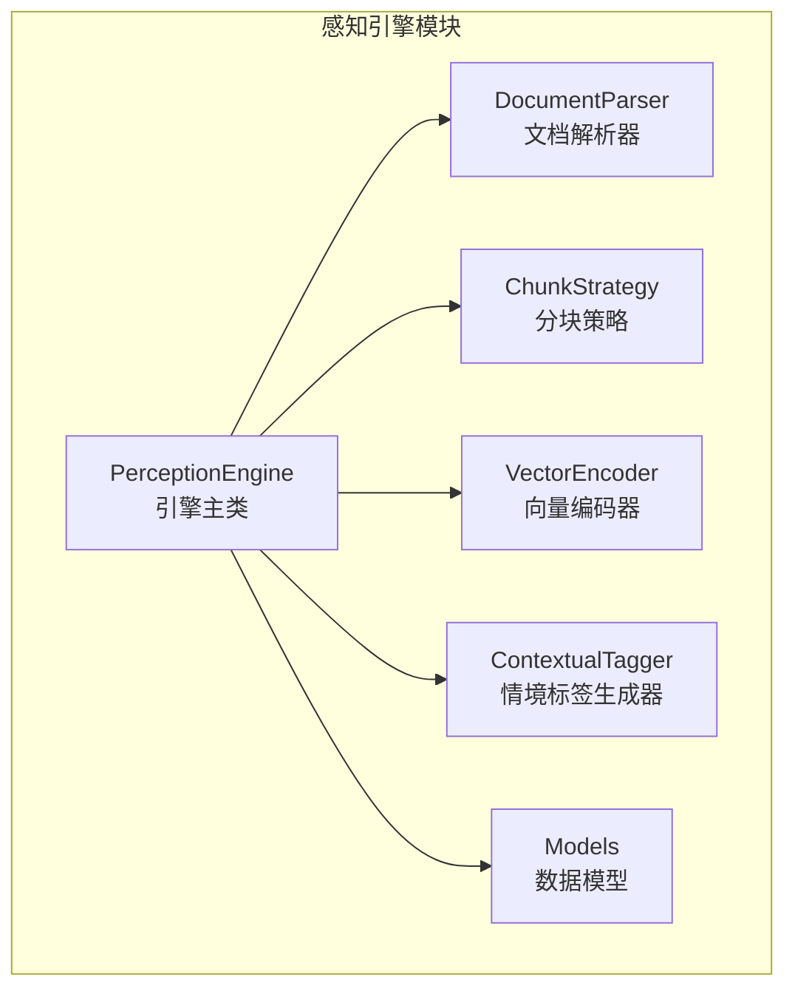
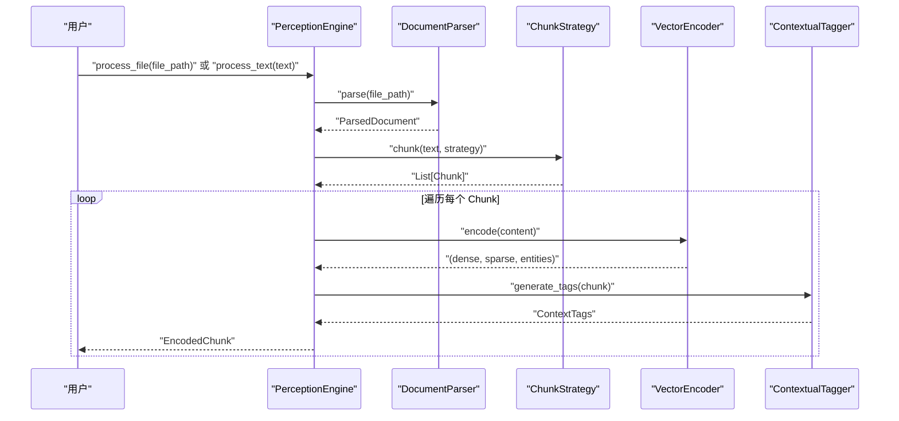
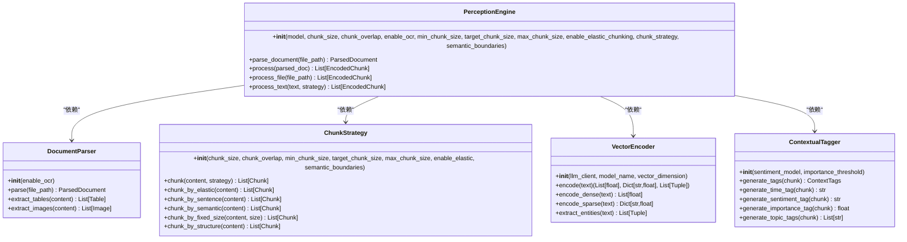
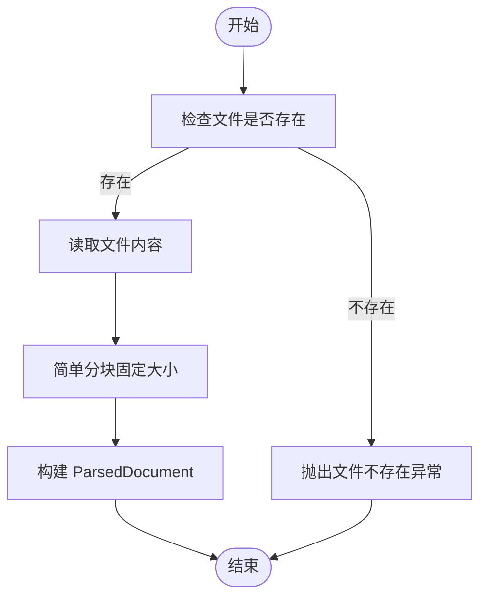
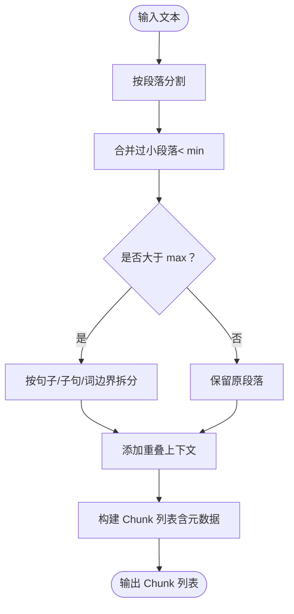
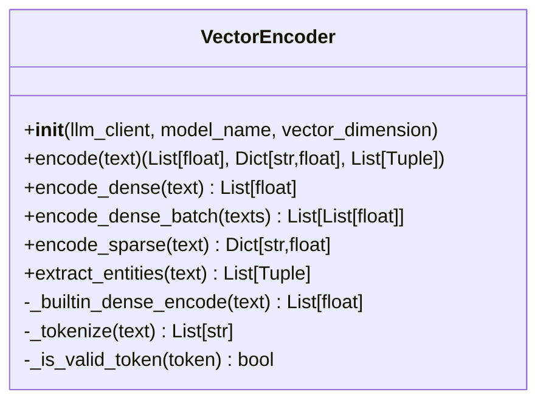
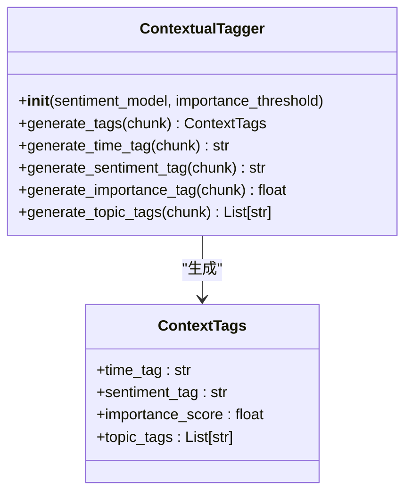
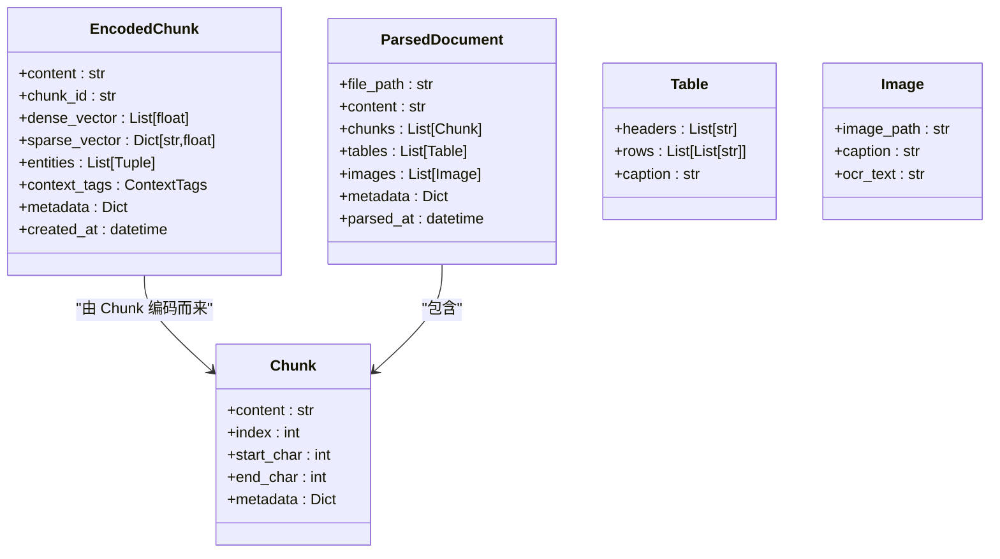
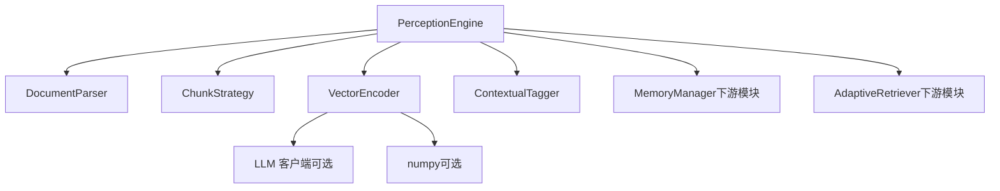

# 感知引擎模块

<cite>
**本文档引用的文件**
- [engine.py](file://src/perception/engine.py)
- [parser.py](file://src/perception/parser.py)
- [chunker.py](file://src/perception/chunker.py)
- [encoder.py](file://src/perception/encoder.py)
- [tagger.py](file://src/perception/tagger.py)
- [models.py](file://src/perception/models.py)
- [base.py](file://src/core/base.py)
- [protocols.py](file://src/core/protocols.py)
- [__init__.py](file://src/perception/__init__.py)
- [test_chunker.py](file://tests/test_perception/test_chunker.py)
- [example_usage.py](file://example/example_usage.py)
- [README.md](file://src/perception/README.md)
- [design.md](file://design/design.md)
- [config.py](file://src/core/config.py)
</cite>

## 目录
1. [简介](#简介)
2. [项目结构](#项目结构)
3. [核心组件](#核心组件)
4. [架构概览](#架构概览)
5. [详细组件分析](#详细组件分析)
6. [依赖关系分析](#依赖关系分析)
7. [性能考虑](#性能考虑)
8. [故障排查指南](#故障排查指南)
9. [结论](#结论)
10. [附录](#附录)

## 简介
感知引擎模块是 NecoRAG 的“感知层”核心组件，负责多模态数据的高精度编码与情境标记。其设计灵感来源于猫的胡须对环境微变化的敏锐感知，通过深度文档解析、弹性分块策略、多类型向量编码以及情境标签生成，为后续的记忆、检索与交互层提供高质量的语义基础。

- 深度文档解析：支持多种文档格式，集成 OCR、表格还原与层级分析（规划中）。
- 弹性分块策略：在段落、句子等语义边界处智能切割，避免破坏语义完整性。
- 多类型向量编码：生成稠密向量、稀疏向量与实体三元组，支持外部 LLM 客户端或内置实现。
- 情境标签生成器：为每个文本块自动打上时间、情感、重要性与主题标签，提升检索与排序的上下文相关性。

## 项目结构
感知引擎模块位于 src/perception 目录，包含以下关键文件：
- engine.py：感知引擎主类，协调解析、分块、编码与打标流程。
- parser.py：文档解析器，负责将不同格式文档转换为统一结构化表示。
- chunker.py：分块策略，提供弹性、语义、固定大小、结构化与句子级分块。
- encoder.py：向量编码器，生成稠密/稀疏向量与实体三元组。
- tagger.py：情境标签生成器，为文本块添加时间、情感、重要性与主题标签。
- models.py：数据模型，定义 Chunk、EncodedChunk、ParsedDocument 等核心数据结构。
- __init__.py：导出模块公共接口。
- README.md：模块使用说明与架构概览。

**图表来源**
- [engine.py:15-174](file://src/perception/engine.py#L15-L174)
- [parser.py:11-112](file://src/perception/parser.py#L11-L112)
- [chunker.py:11-566](file://src/perception/chunker.py#L11-L566)
- [encoder.py:24-254](file://src/perception/encoder.py#L24-L254)
- [tagger.py:10-144](file://src/perception/tagger.py#L10-L144)
- [models.py:11-69](file://src/perception/models.py#L11-L69)

**章节来源**
- [engine.py:1-174](file://src/perception/engine.py#L1-L174)
- [__init__.py:1-23](file://src/perception/__init__.py#L1-L23)

## 核心组件
- PerceptionEngine：引擎主类，封装解析、分块、编码与情境打标全流程，提供一站式处理接口。
- DocumentParser：负责将文件解析为统一的 ParsedDocument 结构，支持 OCR、表格与图片提取（规划中）。
- ChunkStrategy：提供多种分块策略，重点实现弹性分块，确保语义完整性与上下文连贯。
- VectorEncoder：生成稠密向量、稀疏向量与实体三元组，支持外部 LLM 客户端或内置实现。
- ContextualTagger：为每个 Chunk 生成情境标签，包括时间、情感、重要性与主题标签。
- 数据模型：定义 Chunk、EncodedChunk、ParsedDocument、Table、Image 等结构化数据。

**章节来源**
- [engine.py:15-174](file://src/perception/engine.py#L15-L174)
- [parser.py:11-112](file://src/perception/parser.py#L11-L112)
- [chunker.py:11-566](file://src/perception/chunker.py#L11-L566)
- [encoder.py:24-254](file://src/perception/encoder.py#L24-L254)
- [tagger.py:10-144](file://src/perception/tagger.py#L10-L144)
- [models.py:11-69](file://src/perception/models.py#L11-L69)

## 架构概览
感知引擎的处理流程如下：
1. 输入文档或纯文本。
2. DocumentParser 进行解析，生成 ParsedDocument。
3. ChunkStrategy 根据策略进行分块，生成 Chunk 列表。
4. VectorEncoder 对每个 Chunk 生成稠密/稀疏向量与实体三元组。
5. ContextualTagger 为每个 Chunk 生成情境标签。
6. 封装为 EncodedChunk，包含内容、向量、实体与标签，供下游模块使用。

**图表来源**
- [engine.py:72-174](file://src/perception/engine.py#L72-L174)
- [parser.py:27-59](file://src/perception/parser.py#L27-L59)
- [chunker.py:48-84](file://src/perception/chunker.py#L48-L84)
- [encoder.py:72-86](file://src/perception/encoder.py#L72-L86)
- [tagger.py:32-47](file://src/perception/tagger.py#L32-L47)

## 详细组件分析

### PerceptionEngine（引擎主类）
- 职责：协调解析、分块、编码与情境打标，提供统一入口。
- 关键方法：
  - parse_document：解析文档为 ParsedDocument。
  - process：对解析后的文档进行编码与打标，生成 EncodedChunk 列表。
  - process_file：一站式处理（解析 + 编码 + 打标）。
  - process_text：对纯文本进行分块、编码与打标，支持策略切换。
- 配置参数：模型名称、分块大小、重叠长度、OCR 启用、弹性分块参数、默认策略与语义边界优先级。

**图表来源**
- [engine.py:15-174](file://src/perception/engine.py#L15-L174)
- [parser.py:11-112](file://src/perception/parser.py#L11-L112)
- [chunker.py:11-566](file://src/perception/chunker.py#L11-L566)
- [encoder.py:24-254](file://src/perception/encoder.py#L24-L254)
- [tagger.py:10-144](file://src/perception/tagger.py#L10-L144)

**章节来源**
- [engine.py:15-174](file://src/perception/engine.py#L15-L174)

### DocumentParser（文档解析器）
- 职责：将不同格式文档解析为统一结构化表示，支持 OCR、表格与图片提取（规划中）。
- 当前实现：读取文本文件，简单分块，返回 ParsedDocument。
- 扩展点：集成 RAGFlow 进行深度解析，实现 OCR、表格还原与层级分析。

**图表来源**
- [parser.py:27-59](file://src/perception/parser.py#L27-L59)
- [parser.py:91-112](file://src/perception/parser.py#L91-L112)

**章节来源**
- [parser.py:11-112](file://src/perception/parser.py#L11-L112)

### ChunkStrategy（分块策略）
- 职责：提供多种分块策略，确保语义完整性与上下文连贯。
- 支持策略：
  - elastic：弹性分块（默认），在段落、句子、子句边界切割，避免碎片化与破坏语义。
  - semantic：按段落语义分块。
  - fixed：固定大小分块。
  - structure：结构化分块（基于段落与标题）。
  - sentence：按句子分块。
- 关键算法：
  - 弹性分块：段落合并（< min）、过大段落拆分（> max）、添加重叠、检测边界类型。
  - 句子/子句边界查找：中英文标点与词边界处理。
  - 重叠注入：在相邻块间添加前一块末尾作为上下文。

**图表来源**
- [chunker.py:88-140](file://src/perception/chunker.py#L88-L140)
- [chunker.py:334-378](file://src/perception/chunker.py#L334-L378)
- [chunker.py:380-432](file://src/perception/chunker.py#L380-L432)
- [chunker.py:501-537](file://src/perception/chunker.py#L501-L537)

**章节来源**
- [chunker.py:11-566](file://src/perception/chunker.py#L11-L566)

### VectorEncoder（向量编码器）
- 职责：生成稠密向量、稀疏向量与实体三元组。
- 稠密向量：优先使用 LLM 客户端 embed/embed_batch，否则使用内置确定性伪向量生成。
- 稀疏向量：基于 TF-IDF 风格的词频统计，归一化为关键词权重。
- 实体抽取：基于简单规则匹配提取三元组（主体、关系、客体）。
- 扩展点：可注入外部 LLM 客户端以替换向量化实现。

**图表来源**
- [encoder.py:24-254](file://src/perception/encoder.py#L24-L254)

**章节来源**
- [encoder.py:24-254](file://src/perception/encoder.py#L24-L254)

### ContextualTagger（情境标签生成器）
- 职责：为每个 Chunk 生成情境标签，模拟猫胡须对环境微变化的感知。
- 标签类型：
  - 时间标签：基于元数据（如创建时间）。
  - 情感标签：基于关键词检测（积极/消极/中性）。
  - 重要性评分：基于信息密度与长度因子的综合评分。
  - 主题标签：基于高频词提取。
- 扩展点：集成情感分析模型、时间实体识别与主题分类器。

**图表来源**
- [tagger.py:10-144](file://src/perception/tagger.py#L10-L144)
- [models.py:22-27](file://src/perception/models.py#L22-L27)

**章节来源**
- [tagger.py:10-144](file://src/perception/tagger.py#L10-L144)
- [models.py:22-27](file://src/perception/models.py#L22-L27)

### 数据模型（Models）
- Chunk：文本块，包含内容、索引、字符起止位置与元数据。
- EncodedChunk：编码后的文本块，包含稠密向量、稀疏向量、实体三元组、情境标签与元数据。
- ParsedDocument：解析后的文档，包含文件路径、内容、块列表、表格、图片与元数据。
- Table/Image：表格与图片数据结构（用于扩展）。

**图表来源**
- [models.py:11-69](file://src/perception/models.py#L11-L69)

**章节来源**
- [models.py:11-69](file://src/perception/models.py#L11-L69)

## 依赖关系分析
- 感知引擎模块内部耦合度低，职责清晰：引擎主类协调解析、分块、编码与打标。
- 外部依赖：
  - LLM 客户端：用于稠密向量嵌入（可选），未提供时使用内置实现。
  - numpy：用于向量运算（可选），缺失时回退纯 Python 实现。
  - 文件系统：DocumentParser 读取本地文件。
- 与系统其他模块的集成：
  - 与 core.config 的 PerceptionConfig 对接，支持统一配置管理。
  - 与记忆层（MemoryManager）对接，存储 EncodedChunk。
  - 与检索层（AdaptiveRetriever）对接，使用向量与标签进行检索与重排序。

**图表来源**
- [engine.py:52-66](file://src/perception/engine.py#L52-L66)
- [encoder.py:46-60](file://src/perception/encoder.py#L46-L60)
- [config.py:105-131](file://src/core/config.py#L105-L131)

**章节来源**
- [engine.py:52-66](file://src/perception/engine.py#L52-L66)
- [encoder.py:46-60](file://src/perception/encoder.py#L46-L60)
- [config.py:105-131](file://src/core/config.py#L105-L131)

## 性能考虑
- 弹性分块策略：
  - 通过段落、句子与子句边界优先切割，避免固定长度破坏语义，减少后续检索与排序的噪声。
  - 重叠注入提升上下文连贯性，有利于检索与问答质量。
- 向量编码：
  - 优先使用外部 LLM 客户端进行嵌入，性能与质量更优；无客户端时使用内置确定性伪向量，保证可用性。
  - 稀疏向量基于词频统计，计算开销低，适合关键词检索与融合。
- 情境标签：
  - 情感与重要性评分基于简单规则与统计指标，计算开销低，可扩展为模型驱动。
- 批量处理：
  - VectorEncoder 支持批量嵌入，可显著提升吞吐量。
- 配置调优建议：
  - 分块大小与重叠：根据文档类型与查询需求调整，确保语义完整性与上下文连贯。
  - 弹性分块参数：min/target/max 与语义边界优先级需结合业务场景调优。
  - 向量维度：与下游向量库与检索模型兼容性相关，需平衡精度与性能。

## 故障排查指南
- 文件不存在
  - 现象：解析阶段抛出文件不存在异常。
  - 处理：确认文件路径正确，检查文件权限。
  - 参考：[parser.py:41-42](file://src/perception/parser.py#L41-L42)
- 分块策略不支持
  - 现象：传入不支持的分块策略名称。
  - 处理：检查策略名称是否在支持列表中（elastic、semantic、fixed、structure、sentence）。
  - 参考：[chunker.py:80-82](file://src/perception/chunker.py#L80-L82)
- 向量维度不匹配
  - 现象：下游向量库或检索模型报维度不一致。
  - 处理：确认 VectorEncoder 的向量维度与下游配置一致。
  - 参考：[encoder.py:35-48](file://src/perception/encoder.py#L35-L48)
- 情境标签为空
  - 现象：生成的时间/情感/重要性/主题标签为空或默认值。
  - 处理：检查输入文本与元数据，或扩展标签生成逻辑。
  - 参考：[tagger.py:61-92](file://src/perception/tagger.py#L61-L92)

**章节来源**
- [parser.py:41-42](file://src/perception/parser.py#L41-L42)
- [chunker.py:80-82](file://src/perception/chunker.py#L80-L82)
- [encoder.py:35-48](file://src/perception/encoder.py#L35-L48)
- [tagger.py:61-92](file://src/perception/tagger.py#L61-L92)

## 结论
感知引擎模块通过深度文档解析、弹性分块策略、多类型向量编码与情境标签生成，为 NecoRAG 的多层架构提供了高质量的语义基础。其模块化设计便于扩展与集成，支持从本地文件到纯文本的多种输入形式，并为后续的记忆、检索与交互层提供结构化、上下文相关的知识表示。通过合理的配置与调优，可在保证语义完整性的同时提升整体性能与用户体验。

## 附录

### 使用示例
- 处理纯文本：初始化引擎，调用 process_text，得到 EncodedChunk 列表。
  - 参考：[example_usage.py:12-47](file://example/example_usage.py#L12-L47)
- 一站式处理：调用 process_file，直接获得编码后的块。
  - 参考：[engine.py:122-136](file://src/perception/engine.py#L122-L136)

**章节来源**
- [example_usage.py:12-47](file://example/example_usage.py#L12-L47)
- [engine.py:122-136](file://src/perception/engine.py#L122-L136)

### 配置参数与调优
- 分块配置（PerceptionConfig）：
  - chunk_size：基础分块大小（兼容模式）。
  - chunk_overlap：分块重叠长度。
  - chunk_strategy：默认分块策略（semantic、elastic 等）。
  - min_chunk_size/target_chunk_size/max_chunk_size：弹性分块参数。
  - enable_elastic_chunking：是否启用弹性分块。
  - semantic_boundaries：语义边界优先级列表。
- 情境标签配置：
  - enable_time_tag/emotion_tag/importance_tag/topic_tag：是否启用各类标签。
- 向量编码配置：
  - model_name/vector_dimension：向量模型与维度。
- 调优建议：
  - 文档类型：学术论文建议较大块，便于语义完整性；技术手册可适当减小块以提升细粒度检索。
  - 重叠长度：根据查询复杂度与上下文需求调整，避免过多重叠导致冗余。
  - 弹性分块参数：结合业务场景与检索模型上下文窗口，平衡块大小与语义边界优先级。

**章节来源**
- [config.py:105-131](file://src/core/config.py#L105-L131)
- [engine.py:23-70](file://src/perception/engine.py#L23-L70)
- [design.md:520-535](file://design/design.md#L520-L535)