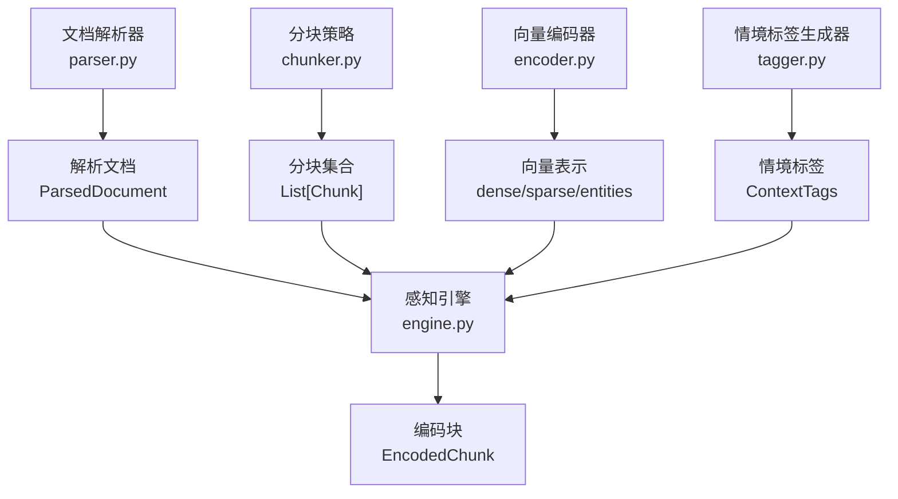
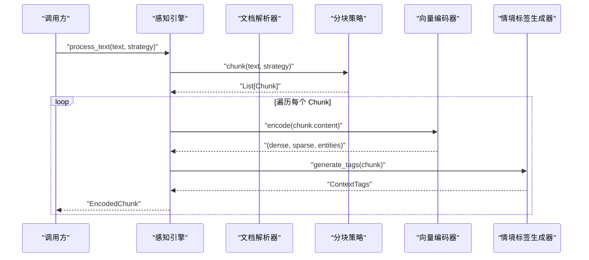
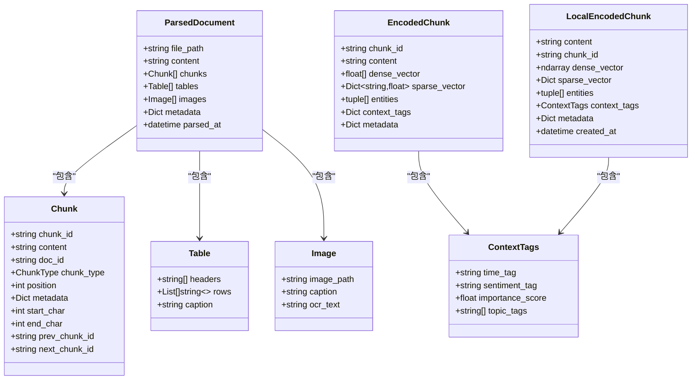
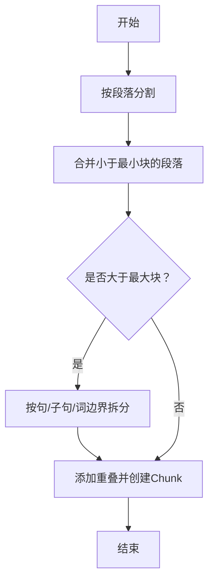
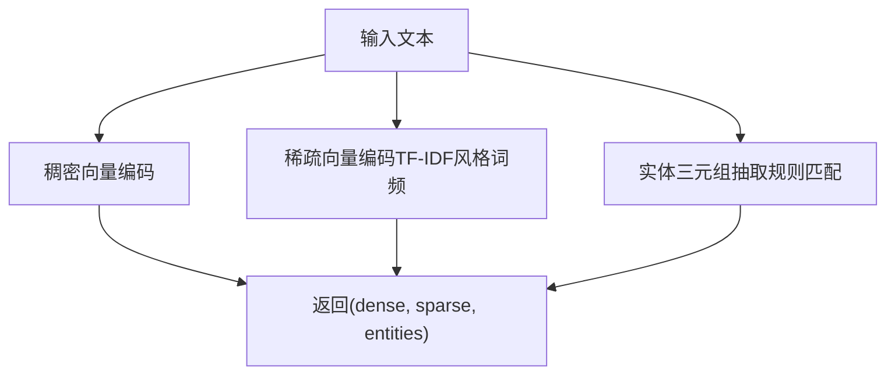
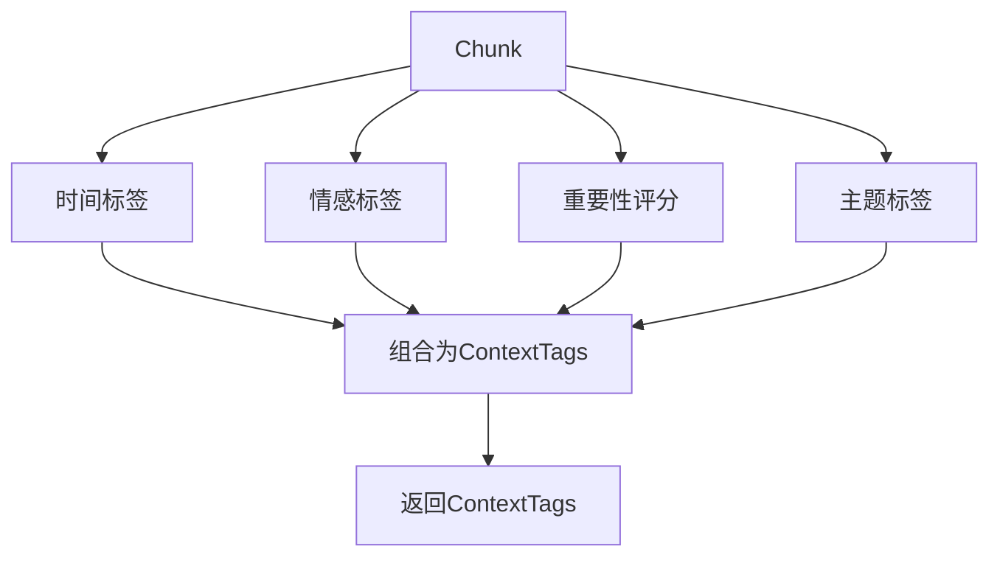
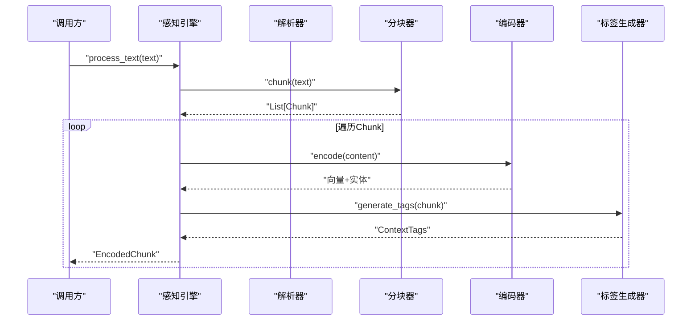
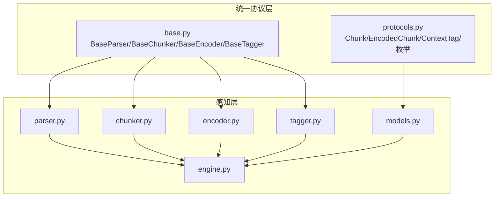

# 感知模型数据结构

<cite>
**本文引用的文件**
- [src/perception/models.py](file://src/perception/models.py)
- [src/perception/engine.py](file://src/perception/engine.py)
- [src/perception/chunker.py](file://src/perception/chunker.py)
- [src/perception/parser.py](file://src/perception/parser.py)
- [src/perception/encoder.py](file://src/perception/encoder.py)
- [src/perception/tagger.py](file://src/perception/tagger.py)
- [src/core/protocols.py](file://src/core/protocols.py)
- [src/core/base.py](file://src/core/base.py)
- [tests/test_perception/test_chunker.py](file://tests/test_perception/test_chunker.py)
- [example/example_usage.py](file://example/example_usage.py)
</cite>

## 目录
1. [引言](#引言)
2. [项目结构](#项目结构)
3. [核心组件](#核心组件)
4. [架构总览](#架构总览)
5. [详细组件分析](#详细组件分析)
6. [依赖分析](#依赖分析)
7. [性能考量](#性能考量)
8. [故障排查指南](#故障排查指南)
9. [结论](#结论)
10. [附录](#附录)

## 引言
本文件聚焦感知引擎的数据模型，系统阐述 ParsedDocument、Chunk、EncodedChunk 等核心数据结构的设计、字段语义、使用场景与转换流程。文档还涵盖数据验证规则、完整性检查机制、序列化与反序列化方法建议，并给出数据流转示例与最佳实践，帮助读者在现有架构基础上扩展与定制感知层数据模型。

## 项目结构
感知引擎位于 src/perception 目录，围绕“解析-分块-编码-打标-生成编码块”的流水线组织模块：
- parser：文档解析，产出统一结构的 ParsedDocument
- chunker：文本分块策略，产出统一结构的 Chunk
- encoder：向量编码，生成稠密/稀疏向量与实体三元组
- tagger：情境标签生成，产出上下文标签
- engine：编排入口，串联解析、分块、编码、打标，产出 EncodedChunk

图表来源
- [src/perception/parser.py:28-60](file://src/perception/parser.py#L28-L60)
- [src/perception/chunker.py:49-85](file://src/perception/chunker.py#L49-L85)
- [src/perception/encoder.py:73-87](file://src/perception/encoder.py#L73-L87)
- [src/perception/tagger.py:33-48](file://src/perception/tagger.py#L33-L48)
- [src/perception/engine.py:96-138](file://src/perception/engine.py#L96-L138)

章节来源
- [src/perception/parser.py:12-60](file://src/perception/parser.py#L12-L60)
- [src/perception/chunker.py:12-85](file://src/perception/chunker.py#L12-L85)
- [src/perception/encoder.py:25-87](file://src/perception/encoder.py#L25-L87)
- [src/perception/tagger.py:11-66](file://src/perception/tagger.py#L11-L66)
- [src/perception/engine.py:20-138](file://src/perception/engine.py#L20-L138)

## 核心组件
本节对关键数据结构进行逐项说明，包括字段含义、数据类型、典型取值范围与使用场景。

- ParsedDocument（解析后的文档）
  - file_path: 字符串，原始文件路径
  - content: 字符串，文档内容
  - chunks: 列表，元素为统一协议中的 Chunk
  - tables: 列表，元素为 Table（当前最小实现为空）
  - images: 列表，元素为 Image（当前最小实现为空）
  - metadata: 字典，键值对形式的元数据
  - parsed_at: 时间戳，解析完成时间
  - 使用场景：作为感知流水线的中间产物，承载解析得到的文本块与多媒体信息，供后续分块与编码使用

- Chunk（统一分块）
  - chunk_id: 字符串，唯一标识
  - content: 字符串，块内容
  - doc_id: 字符串（可选），所属文档标识
  - chunk_type: 枚举（FIXED/SEMANTIC/STRUCTURAL/ELASTIC/SENTENCE）
  - position: 整数，块在文档中的顺序位置
  - metadata: 字典，策略与边界信息等
  - start_char/end_char: 整数（可选），块在原文中的起止字符位置
  - prev_chunk_id/next_chunk_id: 字符串（可选），前后块标识
  - 使用场景：作为编码器输入的基本单元，携带位置与策略元信息

- EncodedChunk（编码后的分块）
  - chunk_id: 字符串，唯一标识
  - content: 字符串，块内容
  - dense_vector: 数值数组，稠密向量
  - sparse_vector: 映射，键为词项，值为权重
  - entities: 三元组列表，主体-关系-客体
  - context_tags: 字典，情境标签（时间、情感、重要性、主题等）
  - metadata: 字典，来源、索引等附加信息
  - 使用场景：作为检索与记忆层的统一载体，包含多模态表示与上下文标签

- ContextTags（情境标签，模块特有）
  - time_tag: 字符串（可选），时间标签
  - sentiment_tag: 字符串（可选），情感标签
  - importance_score: 浮点数，0-1 重要性评分
  - topic_tags: 字符串列表，主题标签
  - 使用场景：为 Chunk 提供时间、情感、重要性与主题等上下文信息

- LocalEncodedChunk（模块特有编码块，使用 numpy）
  - content: 字符串
  - chunk_id: 字符串
  - dense_vector: 数组，稠密向量
  - sparse_vector: 映射，键为词项，值为权重
  - entities: 三元组列表
  - context_tags: ContextTags
  - metadata: 字典
  - created_at: 时间戳
  - 使用场景：模块内部使用，便于与 numpy 向量库集成

- Table（表格数据）
  - headers: 字符串列表
  - rows: 二维字符串列表
  - caption: 字符串（可选）
  - 使用场景：解析阶段抽取表格，当前最小实现返回空列表

- Image（图片数据）
  - image_path: 字符串
  - caption: 字符串（可选）
  - ocr_text: 字符串（可选）
  - 使用场景：解析阶段抽取图片，当前最小实现返回空列表

章节来源
- [src/perception/models.py:53-62](file://src/perception/models.py#L53-L62)
- [src/core/protocols.py:101-117](file://src/core/protocols.py#L101-L117)
- [src/core/protocols.py:147-156](file://src/core/protocols.py#L147-L156)
- [src/perception/models.py:14-34](file://src/perception/models.py#L14-L34)
- [src/perception/models.py:37-50](file://src/perception/models.py#L37-L50)

## 架构总览
感知引擎以“解析-分块-编码-打标”为主线，统一数据结构贯穿各阶段，确保模块间数据交换的一致性与可替换性。

图表来源
- [src/perception/engine.py:156-194](file://src/perception/engine.py#L156-L194)
- [src/perception/chunker.py:49-85](file://src/perception/chunker.py#L49-L85)
- [src/perception/encoder.py:73-87](file://src/perception/encoder.py#L73-L87)
- [src/perception/tagger.py:33-48](file://src/perception/tagger.py#L33-L48)

## 详细组件分析

### 数据结构类图

图表来源
- [src/perception/models.py:53-62](file://src/perception/models.py#L53-L62)
- [src/core/protocols.py:101-117](file://src/core/protocols.py#L101-L117)
- [src/core/protocols.py:147-156](file://src/core/protocols.py#L147-L156)
- [src/perception/models.py:14-34](file://src/perception/models.py#L14-L34)
- [src/perception/models.py:37-50](file://src/perception/models.py#L37-L50)

章节来源
- [src/perception/models.py:14-62](file://src/perception/models.py#L14-L62)
- [src/core/protocols.py:101-156](file://src/core/protocols.py#L101-L156)

### 分块策略与边界检测流程
弹性分块的核心流程包括：按段落分割、合并小块、拆分大块、添加重叠并创建 Chunk 对象。该流程确保块大小在合理范围内，同时尽量保持语义完整性。

图表来源
- [src/perception/chunker.py:89-141](file://src/perception/chunker.py#L89-L141)
- [src/perception/chunker.py:381-433](file://src/perception/chunker.py#L381-L433)
- [src/perception/chunker.py:502-538](file://src/perception/chunker.py#L502-L538)

章节来源
- [src/perception/chunker.py:89-141](file://src/perception/chunker.py#L89-L141)
- [src/perception/chunker.py:381-433](file://src/perception/chunker.py#L381-L433)
- [src/perception/chunker.py:502-538](file://src/perception/chunker.py#L502-L538)

### 编码器与实体抽取
编码器支持稠密向量、稀疏向量与实体三元组的生成，具备批量编码能力与内置回退实现。实体抽取采用简单规则匹配，可扩展为基于 LLM 的增强抽取。

图表来源
- [src/perception/encoder.py:73-87](file://src/perception/encoder.py#L73-L87)
- [src/perception/encoder.py:106-119](file://src/perception/encoder.py#L106-L119)
- [src/perception/encoder.py:149-190](file://src/perception/encoder.py#L149-L190)

章节来源
- [src/perception/encoder.py:73-190](file://src/perception/encoder.py#L73-L190)

### 情境标签生成
情境标签生成器为每个 Chunk 生成时间、情感、重要性与主题标签，当前实现为最小可用版本，后续可接入情感分析模型与主题分类模型。

图表来源
- [src/perception/tagger.py:33-48](file://src/perception/tagger.py#L33-L48)
- [src/perception/tagger.py:68-111](file://src/perception/tagger.py#L68-L111)
- [src/perception/tagger.py:140-162](file://src/perception/tagger.py#L140-L162)

章节来源
- [src/perception/tagger.py:33-162](file://src/perception/tagger.py#L33-L162)

### 数据模型转换与传递流程
感知引擎的统一编排将解析、分块、编码与打标串联起来，形成从原始文本到 EncodedChunk 的完整数据流。

图表来源
- [src/perception/engine.py:156-194](file://src/perception/engine.py#L156-L194)
- [src/perception/engine.py:96-138](file://src/perception/engine.py#L96-L138)

章节来源
- [src/perception/engine.py:96-194](file://src/perception/engine.py#L96-L194)

## 依赖分析
- 统一协议层提供核心数据结构与枚举，确保模块间契约一致
- 感知层模块通过抽象基类实现可替换性与可测试性
- 感知引擎作为编排器，依赖解析器、分块器、编码器与标签生成器

图表来源
- [src/core/protocols.py:101-156](file://src/core/protocols.py#L101-L156)
- [src/core/base.py:32-160](file://src/core/base.py#L32-L160)
- [src/perception/parser.py:12-60](file://src/perception/parser.py#L12-L60)
- [src/perception/chunker.py:12-85](file://src/perception/chunker.py#L12-L85)
- [src/perception/encoder.py:25-87](file://src/perception/encoder.py#L25-L87)
- [src/perception/tagger.py:11-66](file://src/perception/tagger.py#L11-L66)
- [src/perception/engine.py:20-138](file://src/perception/engine.py#L20-L138)
- [src/perception/models.py:14-62](file://src/perception/models.py#L14-L62)

章节来源
- [src/core/protocols.py:101-156](file://src/core/protocols.py#L101-L156)
- [src/core/base.py:32-160](file://src/core/base.py#L32-L160)
- [src/perception/engine.py:20-138](file://src/perception/engine.py#L20-L138)

## 性能考量
- 分块策略
  - 弹性分块通过合并小段与拆分大段控制块大小，减少碎片化与越界风险
  - 重叠策略提升上下文连续性，有利于检索与下游任务
- 编码器
  - 支持批量编码以降低调用开销
  - 内置回退实现确保在缺少外部 LLM 客户端时仍可运行
- 标签生成
  - 当前实现为最小可用版本，建议在生产环境引入情感分析与主题分类模型，以提高标签质量

[本节为通用性能讨论，无需列出具体文件来源]

## 故障排查指南
- 输入验证与完整性检查
  - 分块器对空文本与极值输入具备健壮性，测试覆盖了空文本、单字符、仅空白字符、超长文本等边界情况
  - 若出现分块异常，优先检查分块策略参数（最小/目标/最大块大小）与语义边界优先级
- 编码异常
  - 若向量维度不匹配或为空，检查编码器初始化参数与 LLM 客户端配置
  - 批量编码时注意内存占用与超时设置
- 标签异常
  - 情感与重要性标签当前为规则/启发式实现，若业务对准确性要求较高，需接入专用模型
- 日志与调试
  - 引擎与解析器均包含日志记录，便于定位问题

章节来源
- [tests/test_perception/test_chunker.py:323-387](file://tests/test_perception/test_chunker.py#L323-L387)
- [tests/test_perception/test_chunker.py:492-532](file://tests/test_perception/test_chunker.py#L492-L532)
- [src/perception/engine.py:87-94](file://src/perception/engine.py#L87-L94)
- [src/perception/parser.py:42-44](file://src/perception/parser.py#L42-L44)

## 结论
感知引擎通过统一的数据模型与清晰的模块职责，实现了从原始文档到编码块的高效转换。ParsedDocument、Chunk、EncodedChunk 等核心结构在解析、分块、编码与打标环节中发挥关键作用。建议在生产环境中结合业务需求扩展标签生成与实体抽取能力，并通过配置化参数优化分块策略与编码性能。

[本节为总结性内容，无需列出具体文件来源]

## 附录

### 数据模型序列化与反序列化方法
- 统一序列化方案
  - 使用 dataclass 的字段字典化与枚举值化，便于 JSON 序列化与持久化
  - 建议在需要时为 EncodedChunk、ParsedDocument 等结构提供 to_dict/from_dict 方法，以支持跨模块传输与缓存
- 参考实现
  - 配置类 BaseConfig 提供 to_dict/from_dict 与文件读写方法，可作为数据模型序列化的模板

章节来源
- [src/core/config.py:49-76](file://src/core/config.py#L49-L76)

### 数据流转示例与最佳实践
- 示例流程
  - 使用感知引擎处理文本，生成 EncodedChunk 列表，随后可进入记忆与检索流程
- 最佳实践
  - 明确分块策略：根据文档类型与下游检索效果选择弹性/语义/固定等策略
  - 控制块大小：结合业务阈值设置最小/目标/最大块大小，避免过大或过小
  - 保留位置信息：利用 start_char/end_char 与 position，便于溯源与可视化
  - 扩展标签：逐步引入情感分析与主题分类模型，提升情境标签质量
  - 批量编码：在大规模数据处理时使用批量编码接口，提升吞吐

章节来源
- [example/example_usage.py:12-47](file://example/example_usage.py#L12-L47)
- [src/perception/engine.py:156-194](file://src/perception/engine.py#L156-L194)