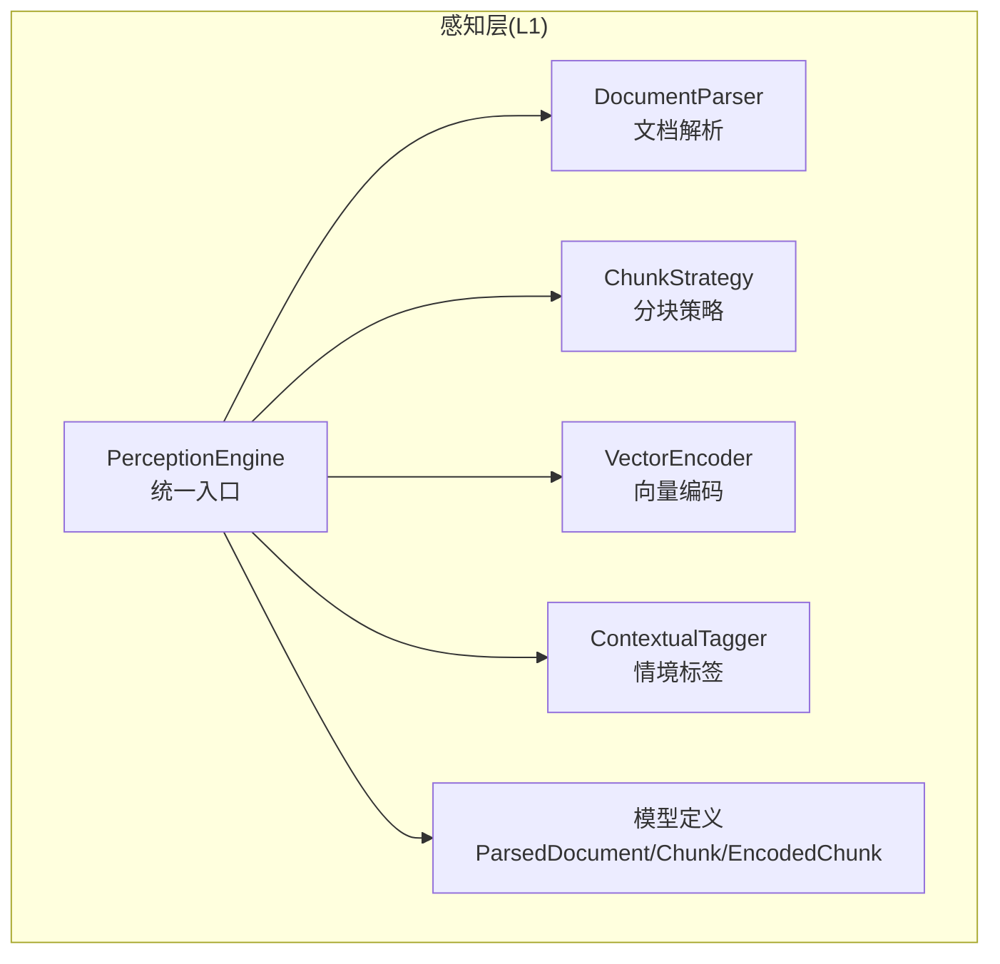
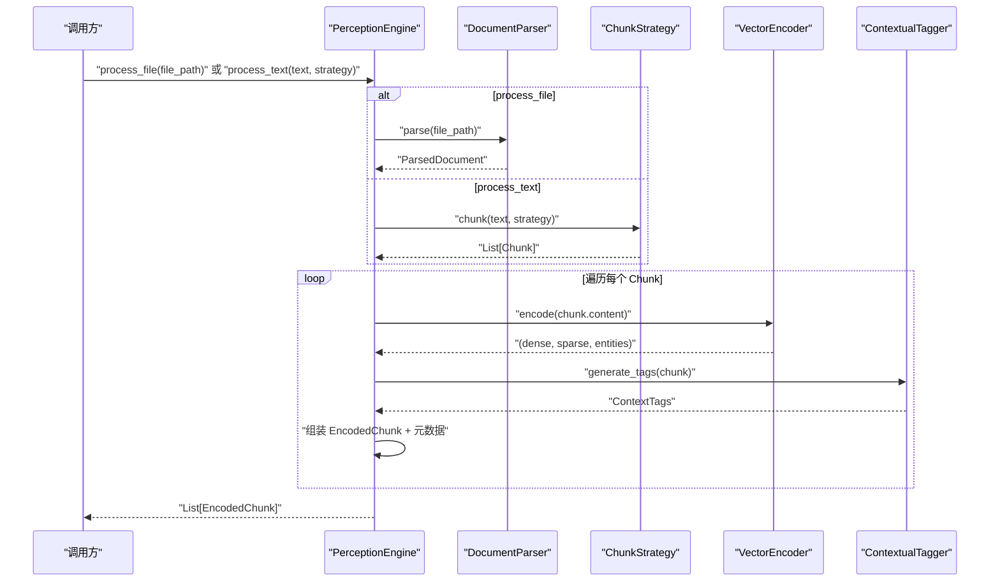
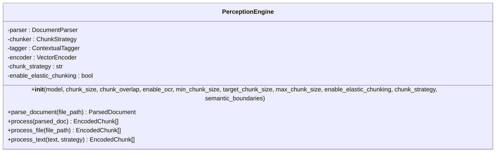
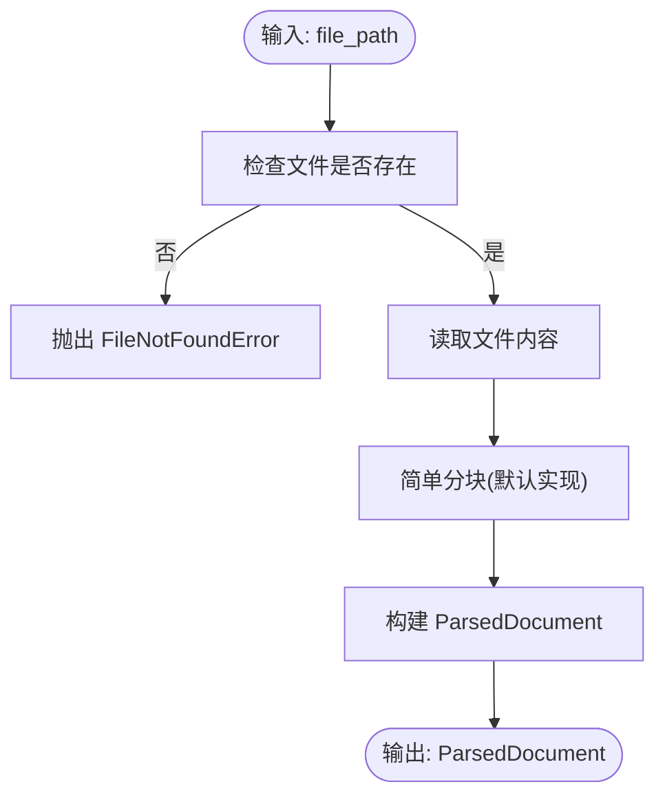
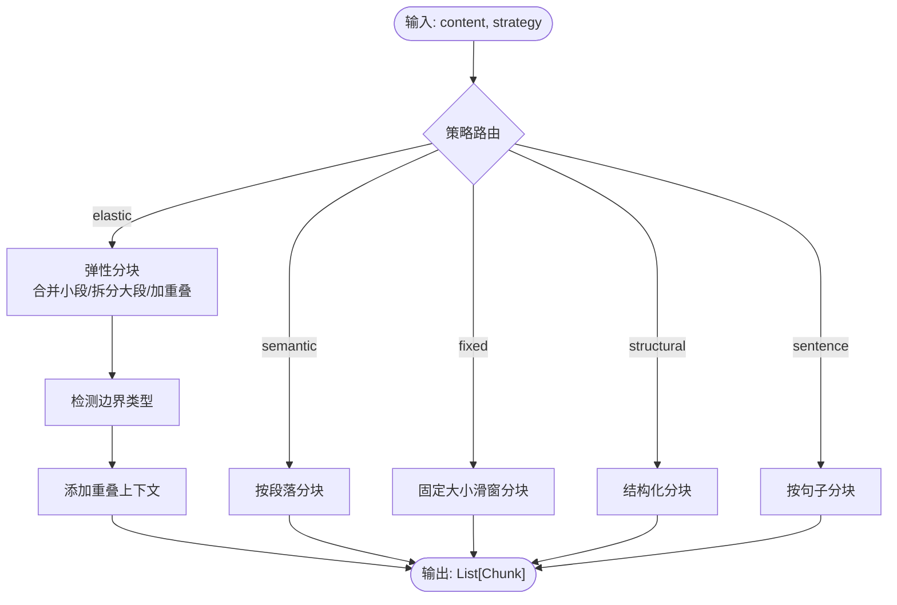
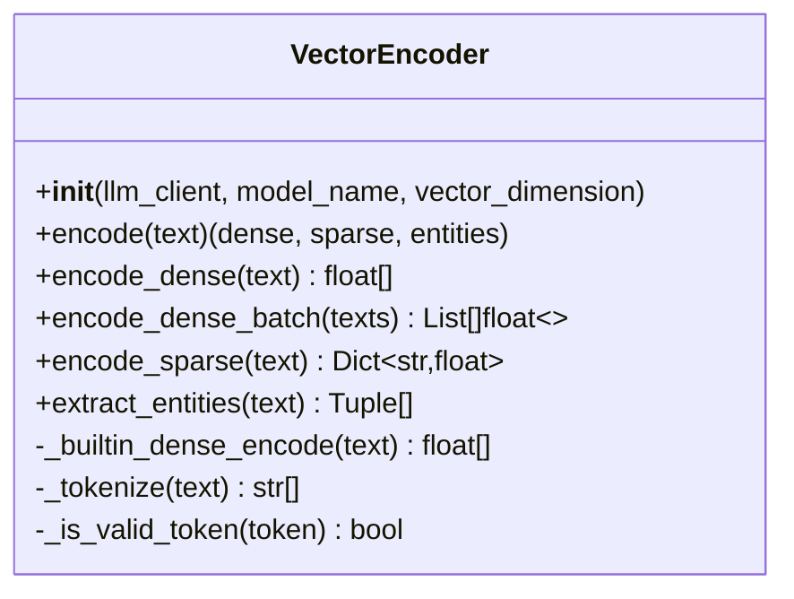
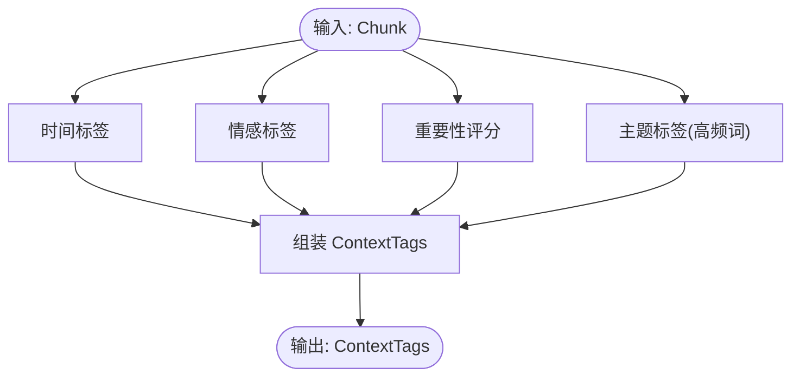
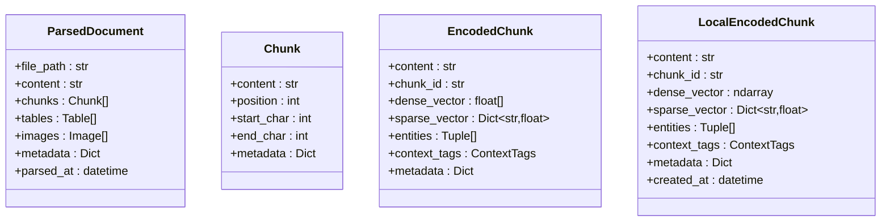
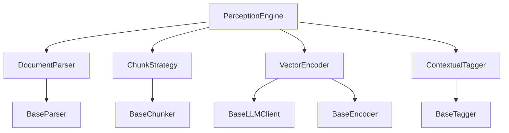

# 感知流程集成

<cite>
**本文引用的文件**
- [src/perception/__init__.py](file://src/perception/__init__.py)
- [src/perception/engine.py](file://src/perception/engine.py)
- [src/perception/chunker.py](file://src/perception/chunker.py)
- [src/perception/encoder.py](file://src/perception/encoder.py)
- [src/perception/parser.py](file://src/perception/parser.py)
- [src/perception/tagger.py](file://src/perception/tagger.py)
- [src/perception/models.py](file://src/perception/models.py)
- [src/core/base.py](file://src/core/base.py)
- [src/necorag.py](file://src/necorag.py)
- [src/core/config.py](file://src/core/config.py)
- [example/example_usage.py](file://example/example_usage.py)
- [tests/test_perception/test_chunker.py](file://tests/test_perception/test_chunker.py)
- [tests/test_integration/test_necorag.py](file://tests/test_integration/test_necorag.py)
</cite>

## 目录
1. [简介](#简介)
2. [项目结构](#项目结构)
3. [核心组件](#核心组件)
4. [架构总览](#架构总览)
5. [详细组件分析](#详细组件分析)
6. [依赖关系分析](#依赖关系分析)
7. [性能考量](#性能考量)
8. [故障排除指南](#故障排除指南)
9. [结论](#结论)
10. [附录](#附录)

## 简介
本文件面向“感知引擎”的整体流程，系统化阐述从文档输入到编码输出的完整处理链路，涵盖统一入口函数的设计思路、错误处理策略、性能监控方法、弹性切割配置、多策略切换与批量处理优化，并提供使用示例、配置参数说明与性能调优建议，帮助开发者正确使用与扩展感知引擎功能。

## 项目结构
感知引擎位于感知层（L1），主要由以下模块组成：
- 统一入口：PerceptionEngine
- 文档解析：DocumentParser
- 分块策略：ChunkStrategy（支持弹性/语义/固定/结构/句子）
- 向量编码：VectorEncoder（稠密/稀疏/实体）
- 情境标签：ContextualTagger
- 数据模型：ParsedDocument、Chunk、EncodedChunk、LocalEncodedChunk 等

图表来源
- [src/perception/engine.py:20-195](file://src/perception/engine.py#L20-L195)
- [src/perception/parser.py:12-113](file://src/perception/parser.py#L12-L113)
- [src/perception/chunker.py:12-567](file://src/perception/chunker.py#L12-L567)
- [src/perception/encoder.py:25-255](file://src/perception/encoder.py#L25-L255)
- [src/perception/tagger.py:11-163](file://src/perception/tagger.py#L11-L163)
- [src/perception/models.py:14-62](file://src/perception/models.py#L14-L62)

章节来源
- [src/perception/__init__.py:6-26](file://src/perception/__init__.py#L6-L26)

## 核心组件
- PerceptionEngine：统一入口，协调解析、分块、编码、打标与元数据组装，提供一站式处理接口。
- DocumentParser：将多格式文档解析为统一结构化表示。
- ChunkStrategy：统一分块入口，支持多种策略（弹性/语义/固定/结构/句子），并具备边界检测与重叠策略。
- VectorEncoder：生成稠密向量、稀疏向量与实体三元组，支持依赖注入 LLM 客户端或内置实现。
- ContextualTagger：为每个 Chunk 生成时间、情感、重要性、主题等情境标签。
- 模型定义：统一的数据结构，便于跨层传递与持久化。

章节来源
- [src/perception/engine.py:20-195](file://src/perception/engine.py#L20-L195)
- [src/perception/parser.py:12-113](file://src/perception/parser.py#L12-L113)
- [src/perception/chunker.py:12-567](file://src/perception/chunker.py#L12-L567)
- [src/perception/encoder.py:25-255](file://src/perception/encoder.py#L25-L255)
- [src/perception/tagger.py:11-163](file://src/perception/tagger.py#L11-L163)
- [src/perception/models.py:14-62](file://src/perception/models.py#L14-L62)

## 架构总览
感知引擎采用“统一入口 + 多组件协作”的流水线式架构，支持从文件到编码输出的端到端处理，并提供多策略分块与弹性切割能力。

图表来源
- [src/perception/engine.py:96-154](file://src/perception/engine.py#L96-L154)
- [src/perception/parser.py:28-60](file://src/perception/parser.py#L28-L60)
- [src/perception/chunker.py:49-85](file://src/perception/chunker.py#L49-L85)
- [src/perception/encoder.py:73-87](file://src/perception/encoder.py#L73-L87)
- [src/perception/tagger.py:33-48](file://src/perception/tagger.py#L33-L48)

## 详细组件分析

### 统一入口：PerceptionEngine
- 设计要点
  - 协调解析、分块、编码、打标与元数据组装，提供多入口：process_file、process_text、process。
  - 支持默认策略与显式策略切换，便于弹性切割与多策略对比。
  - 内置性能计时与日志记录，便于监控与诊断。
- 错误处理
  - 解析阶段捕获异常并向上抛出，保留原始异常信息与堆栈。
  - 分块与编码阶段通过日志记录失败细节，便于定位问题。
- 性能监控
  - 使用时间戳统计处理耗时，记录块数量与耗时，便于性能分析。

图表来源
- [src/perception/engine.py:20-76](file://src/perception/engine.py#L20-L76)
- [src/perception/engine.py:77-154](file://src/perception/engine.py#L77-L154)
- [src/perception/engine.py:156-194](file://src/perception/engine.py#L156-L194)

章节来源
- [src/perception/engine.py:20-195](file://src/perception/engine.py#L20-L195)

### 文档解析：DocumentParser
- 功能
  - 读取文本文件，进行简单分块（默认实现），并返回 ParsedDocument。
  - 预留表格与图片提取接口，便于后续扩展。
- 错误处理
  - 文件不存在时抛出 FileNotFoundError。
- 扩展性
  - 可通过继承 BaseParser 或替换实现，接入 RAGFlow 等深度解析工具。

图表来源
- [src/perception/parser.py:28-60](file://src/perception/parser.py#L28-L60)
- [src/perception/parser.py:92-112](file://src/perception/parser.py#L92-L112)

章节来源
- [src/perception/parser.py:12-113](file://src/perception/parser.py#L12-L113)

### 分块策略：ChunkStrategy
- 统一入口
  - chunk(content, strategy)：根据策略路由到具体实现。
- 支持策略
  - elastic：弹性分块（智能合并/拆分，控制 min/target/max，添加重叠）。
  - semantic：按段落语义分块。
  - fixed：固定大小滑窗分块。
  - structural：结构化分块（基于段落/标题）。
  - sentence：按句子分块（中英文标点识别）。
- 边界检测与重叠
  - _detect_boundary_type：检测段落/句子/子句/强制切割。
  - _add_overlap：在相邻块间添加重叠上下文。
- 边界查找
  - _find_last_sentence_boundary/_find_last_clause_boundary/_find_last_word_boundary：优先按语义边界切割，最后强制在词边界切割。

图表来源
- [src/perception/chunker.py:49-85](file://src/perception/chunker.py#L49-L85)
- [src/perception/chunker.py:89-141](file://src/perception/chunker.py#L89-L141)
- [src/perception/chunker.py:185-216](file://src/perception/chunker.py#L185-L216)
- [src/perception/chunker.py:218-248](file://src/perception/chunker.py#L218-L248)
- [src/perception/chunker.py:250-265](file://src/perception/chunker.py#L250-L265)
- [src/perception/chunker.py:268-538](file://src/perception/chunker.py#L268-L538)

章节来源
- [src/perception/chunker.py:12-567](file://src/perception/chunker.py#L12-L567)

### 向量编码：VectorEncoder
- 多类型向量
  - encode_dense：稠密向量（优先 LLM 客户端，回退内置实现）。
  - encode_sparse：稀疏向量（TF-IDF 风格词频归一化）。
  - extract_entities：实体三元组（基于规则提取）。
- 批量优化
  - encode_batch：优先使用 LLM 客户端批量接口，否则逐个编码。
- 依赖注入
  - 可注入 BaseLLMClient，便于替换不同向量化实现。

图表来源
- [src/perception/encoder.py:25-87](file://src/perception/encoder.py#L25-L87)
- [src/perception/encoder.py:89-119](file://src/perception/encoder.py#L89-L119)
- [src/perception/encoder.py:121-147](file://src/perception/encoder.py#L121-L147)
- [src/perception/encoder.py:149-190](file://src/perception/encoder.py#L149-L190)
- [src/perception/encoder.py:192-213](file://src/perception/encoder.py#L192-L213)
- [src/perception/encoder.py:215-255](file://src/perception/encoder.py#L215-L255)

章节来源
- [src/perception/encoder.py:25-255](file://src/perception/encoder.py#L25-L255)

### 情境标签：ContextualTagger
- 标签生成
  - generate_time_tag：基于元数据生成时间标签（占位实现，预留扩展）。
  - generate_sentiment_tag：基于关键词检测情感（正/负/中）。
  - generate_importance_tag：基于信息密度与长度计算重要性评分。
  - generate_topic_tags：提取高频词作为主题标签。
- 接口
  - tag(chunk)：返回字典形式的标签集合，便于序列化与传输。

图表来源
- [src/perception/tagger.py:33-48](file://src/perception/tagger.py#L33-L48)
- [src/perception/tagger.py:68-83](file://src/perception/tagger.py#L68-L83)
- [src/perception/tagger.py:85-111](file://src/perception/tagger.py#L85-L111)
- [src/perception/tagger.py:113-138](file://src/perception/tagger.py#L113-L138)
- [src/perception/tagger.py:140-162](file://src/perception/tagger.py#L140-L162)

章节来源
- [src/perception/tagger.py:11-163](file://src/perception/tagger.py#L11-L163)

### 数据模型：ParsedDocument、Chunk、EncodedChunk、LocalEncodedChunk
- ParsedDocument：解析后的文档，包含内容、分块、表格、图片与元数据。
- Chunk：分块对象，包含内容、位置、字符范围与元数据。
- EncodedChunk：编码后的块，包含稠密/稀疏向量、实体三元组、情境标签与元数据。
- LocalEncodedChunk：模块特有版本，使用 np.ndarray 存储稠密向量。

图表来源
- [src/perception/models.py:53-62](file://src/perception/models.py#L53-L62)
- [src/perception/models.py:14-33](file://src/perception/models.py#L14-L33)

章节来源
- [src/perception/models.py:14-62](file://src/perception/models.py#L14-L62)

## 依赖关系分析
- 组件耦合
  - PerceptionEngine 依赖解析、分块、编码、打标四个子组件，职责清晰，耦合度低。
  - VectorEncoder 可注入 BaseLLMClient，便于替换实现，降低对外部服务的耦合。
- 统一协议
  - 所有组件均遵循 core.base 中的抽象基类，确保实现的一致性与可替换性。
- 外部依赖
  - 向量化依赖 LLM 客户端（Mock 或外部实现）。
  - numpy 为可选依赖，若缺失则使用纯 Python 实现。

图表来源
- [src/perception/engine.py:9-13](file://src/perception/engine.py#L9-L13)
- [src/perception/encoder.py:18-22](file://src/perception/encoder.py#L18-L22)
- [src/core/base.py:32-160](file://src/core/base.py#L32-L160)

章节来源
- [src/core/base.py:32-160](file://src/core/base.py#L32-L160)

## 性能考量
- 分块策略
  - 弹性分块通过合并小段与拆分大段，平衡块大小与语义完整性，减少碎片化与越界风险。
  - 重叠策略提升检索连贯性，但增加编码与存储开销，需权衡。
- 向量编码
  - 优先使用 LLM 客户端的批量接口，显著提升吞吐。
  - 内置实现为确定性伪向量，适合离线或演示场景。
- 日志与监控
  - 统一入口记录处理耗时与块数量，便于性能分析与瓶颈定位。
- 批量处理优化
  - process_text/process_file 返回列表，便于后续批量化存储与检索。
  - VectorEncoder.encode_batch 提供批量编码能力。

章节来源
- [src/perception/chunker.py:502-538](file://src/perception/chunker.py#L502-L538)
- [src/perception/encoder.py:106-119](file://src/perception/encoder.py#L106-L119)
- [src/perception/engine.py:106-137](file://src/perception/engine.py#L106-L137)

## 故障排除指南
- 常见问题
  - 文件不存在：DocumentParser 抛出 FileNotFoundError，检查路径与权限。
  - 分块策略无效：确认策略名称在支持列表中，否则抛出 ValueError。
  - 向量维度不一致：确保 LLM 客户端与配置一致，或使用内置实现。
- 调试建议
  - 启用调试日志，观察解析、分块、编码、打标各阶段耗时。
  - 使用小样本数据验证流程，逐步扩大规模。
  - 对比不同分块策略的效果，结合业务需求选择最优方案。
- 单元测试参考
  - 分块策略测试覆盖弹性/语义/固定/句子/结构等策略与边界情况。
  - 集成测试覆盖 NecoRAG 主流程，包括导入、查询、意图分析、知识演化与自适应学习。

章节来源
- [tests/test_perception/test_chunker.py:131-138](file://tests/test_perception/test_chunker.py#L131-L138)
- [tests/test_integration/test_necorag.py:161-166](file://tests/test_integration/test_necorag.py#L161-L166)

## 结论
感知引擎通过统一入口与模块化设计，实现了从文档输入到编码输出的高效、可扩展处理流程。弹性分块与多策略切换满足多样化业务需求，情境标签与多类型向量增强检索与下游任务效果。配合完善的错误处理与性能监控，开发者可快速集成并持续优化感知层能力。

## 附录

### 使用示例
- 基础使用
  - 使用 PerceptionEngine.process_text 或 process_file 完成一站式处理。
  - 参考示例工程中的完整工作流演示。
- 集成示例
  - NecoRAG 主类封装了感知层、记忆层、检索层、巩固层与交互层，提供端到端查询与导入能力。

章节来源
- [example/example_usage.py:12-47](file://example/example_usage.py#L12-L47)
- [src/necorag.py:201-275](file://src/necorag.py#L201-L275)

### 配置参数说明
- 感知层配置（PerceptionConfig）
  - chunk_size、chunk_overlap、chunk_strategy
  - min_chunk_size、target_chunk_size、max_chunk_size、enable_elastic_chunking、semantic_boundaries
  - enable_time_tag、enable_emotion_tag、enable_importance_tag、enable_topic_tag
  - supported_formats
- 全局配置（NecoRAGConfig）
  - llm、memory、retrieval、refinement、response、domain_weight、knowledge_evolution
  - 支持从文件与环境变量加载配置，优先级：环境变量 > 配置文件 > 默认值

章节来源
- [src/core/config.py:105-132](file://src/core/config.py#L105-L132)
- [src/core/config.py:278-333](file://src/core/config.py#L278-L333)

### API 参考
- PerceptionEngine
  - process_file(file_path)：解析并编码文件
  - process_text(text, strategy)：按策略分块并编码文本
  - process(parsed_doc)：对已解析文档进行编码与打标
- ChunkStrategy
  - chunk(content, strategy)：统一分块入口
  - chunk_by_elastic/chunk_by_semantic/chunk_by_fixed_size/chunk_by_structure/chunk_by_sentence：具体策略
- VectorEncoder
  - encode/texts：编码文本/批量编码
  - encode_dense/encode_sparse/extract_entities：生成向量与实体
- ContextualTagger
  - generate_tags/tag：生成情境标签

章节来源
- [src/perception/engine.py:96-194](file://src/perception/engine.py#L96-L194)
- [src/perception/chunker.py:49-85](file://src/perception/chunker.py#L49-L85)
- [src/perception/encoder.py:73-190](file://src/perception/encoder.py#L73-L190)
- [src/perception/tagger.py:33-66](file://src/perception/tagger.py#L33-L66)

### 性能调优指南
- 分块策略
  - 根据文档特征调整 min/target/max_chunk_size，避免碎片化与越界。
  - 在长文档场景下启用弹性分块，提高检索连贯性。
- 向量编码
  - 优先使用 LLM 客户端批量接口，减少往返开销。
  - 在资源受限环境下使用内置实现，确保可用性。
- 日志与监控
  - 记录每阶段耗时与块数量，定位性能瓶颈。
  - 对比不同策略与模型的吞吐与质量，动态选择最优组合。

章节来源
- [src/perception/chunker.py:335-379](file://src/perception/chunker.py#L335-L379)
- [src/perception/chunker.py:381-433](file://src/perception/chunker.py#L381-L433)
- [src/perception/engine.py:106-137](file://src/perception/engine.py#L106-L137)