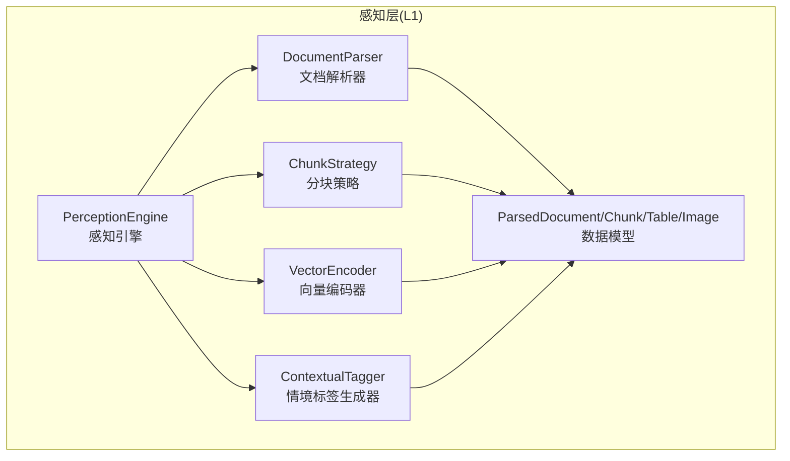
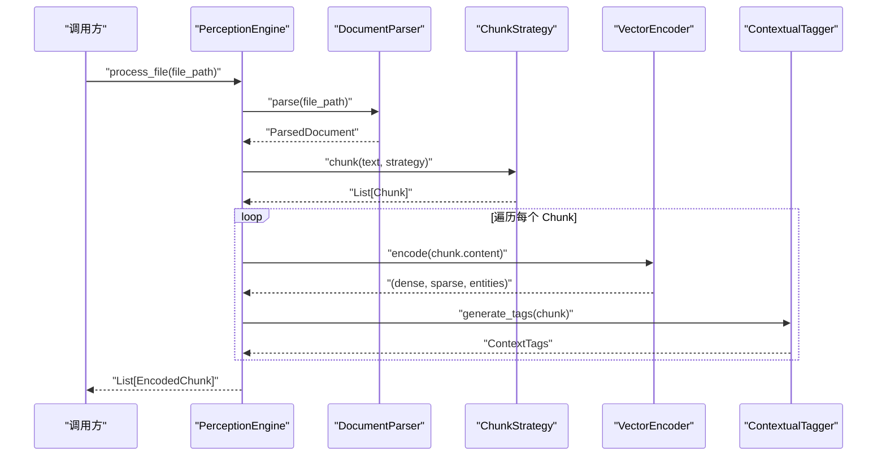
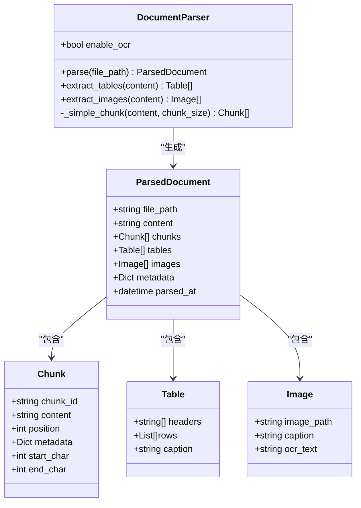
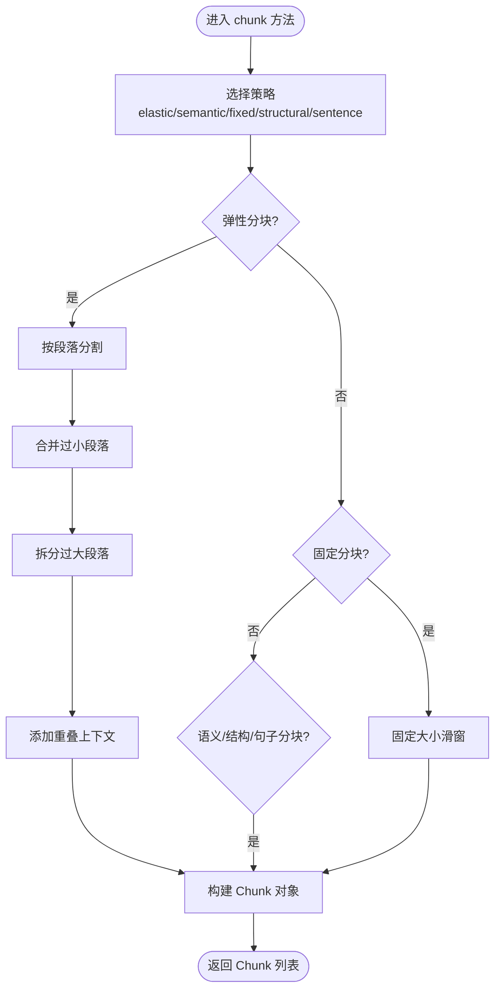
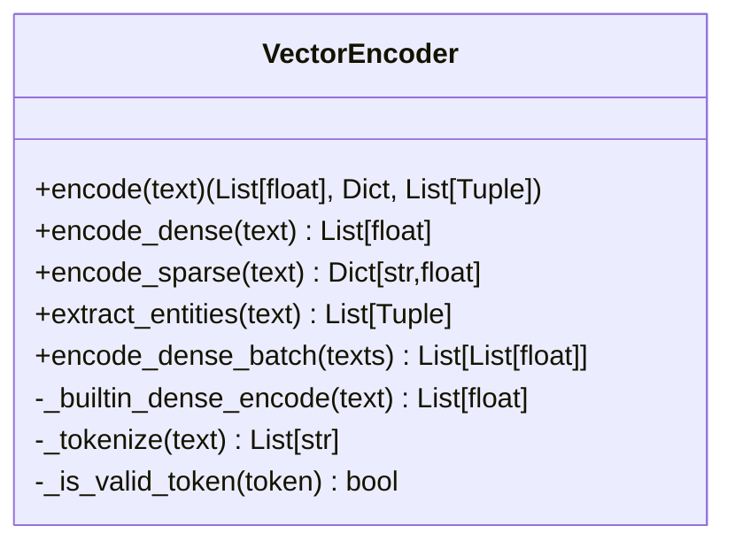
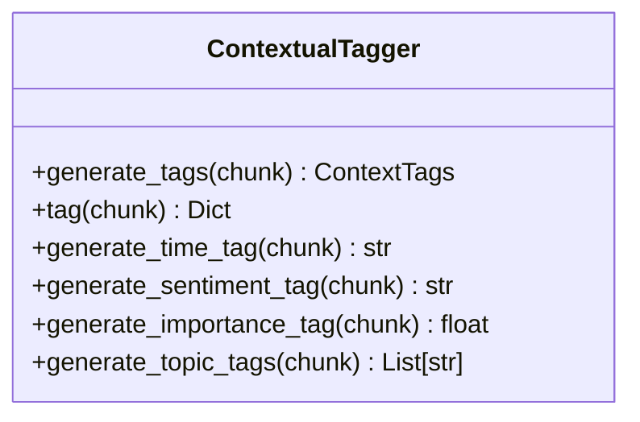
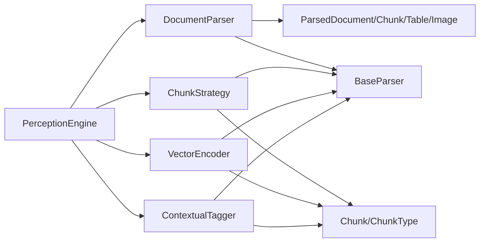

# 文档解析器

<cite>
**本文引用的文件**
- [src/perception/parser.py](file://src/perception/parser.py)
- [src/perception/models.py](file://src/perception/models.py)
- [src/perception/engine.py](file://src/perception/engine.py)
- [src/perception/chunker.py](file://src/perception/chunker.py)
- [src/perception/encoder.py](file://src/perception/encoder.py)
- [src/perception/tagger.py](file://src/perception/tagger.py)
- [src/core/base.py](file://src/core/base.py)
- [src/core/protocols.py](file://src/core/protocols.py)
- [src/perception/__init__.py](file://src/perception/__init__.py)
- [example/example_usage.py](file://example/example_usage.py)
- [wiki/wiki/核心架构设计/五层认知架构/感知层 (L1)/文档解析器.md](file://wiki/wiki/核心架构设计/五层认知架构/感知层 (L1)/文档解析器.md)
</cite>

## 目录
1. [简介](#简介)
2. [项目结构](#项目结构)
3. [核心组件](#核心组件)
4. [架构总览](#架构总览)
5. [详细组件分析](#详细组件分析)
6. [依赖分析](#依赖分析)
7. [性能考虑](#性能考虑)
8. [故障排除指南](#故障排除指南)
9. [结论](#结论)
10. [附录](#附录)

## 简介
本文件面向“文档解析器”模块，系统化阐述多格式文档解析流程、分块策略、向量化编码、情境标签生成以及感知引擎的整体编排。当前实现以“最小可用”为目标：支持文本文件读取与固定大小分块；表格与图片提取接口返回空列表，OCR 功能预留开关；后续可扩展为对 PDF、Word、Excel、图片等格式的统一解析与结构化输出。

## 项目结构
感知层（L1）围绕“感知引擎”组织，包含解析、分块、编码、打标四大子模块，配合统一的数据协议与抽象基类，形成可替换、可扩展的模块化架构。

**图表来源**
- [src/perception/engine.py:20-76](file://src/perception/engine.py#L20-L76)
- [src/perception/parser.py:12-112](file://src/perception/parser.py#L12-L112)
- [src/perception/chunker.py:12-86](file://src/perception/chunker.py#L12-L86)
- [src/perception/encoder.py:25-88](file://src/perception/encoder.py#L25-L88)
- [src/perception/tagger.py:11-66](file://src/perception/tagger.py#L11-L66)
- [src/perception/models.py:36-62](file://src/perception/models.py#L36-L62)

**章节来源**
- [src/perception/__init__.py:6-26](file://src/perception/__init__.py#L6-L26)
- [src/perception/engine.py:20-76](file://src/perception/engine.py#L20-L76)

## 核心组件
- 文档解析器（DocumentParser）
  - 负责将多种格式文档统一解析为 ParsedDocument，包含 content、chunks、metadata 等字段。
  - 当前实现为最小读取文本文件并按固定大小分块；表格与图片提取接口返回空列表，预留 OCR 开关。
  - 关键配置：enable_ocr（当前未生效，为预留位）。
- 分块策略（ChunkStrategy）
  - 支持弹性分块、语义分块、固定大小分块、结构化分块、句子级分块。
  - 提供重叠上下文、边界检测与强制切割等机制。
- 向量编码器（VectorEncoder）
  - 生成稠密向量、稀疏向量、实体三元组；支持依赖注入 LLM 客户端或内置实现。
- 情境标签生成器（ContextualTagger）
  - 为每个 Chunk 生成时间、情感、重要性、主题等标签。
- 统一数据模型（ParsedDocument/Chunk/Table/Image）
  - 与统一协议层（Chunk、EncodedChunk 等）协同，确保跨模块一致性。

**章节来源**
- [src/perception/parser.py:12-112](file://src/perception/parser.py#L12-L112)
- [src/perception/chunker.py:12-86](file://src/perception/chunker.py#L12-L86)
- [src/perception/encoder.py:25-88](file://src/perception/encoder.py#L25-L88)
- [src/perception/tagger.py:11-66](file://src/perception/tagger.py#L11-L66)
- [src/perception/models.py:36-62](file://src/perception/models.py#L36-L62)
- [src/core/protocols.py:101-117](file://src/core/protocols.py#L101-L117)

## 架构总览
感知引擎将解析、分块、编码、打标串联为一条流水线，提供 process_file 与 process_text 两种入口，统一异常处理与日志记录。

**图表来源**
- [src/perception/engine.py:77-154](file://src/perception/engine.py#L77-L154)
- [src/perception/parser.py:28-60](file://src/perception/parser.py#L28-L60)
- [src/perception/chunker.py:49-85](file://src/perception/chunker.py#L49-L85)
- [src/perception/encoder.py:73-87](file://src/perception/encoder.py#L73-L87)
- [src/perception/tagger.py:33-48](file://src/perception/tagger.py#L33-L48)

## 详细组件分析

### 文档解析器（DocumentParser）
- 职责
  - 将多种格式文档统一解析为 ParsedDocument，包含 content、chunks、metadata 等字段。
  - 当前实现为最小读取文本文件并按固定大小分块；表格与图片提取接口返回空列表，预留 OCR 开关。
- 关键配置
  - enable_ocr：是否启用 OCR（当前未生效，为预留位）。
- 输出数据结构
  - ParsedDocument：包含文件路径、原始文本、文本块列表、表格列表、图片列表、元数据与解析时间戳。

**图表来源**
- [src/perception/parser.py:12-112](file://src/perception/parser.py#L12-L112)
- [src/perception/models.py:52-61](file://src/perception/models.py#L52-L61)
- [src/core/protocols.py:101-117](file://src/core/protocols.py#L101-L117)

**章节来源**
- [src/perception/parser.py:12-112](file://src/perception/parser.py#L12-L112)
- [src/perception/models.py:36-61](file://src/perception/models.py#L36-L61)
- [wiki/wiki/核心架构设计/五层认知架构/感知层 (L1)/文档解析器.md:140-197](file://wiki/wiki/核心架构设计/五层认知架构/感知层 (L1)/文档解析器.md#L140-L197)

### 分块策略（ChunkStrategy）
- 支持策略
  - elastic：弹性分块（智能调整块大小）
  - semantic：语义分块（按段落）
  - fixed：固定大小分块
  - structural：结构化分块
  - sentence：句子级分块
- 关键参数
  - chunk_size、chunk_overlap、min_chunk_size、target_chunk_size、max_chunk_size、enable_elastic、semantic_boundaries
- 算法要点
  - 按段落合并小块、拆分超大块、添加重叠上下文、优先语义边界切割。

**图表来源**
- [src/perception/chunker.py:49-141](file://src/perception/chunker.py#L49-L141)
- [src/perception/chunker.py:209-265](file://src/perception/chunker.py#L209-L265)
- [src/perception/chunker.py:269-538](file://src/perception/chunker.py#L269-L538)

**章节来源**
- [src/perception/chunker.py:12-86](file://src/perception/chunker.py#L12-L86)
- [src/perception/chunker.py:89-141](file://src/perception/chunker.py#L89-L141)
- [src/perception/chunker.py:143-183](file://src/perception/chunker.py#L143-L183)
- [src/perception/chunker.py:209-265](file://src/perception/chunker.py#L209-L265)
- [src/perception/chunker.py:269-538](file://src/perception/chunker.py#L269-L538)

### 向量编码器（VectorEncoder）
- 功能
  - 生成稠密向量、稀疏向量、实体三元组。
  - 优先使用注入的 LLM 客户端，否则回退到内置实现。
- 关键能力
  - encode_dense/encode_sparse/extract_entities
  - 批量编码 encode_dense_batch
- 内置实现
  - 基于文本哈希的确定性伪向量生成，确保可复现。

**图表来源**
- [src/perception/encoder.py:25-88](file://src/perception/encoder.py#L25-L88)
- [src/perception/encoder.py:192-241](file://src/perception/encoder.py#L192-L241)

**章节来源**
- [src/perception/encoder.py:25-88](file://src/perception/encoder.py#L25-L88)
- [src/perception/encoder.py:192-241](file://src/perception/encoder.py#L192-L241)

### 情境标签生成器（ContextualTagger）
- 功能
  - 生成时间标签、情感标签、重要性评分、主题标签。
- 当前实现
  - 时间标签：基于元数据（预留时间实体识别）。
  - 情感标签：简单关键词检测（预留情感模型）。
  - 重要性评分：信息密度与长度因子综合（预留质量评分）。
  - 主题标签：高频词提取（预留主题分类）。

**图表来源**
- [src/perception/tagger.py:11-66](file://src/perception/tagger.py#L11-L66)

**章节来源**
- [src/perception/tagger.py:11-66](file://src/perception/tagger.py#L11-L66)

### 统一入口（PerceptionEngine）
- 职责
  - 组装解析、分块、编码、打标流程；提供 process_file 与 process_text 两种入口。
- 配置项
  - model、chunk_size、chunk_overlap、enable_ocr、min_chunk_size、target_chunk_size、max_chunk_size、enable_elastic_chunking、chunk_strategy、semantic_boundaries。
- 错误处理
  - 解析阶段捕获异常并记录日志。

**章节来源**
- [src/perception/engine.py:20-76](file://src/perception/engine.py#L20-L76)
- [src/perception/engine.py:77-94](file://src/perception/engine.py#L77-L94)
- [src/perception/engine.py:140-154](file://src/perception/engine.py#L140-L154)
- [src/perception/engine.py:156-194](file://src/perception/engine.py#L156-L194)

## 依赖分析
- 组件耦合
  - PerceptionEngine 依赖 DocumentParser、ChunkStrategy、VectorEncoder、ContextualTagger。
  - 各组件均实现对应的抽象基类，遵循 src/core/base.py 的统一接口。
- 数据契约
  - 统一数据模型与枚举由 src/core/protocols.py 定义，确保跨模块一致性。
- 外部依赖
  - 向量化可注入 LLM 客户端；若不可用则回退至内置实现。
  - numpy 为可选依赖，缺失时仍可运行。

**图表来源**
- [src/perception/engine.py:57-75](file://src/perception/engine.py#L57-L75)
- [src/core/base.py:32-64](file://src/core/base.py#L32-L64)
- [src/core/protocols.py:101-117](file://src/core/protocols.py#L101-L117)

**章节来源**
- [src/perception/engine.py:57-75](file://src/perception/engine.py#L57-L75)
- [src/core/base.py:32-64](file://src/core/base.py#L32-L64)
- [src/core/protocols.py:101-117](file://src/core/protocols.py#L101-L117)

## 性能考虑
- 分块策略
  - 弹性分块通过“合并小块、拆分大块、添加重叠”减少碎片化并提升语义完整性。
  - 句子级/语义分块适合长文档，固定大小分块适合批处理与可重现性要求高的场景。
- 向量化
  - 优先使用外部 LLM 客户端以获得高质量稠密向量；内置实现保证离线可用但性能与质量受限。
  - 批量编码 encode_dense_batch 可显著降低调用开销。
- 日志与异常
  - 解析阶段捕获异常并记录日志，便于定位问题与性能瓶颈。

[本节为通用性能建议，无需特定文件引用]

## 故障排除指南
- 文件不存在
  - 现象：抛出文件未找到异常。
  - 处理：确认文件路径存在且可读。
  - 参考：[src/perception/parser.py:42-43](file://src/perception/parser.py#L42-L43)
- 解析异常
  - 现象：解析阶段抛出异常并记录日志。
  - 处理：检查文件格式与编码；确认 enable_ocr 配置；逐步缩小到具体策略。
  - 参考：[src/perception/engine.py:88-94](file://src/perception/engine.py#L88-L94)
- 向量化失败
  - 现象：LLM 客户端不可用导致回退到内置实现。
  - 处理：安装并配置 LLM 客户端；或接受内置实现的确定性向量。
  - 参考：[src/perception/encoder.py:52-61](file://src/perception/encoder.py#L52-L61)
- 分块结果异常
  - 现象：分块过多或过少、边界切割不合理。
  - 处理：调整 chunk_size、chunk_overlap、min/target/max_chunk_size；切换策略（elastic/semantic/fixed/sentence/structural）。
  - 参考：[src/perception/chunker.py:19-47](file://src/perception/chunker.py#L19-L47)

**章节来源**
- [src/perception/parser.py:42-43](file://src/perception/parser.py#L42-L43)
- [src/perception/engine.py:88-94](file://src/perception/engine.py#L88-L94)
- [src/perception/encoder.py:52-61](file://src/perception/encoder.py#L52-L61)
- [src/perception/chunker.py:19-47](file://src/perception/chunker.py#L19-L47)

## 结论
当前文档解析器以“最小可用”为核心，提供统一的解析、分块、编码与打标能力，并通过抽象基类与统一协议确保模块解耦与可替换性。OCR、表格与图片提取为预留能力，建议在解析阶段集成相应模块并在 ParsedDocument 中完善结构化输出。通过弹性分块与批量编码等策略，可在准确性与性能之间取得平衡。

[本节为总结性内容，无需特定文件引用]

## 附录

### 支持的文件格式与能力矩阵
- 文本文件（UTF-8）
  - 解析：支持
  - 表格：不支持（返回空列表）
  - 图片：不支持（返回空列表）
  - OCR：预留（enable_ocr）
- Word/PDF/Excel/图片
  - 当前未实现；建议扩展解析器以支持相应格式，并在 ParsedDocument 中填充 Table/Image 数据。

**章节来源**
- [src/perception/parser.py:16-17](file://src/perception/parser.py#L16-L17)
- [src/perception/parser.py:62-90](file://src/perception/parser.py#L62-L90)
- [src/perception/models.py:36-49](file://src/perception/models.py#L36-L49)
- [wiki/wiki/核心架构设计/五层认知架构/感知层 (L1)/文档解析器.md:374-381](file://wiki/wiki/核心架构设计/五层认知架构/感知层 (L1)/文档解析器.md#L374-L381)

### 配置参数说明
- PerceptionEngine
  - model：向量化模型名称
  - chunk_size：兼容模式下的固定分块大小
  - chunk_overlap：分块重叠长度
  - enable_ocr：是否启用 OCR（当前未生效）
  - min_chunk_size：弹性分块最小块大小
  - target_chunk_size：弹性分块目标块大小
  - max_chunk_size：弹性分块最大块大小
  - enable_elastic_chunking：是否启用弹性分块
  - chunk_strategy：默认分块策略（elastic/semantic/fixed/structural/sentence）
  - semantic_boundaries：语义边界优先级（段落/句子/子句）
- DocumentParser
  - enable_ocr：是否启用 OCR（预留）

**章节来源**
- [src/perception/engine.py:28-75](file://src/perception/engine.py#L28-L75)
- [src/perception/parser.py:19-26](file://src/perception/parser.py#L19-L26)

### 使用示例
- 使用感知引擎处理文本
  - 初始化 PerceptionEngine，调用 process_text 或 process_file
  - 参考：[example/example_usage.py:12-47](file://example/example_usage.py#L12-L47)

**章节来源**
- [example/example_usage.py:12-47](file://example/example_usage.py#L12-L47)