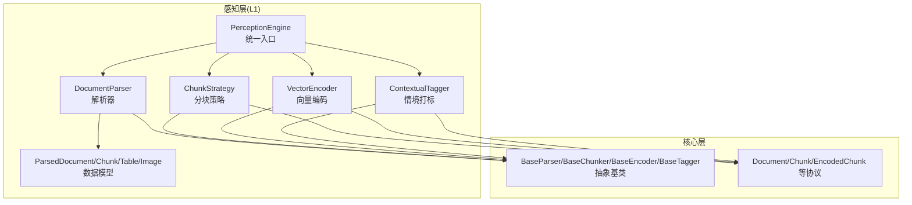
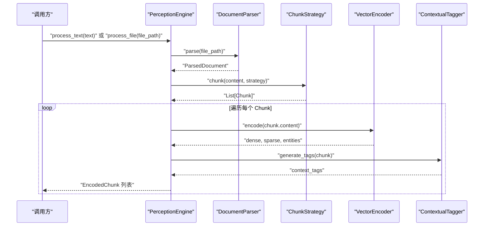
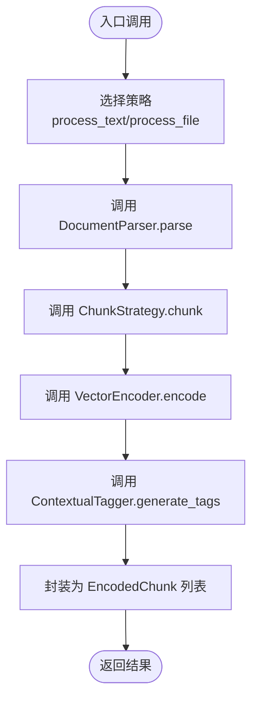
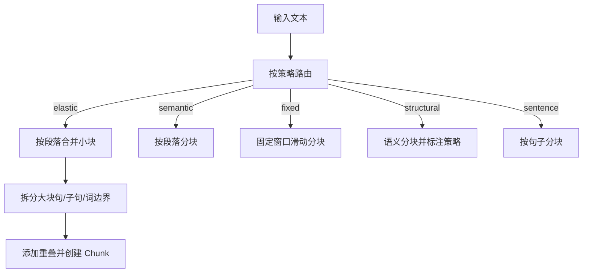
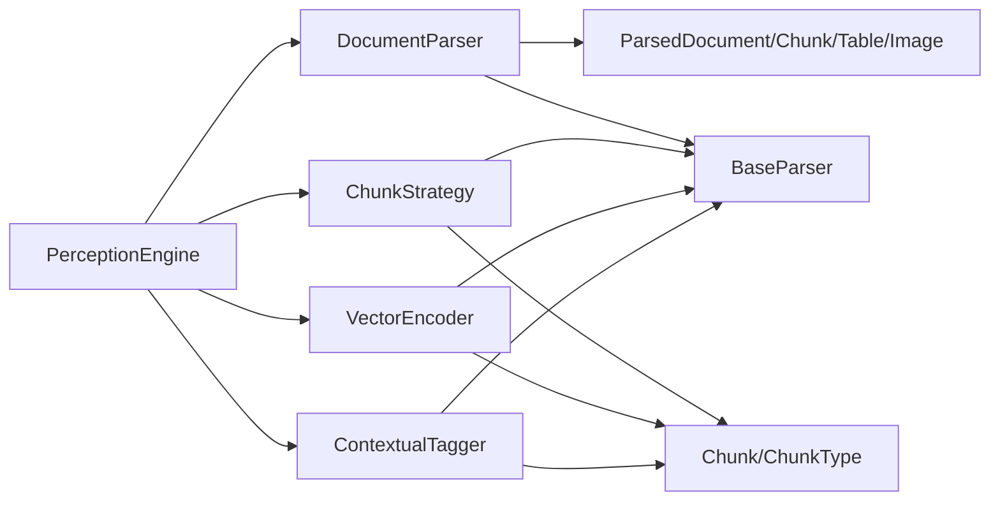

# 文档解析器

<cite>
**本文引用的文件**
- [src/perception/parser.py](file://src/perception/parser.py)
- [src/perception/models.py](file://src/perception/models.py)
- [src/perception/engine.py](file://src/perception/engine.py)
- [src/perception/chunker.py](file://src/perception/chunker.py)
- [src/perception/encoder.py](file://src/perception/encoder.py)
- [src/perception/tagger.py](file://src/perception/tagger.py)
- [src/core/base.py](file://src/core/base.py)
- [src/core/protocols.py](file://src/core/protocols.py)
- [example/example_usage.py](file://example/example_usage.py)
- [tests/test_perception/test_chunker.py](file://tests/test_perception/test_chunker.py)
- [wiki/wiki/核心架构设计/五层认知架构/感知层 (L1)/文档解析器.md](file://wiki/wiki/核心架构设计/五层认知架构/感知层 (L1)/文档解析器.md)
</cite>

## 目录
1. [引言](#引言)
2. [项目结构](#项目结构)
3. [核心组件](#核心组件)
4. [架构总览](#架构总览)
5. [详细组件分析](#详细组件分析)
6. [依赖分析](#依赖分析)
7. [性能考虑](#性能考虑)
8. [故障排查指南](#故障排查指南)
9. [结论](#结论)
10. [附录](#附录)

## 引言
本文件面向“文档解析器”的实现与使用，聚焦以下目标：
- 多格式文档解析能力：当前最小实现支持文本文件读取与固定大小分块；项目文档明确声明支持 PDF、Word、Markdown、HTML 等格式，并预留 OCR、表格与图片提取能力。
- OCR 功能现状与配置：enable_ocr 参数已纳入配置，但当前实现未生效，为后续扩展预留开关。
- 数据结构：解析器输出统一的 ParsedDocument，包含 content、chunks、tables、images、metadata 与解析时间戳。
- 使用方式：通过 PerceptionEngine 提供的统一入口 process_text/process_file，串联解析、分块、编码与情境打标。
- 错误处理与性能优化：解析阶段异常捕获与日志记录；分块策略、批量编码与 I/O 流式处理等优化建议。

## 项目结构
感知层（L1）围绕“文档解析器”构建，配合分块、编码、打标形成完整流水线。核心文件分布如下：
- 解析器：src/perception/parser.py
- 数据模型：src/perception/models.py
- 统一入口：src/perception/engine.py
- 分块策略：src/perception/chunker.py
- 向量编码：src/perception/encoder.py
- 情境打标：src/perception/tagger.py
- 抽象基类与协议：src/core/base.py、src/core/protocols.py
- 使用示例：example/example_usage.py
- 单元测试：tests/test_perception/test_chunker.py
- 架构设计文档：wiki/wiki/核心架构设计/五层认知架构/感知层 (L1)/文档解析器.md

**图表来源**
- [src/perception/engine.py:57-71](file://src/perception/engine.py#L57-L71)
- [src/perception/parser.py:8-9](file://src/perception/parser.py#L8-L9)
- [src/perception/chunker.py:8-9](file://src/perception/chunker.py#L8-L9)
- [src/perception/encoder.py:18-19](file://src/perception/encoder.py#L18-L19)
- [src/perception/tagger.py:7-8](file://src/perception/tagger.py#L7-L8)
- [src/core/protocols.py:101-117](file://src/core/protocols.py#L101-L117)
- [src/core/base.py:32-150](file://src/core/base.py#L32-L150)

**章节来源**
- [src/perception/parser.py:12-112](file://src/perception/parser.py#L12-L112)
- [src/perception/models.py:36-61](file://src/perception/models.py#L36-L61)
- [src/perception/engine.py:20-76](file://src/perception/engine.py#L20-L76)
- [src/perception/chunker.py:12-567](file://src/perception/chunker.py#L12-L567)
- [src/perception/encoder.py:25-255](file://src/perception/encoder.py#L25-L255)
- [src/perception/tagger.py:11-163](file://src/perception/tagger.py#L11-L163)
- [src/core/base.py:32-150](file://src/core/base.py#L32-L150)
- [src/core/protocols.py:101-117](file://src/core/protocols.py#L101-L117)

## 核心组件
- 文档解析器（DocumentParser）
  - 职责：将多种格式文档统一解析为 ParsedDocument，包含 content、chunks、metadata 等字段；当前实现为最小读取文本文件并按固定大小分块；表格与图片提取接口返回空列表，预留 OCR 开关。
  - 关键配置：enable_ocr（当前为预留位，未生效）。
  - 输出数据结构：ParsedDocument（包含文件路径、原始文本、文本块列表、表格列表、图片列表、元数据与解析时间戳）。
- 统一入口（PerceptionEngine）
  - 职责：组装解析、分块、编码、打标流程；提供 process_file 与 process_text 两种入口。
  - 配置项：model、chunk_size、chunk_overlap、enable_ocr、min_chunk_size、target_chunk_size、max_chunk_size、enable_elastic_chunking、chunk_strategy、semantic_boundaries。
  - 错误处理：解析阶段捕获异常并记录日志。
- 分块策略（ChunkStrategy）
  - 支持弹性分块、语义分块、固定大小分块、结构化分块、句子分块等多种模式；提供统一分块入口与边界检测、重叠拼接等辅助方法。
- 向量编码（VectorEncoder）
  - 生成稠密向量、稀疏向量、实体三元组；支持依赖注入 LLM 客户端或内置实现。
- 情境打标（ContextualTagger）
  - 为每个 Chunk 生成时间、情感、重要性、主题等标签；当前为最小实现，预留模型集成。

**章节来源**
- [src/perception/parser.py:12-112](file://src/perception/parser.py#L12-L112)
- [src/perception/models.py:52-61](file://src/perception/models.py#L52-L61)
- [src/perception/engine.py:20-76](file://src/perception/engine.py#L20-L76)
- [src/perception/chunker.py:12-567](file://src/perception/chunker.py#L12-L567)
- [src/perception/encoder.py:25-255](file://src/perception/encoder.py#L25-L255)
- [src/perception/tagger.py:11-163](file://src/perception/tagger.py#L11-L163)

## 架构总览
感知引擎将解析、分块、编码与打标串联，形成端到端的文档处理流水线。解析器负责将输入统一为结构化文档对象，随后由分块策略生成可向量化的小块，再经编码器生成多类型向量表示，最后由情境打标器为每块附加上下文标签。

**图表来源**
- [src/perception/engine.py:77-154](file://src/perception/engine.py#L77-L154)
- [src/perception/parser.py:28-60](file://src/perception/parser.py#L28-L60)
- [src/perception/chunker.py:49-85](file://src/perception/chunker.py#L49-L85)
- [src/perception/encoder.py:73-87](file://src/perception/encoder.py#L73-L87)
- [src/perception/tagger.py:33-48](file://src/perception/tagger.py#L33-L48)

## 详细组件分析

### 文档解析器（DocumentParser）
- 职责与行为
  - parse：校验文件存在性，读取 UTF-8 文本，按固定大小分块，构造 ParsedDocument。
  - extract_tables/extract_images：当前返回空列表，预留后续集成表格识别与图片 OCR。
  - enable_ocr：构造函数参数，当前未被使用，为后续 OCR 能力预留开关。
- 数据结构
  - ParsedDocument：包含 file_path、content、chunks、tables、images、metadata、parsed_at。
  - Chunk/ Table/ Image：分别对应文本块、表格与图片数据。
- 错误处理
  - 文件不存在时抛出 FileNotFoundError；统一由 PerceptionEngine 捕获并记录日志。

**图表来源**
- [src/perception/parser.py:12-112](file://src/perception/parser.py#L12-L112)
- [src/perception/models.py:52-61](file://src/perception/models.py#L52-L61)

**章节来源**
- [src/perception/parser.py:12-112](file://src/perception/parser.py#L12-L112)
- [src/perception/models.py:36-61](file://src/perception/models.py#L36-L61)
- [src/core/protocols.py:101-117](file://src/core/protocols.py#L101-L117)

### 统一入口（PerceptionEngine）
- 职责
  - 组装解析、分块、编码、打标流程；提供 process_file 与 process_text 两种入口。
- 配置项
  - model、chunk_size、chunk_overlap、enable_ocr、min_chunk_size、target_chunk_size、max_chunk_size、enable_elastic_chunking、chunk_strategy、semantic_boundaries。
- 错误处理
  - 解析阶段捕获异常并记录日志，便于定位问题。

**图表来源**
- [src/perception/engine.py:77-154](file://src/perception/engine.py#L77-L154)
- [src/perception/chunker.py:49-85](file://src/perception/chunker.py#L49-L85)
- [src/perception/encoder.py:73-87](file://src/perception/encoder.py#L73-L87)
- [src/perception/tagger.py:33-48](file://src/perception/tagger.py#L33-L48)

**章节来源**
- [src/perception/engine.py:20-76](file://src/perception/engine.py#L20-L76)
- [src/perception/engine.py:77-154](file://src/perception/engine.py#L77-L154)

### 分块策略（ChunkStrategy）
- 支持策略
  - elastic：弹性分块（智能调整块大小，保证语义边界与大小范围）。
  - semantic：按段落语义分块。
  - fixed：固定大小分块。
  - structural：结构化分块（基于段落等）。
  - sentence：句子级分块。
- 辅助方法
  - 段落/句子/子句分割、边界检测、重叠拼接、强制词边界切割等。

**图表来源**
- [src/perception/chunker.py:49-85](file://src/perception/chunker.py#L49-L85)
- [src/perception/chunker.py:89-141](file://src/perception/chunker.py#L89-L141)
- [src/perception/chunker.py:185-216](file://src/perception/chunker.py#L185-L216)
- [src/perception/chunker.py:218-248](file://src/perception/chunker.py#L218-L248)
- [src/perception/chunker.py:250-265](file://src/perception/chunker.py#L250-L265)
- [src/perception/chunker.py:286-314](file://src/perception/chunker.py#L286-L314)

**章节来源**
- [src/perception/chunker.py:12-567](file://src/perception/chunker.py#L12-L567)

### 向量编码（VectorEncoder）
- 能力
  - encode/encode_dense/encode_sparse/extract_entities。
  - 优先使用注入的 LLM 客户端；缺失时回退至内置实现。
- 批量编码
  - encode_dense_batch 支持批量向量化，提升吞吐。

**章节来源**
- [src/perception/encoder.py:25-255](file://src/perception/encoder.py#L25-L255)

### 情境打标（ContextualTagger）
- 能力
  - generate_tags：生成时间、情感、重要性、主题标签。
- 当前实现
  - 基于规则的最小实现，预留模型集成空间。

**章节来源**
- [src/perception/tagger.py:11-163](file://src/perception/tagger.py#L11-L163)

### 抽象基类与协议
- 抽象基类
  - BaseParser/BaseChunker/BaseEncoder/BaseTagger：定义统一接口，确保实现的一致性与可替换性。
- 协议
  - Document/Chunk/EncodedChunk 等：统一数据类型与契约，确保跨模块一致性。

**章节来源**
- [src/core/base.py:32-150](file://src/core/base.py#L32-L150)
- [src/core/protocols.py:101-117](file://src/core/protocols.py#L101-L117)

## 依赖分析
- 组件耦合
  - PerceptionEngine 依赖 DocumentParser、ChunkStrategy、VectorEncoder、ContextualTagger。
  - 各组件均实现对应的抽象基类，遵循 src/core/base.py 的统一接口。
- 数据契约
  - 统一数据模型与枚举由 src/core/protocols.py 定义，确保跨模块一致性。
- 外部依赖
  - 向量化可注入 LLM 客户端；若不可用则回退至内置实现。
  - numpy 为可选依赖，缺失时仍可运行。

**图表来源**
- [src/perception/engine.py:57-71](file://src/perception/engine.py#L57-L71)
- [src/perception/parser.py:8-9](file://src/perception/parser.py#L8-L9)
- [src/perception/chunker.py:8-9](file://src/perception/chunker.py#L8-L9)
- [src/perception/encoder.py:18-19](file://src/perception/encoder.py#L18-L19)
- [src/perception/tagger.py:7-8](file://src/perception/tagger.py#L7-L8)
- [src/core/protocols.py:101-117](file://src/core/protocols.py#L101-L117)
- [src/core/base.py:32-150](file://src/core/base.py#L32-L150)

**章节来源**
- [src/perception/engine.py:28-56](file://src/perception/engine.py#L28-L56)
- [src/perception/chunker.py:19-47](file://src/perception/chunker.py#L19-L47)

## 性能考虑
- 分块策略
  - 弹性分块在保证语义完整性的同时控制块大小，适合大规模文档；重叠参数影响召回与上下文连续性。
- 向量编码
  - 批量编码可显著提升吞吐；若使用外部 LLM 客户端，需关注网络延迟与并发限制。
- 情境标签
  - 基于规则的标签生成开销较低，可扩展为模型驱动以提升质量。
- I/O 与内存
  - 大文件解析建议分块流式处理，避免一次性加载过大数据。

**章节来源**
- [wiki/wiki/核心架构设计/五层认知架构/感知层 (L1)/文档解析器.md](file://wiki/wiki/核心架构设计/五层认知架构/感知层 (L1)/文档解析器.md#L320-L329)

## 故障排查指南
- 常见问题
  - 文件不存在：解析器会抛出 FileNotFoundError，检查文件路径与权限。
  - 解析异常：PerceptionEngine 在解析阶段捕获异常并记录日志，检查输入格式与依赖。
- 排查步骤
  - 确认文件存在且可读。
  - 检查分块策略参数（如 chunk_size、chunk_overlap、min_chunk_size、max_chunk_size）是否合理。
  - 若启用 OCR，确认 enable_ocr 配置与后续扩展实现一致。
  - 观察日志输出定位异常环节。

**章节来源**
- [src/perception/parser.py:42-43](file://src/perception/parser.py#L42-L43)
- [src/perception/engine.py:87-94](file://src/perception/engine.py#L87-L94)
- [wiki/wiki/核心架构设计/五层认知架构/感知层 (L1)/文档解析器.md](file://wiki/wiki/核心架构设计/五层认知架构/感知层 (L1)/文档解析器.md#L330-L340)

## 结论
当前文档解析器提供了统一的解析、分块、编码与打标能力，支持多格式声明与弹性分块策略。OCR、表格与图片提取等功能处于预留状态，建议结合业务需求逐步完善。通过统一的抽象与协议，解析器具备良好的扩展性与可维护性。

## 附录

### 配置选项一览
- 解析器配置
  - enable_ocr：是否启用 OCR（当前为预留位）。
- 分块策略配置
  - chunk_size：固定分块大小（兼容模式）
  - chunk_overlap：分块重叠长度
  - min_chunk_size：弹性分块最小块大小
  - target_chunk_size：弹性分块目标块大小
  - max_chunk_size：弹性分块最大块大小
  - enable_elastic：是否启用弹性切割
  - semantic_boundaries：语义边界优先级列表
- 编码与打标
  - model：向量化模型名称
  - chunk_strategy：默认分块策略（elastic/semantic/fixed/structural/sentence）

**章节来源**
- [src/perception/engine.py:28-56](file://src/perception/engine.py#L28-L56)
- [src/perception/chunker.py:19-47](file://src/perception/chunker.py#L19-L47)
- [wiki/wiki/核心架构设计/五层认知架构/感知层 (L1)/文档解析器.md](file://wiki/wiki/核心架构设计/五层认知架构/感知层 (L1)/文档解析器.md#L349-L363)

### 典型使用示例（路径参考）
- 使用 PerceptionEngine 处理文本
  - [example/example_usage.py:12-47](file://example/example_usage.py#L12-L47)
- 处理文本并获取编码块
  - [example/example_usage.py:34-46](file://example/example_usage.py#L34-L46)

**章节来源**
- [example/example_usage.py:12-47](file://example/example_usage.py#L12-L47)
- [example/example_usage.py:34-46](file://example/example_usage.py#L34-L46)

### 复杂场景处理建议
- 混合内容（文本+图像）
  - 当前解析器返回空的图片列表；建议在解析阶段集成 OCR，并在 ParsedDocument 中填充 Image 数据。
- 表格识别
  - 当前解析器返回空的表格列表；建议在解析阶段集成表格结构还原，并在 ParsedDocument 中填充 Table 数据。
- 公式提取
  - 当前未实现；可在解析阶段引入公式识别模块，并在元数据中标注公式位置与内容。

**章节来源**
- [src/perception/parser.py:62-90](file://src/perception/parser.py#L62-L90)
- [src/perception/models.py:36-49](file://src/perception/models.py#L36-L49)
- [wiki/wiki/核心架构设计/五层认知架构/感知层 (L1)/文档解析器.md](file://wiki/wiki/核心架构设计/五层认知架构/感知层 (L1)/文档解析器.md#L374-L381)