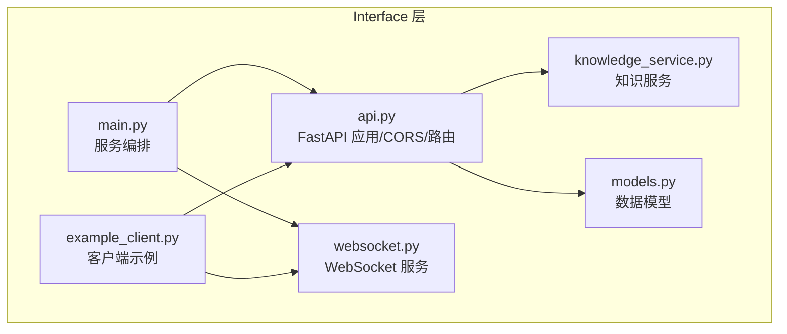
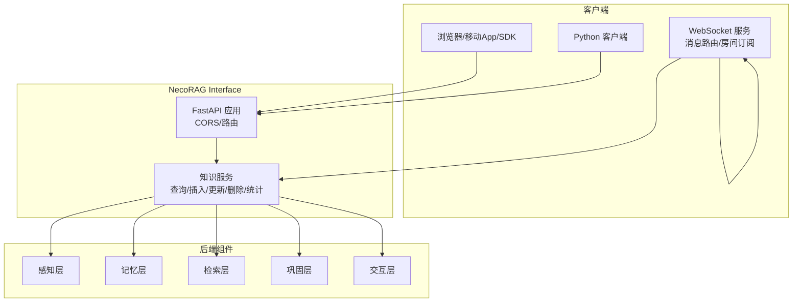
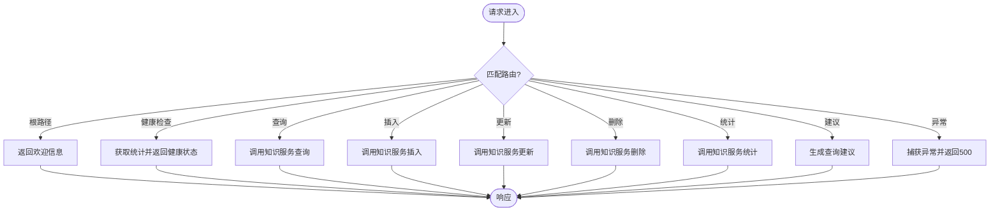
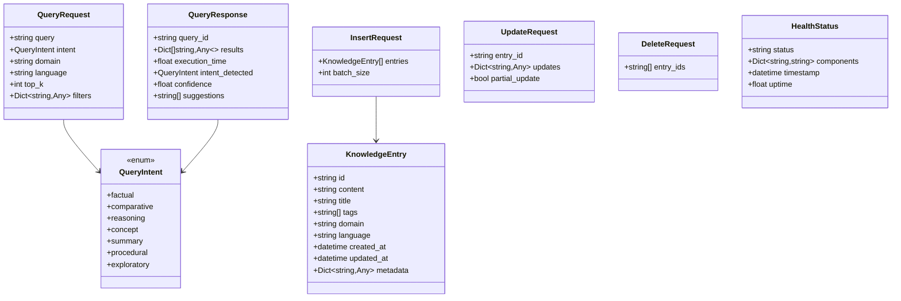
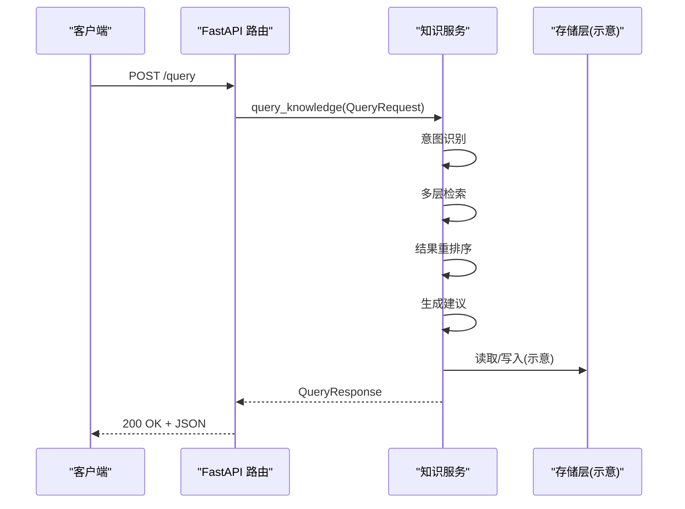
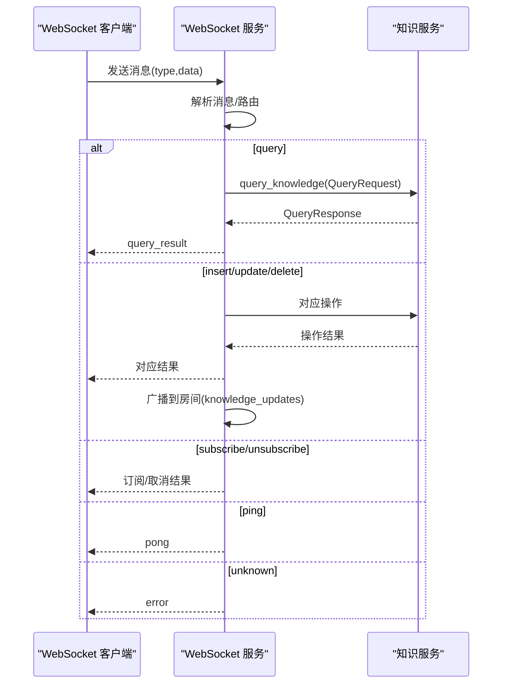
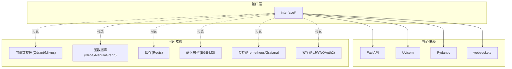

# RESTful API 接口

<cite>
**本文引用的文件**
- [interface/main.py](file://interface/main.py)
- [interface/api.py](file://interface/api.py)
- [interface/models.py](file://interface/models.py)
- [interface/knowledge_service.py](file://interface/knowledge_service.py)
- [interface/websocket.py](file://interface/websocket.py)
- [interface/example_client.py](file://interface/example_client.py)
- [interface/README.md](file://interface/README.md)
- [requirements.txt](file://requirements.txt)
- [pyproject.toml](file://pyproject.toml)
- [README.md](file://README.md)
</cite>

## 目录
1. [简介](#简介)
2. [项目结构](#项目结构)
3. [核心组件](#核心组件)
4. [架构总览](#架构总览)
5. [详细组件分析](#详细组件分析)
6. [依赖分析](#依赖分析)
7. [性能考虑](#性能考虑)
8. [故障排查指南](#故障排查指南)
9. [结论](#结论)
10. [附录](#附录)

## 简介
本文件面向开发者，系统化梳理 NecoRAG Interface 模块提供的 RESTful API 接口与 WebSocket 服务，重点覆盖：
- FastAPI 框架使用与路由设计
- CORS 跨域配置
- 端点功能与请求/响应模型
- 参数校验与错误处理策略
- HTTP 状态码说明
- 认证方式与安全建议
- curl 与 Python 客户端调用示例

该模块提供知识库的查询、插入、更新、删除、健康检查、统计信息与查询建议等接口，并配套 WebSocket 实时通信能力，便于构建高性能、可观测、可扩展的知识服务。

## 项目结构
Interface 模块位于 interface/ 目录，主要文件职责如下：
- main.py：服务编排，同时启动 RESTful API 与 WebSocket 服务
- api.py：FastAPI 应用创建、CORS 配置与路由定义
- models.py：请求/响应模型与枚举定义
- knowledge_service.py：知识服务核心逻辑（查询、插入、更新、删除、统计）
- websocket.py：WebSocket 服务与消息路由、房间订阅
- example_client.py：Python 客户端示例（RESTful 与 WebSocket）
- README.md：接口使用说明、示例与部署建议

**图表来源**
- [interface/main.py:1-82](file://interface/main.py#L1-L82)
- [interface/api.py:1-162](file://interface/api.py#L1-L162)
- [interface/models.py:1-85](file://interface/models.py#L1-L85)
- [interface/knowledge_service.py:1-307](file://interface/knowledge_service.py#L1-L307)
- [interface/websocket.py:1-299](file://interface/websocket.py#L1-L299)
- [interface/example_client.py:1-200](file://interface/example_client.py#L1-L200)

**章节来源**
- [interface/main.py:1-82](file://interface/main.py#L1-L82)
- [interface/api.py:1-162](file://interface/api.py#L1-L162)
- [interface/README.md:1-392](file://interface/README.md#L1-L392)

## 核心组件
- FastAPI 应用与路由
  - 在 api.py 中创建 FastAPI 应用，启用 CORS，注册根路径、健康检查、查询、插入、更新、删除、统计、建议等端点。
- CORS 配置
  - 允许任意来源、凭证、方法与头，便于前端跨域访问。
- 数据模型
  - 使用 Pydantic 定义请求/响应模型，含枚举类型（查询意图）、知识条目、健康状态等。
- 知识服务
  - knowledge_service.py 提供查询、插入、更新、删除、统计等核心逻辑；实际存储与检索由各层组件实现。
- WebSocket 服务
  - websocket.py 提供消息路由、房间订阅、广播与错误处理，支持查询、插入、更新、删除、订阅/取消订阅、心跳等消息类型。
- 客户端示例
  - example_client.py 展示 RESTful 与 WebSocket 的调用方式。

**章节来源**
- [interface/api.py:19-152](file://interface/api.py#L19-L152)
- [interface/models.py:11-85](file://interface/models.py#L11-L85)
- [interface/knowledge_service.py:27-307](file://interface/knowledge_service.py#L27-L307)
- [interface/websocket.py:18-299](file://interface/websocket.py#L18-L299)
- [interface/example_client.py:13-200](file://interface/example_client.py#L13-L200)

## 架构总览

**图表来源**
- [interface/api.py:19-152](file://interface/api.py#L19-L152)
- [interface/websocket.py:68-221](file://interface/websocket.py#L68-L221)
- [interface/knowledge_service.py:45-202](file://interface/knowledge_service.py#L45-L202)

## 详细组件分析

### FastAPI 应用与 CORS 配置
- 应用创建
  - 标题、描述、版本、文档端点均在应用初始化时配置。
- CORS 配置
  - 允许任意来源、凭证、方法与头，便于跨域访问。
- 路由设计
  - 根路径返回欢迎信息与文档链接
  - 健康检查返回服务状态与组件健康情况
  - 查询、插入、更新、删除、统计、建议等端点按 HTTP 方法与路径划分
  - 所有异常统一捕获并返回 500 错误

**图表来源**
- [interface/api.py:40-151](file://interface/api.py#L40-L151)

**章节来源**
- [interface/api.py:19-152](file://interface/api.py#L19-L152)

### CORS 跨域配置
- 配置项
  - 允许任意来源、凭证、方法与头
- 适用范围
  - 对所有路由生效，便于前端跨域访问
- 安全建议
  - 生产环境建议限定允许的来源、方法与头，避免使用通配符

**章节来源**
- [interface/api.py:29-36](file://interface/api.py#L29-L36)

### 请求/响应模型设计
- 查询意图枚举
  - 包含事实查询、比较分析、推理演绎、概念解释、摘要总结、操作指导、探索发散等类型
- 知识条目模型
  - 唯一 ID、内容、标题、标签、领域、语言、时间戳、元数据
- 查询请求/响应
  - 查询请求包含查询内容、意图、领域、语言、返回数量、过滤条件
  - 查询响应包含查询 ID、结果列表、执行时间、检测到的意图、置信度、建议
- 插入/更新/删除请求
  - 插入：批量知识条目与批处理大小
  - 更新：条目 ID、更新内容、是否部分更新
  - 删除：条目 ID 列表
- 健康状态
  - 服务状态、组件状态、时间戳、运行时长

**图表来源**
- [interface/models.py:11-85](file://interface/models.py#L11-L85)

**章节来源**
- [interface/models.py:11-85](file://interface/models.py#L11-L85)

### 知识服务核心逻辑
- 查询流程
  - 生成查询 ID、记录开始时间
  - 意图识别（若未显式提供）
  - 多层检索、结果重排序与融合
  - 生成查询建议
  - 计算执行时间与置信度
- 插入流程
  - 批量处理每个条目，预处理与验证
  - 插入到各记忆层，触发知识巩固
  - 返回成功/失败统计
- 更新流程
  - 校验条目存在性
  - 部分或全量更新
  - 更新各记忆层与相关条目
- 删除流程
  - 批量删除，清理关系
  - 返回成功/失败统计
- 统计信息
  - 总条目数、领域分布、语言分布、最近更新、健康状态、时间戳

**图表来源**
- [interface/api.py:73-84](file://interface/api.py#L73-L84)
- [interface/knowledge_service.py:45-77](file://interface/knowledge_service.py#L45-L77)

**章节来源**
- [interface/knowledge_service.py:45-202](file://interface/knowledge_service.py#L45-L202)

### WebSocket 服务与消息路由
- 连接管理
  - 维护客户端集合与房间集合
  - 心跳检测与断线清理
- 消息路由
  - query、insert、update、delete、subscribe、unsubscribe、ping
  - 不支持的消息类型返回错误
- 房间订阅
  - 订阅/取消订阅房间，支持广播到房间内所有客户端
- 错误处理
  - JSON 解析错误、处理异常均返回错误消息

**图表来源**
- [interface/websocket.py:68-221](file://interface/websocket.py#L68-L221)
- [interface/websocket.py:232-244](file://interface/websocket.py#L232-L244)

**章节来源**
- [interface/websocket.py:18-299](file://interface/websocket.py#L18-L299)

### API 端点规范与使用示例

- 根路径
  - 方法：GET
  - 路径：/
  - 响应：欢迎信息与文档链接
  - 示例：curl -X GET http://localhost:8000/

- 健康检查
  - 方法：GET
  - 路径：/health
  - 响应：服务状态、组件状态、运行时长、时间戳
  - 示例：curl -X GET http://localhost:8000/health

- 知识查询
  - 方法：POST
  - 路径：/query
  - 请求体：QueryRequest
  - 响应体：QueryResponse
  - 示例：见接口 README 的 curl 示例

- 知识插入
  - 方法：POST
  - 路径：/insert
  - 请求体：InsertRequest
  - 响应体：插入统计与失败明细
  - 示例：见接口 README 的 curl 示例

- 知识更新
  - 方法：PUT
  - 路径：/update
  - 请求体：UpdateRequest
  - 响应体：更新结果与更新字段
  - 示例：见接口 README 的 curl 示例

- 知识删除
  - 方法：DELETE
  - 路径：/delete
  - 请求体：DeleteRequest
  - 响应体：删除统计与失败明细
  - 示例：见接口 README 的 curl 示例

- 统计信息
  - 方法：GET
  - 路径：/stats
  - 响应体：统计信息（总数、分布、最近更新、健康状态、时间戳）

- 查询建议
  - 方法：GET
  - 路径：/suggestions/{query}
  - 响应体：原始查询与建议数组

- WebSocket 接口
  - 连接：ws://localhost:8001
  - 支持消息类型：query、insert、update、delete、subscribe、unsubscribe、ping
  - 房间：knowledge_updates（插入/更新/删除事件推送）

**章节来源**
- [interface/api.py:40-151](file://interface/api.py#L40-L151)
- [interface/README.md:77-392](file://interface/README.md#L77-L392)

## 依赖分析
- 运行时依赖
  - FastAPI、Uvicorn、Pydantic、WebSockets
- 可选依赖
  - 向量数据库、图数据库、缓存、嵌入模型、LLM 集成、监控与安全模块等
- 安全中间件
  - 项目中存在安全中间件（CSRF、速率限制、XSS），但接口层未启用，建议在生产环境按需启用

**图表来源**
- [requirements.txt:22-24](file://requirements.txt#L22-L24)
- [requirements.txt:37-44](file://requirements.txt#L37-L44)
- [requirements.txt:49](file://requirements.txt#L49)
- [requirements.txt:54](file://requirements.txt#L54)
- [requirements.txt:99](file://requirements.txt#L99)
- [requirements.txt:100](file://requirements.txt#L100)

**章节来源**
- [requirements.txt:1-160](file://requirements.txt#L1-L160)
- [pyproject.toml:27-79](file://pyproject.toml#L27-L79)
- [README.md:652-698](file://README.md#L652-L698)

## 性能考虑
- 响应时间目标（来自接口文档）
  - 查询响应：< 800ms
  - 插入操作：< 500ms
  - 更新操作：< 300ms
  - 删除操作：< 200ms
- 并发能力
  - 支持 1000+ 并发连接
  - 每秒处理 500+ 查询请求
  - 批量操作支持 1000+ 条目
- 建议
  - 使用异步 I/O（已采用）
  - 合理设置批处理大小与并发度
  - 对高频端点增加缓存与限流
  - 生产环境启用 HTTPS 与安全中间件

[本节为通用性能建议，不直接分析具体文件]

## 故障排查指南
- 常见 HTTP 状态码
  - 200：成功
  - 400：请求参数错误
  - 404：资源不存在
  - 500：服务器内部错误
- 健康检查
  - 访问 /health 获取服务状态与组件健康情况
- WebSocket 错误格式
  - 返回 type 为 error，data 包含错误消息
- 日志与监控
  - 接口层与知识服务均有日志记录，建议结合监控系统定位问题

**章节来源**
- [interface/README.md:231-268](file://interface/README.md#L231-L268)
- [interface/websocket.py:259-266](file://interface/websocket.py#L259-L266)
- [interface/api.py:49-71](file://interface/api.py#L49-L71)

## 结论
本接口模块以 FastAPI 为核心，提供清晰的 RESTful API 与 WebSocket 服务，配合完善的模型定义与错误处理策略，能够满足知识库的查询、插入、更新、删除、健康检查、统计与建议等需求。建议在生产环境中：
- 明确 CORS 白名单
- 启用安全中间件（CSRF、速率限制、XSS）
- 部署 HTTPS
- 增加鉴权与权限控制
- 结合监控与日志完善可观测性

[本节为总结性内容，不直接分析具体文件]

## 附录

### API 端点一览
- GET /
- GET /health
- POST /query
- POST /insert
- PUT /update
- DELETE /delete
- GET /stats
- GET /suggestions/{query}

**章节来源**
- [interface/api.py:40-151](file://interface/api.py#L40-L151)

### curl 使用示例
- 健康检查
  - curl -X GET http://localhost:8000/health
- 查询知识
  - curl -X POST http://localhost:8000/query -H "Content-Type: application/json" -d '{"query":"什么是人工智能？","language":"zh","top_k":5}'
- 插入知识
  - curl -X POST http://localhost:8000/insert -H "Content-Type: application/json" -d '{"entries":[{"content":"人工智能是计算机科学的一个分支...","title":"人工智能定义","tags":["AI","计算机科学"],"domain":"technology"}]}'

**章节来源**
- [interface/README.md:96-119](file://interface/README.md#L96-L119)

### Python 客户端调用示例
- RESTful API 客户端
  - 参考 NecoRAGAPIClient 的 health_check、query_knowledge、insert_knowledge、get_stats 方法
- WebSocket 客户端
  - 参考 NecoRAGWebSocketClient 的 connect、disconnect、send_message、query、subscribe、unsubscribe 方法

**章节来源**
- [interface/example_client.py:13-94](file://interface/example_client.py#L13-L94)

### 认证方式与安全建议
- 当前接口未内置认证
- 建议在生产环境启用：
  - JWT/OAuth2 认证
  - CSRF 防护
  - 速率限制
  - HTTPS 与安全头部
- 安全中间件已在项目中实现，可在接口层按需启用

**章节来源**
- [README.md:41](file://README.md#L41)
- [requirements.txt:99](file://requirements.txt#L99)
- [requirements.txt:100](file://requirements.txt#L100)