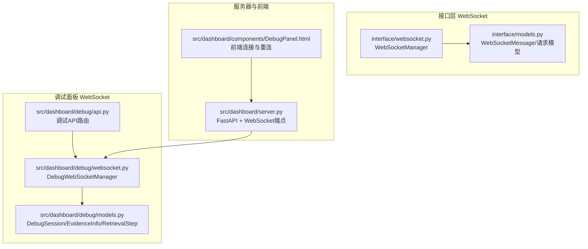
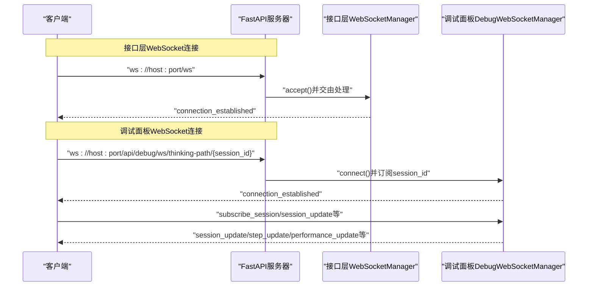
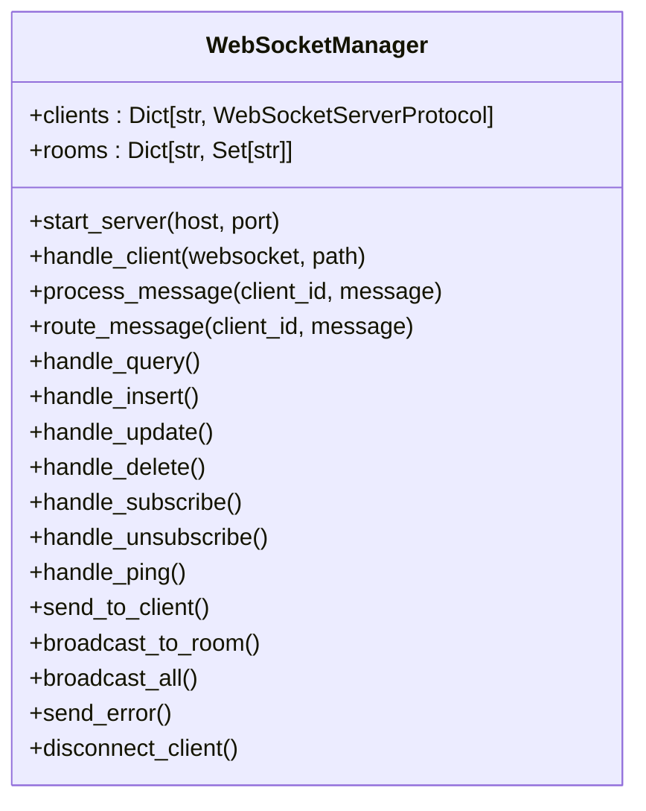
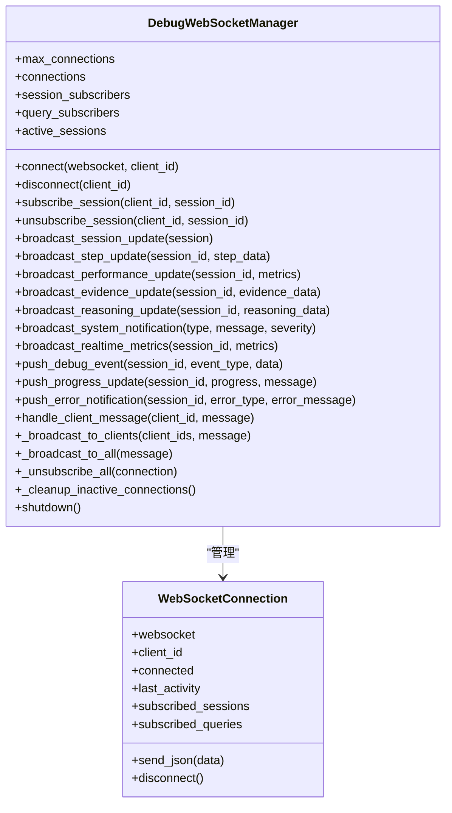
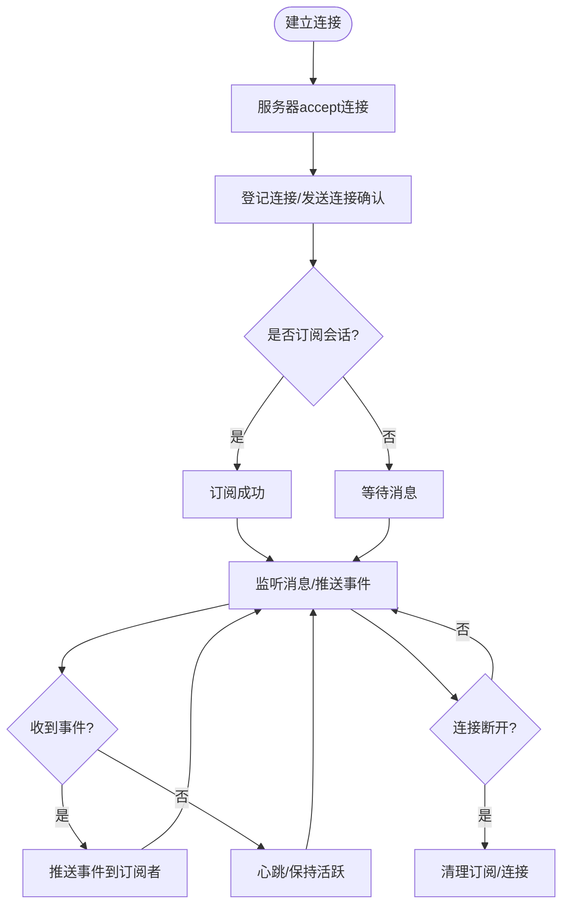
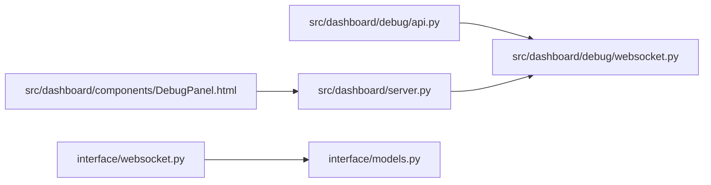

# WebSocket 实时通信

<cite>
**本文引用的文件**
- [interface/websocket.py](file://interface/websocket.py)
- [interface/models.py](file://interface/models.py)
- [interface/example_client.py](file://interface/example_client.py)
- [src/dashboard/debug/websocket.py](file://src/dashboard/debug/websocket.py)
- [src/dashboard/debug/models.py](file://src/dashboard/debug/models.py)
- [src/dashboard/debug/api.py](file://src/dashboard/debug/api.py)
- [src/dashboard/server.py](file://src/dashboard/server.py)
- [src/dashboard/components/DebugPanel.html](file://src/dashboard/components/DebugPanel.html)
- [example/debug_panel_demo.py](file://example/debug_panel_demo.py)
- [src/dashboard/debug/connection.py](file://src/dashboard/debug/connection.py)
</cite>

## 目录
1. [引言](#引言)
2. [项目结构](#项目结构)
3. [核心组件](#核心组件)
4. [架构总览](#架构总览)
5. [详细组件分析](#详细组件分析)
6. [依赖关系分析](#依赖关系分析)
7. [性能考量](#性能考量)
8. [故障排除指南](#故障排除指南)
9. [结论](#结论)
10. [附录](#附录)

## 引言
本文件面向开发者，系统性阐述基于 FastAPI/FastAPI WebSocket 的实时通信系统，涵盖连接建立流程、消息格式与事件类型、实时数据推送、连接状态管理与断线重连策略、消息序列化与反序列化、心跳检测与超时处理，并提供 API 使用示例、客户端连接与消息监听实现、调试工具使用指南、性能优化建议与故障排除方法，帮助快速构建可靠的实时通信应用。

## 项目结构
本项目在两个层面提供 WebSocket 能力：
- 接口层 WebSocket：提供知识库操作与状态推送的通用 WebSocket 服务，支持查询、插入、更新、删除、订阅等消息类型。
- 调试面板 WebSocket：提供调试会话的实时可视化推送，支持会话更新、步骤更新、性能指标、证据与推理链更新等事件类型。

图表来源
- [interface/websocket.py:18-299](file://interface/websocket.py#L18-L299)
- [src/dashboard/debug/websocket.py:49-554](file://src/dashboard/debug/websocket.py#L49-L554)
- [src/dashboard/debug/models.py:185-336](file://src/dashboard/debug/models.py#L185-L336)
- [src/dashboard/debug/api.py:85-557](file://src/dashboard/debug/api.py#L85-L557)
- [src/dashboard/server.py:340-370](file://src/dashboard/server.py#L340-L370)
- [src/dashboard/components/DebugPanel.html:428-454](file://src/dashboard/components/DebugPanel.html#L428-L454)

章节来源
- [interface/websocket.py:18-299](file://interface/websocket.py#L18-L299)
- [src/dashboard/debug/websocket.py:49-554](file://src/dashboard/debug/websocket.py#L49-L554)
- [src/dashboard/debug/models.py:185-336](file://src/dashboard/debug/models.py#L185-L336)
- [src/dashboard/debug/api.py:85-557](file://src/dashboard/debug/api.py#L85-L557)
- [src/dashboard/server.py:340-370](file://src/dashboard/server.py#L340-L370)
- [src/dashboard/components/DebugPanel.html:428-454](file://src/dashboard/components/DebugPanel.html#L428-L454)

## 核心组件
- 接口层 WebSocket 管理器：负责连接接入、消息路由、房间广播、错误处理与连接断开清理。
- 调试面板 WebSocket 管理器：负责调试会话订阅、事件推送、连接清理、心跳响应与系统通知广播。
- 数据模型：统一消息格式与调试会话、证据、推理步骤等数据结构。
- 服务器集成：FastAPI 路由注册 WebSocket 端点，前端页面通过 WebSocket 连接并监听消息。

章节来源
- [interface/websocket.py:18-299](file://interface/websocket.py#L18-L299)
- [src/dashboard/debug/websocket.py:49-554](file://src/dashboard/debug/websocket.py#L49-L554)
- [interface/models.py:73-85](file://interface/models.py#L73-L85)
- [src/dashboard/debug/models.py:185-336](file://src/dashboard/debug/models.py#L185-L336)
- [src/dashboard/server.py:340-370](file://src/dashboard/server.py#L340-L370)

## 架构总览
接口层与调试面板分别提供独立的 WebSocket 通道，二者共享一致的消息格式与事件类型约定，便于统一客户端处理。

图表来源
- [src/dashboard/server.py:340-370](file://src/dashboard/server.py#L340-L370)
- [interface/websocket.py:27-67](file://interface/websocket.py#L27-L67)
- [src/dashboard/debug/websocket.py:92-129](file://src/dashboard/debug/websocket.py#L92-L129)

## 详细组件分析

### 接口层 WebSocket 管理器
- 连接建立：接受连接、登记客户端、发送连接确认。
- 消息路由：根据消息类型分派到查询、插入、更新、删除、订阅、取消订阅、心跳处理。
- 广播机制：房间广播与全量广播，自动清理断开连接。
- 错误处理：JSON 解析错误与异常捕获，统一返回错误消息。

图表来源
- [interface/websocket.py:18-299](file://interface/websocket.py#L18-L299)

章节来源
- [interface/websocket.py:18-299](file://interface/websocket.py#L18-L299)

### 调试面板 WebSocket 管理器
- 连接封装：WebSocketConnection 包装连接对象，维护订阅集合与最后活动时间。
- 会话订阅：按会话维度订阅/取消订阅，支持证据、推理链、性能指标等事件推送。
- 事件推送：会话更新、步骤更新、性能更新、证据更新、推理更新、系统通知、实时指标等。
- 清理任务：定期清理不活跃连接，避免资源泄漏。
- 心跳处理：客户端发送 ping，服务端回复 pong。

图表来源
- [src/dashboard/debug/websocket.py:19-554](file://src/dashboard/debug/websocket.py#L19-L554)

章节来源
- [src/dashboard/debug/websocket.py:49-554](file://src/dashboard/debug/websocket.py#L49-L554)

### 消息格式与事件类型
- 通用消息格式：type、data、timestamp 字段，确保客户端可统一解析。
- 接口层事件类型：
  - query：查询请求，返回 query_result。
  - insert/update/delete：写操作，返回对应结果或错误。
  - subscribe/unsubscribe：房间订阅管理。
  - ping：心跳请求，返回 pong。
- 调试面板事件类型：
  - connection_established：连接建立确认。
  - session_update：会话状态更新。
  - step_update：检索步骤更新。
  - performance_update：性能指标更新。
  - evidence_added：证据新增。
  - reasoning_update：推理链更新。
  - system_notification：系统通知。
  - realtime_metrics：实时指标。
  - debug_event：通用调试事件。
  - progress_update/error_notification：进度与错误通知。
  - pong：心跳响应。

章节来源
- [interface/models.py:73-85](file://interface/models.py#L73-L85)
- [src/dashboard/debug/websocket.py:118-123](file://src/dashboard/debug/websocket.py#L118-L123)
- [src/dashboard/debug/websocket.py:200-260](file://src/dashboard/debug/websocket.py#L200-L260)
- [src/dashboard/debug/websocket.py:453-477](file://src/dashboard/debug/websocket.py#L453-L477)
- [src/dashboard/debug/websocket.py:492-503](file://src/dashboard/debug/websocket.py#L492-L503)
- [src/dashboard/debug/websocket.py:518-554](file://src/dashboard/debug/websocket.py#L518-L554)

### 连接生命周期与断线重连
- 连接建立：服务器 accept 连接，管理器登记并发送连接确认。
- 会话订阅：调试面板连接后订阅指定会话，后续事件定向推送。
- 断线重连：前端在 onclose 时定时重连；管理器提供清理任务定期断开不活跃连接。
- 连接上限：管理器内置最大连接数限制，超过阈值拒绝新连接。

图表来源
- [src/dashboard/server.py:340-370](file://src/dashboard/server.py#L340-L370)
- [src/dashboard/debug/websocket.py:92-129](file://src/dashboard/debug/websocket.py#L92-L129)
- [src/dashboard/debug/websocket.py:398-421](file://src/dashboard/debug/websocket.py#L398-L421)
- [src/dashboard/components/DebugPanel.html:443-448](file://src/dashboard/components/DebugPanel.html#L443-L448)

章节来源
- [src/dashboard/server.py:340-370](file://src/dashboard/server.py#L340-L370)
- [src/dashboard/debug/websocket.py:92-129](file://src/dashboard/debug/websocket.py#L92-L129)
- [src/dashboard/debug/websocket.py:398-421](file://src/dashboard/debug/websocket.py#L398-L421)
- [src/dashboard/components/DebugPanel.html:443-448](file://src/dashboard/components/DebugPanel.html#L443-L448)

### 心跳检测与超时处理
- 心跳请求：客户端发送 ping，服务端返回 pong。
- 超时清理：管理器定期扫描 last_activity，超过阈值（如3分钟）主动断开连接。
- 前端重连：onclose 触发定时重连，避免长时间离线。

章节来源
- [interface/websocket.py:215-221](file://interface/websocket.py#L215-L221)
- [src/dashboard/debug/websocket.py:309-314](file://src/dashboard/debug/websocket.py#L309-L314)
- [src/dashboard/debug/websocket.py:408-410](file://src/dashboard/debug/websocket.py#L408-L410)
- [src/dashboard/components/DebugPanel.html:443-448](file://src/dashboard/components/DebugPanel.html#L443-L448)

### 消息序列化与反序列化
- 服务端：使用 JSON 解析字符串消息，构造 WebSocketMessage/pydantic 模型，再路由处理。
- 客户端：使用 websockets 库发送/接收 JSON，注意时间戳字段的格式一致性。
- 调试模型：使用 dataclass/Pydantic 模型保证结构化数据传输。

章节来源
- [interface/websocket.py:52-66](file://interface/websocket.py#L52-L66)
- [interface/models.py:73-85](file://interface/models.py#L73-L85)
- [src/dashboard/debug/models.py:185-336](file://src/dashboard/debug/models.py#L185-L336)

### 实时数据推送机制
- 接口层：写操作完成后广播房间事件（如 inserted/updated/deleted），供订阅者接收。
- 调试面板：会话生命周期事件（创建、步骤、证据、推理、完成/失败）通过管理器定向推送。

章节来源
- [interface/websocket.py:118-128](file://interface/websocket.py#L118-L128)
- [src/dashboard/debug/websocket.py:200-260](file://src/dashboard/debug/websocket.py#L200-L260)
- [src/dashboard/debug/websocket.py:453-477](file://src/dashboard/debug/websocket.py#L453-L477)

### WebSocket API 使用示例与客户端实现
- 接口层客户端示例：演示 RESTful API 与 WebSocket 的组合使用，包括连接、查询、订阅与断开。
- 调试面板前端：演示 WebSocket 连接、消息监听与断线重连。

章节来源
- [interface/example_client.py:53-94](file://interface/example_client.py#L53-L94)
- [src/dashboard/components/DebugPanel.html:428-454](file://src/dashboard/components/DebugPanel.html#L428-L454)

## 依赖关系分析
- 服务器集成：调试面板 WebSocket 端点在 FastAPI 中注册，连接建立后自动订阅会话并处理客户端消息。
- 调试 API 与 WebSocket：调试 API 提供会话创建、步骤添加、证据添加等，WebSocket 管理器负责事件推送。
- 连接管理：调试连接管理器提供连接状态、用户/会话映射、事件回调与清理任务。

图表来源
- [src/dashboard/debug/api.py:85-557](file://src/dashboard/debug/api.py#L85-L557)
- [src/dashboard/server.py:340-370](file://src/dashboard/server.py#L340-L370)
- [src/dashboard/debug/websocket.py:49-554](file://src/dashboard/debug/websocket.py#L49-L554)
- [src/dashboard/components/DebugPanel.html:428-454](file://src/dashboard/components/DebugPanel.html#L428-L454)
- [interface/websocket.py:18-299](file://interface/websocket.py#L18-L299)
- [interface/models.py:73-85](file://interface/models.py#L73-L85)

章节来源
- [src/dashboard/debug/api.py:85-557](file://src/dashboard/debug/api.py#L85-L557)
- [src/dashboard/server.py:340-370](file://src/dashboard/server.py#L340-L370)
- [src/dashboard/debug/websocket.py:49-554](file://src/dashboard/debug/websocket.py#L49-L554)
- [src/dashboard/components/DebugPanel.html:428-454](file://src/dashboard/components/DebugPanel.html#L428-L454)
- [interface/websocket.py:18-299](file://interface/websocket.py#L18-L299)
- [interface/models.py:73-85](file://interface/models.py#L73-L85)

## 性能考量
- 并发广播：使用 asyncio.gather 并发发送消息，减少广播延迟。
- 连接上限与清理：限制最大连接数并定期清理不活跃连接，避免内存膨胀。
- 房间广播：仅对订阅者进行广播，降低无效消息传播。
- 心跳与超时：合理的心跳周期与超时阈值平衡资源占用与连接稳定性。
- 前端重连策略：指数退避或固定间隔重连，避免雪崩式重连。

章节来源
- [src/dashboard/debug/websocket.py:351-372](file://src/dashboard/debug/websocket.py#L351-L372)
- [src/dashboard/debug/websocket.py:398-421](file://src/dashboard/debug/websocket.py#L398-L421)
- [src/dashboard/components/DebugPanel.html:443-448](file://src/dashboard/components/DebugPanel.html#L443-L448)

## 故障排除指南
- 连接被拒：检查最大连接数限制与服务器负载。
- 消息解析失败：确认客户端发送的 JSON 符合 WebSocketMessage 结构，时间戳格式正确。
- 无事件推送：确认客户端已订阅会话或房间；检查订阅映射与广播逻辑。
- 心跳异常：检查客户端 ping 发送频率与服务端 pong 响应；排查网络丢包。
- 前端断线未重连：检查 onclose 回调与重连间隔；确保服务器端清理任务未过早断开。

章节来源
- [src/dashboard/debug/websocket.py:104-106](file://src/dashboard/debug/websocket.py#L104-L106)
- [interface/websocket.py:62-66](file://interface/websocket.py#L62-L66)
- [src/dashboard/debug/websocket.py:292-321](file://src/dashboard/debug/websocket.py#L292-L321)
- [src/dashboard/components/DebugPanel.html:443-448](file://src/dashboard/components/DebugPanel.html#L443-L448)

## 结论
本项目提供了两套成熟的 WebSocket 实时通信能力：接口层通用知识库操作与调试面板可视化会话追踪。通过统一的消息格式、清晰的事件类型、完善的连接管理与清理机制，以及可扩展的推送模型，开发者可以快速构建稳定可靠的实时通信应用。建议在生产环境中结合业务场景调整心跳周期、广播策略与连接上限，并完善前端重连与错误提示策略。

## 附录

### API 参考（调试面板）
- WebSocket 端点：/api/debug/ws/thinking-path/{session_id}
- 支持消息类型：subscribe_session、unsubscribe_session、get_query_history、ping
- 推送事件类型：session_update、step_update、performance_update、evidence_added、reasoning_update、system_notification、realtime_metrics、debug_event、progress_update、error_notification

章节来源
- [src/dashboard/server.py:340-370](file://src/dashboard/server.py#L340-L370)
- [src/dashboard/debug/websocket.py:284-321](file://src/dashboard/debug/websocket.py#L284-L321)
- [src/dashboard/debug/websocket.py:453-554](file://src/dashboard/debug/websocket.py#L453-L554)

### 客户端连接与消息监听示例
- 接口层 WebSocket 客户端：连接、发送消息、接收响应、订阅房间。
- 调试面板前端：建立连接、监听消息、断线重连。

章节来源
- [interface/example_client.py:53-94](file://interface/example_client.py#L53-L94)
- [src/dashboard/components/DebugPanel.html:428-454](file://src/dashboard/components/DebugPanel.html#L428-L454)

### 调试工具与演示
- 综合测试：覆盖连接、断开、并发连接与清理任务。
- 调试演示：展示连接管理、消息推送与错误处理。

章节来源
- [example/debug_panel_demo.py:188-232](file://example/debug_panel_demo.py#L188-L232)
- [src/dashboard/debug/websocket.py:398-421](file://src/dashboard/debug/websocket.py#L398-L421)