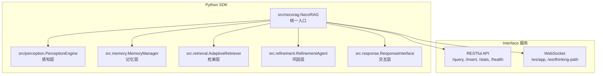
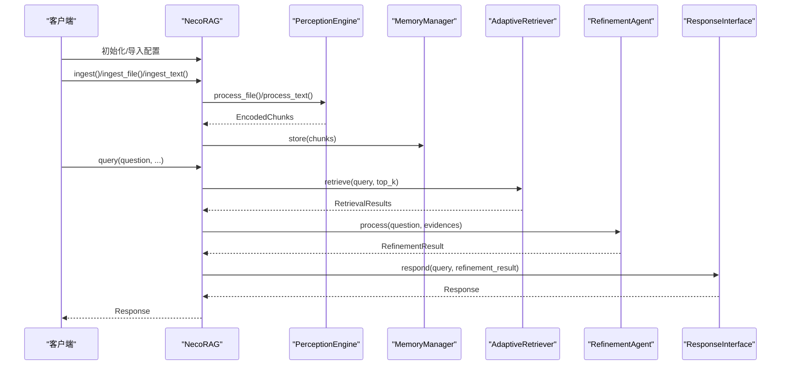
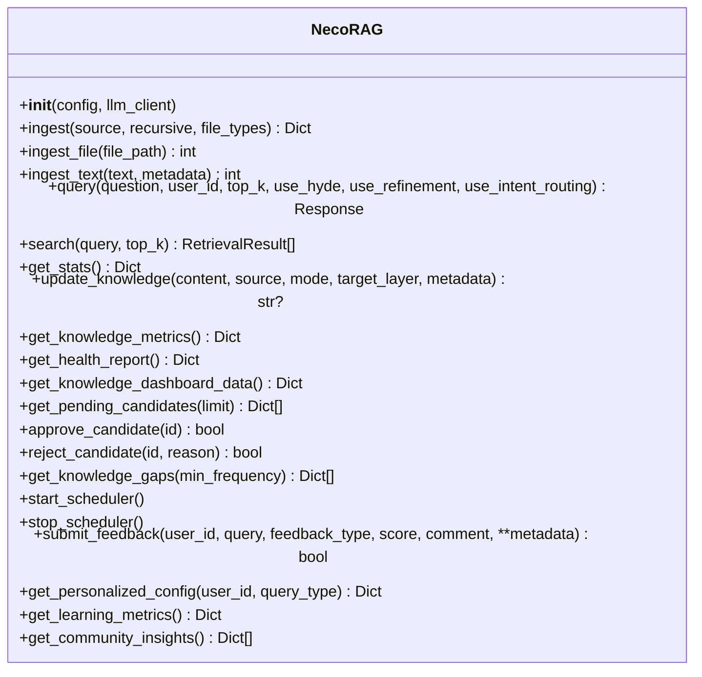
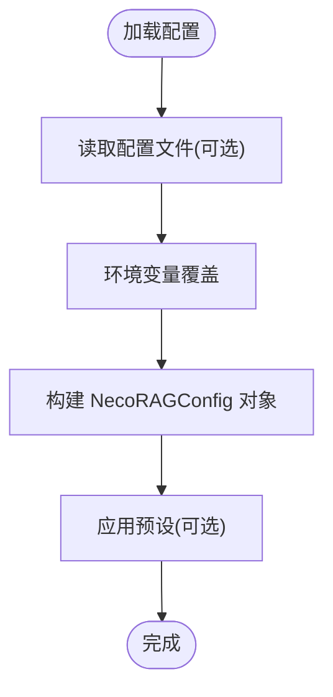
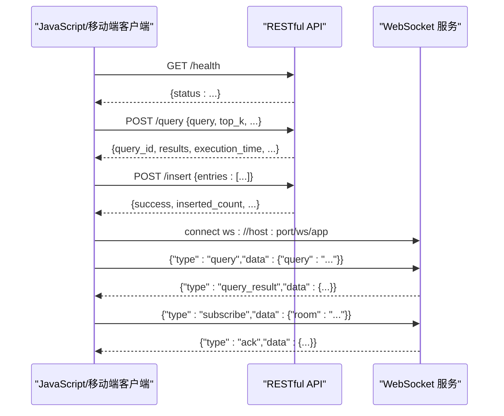
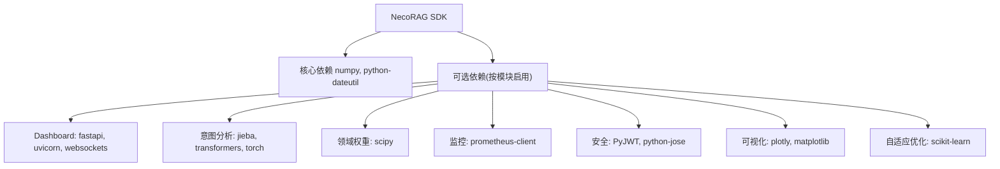

# 客户端SDK

<cite>
**本文引用的文件**
- [README.md](file://README.md)
- [QUICKSTART.md](file://QUICKSTART.md)
- [pyproject.toml](file://pyproject.toml)
- [requirements.txt](file://requirements.txt)
- [src/__init__.py](file://src/__init__.py)
- [src/necorag.py](file://src/necorag.py)
- [src/core/config.py](file://src/core/config.py)
- [src/core/exceptions.py](file://src/core/exceptions.py)
- [src/perception/__init__.py](file://src/perception/__init__.py)
- [src/memory/__init__.py](file://src/memory/__init__.py)
- [src/retrieval/__init__.py](file://src/retrieval/__init__.py)
- [interface/__init__.py](file://interface/__init__.py)
- [interface/knowledge_service.py](file://interface/knowledge_service.py)
- [interface/example_client.py](file://interface/example_client.py)
</cite>

## 目录
1. [简介](#简介)
2. [项目结构](#项目结构)
3. [核心组件](#核心组件)
4. [架构总览](#架构总览)
5. [详细组件分析](#详细组件分析)
6. [依赖分析](#依赖分析)
7. [性能考虑](#性能考虑)
8. [故障排查指南](#故障排查指南)
9. [结论](#结论)
10. [附录](#附录)

## 简介
本文件面向希望在多端（Python、JavaScript、移动端）集成 NecoRAG 客户端 SDK 的开发者，提供从安装配置、初始化、基本使用到高级特性（异步处理、回调设计、错误处理、版本与兼容性、升级迁移）的完整指南。文档同时涵盖 RESTful API 与 WebSocket 的客户端使用范式，并给出调试技巧、性能优化建议与常见问题解决方案。

## 项目结构
NecoRAG 提供两类主要客户端能力：
- Python SDK：通过统一入口类与模块化组件，提供端到端的文档导入、检索与响应生成能力。
- Interface 模块：提供 RESTful API 与 WebSocket 服务，便于跨语言客户端（如 JavaScript/移动端）接入。

**图示来源**
- [src/necorag.py:43-134](file://src/necorag.py#L43-L134)
- [src/perception/__init__.py:6-26](file://src/perception/__init__.py#L6-L26)
- [src/memory/__init__.py:6-28](file://src/memory/__init__.py#L6-L28)
- [src/retrieval/__init__.py:6-32](file://src/retrieval/__init__.py#L6-L32)
- [interface/knowledge_service.py:27-307](file://interface/knowledge_service.py#L27-L307)
- [interface/example_client.py:13-200](file://interface/example_client.py#L13-L200)

**章节来源**
- [README.md:165-258](file://README.md#L165-L258)
- [src/__init__.py:9-213](file://src/__init__.py#L9-L213)
- [interface/__init__.py:9-17](file://interface/__init__.py#L9-L17)

## 核心组件
- 统一入口类：NecoRAG，负责初始化与编排感知、记忆、检索、巩固、交互五大模块，并提供文档导入与查询接口。
- 配置系统：NecoRAGConfig 及各子配置类，支持从文件与环境变量加载，覆盖 LLM、感知、记忆、检索、巩固、响应、领域权重、知识演化等模块参数。
- 异常体系：统一的 NecoRAGError 及各模块异常，便于在客户端侧进行分类处理与降级。
- Interface 服务：提供 RESTful API 与 WebSocket，便于非 Python 客户端接入。

**章节来源**
- [src/necorag.py:43-134](file://src/necorag.py#L43-L134)
- [src/core/config.py:277-334](file://src/core/config.py#L277-L334)
- [src/core/exceptions.py:10-42](file://src/core/exceptions.py#L10-L42)
- [interface/knowledge_service.py:27-307](file://interface/knowledge_service.py#L27-L307)

## 架构总览
Python SDK 的调用流程如下：

**图示来源**
- [src/necorag.py:201-477](file://src/necorag.py#L201-L477)
- [src/perception/__init__.py:6-26](file://src/perception/__init__.py#L6-L26)
- [src/memory/__init__.py:6-28](file://src/memory/__init__.py#L6-L28)
- [src/retrieval/__init__.py:6-32](file://src/retrieval/__init__.py#L6-L32)

## 详细组件分析

### Python SDK：NecoRAG 统一入口
- 初始化与延迟加载：构造函数支持传入自定义配置与 LLM 客户端；内部延迟初始化五大模块与知识演化、自适应学习组件。
- 文档导入：支持目录批量导入、单文件导入与文本导入，自动分块与编码后写入记忆层。
- 查询流程：意图分析（可选）、HyDE 增强（可选）、检索、证据提取、答案精炼（可选）、响应生成与思维链可视化。
- 知识演化与自适应学习：提供知识更新、健康报告、待审候选、个性化配置、学习指标等 API。

**图示来源**
- [src/necorag.py:43-800](file://src/necorag.py#L43-L800)

**章节来源**
- [src/necorag.py:67-134](file://src/necorag.py#L67-L134)
- [src/necorag.py:201-301](file://src/necorag.py#L201-L301)
- [src/necorag.py:354-477](file://src/necorag.py#L354-L477)
- [src/necorag.py:558-722](file://src/necorag.py#L558-L722)
- [src/necorag.py:723-800](file://src/necorag.py#L723-L800)

### 配置系统与环境变量覆盖
- 全局配置：NecoRAGConfig，包含 LLM、感知、记忆、检索、巩固、响应、领域权重、知识演化等子配置。
- 预设配置：development、production、minimal 三种常用预设。
- 环境变量覆盖：支持通过环境变量覆盖关键配置项，优先级高于配置文件。

**图示来源**
- [src/core/config.py:338-377](file://src/core/config.py#L338-L377)
- [src/core/config.py:390-420](file://src/core/config.py#L390-L420)

**章节来源**
- [src/core/config.py:277-334](file://src/core/config.py#L277-L334)
- [src/core/config.py:338-377](file://src/core/config.py#L338-L377)
- [src/core/config.py:390-420](file://src/core/config.py#L390-L420)

### 异常处理与错误分类
- 统一异常基类：NecoRAGError，支持错误码与详情字段。
- 模块化异常：感知层、记忆层、检索层、巩固层、LLM、配置、知识演化、自适应学习等异常类型。
- 建议策略：在客户端侧捕获具体异常类型，记录错误码与详情，必要时进行降级或重试。

**章节来源**
- [src/core/exceptions.py:10-42](file://src/core/exceptions.py#L10-L42)
- [src/core/exceptions.py:46-93](file://src/core/exceptions.py#L46-L93)
- [src/core/exceptions.py:129-154](file://src/core/exceptions.py#L129-L154)
- [src/core/exceptions.py:205-252](file://src/core/exceptions.py#L205-L252)
- [src/core/exceptions.py:300-389](file://src/core/exceptions.py#L300-L389)
- [src/core/exceptions.py:393-455](file://src/core/exceptions.py#L393-L455)

### Interface 模块：RESTful API 与 WebSocket
- RESTful API：提供健康检查、知识查询、插入、更新、删除、统计信息等接口。
- WebSocket：支持查询、订阅/退订等实时推送场景。
- 客户端示例：包含同步与异步客户端示例，展示请求与响应处理。

**图示来源**
- [interface/knowledge_service.py:45-77](file://interface/knowledge_service.py#L45-L77)
- [interface/knowledge_service.py:78-147](file://interface/knowledge_service.py#L78-L147)
- [interface/example_client.py:19-51](file://interface/example_client.py#L19-L51)
- [interface/example_client.py:83-94](file://interface/example_client.py#L83-L94)

**章节来源**
- [interface/knowledge_service.py:27-307](file://interface/knowledge_service.py#L27-L307)
- [interface/example_client.py:13-200](file://interface/example_client.py#L13-L200)

### 模块导出与入口
- Python SDK 统一入口导出：NecoRAG、create_rag 以及核心模块与扩展模块。
- Interface 模块导出：RESTful 应用工厂、WebSocket 管理器、知识服务。

**章节来源**
- [src/__init__.py:9-213](file://src/__init__.py#L9-L213)
- [interface/__init__.py:9-17](file://interface/__init__.py#L9-L17)

## 依赖分析
- Python SDK 依赖：核心依赖 numpy、python-dateutil；可选依赖包括 FastAPI/Uvicorn/WebSocket、意图分析、领域权重、监控、安全、可视化、自适应优化等。
- Interface 服务依赖：FastAPI、Uvicorn、WebSockets 等。
- 依赖安装建议：按需安装，核心依赖满足基本功能，新增模块按需启用。

**图示来源**
- [requirements.txt:12-159](file://requirements.txt#L12-L159)
- [pyproject.toml:27-80](file://pyproject.toml#L27-L80)

**章节来源**
- [requirements.txt:12-159](file://requirements.txt#L12-L159)
- [pyproject.toml:27-80](file://pyproject.toml#L27-L80)

## 性能考虑
- 检索与重排序：合理设置 top_k、置信度阈值与重排序参数，避免过度检索导致延迟上升。
- 意图分析与 HyDE：在复杂查询场景启用意图路由与 HyDE 可提升命中率，但会增加一次嵌入生成成本。
- 记忆层：根据业务规模选择合适的向量/图数据库后端，注意 TTL、归档阈值与固化间隔。
- 响应层：思维链可视化与证据来源展示会增加输出体积，可在生产关闭或按需开启。
- 异步与并发：在高并发场景建议使用 WebSocket 实时推送与批量插入，减少长轮询带来的延迟。

[本节为通用指导，无需列出“章节来源”]

## 故障排查指南
- 常见问题定位
  - 依赖缺失：确保安装 requirements.txt 中的依赖，或按模块单独安装可选依赖。
  - 端口冲突：Dashboard 启动失败时检查端口占用并更换端口。
  - 配置覆盖：确认环境变量前缀与键名正确，避免被覆盖导致行为异常。
- 异常处理
  - 在客户端捕获具体异常类型，记录错误码与详情，必要时进行降级或重试。
  - 对 LLM 相关错误（连接、限流、响应）进行分类处理，设置合理的重试与退避策略。
- 日志与监控
  - 启用调试模式与日志输出，结合监控指标（CPU/内存/网络）定位瓶颈。
  - 使用 WebSocket 实时推送观察系统状态变化，辅助问题复现。

**章节来源**
- [QUICKSTART.md:297-348](file://QUICKSTART.md#L297-L348)
- [src/core/exceptions.py:205-252](file://src/core/exceptions.py#L205-L252)

## 结论
NecoRAG 客户端 SDK 提供了从 Python 到 RESTful/WS 的多端接入方案。通过统一入口类与模块化配置，开发者可以快速完成知识导入、检索与响应生成；通过 Interface 服务，可无缝对接 JavaScript/移动端客户端。建议在生产环境中结合监控与日志，按需启用意图分析、HyDE、思维链可视化等功能，并遵循错误处理与性能优化的最佳实践。

[本节为总结性内容，无需列出“章节来源”]

## 附录

### 安装与初始化
- 安装：克隆仓库后安装依赖，或通过包管理器安装发布版本。
- 初始化：创建 NecoRAG 实例，传入配置或使用默认预设；也可通过环境变量覆盖关键配置。

**章节来源**
- [README.md:167-179](file://README.md#L167-L179)
- [src/core/config.py:338-377](file://src/core/config.py#L338-L377)

### 基本使用（Python）
- 文档导入：支持目录批量导入、单文件导入与文本导入。
- 查询：可选择是否启用 HyDE、意图路由与答案精炼。
- 统计与诊断：获取统计信息、知识演化指标与健康报告。

**章节来源**
- [src/necorag.py:201-301](file://src/necorag.py#L201-L301)
- [src/necorag.py:354-477](file://src/necorag.py#L354-L477)
- [src/necorag.py:558-648](file://src/necorag.py#L558-L648)

### 基本使用（RESTful/WS）
- RESTful：健康检查、知识查询、插入、统计信息等。
- WebSocket：查询、订阅/退订等实时交互。

**章节来源**
- [interface/knowledge_service.py:45-77](file://interface/knowledge_service.py#L45-L77)
- [interface/knowledge_service.py:78-147](file://interface/knowledge_service.py#L78-L147)
- [interface/example_client.py:19-51](file://interface/example_client.py#L19-L51)
- [interface/example_client.py:83-94](file://interface/example_client.py#L83-L94)

### 异步处理与回调设计
- Python SDK：查询完成后触发知识积累回调与自适应学习回调，便于后续的自动化处理。
- RESTful/WS：通过 WebSocket 实时推送查询结果与系统状态，适合前端即时渲染与交互。

**章节来源**
- [src/necorag.py:479-495](file://src/necorag.py#L479-L495)
- [src/necorag.py:448-460](file://src/necorag.py#L448-L460)
- [interface/example_client.py:83-94](file://interface/example_client.py#L83-L94)

### 错误处理策略
- 分类捕获：对感知、记忆、检索、巩固、LLM、配置、知识演化、自适应学习等异常进行分类处理。
- 降级与重试：对网络类与限流类错误进行退避重试；对数据校验类错误进行提示与修正。
- 记录与上报：记录错误码与详情，结合日志与监控系统进行问题定位。

**章节来源**
- [src/core/exceptions.py:10-42](file://src/core/exceptions.py#L10-L42)
- [src/core/exceptions.py:205-252](file://src/core/exceptions.py#L205-L252)

### 版本管理、兼容性与升级迁移
- 版本号：当前项目版本与 SDK 版本信息可在项目元数据中查看。
- 兼容性：Python 版本要求与依赖范围在构建配置中声明。
- 升级迁移：建议先在开发环境验证，逐步替换旧配置与调用方式；关注新增模块（意图分析、领域权重、知识演化、监控、安全、自适应优化、插件系统、Interface 模块）的 API 变更。

**章节来源**
- [pyproject.toml:6-25](file://pyproject.toml#L6-L25)
- [README.md:29-29](file://README.md#L29-L29)

### 调试技巧与最佳实践
- 调试面板：通过 Dashboard 实时查看系统状态、统计信息与可视化图表。
- 性能优化：合理设置检索参数、启用必要的增强功能、使用 WebSocket 实时推送。
- 最佳实践：在生产关闭思维链可视化与证据来源展示；对 LLM 错误进行分类处理；定期检查知识库健康报告与学习指标。

**章节来源**
- [README.md:485-551](file://README.md#L485-L551)
- [QUICKSTART.md:127-156](file://QUICKSTART.md#L127-L156)