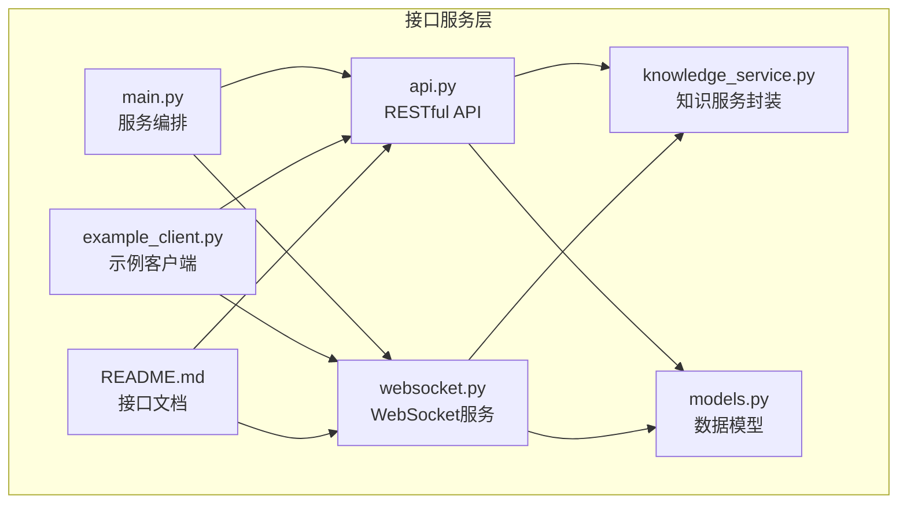
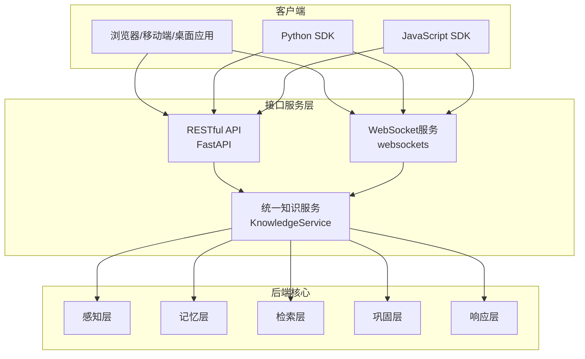
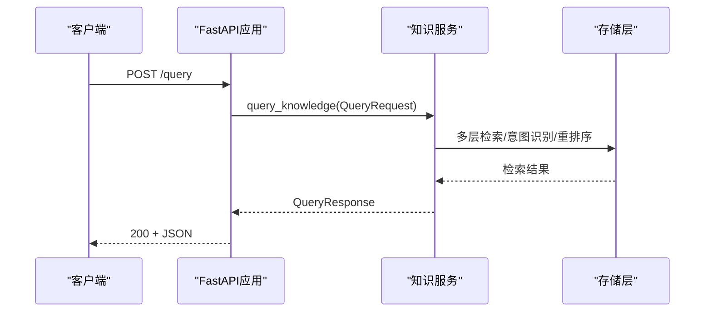
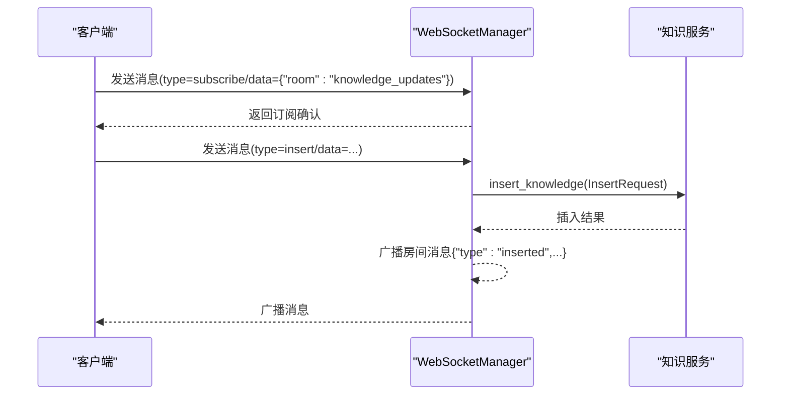
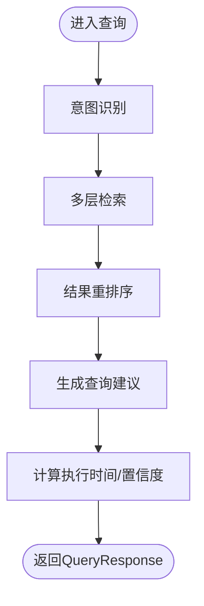
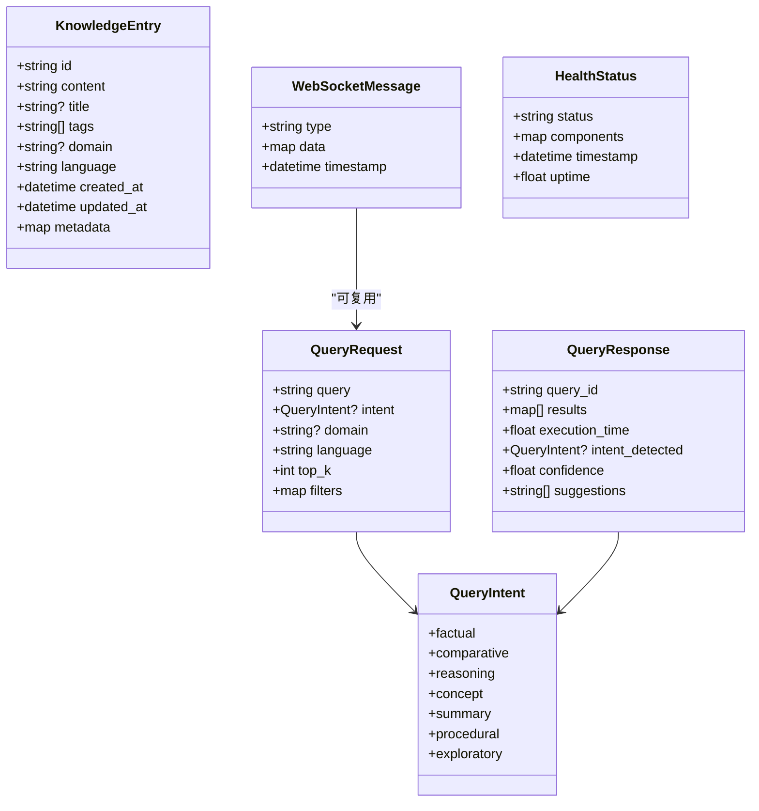
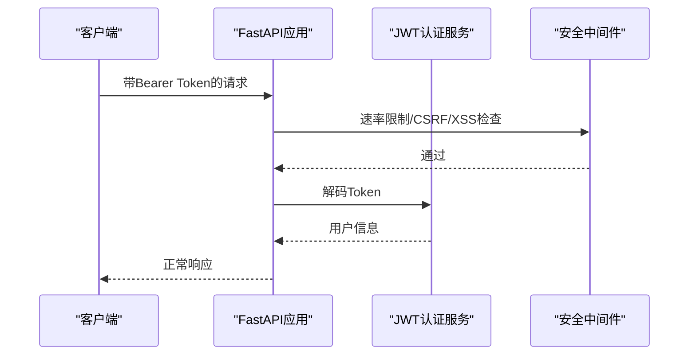
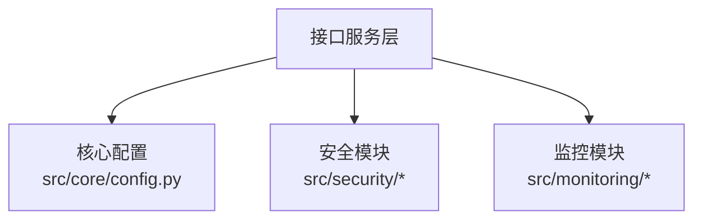

# 接口服务层

<cite>
**本文引用的文件**
- [interface/main.py](file://interface/main.py)
- [interface/api.py](file://interface/api.py)
- [interface/websocket.py](file://interface/websocket.py)
- [interface/knowledge_service.py](file://interface/knowledge_service.py)
- [interface/models.py](file://interface/models.py)
- [interface/example_client.py](file://interface/example_client.py)
- [interface/README.md](file://interface/README.md)
- [src/security/auth.py](file://src/security/auth.py)
- [src/security/config.py](file://src/security/config.py)
- [src/security/protection.py](file://src/security/protection.py)
- [src/security/models.py](file://src/security/models.py)
- [src/monitoring/metrics.py](file://src/monitoring/metrics.py)
- [src/monitoring/config.py](file://src/monitoring/config.py)
- [src/core/config.py](file://src/core/config.py)
- [src/core/exceptions.py](file://src/core/exceptions.py)
</cite>

## 目录
1. [引言](#引言)
2. [项目结构](#项目结构)
3. [核心组件](#核心组件)
4. [架构总览](#架构总览)
5. [详细组件分析](#详细组件分析)
6. [依赖分析](#依赖分析)
7. [性能考虑](#性能考虑)
8. [故障排除指南](#故障排除指南)
9. [结论](#结论)
10. [附录](#附录)

## 引言
本文件面向NecoRAG接口服务层，系统化阐述RESTful API的标准化设计、WebSocket实时推送机制与知识服务统一封装策略；并深入说明客户端SDK的多语言支持思路、API版本管理与兼容性保障、错误处理标准化方案、接口鉴权安全机制、请求限流性能保护以及监控指标集成方案。文档同时提供最佳实践、集成指南与故障排除方法，并给出完整的API参考、使用示例与客户端实现路径，帮助开发者快速集成和使用NecoRAG服务。

## 项目结构
接口服务层位于interface目录，核心由以下模块组成：
- 主入口与服务编排：interface/main.py
- RESTful API：interface/api.py
- WebSocket服务：interface/websocket.py
- 知识服务封装：interface/knowledge_service.py
- 数据模型：interface/models.py
- 示例客户端：interface/example_client.py
- 接口文档：interface/README.md

**图表来源**
- [interface/main.py:1-82](file://interface/main.py#L1-L82)
- [interface/api.py:1-162](file://interface/api.py#L1-L162)
- [interface/websocket.py:1-299](file://interface/websocket.py#L1-L299)
- [interface/knowledge_service.py:1-307](file://interface/knowledge_service.py#L1-L307)
- [interface/models.py:1-85](file://interface/models.py#L1-L85)
- [interface/example_client.py:1-200](file://interface/example_client.py#L1-L200)
- [interface/README.md:1-392](file://interface/README.md#L1-L392)

**章节来源**
- [interface/main.py:1-82](file://interface/main.py#L1-L82)
- [interface/README.md:1-392](file://interface/README.md#L1-L392)

## 核心组件
- RESTful API服务：提供健康检查、查询、插入、更新、删除、统计与查询建议等接口，采用FastAPI框架，内置CORS支持与统一异常处理。
- WebSocket服务：提供实时查询、插入、更新、删除、订阅/退订与心跳等消息类型，支持房间广播与错误消息推送。
- 知识服务封装：抽象知识库的核心操作流程（意图识别、多层检索、结果重排序、建议生成、统计信息等），作为API与WebSocket的统一后端。
- 数据模型：以Pydantic模型定义请求/响应结构，确保输入输出的强类型约束与校验。
- 示例客户端：提供Python与JavaScript的RESTful与WebSocket调用示例，便于快速集成。

**章节来源**
- [interface/api.py:19-152](file://interface/api.py#L19-L152)
- [interface/websocket.py:18-294](file://interface/websocket.py#L18-L294)
- [interface/knowledge_service.py:27-307](file://interface/knowledge_service.py#L27-L307)
- [interface/models.py:11-85](file://interface/models.py#L11-L85)
- [interface/example_client.py:13-200](file://interface/example_client.py#L13-L200)

## 架构总览
接口服务层同时提供RESTful API与WebSocket两类接入方式，二者共享同一知识服务封装层，实现“统一模型、双通道接入”的架构设计。

**图表来源**
- [interface/api.py:19-152](file://interface/api.py#L19-L152)
- [interface/websocket.py:18-294](file://interface/websocket.py#L18-L294)
- [interface/knowledge_service.py:27-307](file://interface/knowledge_service.py#L27-L307)

## 详细组件分析

### RESTful API 设计与实现
- 路由与端点
  - 根路径与健康检查：/、/health
  - 知识操作：/query、/insert、/update、/delete
  - 统计与建议：/stats、/suggestions/{query}
- 统一异常处理：捕获内部异常并返回标准HTTP 500错误，确保前后端一致的错误体验。
- CORS配置：允许任意来源、方法与头，便于跨域调试与多端接入。
- 文档：集成Swagger（/docs）与ReDoc（/redoc）。

**图表来源**
- [interface/api.py:73-84](file://interface/api.py#L73-L84)
- [interface/knowledge_service.py:45-72](file://interface/knowledge_service.py#L45-L72)

**章节来源**
- [interface/api.py:19-152](file://interface/api.py#L19-L152)
- [interface/README.md:77-119](file://interface/README.md#L77-L119)

### WebSocket 实时推送机制
- 连接管理：维护客户端集合与房间集合，支持订阅/退订与广播。
- 消息路由：根据消息类型分派至查询、插入、更新、删除或心跳处理。
- 广播机制：插入/更新/删除成功后向“知识更新”房间广播事件，实现多客户端实时同步。
- 错误处理：对无效JSON与处理异常返回统一错误消息格式。

**图表来源**
- [interface/websocket.py:68-88](file://interface/websocket.py#L68-L88)
- [interface/websocket.py:110-134](file://interface/websocket.py#L110-L134)
- [interface/websocket.py:232-244](file://interface/websocket.py#L232-L244)

**章节来源**
- [interface/websocket.py:18-294](file://interface/websocket.py#L18-L294)
- [interface/README.md:121-177](file://interface/README.md#L121-L177)

### 知识服务统一封装策略
- 查询流程：意图识别 → 多层检索 → 结果重排序 → 建议生成 → 统计执行耗时与置信度。
- 批量操作：插入/删除支持批量处理，分别返回成功/失败统计与明细。
- 统计聚合：从各层汇总总数、领域分布、语言分布、最近更新与健康状态。
- 可扩展性：预留多层检索、重排序、巩固与关系更新等异步处理钩子。

**图表来源**
- [interface/knowledge_service.py:45-72](file://interface/knowledge_service.py#L45-L72)
- [interface/knowledge_service.py:222-239](file://interface/knowledge_service.py#L222-L239)

**章节来源**
- [interface/knowledge_service.py:27-307](file://interface/knowledge_service.py#L27-L307)

### 数据模型与API参考
- 查询意图枚举：涵盖事实、比较、推理、概念、摘要、过程、探索等类型。
- 核心模型：QueryRequest/QueryResponse、InsertRequest、UpdateRequest、DeleteRequest、KnowledgeEntry、WebSocketMessage、HealthStatus。
- 统一字段约束：默认语言、过滤条件、时间戳、元数据等，确保跨接口一致性。

**图表来源**
- [interface/models.py:11-85](file://interface/models.py#L11-L85)

**章节来源**
- [interface/models.py:11-85](file://interface/models.py#L11-L85)
- [interface/README.md:179-216](file://interface/README.md#L179-L216)

### 客户端SDK与多语言支持
- Python示例：提供RESTful与WebSocket客户端类，演示健康检查、查询、插入、订阅/退订等常用操作。
- JavaScript示例：展示通过fetch与原生WebSocket进行调用的方式。
- 多语言建议：遵循统一数据模型与消息格式，任何语言均可通过HTTP与WebSocket协议对接。

**章节来源**
- [interface/example_client.py:13-200](file://interface/example_client.py#L13-L200)
- [interface/README.md:312-384](file://interface/README.md#L312-L384)

### API版本管理与兼容性
- 当前版本：在FastAPI应用中声明版本号，便于前端与SDK识别。
- 兼容性策略：保持请求/响应字段稳定，新增字段采用可选方式；对破坏性变更通过新版本端点或前缀区分。
- 文档演进：通过OpenAPI/Swagger/ReDoc自动同步，确保接口文档与实现一致。

**章节来源**
- [interface/api.py:21-27](file://interface/api.py#L21-L27)
- [interface/README.md:77-94](file://interface/README.md#L77-L94)

### 错误处理标准化方案
- RESTful：捕获异常并返回HTTP 500与统一错误体，便于前端统一处理。
- WebSocket：对无效JSON与处理异常返回统一错误消息格式，包含类型、数据与时间戳。
- 统一异常基类：核心层提供NecoRAGError及其子类，便于上层捕获与分类处理。

**章节来源**
- [interface/api.py:79-84](file://interface/api.py#L79-L84)
- [interface/websocket.py:62-66](file://interface/websocket.py#L62-L66)
- [src/core/exceptions.py:10-455](file://src/core/exceptions.py#L10-L455)

### 接口鉴权与安全机制
- 认证服务：支持JWT与OAuth2，提供密码哈希、强度校验、令牌签发与解码、用户依赖注入等能力。
- 安全中间件：提供速率限制、CSRF防护、XSS防护与综合性安全中间件组合，可按需启用。
- 配置管理：从环境变量加载密钥、算法、过期时间、提供商配置与防护开关。

**图表来源**
- [src/security/auth.py:56-132](file://src/security/auth.py#L56-L132)
- [src/security/protection.py:36-196](file://src/security/protection.py#L36-L196)
- [src/security/config.py:17-83](file://src/security/config.py#L17-L83)

**章节来源**
- [src/security/auth.py:23-210](file://src/security/auth.py#L23-L210)
- [src/security/protection.py:12-196](file://src/security/protection.py#L12-L196)
- [src/security/config.py:11-92](file://src/security/config.py#L11-L92)
- [src/security/models.py:38-101](file://src/security/models.py#L38-L101)

### 请求限流与性能保护
- 速率限制：基于内存的滑动窗口计数，支持按客户端IP与时间窗口配置。
- 安全中间件：可组合启用，统一拦截高风险请求，降低DoS与滥用风险。
- 监控指标：结合系统与应用指标收集器，记录API调用耗时、成功率与缓存命中等。

**章节来源**
- [src/security/protection.py:36-67](file://src/security/protection.py#L36-L67)
- [src/monitoring/metrics.py:177-203](file://src/monitoring/metrics.py#L177-L203)

### 监控指标集成方案
- 系统指标：CPU、内存、磁盘、网络、进程数与运行时GC等。
- 应用指标：RAG响应时间、API调用次数与耗时、缓存操作、模型推理耗时等。
- 导出格式：Prometheus文本格式，便于Prometheus抓取与Grafana可视化。

**章节来源**
- [src/monitoring/metrics.py:25-203](file://src/monitoring/metrics.py#L25-L203)
- [src/monitoring/config.py:27-117](file://src/monitoring/config.py#L27-L117)

## 依赖分析
接口服务层与核心配置、安全与监控模块存在松耦合依赖关系，通过统一配置与依赖注入实现解耦。

**图表来源**
- [src/core/config.py:278-334](file://src/core/config.py#L278-L334)
- [src/security/auth.py:23-132](file://src/security/auth.py#L23-L132)
- [src/monitoring/metrics.py:25-95](file://src/monitoring/metrics.py#L25-L95)

**章节来源**
- [src/core/config.py:338-377](file://src/core/config.py#L338-L377)
- [src/security/config.py:17-83](file://src/security/config.py#L17-L83)
- [src/monitoring/config.py:72-109](file://src/monitoring/config.py#L72-L109)

## 性能考虑
- 响应时间目标：查询<800ms、插入<500ms、更新<300ms、删除<200ms。
- 并发能力：支持千级并发连接与高吞吐查询，建议配合反向代理与负载均衡。
- 批量操作：插入/删除支持批量处理，提升吞吐并降低网络开销。
- 缓存与重排序：结合检索层的重排序与缓存策略，减少重复计算。

**章节来源**
- [interface/README.md:218-229](file://interface/README.md#L218-L229)

## 故障排除指南
- 健康检查失败：查看/health响应中的组件状态与时间戳，定位知识服务与存储层健康状况。
- WebSocket连接异常：确认消息格式、订阅房间与心跳；检查广播房间是否存在断连清理。
- RESTful请求报错：关注HTTP 500与错误详情，结合后端日志定位具体异常类型。
- 安全相关问题：检查速率限制阈值、CSRF Token与CORS配置；核对JWT密钥与算法。
- 监控告警：依据监控阈值与告警渠道，排查CPU/内存/磁盘与RAG响应时间异常。

**章节来源**
- [interface/api.py:49-71](file://interface/api.py#L49-L71)
- [interface/websocket.py:268-283](file://interface/websocket.py#L268-L283)
- [src/monitoring/config.py:52-63](file://src/monitoring/config.py#L52-L63)

## 结论
接口服务层通过RESTful API与WebSocket双通道，统一抽象知识服务，提供标准化的数据模型与错误处理机制；结合安全中间件与监控指标，形成可扩展、可运维、可观测的完整接口体系。开发者可基于示例客户端快速集成，并依托统一配置与异常体系实现稳定可靠的生产级接入。

## 附录
- 快速开始与部署：参见接口文档中的安装、启动与Docker部署建议。
- API参考与示例：参见接口文档中的端点清单、消息格式与多语言示例。

**章节来源**
- [interface/README.md:52-311](file://interface/README.md#L52-L311)