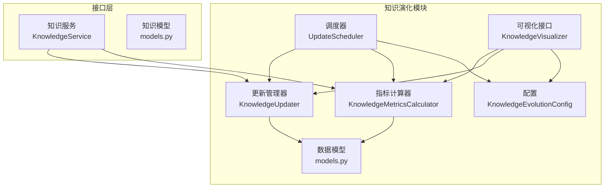
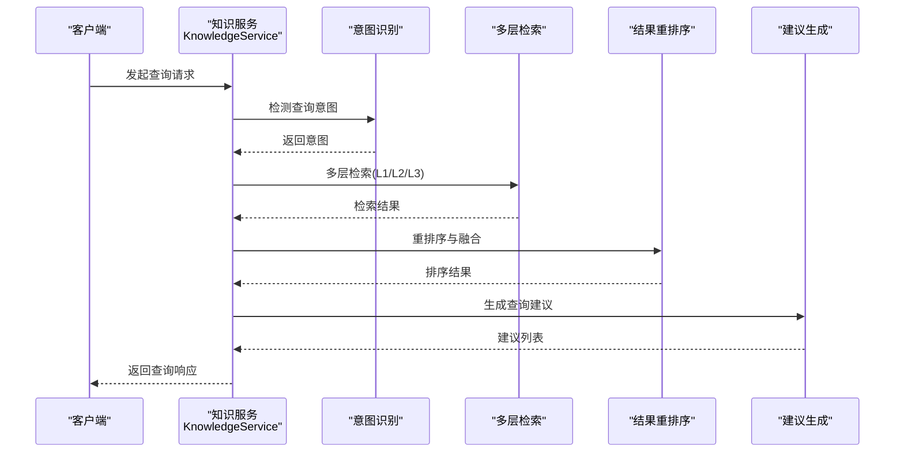
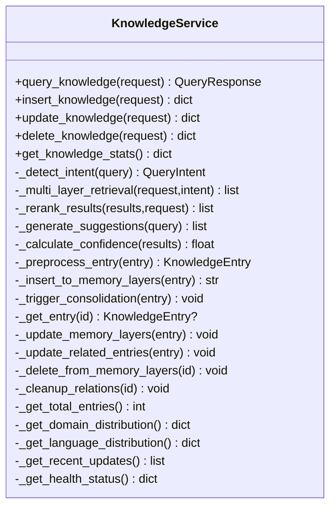
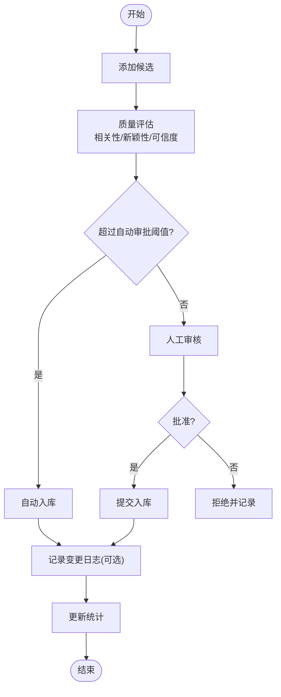
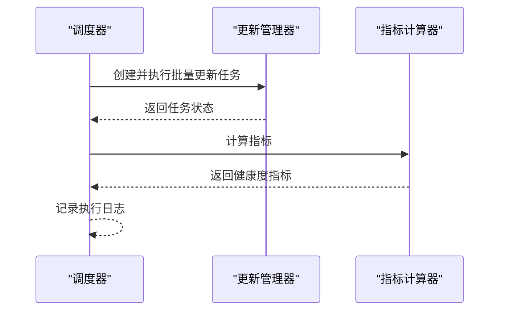
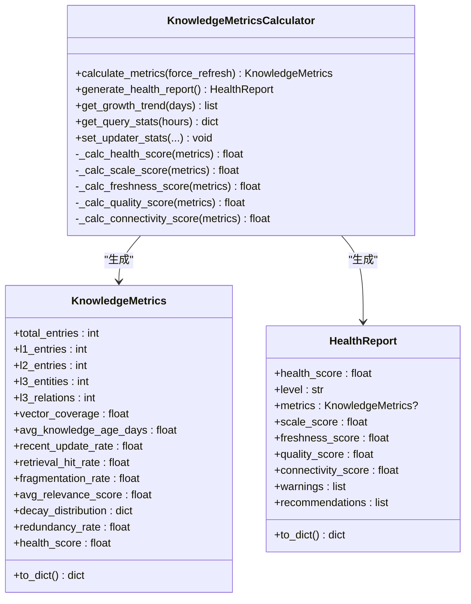
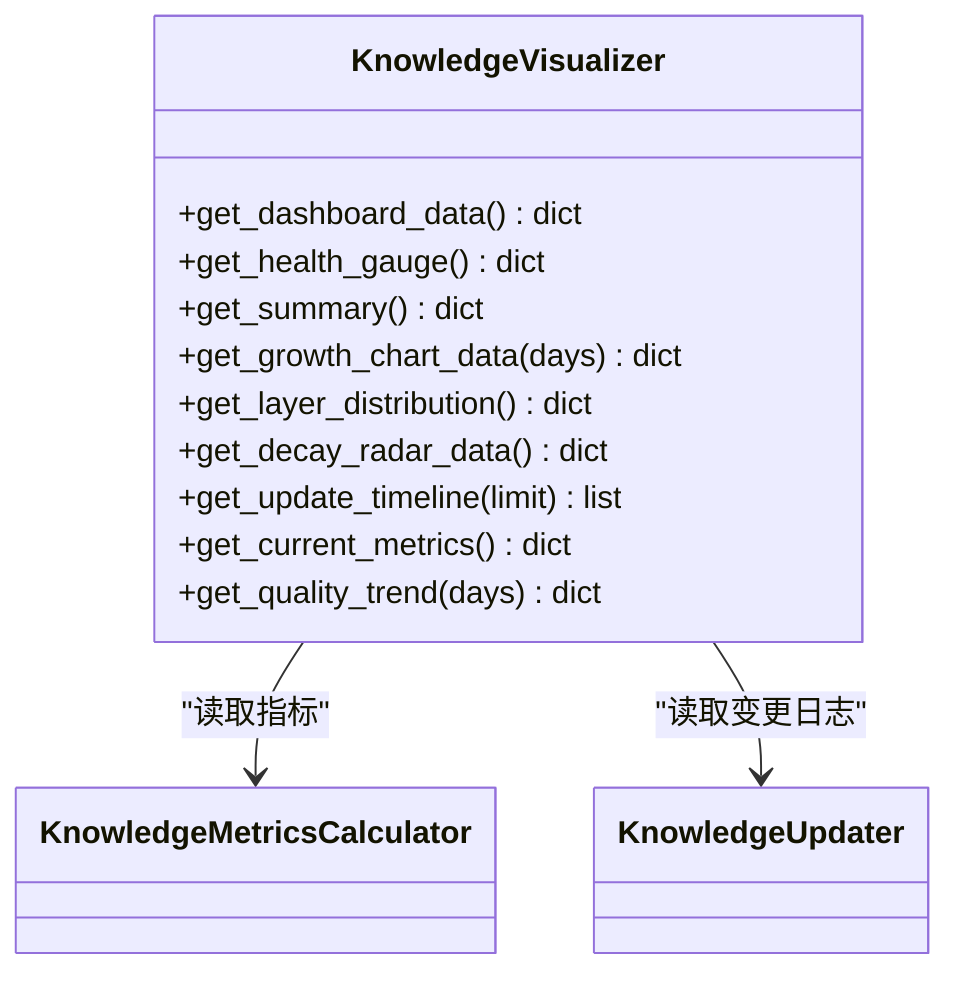
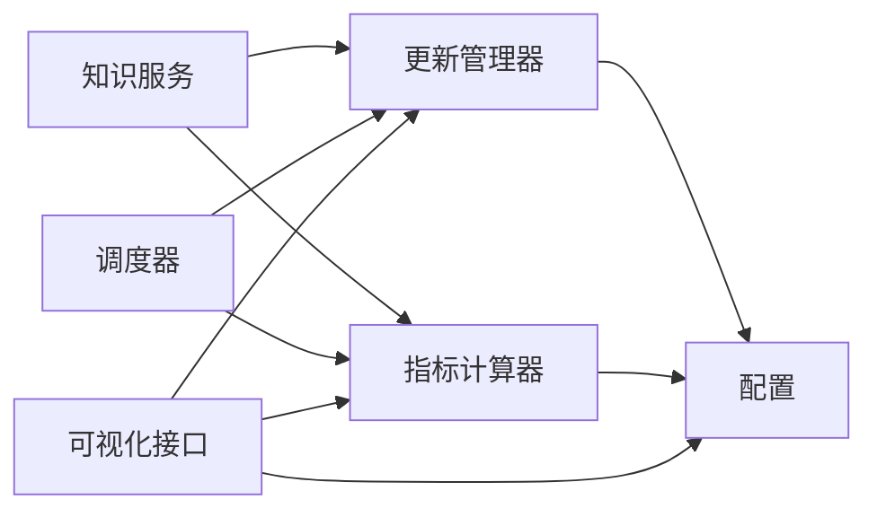

# 知识服务封装

<cite>
**本文引用的文件**
- [interface/knowledge_service.py](file://interface/knowledge_service.py)
- [src/knowledge_evolution/__init__.py](file://src/knowledge_evolution/__init__.py)
- [src/knowledge_evolution/models.py](file://src/knowledge_evolution/models.py)
- [src/knowledge_evolution/updater.py](file://src/knowledge_evolution/updater.py)
- [src/knowledge_evolution/scheduler.py](file://src/knowledge_evolution/scheduler.py)
- [src/knowledge_evolution/config.py](file://src/knowledge_evolution/config.py)
- [src/knowledge_evolution/metrics.py](file://src/knowledge_evolution/metrics.py)
- [src/knowledge_evolution/visualizer.py](file://src/knowledge_evolution/visualizer.py)
</cite>

## 目录
1. [简介](#简介)
2. [项目结构](#项目结构)
3. [核心组件](#核心组件)
4. [架构总览](#架构总览)
5. [详细组件分析](#详细组件分析)
6. [依赖分析](#依赖分析)
7. [性能考量](#性能考量)
8. [故障排查指南](#故障排查指南)
9. [结论](#结论)
10. [附录](#附录)

## 简介
本文件面向“知识服务封装层”的技术文档，聚焦于知识库的抽象设计、服务接口定义与业务逻辑封装。文档围绕知识查询、插入、更新、删除等核心操作，解释服务层与底层存储系统的解耦设计、事务处理机制与并发控制策略；同时给出服务配置选项、性能调优参数与监控指标设置，并提供服务集成最佳实践、错误处理模式与扩展开发指南，帮助开发者在不同环境中部署与使用知识服务。

## 项目结构
知识服务封装层主要由以下模块构成：
- 接口层：对外暴露的知识服务接口与请求/响应模型
- 知识演化模块：负责知识的实时/批量更新、候选池管理、变更日志、调度与健康度指标计算
- 可视化接口：为仪表盘提供统一的数据格式

图表来源
- [interface/knowledge_service.py:27-307](file://interface/knowledge_service.py#L27-L307)
- [src/knowledge_evolution/updater.py:24-800](file://src/knowledge_evolution/updater.py#L24-L800)
- [src/knowledge_evolution/scheduler.py:124-688](file://src/knowledge_evolution/scheduler.py#L124-L688)
- [src/knowledge_evolution/config.py:15-222](file://src/knowledge_evolution/config.py#L15-L222)
- [src/knowledge_evolution/metrics.py:21-725](file://src/knowledge_evolution/metrics.py#L21-L725)
- [src/knowledge_evolution/visualizer.py:18-599](file://src/knowledge_evolution/visualizer.py#L18-L599)
- [src/knowledge_evolution/models.py:1-367](file://src/knowledge_evolution/models.py#L1-L367)

章节来源
- [interface/knowledge_service.py:1-307](file://interface/knowledge_service.py#L1-L307)
- [src/knowledge_evolution/__init__.py:1-133](file://src/knowledge_evolution/__init__.py#L1-L133)

## 核心组件
- 知识服务核心类：封装查询、插入、更新、删除、统计等操作流程，负责意图识别、多层检索、结果重排序、置信度计算与建议生成等。
- 知识更新管理器：负责候选条目质量评估、自动/人工审批、实时与批量更新、增量更新（L2/L3）、变更日志与回滚。
- 调度器：支持间隔与定时调度的批处理任务，支持 APScheduler 适配器。
- 指标计算器：持续计算知识库健康度指标，生成健康报告与趋势数据。
- 可视化接口：输出仪表盘所需的健康度、增长曲线、层级分布、衰减雷达、更新时间线等数据。
- 配置类：集中管理知识演化模块的策略与阈值，提供默认/积极/保守/最小配置。

章节来源
- [interface/knowledge_service.py:27-307](file://interface/knowledge_service.py#L27-L307)
- [src/knowledge_evolution/updater.py:24-800](file://src/knowledge_evolution/updater.py#L24-L800)
- [src/knowledge_evolution/scheduler.py:124-688](file://src/knowledge_evolution/scheduler.py#L124-L688)
- [src/knowledge_evolution/config.py:15-222](file://src/knowledge_evolution/config.py#L15-L222)
- [src/knowledge_evolution/metrics.py:21-725](file://src/knowledge_evolution/metrics.py#L21-L725)
- [src/knowledge_evolution/visualizer.py:18-599](file://src/knowledge_evolution/visualizer.py#L18-L599)

## 架构总览
知识服务封装层采用“服务层 + 知识演化模块 + 可视化接口”的分层设计，服务层通过意图识别与多层检索协调知识演化模块完成知识的查询与更新；调度器定期执行批处理任务；指标计算器与可视化接口提供健康度与趋势展示。

图表来源
- [interface/knowledge_service.py:45-72](file://interface/knowledge_service.py#L45-L72)

## 详细组件分析

### 知识服务核心类（服务层）
- 职责边界：对外暴露查询、插入、更新、删除、统计等接口；内部编排意图识别、检索、重排序、建议生成与统计采集。
- 关键流程：
  - 查询：意图识别 → 多层检索 → 结果重排序 → 建议生成 → 统计执行时间与置信度。
  - 插入：逐条预处理与校验 → 写入各记忆层 → 触发巩固 → 统计成功/失败。
  - 更新：存在性校验 → 部分/全量更新 → 同步至各层 → 更新关联项 → 统计更新字段。
  - 删除：逐条存在性校验 → 从各层删除 → 清理关系 → 统计成功/失败。
  - 统计：汇总总条目、领域/语言分布、最近更新、健康状态等。
- 解耦设计：服务层不直接操作存储，而是通过私有方法桥接到各层实现，便于替换与扩展。
- 错误处理：捕获异常并记录日志，向上抛出，保证调用方可见失败原因。

图表来源
- [interface/knowledge_service.py:27-307](file://interface/knowledge_service.py#L27-L307)

章节来源
- [interface/knowledge_service.py:27-307](file://interface/knowledge_service.py#L27-L307)

### 知识更新管理器（知识演化）
- 候选池管理：添加候选、质量评估（相关性/新颖性/可信度）、自动/人工审批、池容量清理。
- 实时更新：按阈值快速入库，支持变更日志与回调。
- 批量更新：创建任务、执行任务、统计处理/失败数量。
- 增量更新：针对 L2 向量与 L3 图谱的增量写入。
- 变更日志与回滚：记录操作、限定回滚窗口、执行回滚并记录回滚日志。
- 查询驱动知识积累：记录查询、检测知识缺口、收集高质量回答进入候选池。

图表来源
- [src/knowledge_evolution/updater.py:82-358](file://src/knowledge_evolution/updater.py#L82-L358)

章节来源
- [src/knowledge_evolution/updater.py:24-800](file://src/knowledge_evolution/updater.py#L24-L800)

### 调度器（定时任务）
- 支持间隔与每日固定时间两种调度方式；可启用/禁用任务、手动触发、查看执行日志与状态。
- 默认任务：批量更新、索引重建、指标计算。
- APScheduler 适配器：可选集成 APScheduler，提供更强大的调度能力。

图表来源
- [src/knowledge_evolution/scheduler.py:169-320](file://src/knowledge_evolution/scheduler.py#L169-L320)

章节来源
- [src/knowledge_evolution/scheduler.py:124-688](file://src/knowledge_evolution/scheduler.py#L124-L688)

### 指标计算器（健康度与趋势）
- 指标维度：规模、新鲜度、质量、连通性、活跃度。
- 计算方法：基于内存管理器统计、查询日志与候选池状态，结合权重计算综合健康分。
- 输出：健康报告、历史指标、增长趋势、查询统计、维度雷达图等。

图表来源
- [src/knowledge_evolution/metrics.py:21-725](file://src/knowledge_evolution/metrics.py#L21-L725)
- [src/knowledge_evolution/models.py:194-310](file://src/knowledge_evolution/models.py#L194-L310)

章节来源
- [src/knowledge_evolution/metrics.py:21-725](file://src/knowledge_evolution/metrics.py#L21-L725)
- [src/knowledge_evolution/models.py:1-367](file://src/knowledge_evolution/models.py#L1-L367)

### 可视化接口（仪表盘数据）
- 提供健康度仪表盘、摘要、增长曲线、层级分布、衰减雷达、更新时间线、当前指标、质量趋势等。
- 与指标计算器与更新管理器解耦，按需组装数据。

图表来源
- [src/knowledge_evolution/visualizer.py:18-599](file://src/knowledge_evolution/visualizer.py#L18-L599)

章节来源
- [src/knowledge_evolution/visualizer.py:18-599](file://src/knowledge_evolution/visualizer.py#L18-L599)

## 依赖分析
- 服务层依赖知识演化模块的候选评估、变更日志与更新能力；通过私有方法桥接，避免直接耦合具体存储实现。
- 调度器依赖更新管理器与指标计算器；支持 APScheduler 适配器以提升调度能力。
- 可视化接口依赖指标计算器与更新管理器，提供统一数据格式。
- 配置类贯穿更新、调度、指标与可视化，提供策略与阈值控制。

图表来源
- [interface/knowledge_service.py:27-307](file://interface/knowledge_service.py#L27-L307)
- [src/knowledge_evolution/updater.py:24-800](file://src/knowledge_evolution/updater.py#L24-L800)
- [src/knowledge_evolution/scheduler.py:124-688](file://src/knowledge_evolution/scheduler.py#L124-L688)
- [src/knowledge_evolution/metrics.py:21-725](file://src/knowledge_evolution/metrics.py#L21-L725)
- [src/knowledge_evolution/visualizer.py:18-599](file://src/knowledge_evolution/visualizer.py#L18-L599)
- [src/knowledge_evolution/config.py:15-222](file://src/knowledge_evolution/config.py#L15-L222)

章节来源
- [src/knowledge_evolution/__init__.py:1-133](file://src/knowledge_evolution/__init__.py#L1-L133)

## 性能考量
- 查询路径优化
  - 多层检索与结果重排序：建议在检索层引入缓存与索引优化，减少重复计算。
  - 置信度与建议生成：可采用轻量规则或缓存热点查询的建议。
- 写入路径优化
  - 候选池容量与清理策略：合理设置候选池上限与淘汰比例，避免内存压力。
  - 批量更新：合并写入批次，减少索引重建与图谱维护开销。
- 指标计算缓存
  - 指标计算器支持 TTL 缓存，降低高频查询成本。
- 调度策略
  - 批量更新与索引重建采用间隔或定时调度，避开业务高峰期。
- 并发与事务
  - 建议在存储层实现幂等写入与事务保障；服务层通过唯一标识与回滚日志实现最终一致性。

## 故障排查指南
- 查询失败
  - 检查意图识别与检索链路日志；确认检索后端可用性与索引状态。
- 写入失败
  - 查看候选评估结果与阈值配置；核对变更日志与回滚窗口；定位具体条目错误。
- 批量任务异常
  - 查看调度器执行日志与任务状态；检查任务创建与执行过程中的异常堆栈。
- 指标异常
  - 核对指标计算器的统计来源（内存管理器、查询日志、候选池）；检查缓存与历史数据长度。
- 可视化数据缺失
  - 确认指标计算器与更新管理器是否正确初始化；检查数据组装逻辑。

章节来源
- [src/knowledge_evolution/updater.py:626-694](file://src/knowledge_evolution/updater.py#L626-L694)
- [src/knowledge_evolution/scheduler.py:382-394](file://src/knowledge_evolution/scheduler.py#L382-L394)
- [src/knowledge_evolution/metrics.py:66-135](file://src/knowledge_evolution/metrics.py#L66-L135)
- [src/knowledge_evolution/visualizer.py:49-66](file://src/knowledge_evolution/visualizer.py#L49-L66)

## 结论
知识服务封装层通过清晰的职责划分与解耦设计，实现了知识查询、写入、更新、删除与健康度监控的完整闭环。服务层专注于业务流程编排，知识演化模块负责质量与策略控制，调度器与可视化接口提供运行时可观测性。配合完善的配置与监控，可在不同环境中稳定部署并持续演进。

## 附录

### 服务配置选项与调优参数
- 实时更新
  - 是否启用实时更新、实时质量阈值、候选池最大容量、自动审批阈值
- 定时更新
  - 是否启用定时更新、批量更新间隔、每日执行时间、索引重建间隔
- 变更日志与回滚
  - 是否启用变更日志、变更日志最大条目、是否启用回滚、回滚窗口（小时）
- 指标计算
  - 指标计算间隔、健康预警/严重阈值、指标历史保留数量
- 查询日志
  - 是否启用查询日志、查询日志最大条目、命中阈值
- 权重配置
  - 健康度维度权重、候选评估权重
- 知识积累
  - 是否启用查询驱动知识积累、是否积累高质量回答、最低回答置信度、是否启用知识缺口检测

章节来源
- [src/knowledge_evolution/config.py:15-222](file://src/knowledge_evolution/config.py#L15-L222)

### 监控指标设置
- 健康度指标：规模、新鲜度、质量、连通性、活跃度、综合健康分
- 查询统计：命中率、平均置信度、平均延迟、今日查询总量
- 增长趋势：日新增/删除/净增长、累计条目
- 候选池状态：待审核数量、今日实时/批量更新数

章节来源
- [src/knowledge_evolution/metrics.py:66-135](file://src/knowledge_evolution/metrics.py#L66-L135)
- [src/knowledge_evolution/models.py:194-310](file://src/knowledge_evolution/models.py#L194-L310)

### 集成最佳实践
- 服务层与存储解耦：通过抽象接口与私有桥接方法隔离存储细节，便于替换与扩展。
- 分层治理：服务层只负责编排，更新与指标计算独立为模块，调度器统一管理任务生命周期。
- 配置即策略：通过配置类集中管理策略与阈值，支持默认/积极/保守/最小配置，满足不同场景。
- 可观测性：开启变更日志与查询日志，结合可视化接口与健康报告，形成闭环监控。

### 错误处理模式
- 服务层：捕获异常并记录日志，向上抛出，保证调用方可见失败原因。
- 更新管理器：单条写入失败不影响整体流程，记录失败条目与错误信息。
- 调度器：任务执行异常记录日志与错误次数，支持手动触发与禁用任务。
- 指标计算：异常时返回默认值并记录日志，避免阻塞主流程。

### 扩展开发指南
- 新增存储后端：在服务层通过私有方法桥接新存储接口，保持对外 API 不变。
- 新增调度任务：使用调度器注册自定义任务，或集成 APScheduler 适配器。
- 新增健康度维度：在指标计算器中扩展维度计算与权重，更新健康报告生成逻辑。
- 新增可视化组件：在可视化接口中新增数据组装方法，输出统一格式供前端渲染。