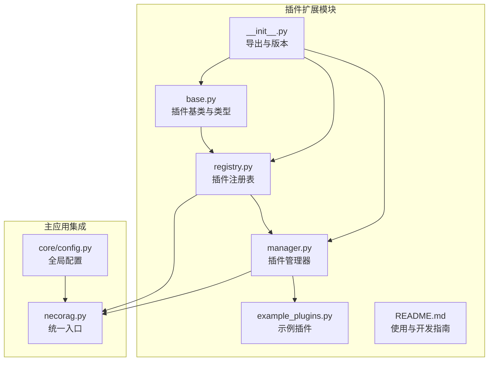
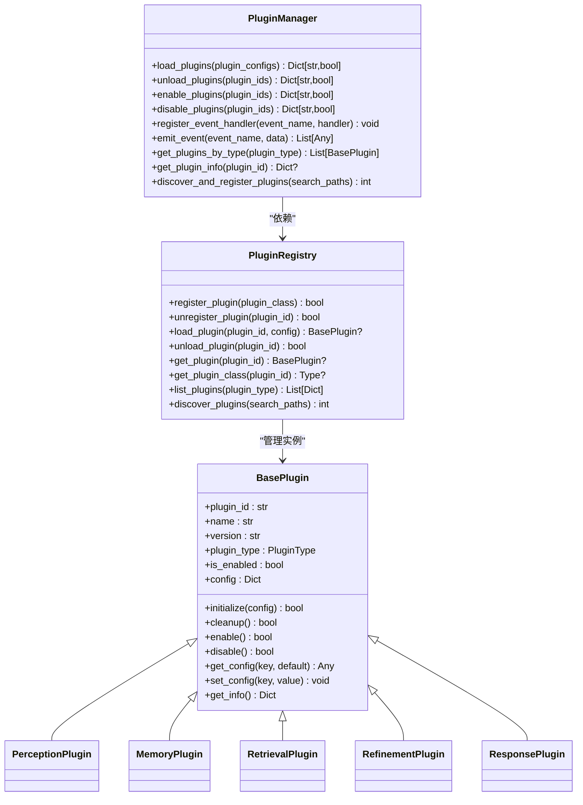
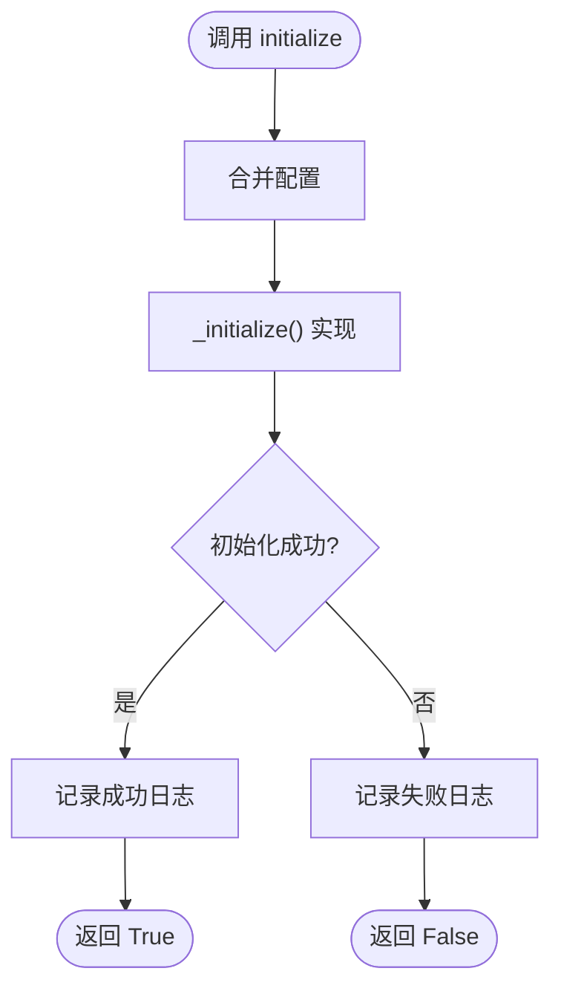
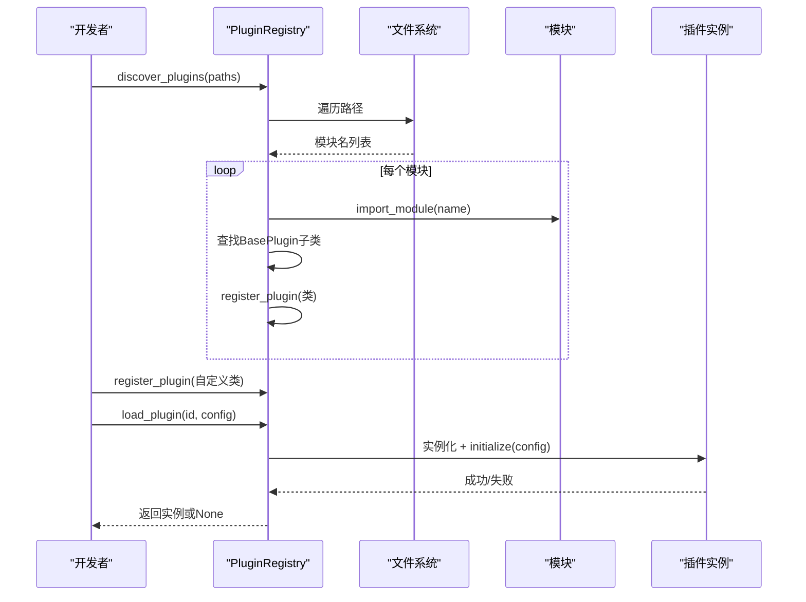
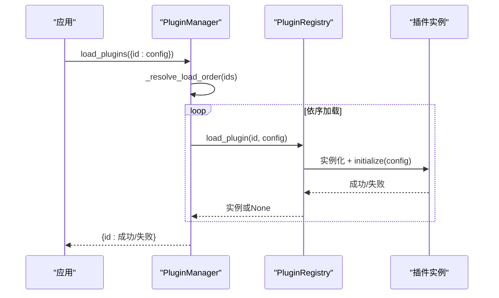
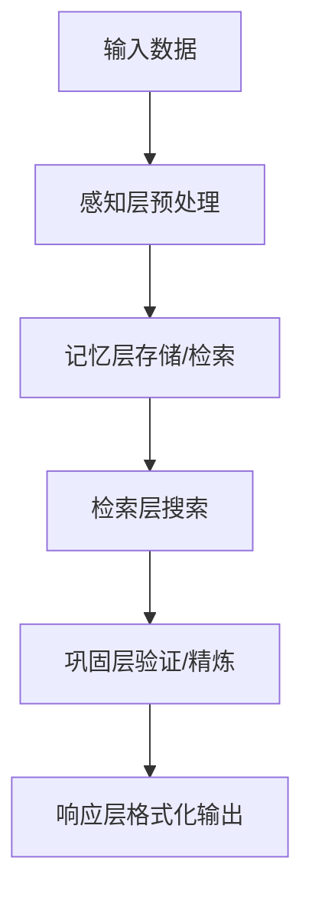
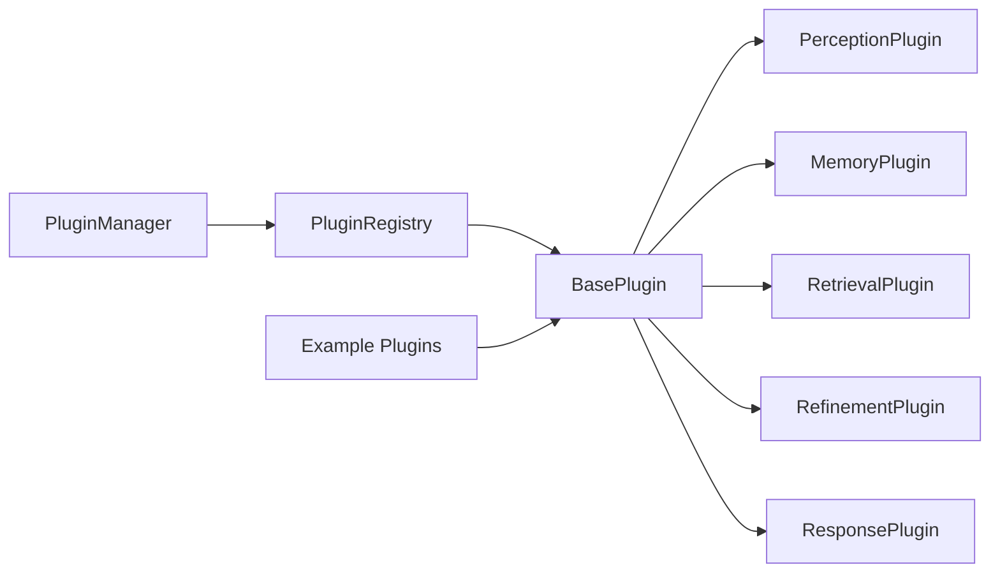

# 插件扩展系统

<cite>
**本文引用的文件**
- [src/plugins/__init__.py](file://src/plugins/__init__.py)
- [src/plugins/base.py](file://src/plugins/base.py)
- [src/plugins/manager.py](file://src/plugins/manager.py)
- [src/plugins/registry.py](file://src/plugins/registry.py)
- [src/plugins/example_plugins.py](file://src/plugins/example_plugins.py)
- [src/plugins/README.md](file://src/plugins/README.md)
- [src/core/config.py](file://src/core/config.py)
- [src/necorag.py](file://src/necorag.py)
</cite>

## 目录
1. [简介](#简介)
2. [项目结构](#项目结构)
3. [核心组件](#核心组件)
4. [架构总览](#架构总览)
5. [详细组件分析](#详细组件分析)
6. [依赖分析](#依赖分析)
7. [性能考量](#性能考量)
8. [故障排查指南](#故障排查指南)
9. [结论](#结论)
10. [附录](#附录)

## 简介
本文件面向插件扩展系统，系统性阐述插件基类的标准接口设计、插件管理器的生命周期管理、插件注册表的动态加载机制，并深入解释热插拔的实现原理、沙箱隔离的安全策略以及插件市场的扩展方案。同时提供插件开发最佳实践、接口规范与兼容性保障、安装部署、配置管理与故障诊断方法，帮助开发者构建丰富的生态系统。

## 项目结构
插件扩展系统位于 src/plugins 目录，围绕“基类定义、注册表、管理器、示例插件”四个核心模块展开，配合 README 提供快速上手与开发指南；与主应用通过全局实例 plugin_manager 与 plugin_registry 进行集成。

图表来源
- [src/plugins/base.py:1-263](file://src/plugins/base.py#L1-L263)
- [src/plugins/registry.py:1-257](file://src/plugins/registry.py#L1-L257)
- [src/plugins/manager.py:1-286](file://src/plugins/manager.py#L1-L286)
- [src/plugins/example_plugins.py:1-332](file://src/plugins/example_plugins.py#L1-L332)
- [src/plugins/__init__.py:1-18](file://src/plugins/__init__.py#L1-L18)
- [src/plugins/README.md:1-239](file://src/plugins/README.md#L1-L239)
- [src/necorag.py:1-920](file://src/necorag.py#L1-L920)
- [src/core/config.py:1-420](file://src/core/config.py#L1-L420)

章节来源
- [src/plugins/__init__.py:1-18](file://src/plugins/__init__.py#L1-L18)
- [src/plugins/README.md:1-239](file://src/plugins/README.md#L1-L239)

## 核心组件
- 插件基类与类型：定义标准接口、生命周期钩子、配置管理与信息导出，按层抽象感知、记忆、检索、巩固、响应插件。
- 插件注册表：负责插件类的注册、发现、实例化、加载与卸载，维护注册与加载状态。
- 插件管理器：负责批量加载/卸载、启用/禁用、依赖解析（拓扑排序）、事件处理与插件信息查询。
- 示例插件：提供感知层、记忆层、检索层、巩固层、响应层的示例实现，便于开发者对照开发。

章节来源
- [src/plugins/base.py:22-263](file://src/plugins/base.py#L22-L263)
- [src/plugins/registry.py:15-257](file://src/plugins/registry.py#L15-L257)
- [src/plugins/manager.py:14-286](file://src/plugins/manager.py#L14-L286)
- [src/plugins/example_plugins.py:1-332](file://src/plugins/example_plugins.py#L1-L332)

## 架构总览
插件系统采用“注册表 + 管理器”的双层架构：注册表负责静态发现与动态注册，管理器负责运行期生命周期与依赖管理。示例插件通过注册表注册，再由管理器按依赖顺序加载。

图表来源
- [src/plugins/base.py:22-263](file://src/plugins/base.py#L22-L263)
- [src/plugins/registry.py:15-257](file://src/plugins/registry.py#L15-L257)
- [src/plugins/manager.py:14-286](file://src/plugins/manager.py#L14-L286)

## 详细组件分析

### 插件基类与类型
- 标准接口：initialize/cleanup/enable/disable 为生命周期钩子；get_config/set_config 提供配置读写；get_info 导出插件元信息。
- 层次化基类：Perception/Memory/Retrieval/Refinement/Response 插件分别定义各自领域的抽象方法，确保调用方与实现解耦。
- 类型枚举：PluginType 明确插件所属层次，便于管理器按类型筛选与事件路由。

图表来源
- [src/plugins/base.py:46-68](file://src/plugins/base.py#L46-L68)

章节来源
- [src/plugins/base.py:12-263](file://src/plugins/base.py#L12-L263)

### 插件注册表
- 注册与校验：register_plugin 对插件类进行有效性校验（必须实现特定方法、可实例化、可获取信息），防止非法插件进入系统。
- 发现机制：discover_plugins 遍历指定路径，动态导入模块并查找 BasePlugin 的子类进行注册。
- 实例化与生命周期：load_plugin/unload_plugin 负责实例化与资源清理；get_plugin/get_plugin_class 提供运行期访问。
- 列表与统计：list_plugins 支持按类型过滤；registered_count/loaded_count 提供统计信息。

图表来源
- [src/plugins/registry.py:168-224](file://src/plugins/registry.py#L168-L224)
- [src/plugins/registry.py:70-122](file://src/plugins/registry.py#L70-L122)

章节来源
- [src/plugins/registry.py:15-257](file://src/plugins/registry.py#L15-L257)

### 插件管理器
- 批量加载/卸载：load_plugins/unload_plugins 支持按配置批量操作；内部通过依赖解析决定加载/卸载顺序。
- 启用/禁用：enable_plugins/disable_plugins 控制运行期开关，底层委托插件自身的 enable/disable。
- 事件系统：register_event_handler/emit_event 支持事件发布订阅，便于插件间通信与系统状态通知。
- 依赖解析：_resolve_load_order/_resolve_unload_order 使用拓扑排序处理依赖关系，检测循环依赖并给出警告。
- 信息查询：get_plugins_by_type/get_plugin_info 提供运行期可观测性。

图表来源
- [src/plugins/manager.py:23-43](file://src/plugins/manager.py#L23-L43)
- [src/plugins/registry.py:70-101](file://src/plugins/registry.py#L70-L101)

章节来源
- [src/plugins/manager.py:14-286](file://src/plugins/manager.py#L14-L286)

### 示例插件
- 感知层：TextPreprocessorPlugin 展示输入清洗与标准化流程。
- 记忆层：SimpleCachePlugin 展示键值缓存与检索。
- 检索层：KeywordRetrievalPlugin 展示关键词匹配与评分排序。
- 巩固层：DataValidatorPlugin 展示数据质量评估与过滤。
- 响应层：ResponseFormatterPlugin 展示多种输出格式化。

图表来源
- [src/plugins/example_plugins.py:13-332](file://src/plugins/example_plugins.py#L13-L332)

章节来源
- [src/plugins/example_plugins.py:1-332](file://src/plugins/example_plugins.py#L1-L332)

### 热插拔实现原理
- 动态加载：通过 importlib/pkgutil 在运行时发现并导入模块，注册为插件类，随后实例化并初始化。
- 生命周期控制：管理器在加载前解析依赖顺序，在卸载时按反向依赖顺序清理，确保安全移除。
- 配置与状态：插件自身维护配置与启用状态，管理器仅负责生命周期与依赖协调。

章节来源
- [src/plugins/registry.py:168-224](file://src/plugins/registry.py#L168-L224)
- [src/plugins/manager.py:181-249](file://src/plugins/manager.py#L181-L249)

### 沙箱隔离与安全策略
- 模块导入隔离：通过 importlib 动态导入，限定在插件目录范围内，避免污染主应用命名空间。
- 资源清理：cleanup 钩子确保插件实例释放资源；管理器在卸载时调用。
- 配置隔离：插件通过 get_config/set_config 访问自身配置，避免跨插件直接共享状态。
- 事件边界：事件处理器在管理器内注册与触发，插件通过 get_info 获取依赖与反向依赖，降低耦合风险。

章节来源
- [src/plugins/base.py:69-85](file://src/plugins/base.py#L69-L85)
- [src/plugins/registry.py:103-121](file://src/plugins/registry.py#L103-L121)
- [src/plugins/manager.py:87-133](file://src/plugins/manager.py#L87-L133)

### 插件市场扩展方案
- 插件发现：discover_plugins 支持多路径扫描，便于将第三方插件目录纳入系统。
- 注册与验证：register_plugin 对插件类进行严格校验，确保接口完整性与可实例化。
- 依赖图构建：_build_dependency_graph 维护正向与反向依赖，便于市场侧进行依赖分析与推荐。
- 版本与兼容：插件基类包含版本字段，结合 get_info 输出，便于市场侧进行版本与兼容性管理。

章节来源
- [src/plugins/registry.py:168-224](file://src/plugins/registry.py#L168-L224)
- [src/plugins/manager.py:251-267](file://src/plugins/manager.py#L251-L267)
- [src/plugins/base.py:141-151](file://src/plugins/base.py#L141-L151)

## 依赖分析
- 组件耦合：PluginManager 依赖 PluginRegistry；BasePlugin 为所有插件的抽象基类；示例插件依赖 BasePlugin。
- 外部依赖：importlib/pkgutil 用于动态导入与模块遍历；logging 用于日志记录。
- 依赖关系图：

图表来源
- [src/plugins/base.py:22-263](file://src/plugins/base.py#L22-L263)
- [src/plugins/registry.py:15-257](file://src/plugins/registry.py#L15-L257)
- [src/plugins/manager.py:14-286](file://src/plugins/manager.py#L14-L286)
- [src/plugins/example_plugins.py:1-332](file://src/plugins/example_plugins.py#L1-L332)

章节来源
- [src/plugins/base.py:22-263](file://src/plugins/base.py#L22-L263)
- [src/plugins/registry.py:15-257](file://src/plugins/registry.py#L15-L257)
- [src/plugins/manager.py:14-286](file://src/plugins/manager.py#L14-L286)
- [src/plugins/example_plugins.py:1-332](file://src/plugins/example_plugins.py#L1-L332)

## 性能考量
- 加载顺序优化：拓扑排序确保依赖满足，避免重复尝试与失败回退。
- 懒加载与状态监控：可扩展为按需加载与加载进度上报。
- 内存管理：及时调用 cleanup 释放资源；监控 loaded_count 与 registered_count，避免泄漏。
- 事件处理：事件处理器异常不影响整体流程，但应记录日志以便定位。

章节来源
- [src/plugins/manager.py:181-249](file://src/plugins/manager.py#L181-L249)
- [src/plugins/registry.py:103-121](file://src/plugins/registry.py#L103-L121)
- [src/plugins/README.md:196-206](file://src/plugins/README.md#L196-L206)

## 故障排查指南
- 插件加载失败
  - 检查插件类是否正确继承基类并实现必需方法。
  - 查看日志中的错误信息，确认初始化失败原因。
- 依赖循环
  - 使用依赖解析工具分析循环依赖，重新设计插件架构。
- 性能问题
  - 监控插件执行时间与资源使用，考虑异步处理与缓存策略。

章节来源
- [src/plugins/README.md:208-225](file://src/plugins/README.md#L208-L225)
- [src/plugins/registry.py:226-243](file://src/plugins/registry.py#L226-L243)
- [src/plugins/manager.py:210-216](file://src/plugins/manager.py#L210-L216)

## 结论
插件扩展系统通过清晰的基类接口、严格的注册与发现机制、完善的生命周期管理与依赖解析，实现了高内聚、低耦合的插件生态。结合示例插件与开发指南，开发者可以快速构建符合规范的插件，参与生态建设。未来可在事件路由、版本兼容、插件市场等方面进一步完善，提升系统的可扩展性与易用性。

## 附录

### 插件开发最佳实践
- 选择合适基类：根据功能选择 Perception/Memory/Retrieval/Refinement/Response 基类。
- 实现必需方法：确保 description、dependencies、_initialize、_cleanup 正确实现。
- 配置管理：通过 get_config/set_config 管理插件配置，避免硬编码。
- 日志记录：使用内置 logger 输出信息、错误与调试日志。
- 依赖声明：合理声明 dependencies，避免循环依赖。

章节来源
- [src/plugins/README.md:137-184](file://src/plugins/README.md#L137-L184)
- [src/plugins/base.py:46-151](file://src/plugins/base.py#L46-L151)

### 接口规范与兼容性
- 插件基类提供统一接口，确保不同插件在调用方看来行为一致。
- 版本字段与 get_info 输出便于兼容性判断与升级迁移。
- 依赖图构建与事件系统为插件间协作提供契约基础。

章节来源
- [src/plugins/base.py:141-151](file://src/plugins/base.py#L141-L151)
- [src/plugins/manager.py:251-267](file://src/plugins/manager.py#L251-L267)

### 安装部署与配置管理
- 安装依赖：确保 setuptools 等基础包可用。
- 基本使用：通过 plugin_manager.discover_and_register_plugins 发现插件，再按需加载。
- 配置管理：在加载时传入配置字典，插件通过 get_config/set_config 访问。

章节来源
- [src/plugins/README.md:27-57](file://src/plugins/README.md#L27-L57)

### 故障诊断方法
- 日志定位：关注插件初始化、清理、启用/禁用过程的日志输出。
- 依赖分析：利用依赖解析工具与 get_plugin_info 输出的依赖/反向依赖信息进行分析。
- 资源回收：确认 cleanup 是否被调用，避免资源泄漏。

章节来源
- [src/plugins/README.md:208-225](file://src/plugins/README.md#L208-L225)
- [src/plugins/manager.py:251-267](file://src/plugins/manager.py#L251-L267)