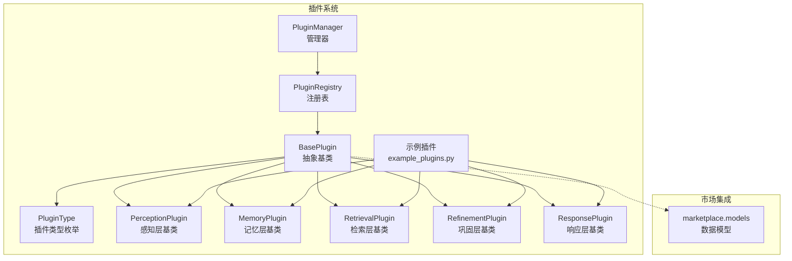
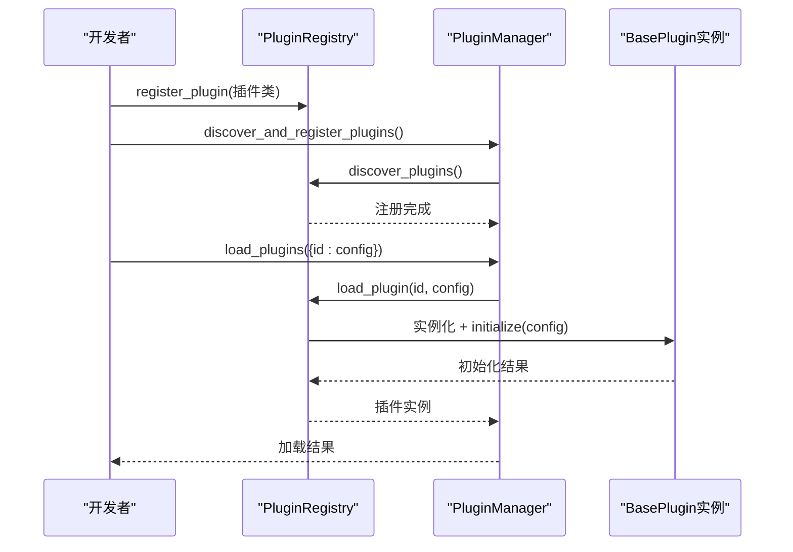
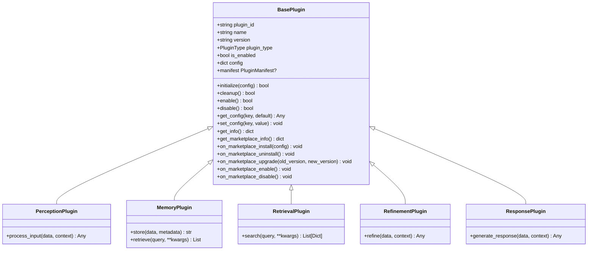
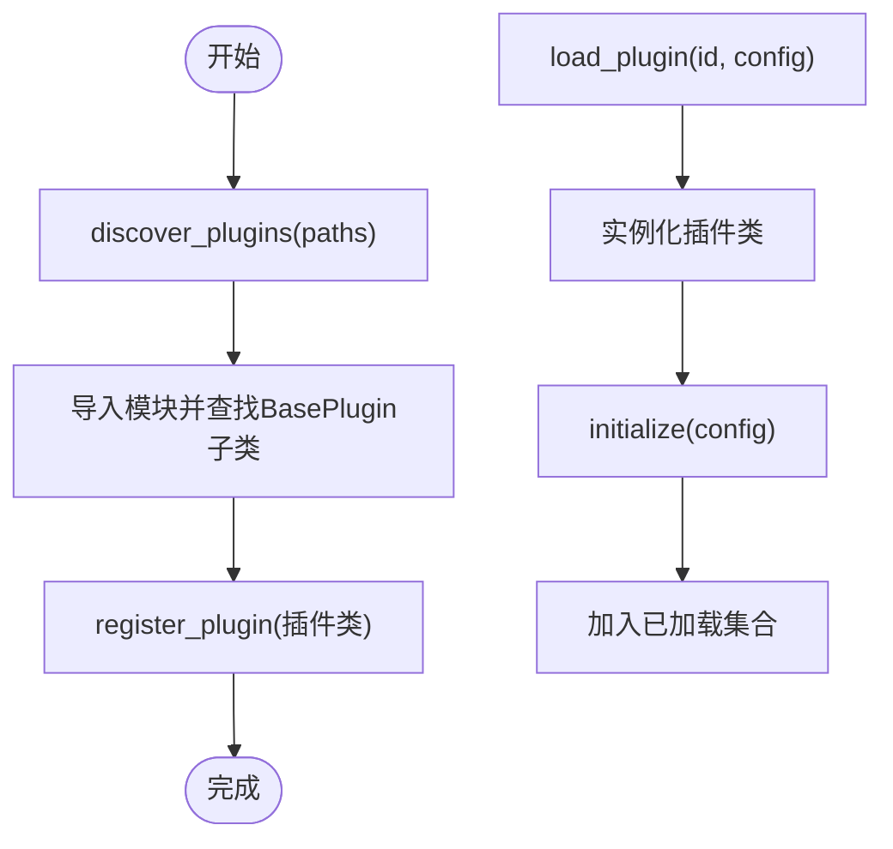
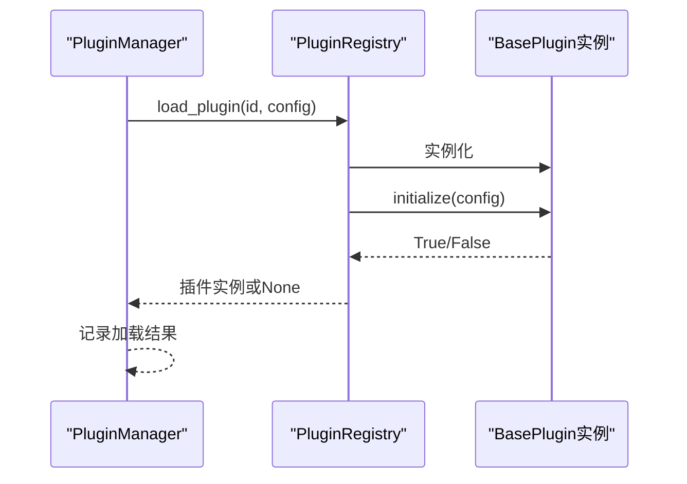
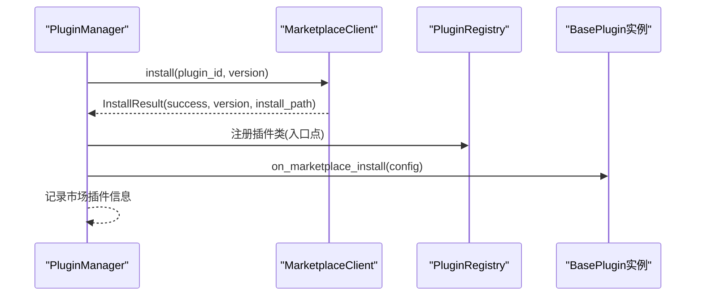
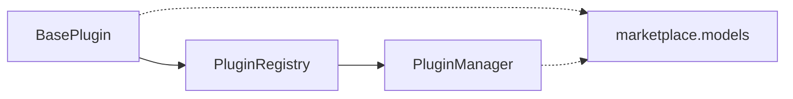

# 插件基类设计

<cite>
**本文档引用的文件**
- [src/plugins/base.py](file://src/plugins/base.py)
- [src/plugins/manager.py](file://src/plugins/manager.py)
- [src/plugins/registry.py](file://src/plugins/registry.py)
- [src/plugins/example_plugins.py](file://src/plugins/example_plugins.py)
- [src/plugins/README.md](file://src/plugins/README.md)
- [src/marketplace/models.py](file://src/marketplace/models.py)
</cite>

## 目录
1. [简介](#简介)
2. [项目结构](#项目结构)
3. [核心组件](#核心组件)
4. [架构总览](#架构总览)
5. [详细组件分析](#详细组件分析)
6. [依赖分析](#依赖分析)
7. [性能考虑](#性能考虑)
8. [故障排除指南](#故障排除指南)
9. [结论](#结论)
10. [附录](#附录)

## 简介
本文件面向插件开发者与维护者，系统性阐述 NecoRAG 插件基类设计与标准接口规范。内容涵盖：
- BasePlugin 抽象基类的设计理念与生命周期管理
- 配置管理系统与信息获取接口
- 插件类型枚举与各层插件专用基类的接口设计
- 插件市场集成机制（manifest 生成、市场元数据属性、生命周期钩子）
- 插件开发最佳实践与接口实现指南
- 完整的使用模式与示例路径

## 项目结构
插件系统位于 src/plugins 目录，核心文件包括：
- base.py：定义插件基类、类型枚举与各层专用基类
- registry.py：插件注册表，负责插件发现、注册与实例管理
- manager.py：插件管理器，负责生命周期编排、依赖解析与事件分发
- example_plugins.py：示例插件实现，展示各层插件的典型用法
- README.md：插件模块使用说明与开发指南
- marketplace/models.py：插件市场数据模型，支撑市场集成

**图表来源**
- [src/plugins/base.py:15-385](file://src/plugins/base.py#L15-L385)
- [src/plugins/registry.py:15-383](file://src/plugins/registry.py#L15-L383)
- [src/plugins/manager.py:14-584](file://src/plugins/manager.py#L14-L584)
- [src/plugins/example_plugins.py:1-332](file://src/plugins/example_plugins.py#L1-L332)
- [src/marketplace/models.py:23-234](file://src/marketplace/models.py#L23-L234)

**章节来源**
- [src/plugins/README.md:1-239](file://src/plugins/README.md#L1-L239)

## 核心组件
本节聚焦 BasePlugin 抽象基类及其派生类，梳理生命周期、配置管理与市场集成的关键接口。

- 插件类型枚举（PluginType）
  - PERCEPTION：感知层插件
  - MEMORY：记忆层插件
  - RETRIEVAL：检索层插件
  - REFINEMENT：巩固层插件
  - RESPONSE：响应层插件
  - CUSTOM：自定义插件

- 基类接口概览
  - 生命周期：initialize、cleanup、enable、disable
  - 配置管理：get_config、set_config
  - 信息获取：get_info
  - 市场集成：manifest 属性、get_marketplace_info、on_marketplace_* 钩子

- 各层专用基类
  - PerceptionPlugin：process_input
  - MemoryPlugin：store、retrieve
  - RetrievalPlugin：search
  - RefinementPlugin：refine
  - ResponsePlugin：generate_response

**章节来源**
- [src/plugins/base.py:15-385](file://src/plugins/base.py#L15-L385)

## 架构总览
插件系统的运行时架构围绕“注册表 + 管理器”的双层结构展开：
- PluginRegistry：负责插件类的注册、发现、实例化与版本索引
- PluginManager：负责插件的批量加载/卸载、启用/禁用、依赖解析、事件分发与市场集成

**图表来源**
- [src/plugins/registry.py:80-112](file://src/plugins/registry.py#L80-L112)
- [src/plugins/manager.py:26-46](file://src/plugins/manager.py#L26-L46)

**章节来源**
- [src/plugins/registry.py:15-383](file://src/plugins/registry.py#L15-L383)
- [src/plugins/manager.py:14-584](file://src/plugins/manager.py#L14-L584)

## 详细组件分析

### BasePlugin 抽象基类
BasePlugin 是所有插件的抽象基类，定义了统一的生命周期、配置管理与市场集成接口。

- 生命周期管理
  - initialize(config): 初始化插件，合并传入配置并调用内部 _initialize
  - cleanup(): 清理资源，调用内部 _cleanup
  - enable()/disable(): 控制插件启用状态，分别调用内部 _enable/_disable
  - 默认行为：_enable/_disable 返回 True，允许子类按需覆盖

- 配置管理系统
  - get_config(key, default): 获取配置项
  - set_config(key, value): 设置配置项
  - config 字典：插件运行时的配置容器

- 信息获取接口
  - get_info(): 返回插件基础信息（id、name、version、type、description、enabled、dependencies）

- 市场集成
  - marketplace_* 元数据属性：marketplace_id、marketplace_version、marketplace_author、marketplace_category、marketplace_tags、marketplace_license、marketplace_homepage、marketplace_repository、marketplace_min_necorag、marketplace_max_necorag、marketplace_entry_point
  - required_permissions：声明插件所需权限
  - manifest 属性：生成与市场兼容的 PluginManifest 对象（依赖 marketplace.models）
  - get_marketplace_info()：返回纯字典格式的市场元信息
  - 生命周期钩子：on_marketplace_install、on_marketplace_uninstall、on_marketplace_upgrade、on_marketplace_enable、on_marketplace_disable

**图表来源**
- [src/plugins/base.py:25-385](file://src/plugins/base.py#L25-L385)

**章节来源**
- [src/plugins/base.py:25-385](file://src/plugins/base.py#L25-L385)

### 各层插件专用基类
- PerceptionPlugin：面向感知层，提供 process_input 接口，用于输入数据的预处理与格式转换
- MemoryPlugin：面向记忆层，提供 store 与 retrieve 接口，用于数据存储与检索
- RetrievalPlugin：面向检索层，提供 search 接口，用于执行检索操作
- RefinementPlugin：面向巩固层，提供 refine 接口，用于数据精炼与质量控制
- ResponsePlugin：面向响应层，提供 generate_response 接口，用于生成最终响应

这些基类在构造时自动绑定对应 PluginType，并要求子类实现各自领域的抽象方法。

**章节来源**
- [src/plugins/base.py:276-385](file://src/plugins/base.py#L276-L385)

### 插件注册表（PluginRegistry）
- 职责
  - 注册/注销插件类
  - 发现插件模块并注册
  - 实例化插件并管理生命周期
  - 维护版本索引与市场元数据缓存
- 关键方法
  - register_plugin/plugin_class/get_plugin
  - load_plugin/unload_plugin
  - discover_plugins
  - register_version/get_version/list_versions
  - set_marketplace_metadata/get_marketplace_metadata
  - list_marketplace_plugins

**图表来源**
- [src/plugins/registry.py:192-248](file://src/plugins/registry.py#L192-L248)
- [src/plugins/registry.py:80-112](file://src/plugins/registry.py#L80-L112)

**章节来源**
- [src/plugins/registry.py:15-383](file://src/plugins/registry.py#L15-L383)

### 插件管理器（PluginManager）
- 职责
  - 批量加载/卸载插件
  - 解析依赖关系并按拓扑顺序执行
  - 启用/禁用插件
  - 事件处理与分发
  - 市场集成：安装/卸载/升级插件、同步状态
- 关键方法
  - load_plugins/unload_plugins
  - enable_plugins/disable_plugins
  - register_event_handler/emit_event
  - get_plugins_by_type/get_plugin_info
  - discover_and_register_plugins
  - install_from_marketplace/uninstall_marketplace_plugin/upgrade_marketplace_plugin
  - get_marketplace_plugins/sync_with_marketplace

**图表来源**
- [src/plugins/manager.py:26-46](file://src/plugins/manager.py#L26-L46)
- [src/plugins/registry.py:80-112](file://src/plugins/registry.py#L80-L112)

**章节来源**
- [src/plugins/manager.py:14-584](file://src/plugins/manager.py#L14-L584)

### 市场集成机制
- 元数据属性
  - marketplace_id、marketplace_version、marketplace_author、marketplace_category、marketplace_tags、marketplace_license、marketplace_homepage、marketplace_repository、marketplace_min_necorag、marketplace_max_necorag、marketplace_entry_point
  - required_permissions
- manifest 生成
  - BasePlugin.manifest：将 get_info() 与 marketplace_* 属性映射为 marketplace.models.PluginManifest
  - 类型与分类映射：PluginType 与 PluginCategory 的双向映射
- 市场生命周期钩子
  - on_marketplace_install、on_marketplace_uninstall、on_marketplace_upgrade、on_marketplace_enable、on_marketplace_disable
- 管理器市场方法
  - install_from_marketplace：安装并加载市场插件
  - uninstall_marketplace_plugin：卸载市场插件
  - upgrade_marketplace_plugin：升级市场插件
  - get_marketplace_plugins：查询市场插件状态
  - sync_with_marketplace：与市场状态同步

**图表来源**
- [src/plugins/manager.py:299-390](file://src/plugins/manager.py#L299-L390)
- [src/plugins/base.py:174-273](file://src/plugins/base.py#L174-L273)
- [src/marketplace/models.py:135-234](file://src/marketplace/models.py#L135-L234)

**章节来源**
- [src/plugins/base.py:172-273](file://src/plugins/base.py#L172-L273)
- [src/plugins/manager.py:287-581](file://src/plugins/manager.py#L287-L581)
- [src/marketplace/models.py:23-234](file://src/marketplace/models.py#L23-L234)

### 示例插件实现
示例插件展示了各层插件的典型实现模式：
- TextPreprocessorPlugin（感知层）：process_input 文本预处理
- SimpleCachePlugin（记忆层）：store/retrieve 简单缓存
- KeywordRetrievalPlugin（检索层）：search 关键词检索
- DataValidatorPlugin（巩固层）：refine 数据验证
- ResponseFormatterPlugin（响应层）：generate_response 输出格式化

这些示例体现了：
- 正确继承对应基类
- 实现 description 与 dependencies
- 在 _initialize/_cleanup 中进行资源管理
- 使用 get_config/set_config 进行配置驱动

**章节来源**
- [src/plugins/example_plugins.py:1-332](file://src/plugins/example_plugins.py#L1-L332)

## 依赖分析
- 组件耦合
  - BasePlugin 与各层基类之间为继承关系，低耦合高内聚
  - PluginRegistry 依赖 BasePlugin 以验证与实例化插件
  - PluginManager 依赖 PluginRegistry 以管理插件生命周期
  - BasePlugin 依赖 marketplace.models 以生成 manifest（可选导入）
- 依赖解析
  - PluginManager 使用拓扑排序解析插件依赖，避免循环依赖
  - 注册表维护版本索引与市场元数据缓存，便于版本管理与市场同步

**图表来源**
- [src/plugins/base.py:182-182](file://src/plugins/base.py#L182-L182)
- [src/plugins/registry.py:15-27](file://src/plugins/registry.py#L15-L27)
- [src/plugins/manager.py:10-11](file://src/plugins/manager.py#L10-L11)

**章节来源**
- [src/plugins/registry.py:250-268](file://src/plugins/registry.py#L250-L268)
- [src/plugins/manager.py:184-252](file://src/plugins/manager.py#L184-L252)

## 性能考虑
- 加载优化
  - 按依赖关系拓扑排序加载，减少初始化失败概率
  - 支持懒加载与状态监控，降低启动开销
- 内存管理
  - 及时调用 cleanup 释放资源
  - 支持插件实例的显式卸载与回收
- 并发与事件
  - 事件处理器采用列表存储，注意异常隔离与日志记录

[本节为通用指导，无需特定文件来源]

## 故障排除指南
- 插件加载失败
  - 检查插件类是否正确继承基类
  - 验证必需方法（description、dependencies、_initialize、_cleanup）是否实现
  - 查看日志定位具体错误
- 依赖循环
  - 使用依赖解析工具分析
  - 重新设计插件架构，消除循环依赖
- 性能问题
  - 监控插件执行时间与资源使用
  - 考虑异步处理与批处理策略

**章节来源**
- [src/plugins/README.md:208-226](file://src/plugins/README.md#L208-L226)

## 结论
NecoRAG 插件基类设计以抽象基类为核心，结合注册表与管理器实现了可扩展、可维护的插件生态。通过明确的生命周期、配置管理与市场集成接口，开发者可以快速实现各层插件并融入整体系统。建议在实际开发中遵循本文档的最佳实践，确保插件的稳定性、可移植性与可维护性。

[本节为总结性内容，无需特定文件来源]

## 附录

### 插件开发最佳实践
- 选择合适基类
  - 感知层：PerceptionPlugin
  - 记忆层：MemoryPlugin
  - 检索层：RetrievalPlugin
  - 巩固层：RefinementPlugin
  - 响应层：ResponsePlugin
- 实现必要方法
  - description：简要描述插件用途
  - dependencies：声明依赖的其他插件
  - _initialize/_cleanup：资源申请与释放
- 配置管理
  - 使用 get_config/set_config 管理运行时配置
  - 提供合理的默认值与校验
- 日志记录
  - 使用内置 logger 输出信息、错误与调试日志
- 市场集成
  - 填写 marketplace_* 元数据属性
  - 实现必要的生命周期钩子
  - 提供清晰的 required_permissions

**章节来源**
- [src/plugins/README.md:137-184](file://src/plugins/README.md#L137-L184)
- [src/plugins/base.py:25-385](file://src/plugins/base.py#L25-L385)

### 使用模式示例（路径指引）
- 基本使用
  - 发现与注册：[src/plugins/README.md:34-57](file://src/plugins/README.md#L34-L57)
  - 创建自定义插件：[src/plugins/README.md:59-91](file://src/plugins/README.md#L59-L91)
- API 参考
  - PluginManager：[src/plugins/README.md:95-116](file://src/plugins/README.md#L95-L116)
  - PluginRegistry：[src/plugins/README.md:118-135](file://src/plugins/README.md#L118-L135)
- 示例插件
  - 文本预处理：[src/plugins/example_plugins.py:14-58](file://src/plugins/example_plugins.py#L14-L58)
  - 简单缓存：[src/plugins/example_plugins.py:61-109](file://src/plugins/example_plugins.py#L61-L109)
  - 关键词检索：[src/plugins/example_plugins.py:112-167](file://src/plugins/example_plugins.py#L112-L167)
  - 数据验证：[src/plugins/example_plugins.py:171-242](file://src/plugins/example_plugins.py#L171-L242)
  - 响应格式化：[src/plugins/example_plugins.py:245-316](file://src/plugins/example_plugins.py#L245-L316)

**章节来源**
- [src/plugins/README.md:34-135](file://src/plugins/README.md#L34-L135)
- [src/plugins/example_plugins.py:14-316](file://src/plugins/example_plugins.py#L14-L316)