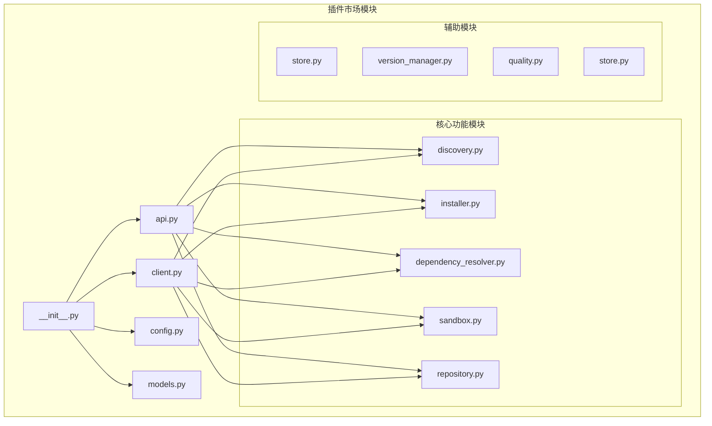
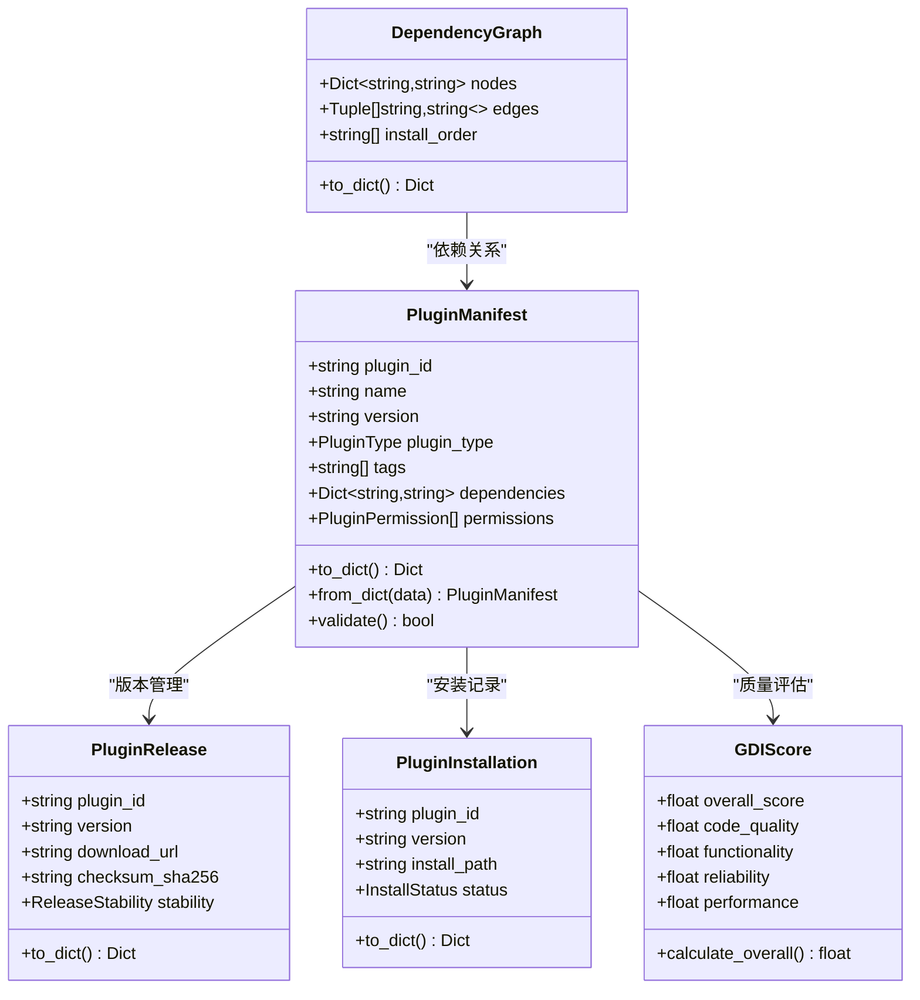
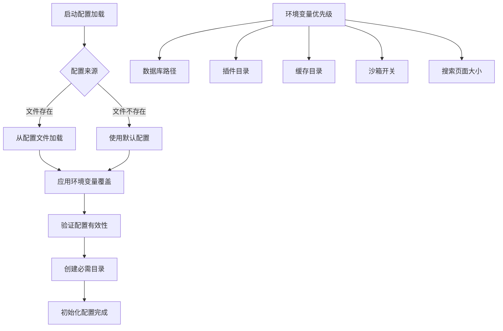
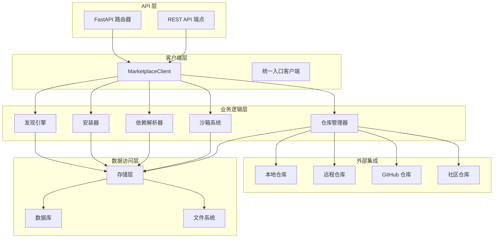
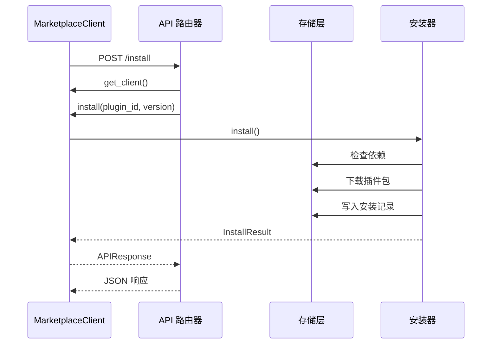
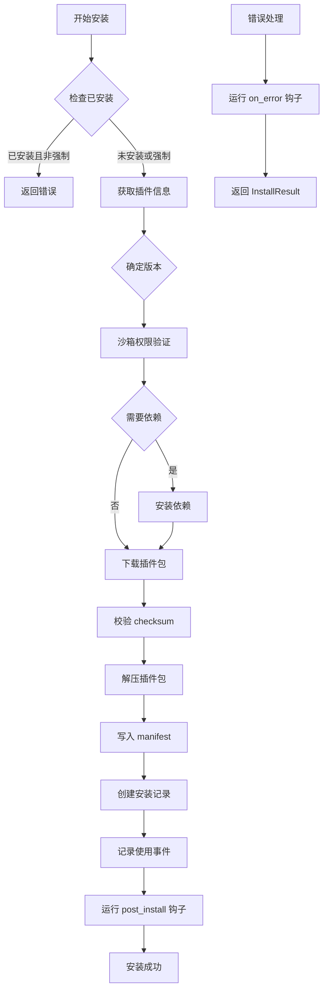
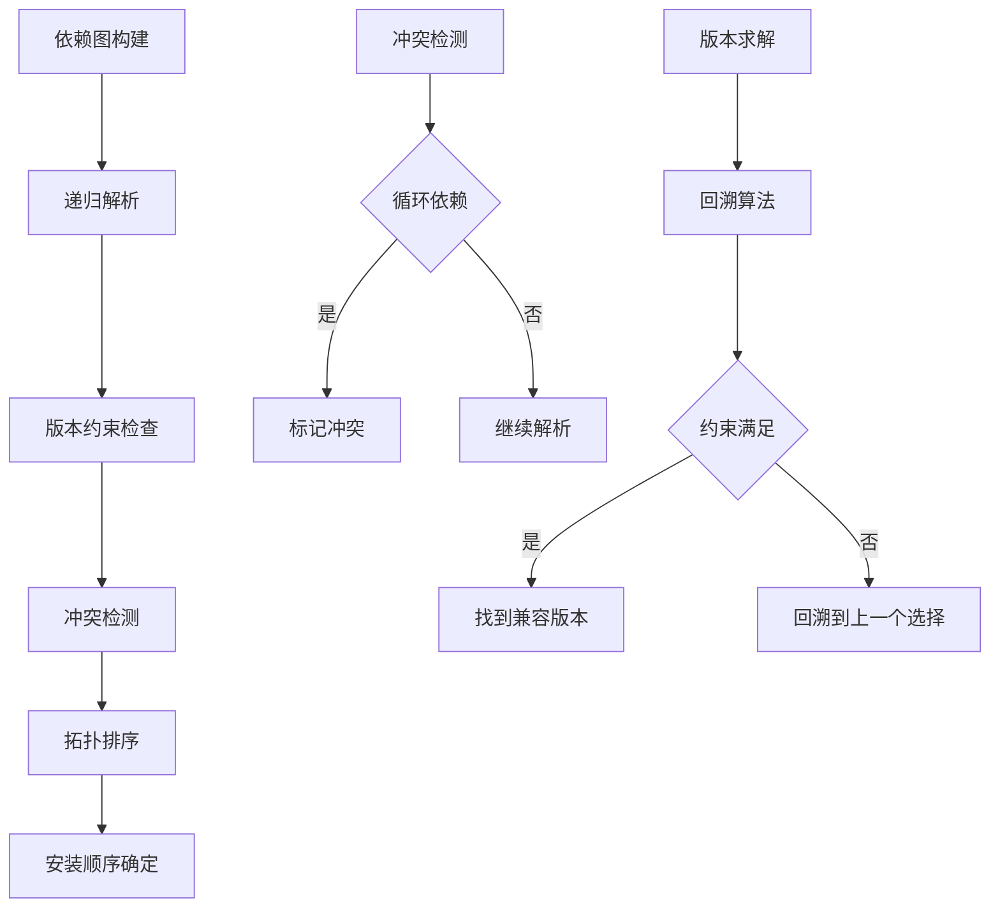
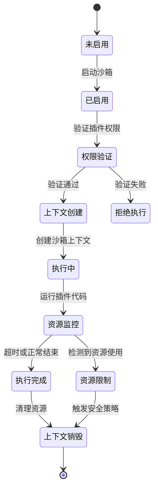
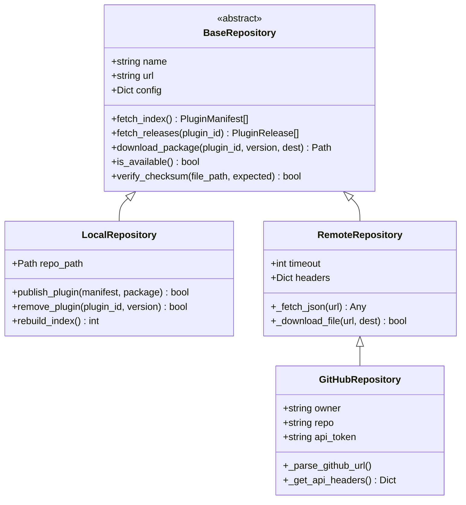
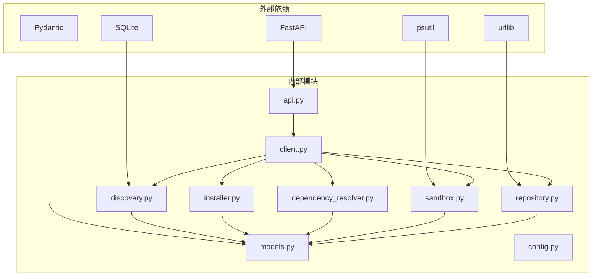

# 插件市场系统

<cite>
**本文档引用的文件**
- [src/marketplace/__init__.py](file://src/marketplace/__init__.py)
- [src/marketplace/api.py](file://src/marketplace/api.py)
- [src/marketplace/client.py](file://src/marketplace/client.py)
- [src/marketplace/config.py](file://src/marketplace/config.py)
- [src/marketplace/dependency_resolver.py](file://src/marketplace/dependency_resolver.py)
- [src/marketplace/discovery.py](file://src/marketplace/discovery.py)
- [src/marketplace/installer.py](file://src/marketplace/installer.py)
- [src/marketplace/models.py](file://src/marketplace/models.py)
- [src/marketplace/repository.py](file://src/marketplace/repository.py)
- [src/marketplace/sandbox.py](file://src/marketplace/sandbox.py)
</cite>

## 目录
1. [简介](#简介)
2. [项目结构](#项目结构)
3. [核心组件](#核心组件)
4. [架构概览](#架构概览)
5. [详细组件分析](#详细组件分析)
6. [依赖分析](#依赖分析)
7. [性能考虑](#性能考虑)
8. [故障排除指南](#故障排除指南)
9. [结论](#结论)

## 简介

NecoRAG 插件市场系统是一个完整的插件生态系统，提供了插件的发现、安装、管理、安全隔离和质量评估功能。该系统采用模块化设计，支持多种插件类型、分类和权限级别，为 NecoRAG 认知架构提供了强大的扩展能力。

系统主要功能包括：
- 插件搜索和发现
- 插件安装、卸载、升级管理
- 依赖关系解析和冲突检测
- 权限安全隔离
- GDI 质量评估
- 多源仓库管理
- 灰度部署支持

## 项目结构

插件市场系统位于 `src/marketplace/` 目录下，采用清晰的模块化组织：



**图表来源**
- [src/marketplace/__init__.py:1-192](file://src/marketplace/__init__.py#L1-L192)
- [src/marketplace/api.py:1-777](file://src/marketplace/api.py#L1-L777)

**章节来源**
- [src/marketplace/__init__.py:1-192](file://src/marketplace/__init__.py#L1-L192)

## 核心组件

### 数据模型系统

插件市场系统定义了完整的数据模型层次结构：



**图表来源**
- [src/marketplace/models.py:135-756](file://src/marketplace/models.py#L135-L756)

### 配置管理系统

系统提供灵活的配置管理，支持环境变量覆盖和文件配置：



**图表来源**
- [src/marketplace/config.py:24-304](file://src/marketplace/config.py#L24-L304)

**章节来源**
- [src/marketplace/models.py:1-756](file://src/marketplace/models.py#L1-L756)
- [src/marketplace/config.py:1-304](file://src/marketplace/config.py#L1-L304)

## 架构概览

插件市场系统采用分层架构设计，各层职责明确：



**图表来源**
- [src/marketplace/api.py:1-777](file://src/marketplace/api.py#L1-L777)
- [src/marketplace/client.py:47-105](file://src/marketplace/client.py#L47-L105)

## 详细组件分析

### REST API 系统

插件市场提供完整的 REST API 接口，支持所有核心功能：



**图表来源**
- [src/marketplace/api.py:303-318](file://src/marketplace/api.py#L303-L318)
- [src/marketplace/client.py:265-294](file://src/marketplace/client.py#L265-L294)

API 端点涵盖以下功能领域：

#### 搜索和发现端点
- `GET /search` - 多维度插件搜索
- `GET /plugins/{plugin_id}` - 获取插件详情
- `GET /trending` - 获取热门趋势
- `GET /recommendations` - 获取推荐插件

#### 安装管理端点
- `POST /install` - 安装插件
- `POST /uninstall` - 卸载插件
- `POST /upgrade` - 升级插件
- `GET /installed` - 列出已安装插件

#### 评分和质量端点
- `POST /plugins/{plugin_id}/rate` - 为插件评分
- `GET /plugins/{plugin_id}/gdi` - 获取 GDI 评分
- `GET /leaderboard` - 获取 GDI 排行榜

#### 仓库管理端点
- `POST /repositories/add` - 添加仓库源
- `DELETE /repositories/{name}` - 移除仓库源
- `GET /repositories` - 列出所有仓库源

**章节来源**
- [src/marketplace/api.py:1-777](file://src/marketplace/api.py#L1-L777)

### 插件安装器

插件安装器负责插件的完整生命周期管理：



**图表来源**
- [src/marketplace/installer.py:217-402](file://src/marketplace/installer.py#L217-L402)

安装器提供以下核心功能：
- **依赖管理**：自动解析和安装插件依赖
- **版本控制**：支持多版本并存和版本切换
- **安全验证**：校验文件完整性
- **钩子系统**：支持安装前后的自定义处理
- **并发安全**：使用线程锁确保操作原子性

**章节来源**
- [src/marketplace/installer.py:1-800](file://src/marketplace/installer.py#L1-L800)

### 依赖解析系统

依赖解析器使用图论算法处理复杂的依赖关系：



**图表来源**
- [src/marketplace/dependency_resolver.py:44-112](file://src/marketplace/dependency_resolver.py#L44-L112)

系统支持的功能包括：
- **依赖图构建**：递归解析所有传递依赖
- **冲突检测**：识别版本冲突和循环依赖
- **拓扑排序**：确定正确的安装顺序
- **兼容性求解**：使用回溯算法找到兼容版本组合

**章节来源**
- [src/marketplace/dependency_resolver.py:1-800](file://src/marketplace/dependency_resolver.py#L1-L800)

### 沙箱隔离系统

沙箱系统提供多层次的安全保护：



**图表来源**
- [src/marketplace/sandbox.py:186-232](file://src/marketplace/sandbox.py#L186-L232)

权限级别和授权矩阵：

| 权限级别 | 允许权限 | 适用场景 |
|---------|---------|---------|
| MINIMAL | 查询知识库、读取文件 | 基础查询插件 |
| STANDARD | 读取记忆、网络请求、LLM调用 | 日常操作插件 |
| ELEVATED | 写入记忆、管理索引、文件写入 | 高级功能插件 |
| FULL | 所有权限 | 官方认证插件 |

**章节来源**
- [src/marketplace/sandbox.py:1-800](file://src/marketplace/sandbox.py#L1-L800)

### 仓库管理系统

系统支持多种仓库类型和同步机制：



**图表来源**
- [src/marketplace/repository.py:30-846](file://src/marketplace/repository.py#L30-L846)

**章节来源**
- [src/marketplace/repository.py:1-800](file://src/marketplace/repository.py#L1-L800)

## 依赖分析

插件市场系统的组件间依赖关系清晰，遵循依赖倒置原则：



**图表来源**
- [src/marketplace/__init__.py:33-127](file://src/marketplace/__init__.py#L33-L127)

**章节来源**
- [src/marketplace/__init__.py:1-192](file://src/marketplace/__init__.py#L1-L192)

## 性能考虑

### 缓存策略
- **目录缓存**：插件包下载后缓存到本地，避免重复下载
- **索引缓存**：仓库索引定期更新，支持增量同步
- **查询缓存**：热门搜索结果和推荐结果缓存

### 并发处理
- **线程安全**：使用锁机制保护共享资源
- **异步操作**：支持长时间运行的操作（如下载、安装）
- **资源池**：限制并发请求数量，避免系统过载

### 优化建议
1. **数据库优化**：建立适当的索引提高查询性能
2. **内存管理**：及时释放不再使用的对象
3. **网络优化**：使用连接池和超时机制
4. **文件系统优化**：合理组织文件结构，避免大量小文件

## 故障排除指南

### 常见问题及解决方案

#### 安装失败
**症状**：插件安装过程中出现错误
**可能原因**：
- 权限不足
- 依赖冲突
- 网络连接问题
- 磁盘空间不足

**解决步骤**：
1. 检查插件权限声明是否正确
2. 使用 `dependency_resolver` 检查依赖冲突
3. 验证网络连接和下载地址
4. 检查磁盘空间和权限

#### 依赖解析错误
**症状**：无法解析插件依赖关系
**解决方法**：
```python
# 检查依赖图
graph = dependency_resolver.build_dependency_graph(plugin_id)
print(f"冲突: {graph.conflicts}")

# 获取依赖树
tree = dependency_resolver.format_dependency_tree(plugin_id)
print(f"依赖树:\n{tree}")
```

#### 沙箱权限问题
**症状**：插件运行时权限不足
**解决方法**：
```python
# 检查权限验证结果
validation = sandbox.validate_permissions(manifest)
print(f"授予权限: {validation.granted_permissions}")
print(f"拒绝权限: {validation.denied_permissions}")

# 设置权限级别
sandbox.set_permission_level(plugin_id, PermissionLevel.ELEVATED)
```

#### 仓库同步失败
**症状**：插件索引无法更新
**解决方法**：
```python
# 检查仓库可用性
repo = repository_manager.get_source("official")
if repo.is_available():
    print("仓库可用")
else:
    print("仓库不可用，检查网络连接")

# 手动同步
result = repository_manager.sync_source("official")
print(f"同步结果: {result.success}")
```

**章节来源**
- [src/marketplace/installer.py:392-402](file://src/marketplace/installer.py#L392-L402)
- [src/marketplace/sandbox.py:311-318](file://src/marketplace/sandbox.py#L311-L318)
- [src/marketplace/dependency_resolver.py:562-573](file://src/marketplace/dependency_resolver.py#L562-L573)

## 结论

NecoRAG 插件市场系统是一个设计精良、功能完整的插件生态系统。系统采用模块化架构，提供了从插件发现到生命周期管理的完整解决方案。

### 主要优势
1. **模块化设计**：清晰的职责分离和接口定义
2. **安全性**：多层次的权限控制和资源隔离
3. **可扩展性**：支持多种仓库类型和自定义扩展
4. **可靠性**：完善的错误处理和恢复机制
5. **易用性**：简洁的 API 接口和丰富的功能

### 技术特色
- 基于 FastAPI 的现代化 Web 服务
- 图论算法驱动的依赖解析
- 多层次的安全沙箱系统
- 灵活的配置管理和环境适配
- 完整的质量评估和推荐系统

该系统为 NecoRAG 认知架构提供了强大的扩展能力，支持快速开发和部署各种类型的插件，是构建复杂 AI 应用的理想选择。