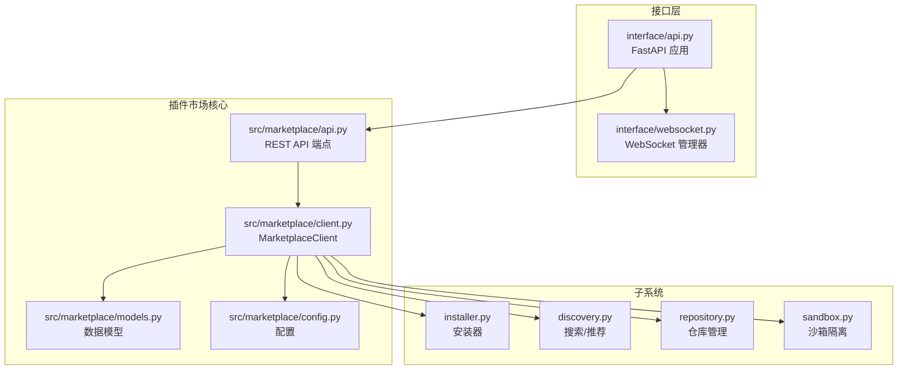
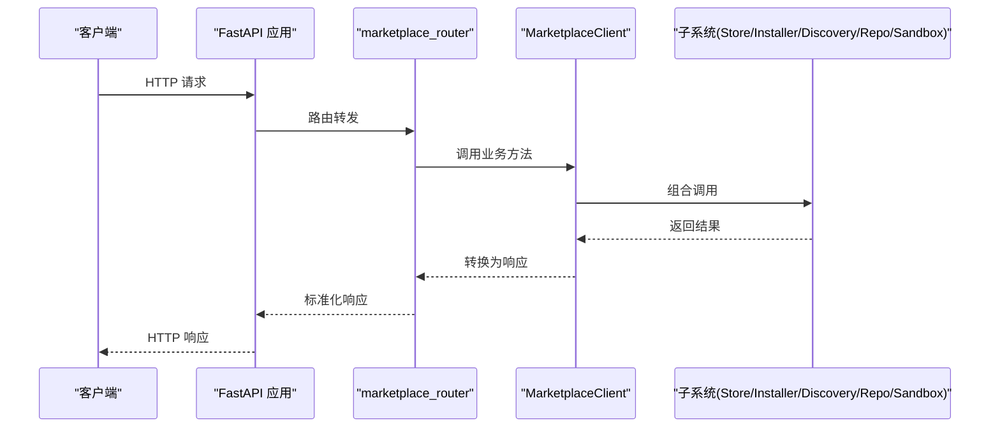
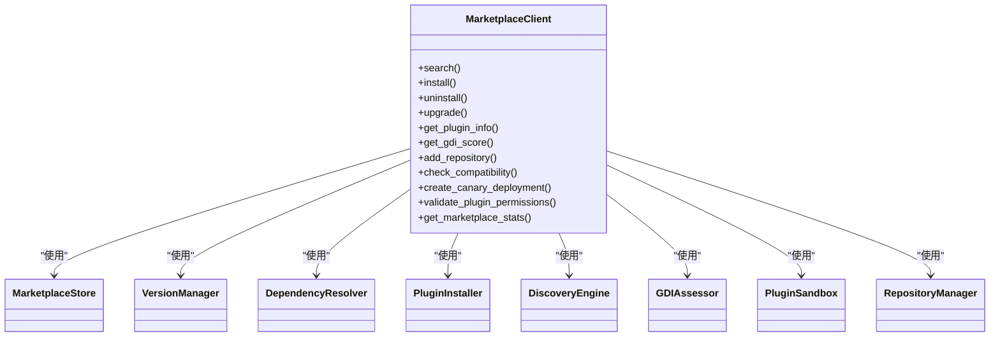

# 插件API集成接口

<cite>
**本文档引用的文件**
- [api.py](file://src/marketplace/api.py)
- [client.py](file://src/marketplace/client.py)
- [models.py](file://src/marketplace/models.py)
- [config.py](file://src/marketplace/config.py)
- [__init__.py](file://src/marketplace/__init__.py)
- [installer.py](file://src/marketplace/installer.py)
- [discovery.py](file://src/marketplace/discovery.py)
- [repository.py](file://src/marketplace/repository.py)
- [sandbox.py](file://src/marketplace/sandbox.py)
- [api.py](file://interface/api.py)
- [websocket.py](file://interface/websocket.py)
- [service.py](file://src/monitoring/service.py)
- [README.md](file://README.md)
- [QUICKSTART.md](file://QUICKSTART.md)
</cite>

## 目录
1. [简介](#简介)
2. [项目结构](#项目结构)
3. [核心组件](#核心组件)
4. [架构总览](#架构总览)
5. [详细组件分析](#详细组件分析)
6. [依赖关系分析](#依赖关系分析)
7. [性能考虑](#性能考虑)
8. [故障排查指南](#故障排查指南)
9. [结论](#结论)
10. [附录](#附录)

## 简介
本文件为 NecoRAG 插件API集成接口的完整开发文档，围绕插件市场REST API端点（marketplace_router）与统一入口客户端（MarketplaceClient）展开，系统阐述接口设计规范、认证与权限控制、通信协议与数据格式、错误处理与重试机制、API版本管理与向后兼容策略、实时数据推送与WebSocket实现、性能监控与限流控制、API文档自动生成与测试工具，以及第三方集成最佳实践与安全建议。

## 项目结构
插件API位于 src/marketplace 模块，核心文件包括：
- REST API端点：src/marketplace/api.py
- 统一入口客户端：src/marketplace/client.py
- 数据模型与枚举：src/marketplace/models.py
- 配置管理：src/marketplace/config.py
- 子系统：安装器、发现引擎、仓库管理、沙箱隔离等
- 接口服务集成：interface/api.py（挂载 marketplace_router）
- 实时推送：interface/websocket.py
- 监控服务：src/monitoring/service.py

**图表来源**
- [api.py:1-777](file://src/marketplace/api.py#L1-L777)
- [client.py:1-919](file://src/marketplace/client.py#L1-L919)
- [models.py:1-756](file://src/marketplace/models.py#L1-L756)
- [config.py:1-304](file://src/marketplace/config.py#L1-L304)
- [installer.py:1-1375](file://src/marketplace/installer.py#L1-L1375)
- [discovery.py:1-776](file://src/marketplace/discovery.py#L1-L776)
- [repository.py:1-1531](file://src/marketplace/repository.py#L1-L1531)
- [sandbox.py:1-897](file://src/marketplace/sandbox.py#L1-L897)
- [api.py:1-174](file://interface/api.py#L1-L174)
- [websocket.py:1-299](file://interface/websocket.py#L1-L299)

**章节来源**
- [api.py:1-777](file://src/marketplace/api.py#L1-L777)
- [client.py:1-919](file://src/marketplace/client.py#L1-L919)
- [models.py:1-756](file://src/marketplace/models.py#L1-L756)
- [config.py:1-304](file://src/marketplace/config.py#L1-L304)
- [installer.py:1-1375](file://src/marketplace/installer.py#L1-L1375)
- [discovery.py:1-776](file://src/marketplace/discovery.py#L1-L776)
- [repository.py:1-1531](file://src/marketplace/repository.py#L1-L1531)
- [sandbox.py:1-897](file://src/marketplace/sandbox.py#L1-L897)
- [api.py:1-174](file://interface/api.py#L1-L174)
- [websocket.py:1-299](file://interface/websocket.py#L1-L299)

## 核心组件
- REST API端点（marketplace_router）：基于 FastAPI 的 RESTful 接口，统一暴露搜索、安装、升级、评分、GDI、仓库管理、版本兼容性、灰度部署、安全与统计等能力。
- 统一入口客户端（MarketplaceClient）：组合 Store、VersionManager、DependencyResolver、PluginInstaller、DiscoveryEngine、GDIAssessor、PluginSandbox、RepositoryManager 等子系统，提供简洁的高级 API。
- 数据模型与枚举：定义插件清单、版本、评分、安装记录、GDI评分、依赖图、升级路径、Canary部署、权限级别等结构。
- 配置管理：集中管理存储路径、仓库源、沙箱与权限、搜索与更新、GDI权重等配置。
- 子系统：
  - 安装器：负责插件的安装、卸载、升级、回滚、批量操作与钩子回调。
  - 发现引擎：提供多维度搜索、推荐、趋势、相似插件、标签与分类概览。
  - 仓库管理：支持本地/远程仓库、索引同步、版本发布、包下载与校验。
  - 沙箱隔离：权限声明验证、运行时权限强制执行、资源配额管理与安全报告。
- 接口服务集成：在 FastAPI 应用中挂载 marketplace_router，并提供健康检查、CORS 等基础能力。
- 实时推送：WebSocket 管理器支持订阅/退订、查询、插入、更新、删除等实时推送。
- 监控服务：异步调度器驱动指标采集、健康检查与告警评估。

**章节来源**
- [api.py:1-777](file://src/marketplace/api.py#L1-L777)
- [client.py:47-105](file://src/marketplace/client.py#L47-L105)
- [models.py:21-92](file://src/marketplace/models.py#L21-L92)
- [config.py:24-133](file://src/marketplace/config.py#L24-L133)
- [installer.py:152-200](file://src/marketplace/installer.py#L152-L200)
- [discovery.py:21-70](file://src/marketplace/discovery.py#L21-L70)
- [repository.py:30-103](file://src/marketplace/repository.py#L30-L103)
- [sandbox.py:186-200](file://src/marketplace/sandbox.py#L186-L200)
- [api.py:16-164](file://interface/api.py#L16-L164)
- [websocket.py:18-299](file://interface/websocket.py#L18-L299)
- [service.py:21-174](file://src/monitoring/service.py#L21-L174)

## 架构总览
插件API采用“接口层 + 核心服务 + 子系统”的分层架构。接口层通过 FastAPI 暴露 REST API，并在需要时挂载 marketplace_router；核心服务由 MarketplaceClient 组合各子系统；子系统分别承担安装、发现、仓库、沙箱等职责；监控服务提供指标采集与健康检查；WebSocket 提供实时推送。

**图表来源**
- [api.py:167-198](file://src/marketplace/api.py#L167-L198)
- [client.py:110-158](file://src/marketplace/client.py#L110-L158)
- [api.py:159-164](file://interface/api.py#L159-L164)

**章节来源**
- [api.py:167-198](file://src/marketplace/api.py#L167-L198)
- [client.py:110-158](file://src/marketplace/client.py#L110-L158)
- [api.py:159-164](file://interface/api.py#L159-L164)

## 详细组件分析

### REST API端点设计规范与接口定义
- 路由前缀：/api/v1/marketplace（由接口服务挂载）
- 标签：marketplace（便于文档分组）
- 全局客户端：懒加载单例，支持 set_client 注入自定义实例（用于测试或自定义配置）
- 通用响应：APIResponse（success/message/data），便于统一处理
- 请求/响应模型：Pydantic BaseModel，包含字段约束与默认值，确保输入合法性与文档生成

关键端点类别与典型流程：
- 搜索与发现
  - GET /search：关键词、分类、类型、排序、标签、最低评分、分页
  - GET /plugins/{plugin_id}：获取插件详情（含manifest/releases/installation/gdi/rating/dependencies）
  - GET /plugins/{plugin_id}/versions：版本列表
  - GET /trending：热门趋势（窗口与限制）
  - GET /recommendations：基于已安装插件的推荐
  - GET /categories：分类概览
  - GET /tags：热门标签
  - GET /plugins/{plugin_id}/similar：相似插件
- 安装管理
  - POST /install：安装（支持指定版本与强制安装）
  - POST /uninstall：卸载（支持强制卸载）
  - POST /upgrade：升级（支持指定目标版本）
  - POST /upgrade-all：批量升级
  - GET /installed：已安装插件列表（支持状态过滤）
  - GET /updates：可用更新检查
  - POST /rollback：回滚到指定版本
- 评分与GDI
  - POST /plugins/{plugin_id}/rate：评分（支持维度评分）
  - GET /plugins/{plugin_id}/ratings：评分列表
  - GET /plugins/{plugin_id}/gdi：GDI评分
  - POST /gdi/refresh：刷新GDI（支持全量或单个）
  - GET /leaderboard：GDI排行榜
- 仓库管理
  - POST /repositories/add：添加仓库源
  - DELETE /repositories/{name}：移除仓库源
  - GET /repositories：列出仓库源
  - POST /repositories/sync：同步仓库（支持全量或指定源）
- 版本与兼容性
  - GET /plugins/{plugin_id}/compatibility：检查版本兼容性
  - GET /plugins/{plugin_id}/dependencies：依赖树
- 灰度部署
  - POST /canary/create：创建灰度部署
  - GET /canary/{deployment_id}：评估灰度部署
  - POST /canary/{deployment_id}/promote：推广灰度部署
  - POST /canary/{deployment_id}/rollback：回滚灰度部署
- 安全
  - GET /plugins/{plugin_id}/permissions：验证插件权限
  - GET /security/report：安全报告
  - PUT /plugins/{plugin_id}/permission-level：设置插件权限级别
- 统计与管理
  - GET /stats：市场统计
  - POST /publish：发布插件（构建 PluginManifest 并入库）
  - POST /cache/clear：清理缓存

错误处理：
- 统一捕获异常并返回 HTTPException（状态码与错误信息）
- 日志记录详细错误堆栈，便于排查

**章节来源**
- [api.py:19-37](file://src/marketplace/api.py#L19-L37)
- [api.py:43-146](file://src/marketplace/api.py#L43-L146)
- [api.py:167-777](file://src/marketplace/api.py#L167-L777)

### 统一入口客户端（MarketplaceClient）使用方法与配置
- 初始化
  - 支持传入 MarketplaceConfig 或使用默认配置
  - 自动确保目录存在（数据库、插件、缓存）
  - 按依赖顺序初始化子系统：Store、VersionManager、DependencyResolver、PluginSandbox、PluginInstaller、DiscoveryEngine、GDIAssessor、RepositoryManager
- 搜索与发现
  - search：关键词、分类、类型、排序、标签、最低评分、分页
  - get_plugin_info：聚合manifest、releases、installation、gdi_score、rating、dependencies
  - get_recommendations、get_trending、get_categories、get_popular_tags、find_similar
- 安装管理
  - install/uninstall/upgrade/upgrade_all/rollback/check_updates/list_installed/get_install_info
  - 安装/升级成功后自动刷新GDI
- 评分与GDI
  - rate：保存评分并触发GDI重新计算
  - get_ratings：分页获取评分
  - get_gdi_score/refresh_gdi/get_leaderboard
- 仓库管理
  - add_repository/remove_repository/list_repositories/sync_repositories
- 版本与依赖
  - check_compatibility：检查NecoRAG兼容性与依赖冲突
  - get_dependency_tree：构建依赖图并格式化文本
  - plan_upgrade_path：规划升级路径
- 灰度部署
  - create_canary_deployment/evaluate_canary/promote_canary/rollback_canary
- 安全
  - validate_plugin_permissions：验证插件权限
  - get_security_report：获取安全报告
  - set_plugin_permission_level：设置插件权限级别
- 统计与管理
  - get_marketplace_stats：聚合统计
  - publish_plugin：注册元数据、创建版本、发布到本地仓库、计算初始GDI

配置选项（MarketplaceConfig）：
- 存储路径：db_path、plugins_dir、cache_dir（默认位于 ~/.necorag/marketplace）
- 仓库源：repo_sources（name/url/type）
- 沙箱：sandbox_enabled、default_permission_level、default_resource_quota
- 搜索：search_page_size
- 自动更新：auto_check_updates、auto_update_interval_hours
- GDI权重：gdi_weights

**章节来源**
- [client.py:62-104](file://src/marketplace/client.py#L62-L104)
- [client.py:110-784](file://src/marketplace/client.py#L110-L784)
- [config.py:24-133](file://src/marketplace/config.py#L24-L133)

### 认证机制与权限控制策略
- 认证与授权
  - 项目README与安全模块文档指出具备 JWT/OAuth2 认证与 RBAC 权限管理能力（用于整体系统），但 marketplace_router 当前未显式绑定认证中间件
  - 建议在接口服务中引入认证中间件（如 JWT/OAuth2），并在需要时对特定端点进行权限校验
- 权限控制
  - 插件权限模型：READ_MEMORY、WRITE_MEMORY、DELETE_MEMORY、QUERY_KNOWLEDGE、MANAGE_INDEX、CONFIG_RAG、CALL_LLM、NETWORK_REQUEST、READ_FILES、WRITE_FILES、MANAGE_USERS、MANAGE_PLUGINS、WEBHOOK
  - 权限级别：MINIMAL、STANDARD、ELEVATED、FULL，不同级别允许的权限集合不同
  - 分类默认权限：OFFICIAL/FULL、CERTIFIED/ELEVATED、COMMUNITY/STANDARD
  - 沙箱验证：validate_permissions 对比请求权限与允许权限，生成验证结果与警告
  - 资源配额：Memory/CPU/Disk/网络/执行时间限制，支持资源使用监控与违规记录

**章节来源**
- [models.py:58-92](file://src/marketplace/models.py#L58-L92)
- [sandbox.py:50-92](file://src/marketplace/sandbox.py#L50-L92)
- [sandbox.py:261-296](file://src/marketplace/sandbox.py#L261-L296)
- [README.md:41-42](file://README.md#L41-L42)

### 客户端与服务器通信协议与数据格式
- 通信协议
  - REST API：HTTP/HTTPS，JSON 请求/响应
  - WebSocket：ws/wss，JSON 消息格式
- 数据格式
  - 请求/响应模型：Pydantic BaseModel，自动序列化为 JSON
  - 日期时间：ISO 字符串格式
  - 枚举：转为字符串值
  - 通用响应：success/message/data
- CORS：接口服务已配置跨域支持

**章节来源**
- [models.py:116-131](file://src/marketplace/models.py#L116-L131)
- [api.py:36-43](file://interface/api.py#L36-L43)

### 错误处理与重试机制
- 错误处理
  - API端点统一 try/except 捕获异常，记录日志并抛出 HTTPException
  - 客户端方法在内部异常时返回默认结果或空列表，保证调用方健壮性
- 重试机制
  - 代码中未内置自动重试逻辑；建议在客户端调用侧或网关层实现指数退避重试
  - 仓库同步与包下载涉及网络IO，可在上层增加重试与超时配置

**章节来源**
- [api.py:195-197](file://src/marketplace/api.py#L195-L197)
- [client.py:149-157](file://src/marketplace/client.py#L149-L157)

### API版本管理与向后兼容策略
- 版本前缀：/api/v1/marketplace，便于未来升级
- 兼容性检查：check_compatibility 返回兼容性、NecoRAG兼容性与依赖冲突
- 依赖解析：get_dependency_tree 返回依赖图与冲突信息
- 升级路径：plan_upgrade_path 规划升级步骤与破坏性变更
- 建议
  - 保持向后兼容：新增字段使用默认值，避免删除必填字段
  - 严格版本约束：在插件清单中声明 min/max NecoRAG 版本
  - 发布前进行兼容性测试与依赖冲突检测

**章节来源**
- [api.py:569-582](file://src/marketplace/api.py#L569-L582)
- [client.py:611-635](file://src/marketplace/client.py#L611-L635)
- [models.py:154-157](file://src/marketplace/models.py#L154-L157)

### 实时数据推送与WebSocket连接
- WebSocket 管理器
  - 支持订阅/退订、查询、插入、更新、删除、心跳
  - 房间广播：知识库更新事件广播至订阅者
  - 连接管理：自动清理断开连接，统计客户端与房间信息
- 与REST API集成
  - 接口服务在启动时挂载 marketplace_router，WebSocket 独立运行
  - 可在 WebSocket 侧触发知识库变更事件并广播

**章节来源**
- [websocket.py:18-299](file://interface/websocket.py#L18-L299)

### API性能监控与限流控制
- 监控服务
  - 异步调度器周期采集系统指标、执行健康检查、评估告警
  - 提供状态查询接口与仪表板集成
- 限流控制
  - 代码中未内置速率限制；建议在网关或FastAPI中间件层实现
  - 可结合用户角色与权限级别设置差异化限流策略

**章节来源**
- [service.py:21-174](file://src/monitoring/service.py#L21-L174)

### API文档自动生成与测试工具
- 文档生成
  - FastAPI 自动生成 OpenAPI/Swagger 与 ReDoc 文档
  - marketplace_router 使用 tags 分组，提升文档可读性
- 测试工具
  - 项目包含测试套件与示例，可参考测试入口与示例脚本
  - 建议为 marketplace_router 编写单元测试与集成测试

**章节来源**
- [api.py:26-34](file://interface/api.py#L26-L34)
- [QUICKSTART.md:25-31](file://QUICKSTART.md#L25-L31)

### 第三方集成最佳实践与安全建议
- 最佳实践
  - 使用 MarketplaceClient 进行统一调用，避免直接操作底层存储
  - 在调用前进行兼容性检查与依赖冲突检测
  - 合理设置权限级别与资源配额，遵循最小权限原则
- 安全建议
  - 为 marketplace_router 启用认证与授权中间件
  - 对敏感权限（如 MANAGE_USERS、MANAGE_PLUGINS、WRITE_FILES）进行严格审核与审计
  - 定期生成安全报告并评估风险

**章节来源**
- [sandbox.py:85-92](file://src/marketplace/sandbox.py#L85-L92)
- [README.md:41-42](file://README.md#L41-L42)

## 依赖关系分析

**图表来源**
- [client.py:74-103](file://src/marketplace/client.py#L74-L103)

**章节来源**
- [client.py:74-103](file://src/marketplace/client.py#L74-L103)

## 性能考虑
- 搜索与排序
  - 支持多维度过滤与排序，注意大数据量下的分页与索引优化
- 安装与升级
  - 安装/升级/回滚涉及磁盘IO与网络下载，建议在后台执行并提供进度反馈
- GDI计算
  - GDI评分涉及多维度权重计算，建议缓存与增量更新
- 仓库同步
  - 同步大量插件时注意并发与资源限制，避免阻塞主线程

[本节为通用指导，无需具体文件引用]

## 故障排查指南
- 常见问题
  - 404：插件不存在或端点路径错误
  - 500：内部异常，查看日志定位
  - 权限不足：检查插件权限级别与沙箱配置
- 排查步骤
  - 检查 marketplace_router 是否正确挂载
  - 确认 MarketplaceClient 初始化与子系统状态
  - 使用 get_security_report 与 get_marketplace_stats 获取系统状态
  - 在 WebSocket 侧检查订阅与广播是否正常

**章节来源**
- [api.py:208-214](file://src/marketplace/api.py#L208-L214)
- [client.py:710-728](file://src/marketplace/client.py#L710-L728)
- [websocket.py:188-213](file://interface/websocket.py#L188-L213)

## 结论
本文档系统梳理了 NecoRAG 插件API集成接口的设计与实现，明确了 REST API 端点、统一入口客户端、认证与权限控制、通信协议与数据格式、错误处理与重试、版本管理与兼容性、实时推送与监控、文档与测试工具，以及第三方集成的最佳实践与安全建议。建议在生产环境中为 marketplace_router 启用认证与授权，并结合监控服务与限流策略保障系统稳定与安全。

[本节为总结性内容，无需具体文件引用]

## 附录
- 快速开始与示例：参考 QUICKSTART.md 中的接口与WebSocket使用说明
- 项目总览：README.md 提供整体架构与特性说明

**章节来源**
- [QUICKSTART.md:279-293](file://QUICKSTART.md#L279-L293)
- [README.md:23-50](file://README.md#L23-L50)