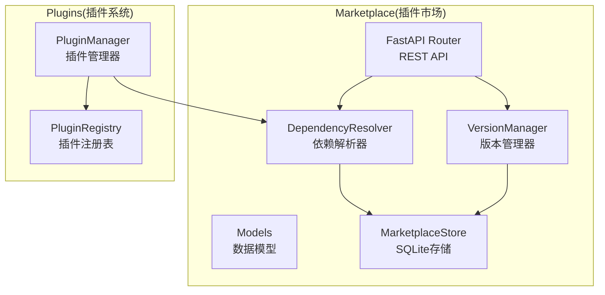
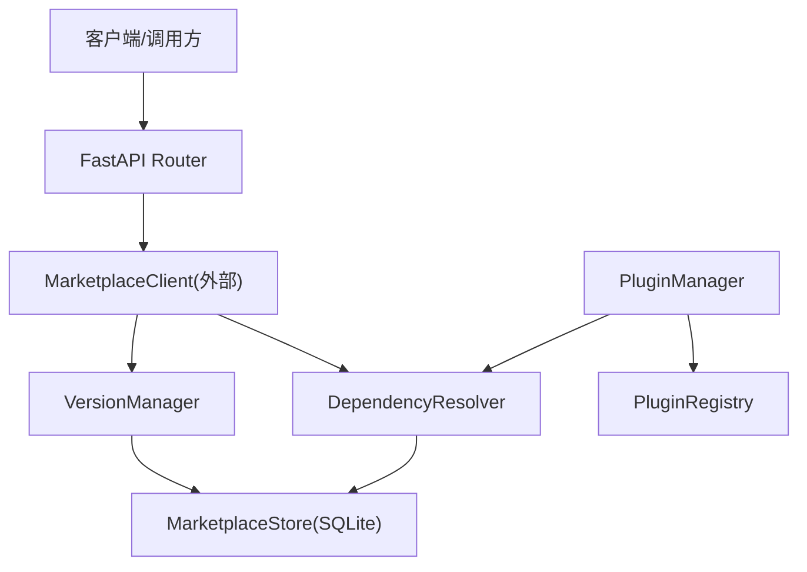
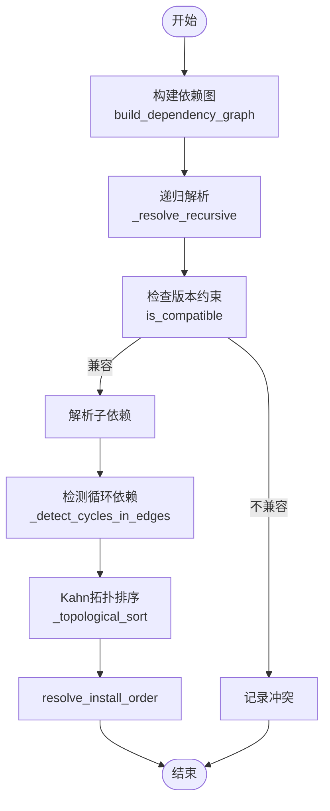
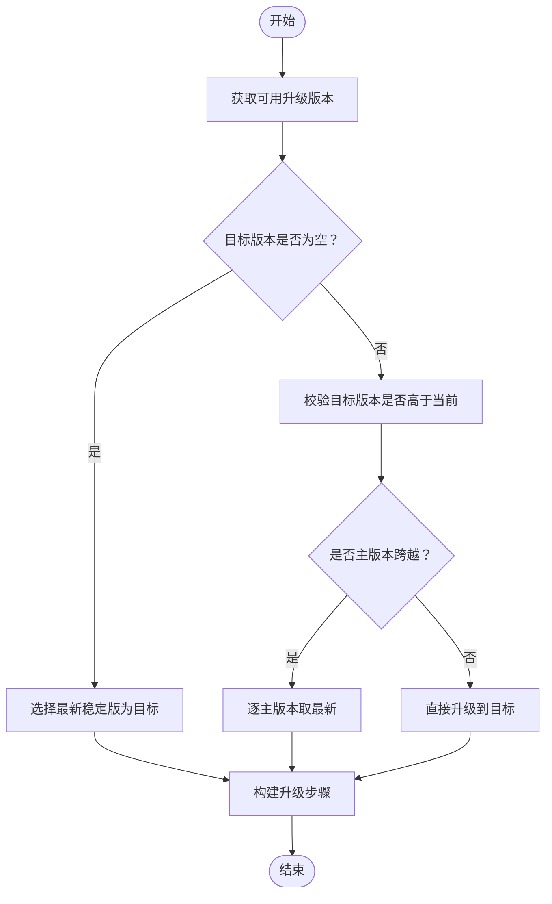
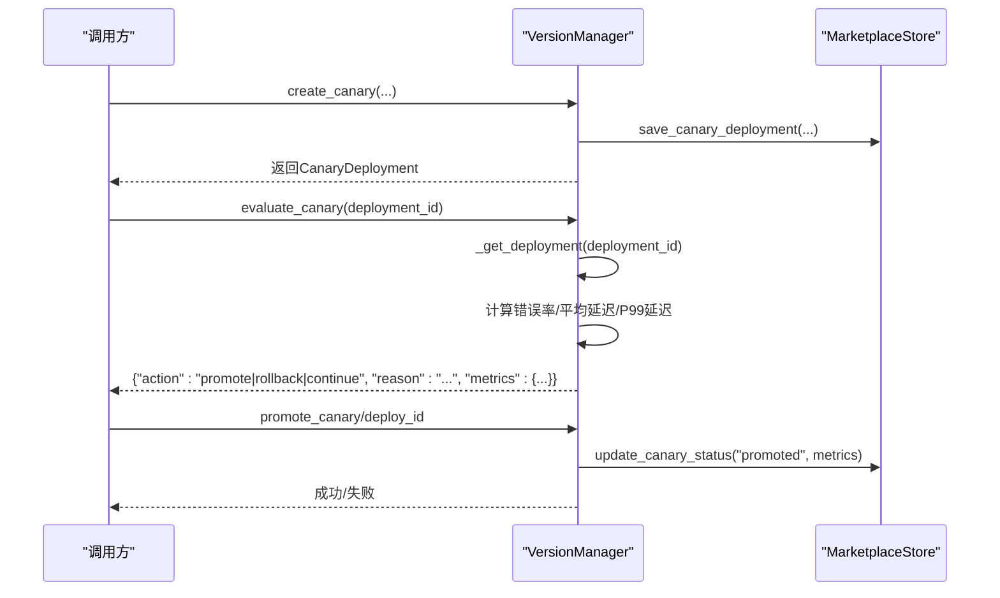
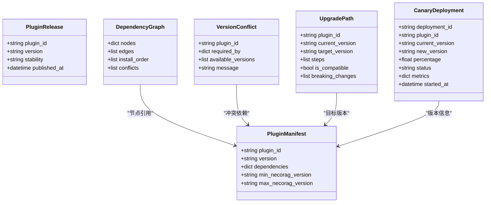
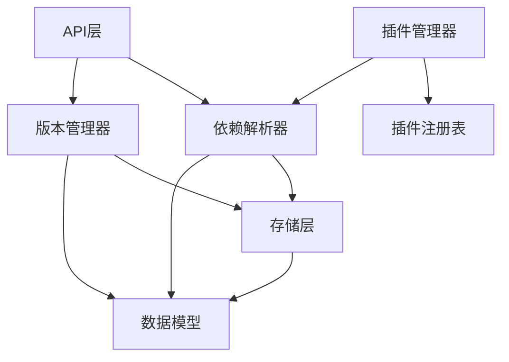

# 插件依赖管理系统

<cite>
**本文档引用的文件**
- [dependency_resolver.py](file://src/marketplace/dependency_resolver.py)
- [version_manager.py](file://src/marketplace/version_manager.py)
- [models.py](file://src/marketplace/models.py)
- [store.py](file://src/marketplace/store.py)
- [manager.py](file://src/plugins/manager.py)
- [registry.py](file://src/plugins/registry.py)
- [api.py](file://src/marketplace/api.py)
</cite>

## 目录
1. [简介](#简介)
2. [项目结构](#项目结构)
3. [核心组件](#核心组件)
4. [架构总览](#架构总览)
5. [详细组件分析](#详细组件分析)
6. [依赖关系分析](#依赖关系分析)
7. [性能考虑](#性能考虑)
8. [故障排除指南](#故障排除指南)
9. [结论](#结论)
10. [附录](#附录)

## 简介
本文件为 NecoRAG 插件依赖管理系统的深入技术文档，围绕依赖解析器（DependencyResolver）、版本管理器（VersionManager）、升级路径（UpgradePath）、版本冲突（VersionConflict）检测与解决策略展开，并提供依赖树可视化、循环依赖检测与死锁预防机制说明。同时涵盖灰度部署（CanaryDeployment）的渐进式更新策略、性能优化与缓存机制，以及依赖更新的通知与提醒功能。

## 项目结构
插件依赖管理系统主要由以下模块构成：
- marketplace 依赖管理与版本控制：依赖解析器、版本管理器、数据模型、SQLite 存储
- plugins 插件生命周期管理：插件管理器、注册表
- marketplace API：REST API 端点，统一暴露依赖管理能力

**图表来源**
- [dependency_resolver.py:20-966](file://src/marketplace/dependency_resolver.py#L20-L966)
- [version_manager.py:179-956](file://src/marketplace/version_manager.py#L179-L956)
- [models.py:135-756](file://src/marketplace/models.py#L135-L756)
- [store.py:41-1692](file://src/marketplace/store.py#L41-L1692)
- [manager.py:14-584](file://src/plugins/manager.py#L14-L584)
- [registry.py:15-383](file://src/plugins/registry.py#L15-L383)
- [api.py:1-777](file://src/marketplace/api.py#L1-L777)

**章节来源**
- [dependency_resolver.py:1-966](file://src/marketplace/dependency_resolver.py#L1-L966)
- [version_manager.py:1-956](file://src/marketplace/version_manager.py#L1-L956)
- [models.py:1-756](file://src/marketplace/models.py#L1-L756)
- [store.py:1-1692](file://src/marketplace/store.py#L1-L1692)
- [manager.py:1-584](file://src/plugins/manager.py#L1-L584)
- [registry.py:1-383](file://src/plugins/registry.py#L1-L383)
- [api.py:1-777](file://src/marketplace/api.py#L1-L777)

## 核心组件
- 依赖解析器（DependencyResolver）：负责构建依赖有向无环图（DAG）、拓扑排序、冲突检测、兼容版本求解、循环依赖检测与可视化输出。
- 版本管理器（VersionManager）：负责版本约束解析与兼容性检查、版本排序、主版本判断、升级路径规划、灰度部署（CanaryDeployment）的创建、评估与推广。
- 数据模型（Models）：定义插件清单、发布、安装、依赖图、版本冲突、升级路径、灰度部署等数据结构。
- 存储层（MarketplaceStore）：基于 SQLite 的持久化存储，提供插件元数据、版本发布、安装记录、评分、GDI 评分、灰度部署、仓库源等管理。
- 插件管理器（PluginManager）：负责插件生命周期管理、依赖关系拓扑排序、事件处理、与市场集成的安装/升级/卸载流程。
- 插件注册表（PluginRegistry）：负责插件发现、注册、版本映射与市场元数据缓存。

**章节来源**
- [dependency_resolver.py:20-966](file://src/marketplace/dependency_resolver.py#L20-L966)
- [version_manager.py:179-956](file://src/marketplace/version_manager.py#L179-L956)
- [models.py:135-756](file://src/marketplace/models.py#L135-L756)
- [store.py:41-1692](file://src/marketplace/store.py#L41-L1692)
- [manager.py:14-584](file://src/plugins/manager.py#L14-L584)
- [registry.py:15-383](file://src/plugins/registry.py#L15-L383)

## 架构总览
系统采用“API 层 → 业务逻辑层（解析器/管理器）→ 存储层”的分层架构。API 层通过 MarketplaceClient 统一调用底层服务；依赖解析与版本管理由独立模块实现，保证可复用与可测试；存储层提供 SQLite 持久化与全文搜索能力。

**图表来源**
- [api.py:25-37](file://src/marketplace/api.py#L25-L37)
- [dependency_resolver.py:20-966](file://src/marketplace/dependency_resolver.py#L20-L966)
- [version_manager.py:179-956](file://src/marketplace/version_manager.py#L179-L956)
- [store.py:41-1692](file://src/marketplace/store.py#L41-L1692)
- [manager.py:14-584](file://src/plugins/manager.py#L14-L584)
- [registry.py:15-383](file://src/plugins/registry.py#L15-L383)

## 详细组件分析

### 依赖解析器（DependencyResolver）
职责与能力：
- 依赖图构建：递归解析插件依赖，构建节点（插件ID→版本）与边（依赖关系）。
- 拓扑排序：Kahn 算法实现安装顺序确定，支持循环依赖检测与兜底处理。
- 冲突检测：收集所有传递依赖约束，检查是否存在满足所有约束的版本。
- 兼容版本求解：回溯算法尝试满足所有约束的版本组合，按版本降序优先。
- 循环依赖检测：DFS 检测，规范化环路表示，避免重复记录。
- 反向依赖与安全卸载：识别依赖于某插件的其他插件，判断是否可安全卸载。
- 依赖树可视化：格式化输出依赖树，支持循环引用标记。
- 兼容性矩阵：检查多个插件之间是否可同时安装。

关键算法与流程：

**图表来源**
- [dependency_resolver.py:44-112](file://src/marketplace/dependency_resolver.py#L44-L112)
- [dependency_resolver.py:113-205](file://src/marketplace/dependency_resolver.py#L113-L205)
- [dependency_resolver.py:296-350](file://src/marketplace/dependency_resolver.py#L296-L350)
- [dependency_resolver.py:418-477](file://src/marketplace/dependency_resolver.py#L418-L477)
- [dependency_resolver.py:562-606](file://src/marketplace/dependency_resolver.py#L562-L606)
- [dependency_resolver.py:208-241](file://src/marketplace/dependency_resolver.py#L208-L241)

依赖解析器与版本管理器协作：
- 版本选择：当存在多个候选版本时，使用版本管理器的兼容性检查与排序，优先选择满足约束且版本更高的版本。
- 冲突检测：通过收集所有传递依赖约束，交由版本管理器进行兼容性验证。
- 升级路径：结合版本管理器的升级路径规划，为用户提供清晰的升级步骤。

**章节来源**
- [dependency_resolver.py:20-966](file://src/marketplace/dependency_resolver.py#L20-L966)
- [version_manager.py:179-956](file://src/marketplace/version_manager.py#L179-L956)

### 版本管理器（VersionManager）
职责与能力：
- 版本约束解析：支持多种约束格式（通配、精确、主版本兼容、小版本兼容、范围约束等），并转换为标准 SpecifierSet。
- 兼容性检查：基于约束与版本进行匹配判断。
- 版本排序：解析并排序版本列表，支持降序排列。
- 最新兼容版本：在候选版本中筛选满足约束的最高版本。
- NecoRAG 兼容性：检查插件与当前 NecoRAG 版本的兼容范围。
- 升级路径规划：根据当前版本与目标版本，构建升级步骤（主版本跨越需分步）。
- 灰度部署：创建、评估、推广、回滚灰度部署，支持指标更新与阈值判断。

升级路径规划算法：

**图表来源**
- [version_manager.py:382-472](file://src/marketplace/version_manager.py#L382-L472)
- [version_manager.py:473-537](file://src/marketplace/version_manager.py#L473-L537)
- [version_manager.py:545-579](file://src/marketplace/version_manager.py#L545-L579)

灰度部署评估流程：

**图表来源**
- [version_manager.py:582-781](file://src/marketplace/version_manager.py#L582-L781)
- [version_manager.py:797-837](file://src/marketplace/version_manager.py#L797-L837)
- [store.py:1261-1380](file://src/marketplace/store.py#L1261-L1380)

**章节来源**
- [version_manager.py:179-956](file://src/marketplace/version_manager.py#L179-L956)
- [store.py:1261-1380](file://src/marketplace/store.py#L1261-L1380)

### 数据模型（Models）
关键数据结构：
- PluginManifest：插件清单，包含标识、版本、依赖、权限、NecoRAG 兼容范围等。
- PluginRelease：版本发布记录，包含下载地址、校验和、稳定性、发布时间等。
- DependencyGraph：依赖图，包含节点、边、安装顺序与冲突列表。
- VersionConflict：版本冲突，包含冲突依赖、请求方、可用版本与消息。
- UpgradePath：升级路径，包含当前/目标版本、升级步骤、兼容性与破坏性变更提示。
- CanaryDeployment：灰度部署，包含部署ID、当前/新版本、流量比例、状态与指标。

**图表来源**
- [models.py:135-756](file://src/marketplace/models.py#L135-L756)

**章节来源**
- [models.py:135-756](file://src/marketplace/models.py#L135-L756)

### 存储层（MarketplaceStore）
职责与能力：
- 插件元数据：增删改查、全文搜索（FTS5）、索引维护。
- 版本发布：增删改查、最新版本查询、下载计数。
- 安装记录：增删改查、状态管理、活跃安装统计。
- 评分与统计：评分增删改查、使用事件记录、趋势统计。
- GDI 评分：保存与查询、排行榜。
- 灰度部署：创建、查询、状态更新、指标合并。
- 仓库源：增删改查、同步时间维护。
- 数据库工具：统计、压缩、备份。

性能与可靠性：
- WAL 模式：提升并发写入性能。
- 外键约束：保证数据一致性。
- 线程本地连接：避免跨线程共享连接问题。
- FTS5 全文索引：加速插件搜索。

**章节来源**
- [store.py:41-1692](file://src/marketplace/store.py#L41-L1692)

### 插件管理器（PluginManager）与注册表（PluginRegistry）
职责与能力：
- 插件管理器：批量加载/卸载、启用/禁用、事件处理、依赖拓扑排序、与市场集成的安装/升级/卸载流程。
- 插件注册表：插件发现与注册、版本映射、市场元数据缓存、插件信息查询。

与依赖解析器的关系：
- 插件管理器在加载/卸载时使用拓扑排序，确保被依赖的插件先于依赖它的插件处理。
- 与依赖解析器协同，保障插件生命周期与依赖关系的一致性。

**章节来源**
- [manager.py:14-584](file://src/plugins/manager.py#L14-L584)
- [registry.py:15-383](file://src/plugins/registry.py#L15-L383)

## 依赖关系分析
组件耦合与协作：
- API 层通过 MarketplaceClient 统一调用依赖解析器与版本管理器。
- 依赖解析器与版本管理器均依赖存储层进行数据读取与写入。
- 插件管理器与注册表负责插件生命周期与依赖关系的本地管理。
- 数据模型作为跨模块的数据契约，确保各模块间的数据一致性。

**图表来源**
- [api.py:25-37](file://src/marketplace/api.py#L25-L37)
- [dependency_resolver.py:20-966](file://src/marketplace/dependency_resolver.py#L20-L966)
- [version_manager.py:179-956](file://src/marketplace/version_manager.py#L179-L956)
- [store.py:41-1692](file://src/marketplace/store.py#L41-L1692)
- [manager.py:14-584](file://src/plugins/manager.py#L14-L584)
- [registry.py:15-383](file://src/plugins/registry.py#L15-L383)
- [models.py:135-756](file://src/marketplace/models.py#L135-L756)

**章节来源**
- [api.py:1-777](file://src/marketplace/api.py#L1-L777)
- [dependency_resolver.py:1-966](file://src/marketplace/dependency_resolver.py#L1-L966)
- [version_manager.py:1-956](file://src/marketplace/version_manager.py#L1-L956)
- [store.py:1-1692](file://src/marketplace/store.py#L1-L1692)
- [manager.py:1-584](file://src/plugins/manager.py#L1-L584)
- [registry.py:1-383](file://src/plugins/registry.py#L1-L383)
- [models.py:1-756](file://src/marketplace/models.py#L1-L756)

## 性能考虑
- 存储层优化
  - WAL 模式：提升并发写入吞吐，适合频繁安装/升级场景。
  - 外键约束：保证数据一致性，避免脏数据引发的二次解析成本。
  - 线程本地连接：避免跨线程共享连接导致的锁竞争。
  - FTS5 全文索引：加速插件搜索，降低查询开销。
- 版本与依赖解析
  - 优先尝试高版本：通过降序排序与早期短路，减少不必要的兼容性检查。
  - 回溯求解剪枝：在回溯过程中尽早发现不满足约束的分支，减少搜索空间。
  - 缓存灰度部署：内存缓存与持久化双写，降低重复查询成本。
- API 层
  - 统一客户端封装：减少重复初始化与连接开销。
  - 批量操作：如批量升级、批量卸载，减少多次往返。

[本节为通用性能建议，不直接分析具体文件]

## 故障排除指南
常见问题与定位：
- 依赖图构建失败
  - 现象：返回包含冲突的依赖图或默认节点。
  - 排查：检查插件是否存在、版本约束是否合理、存储层是否可访问。
  - 参考路径：[dependency_resolver.py:44-112](file://src/marketplace/dependency_resolver.py#L44-L112)
- 循环依赖
  - 现象：拓扑排序后剩余节点或显式环路报告。
  - 排查：查看环路节点列表，调整依赖关系。
  - 参考路径：[dependency_resolver.py:562-606](file://src/marketplace/dependency_resolver.py#L562-L606)
- 版本冲突
  - 现象：检测到某个依赖无版本满足所有请求方约束。
  - 排查：检查请求方的版本约束、可用版本列表、版本排序。
  - 参考路径：[dependency_resolver.py:296-350](file://src/marketplace/dependency_resolver.py#L296-L350)
- 灰度部署异常
  - 现象：评估失败、推广/回滚失败。
  - 排查：检查指标数据完整性、阈值设置、存储层状态更新。
  - 参考路径：[version_manager.py:634-781](file://src/marketplace/version_manager.py#L634-L781), [store.py:1342-1380](file://src/marketplace/store.py#L1342-L1380)
- 插件卸载不安全
  - 现象：提示存在依赖于该插件的其他插件。
  - 排查：使用反向依赖查询确认依赖者，必要时先卸载依赖者。
  - 参考路径：[dependency_resolver.py:700-732](file://src/marketplace/dependency_resolver.py#L700-L732)

**章节来源**
- [dependency_resolver.py:296-350](file://src/marketplace/dependency_resolver.py#L296-L350)
- [dependency_resolver.py:562-606](file://src/marketplace/dependency_resolver.py#L562-L606)
- [dependency_resolver.py:700-732](file://src/marketplace/dependency_resolver.py#L700-L732)
- [version_manager.py:634-781](file://src/marketplace/version_manager.py#L634-L781)
- [store.py:1342-1380](file://src/marketplace/store.py#L1342-L1380)

## 结论
本系统通过独立的依赖解析器与版本管理器，结合 SQLite 存储与 REST API，实现了完整的插件依赖管理闭环。其核心优势在于：
- 明确的职责分离与模块化设计，便于扩展与维护。
- 完整的冲突检测与解决方案生成，保障依赖关系的可行性。
- 渐进式灰度发布与升级路径规划，降低升级风险。
- 可视化与分析工具，帮助用户理解依赖关系与健康状况。

[本节为总结性内容，不直接分析具体文件]

## 附录

### 依赖树可视化展示
- 依赖树格式化输出：支持缩进树形结构，循环引用自动标注。
- 依赖深度与总数统计：辅助评估依赖复杂度。
- 兼容性矩阵：检查多个插件之间的兼容性。

**章节来源**
- [dependency_resolver.py:755-966](file://src/marketplace/dependency_resolver.py#L755-L966)

### 依赖循环检测与死锁预防
- DFS 循环检测：规范化环路表示，避免重复记录。
- 拓扑排序兜底：若存在循环，保留剩余节点顺序，避免死锁。
- 反向依赖查询：提前发现潜在循环来源。

**章节来源**
- [dependency_resolver.py:562-606](file://src/marketplace/dependency_resolver.py#L562-L606)
- [dependency_resolver.py:208-241](file://src/marketplace/dependency_resolver.py#L208-L241)

### 版本冲突检测与解决策略
- 约束收集：递归收集所有传递依赖的版本约束。
- 兼容性验证：逐一版本尝试，满足所有约束即为可行解。
- 解决方案：回溯算法生成兼容版本组合；若无解，返回冲突详情。

**章节来源**
- [dependency_resolver.py:296-350](file://src/marketplace/dependency_resolver.py#L296-L350)
- [dependency_resolver.py:418-477](file://src/marketplace/dependency_resolver.py#L418-L477)

### 升级路径规划最佳实践
- 主版本跨越需分步：逐主版本取该主版本的最新稳定版本。
- 目标版本校验：确保目标版本高于当前版本，否则提示不兼容。
- 破坏性变更提示：主版本升级时明确提示潜在不兼容风险。

**章节来源**
- [version_manager.py:382-472](file://src/marketplace/version_manager.py#L382-L472)
- [version_manager.py:473-537](file://src/marketplace/version_manager.py#L473-L537)

### 灰度部署（CanaryDeployment）渐进式更新
- 创建：设定初始流量比例，记录部署状态与指标。
- 评估：基于错误率、平均延迟、P99 延迟与样本量阈值进行判定。
- 推广：达到阈值后推广至 100% 流量。
- 回滚：异常时快速回滚至旧版本。

**章节来源**
- [version_manager.py:582-781](file://src/marketplace/version_manager.py#L582-L781)
- [version_manager.py:797-837](file://src/marketplace/version_manager.py#L797-L837)
- [store.py:1261-1380](file://src/marketplace/store.py#L1261-L1380)

### 依赖管理的性能优化与缓存机制
- 存储层缓存：内存缓存灰度部署，持久化双写，降低重复查询。
- 版本排序与兼容性检查：降序优先与早期短路，减少无效计算。
- API 统一客户端：减少重复初始化与连接开销。

**章节来源**
- [version_manager.py:782-796](file://src/marketplace/version_manager.py#L782-L796)
- [store.py:1261-1296](file://src/marketplace/store.py#L1261-L1296)

### 依赖更新的通知与提醒功能
- 使用统计与趋势：记录安装/卸载/激活/错误等事件，支持趋势分析。
- 热门插件排行：基于事件数的热门趋势，辅助决策。
- API 端点：提供更新检查、安装列表、更新统计等接口。

**章节来源**
- [store.py:1045-1173](file://src/marketplace/store.py#L1045-L1173)
- [api.py:386-410](file://src/marketplace/api.py#L386-L410)
- [api.py:411-452](file://src/marketplace/api.py#L411-L452)
- [api.py:487-501](file://src/marketplace/api.py#L487-L501)