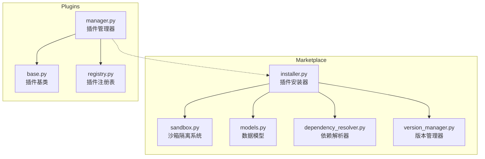
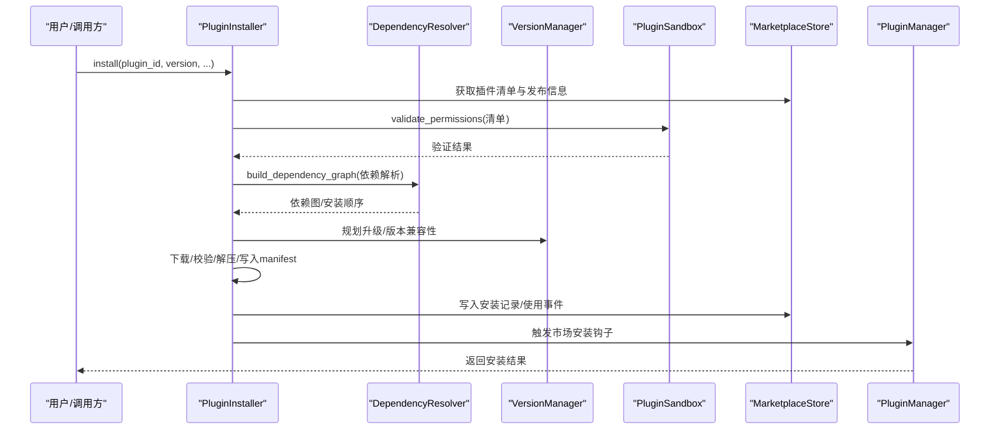
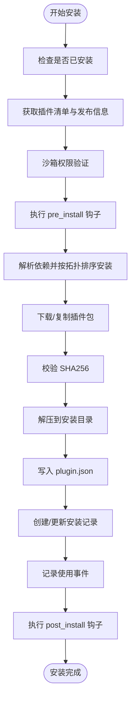
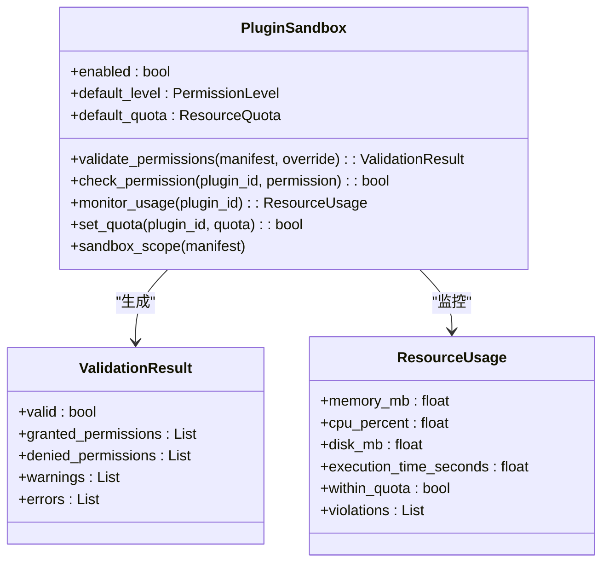
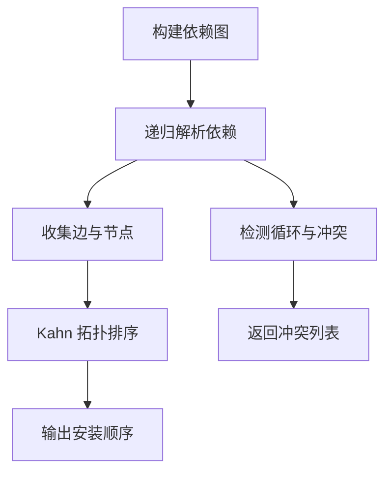
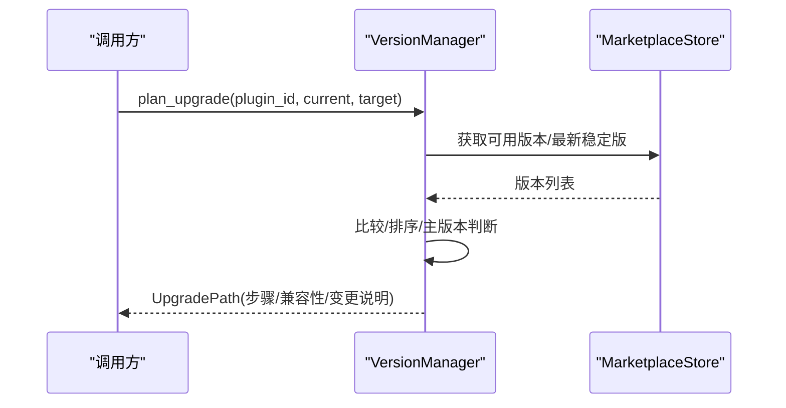
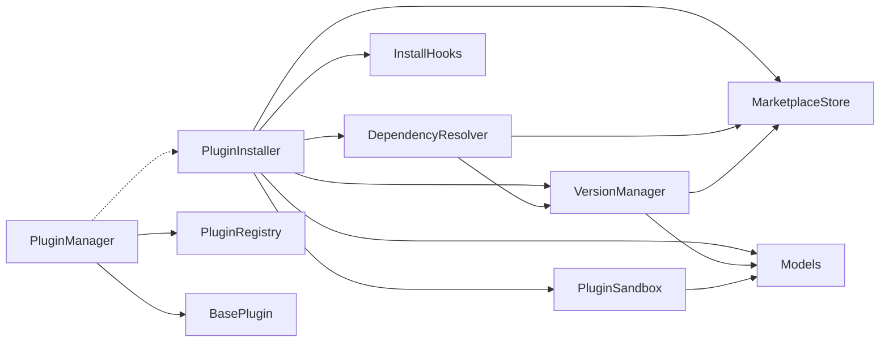

# 插件安装系统

<cite>
**本文档引用的文件**
- [src/marketplace/installer.py](file://src/marketplace/installer.py)
- [src/marketplace/sandbox.py](file://src/marketplace/sandbox.py)
- [src/marketplace/models.py](file://src/marketplace/models.py)
- [src/marketplace/dependency_resolver.py](file://src/marketplace/dependency_resolver.py)
- [src/marketplace/version_manager.py](file://src/marketplace/version_manager.py)
- [src/plugins/manager.py](file://src/plugins/manager.py)
- [src/plugins/base.py](file://src/plugins/base.py)
- [src/plugins/registry.py](file://src/plugins/registry.py)
</cite>

## 目录
1. [简介](#简介)
2. [项目结构](#项目结构)
3. [核心组件](#核心组件)
4. [架构总览](#架构总览)
5. [详细组件分析](#详细组件分析)
6. [依赖分析](#依赖分析)
7. [性能考虑](#性能考虑)
8. [故障排查指南](#故障排查指南)
9. [结论](#结论)
10. [附录](#附录)

## 简介
本文件为 NecoRAG 插件安装系统的详细操作文档，覆盖从插件下载、依赖检查、解压安装、配置设置到激活的完整生命周期管理；解释插件安装器（PluginInstaller）的核心能力与流程；阐述沙箱隔离系统（PluginSandbox）的安全机制（权限验证、资源配额、执行隔离）；说明安装钩子（InstallHooks）的生命周期管理与错误处理策略；提供卸载、升级、回滚的实现细节；包含进度跟踪与状态管理、回滚机制与故障恢复策略，以及监控与日志记录功能。

## 项目结构
插件安装系统主要分布在 marketplace 与 plugins 两大模块：
- marketplace：负责插件市场侧的安装、升级、回滚、依赖解析、版本管理、沙箱安全等
- plugins：负责插件的生命周期管理、注册与加载、事件处理

图表来源
- [src/marketplace/installer.py:152-1375](file://src/marketplace/installer.py#L152-L1375)
- [src/marketplace/sandbox.py:186-897](file://src/marketplace/sandbox.py#L186-L897)
- [src/marketplace/models.py:135-756](file://src/marketplace/models.py#L135-L756)
- [src/marketplace/dependency_resolver.py:20-966](file://src/marketplace/dependency_resolver.py#L20-L966)
- [src/marketplace/version_manager.py:179-956](file://src/marketplace/version_manager.py#L179-L956)
- [src/plugins/manager.py:14-584](file://src/plugins/manager.py#L14-L584)
- [src/plugins/base.py:25-385](file://src/plugins/base.py#L25-L385)
- [src/plugins/registry.py:15-383](file://src/plugins/registry.py#L15-L383)

章节来源
- [src/marketplace/installer.py:152-1375](file://src/marketplace/installer.py#L152-L1375)
- [src/marketplace/sandbox.py:186-897](file://src/marketplace/sandbox.py#L186-L897)
- [src/marketplace/models.py:135-756](file://src/marketplace/models.py#L135-L756)
- [src/marketplace/dependency_resolver.py:20-966](file://src/marketplace/dependency_resolver.py#L20-L966)
- [src/marketplace/version_manager.py:179-956](file://src/marketplace/version_manager.py#L179-L956)
- [src/plugins/manager.py:14-584](file://src/plugins/manager.py#L14-L584)
- [src/plugins/base.py:25-385](file://src/plugins/base.py#L25-L385)
- [src/plugins/registry.py:15-383](file://src/plugins/registry.py#L15-L383)

## 核心组件
- 插件安装器（PluginInstaller）：负责安装、卸载、升级、回滚、批量安装、检查更新、缓存管理等；内置线程锁保证并发安全；集成依赖解析、版本管理、沙箱验证、钩子回调与事件记录。
- 沙箱隔离系统（PluginSandbox）：提供权限验证、运行时权限检查、资源配额监控与违规检测、上下文创建与销毁、安全审计与报告。
- 依赖解析器（DependencyResolver）：构建依赖图、拓扑排序、冲突检测、兼容版本求解、反向依赖查询。
- 版本管理器（VersionManager）：版本约束解析、兼容性检查、升级路径规划、灰度发布支持。
- 插件管理器（PluginManager）：插件生命周期管理、事件处理、与市场集成的安装/卸载/升级协调。
- 插件基类与注册表：统一插件接口、类型与权限声明、注册与加载、市场元数据映射。

章节来源
- [src/marketplace/installer.py:152-1375](file://src/marketplace/installer.py#L152-L1375)
- [src/marketplace/sandbox.py:186-897](file://src/marketplace/sandbox.py#L186-L897)
- [src/marketplace/dependency_resolver.py:20-966](file://src/marketplace/dependency_resolver.py#L20-L966)
- [src/marketplace/version_manager.py:179-956](file://src/marketplace/version_manager.py#L179-L956)
- [src/plugins/manager.py:14-584](file://src/plugins/manager.py#L14-L584)
- [src/plugins/base.py:25-385](file://src/plugins/base.py#L25-L385)
- [src/plugins/registry.py:15-383](file://src/plugins/registry.py#L15-L383)

## 架构总览
插件安装系统采用“市场侧安装器 + 插件侧管理器”的双层架构：
- MarketPlace 层：安装器协调下载、校验、解压、安装记录、事件记录、钩子回调、沙箱验证与版本/依赖管理。
- Plugins 层：管理器负责插件加载、启用/禁用、事件广播、与市场集成的生命周期同步。

图表来源
- [src/marketplace/installer.py:217-402](file://src/marketplace/installer.py#L217-L402)
- [src/marketplace/dependency_resolver.py:44-112](file://src/marketplace/dependency_resolver.py#L44-L112)
- [src/marketplace/version_manager.py:382-472](file://src/marketplace/version_manager.py#L382-L472)
- [src/marketplace/sandbox.py:235-318](file://src/marketplace/sandbox.py#L235-L318)
- [src/plugins/manager.py:299-391](file://src/plugins/manager.py#L299-L391)

## 详细组件分析

### 插件安装器（PluginInstaller）
职责与流程
- 安装：依赖检查、下载/复制包、校验 SHA256、解压到 plugins_dir/plugin_id/version、写入 plugin.json、创建安装记录、记录使用事件、触发 post_install 钩子。
- 卸载：前置钩子、清理目录、移除安装记录、记录使用事件、触发 post_uninstall 钩子。
- 升级：规划升级路径（含主版本升级分步）、兼容性验证、备份配置、安装新版本、迁移配置、清理旧版本、记录使用事件、触发 post_upgrade 钩子。
- 回滚：检查目标版本目录是否存在，存在则更新安装记录，不存在则重新安装目标版本。
- 批量安装：检测冲突、解析安装顺序、逐个安装。
- 检查更新：对比当前版本与最新稳定版。
- 缓存管理：清理缓存、统计缓存大小。

关键实现要点
- 目录结构：plugins_dir/plugin_id/version，manifest 写入 plugin.json，使用原子写入与原子移动避免竞态。
- 安全性：下载前校验 checksum；解压时进行目录遍历防护（tar/zip）。
- 并发：全局锁保护安装/卸载/升级/回滚等关键路径。
- 钩子：InstallHooks 提供 pre/post/uninstall/upgrade/on_error 生命周期回调，支持添加/移除与错误传播。
- 事件：安装/卸载/升级/回滚均记录使用事件到 Store。

图表来源
- [src/marketplace/installer.py:217-390](file://src/marketplace/installer.py#L217-L390)

章节来源
- [src/marketplace/installer.py:152-1375](file://src/marketplace/installer.py#L152-L1375)
- [src/marketplace/models.py:536-572](file://src/marketplace/models.py#L536-L572)

### 沙箱隔离系统（PluginSandbox）
安全机制
- 权限验证：根据插件分类与权限级别映射，对比请求权限与允许权限，生成验证结果与警告；支持敏感权限提示。
- 运行时权限检查：在执行具体操作时检查插件是否具备相应权限。
- 资源配额：内存、CPU、磁盘、执行时间限制；监控实时资源使用并检测违规。
- 上下文管理：自动创建/销毁沙箱上下文，确保资源清理；支持自定义权限级别与配额覆盖。
- 安全审计：提供活跃上下文、资源使用、安全报告等查询接口。

图表来源
- [src/marketplace/sandbox.py:186-897](file://src/marketplace/sandbox.py#L186-L897)

章节来源
- [src/marketplace/sandbox.py:186-897](file://src/marketplace/sandbox.py#L186-L897)

### 依赖解析器（DependencyResolver）
功能
- 构建依赖图：递归解析传递依赖，收集节点、边、安装顺序，检测循环依赖与冲突。
- 拓扑排序：Kahn 算法确定安装顺序，被依赖的插件排在前面。
- 冲突检测：收集所有传递依赖约束，判断是否存在满足所有约束的版本。
- 兼容版本求解：回溯算法寻找满足约束的兼容版本组合。
- 反向依赖：查询依赖于某插件的已安装插件，保障安全卸载。

图表来源
- [src/marketplace/dependency_resolver.py:44-112](file://src/marketplace/dependency_resolver.py#L44-L112)
- [src/marketplace/dependency_resolver.py:208-293](file://src/marketplace/dependency_resolver.py#L208-L293)

章节来源
- [src/marketplace/dependency_resolver.py:20-966](file://src/marketplace/dependency_resolver.py#L20-L966)

### 版本管理器（VersionManager）
功能
- 版本约束解析：支持 ^、~、>=、<=、==、~= 等多种格式，转换为 SpecifierSet。
- 兼容性检查：判断版本是否满足约束。
- 升级路径规划：识别主版本升级并生成分步升级路径，标注潜在不兼容变更。
- 灰度发布：创建/评估/推广/回滚灰度部署，基于错误率与延迟阈值决策。

图表来源
- [src/marketplace/version_manager.py:382-472](file://src/marketplace/version_manager.py#L382-L472)

章节来源
- [src/marketplace/version_manager.py:179-956](file://src/marketplace/version_manager.py#L179-L956)

### 插件管理器（PluginManager）
职责
- 插件加载/卸载/启用/禁用：按依赖拓扑排序，支持批量操作。
- 事件处理：注册/注销事件处理器，触发事件并通知插件。
- 市场集成：与 MarketplaceClient 协作，从市场安装/卸载/升级插件，并在本地注册/注销插件类，触发市场生命周期钩子。

章节来源
- [src/plugins/manager.py:14-584](file://src/plugins/manager.py#L14-L584)

### 插件基类与注册表
- 插件基类（BasePlugin）：定义插件标准接口、生命周期方法、权限声明、市场元数据映射与市场生命周期钩子。
- 插件注册表（PluginRegistry）：注册/注销插件类、加载/卸载插件实例、发现插件模块、缓存市场元数据、版本索引与映射。

章节来源
- [src/plugins/base.py:25-385](file://src/plugins/base.py#L25-L385)
- [src/plugins/registry.py:15-383](file://src/plugins/registry.py#L15-L383)

## 依赖分析
组件耦合关系
- PluginInstaller 依赖 MarketplaceStore、DependencyResolver、VersionManager、PluginSandbox、InstallHooks、Models。
- PluginSandbox 依赖 Models（权限/配额/上下文）。
- DependencyResolver 依赖 Store 与 VersionManager。
- VersionManager 依赖 Store 与 Models。
- PluginManager 依赖 PluginRegistry 与 BasePlugin，与 MarketplaceInstaller 协作。

图表来源
- [src/marketplace/installer.py:173-214](file://src/marketplace/installer.py#L173-L214)
- [src/marketplace/dependency_resolver.py:27-41](file://src/marketplace/dependency_resolver.py#L27-L41)
- [src/marketplace/version_manager.py:186-194](file://src/marketplace/version_manager.py#L186-L194)
- [src/plugins/manager.py:23-26](file://src/plugins/manager.py#L23-L26)

章节来源
- [src/marketplace/installer.py:173-214](file://src/marketplace/installer.py#L173-L214)
- [src/marketplace/dependency_resolver.py:27-41](file://src/marketplace/dependency_resolver.py#L27-L41)
- [src/marketplace/version_manager.py:186-194](file://src/marketplace/version_manager.py#L186-L194)
- [src/plugins/manager.py:23-26](file://src/plugins/manager.py#L23-L26)

## 性能考虑
- 下载与校验：使用临时文件原子移动与 SHA256 校验，避免部分下载导致的 IO 竞态。
- 解压安全：tar/zip 解压前进行路径合法性检查，防止目录遍历攻击。
- 资源监控：优先使用 psutil 获取资源使用，若不可用则回退至 resource 模块（Unix）或基础方法。
- 并发控制：安装/卸载/升级/回滚路径使用全局锁，避免多线程竞争。
- 缓存策略：下载缓存按版本命名，命中则直接复用；缓存损坏自动清理并重新下载。
- 依赖解析：拓扑排序与冲突检测在批量安装前完成，降低运行时开销。

## 故障排查指南
常见问题与定位
- 安装失败：查看 InstallResult.errors 与日志；检查 pre_install 钩子返回值、沙箱权限验证、依赖冲突、下载/校验/解压异常。
- 卸载失败：检查反向依赖（check_safe_to_uninstall）、目录清理异常、Store 更新失败。
- 升级失败：确认版本兼容性（plan_upgrade）、备份/迁移配置失败、清理旧版本异常。
- 回滚失败：目标版本目录不存在时会尝试重新安装，若仍失败检查版本可用性与安装器错误。
- 权限拒绝：检查 PluginSandbox 的权限级别与敏感权限警告；必要时调整权限覆盖或配额。
- 资源超限：监控 ResourceUsage 的 violations，调整 ResourceQuota 或优化插件实现。

章节来源
- [src/marketplace/installer.py:392-402](file://src/marketplace/installer.py#L392-L402)
- [src/marketplace/installer.py:745-755](file://src/marketplace/installer.py#L745-L755)
- [src/marketplace/installer.py:928-938](file://src/marketplace/installer.py#L928-L938)
- [src/marketplace/sandbox.py:462-529](file://src/marketplace/sandbox.py#L462-L529)

## 结论
插件安装系统通过安装器、沙箱、依赖解析、版本管理与插件管理器的协同，实现了从下载到激活的全生命周期管理。系统强调安全性（权限验证、资源配额、解压防护）、可靠性（校验和、原子写入、回滚机制、错误钩子）、可观测性（事件记录、监控与日志）。配合批量安装、升级路径规划与灰度发布，能够支撑生产环境的稳定演进。

## 附录
- 目录约定：插件安装目录 plugins_dir/plugin_id/version，manifest 写入 plugin.json。
- 钩子类型：pre_install、post_install、pre_uninstall、post_uninstall、pre_upgrade、post_upgrade、on_error。
- 事件记录：安装、卸载、升级、回滚均记录使用事件，便于审计与追踪。
- 回滚策略：优先使用已存在的版本目录；若不存在则重新安装目标版本，保留上一版本目录以支持二次回滚。