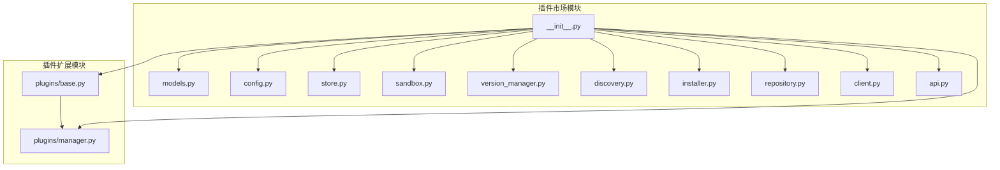
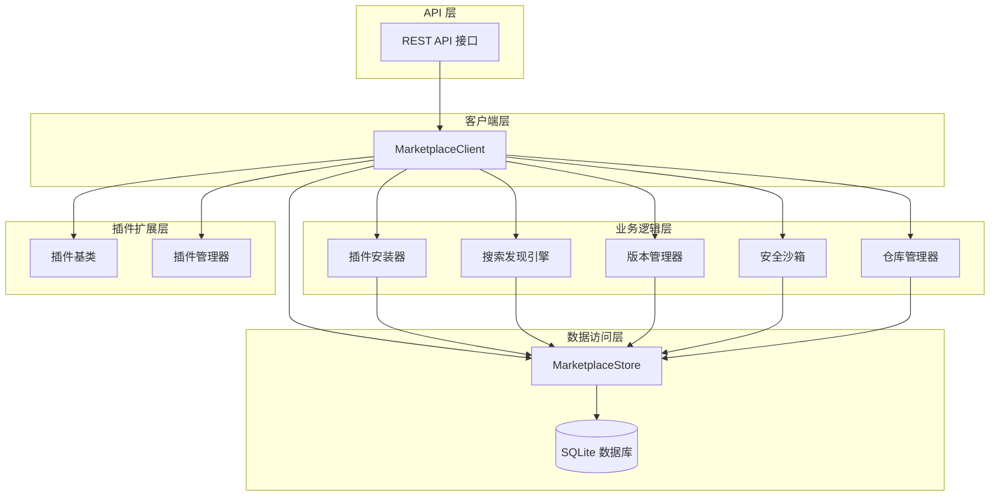
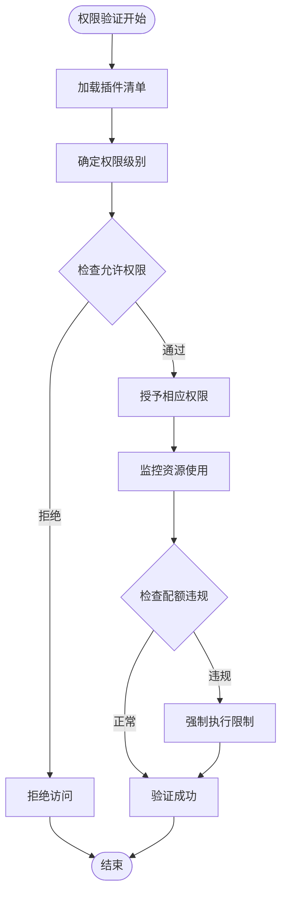
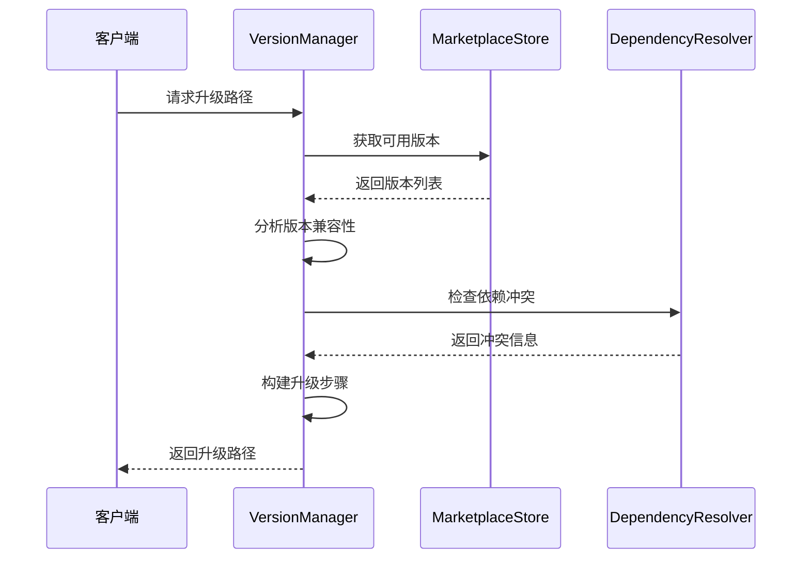
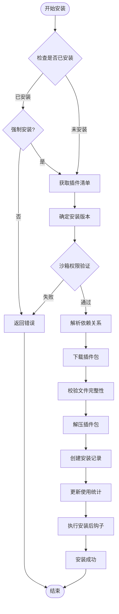
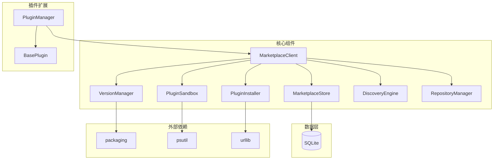

# 插件市场核心架构

<cite>
**本文档引用的文件**
- [src/marketplace/__init__.py](file://src/marketplace/__init__.py)
- [src/marketplace/models.py](file://src/marketplace/models.py)
- [src/marketplace/config.py](file://src/marketplace/config.py)
- [src/marketplace/store.py](file://src/marketplace/store.py)
- [src/marketplace/sandbox.py](file://src/marketplace/sandbox.py)
- [src/marketplace/version_manager.py](file://src/marketplace/version_manager.py)
- [src/marketplace/discovery.py](file://src/marketplace/discovery.py)
- [src/marketplace/installer.py](file://src/marketplace/installer.py)
- [src/marketplace/repository.py](file://src/marketplace/repository.py)
- [src/marketplace/client.py](file://src/marketplace/client.py)
- [src/marketplace/api.py](file://src/marketplace/api.py)
- [src/plugins/base.py](file://src/plugins/base.py)
- [src/plugins/manager.py](file://src/plugins/manager.py)
</cite>

## 目录
1. [引言](#引言)
2. [项目结构](#项目结构)
3. [核心组件](#核心组件)
4. [架构概览](#架构概览)
5. [详细组件分析](#详细组件分析)
6. [依赖分析](#依赖分析)
7. [性能考虑](#性能考虑)
8. [故障排除指南](#故障排除指南)
9. [结论](#结论)

## 引言

NecoRAG 插件市场是一个完整的插件生态系统，提供了从插件开发、发布、安装到管理的全生命周期支持。该系统采用模块化设计，通过清晰的架构层次实现了插件的标准化管理。

插件市场核心架构围绕以下几个关键方面构建：

- **标准化数据模型**：定义了插件清单、版本发布、评分等核心数据结构
- **配置管理系统**：提供灵活的配置选项和环境变量支持
- **安全沙箱机制**：实现权限控制和资源隔离
- **版本管理**：支持语义化版本控制和升级路径规划
- **仓库管理**：支持多源聚合和插件包管理
- **REST API 接口**：提供统一的外部访问接口

## 项目结构

插件市场模块位于 `src/marketplace/` 目录下，采用清晰的模块化组织结构：

**图表来源**
- [src/marketplace/__init__.py:1-192](file://src/marketplace/__init__.py#L1-L192)
- [src/plugins/base.py:1-385](file://src/plugins/base.py#L1-L385)
- [src/plugins/manager.py:1-584](file://src/plugins/manager.py#L1-L584)

**章节来源**
- [src/marketplace/__init__.py:1-192](file://src/marketplace/__init__.py#L1-L192)

## 核心组件

### 数据模型层

插件市场定义了完整的数据模型体系，包括：

#### 核心数据模型
- **PluginManifest**：插件清单，描述插件的核心元数据
- **PluginRelease**：版本发布记录，包含下载信息和版本详情
- **PluginRating**：用户评分系统，支持多维度评分
- **PluginInstallation**：安装记录，跟踪插件的安装状态

#### 枚举类型系统
- **PluginType**：插件类型枚举（感知层、记忆层、检索层等）
- **PluginCategory**：插件分类（官方、认证、社区）
- **ReleaseStability**：发布稳定性等级
- **InstallStatus**：安装状态管理

#### 高级数据模型
- **GDIScore**：全局期望指数评分系统
- **ResourceQuota**：资源配额管理
- **UpgradePath**：升级路径规划
- **DependencyGraph**：依赖关系图

**章节来源**
- [src/marketplace/models.py:1-756](file://src/marketplace/models.py#L1-L756)

### 配置管理

MarketplaceConfig 提供了完整的配置管理系统：

#### 配置选项
- **存储配置**：数据库路径、插件目录、缓存目录
- **仓库配置**：多源仓库管理
- **沙箱配置**：权限级别和资源配额
- **搜索配置**：分页大小等搜索参数
- **GDI 权重**：评分系统的权重配置

#### 配置加载机制
- 支持 JSON 文件配置
- 环境变量覆盖
- 默认值自动填充

**章节来源**
- [src/marketplace/config.py:1-304](file://src/marketplace/config.py#L1-L304)

## 架构概览

插件市场采用分层架构设计，各层职责明确：

**图表来源**
- [src/marketplace/client.py:47-104](file://src/marketplace/client.py#L47-L104)
- [src/marketplace/api.py:1-777](file://src/marketplace/api.py#L1-L777)

## 详细组件分析

### 安全沙箱系统

PluginSandbox 实现了多层次的安全防护：

#### 权限级别模型
- **MINIMAL**：最小权限（仅限基本查询）
- **STANDARD**：标准权限（包含文件读取和网络请求）
- **ELEVATED**：提升权限（包含内存操作和配置修改）
- **FULL**：完全权限

#### 资源配额管理
- 内存使用限制
- CPU 占用监控
- 磁盘空间控制
- 执行时间限制

#### 权限验证流程

**图表来源**
- [src/marketplace/sandbox.py:235-318](file://src/marketplace/sandbox.py#L235-L318)

**章节来源**
- [src/marketplace/sandbox.py:1-800](file://src/marketplace/sandbox.py#L1-L800)

### 版本管理器

VersionManager 提供了完整的语义化版本管理：

#### 版本约束解析
支持多种约束格式：
- `"*"` 或空字符串：任意版本
- `"1.2.3"`：精确版本
- `"^1.2.3"`：主版本兼容
- `"~1.2.3"`：小版本兼容
- `">=1.0.0,<2.0.0"`：范围约束

#### 升级路径规划

**图表来源**
- [src/marketplace/version_manager.py:382-472](file://src/marketplace/version_manager.py#L382-L472)

**章节来源**
- [src/marketplace/version_manager.py:1-956](file://src/marketplace/version_manager.py#L1-L956)

### 搜索发现引擎

DiscoveryEngine 提供了智能化的插件搜索和推荐：

#### 搜索策略
- **全文搜索**：基于 FTS5 的高效全文检索
- **多维度过滤**：按分类、类型、标签、评分过滤
- **智能排序**：支持按相关性、评分、下载量、最新度等排序

#### 推荐算法
基于机器学习的推荐系统，考虑因素：
- 插件类型互补性
- 用户偏好匹配
- GDI 评分权重
- 新鲜度因子

**章节来源**
- [src/marketplace/discovery.py:1-776](file://src/marketplace/discovery.py#L1-L776)

### 插件安装器

PluginInstaller 实现了完整的插件生命周期管理：

#### 安装流程

**图表来源**
- [src/marketplace/installer.py:217-402](file://src/marketplace/installer.py#L217-L402)

**章节来源**
- [src/marketplace/installer.py:1-1375](file://src/marketplace/installer.py#L1-L1375)

### 仓库管理系统

RepositoryManager 支持多源仓库聚合：

#### 仓库类型
- **LocalRepository**：本地文件系统仓库
- **RemoteRepository**：HTTP 远程仓库
- **GitHubRepository**：GitHub Releases 仓库

#### 同步机制
- 自动索引同步
- 版本增量更新
- 校验和验证
- 错误重试机制

**章节来源**
- [src/marketplace/repository.py:1-1531](file://src/marketplace/repository.py#L1-L1531)

## 依赖分析

### 组件耦合关系

**图表来源**
- [src/marketplace/client.py:74-101](file://src/marketplace/client.py#L74-L101)
- [src/plugins/manager.py:14-25](file://src/plugins/manager.py#L14-L25)

### 依赖注入模式

插件市场广泛使用依赖注入模式，通过构造函数注入依赖，提高了代码的可测试性和可维护性：

**章节来源**
- [src/marketplace/client.py:62-104](file://src/marketplace/client.py#L62-L104)

## 性能考虑

### 数据库优化
- **WAL 模式**：提升并发读写性能
- **FTS5 全文搜索**：优化搜索查询性能
- **索引策略**：为常用查询字段建立索引
- **连接池管理**：使用线程本地连接减少锁竞争

### 缓存策略
- **插件包缓存**：避免重复下载
- **查询结果缓存**：减少重复计算
- **配置缓存**：快速配置加载

### 异步处理
- **后台任务**：版本同步、GDI 计算
- **批量操作**：批量安装、卸载
- **流式处理**：大文件下载和处理

## 故障排除指南

### 常见问题诊断

#### 安装失败排查
1. **权限验证失败**：检查插件权限声明和沙箱配置
2. **依赖冲突**：使用依赖树分析工具查看冲突详情
3. **网络下载失败**：检查仓库连接和防火墙设置
4. **磁盘空间不足**：清理缓存和临时文件

#### 性能问题排查
1. **搜索响应慢**：检查数据库索引和查询优化
2. **安装卡顿**：监控磁盘 I/O 和网络带宽
3. **内存泄漏**：检查资源释放和连接池配置

#### 配置问题排查
1. **配置文件加载失败**：检查 JSON 格式和权限
2. **环境变量不生效**：验证变量命名和作用域
3. **路径配置错误**：确认目录存在和权限设置

**章节来源**
- [src/marketplace/config.py:169-191](file://src/marketplace/config.py#L169-L191)

## 结论

NecoRAG 插件市场核心架构展现了现代软件系统的最佳实践：

### 设计优势
- **模块化设计**：清晰的职责分离和接口定义
- **安全性优先**：多层次的安全防护机制
- **可扩展性**：灵活的插件系统和仓库管理
- **易用性**：统一的 API 接口和配置管理

### 技术亮点
- **完整的生命周期管理**：从开发到部署的全流程支持
- **智能推荐系统**：基于机器学习的个性化推荐
- **版本演进管理**：完善的版本控制和升级路径
- **监控和诊断**：全面的性能监控和故障诊断

### 未来发展
插件市场架构为未来的功能扩展奠定了坚实基础，包括：
- 更智能的 AI 辅助开发工具
- 更丰富的插件生态和社区功能
- 更强大的企业级安全和合规能力
- 更完善的开发者工具链

这个架构不仅满足了当前的需求，更为未来的功能扩展和技术演进提供了充足的空间和灵活性。