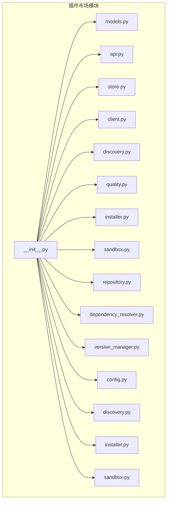
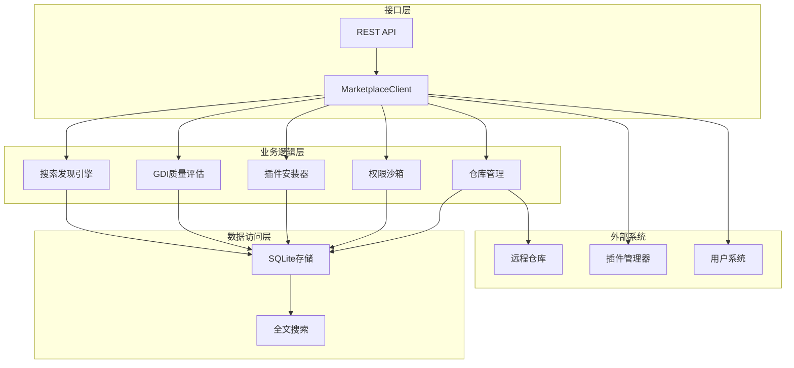
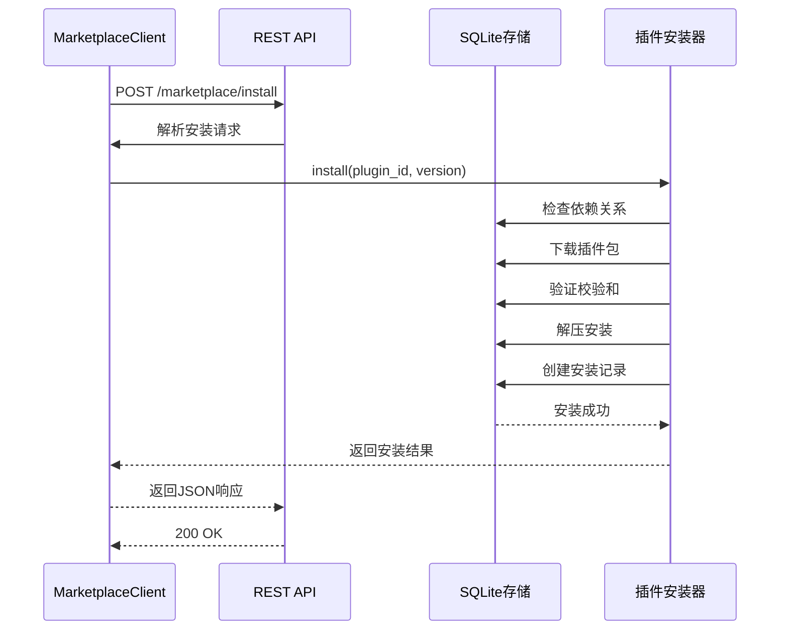
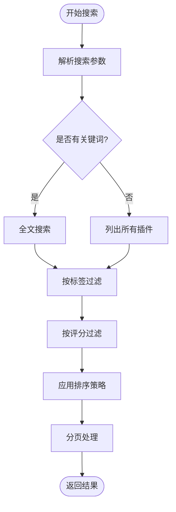
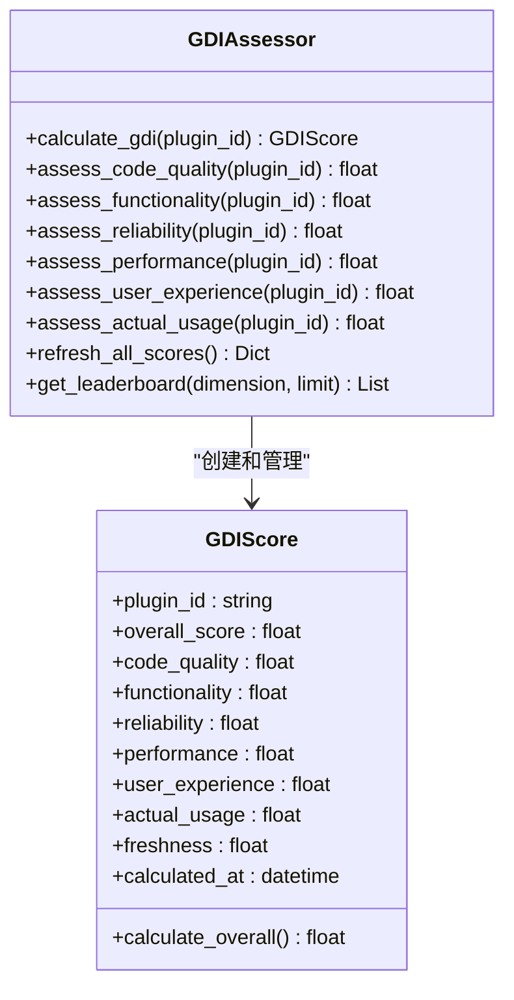
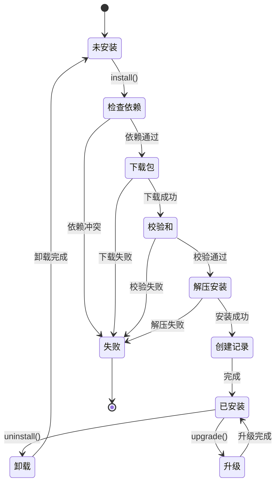
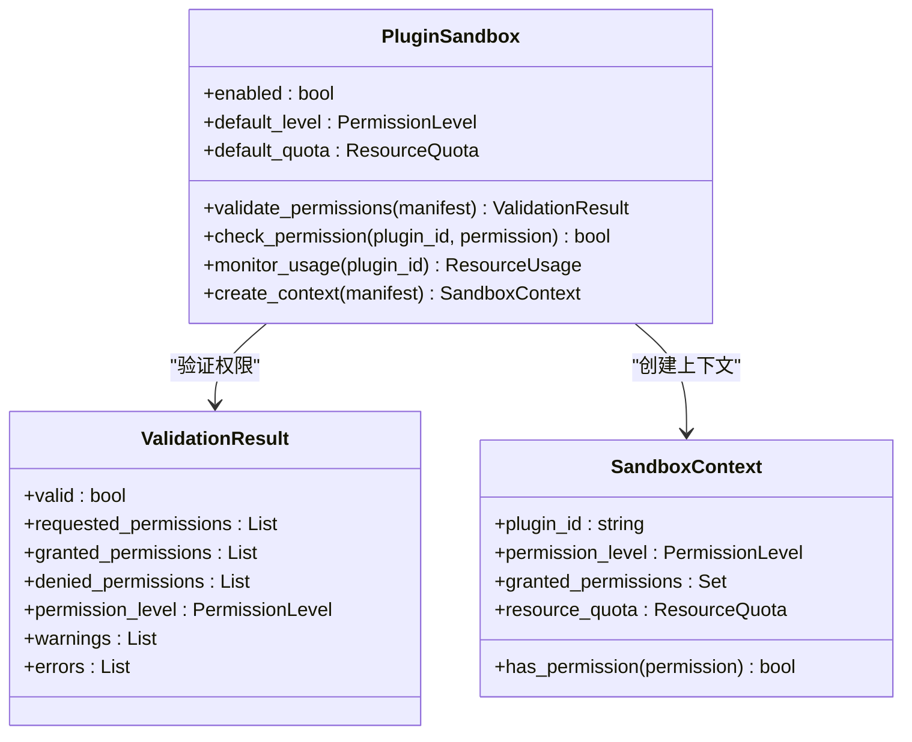
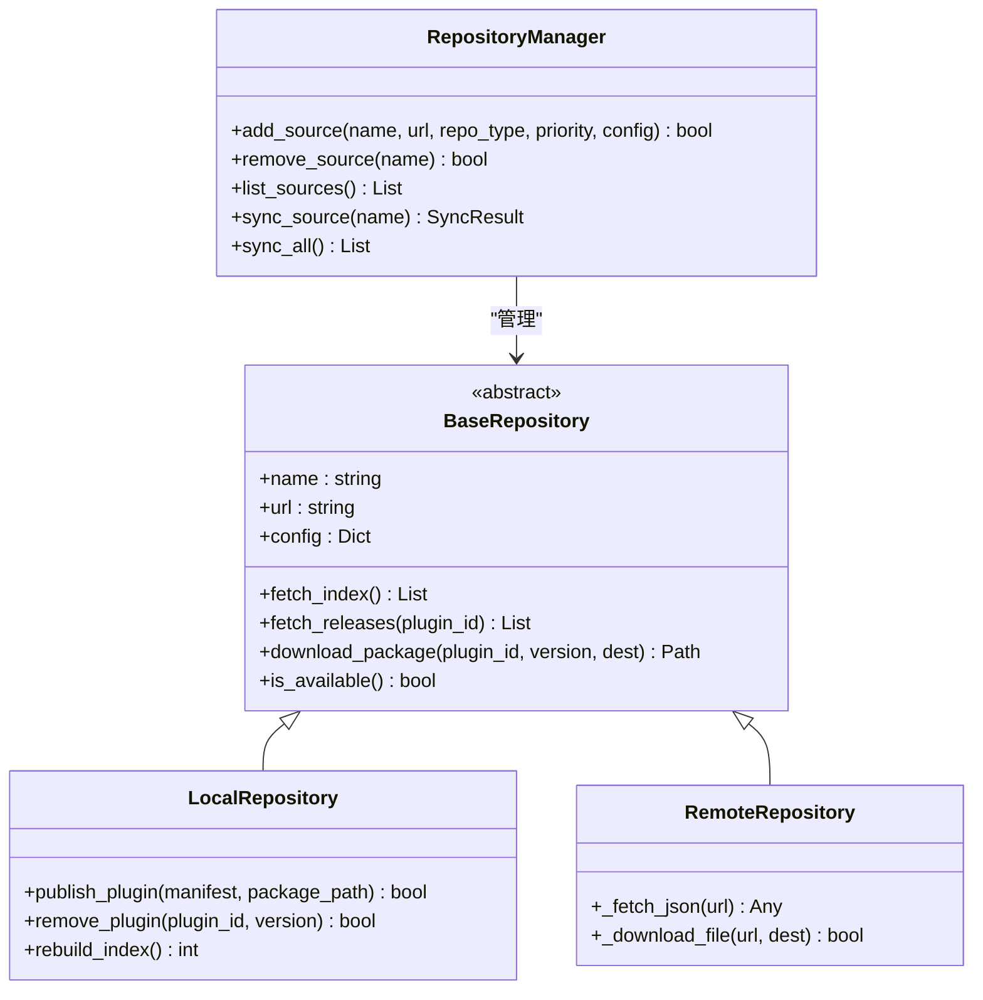
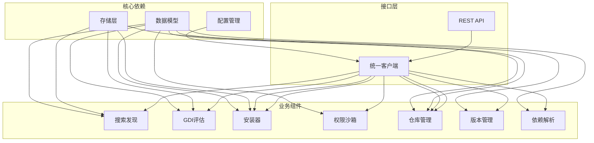

# 插件市场系统

<cite>
**本文档引用的文件**
- [src/marketplace/__init__.py](file://src/marketplace/__init__.py)
- [src/marketplace/api.py](file://src/marketplace/api.py)
- [src/marketplace/store.py](file://src/marketplace/store.py)
- [src/marketplace/repository.py](file://src/marketplace/repository.py)
- [src/marketplace/models.py](file://src/marketplace/models.py)
- [src/marketplace/client.py](file://src/marketplace/client.py)
- [src/marketplace/discovery.py](file://src/marketplace/discovery.py)
- [src/marketplace/quality.py](file://src/marketplace/quality.py)
- [src/marketplace/installer.py](file://src/marketplace/installer.py)
- [src/marketplace/sandbox.py](file://src/marketplace/sandbox.py)
</cite>

## 目录
1. [项目概述](#项目概述)
2. [项目结构](#项目结构)
3. [核心组件](#核心组件)
4. [架构总览](#架构总览)
5. [详细组件分析](#详细组件分析)
6. [依赖关系分析](#依赖关系分析)
7. [性能考虑](#性能考虑)
8. [故障排除指南](#故障排除指南)
9. [结论](#结论)
10. [附录](#附录)

## 项目概述

插件市场系统是 NecoRAG 认知架构中的核心组件之一，负责管理插件的全生命周期，包括插件发布、下载、安装、升级、卸载以及质量评估。该系统采用模块化设计，通过统一的客户端接口对外提供服务，并通过 REST API 暴露管理功能。

系统的主要特点包括：
- 基于 SQLite 的轻量级本地存储
- 多维度搜索和智能推荐
- GDI 全球期望指数质量评估
- 插件权限沙箱隔离
- 依赖解析和版本管理
- 灰度部署支持

## 项目结构

插件市场系统位于 `src/marketplace/` 目录下，采用清晰的模块化组织：

**图表来源**
- [src/marketplace/__init__.py:1-192](file://src/marketplace/__init__.py#L1-L192)

**章节来源**
- [src/marketplace/__init__.py:1-192](file://src/marketplace/__init__.py#L1-L192)

## 核心组件

### 数据模型层
系统定义了完整的数据模型体系，包括插件清单、版本发布、评分、安装记录等核心实体。

### 存储层
基于 SQLite 的轻量级存储，支持全文搜索、版本管理、安装记录等。

### 业务逻辑层
包含搜索发现、质量评估、安装管理、权限沙箱等核心业务逻辑。

### 接口层
提供 REST API 和统一客户端接口，支持外部系统集成。

**章节来源**
- [src/marketplace/models.py:1-756](file://src/marketplace/models.py#L1-L756)
- [src/marketplace/store.py:1-800](file://src/marketplace/store.py#L1-L800)

## 架构总览

插件市场系统采用分层架构设计，各层职责明确，耦合度低：

**图表来源**
- [src/marketplace/client.py:47-105](file://src/marketplace/client.py#L47-L105)
- [src/marketplace/api.py:19-37](file://src/marketplace/api.py#L19-L37)

## 详细组件分析

### REST API 系统

插件市场提供完整的 REST API 接口，涵盖搜索、安装、管理等所有核心功能：

**图表来源**
- [src/marketplace/api.py:303-318](file://src/marketplace/api.py#L303-L318)
- [src/marketplace/installer.py:217-251](file://src/marketplace/installer.py#L217-L251)

**章节来源**
- [src/marketplace/api.py:1-777](file://src/marketplace/api.py#L1-L777)

### 搜索发现引擎

搜索发现引擎提供多维度的插件搜索和推荐功能：

**图表来源**
- [src/marketplace/discovery.py:72-161](file://src/marketplace/discovery.py#L72-L161)

**章节来源**
- [src/marketplace/discovery.py:1-776](file://src/marketplace/discovery.py#L1-L776)

### GDI 质量评估系统

GDI（全球期望指数）提供六维度的质量评估体系：

**图表来源**
- [src/marketplace/quality.py:33-116](file://src/marketplace/quality.py#L33-L116)
- [src/marketplace/models.py:390-437](file://src/marketplace/models.py#L390-L437)

**章节来源**
- [src/marketplace/quality.py:1-756](file://src/marketplace/quality.py#L1-L756)

### 插件安装器

插件安装器管理插件的完整生命周期：

**图表来源**
- [src/marketplace/installer.py:217-402](file://src/marketplace/installer.py#L217-L402)

**章节来源**
- [src/marketplace/installer.py:1-800](file://src/marketplace/installer.py#L1-L800)

### 权限沙箱系统

权限沙箱提供插件权限验证和资源配额管理：

**图表来源**
- [src/marketplace/sandbox.py:186-318](file://src/marketplace/sandbox.py#L186-L318)
- [src/marketplace/models.py:97-121](file://src/marketplace/models.py#L97-L121)

**章节来源**
- [src/marketplace/sandbox.py:1-800](file://src/marketplace/sandbox.py#L1-L800)

### 仓库管理系统

支持本地和远程仓库的统一管理：

**图表来源**
- [src/marketplace/repository.py:29-125](file://src/marketplace/repository.py#L29-L125)
- [src/marketplace/repository.py:510-710](file://src/marketplace/repository.py#L510-L710)

**章节来源**
- [src/marketplace/repository.py:1-800](file://src/marketplace/repository.py#L1-L800)

## 依赖关系分析

插件市场系统的组件间依赖关系清晰，遵循依赖倒置原则：

**图表来源**
- [src/marketplace/client.py:74-102](file://src/marketplace/client.py#L74-L102)
- [src/marketplace/api.py:13-16](file://src/marketplace/api.py#L13-L16)

**章节来源**
- [src/marketplace/client.py:1-800](file://src/marketplace/client.py#L1-L800)

## 性能考虑

### 存储性能优化
- 使用 SQLite WAL 模式提升并发性能
- FTS5 全文搜索引擎提供高效的文本搜索
- 合理的索引设计支持快速查询

### 缓存策略
- 插件包下载缓存减少重复下载
- 内存中的活跃上下文缓存
- 统计数据缓存避免重复计算

### 并发控制
- 线程安全的数据库连接池
- 安装操作的互斥锁保护
- 异步任务处理避免阻塞

## 故障排除指南

### 常见问题诊断

**安装失败排查**
1. 检查依赖解析结果
2. 验证插件包完整性
3. 确认权限验证通过
4. 检查磁盘空间和权限

**搜索性能问题**
1. 确认 FTS5 索引完整性
2. 检查数据库连接池状态
3. 优化查询参数
4. 清理缓存数据

**权限验证失败**
1. 检查插件权限声明
2. 验证权限级别配置
3. 确认沙箱系统状态
4. 查看安全审计日志

**章节来源**
- [src/marketplace/installer.py:392-402](file://src/marketplace/installer.py#L392-L402)
- [src/marketplace/sandbox.py:311-318](file://src/marketplace/sandbox.py#L311-L318)

## 结论

插件市场系统是一个设计完善的插件管理解决方案，具有以下优势：

1. **模块化设计**：清晰的分层架构便于维护和扩展
2. **功能完整**：涵盖插件生命周期的各个环节
3. **安全性强**：权限沙箱和质量评估确保系统安全
4. **性能优化**：合理的缓存和索引策略保证高效运行
5. **易于集成**：提供 REST API 和统一客户端接口

系统在插件发布、下载、安装、升级、质量评估等方面都提供了完整的解决方案，能够满足复杂应用场景的需求。

## 附录

### API 接口参考

系统提供以下主要 API 接口：
- 搜索插件：GET `/marketplace/search`
- 安装插件：POST `/marketplace/install`
- 卸载插件：POST `/marketplace/uninstall`
- 升级插件：POST `/marketplace/upgrade`
- 获取评分：GET `/marketplace/plugins/{id}/ratings`
- GDI 评估：GET `/marketplace/plugins/{id}/gdi`
- 仓库管理：POST `/marketplace/repositories/add`

### 配置选项

系统支持的配置选项包括：
- 数据库路径配置
- 插件安装目录设置
- 缓存目录配置
- 默认权限级别设置
- 资源配额配置
- 搜索页面大小配置