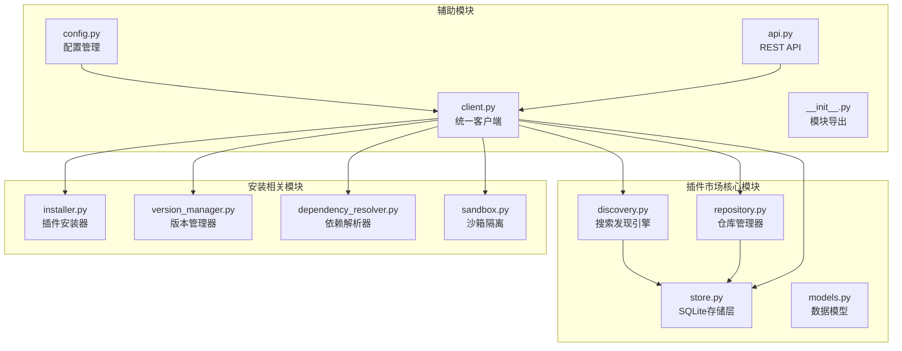
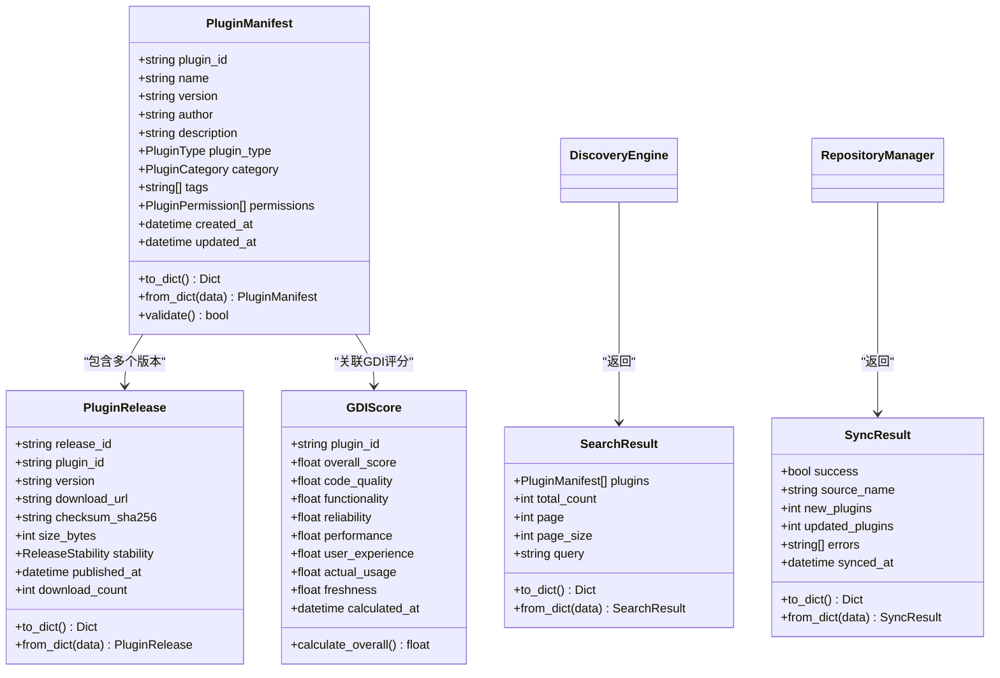
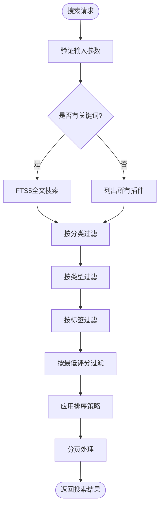
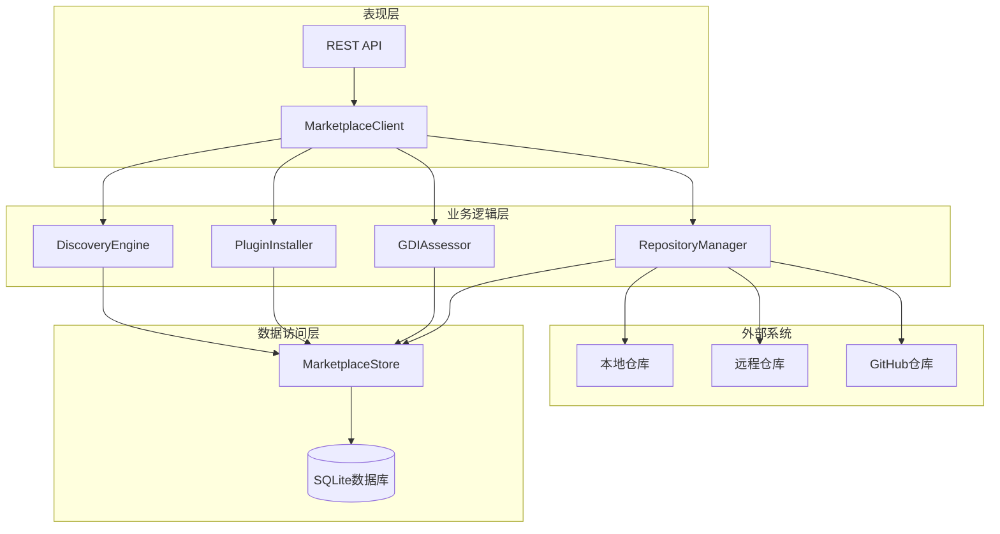
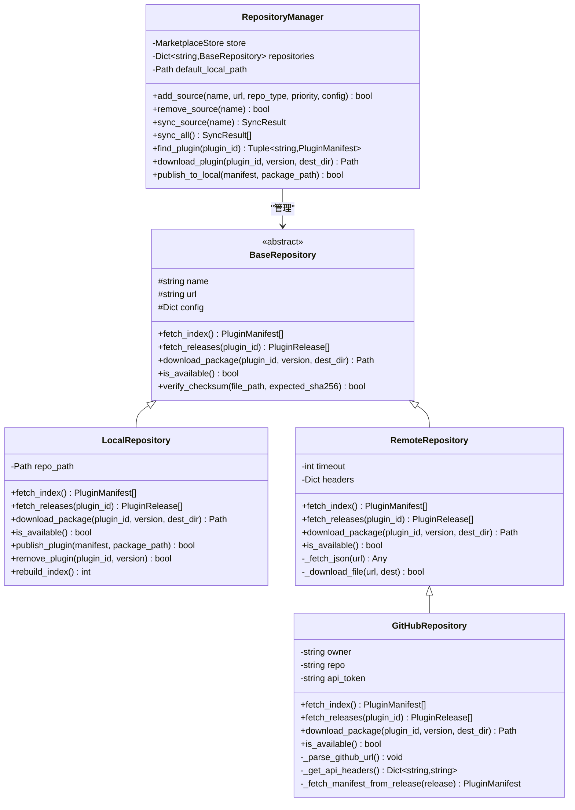
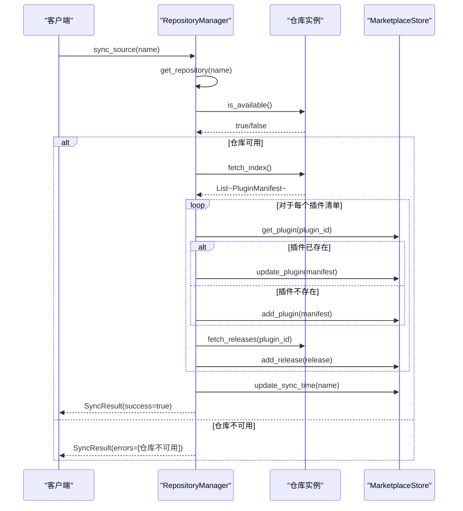
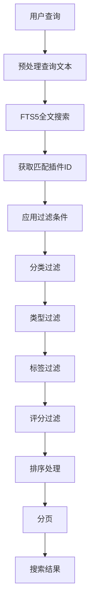
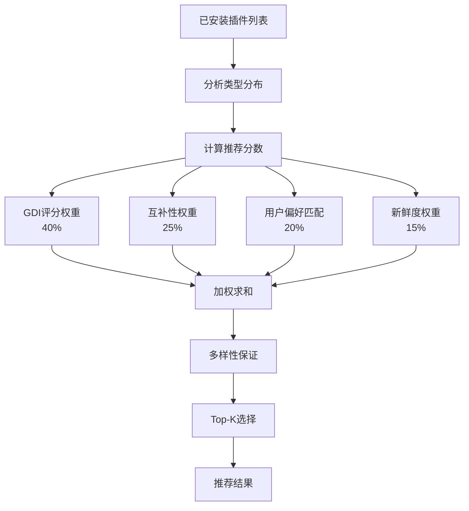
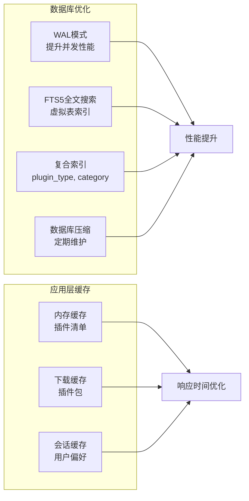
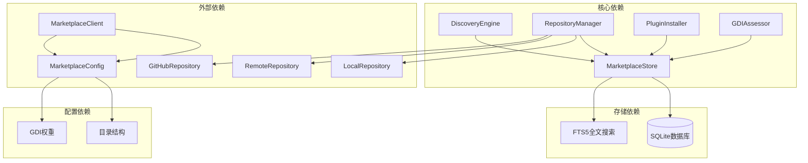

# 插件搜索发现引擎

<cite>
**本文档引用的文件**
- [discovery.py](file://src/marketplace/discovery.py)
- [repository.py](file://src/marketplace/repository.py)
- [models.py](file://src/marketplace/models.py)
- [store.py](file://src/marketplace/store.py)
- [client.py](file://src/marketplace/client.py)
- [config.py](file://src/marketplace/config.py)
- [api.py](file://src/marketplace/api.py)
- [__init__.py](file://src/marketplace/__init__.py)
</cite>

## 目录
1. [简介](#简介)
2. [项目结构](#项目结构)
3. [核心组件](#核心组件)
4. [架构概览](#架构概览)
5. [详细组件分析](#详细组件分析)
6. [依赖关系分析](#依赖关系分析)
7. [性能考虑](#性能考虑)
8. [故障排除指南](#故障排除指南)
9. [结论](#结论)

## 简介

NecoRAG 插件搜索发现引擎是一个功能强大的插件市场搜索和推荐系统，提供了多维度的插件发现、智能推荐、趋势分析和场景匹配功能。该引擎集成了本地和远程仓库管理，支持全文搜索、标签过滤、评分排序等多种搜索策略，并提供了完善的插件同步机制和缓存策略。

该系统采用模块化设计，主要包含以下核心功能：
- **多维度搜索**：支持关键词搜索、标签过滤、分类筛选、类型过滤
- **智能推荐**：基于用户偏好和已安装插件的互补性推荐
- **趋势分析**：基于使用统计的热门插件排行
- **场景匹配**：针对特定使用场景的智能推荐
- **仓库管理**：支持本地、HTTP和GitHub仓库的统一管理
- **同步机制**：增量更新和版本管理

## 项目结构

插件搜索发现引擎位于 `src/marketplace/` 目录下，采用清晰的模块化组织：

**图表来源**
- [discovery.py:1-776](file://src/marketplace/discovery.py#L1-L776)
- [repository.py:1-1531](file://src/marketplace/repository.py#L1-L1531)
- [store.py:1-1692](file://src/marketplace/store.py#L1-L1692)

**章节来源**
- [discovery.py:1-776](file://src/marketplace/discovery.py#L1-L776)
- [repository.py:1-1531](file://src/marketplace/repository.py#L1-L1531)
- [models.py:1-756](file://src/marketplace/models.py#L1-L756)
- [store.py:1-1692](file://src/marketplace/store.py#L1-L1692)

## 核心组件

### 数据模型层

系统定义了完整的数据模型体系，包括插件清单、版本发布、评分、安装记录等核心实体：

**图表来源**
- [models.py:135-756](file://src/marketplace/models.py#L135-L756)

### 搜索发现引擎

DiscoveryEngine 是整个系统的搜索核心，提供了多维度的搜索和推荐功能：

**图表来源**
- [discovery.py:72-161](file://src/marketplace/discovery.py#L72-L161)

**章节来源**
- [discovery.py:21-776](file://src/marketplace/discovery.py#L21-L776)
- [models.py:135-756](file://src/marketplace/models.py#L135-L756)

## 架构概览

插件搜索发现引擎采用分层架构设计，各层职责明确，耦合度低：

**图表来源**
- [client.py:47-104](file://src/marketplace/client.py#L47-L104)
- [repository.py:967-1531](file://src/marketplace/repository.py#L967-L1531)
- [store.py:41-68](file://src/marketplace/store.py#L41-L68)

## 详细组件分析

### 仓库管理器 (RepositoryManager)

RepositoryManager 是多源仓库管理的核心组件，负责统一管理本地、远程和GitHub仓库：

**图表来源**
- [repository.py:30-1531](file://src/marketplace/repository.py#L30-L1531)

#### 同步机制和增量更新

RepositoryManager 实现了完整的同步机制，支持增量更新：

**图表来源**
- [repository.py:1184-1269](file://src/marketplace/repository.py#L1184-L1269)

**章节来源**
- [repository.py:967-1531](file://src/marketplace/repository.py#L967-L1531)
- [models.py:721-756](file://src/marketplace/models.py#L721-L756)

### 搜索算法实现

DiscoveryEngine 实现了多维度的搜索算法，结合了全文搜索、标签匹配和评分排序：

#### 关键词匹配算法

系统使用 SQLite FTS5 全文搜索引擎进行高效的关键词匹配：

**图表来源**
- [discovery.py:103-161](file://src/marketplace/discovery.py#L103-L161)
- [store.py:495-561](file://src/marketplace/store.py#L495-L561)

#### 推荐算法

推荐系统采用多因子加权算法，综合考虑互补性、用户偏好和新鲜度：

**图表来源**
- [discovery.py:368-414](file://src/marketplace/discovery.py#L368-L414)

**章节来源**
- [discovery.py:72-776](file://src/marketplace/discovery.py#L72-L776)
- [store.py:495-561](file://src/marketplace/store.py#L495-L561)

### 缓存策略和性能优化

系统实现了多层次的缓存策略来提升性能：

#### SQLite 存储优化

**图表来源**
- [store.py:70-85](file://src/marketplace/store.py#L70-L85)
- [store.py:224-246](file://src/marketplace/store.py#L224-L246)

#### 搜索性能优化最佳实践

1. **索引优化**：为常用的查询字段建立索引
2. **分页处理**：避免一次性加载大量数据
3. **缓存策略**：合理使用内存缓存减少数据库访问
4. **异步处理**：对于耗时操作使用异步处理
5. **连接池**：复用数据库连接减少开销

**章节来源**
- [store.py:87-246](file://src/marketplace/store.py#L87-L246)

## 依赖关系分析

插件搜索发现引擎的依赖关系清晰明确，遵循单一职责原则：

**图表来源**
- [client.py:74-104](file://src/marketplace/client.py#L74-L104)
- [config.py:24-81](file://src/marketplace/config.py#L24-L81)

**章节来源**
- [client.py:47-104](file://src/marketplace/client.py#L47-L104)
- [config.py:24-304](file://src/marketplace/config.py#L24-L304)

## 性能考虑

### 数据库性能优化

系统采用了多项数据库性能优化措施：

1. **WAL 模式**：启用 Write-Ahead Logging 提升并发性能
2. **FTS5 全文搜索**：使用虚拟表进行高效的全文搜索
3. **复合索引**：为常用查询字段建立索引
4. **连接池管理**：使用线程本地存储管理数据库连接

### 缓存策略

1. **内存缓存**：缓存常用的插件清单和搜索结果
2. **下载缓存**：缓存已下载的插件包避免重复下载
3. **会话缓存**：缓存用户偏好和搜索历史

### 异步处理

对于耗时操作（如网络请求、文件下载）采用异步处理方式，避免阻塞主线程。

## 故障排除指南

### 常见问题及解决方案

#### 仓库同步失败

**症状**：同步结果显示错误信息
**可能原因**：
- 网络连接问题
- 仓库URL配置错误
- 权限不足

**解决步骤**：
1. 检查仓库URL是否正确
2. 验证网络连接
3. 检查认证配置
4. 查看详细错误日志

#### 搜索结果为空

**症状**：搜索返回空结果
**可能原因**：
- 数据库索引损坏
- 查询语法错误
- 缓存问题

**解决步骤**：
1. 重建数据库索引
2. 清理缓存数据
3. 检查查询参数
4. 重新同步仓库数据

#### 插件安装失败

**症状**：安装过程中出现错误
**可能原因**：
- 依赖冲突
- 权限不足
- 磁盘空间不足

**解决步骤**：
1. 检查依赖关系
2. 验证权限设置
3. 清理磁盘空间
4. 查看安装日志

**章节来源**
- [repository.py:1184-1269](file://src/marketplace/repository.py#L1184-L1269)
- [store.py:1556-1594](file://src/marketplace/store.py#L1556-L1594)

## 结论

NecoRAG 插件搜索发现引擎是一个设计精良、功能完备的插件市场搜索系统。其主要特点包括：

1. **模块化设计**：清晰的分层架构，职责分离明确
2. **多源仓库支持**：统一管理本地、远程和GitHub仓库
3. **智能搜索算法**：结合全文搜索、标签匹配和评分排序
4. **完善的推荐系统**：基于用户偏好和互补性的智能推荐
5. **性能优化**：多层次缓存和数据库优化
6. **扩展性强**：易于添加新的仓库类型和搜索策略

该系统为 NecoRAG 生态系统提供了强大的插件发现和管理能力，为用户提供了便捷的插件搜索、安装和管理体验。通过合理的架构设计和性能优化，系统能够高效处理大规模插件数据，满足生产环境的性能要求。