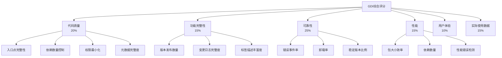
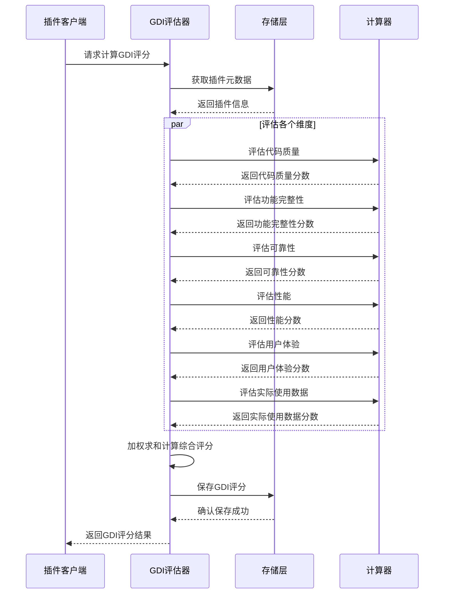
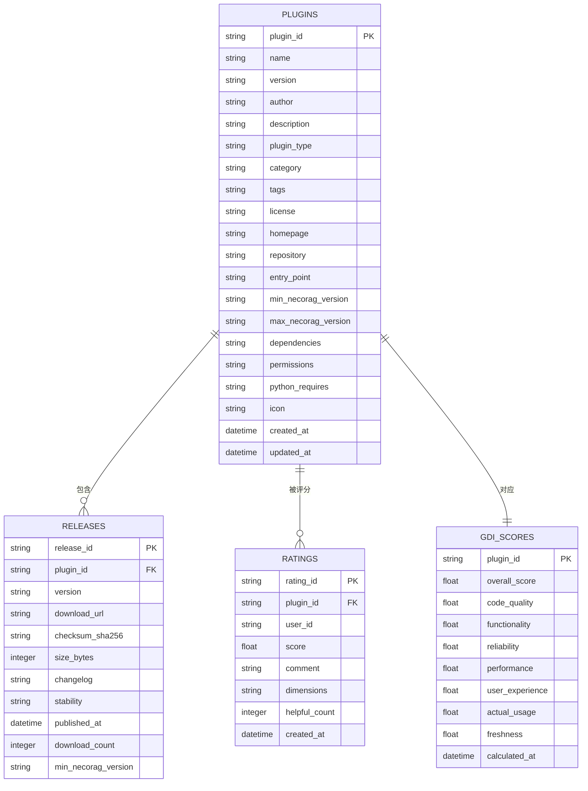
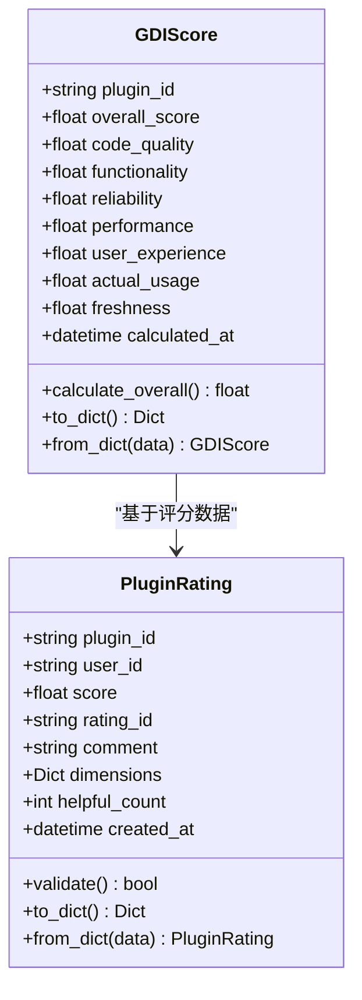
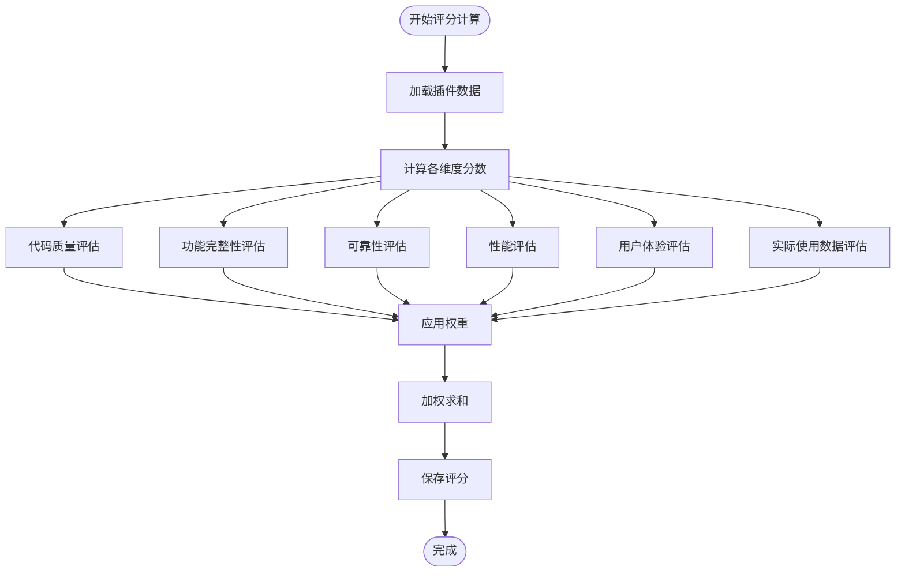
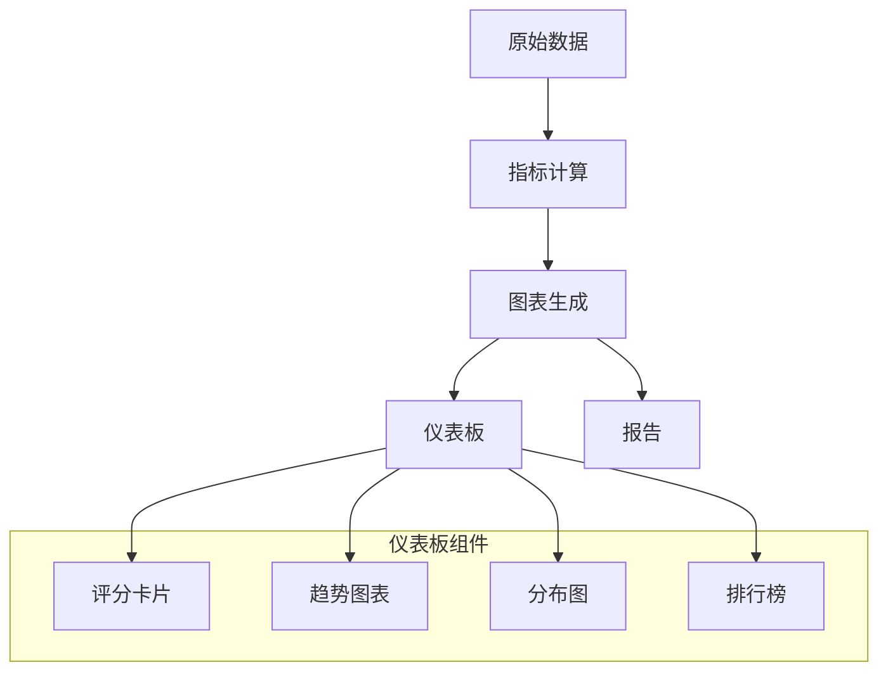

# 插件质量评估系统

<cite>
**本文档引用的文件**
- [quality.py](file://src/marketplace/quality.py)
- [store.py](file://src/marketplace/store.py)
- [models.py](file://src/marketplace/models.py)
- [client.py](file://src/marketplace/client.py)
- [config.py](file://src/marketplace/config.py)
- [visualizer.py](file://src/knowledge_evolution/visualizer.py)
</cite>

## 目录
1. [项目概述](#项目概述)
2. [GDI质量评估体系设计](#gdi质量评估体系设计)
3. [GDI评估器算法实现](#gdi评估器算法实现)
4. [插件存储与数据管理](#插件存储与数据管理)
5. [评分系统与权重策略](#评分系统与权重策略)
6. [自动化流程与人工审核机制](#自动化流程与人工审核机制)
7. [质量等级划分与认证标准](#质量等级划分与认证标准)
8. [结果可视化与趋势分析](#结果可视化与趋势分析)
9. [质量改进建议与优化指南](#质量改进建议与优化指南)
10. [总结](#总结)

## 项目概述

NecoRAG插件质量评估系统是一个基于GDI（Global Desirability Index）质量评估体系的专业评测框架。该系统通过多维度量化评估插件质量，为用户提供可靠的插件选择依据，同时为企业级应用提供质量保障机制。

系统采用模块化设计，主要包含四个核心组件：
- **GDI评估器**：负责多维度质量评估计算
- **插件存储**：提供数据持久化和查询服务
- **评分系统**：管理用户评分和质量数据
- **可视化展示**：提供质量趋势和分布分析

## GDI质量评估体系设计

### 评估维度架构

GDI质量评估体系借鉴OpenClaw GDI评分体系，针对NecoRAG平台特点定制了6维评估框架：



**图表来源**
- [quality.py:7-10](file://src/marketplace/quality.py#L7-L10)

### 评分计算公式

GDI综合评分采用加权平均计算方式：

```
GDI = 0.20 × 代码质量 + 0.15 × 功能完整性 + 0.25 × 可靠性
    + 0.15 × 性能 + 0.10 × 用户体验 + 0.15 × 实际使用数据
```

每个维度的评分范围为0-100分，最终GDI综合评分为0-100分的连续值。

**章节来源**
- [quality.py:7-10](file://src/marketplace/quality.py#L7-L10)

## GDI评估器算法实现

### 核心评估流程

GDI评估器采用模块化设计，每个维度都有独立的评估算法：



**图表来源**
- [quality.py:51-115](file://src/marketplace/quality.py#L51-L115)

### 代码质量评估算法

代码质量维度评估包含四个子维度：

#### 入口点完整性评估
- **完全格式**（模块.类名或模块.函数）：100分
- **简单格式**（仅模块）：50分
- **空值或无效**：0分

#### 依赖数量控制
- **0个依赖**：100分
- **1-3个依赖**：90分  
- **4-5个依赖**：70分
- **6-10个依赖**：50分
- **超过10个依赖**：按公式线性衰减

#### 权限最小化评估
- **0个权限**：100分
- **1-2个权限**：90分
- **3-4个权限**：70分
- **5-6个权限**：50分
- **超过6个权限**：按公式线性衰减

#### 元数据完整度评估
评估字段包括：主页、仓库链接、许可证、描述、图标等，按填充比例计算分数。

**章节来源**
- [quality.py:118-193](file://src/marketplace/quality.py#L118-L193)

### 功能完整性评估算法

功能完整性维度包含三个子维度：

#### 版本发布数量评估
- **10+版本**：100分
- **5-9版本**：80分
- **3-4版本**：60分
- **1-2版本**：40分
- **无版本**：20分

#### 变更日志完整度评估
基于有变更日志版本占总版本的比例计算分数。

#### 标签描述丰富度评估
- **标签数量**：3-10个最佳
- **描述长度**：100-500字符最佳

**章节来源**
- [quality.py:195-274](file://src/marketplace/quality.py#L195-L274)

### 可靠性评估算法

可靠性维度评估三个关键指标：

#### 错误事件率评估
```
可靠性分数 = max(0, 100 - 错误率 × 200)
```

#### 卸载率评估
```
可靠性分数 = max(0, 100 - 卸载率 × 100)
```

#### 稳定版本比例评估
基于稳定版本占总版本的比例计算分数。

**章节来源**
- [quality.py:276-332](file://src/marketplace/quality.py#L276-L332)

### 性能评估算法

性能维度包含三个子维度：

#### 包大小效率评估
- **≤1MB**：100分
- **≤5MB**：90分  
- **≤10MB**：80分
- **≤50MB**：按公式线性衰减
- **>50MB**：按公式线性衰减

#### 依赖数量评估
与代码质量中的依赖评估相同。

#### 性能错误检测
检测事件数据中包含"timeout"、"slow"、"memory"、"performance"、"oom"等关键字的事件数量。

**章节来源**
- [quality.py:334-415](file://src/marketplace/quality.py#L334-L415)

### 用户体验评估算法

用户体验维度包含三个子维度：

#### 评分平均分映射
```
用户体验分数 = (平均评分 - 1) / 4 × 100
```

#### 评分数量标准化
使用对数函数对评分数量进行标准化处理：
```
标准化分数 = min(100, log(评分数量 + 1) / log(基准值 + 1) × 100)
```

#### 维度评分丰富度
基于用户提供的多维度评分数据计算平均值。

**章节来源**
- [quality.py:417-477](file://src/marketplace/quality.py#L417-L477)

### 实际使用数据评估算法

实际使用数据维度包含三个子维度：

#### 活跃安装数评估
使用对数标准化处理活跃安装数。

#### 总下载量评估  
使用对数标准化处理总下载量。

#### 最近30天事件活跃度评估
基于使用事件数量计算活跃度分数。

**章节来源**
- [quality.py:479-518](file://src/marketplace/quality.py#L479-L518)

## 插件存储与数据管理

### 数据模型架构

系统采用SQLite作为存储后端，提供完整的数据持久化能力：



**图表来源**
- [store.py:91-194](file://src/marketplace/store.py#L91-L194)

### 存储层设计特点

#### 线程安全连接管理
- 使用threading.local()确保每个线程拥有独立的数据库连接
- 支持WAL模式提升并发性能
- 自动启用外键约束保证数据一致性

#### FTS5全文搜索
- 基于FTS5虚拟表实现高性能全文搜索
- 支持插件名称、描述、标签、作者的联合搜索
- 提供rank排序和精确匹配能力

#### 数据完整性保障
- 所有表都定义了适当的索引提高查询性能
- 使用UNIQUE约束防止重复数据
- 支持级联删除确保数据一致性

**章节来源**
- [store.py:51-85](file://src/marketplace/store.py#L51-L85)
- [store.py:224-246](file://src/marketplace/store.py#L224-L246)

### 数据访问模式

系统提供了丰富的数据访问接口：

#### 插件元数据管理
- 添加、更新、删除插件元数据
- 支持分页查询和条件过滤
- 提供全文搜索功能

#### 版本发布管理
- 管理插件的版本发布记录
- 支持下载计数统计
- 提供最新版本查询

#### 评分数据管理
- 用户评分的增删改查
- 平均评分和评分数统计
- 评分历史追踪

#### GDI评分管理
- GDI评分的持久化存储
- 排行榜查询和统计
- 评分分布分析

**章节来源**
- [store.py:256-438](file://src/marketplace/store.py#L256-L438)
- [store.py:1175-1257](file://src/marketplace/store.py#L1175-L1257)

## 评分系统与权重策略

### 权重配置机制

系统支持动态权重配置，允许根据业务需求调整各维度的重要性：

#### 默认权重分配
- 代码质量：20%
- 功能完整性：15%  
- 可靠性：25%
- 性能：15%
- 用户体验：10%
- 实际使用数据：15%

#### 权重配置接口
通过MarketplaceConfig类管理权重配置，支持：
- 配置文件持久化
- 环境变量覆盖
- 运行时动态调整

**章节来源**
- [quality.py:22-30](file://src/marketplace/quality.py#L22-L30)
- [config.py:53-61](file://src/marketplace/config.py#L53-L61)

### 评分数据结构

#### GDIScore数据模型


**图表来源**
- [models.py:390-462](file://src/marketplace/models.py#L390-L462)
- [models.py:290-342](file://src/marketplace/models.py#L290-L342)

### 评分计算流程



**图表来源**
- [quality.py:51-115](file://src/marketplace/quality.py#L51-L115)

**章节来源**
- [models.py:390-462](file://src/marketplace/models.py#L390-L462)

## 自动化流程与人工审核机制

### 自动化评估流程

系统实现了完整的自动化评估流程：

#### 定时刷新机制
- 支持单个插件评分刷新
- 支持批量插件评分刷新
- 基于配置的定时任务调度

#### 事件驱动触发
- 插件安装后自动刷新GDI评分
- 用户评分提交后自动重新计算
- 版本更新后触发质量评估

#### 数据驱动决策
- 基于历史数据的趋势分析
- 自动识别异常评分模式
- 智能质量预警机制

**章节来源**
- [quality.py:595-628](file://src/marketplace/quality.py#L595-L628)
- [client.py:272-284](file://src/marketplace/client.py#L272-L284)

### 人工审核机制

虽然系统主要依赖自动化评估，但仍保留了人工审核的机制：

#### 专家评审流程
- 高风险插件的人工复核
- 质量争议的申诉处理
- 特殊情况的例外审批

#### 人工干预接口
- 手动调整评分权重
- 临时屏蔽有问题的插件
- 专家注释和标注功能

#### 质量监督
- 定期的质量审计
- 评分准确性验证
- 系统性能监控

## 质量等级划分与认证标准

### 质量等级标准

系统采用五级质量等级划分：

| 等级 | 分数范围 | 等级描述 | 认证标志 |
|------|----------|----------|----------|
| S级 | 90-100分 | 优秀质量 | 🌟🌟🌟🌟🌟 |
| A级 | 80-89分 | 优质质量 | 🌟🌟🌟🌟 |
| B级 | 70-79分 | 良好质量 | 🌟🌟🌟 |
| C级 | 60-69分 | 合格质量 | 🌟🌟 |
| D级 | 0-59分 | 待改进质量 | 🌟 |

### 认证标准

#### 基础认证要求
- **代码质量**：≥ 70分
- **功能完整性**：≥ 60分  
- **可靠性**：≥ 70分
- **性能**：≥ 60分
- **用户体验**：≥ 50分
- **实际使用数据**：≥ 40分

#### 专家认证标准
- **S级认证**：所有维度≥ 85分
- **A级认证**：至少5个维度≥ 80分
- **B级认证**：至少4个维度≥ 70分

#### 认证有效期
- 标准认证：6个月
- 专家认证：12个月
- 需要定期复审保持认证状态

**章节来源**
- [quality.py:438-462](file://src/marketplace/models.py#L438-L462)

## 结果可视化与趋势分析

### 可视化展示架构

系统提供了多层次的可视化展示能力：



**图表来源**
- [visualizer.py:59-66](file://src/knowledge_evolution/visualizer.py#L59-L66)

### 质量趋势分析

#### 时间序列分析
- 日度、周度、月度趋势追踪
- 质量评分变化趋势预测
- 异常波动检测和报警

#### 比较分析
- 不同类别插件的质量对比
- 时间段间的质量变化比较
- 市场整体质量水平评估

#### 预测分析
- 基于历史数据的质量趋势预测
- 影响因素分析和权重调整建议
- 质量改进效果评估

**章节来源**
- [visualizer.py:407-453](file://src/knowledge_evolution/visualizer.py#L407-L453)

### 交互式可视化

#### 实时监控面板
- 实时显示关键质量指标
- 动态更新的评分趋势
- 异常情况即时提醒

#### 深度分析工具
- 多维度数据钻取分析
- 自定义筛选条件
- 导出分析报告

## 质量改进建议与优化指南

### 代码质量优化建议

#### 依赖管理优化
- **减少第三方依赖**：优先使用内置库，避免不必要的外部依赖
- **依赖版本锁定**：使用requirements.txt锁定具体版本
- **依赖安全扫描**：定期检查依赖的安全漏洞

#### 权限最小化实践
- **权限分离原则**：按照最小权限原则申请所需权限
- **权限审计**：定期审查插件权限使用情况
- **安全沙箱**：在开发环境中模拟权限限制

#### 元数据完善
- **完整插件清单**：确保所有必需字段都已填写
- **清晰的描述文档**：提供详细的使用说明和API文档
- **规范的标签系统**：使用一致的标签命名规范

### 功能完整性提升策略

#### 版本管理最佳实践
- **语义化版本控制**：遵循SemVer规范管理版本号
- **完整的变更日志**：每次发布都要记录详细的变更内容
- **向后兼容性**：尽量保持API的向后兼容性

#### 用户体验优化
- **响应式设计**：确保插件在不同设备上的兼容性
- **错误处理**：提供友好的错误提示和恢复机制
- **性能监控**：集成性能监控和日志记录

### 可靠性增强措施

#### 错误预防机制
- **输入验证**：对所有外部输入进行严格验证
- **异常处理**：建立完善的异常处理和恢复机制
- **边界条件测试**：充分测试各种边界条件和异常场景

#### 监控告警系统
- **关键指标监控**：设置合理的监控阈值和告警机制
- **日志分析**：建立日志收集和分析系统
- **性能基准测试**：定期进行性能基准测试

### 性能优化指南

#### 资源使用优化
- **内存管理**：及时释放不再使用的资源
- **网络优化**：减少不必要的网络请求
- **计算优化**：避免重复计算和不必要的操作

#### 缓存策略
- **智能缓存**：合理使用缓存提高响应速度
- **缓存失效**：建立有效的缓存失效机制
- **缓存监控**：监控缓存命中率和效果

### 用户体验改进

#### 反馈收集机制
- **用户反馈渠道**：建立便捷的用户反馈收集系统
- **满意度调查**：定期进行用户满意度调查
- **问题跟踪**：建立问题跟踪和解决流程

#### 个性化定制
- **配置选项**：提供灵活的配置选项满足不同需求
- **主题支持**：支持主题定制和个性化设置
- **无障碍访问**：确保插件对残障用户的友好性

## 总结

NecoRAG插件质量评估系统通过科学的GDI评估体系、完善的自动化流程和丰富的可视化功能，为插件生态系统的健康发展提供了强有力的技术支撑。

### 系统优势

1. **全面性**：涵盖代码质量、功能完整性、可靠性、性能、用户体验、实际使用数据六个维度
2. **自动化**：实现了从数据采集到评分计算的全流程自动化
3. **可扩展性**：支持权重动态调整和新的评估维度扩展
4. **可视化**：提供丰富的图表和报告功能
5. **实时性**：基于事件驱动的实时评分更新机制

### 应用价值

- **用户价值**：帮助用户快速识别高质量插件，提升使用体验
- **开发者价值**：提供质量反馈和改进建议，促进插件质量提升
- **平台价值**：维护健康的插件生态系统，提升平台整体质量

### 发展方向

未来系统可以在以下方面进一步完善：
- 增强机器学习算法的应用
- 扩展更多评估维度和指标
- 优化算法性能和准确性
- 增强与其他系统的集成能力

通过持续的优化和完善，NecoRAG插件质量评估系统将成为构建高质量插件生态的重要基础设施。