# 插件开发指南

<cite>
**本文档引用的文件**
- [src/plugins/README.md](file://src/plugins/README.md)
- [src/plugins/__init__.py](file://src/plugins/__init__.py)
- [src/plugins/base.py](file://src/plugins/base.py)
- [src/plugins/manager.py](file://src/plugins/manager.py)
- [src/plugins/registry.py](file://src/plugins/registry.py)
- [src/plugins/example_plugins.py](file://src/plugins/example_plugins.py)
- [src/marketplace/models.py](file://src/marketplace/models.py)
- [QUICKSTART.md](file://QUICKSTART.md)
- [example/README.md](file://example/README.md)
</cite>

## 目录
1. [简介](#简介)
2. [项目结构](#项目结构)
3. [核心组件](#核心组件)
4. [架构概览](#架构概览)
5. [详细组件分析](#详细组件分析)
6. [依赖分析](#依赖分析)
7. [性能考虑](#性能考虑)
8. [故障排除指南](#故障排除指南)
9. [结论](#结论)
10. [附录](#附录)

## 简介

NecoRAG插件系统为五层认知架构提供了强大的扩展能力，支持动态加载和管理各种功能插件。该系统采用模块化设计，支持感知层、记忆层、检索层、巩固层和响应层插件的统一管理。

插件系统的核心价值在于：
- **动态扩展**：无需修改核心代码即可添加新功能
- **模块化架构**：清晰的功能分离和职责划分
- **生命周期管理**：完整的插件注册、加载、启用、禁用和卸载流程
- **依赖解析**：智能的插件间依赖关系管理和循环检测
- **市场集成**：支持插件市场的发现、安装和版本管理

## 项目结构

插件系统位于`src/plugins/`目录下，包含以下核心文件：

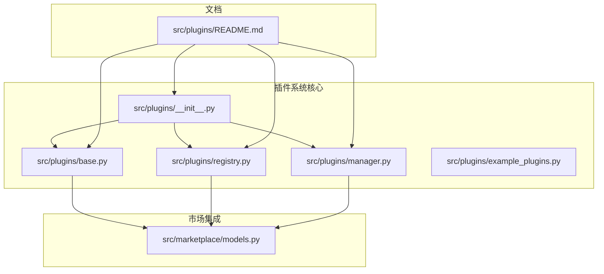

**图表来源**
- [src/plugins/__init__.py:1-45](file://src/plugins/__init__.py#L1-L45)
- [src/plugins/base.py:1-385](file://src/plugins/base.py#L1-L385)
- [src/plugins/registry.py:1-383](file://src/plugins/registry.py#L1-L383)
- [src/plugins/manager.py:1-584](file://src/plugins/manager.py#L1-L584)
- [src/marketplace/models.py:1-200](file://src/marketplace/models.py#L1-L200)

**章节来源**
- [src/plugins/README.md:1-239](file://src/plugins/README.md#L1-L239)
- [src/plugins/__init__.py:1-45](file://src/plugins/__init__.py#L1-L45)

## 核心组件

### 插件类型系统

插件系统定义了五种核心插件类型，每种类型对应认知架构的不同层次：

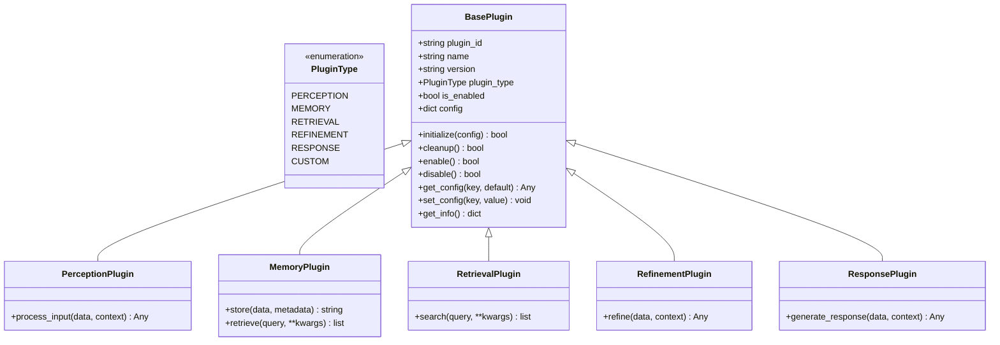

**图表来源**
- [src/plugins/base.py:15-385](file://src/plugins/base.py#L15-L385)

### 插件生命周期管理

插件系统提供了完整的生命周期管理机制：

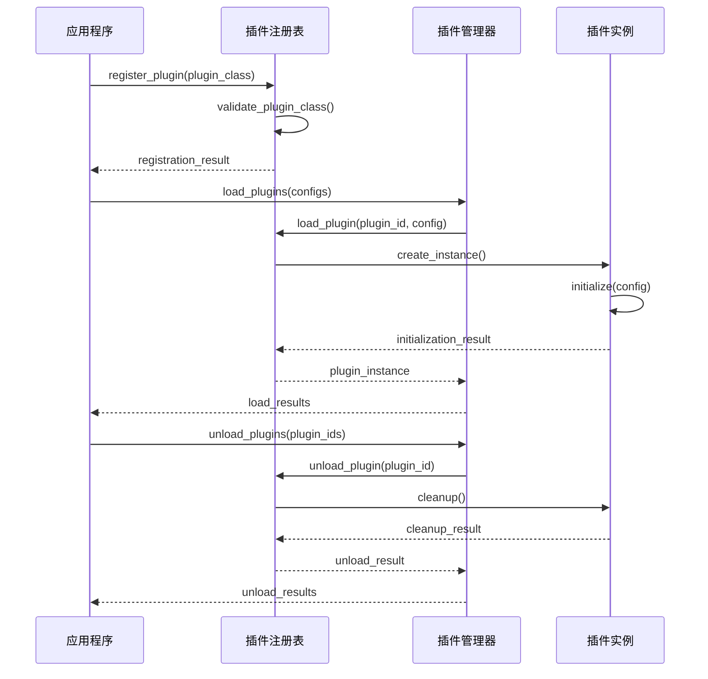

**图表来源**
- [src/plugins/registry.py:80-131](file://src/plugins/registry.py#L80-L131)
- [src/plugins/manager.py:26-66](file://src/plugins/manager.py#L26-L66)

**章节来源**
- [src/plugins/base.py:25-171](file://src/plugins/base.py#L25-L171)
- [src/plugins/registry.py:15-131](file://src/plugins/registry.py#L15-L131)
- [src/plugins/manager.py:14-88](file://src/plugins/manager.py#L14-L88)

## 架构概览

### 插件系统整体架构

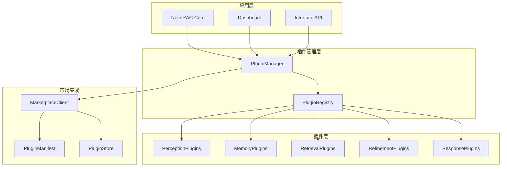

**图表来源**
- [src/plugins/manager.py:14-584](file://src/plugins/manager.py#L14-L584)
- [src/plugins/registry.py:15-383](file://src/plugins/registry.py#L15-L383)
- [src/marketplace/models.py:135-200](file://src/marketplace/models.py#L135-L200)

### 依赖关系图

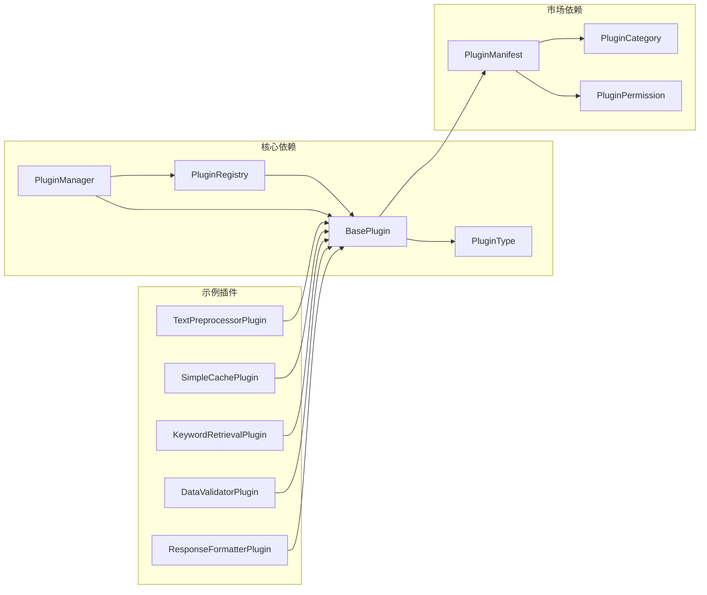

**图表来源**
- [src/plugins/base.py:25-385](file://src/plugins/base.py#L25-L385)
- [src/plugins/registry.py:15-383](file://src/plugins/registry.py#L15-L383)
- [src/marketplace/models.py:23-73](file://src/marketplace/models.py#L23-L73)

**章节来源**
- [src/plugins/README.md:137-136](file://src/plugins/README.md#L137-L136)

## 详细组件分析

### BasePlugin 基础类

BasePlugin是所有插件的抽象基类，定义了插件的标准接口和生命周期管理：

#### 核心属性和方法

| 属性/方法 | 类型 | 描述 |
|-----------|------|------|
| `plugin_id` | string | 插件唯一标识符 |
| `name` | string | 插件名称 |
| `version` | string | 插件版本号 |
| `plugin_type` | PluginType | 插件类型枚举 |
| `is_enabled` | bool | 插件启用状态 |
| `config` | dict | 插件配置字典 |
| `initialize()` | method | 插件初始化方法 |
| `cleanup()` | method | 插件清理方法 |
| `enable()` | method | 启用插件 |
| `disable()` | method | 禁用插件 |

#### 市场集成特性

BasePlugin提供了完整的市场集成支持：

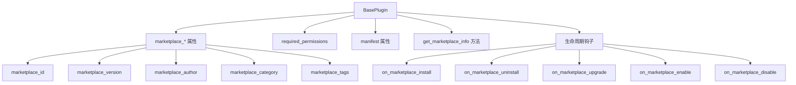

**图表来源**
- [src/plugins/base.py:28-274](file://src/plugins/base.py#L28-L274)

**章节来源**
- [src/plugins/base.py:25-274](file://src/plugins/base.py#L25-L274)

### PluginRegistry 插件注册表

PluginRegistry负责插件的注册、发现和管理：

#### 注册流程

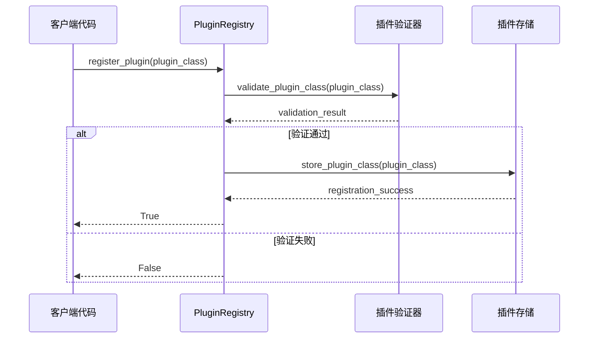

**图表来源**
- [src/plugins/registry.py:28-60](file://src/plugins/registry.py#L28-L60)

#### 插件发现机制

PluginRegistry支持从指定路径自动发现插件：

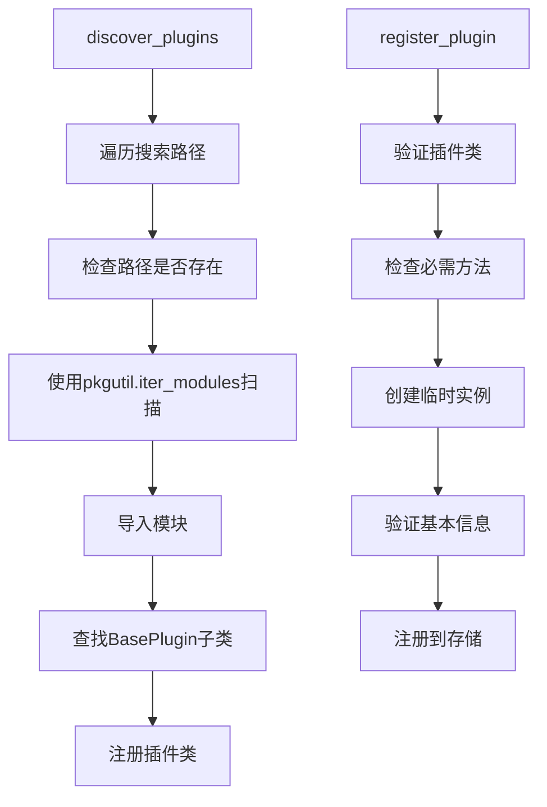

**图表来源**
- [src/plugins/registry.py:192-248](file://src/plugins/registry.py#L192-L248)
- [src/plugins/registry.py:250-267](file://src/plugins/registry.py#L250-L267)

**章节来源**
- [src/plugins/registry.py:15-383](file://src/plugins/registry.py#L15-L383)

### PluginManager 插件管理器

PluginManager提供插件的高级管理功能，包括依赖解析和事件处理：

#### 依赖解析算法

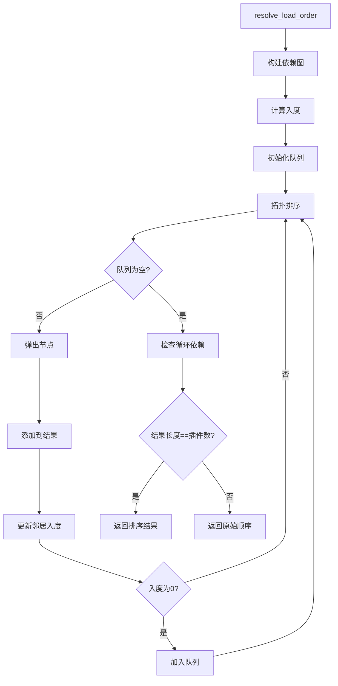

**图表来源**
- [src/plugins/manager.py:184-219](file://src/plugins/manager.py#L184-L219)

#### 市场集成功能

PluginManager提供了完整的市场集成支持：

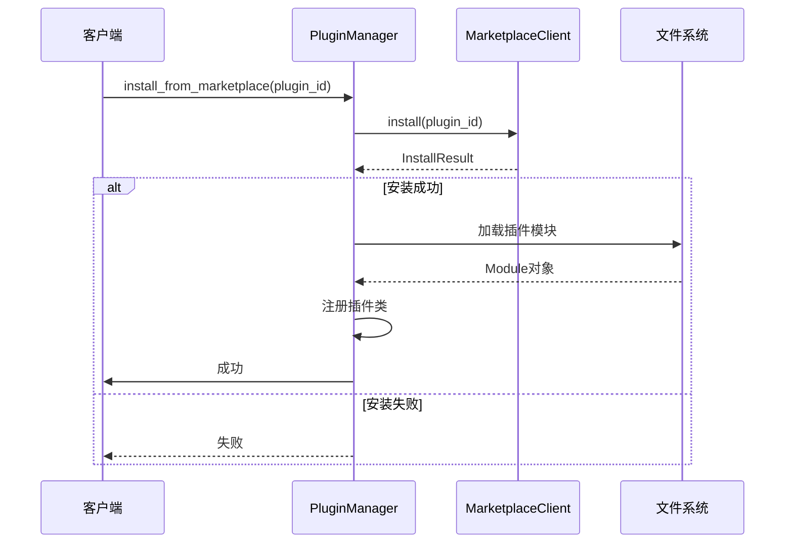

**图表来源**
- [src/plugins/manager.py:299-390](file://src/plugins/manager.py#L299-L390)

**章节来源**
- [src/plugins/manager.py:14-584](file://src/plugins/manager.py#L14-L584)

### 示例插件实现

系统提供了五个完整的示例插件，展示了不同类型插件的实现方式：

#### 文本预处理插件

TextPreprocessorPlugin展示了感知层插件的典型实现：

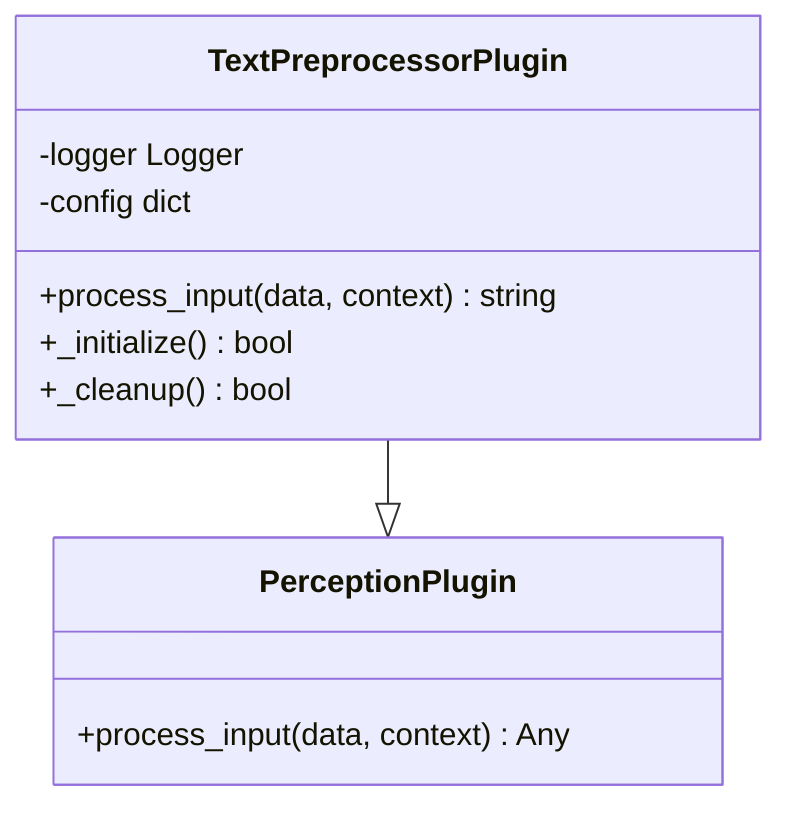

**图表来源**
- [src/plugins/example_plugins.py:14-58](file://src/plugins/example_plugins.py#L14-L58)

#### 缓存插件

SimpleCachePlugin展示了记忆层插件的实现：

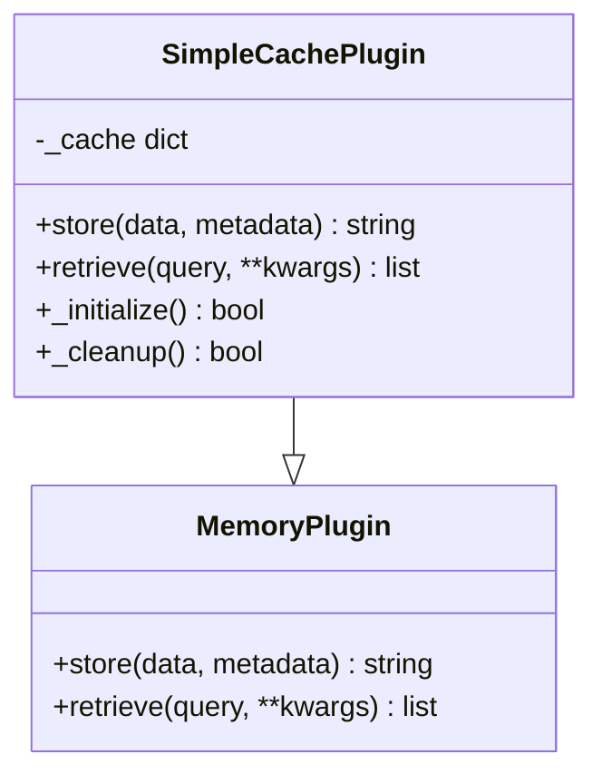

**图表来源**
- [src/plugins/example_plugins.py:61-109](file://src/plugins/example_plugins.py#L61-L109)

#### 检索插件

KeywordRetrievalPlugin展示了检索层插件的实现：

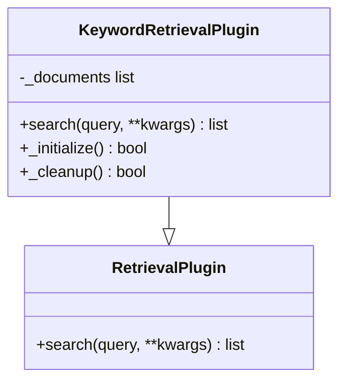

**图表来源**
- [src/plugins/example_plugins.py:112-167](file://src/plugins/example_plugins.py#L112-L167)

#### 数据验证插件

DataValidatorPlugin展示了巩固层插件的实现：

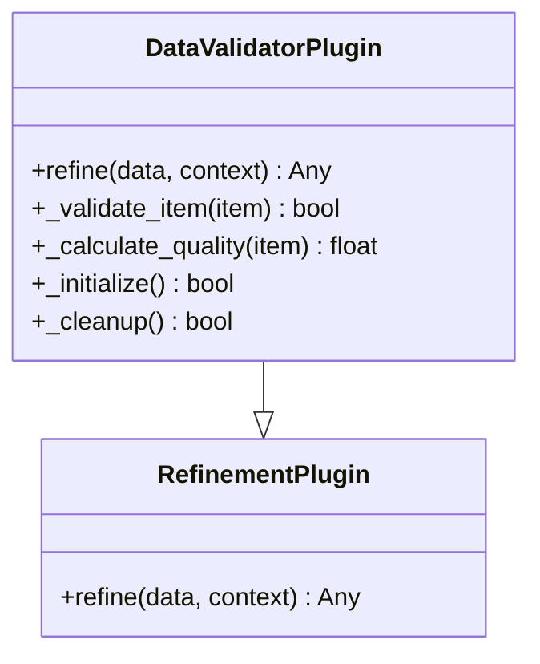

**图表来源**
- [src/plugins/example_plugins.py:171-242](file://src/plugins/example_plugins.py#L171-L242)

#### 响应格式化插件

ResponseFormatterPlugin展示了响应层插件的实现：

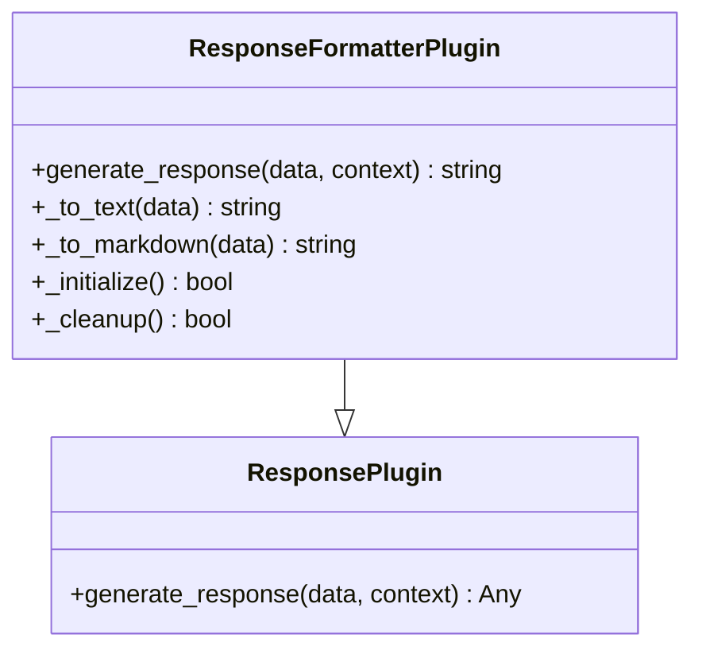

**图表来源**
- [src/plugins/example_plugins.py:245-316](file://src/plugins/example_plugins.py#L245-L316)

**章节来源**
- [src/plugins/example_plugins.py:13-332](file://src/plugins/example_plugins.py#L13-L332)

## 依赖分析

### 插件系统依赖关系

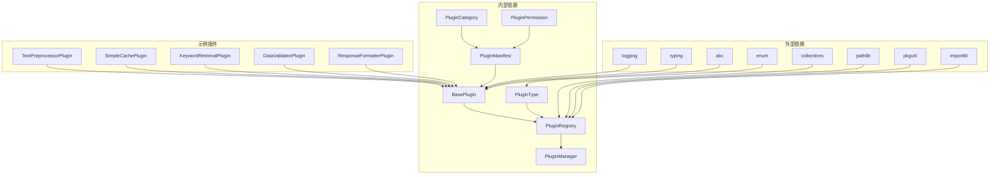

**图表来源**
- [src/plugins/base.py:9-12](file://src/plugins/base.py#L9-L12)
- [src/plugins/registry.py:6-12](file://src/plugins/registry.py#L6-L12)
- [src/marketplace/models.py:11-16](file://src/marketplace/models.py#L11-L16)

### 市场集成依赖

插件系统与市场模块的集成关系：

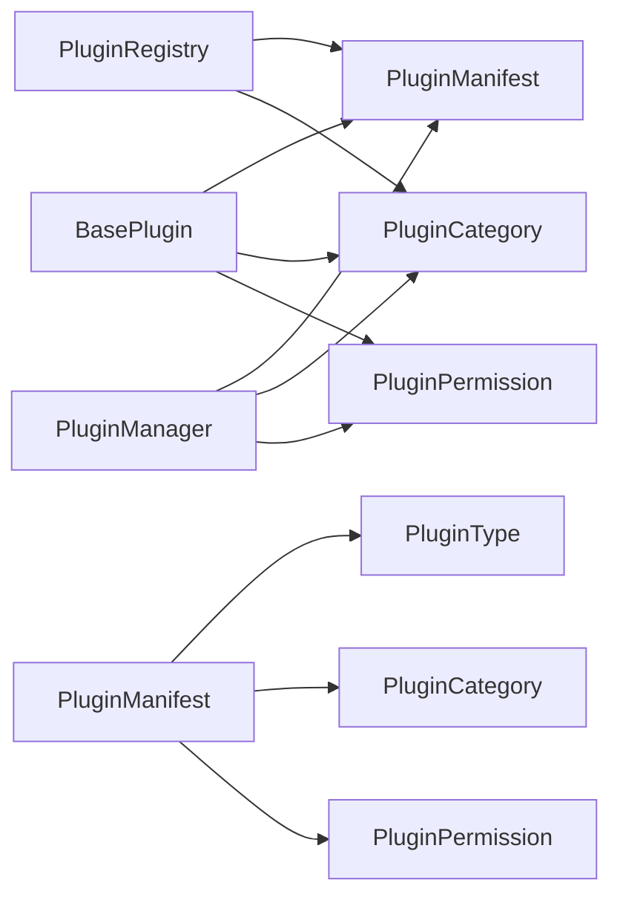

**图表来源**
- [src/plugins/base.py:174-229](file://src/plugins/base.py#L174-L229)
- [src/marketplace/models.py:135-200](file://src/marketplace/models.py#L135-L200)

**章节来源**
- [src/plugins/base.py:172-274](file://src/plugins/base.py#L172-L274)
- [src/plugins/registry.py:279-380](file://src/plugins/registry.py#L279-L380)
- [src/plugins/manager.py:287-581](file://src/plugins/manager.py#L287-L581)

## 性能考虑

### 插件加载优化

1. **依赖关系排序**：使用拓扑排序确保插件按正确的顺序加载
2. **懒加载机制**：支持插件的延迟加载以减少启动时间
3. **加载状态监控**：提供插件加载状态的实时监控

### 内存管理

1. **及时清理**：插件卸载时自动清理资源
2. **显式释放**：支持插件资源的显式释放
3. **内存使用监控**：监控插件的内存使用情况

### 性能优化建议

1. **插件设计**：避免在初始化时进行耗时操作
2. **配置管理**：合理使用配置系统，避免频繁的配置读取
3. **日志优化**：使用适当的日志级别，避免过度的日志输出

## 故障排除指南

### 常见问题及解决方案

#### 插件加载失败

**问题症状**：
- 插件无法被发现
- 插件初始化失败
- 插件注册失败

**排查步骤**：
1. 检查插件类是否正确继承BasePlugin
2. 验证必需方法是否正确实现
3. 查看日志获取具体错误信息
4. 确认插件路径是否正确

**解决方案**：
```python
# 确保插件类正确实现
class MyPlugin(BasePlugin):
    @property
    def description(self) -> str:
        return "插件描述"
    
    @property
    def dependencies(self) -> List[str]:
        return []
    
    def _initialize(self) -> bool:
        # 初始化逻辑
        return True
    
    def _cleanup(self) -> bool:
        # 清理逻辑
        return True
```

#### 依赖循环问题

**问题症状**：
- 插件加载时出现循环依赖警告
- 插件加载顺序异常

**排查步骤**：
1. 检查插件间的依赖关系
2. 使用依赖解析工具分析
3. 重新设计插件架构

**解决方案**：
```python
# 避免循环依赖的设计
# 将共享功能提取到独立的插件中
class SharedUtilityPlugin(BasePlugin):
    # 共享功能实现
    pass

class PluginA(RetrievalPlugin):
    dependencies = ["shared_utility"]

class PluginB(MemoryPlugin):
    dependencies = ["shared_utility"]
```

#### 性能问题

**问题症状**：
- 插件执行时间过长
- 内存使用过高
- 系统响应缓慢

**排查步骤**：
1. 监控插件执行时间
2. 分析资源使用情况
3. 考虑异步处理机制

**解决方案**：
```python
# 使用异步处理优化性能
import asyncio

class AsyncPlugin(BasePlugin):
    async def process_async(self, data):
        # 异步处理逻辑
        await asyncio.sleep(0.1)  # 模拟异步操作
        return processed_data
```

**章节来源**
- [src/plugins/README.md:208-226](file://src/plugins/README.md#L208-L226)

## 结论

NecoRAG插件系统是一个设计精良、功能完整的扩展框架，具有以下特点：

1. **模块化设计**：清晰的插件类型分离和职责划分
2. **生命周期管理**：完整的插件注册、加载、启用、禁用和卸载流程
3. **依赖解析**：智能的插件间依赖关系管理和循环检测
4. **市场集成**：支持插件市场的发现、安装和版本管理
5. **扩展性**：易于添加新的插件类型和功能

通过遵循本文档提供的开发指南和最佳实践，开发者可以快速创建高质量的插件，为NecoRAG系统添加新的功能和能力。

## 附录

### 快速开始示例

```python
from src.plugins import plugin_manager, plugin_registry

# 发现插件
plugin_manager.discover_and_register_plugins()

# 加载插件
configs = {
    "text_preprocessor": {"normalize_case": True},
    "simple_cache": {},
    "keyword_retrieval": {}
}
results = plugin_manager.load_plugins(configs)

# 使用插件
preprocessor = plugin_registry.get_plugin("text_preprocessor")
if preprocessor:
    processed_text = preprocessor.process_input("Hello World!", {})

# 卸载插件
plugin_manager.unload_plugins(["text_preprocessor"])
```

### 插件开发最佳实践

1. **遵循插件基类规范**：确保正确继承相应的插件基类
2. **提供完整文档**：包含插件描述、依赖关系和使用示例
3. **实现必要的方法**：确保必需方法的正确实现
4. **使用配置系统**：合理使用插件配置功能
5. **添加日志记录**：使用适当的日志级别记录插件状态
6. **处理异常情况**：妥善处理插件执行中的异常
7. **测试插件功能**：编写单元测试验证插件功能

### 市场发布流程

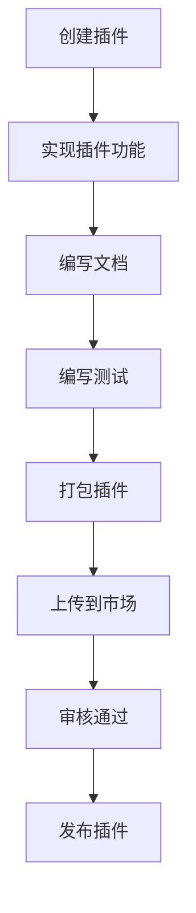

**图表来源**
- [src/plugins/README.md:227-236](file://src/plugins/README.md#L227-L236)