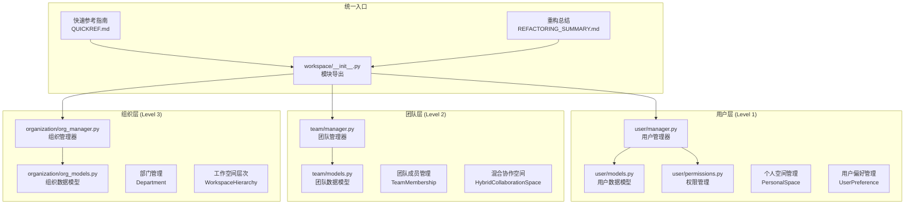
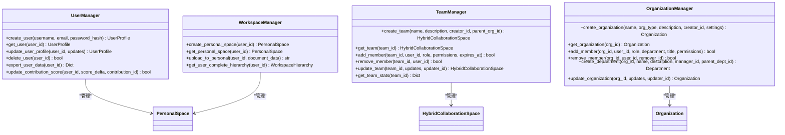

# 工作空间架构系统

<cite>
**本文引用的文件**
- [src/workspace/__init__.py](file://src/workspace/__init__.py)
- [src/workspace/QUICKREF.md](file://src/workspace/QUICKREF.md)
- [src/workspace/REFACTORING_SUMMARY.md](file://src/workspace/REFACTORING_SUMMARY.md)
- [src/workspace/user/manager.py](file://src/workspace/user/manager.py)
- [src/workspace/team/manager.py](file://src/workspace/team/manager.py)
- [src/workspace/organization/org_manager.py](file://src/workspace/organization/org_manager.py)
- [src/workspace/user/models.py](file://src/workspace/user/models.py)
- [src/workspace/team/models.py](file://src/workspace/team/models.py)
- [src/workspace/organization/org_models.py](file://src/workspace/organization/org_models.py)
- [src/necorag.py](file://src/necorag.py)
</cite>

## 更新摘要
**所做更改**
- 完全重构了原有的插件扩展系统，移除了插件市场和插件开发相关文档
- 新增了完整的三级用户工作空间架构系统，包含用户层、团队层、组织层
- 更新了架构图和组件说明，展示从个人到团队再到组织的完整层级结构
- 强化了工作空间管理的统一入口设计，提供简洁的高级API接口
- 新增了快速参考指南和重构总结文档

## 目录
1. [简介](#简介)
2. [项目结构](#项目结构)
3. [核心组件](#核心组件)
4. [架构总览](#架构总览)
5. [详细组件分析](#详细组件分析)
6. [快速开始指南](#快速开始指南)
7. [权限管理体系](#权限管理体系)
8. [典型应用场景](#典型应用场景)
9. [性能考量](#性能考量)
10. [故障排查指南](#故障排查指南)
11. [结论](#结论)
12. [附录](#附录)

## 简介
本文件面向工作空间架构系统，系统性阐述完整的三级用户工作空间生态系统。该系统提供从个人用户到团队协作再到组织管理的完整架构支持，包含用户画像管理、个人空间、团队协作、组织架构等功能，涵盖用户管理、权限控制、跨层级协作等核心能力，以及统一的工作空间管理API接口。

**更新** 本版本专注于工作空间架构系统的完整实现，完全移除了插件扩展功能，强化了三级用户系统的统一入口设计，提供简洁的高级API接口，支持个人、团队、组织的完整协作功能。

深入解释工作空间架构的扩展方案、权限管理体系、跨层级协作策略和统一管理平台。同时提供工作空间开发最佳实践、接口规范与兼容性保障、安装部署、配置管理与故障诊断方法，帮助开发者构建丰富的协作生态系统。

## 项目结构
工作空间架构系统现已发展为包含三层架构的完整系统：用户层、团队层、组织层。每个层级都有独立的模块结构，提供完整的协作功能。



**图表来源**
- [src/workspace/user/manager.py:22-422](file://src/workspace/user/manager.py#L22-L422)
- [src/workspace/team/manager.py:20-143](file://src/workspace/team/manager.py#L20-L143)
- [src/workspace/organization/org_manager.py:31-428](file://src/workspace/organization/org_manager.py#L31-L428)

**章节来源**
- [src/workspace/__init__.py:1-71](file://src/workspace/__init__.py#L1-L71)
- [src/workspace/QUICKREF.md:1-190](file://src/workspace/QUICKREF.md#L1-L190)
- [src/workspace/REFACTORING_SUMMARY.md:1-392](file://src/workspace/REFACTORING_SUMMARY.md#L1-L392)

## 核心组件
- **用户管理器**：UserManager 作为用户层的统一入口，提供用户创建、查询、更新、删除等完整功能，支持GDPR合规的数据管理。
- **团队管理器**：TeamManager 作为团队层的统一入口，提供团队创建、成员管理、权限控制等协作功能。
- **组织管理器**：OrganizationManager 作为组织层的统一入口，提供组织创建、部门管理、跨组织协作等管理功能。
- **工作空间管理器**：WorkspaceManager 提供个人空间、公共空间、团队空间的统一管理。
- **权限管理器**：PermissionManager 提供细粒度的权限控制和访问管理。
- **数据模型系统**：完整的三层架构数据模型，包括用户画像、团队关系、组织结构等核心数据结构。
- **权限体系**：从用户到团队到组织的逐级权限设计，支持READ、WRITE、DELETE、SHARE、AUDIT、MANAGE等权限级别。
- **跨层级协作**：支持用户在不同层级间的权限继承和协作空间共享。
- **GDPR合规**：完整的数据删除、导出、隐私保护功能。

**章节来源**
- [src/workspace/user/manager.py:22-422](file://src/workspace/user/manager.py#L22-L422)
- [src/workspace/team/manager.py:20-143](file://src/workspace/team/manager.py#L20-L143)
- [src/workspace/organization/org_manager.py:31-428](file://src/workspace/organization/org_manager.py#L31-L428)

## 架构总览
工作空间系统采用"三级架构 + 统一入口"的设计模式，用户层负责个人管理，团队层负责协作管理，组织层负责架构管理，通过统一的管理器提供完整的API接口。



**图表来源**
- [src/workspace/user/manager.py:22-422](file://src/workspace/user/manager.py#L22-L422)
- [src/workspace/team/manager.py:20-143](file://src/workspace/team/manager.py#L20-L143)
- [src/workspace/organization/org_manager.py:31-428](file://src/workspace/organization/org_manager.py#L31-L428)

## 详细组件分析

### 用户层 (Level 1) - 个人管理
- **用户管理**：create_user/get_user/update_user_profile/delete_user/export_user_data 等方法提供完整的用户生命周期管理。
- **个人空间**：create_personal_space/get_personal_space/upload_to_personal 等方法管理用户的个人工作空间。
- **贡献管理**：update_contribution_score 等方法跟踪和管理员工的贡献积分和等级提升。
- **偏好管理**：UserPreference 模型支持用户偏好的个性化设置。
- **GDPR合规**：完整的数据删除和导出功能，符合隐私保护法规要求。

**章节来源**
- [src/workspace/user/manager.py:22-422](file://src/workspace/user/manager.py#L22-L422)

### 团队层 (Level 2) - 协作管理
- **团队管理**：create_team/get_team/update_team 等方法管理团队的基本信息和配置。
- **成员管理**：add_member/remove_member 等方法管理团队成员关系和权限分配。
- **权限控制**：TeamMembership 模型支持细粒度的成员权限控制。
- **协作空间**：HybridCollaborationSpace 提供混合协作模式的空间管理。
- **统计信息**：get_team_stats 等方法提供团队活动和资源使用统计。

**章节来源**
- [src/workspace/team/manager.py:20-143](file://src/workspace/team/manager.py#L20-L143)

### 组织层 (Level 3) - 架构管理
- **组织管理**：create_organization/get_organization/update_organization 等方法管理组织的基本信息。
- **成员管理**：add_member/remove_member 等方法管理组织成员关系和角色分配。
- **部门管理**：create_department 等方法管理组织的部门结构和层级关系。
- **跨组织协作**：支持组织间的资源分享和协作管理。
- **工作空间层次**：WorkspaceHierarchy 模型管理完整的层级关系。

**章节来源**
- [src/workspace/organization/org_manager.py:31-428](file://src/workspace/organization/org_manager.py#L31-L428)

### 权限管理体系
- **用户角色权限**：USER → CONTRIBUTOR → DOMAIN_EXPERT → ADMIN 的渐进式权限提升。
- **团队角色权限**：GUEST → MEMBER → ADMIN → OWNER 的完整权限体系。
- **组织角色权限**：INTERN → MEMBER → SENIOR → MANAGER → DIRECTOR → CEO → OWNER 的企业级权限设计。
- **权限继承**：支持跨层级的权限继承和权限提升机制。
- **细粒度控制**：READ、WRITE、DELETE、SHARE、AUDIT、MANAGE 等基础权限的组合使用。

**章节来源**
- [src/workspace/QUICKREF.md:128-158](file://src/workspace/QUICKREF.md#L128-L158)

### 统一入口系统
- **模块导出**：workspace/__init__.py 提供统一的模块导入接口。
- **快速参考**：QUICKREF.md 提供30秒上手的快速使用指南。
- **重构总结**：REFACTORING_SUMMARY.md 详细记录重构过程和最佳实践。
- **API统一**：所有管理器通过统一的接口提供服务，支持异步操作。

**章节来源**
- [src/workspace/__init__.py:1-71](file://src/workspace/__init__.py#L1-L71)
- [src/workspace/QUICKREF.md:1-190](file://src/workspace/QUICKREF.md#L1-L190)
- [src/workspace/REFACTORING_SUMMARY.md:1-392](file://src/workspace/REFACTORING_SUMMARY.md#L1-L392)

## 快速开始指南

### 30秒上手
```python
from src.workspace import UserManager, TeamManager, OrganizationManager

# Level 1: 创建用户
user_manager = UserManager()
alice = await user_manager.create_user("Alice", "alice@example.com", "hashed_password")

# Level 2: 创建团队
team_manager = TeamManager()
nlp_team = await team_manager.create_team("NLP 小组", creator_id=alice.user_id)

# Level 3: 创建组织
org_manager = OrganizationManager()
company = await org_manager.create_organization("科技公司", creator_id=alice.user_id)
```

### 常用API速查
- **用户层**：create_user/get_user/update_user_profile/delete_user
- **团队层**：create_team/add_member/remove_member/get_team_stats
- **组织层**：create_organization/add_member/remove_member/create_department

**章节来源**
- [src/workspace/QUICKREF.md:7-25](file://src/workspace/QUICKREF.md#L7-L25)
- [src/workspace/QUICKREF.md:27-54](file://src/workspace/QUICKREF.md#L27-L54)

## 权限管理体系

### 用户角色权限
```
USER         → READ, WRITE
CONTRIBUTOR  → + SHARE, AUDIT  
DOMAIN_EXPERT → + MANAGE
ADMIN        → ALL
```

### 团队角色权限
```
GUEST   → READ
MEMBER  → READ, WRITE
ADMIN   → + DELETE, SHARE, AUDIT
OWNER   → ALL
```

### 组织角色权限
```
INTERN   → READ
MEMBER   → READ, WRITE
SENIOR   → + PARTICIPATE
MANAGER  → + TEAM_MANAGE
DIRECTOR → + DEPT_MANAGE
CEO      → + EXECUTIVE
OWNER    → ALL
```

**章节来源**
- [src/workspace/QUICKREF.md:128-158](file://src/workspace/QUICKREF.md#L128-L158)

## 典型应用场景

### 创业公司场景
```python
# 创建公司
company = await org_manager.create_organization(
    "AI 初创公司",
    org_type=OrganizationType.COMPANY
)

# 创建部门
await org_manager.create_department(company.org_id, "技术部")

# 创建团队
await team_manager.create_team(
    "核心开发组",
    parent_org_id=company.org_id
)
```

### 开源社区场景
```python
# 创建社区
community = await org_manager.create_organization(
    "开源社区",
    org_type=OrganizationType.COMMUNITY,
    settings={"allow_public_join": True}
)

# 创建专项小组
await team_manager.create_team(
    "文档翻译组",
    parent_org_id=community.org_id
)
```

**章节来源**
- [src/workspace/QUICKREF.md:76-126](file://src/workspace/QUICKREF.md#L76-L126)

## 性能考量
- **异步操作**：所有管理器都支持async/await，提供高效的异步操作能力。
- **内存管理**：使用字典和集合进行高效的数据存储和查询。
- **权限缓存**：权限检查结果可以进行缓存，减少重复计算。
- **层级优化**：通过WorkspaceHierarchy缓存用户完整的层级关系，提升查询效率。
- **GDPR合规**：数据删除和导出操作经过优化，确保合规性的同时不影响性能。

**章节来源**
- [src/workspace/user/manager.py:150-200](file://src/workspace/user/manager.py#L150-L200)
- [src/workspace/team/manager.py:20-143](file://src/workspace/team/manager.py#L20-L143)

## 故障排查指南
- **用户管理失败**
  - 检查用户邮箱是否重复，确保唯一性。
  - 验证密码哈希是否正确生成。
  - 查看GDPR相关操作的日志记录。
- **团队创建失败**
  - 检查团队名称是否为空或过长。
  - 验证创建者的权限是否足够。
  - 确认团队层级关系是否正确。
- **组织管理失败**
  - 检查组织类型是否有效。
  - 验证成员数量是否超过限制。
  - 查看部门层级结构是否正确。
- **权限问题**
  - 检查用户角色和权限映射。
  - 验证权限继承关系是否正确。
  - 查看权限缓存是否过期。
- **跨层级协作问题**
  - 检查WorkspaceHierarchy的完整性。
  - 验证层级关系的正确性。
  - 查看权限传递机制是否正常。

**章节来源**
- [src/workspace/user/manager.py:97-148](file://src/workspace/user/manager.py#L97-L148)
- [src/workspace/team/manager.py:69-129](file://src/workspace/team/manager.py#L69-L129)
- [src/workspace/organization/org_manager.py:130-183](file://src/workspace/organization/org_manager.py#L130-L183)

## 结论
工作空间架构系统通过清晰的三级架构设计、严格的权限管理体系、完善的跨层级协作机制，实现了从个人到团队再到组织的完整协作生态。结合统一的管理器和快速参考指南，开发者可以快速构建符合规范的工作空间应用，支持各种规模的协作场景。

**更新** 新增的三级用户系统提供了完整的个人、团队、组织管理功能，完全替代了原有的插件扩展系统。系统采用模块化设计，每层都有独立的职责和接口，支持灵活的扩展和定制。

UserManager、TeamManager、OrganizationManager 作为统一入口，提供了完整的三层架构功能，包括用户管理、团队协作、组织管理等全套能力。通过QUICKREF.md和REFACTORING_SUMMARY.md等文档，开发者可以快速理解和使用整个系统。

未来可在权限优化、性能提升、功能扩展等方面进一步完善，提升系统的可扩展性与易用性。

## 附录

### 开发最佳实践
- **分层原则**：每层只关注自己的职责，下层不依赖上层，跨层访问通过明确定义的接口。
- **命名规范**：文件名使用 snake_case，类名使用 PascalCase，常量使用 UPPER_CASE。
- **导入顺序**：标准库 → 第三方库 → 本地导入的清晰分层。
- **异步编程**：所有管理器都支持异步操作，使用async/await提高性能。
- **GDPR合规**：确保所有数据操作都符合隐私保护法规要求。

**章节来源**
- [src/workspace/REFACTORING_SUMMARY.md:318-346](file://src/workspace/REFACTORING_SUMMARY.md#L318-L346)

### 接口规范与兼容性
- **统一管理器接口**：UserManager、TeamManager、OrganizationManager提供一致的API设计。
- **异步操作规范**：所有方法都支持异步操作，返回Promise或协程对象。
- **错误处理规范**：统一的异常处理和错误返回格式。
- **权限继承规范**：明确的权限继承和提升机制。
- **数据模型规范**：完整的数据模型定义和验证机制。

**章节来源**
- [src/workspace/user/manager.py:22-422](file://src/workspace/user/manager.py#L22-L422)
- [src/workspace/team/manager.py:20-143](file://src/workspace/team/manager.py#L20-L143)
- [src/workspace/organization/org_manager.py:31-428](file://src/workspace/organization/org_manager.py#L31-L428)

### 安装部署与配置管理
- **模块导入**：通过 src.workspace 导入所有管理器和模型。
- **快速开始**：使用QUICKREF.md中的30秒上手示例快速开始。
- **权限配置**：通过角色和权限映射配置用户权限。
- **层级管理**：通过WorkspaceHierarchy管理完整的层级关系。
- **GDPR设置**：配置数据删除和导出的合规设置。

**章节来源**
- [src/workspace/__init__.py:28-47](file://src/workspace/__init__.py#L28-L47)
- [src/workspace/QUICKREF.md:162-177](file://src/workspace/QUICKREF.md#L162-L177)

### 故障诊断方法
- **日志定位**：关注各管理器的操作日志，定位问题发生的具体位置。
- **权限分析**：使用权限检查工具分析权限分配和继承关系。
- **层级验证**：通过WorkspaceHierarchy验证层级关系的正确性。
- **数据一致性**：检查用户、团队、组织数据的一致性和完整性。
- **性能监控**：监控异步操作的执行时间和资源使用情况。

**章节来源**
- [src/workspace/user/manager.py:150-200](file://src/workspace/user/manager.py#L150-L200)
- [src/workspace/team/manager.py:20-143](file://src/workspace/team/manager.py#L20-L143)
- [src/workspace/organization/org_manager.py:31-428](file://src/workspace/organization/org_manager.py#L31-L428)