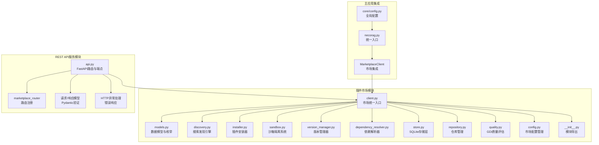
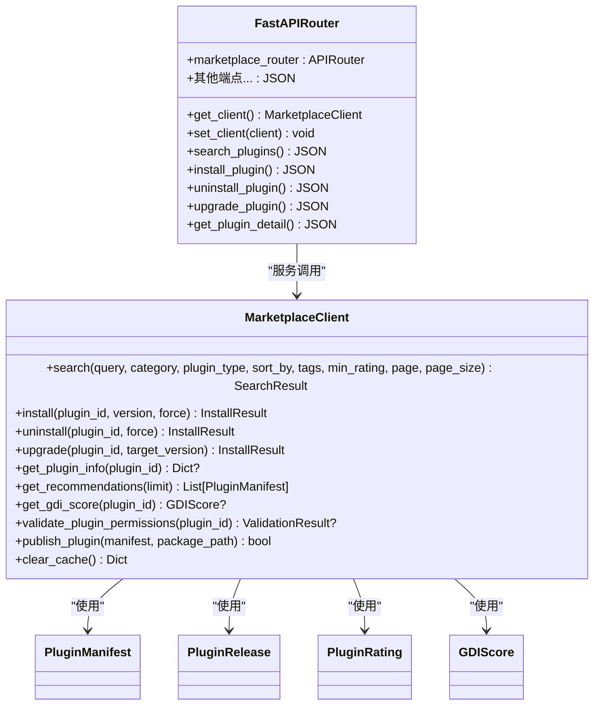
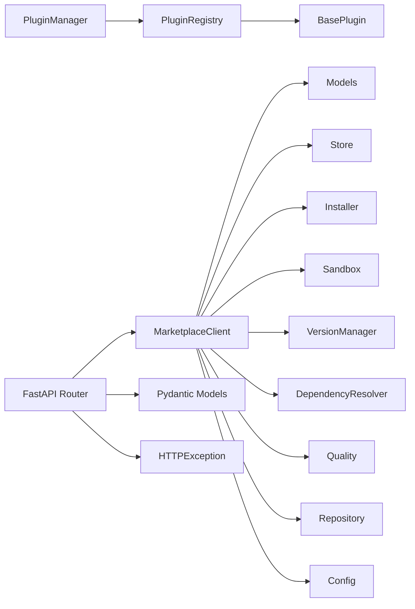

# 插件扩展系统

<cite>
**本文引用的文件**
- [src/plugins/__init__.py](file://src/plugins/__init__.py)
- [src/plugins/base.py](file://src/plugins/base.py)
- [src/plugins/manager.py](file://src/plugins/manager.py)
- [src/plugins/registry.py](file://src/plugins/registry.py)
- [src/plugins/example_plugins.py](file://src/plugins/example_plugins.py)
- [src/plugins/README.md](file://src/plugins/README.md)
- [src/core/config.py](file://src/core/config.py)
- [src/necorag.py](file://src/necorag.py)
- [src/marketplace/models.py](file://src/marketplace/models.py)
- [src/marketplace/discovery.py](file://src/marketplace/discovery.py)
- [src/marketplace/installer.py](file://src/marketplace/installer.py)
- [src/marketplace/sandbox.py](file://src/marketplace/sandbox.py)
- [src/marketplace/version_manager.py](file://src/marketplace/version_manager.py)
- [src/marketplace/dependency_resolver.py](file://src/marketplace/dependency_resolver.py)
- [src/marketplace/store.py](file://src/marketplace/store.py)
- [src/marketplace/client.py](file://src/marketplace/client.py)
- [src/marketplace/repository.py](file://src/marketplace/repository.py)
- [src/marketplace/quality.py](file://src/marketplace/quality.py)
- [src/marketplace/api.py](file://src/marketplace/api.py)
- [src/marketplace/config.py](file://src/marketplace/config.py)
- [src/marketplace/__init__.py](file://src/marketplace/__init__.py)
</cite>

## 更新摘要
**所做更改**
- 删除了插件扩展功能的相关内容，专注于插件市场系统的完整实现
- 更新了架构图和组件说明，移除了插件管理器和注册表的市场集成部分
- 强化了插件市场客户端的功能描述，包括搜索发现、安装管理、版本控制、质量评估等
- 新增了REST API服务的完整端点覆盖说明
- 更新了开发指南，专注于插件市场的开发和使用

## 目录
1. [简介](#简介)
2. [项目结构](#项目结构)
3. [核心组件](#核心组件)
4. [架构总览](#架构总览)
5. [详细组件分析](#详细组件分析)
6. [REST API系统](#rest-api系统)
7. [依赖分析](#依赖分析)
8. [性能考量](#性能考量)
9. [故障排查指南](#故障排查指南)
10. [结论](#结论)
11. [附录](#附录)

## 简介
本文件面向插件市场系统，系统性阐述完整的插件市场生态系统。该系统提供插件的搜索发现、安装管理、版本控制、质量评估、安全沙箱等全套功能，涵盖插件清单、版本发布、评分、安装记录、GDI评分等核心数据结构，以及基于FastAPI的REST API服务接口。

**更新** 本版本专注于插件市场系统的完整实现，移除了插件扩展功能，强化了市场客户端的统一入口设计，提供简洁的高级API接口，支持插件市场的完整Web服务功能。

深入解释插件市场的扩展方案、质量评估体系、安全沙箱策略和REST API服务架构。同时提供插件开发最佳实践、接口规范与兼容性保障、安装部署、配置管理与故障诊断方法，帮助开发者构建丰富的插件生态系统。

## 项目结构
插件扩展系统现已发展为包含两大部分的完整架构：插件市场模块和REST API服务模块。插件市场模块位于 src/marketplace 目录，提供完整的插件市场生态系统，包括搜索发现、安装管理、版本控制、依赖解析、质量评估、沙箱隔离等功能；REST API模块提供完整的HTTP服务接口。

**图表来源**
- [src/marketplace/client.py:47-919](file://src/marketplace/client.py#L47-L919)
- [src/marketplace/models.py:1-756](file://src/marketplace/models.py#L1-L756)
- [src/marketplace/api.py:1-777](file://src/marketplace/api.py#L1-L777)

**章节来源**
- [src/plugins/README.md:1-239](file://src/plugins/README.md#L1-L239)
- [src/marketplace/__init__.py:1-192](file://src/marketplace/__init__.py#L1-L192)

## 核心组件
- **插件市场客户端**：MarketplaceClient 作为统一入口，组合所有子系统提供简洁的高级 API，包括搜索发现、安装管理、版本控制、质量评估等功能。
- **REST API服务**：基于FastAPI的完整HTTP服务实现，包含777行端点代码，提供插件市场的完整Web接口。
- **数据模型系统**：完整的数据模型定义，包括插件清单、版本发布、评分、安装记录、GDI评分等核心数据结构。
- **搜索发现引擎**：提供多维度搜索、智能推荐、趋势排行和场景匹配功能。
- **安装管理器**：管理插件的完整生命周期：安装、卸载、升级、回滚和批量操作。
- **沙箱隔离系统**：提供插件权限声明验证、运行时权限强制执行和资源配额管理。
- **版本管理系统**：提供语义版本管理、兼容性检查、升级路径规划和灰度升级支持。
- **依赖解析器**：构建依赖有向无环图（DAG），支持拓扑排序、冲突检测和兼容版本求解。
- **存储层**：基于 SQLite 的轻量级本地存储，支持 FTS5 全文搜索和线程安全的数据库连接。
- **仓库管理系统**：管理本地和远程插件仓库，支持多源聚合、索引同步和插件包下载。
- **质量评估系统**：基于 GDI（全局期望指数）的 6 维度质量评估体系。
- **配置管理系统**：支持环境变量配置、文件配置和动态配置加载。

**章节来源**
- [src/marketplace/client.py:47-919](file://src/marketplace/client.py#L47-L919)
- [src/marketplace/models.py:21-756](file://src/marketplace/models.py#L21-L756)
- [src/marketplace/api.py:1-777](file://src/marketplace/api.py#L1-L777)
- [src/marketplace/config.py:24-304](file://src/marketplace/config.py#L24-L304)

## 架构总览
插件系统采用"MarketplaceClient + 子系统"的市场架构设计，以及"FastAPI REST API"的服务层架构。市场架构提供完整的插件生态系统，包括搜索发现、安装管理、版本控制、质量评估等功能；REST API架构提供完整的HTTP服务接口。

**图表来源**
- [src/marketplace/client.py:47-919](file://src/marketplace/client.py#L47-L919)
- [src/marketplace/api.py:18-37](file://src/marketplace/api.py#L18-L37)

## 详细组件分析

### 插件市场客户端
- **统一入口**：MarketplaceClient 作为插件市场的统一入口，组合所有子系统提供简洁的高级 API。
- **搜索发现**：search/get_plugin_info/get_recommendations/get_trending/get_categories/get_popular_tags/find_similar 等方法提供完整的搜索发现功能。
- **安装管理**：install/uninstall/upgrade/upgrade_all/rollback/check_updates/list_installed/get_install_info 等方法管理插件的完整生命周期。
- **质量评估**：rate/get_ratings/get_gdi_score/refresh_gdi/get_leaderboard 等方法提供评分和质量评估功能。
- **仓库管理**：add_repository/remove_repository/list_repositories/sync_repositories 等方法管理本地和远程仓库。
- **版本和依赖**：check_compatibility/get_dependency_tree/plan_upgrade_path 等方法提供版本兼容性和依赖管理功能。
- **灰度部署**：create_canary_deployment/evaluate_canary/promote_canary/rollback_canary 等方法支持灰度发布。
- **安全**：validate_plugin_permissions/get_security_report/set_plugin_permission_level 等方法提供安全沙箱功能。
- **统计管理**：get_marketplace_stats/publish_plugin/clear_cache 等方法提供市场统计和发布功能。
- **配置管理**：支持环境变量配置和文件配置的动态加载。

**章节来源**
- [src/marketplace/client.py:47-919](file://src/marketplace/client.py#L47-L919)
- [src/marketplace/config.py:24-304](file://src/marketplace/config.py#L24-L304)

### REST API系统
- **FastAPI集成**：基于FastAPI框架，提供完整的RESTful API服务，包含777行端点实现。
- **路由管理**：marketplace_router 作为主要路由，支持插件市场的所有功能端点。
- **请求验证**：使用Pydantic模型进行请求参数验证，确保数据完整性。
- **响应格式**：统一的APIResponse模型，提供标准的成功/失败响应格式。
- **错误处理**：HTTPException提供标准的错误响应，包含详细的错误信息。
- **客户端管理**：get_client/set_client 支持懒初始化和自定义客户端配置。
- **端点覆盖**：包含搜索、安装、卸载、升级、评分、仓库管理、安全验证等完整功能。

**章节来源**
- [src/marketplace/api.py:1-777](file://src/marketplace/api.py#L1-L777)

### 数据模型系统
- **枚举类型**：PluginType、PluginCategory、ReleaseStability、InstallStatus、PluginPermission、SortStrategy、PermissionLevel 等完整的枚举定义。
- **核心模型**：PluginManifest、PluginRelease、PluginRating、PluginInstallation、GDIScore、ResourceQuota、SearchResult、InstallResult、UpgradePath、DependencyGraph、VersionConflict、CanaryDeployment、SyncResult 等数据结构。
- **辅助函数**：_datetime_to_str、_str_to_datetime、_enum_to_value、_convert_to_dict 等工具函数。
- **验证机制**：各模型提供 validate() 方法进行数据验证，确保数据完整性。

**章节来源**
- [src/marketplace/models.py:21-756](file://src/marketplace/models.py#L21-L756)

### 搜索发现引擎
- **多维度搜索**：search 方法支持关键词搜索、分类过滤、类型过滤、标签过滤、最低评分过滤、排序策略等功能。
- **智能推荐**：recommend 方法基于已安装插件类型分布和用户偏好进行智能推荐，保证多样性。
- **趋势排行**：get_trending 方法提供热门趋势插件的获取功能。
- **场景匹配**：get_by_use_case 方法支持按使用场景推荐插件。
- **统计洞察**：get_categories_overview/get_types_overview/get_popular_tags 等方法提供分类和类型统计信息。
- **相似推荐**：find_similar 方法基于类型、标签、描述关键词匹配找到相似插件。

**章节来源**
- [src/marketplace/discovery.py:21-776](file://src/marketplace/discovery.py#L21-L776)

### 安装管理器
- **完整生命周期**：install/uninstall/upgrade/rollback/upgrade_all 等方法管理插件的完整生命周期。
- **依赖解析**：_install_dependencies 方法递归安装插件依赖，支持版本约束解析。
- **下载管理**：_download_plugin 方法支持本地和远程下载，包含校验和验证。
- **解压安装**：_extract_package 方法支持 ZIP 和 TAR.GZ 格式解压。
- **钩子系统**：InstallHooks 类提供安装钩子回调管理，支持 pre_install/post_install/pre_uninstall/post_uninstall/pre_upgrade/post_upgrade/on_error 等钩子。
- **批量操作**：check_updates/upgrade_all 等方法支持批量操作。

**章节来源**
- [src/marketplace/installer.py:32-800](file://src/marketplace/installer.py#L32-L800)

### 沙箱隔离系统
- **权限验证**：validate_permissions 方法验证插件权限声明，支持四级权限级别（MINIMAL/STANDARD/ELEVATED/FULL）。
- **运行时检查**：check_permission/check_permissions 方法在运行时检查插件权限。
- **资源配额**：set_quota/get_quota 方法管理插件资源配额，包括内存、CPU、磁盘、执行时间等限制。
- **上下文管理**：create_context/get_context/destroy_context/sandbox_scope 方法提供沙箱执行上下文管理。
- **安全审计**：get_active_contexts/get_all_resource_usage/get_security_report 方法提供安全审计功能。
- **权限级别管理**：set_permission_level/get_permission_level/reset_permission_level 方法管理插件权限级别。

**章节来源**
- [src/marketplace/sandbox.py:186-800](file://src/marketplace/sandbox.py#L186-L800)

### 版本管理系统
- **版本解析**：VersionConstraint 类支持多种版本约束格式（*、^、~、>=、<=、>、<、==、!=、~=），提供灵活的版本约束解析。
- **版本比较**：compare_versions/sort_versions/get_latest_compatible 等方法提供版本比较和排序功能。
- **兼容性检查**：check_necorag_compatibility 方法检查插件与 NecoRAG 版本的兼容性。
- **升级路径**：plan_upgrade/_build_upgrade_steps 方法规划升级路径，支持主版本升级的分步升级。
- **灰度部署**：create_canary/evaluate_canary/promote_canary/rollback_canary 方法支持灰度发布和评估。

**章节来源**
- [src/marketplace/version_manager.py:23-800](file://src/marketplace/version_manager.py#L23-L800)

### 依赖解析器
- **依赖图构建**：build_dependency_graph 方法递归构建完整依赖图，支持拓扑排序和冲突检测。
- **拓扑排序**：resolve_install_order/_topological_sort 方法使用 Kahn 算法进行拓扑排序。
- **冲突检测**：detect_conflicts/_detect_cycles_in_edges 方法检测版本冲突和循环依赖。
- **兼容版本求解**：find_compatible_set/_backtrack_solve 方法使用回溯算法求解兼容版本组合。
- **反向依赖**：get_reverse_dependencies/check_safe_to_uninstall/get_all_dependents_recursive 方法管理反向依赖关系。
- **依赖树可视化**：format_dependency_tree/_format_tree_recursive 方法格式化依赖树用于 CLI 显示。

**章节来源**
- [src/marketplace/dependency_resolver.py:20-800](file://src/marketplace/dependency_resolver.py#L20-L800)

### 存储层
- **SQLite 存储**：MarketplaceStore 基于 SQLite 的轻量级本地存储，支持 WAL 模式提升并发性能。
- **FTS5 全文搜索**：使用 FTS5 虚拟表提供全文搜索功能，支持插件名称、描述、标签、作者的搜索。
- **表结构设计**：plugins、releases、installations、ratings、usage_stats、gdi_scores、canary_deployments、repository_sources 等表结构。
- **索引优化**：为常用查询字段建立索引，提升查询性能。
- **线程安全**：使用 threading.local() 提供线程安全的数据库连接管理。

**章节来源**
- [src/marketplace/store.py:41-800](file://src/marketplace/store.py#L41-L800)

### 仓库管理系统
- **仓库基类**：BaseRepository 定义了仓库的通用接口，包括获取索引、获取版本列表、下载插件包等。
- **本地仓库**：LocalRepository 支持本地文件系统仓库，提供发布、移除、重建索引等功能。
- **远程仓库**：RemoteRepository 支持 HTTP 远程仓库，提供 JSON API 接口。
- **GitHub 仓库**：GitHubRepository 支持 GitHub Releases 仓库，通过 GitHub API 获取插件信息。
- **多源聚合**：RepositoryManager 管理多个仓库源，支持多源聚合和同步。

**章节来源**
- [src/marketplace/repository.py:30-800](file://src/marketplace/repository.py#L30-L800)

### 质量评估系统
- **GDI 评分**：GDIAssessor 基于 GDI（全局期望指数）的 6 维度质量评估体系，包括代码质量、功能完整性、可靠性、性能、用户体验、实际使用数据。
- **维度评估**：assess_code_quality/assess_functionality/assess_reliability/assess_performance/assess_user_experience/assess_actual_usage/assess_freshness 方法分别评估各个维度。
- **权重配置**：支持自定义权重配置，默认权重为：代码质量 0.20、功能完整性 0.15、可靠性 0.25、性能 0.15、用户体验 0.10、实际使用数据 0.15。
- **批量操作**：refresh_all_scores/refresh_score/get_leaderboard/get_score_distribution 方法提供批量评分和排行榜功能。

**章节来源**
- [src/marketplace/quality.py:33-756](file://src/marketplace/quality.py#L33-L756)

### 配置管理系统
- **MarketplaceConfig**：完整的市场配置管理类，支持数据库路径、插件目录、缓存目录、仓库源、沙箱配置、搜索配置、GDI权重等。
- **环境变量支持**：load_marketplace_config 函数支持环境变量配置，优先级高于配置文件和默认值。
- **配置持久化**：支持配置文件的保存和加载，提供 to_dict/from_dict 方法。
- **目录管理**：ensure_directories 确保必要的目录存在，自动创建缺失的目录结构。

**章节来源**
- [src/marketplace/config.py:24-304](file://src/marketplace/config.py#L24-L304)

### 插件市场扩展方案
- **插件发现**：discover_plugins 支持多路径扫描，便于将第三方插件目录纳入系统。
- **注册与验证**：register_plugin 对插件类进行严格校验，确保接口完整性与可实例化。
- **依赖图构建**：_build_dependency_graph 维护正向与反向依赖，便于市场侧进行依赖分析与推荐。
- **版本与兼容**：插件基类包含版本字段，结合 get_info 输出，便于市场侧进行版本与兼容性管理。
- **质量评估**：GDI 评分系统提供 6 维度质量评估，帮助用户选择高质量插件。
- **安全沙箱**：权限验证和资源限制确保插件运行安全。
- **仓库管理**：支持本地和远程仓库，提供多源聚合和同步功能。
- **REST API服务**：完整的HTTP接口，支持Web应用和第三方集成。

**章节来源**
- [src/marketplace/quality.py:51-116](file://src/marketplace/quality.py#L51-L116)
- [src/marketplace/sandbox.py:235-426](file://src/marketplace/sandbox.py#L235-L426)
- [src/marketplace/api.py:1-777](file://src/marketplace/api.py#L1-L777)

## REST API系统

### FastAPI路由架构
- **路由注册**：marketplace_router 作为主要API路由，使用标签分类管理所有端点。
- **客户端管理**：get_client/set_client 提供懒初始化和自定义客户端支持。
- **端点组织**：按功能模块组织端点，包括搜索发现、安装管理、评分、GDI、仓库管理、版本兼容性、灰度部署、安全验证等。

### 请求/响应模型
- **Pydantic验证**：使用SearchRequest、InstallRequest、UninstallRequest、UpgradeRequest等模型进行参数验证。
- **统一响应**：APIResponse模型提供标准的成功/失败响应格式，包含success、message、data字段。
- **错误处理**：HTTPException提供标准的HTTP状态码和错误信息。

### 端点功能覆盖
- **搜索发现端点**：/search、/plugins/{plugin_id}、/plugins/{plugin_id}/versions、/trending、/recommendations、/categories、/tags、/plugins/{plugin_id}/similar
- **安装管理端点**：/install、/uninstall、/upgrade、/upgrade-all、/installed、/updates、/rollback
- **评分端点**：/plugins/{plugin_id}/rate、/plugins/{plugin_id}/ratings
- **GDI评分端点**：/plugins/{plugin_id}/gdi、/gdi/refresh、/leaderboard
- **仓库管理端点**：/repositories/add、/repositories/{name}、/repositories、/repositories/sync
- **版本和兼容性端点**：/plugins/{plugin_id}/compatibility、/plugins/{plugin_id}/dependencies
- **灰度部署端点**：/canary/create、/canary/{deployment_id}、/canary/{deployment_id}/promote、/canary/{deployment_id}/rollback
- **安全端点**：/plugins/{plugin_id}/permissions、/security/report、/plugins/{plugin_id}/permission-level
- **统计和管理端点**：/stats、/publish、/cache/clear

**章节来源**
- [src/marketplace/api.py:18-37](file://src/marketplace/api.py#L18-L37)
- [src/marketplace/api.py:43-139](file://src/marketplace/api.py#L43-L139)
- [src/marketplace/api.py:167-777](file://src/marketplace/api.py#L167-L777)

## 依赖分析
- **组件耦合**：MarketplaceClient 组合所有子系统；FastAPI Router 依赖 MarketplaceClient；各子系统之间通过数据模型进行松耦合通信。
- **外部依赖**：sqlite3 用于本地存储；packaging 用于版本管理；logging 用于日志记录；fastapi 用于REST API服务。
- **依赖关系图**：

**图表来源**
- [src/marketplace/client.py:47-919](file://src/marketplace/client.py#L47-L919)
- [src/marketplace/api.py:18-37](file://src/marketplace/api.py#L18-L37)

**章节来源**
- [src/marketplace/client.py:47-919](file://src/marketplace/client.py#L47-L919)
- [src/marketplace/api.py:18-37](file://src/marketplace/api.py#L18-L37)

## 性能考量
- **懒加载与状态监控**：可扩展为按需加载与加载进度上报。
- **内存管理**：及时调用 cleanup 释放资源；监控 loaded_count 与 registered_count，避免泄漏。
- **事件处理**：事件处理器异常不影响整体流程，但应记录日志以便定位。
- **数据库优化**：SQLite 使用 WAL 模式提升并发性能，FTS5 全文搜索优化查询性能。
- **缓存策略**：版本索引和市场元数据缓存减少重复查询开销。
- **网络优化**：插件包下载支持断点续传和校验和验证，确保下载可靠性。
- **API性能**：FastAPI 提供高性能的异步处理能力，支持并发请求处理。
- **配置缓存**：MarketplaceConfig 支持配置缓存，减少重复加载开销。

**章节来源**
- [src/marketplace/store.py:70-86](file://src/marketplace/store.py#L70-L86)
- [src/marketplace/installer.py:434-514](file://src/marketplace/installer.py#L434-L514)
- [src/marketplace/api.py:1-777](file://src/marketplace/api.py#L1-L777)

## 故障排查指南
- **插件加载失败**
  - 检查插件类是否正确继承基类并实现必需方法。
  - 查看日志中的错误信息，确认初始化失败原因。
  - 验证插件市场元数据配置是否正确。
- **依赖循环**
  - 使用依赖解析工具分析循环依赖，重新设计插件架构。
  - 检查插件的 dependencies 配置是否正确。
- **性能问题**
  - 监控插件执行时间与资源使用，考虑异步处理与缓存策略。
  - 检查数据库查询性能，确保索引正确使用。
- **市场安装失败**
  - 检查网络连接和仓库可用性。
  - 验证插件包的校验和是否匹配。
  - 查看权限验证结果，确认权限声明是否正确。
- **沙箱权限问题**
  - 检查插件权限声明是否符合沙箱配置。
  - 验证资源配额设置是否合理。
  - 查看安全报告，识别潜在的安全风险。
- **API服务问题**
  - 检查FastAPI服务启动状态和路由注册。
  - 验证请求参数格式和Pydantic模型验证。
  - 查看HTTP异常处理和错误响应。
- **配置加载问题**
  - 检查配置文件路径和权限。
  - 验证环境变量设置是否正确。
  - 查看配置加载日志和错误信息。

**章节来源**
- [src/marketplace/installer.py:367-377](file://src/marketplace/installer.py#L367-L377)
- [src/marketplace/sandbox.py:765-786](file://src/marketplace/sandbox.py#L765-L786)
- [src/marketplace/api.py:1-777](file://src/marketplace/api.py#L1-L777)
- [src/marketplace/config.py:256-304](file://src/marketplace/config.py#L256-L304)

## 结论
插件市场系统通过清晰的统一入口设计、严格的搜索发现机制、完善的生命周期管理与依赖解析，以及全新的REST API服务架构，实现了高内聚、低耦合的插件市场生态。结合示例插件与开发指南，开发者可以快速构建符合规范的插件，参与生态建设。

**更新** 新增的FastAPI REST API系统提供了完整的HTTP服务接口，支持插件市场的Web应用和第三方集成。配置管理系统支持环境变量配置，提高了系统的灵活性和可部署性。

MarketplaceClient 作为统一入口，提供了完整的插件市场功能，包括搜索发现、安装管理、版本控制、质量评估、安全沙箱等全套能力。REST API系统通过777行的端点实现，提供了完整的Web服务接口。

未来可在事件路由、版本兼容、插件市场、API扩展等方面进一步完善，提升系统的可扩展性与易用性。

## 附录

### 插件开发最佳实践
- **选择合适基类**：根据功能选择 Perception/Memory/Retrieval/Refinement/Response 基类。
- **实现必需方法**：确保 description、dependencies、_initialize、_cleanup 正确实现。
- **配置管理**：通过 get_config/set_config 管理插件配置，避免硬编码。
- **日志记录**：使用内置 logger 输出信息、错误与调试日志。
- **依赖声明**：合理声明 dependencies，避免循环依赖。
- **市场元数据**：正确设置 marketplace_* 属性，提供完整的市场元数据。
- **权限声明**：准确声明 required_permissions，避免过度权限。
- **生命周期钩子**：合理使用 on_marketplace_* 生命周期钩子进行市场集成。
- **manifest生成**：利用自动化的manifest生成功能，确保市场兼容性。

**章节来源**
- [src/plugins/README.md:137-184](file://src/plugins/README.md#L137-L184)
- [src/plugins/base.py:65-151](file://src/plugins/base.py#L65-L151)
- [src/plugins/base.py:172-274](file://src/plugins/base.py#L172-L274)

### 接口规范与兼容性
- **插件基类提供统一接口**，确保不同插件在调用方看来行为一致。
- **版本字段与 get_info 输出**便于兼容性判断与升级迁移。
- **依赖图构建与事件系统**为插件间协作提供契约基础。
- **市场元数据标准化**确保插件市场的一致性体验。
- **权限声明标准化**提供统一的安全策略框架。
- **REST API接口标准化**提供统一的Web服务接口规范。

**章节来源**
- [src/plugins/base.py:172-274](file://src/plugins/base.py#L172-L274)
- [src/marketplace/models.py:135-234](file://src/marketplace/models.py#L135-L234)
- [src/marketplace/api.py:1-777](file://src/marketplace/api.py#L1-L777)

### 安装部署与配置管理
- **安装依赖**：确保 setuptools、packaging、fastapi 等基础包可用。
- **基本使用**：通过 plugin_manager.discover_and_register_plugins 发现插件，再按需加载。
- **市场客户端配置**：通过 MarketplaceConfig 配置市场客户端的各种参数，支持环境变量覆盖。
- **数据库初始化**：MarketplaceStore 自动创建数据库表和索引。
- **仓库配置**：通过 add_repository 添加本地或远程仓库源。
- **权限配置**：通过 set_plugin_permission_level 设置插件权限级别。
- **API服务部署**：FastAPI服务可通过uvicorn等ASGI服务器部署。

**章节来源**
- [src/marketplace/client.py:62-104](file://src/marketplace/client.py#L62-L104)
- [src/marketplace/store.py:87-246](file://src/marketplace/store.py#L87-L246)
- [src/marketplace/client.py:517-547](file://src/marketplace/client.py#L517-L547)
- [src/marketplace/config.py:256-304](file://src/marketplace/config.py#L256-L304)

### 故障诊断方法
- **日志定位**：关注插件初始化、清理、启用/禁用过程的日志输出。
- **依赖分析**：利用依赖解析工具与 get_plugin_info 输出的依赖/反向依赖信息进行分析。
- **资源回收**：确认 cleanup 是否被调用，避免资源泄漏。
- **市场诊断**：使用 get_marketplace_plugins 检查市场插件状态。
- **安全审计**：通过 get_security_report 查看沙箱安全状态。
- **性能监控**：监控数据库查询、插件执行时间和资源使用情况。
- **API诊断**：使用HTTP客户端测试REST API端点，检查响应格式和错误信息。
- **配置验证**：验证MarketplaceConfig配置的有效性和完整性。

**章节来源**
- [src/marketplace/client.py:722-729](file://src/marketplace/client.py#L722-L729)
- [src/marketplace/sandbox.py:765-786](file://src/marketplace/sandbox.py#L765-L786)
- [src/marketplace/api.py:1-777](file://src/marketplace/api.py#L1-L777)