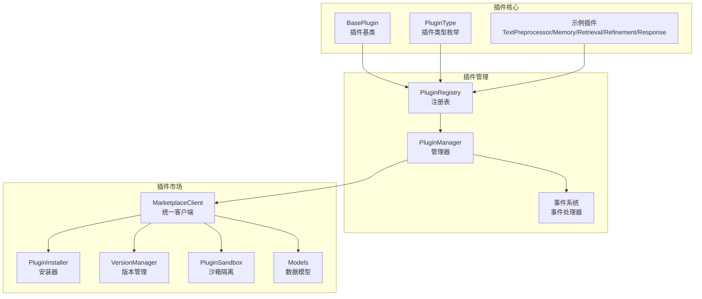
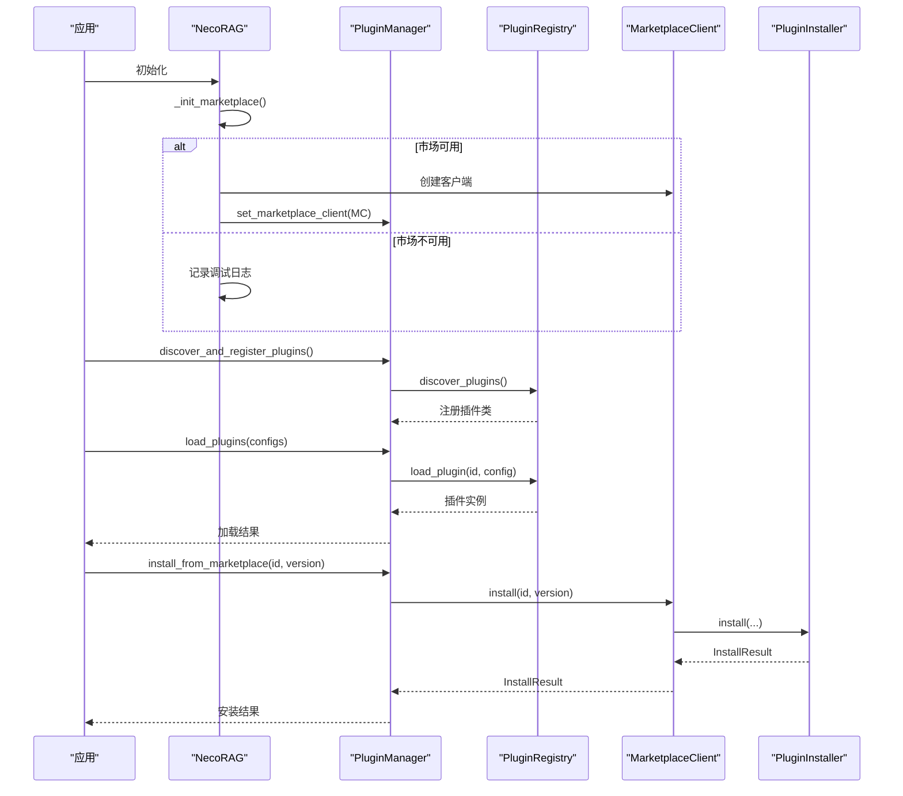
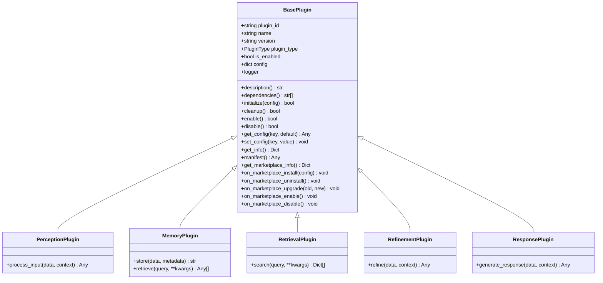
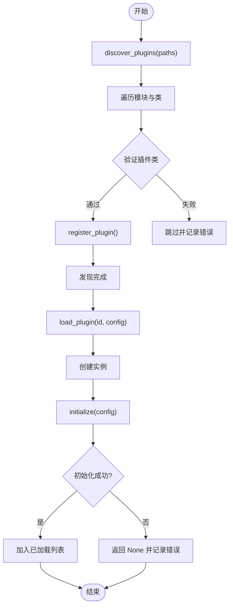
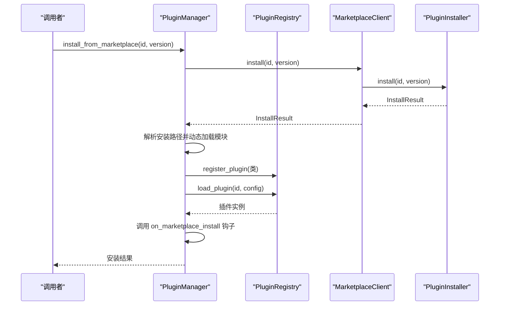
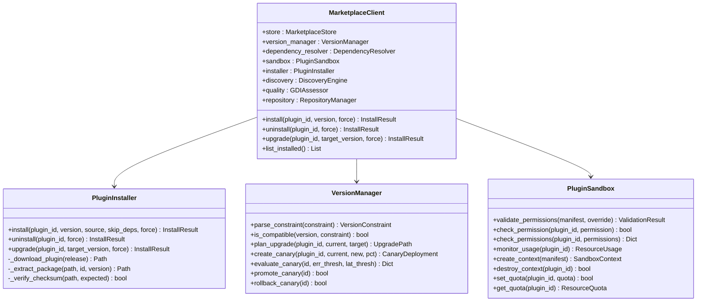
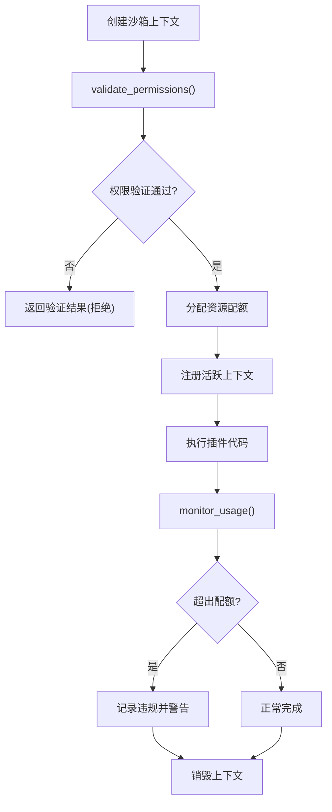
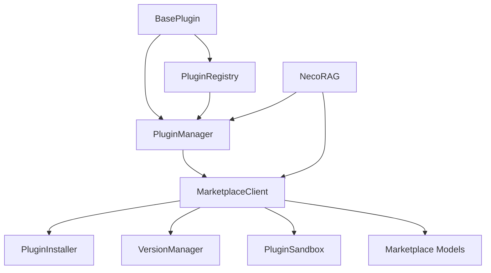

# 插件扩展系统

<cite>
**本文档引用的文件**
- [src/plugins/__init__.py](file://src/plugins/__init__.py)
- [src/plugins/base.py](file://src/plugins/base.py)
- [src/plugins/manager.py](file://src/plugins/manager.py)
- [src/plugins/registry.py](file://src/plugins/registry.py)
- [src/plugins/example_plugins.py](file://src/plugins/example_plugins.py)
- [src/plugins/README.md](file://src/plugins/README.md)
- [src/marketplace/__init__.py](file://src/marketplace/__init__.py)
- [src/marketplace/models.py](file://src/marketplace/models.py)
- [src/marketplace/sandbox.py](file://src/marketplace/sandbox.py)
- [src/marketplace/installer.py](file://src/marketplace/installer.py)
- [src/marketplace/version_manager.py](file://src/marketplace/version_manager.py)
- [src/marketplace/client.py](file://src/marketplace/client.py)
- [src/necorag.py](file://src/necorag.py)
</cite>

## 目录
1. [简介](#简介)
2. [项目结构](#项目结构)
3. [核心组件](#核心组件)
4. [架构总览](#架构总览)
5. [详细组件分析](#详细组件分析)
6. [依赖关系分析](#依赖关系分析)
7. [性能考虑](#性能考虑)
8. [故障排除指南](#故障排除指南)
9. [结论](#结论)
10. [附录](#附录)

## 简介
本文件为 NecoRAG 插件扩展系统的详细实现文档，涵盖插件基类标准接口设计、生命周期管理、插件管理器的动态加载/卸载/状态管理、插件注册表的发现/注册/依赖解析、插件市场的模块化管理与版本控制、以及沙箱隔离机制与安全运行。同时提供开发指南、安装配置与调试方法，并阐明插件系统与核心系统的集成关系及扩展策略。

## 项目结构
插件扩展系统主要由三部分组成：
- 插件核心模块：定义插件基类、插件类型、生命周期接口与示例插件
- 插件管理模块：负责插件的注册、发现、加载、卸载、事件与市场集成
- 插件市场模块：提供版本管理、依赖解析、安装器、沙箱隔离与质量评估

**图表来源**
- [src/plugins/base.py:15-385](file://src/plugins/base.py#L15-L385)
- [src/plugins/registry.py:15-383](file://src/plugins/registry.py#L15-L383)
- [src/plugins/manager.py:14-584](file://src/plugins/manager.py#L14-L584)
- [src/marketplace/client.py:47-294](file://src/marketplace/client.py#L47-L294)
- [src/marketplace/installer.py:152-800](file://src/marketplace/installer.py#L152-L800)
- [src/marketplace/version_manager.py:179-800](file://src/marketplace/version_manager.py#L179-L800)
- [src/marketplace/sandbox.py:186-800](file://src/marketplace/sandbox.py#L186-L800)
- [src/marketplace/models.py:13-756](file://src/marketplace/models.py#L13-L756)

**章节来源**
- [src/plugins/__init__.py:1-45](file://src/plugins/__init__.py#L1-L45)
- [src/plugins/README.md:1-239](file://src/plugins/README.md#L1-L239)
- [src/marketplace/__init__.py:1-192](file://src/marketplace/__init__.py#L1-L192)

## 核心组件
- 插件基类 BasePlugin：定义标准接口、生命周期方法、配置管理、市场元数据与权限声明，以及市场生命周期钩子
- 插件类型 PluginType：按认知架构分层定义感知、记忆、检索、巩固、响应与自定义插件类型
- 插件注册表 PluginRegistry：负责插件类的注册、发现、加载、卸载与版本索引
- 插件管理器 PluginManager：负责批量加载/卸载、启用/禁用、事件处理、依赖解析与市场集成
- 插件市场 MarketplaceClient：统一入口，组合安装器、版本管理、依赖解析、沙箱与质量评估
- 沙箱隔离 PluginSandbox：权限验证、运行时权限检查、资源配额与监控
- 版本管理 VersionManager：语义版本解析、兼容性检查、升级路径规划与灰度部署
- 安装器 PluginInstaller：插件安装/卸载/升级的完整生命周期管理

**章节来源**
- [src/plugins/base.py:25-385](file://src/plugins/base.py#L25-L385)
- [src/plugins/registry.py:15-383](file://src/plugins/registry.py#L15-L383)
- [src/plugins/manager.py:14-584](file://src/plugins/manager.py#L14-L584)
- [src/marketplace/client.py:47-294](file://src/marketplace/client.py#L47-L294)
- [src/marketplace/sandbox.py:186-800](file://src/marketplace/sandbox.py#L186-L800)
- [src/marketplace/version_manager.py:179-800](file://src/marketplace/version_manager.py#L179-L800)
- [src/marketplace/installer.py:152-800](file://src/marketplace/installer.py#L152-L800)

## 架构总览
插件系统采用“核心插件 + 管理器 + 市场”的分层架构。核心插件提供标准接口；管理器负责生命周期与依赖；市场提供版本与安全控制。NecoRAG 主入口在初始化时可选择性加载市场模块并与插件管理器集成。

**图表来源**
- [src/necorag.py:199-220](file://src/necorag.py#L199-L220)
- [src/plugins/manager.py:168-391](file://src/plugins/manager.py#L168-L391)
- [src/marketplace/client.py:265-294](file://src/marketplace/client.py#L265-L294)
- [src/marketplace/installer.py:217-402](file://src/marketplace/installer.py#L217-L402)

## 详细组件分析

### 插件基类与生命周期
- 标准接口：description、dependencies、_initialize、_cleanup
- 生命周期：initialize、cleanup、enable、disable
- 配置管理：get_config、set_config
- 市场元数据：marketplace_* 属性、manifest 生成、get_marketplace_info
- 市场生命周期钩子：on_marketplace_install/uninstall/upgrade/enable/disable

**图表来源**
- [src/plugins/base.py:25-385](file://src/plugins/base.py#L25-L385)

**章节来源**
- [src/plugins/base.py:25-385](file://src/plugins/base.py#L25-L385)

### 插件注册表
- 注册/注销插件类
- 发现插件：pkgutil 遍历模块，查找 BasePlugin 子类
- 加载/卸载插件实例：创建实例并调用 initialize/cleanup
- 版本索引与市场元数据缓存
- 通过 marketplace_id 建立映射，支持按市场 ID 获取插件实例

**图表来源**
- [src/plugins/registry.py:192-248](file://src/plugins/registry.py#L192-L248)
- [src/plugins/registry.py:80-131](file://src/plugins/registry.py#L80-L131)

**章节来源**
- [src/plugins/registry.py:15-383](file://src/plugins/registry.py#L15-L383)

### 插件管理器
- 批量加载/卸载：按依赖拓扑排序，支持循环依赖检测
- 启用/禁用：调用插件 enable/disable
- 事件系统：注册/注销事件处理器，触发事件并通知插件
- 市场集成：install_from_marketplace、uninstall_marketplace_plugin、upgrade_marketplace_plugin、同步状态
- 依赖图构建：正向依赖与反向依赖，用于卸载顺序

**图表来源**
- [src/plugins/manager.py:299-391](file://src/plugins/manager.py#L299-L391)
- [src/marketplace/installer.py:217-402](file://src/marketplace/installer.py#L217-L402)

**章节来源**
- [src/plugins/manager.py:14-584](file://src/plugins/manager.py#L14-L584)

### 插件市场与版本控制
- MarketplaceClient：组合 Store、VersionManager、DependencyResolver、PluginInstaller、DiscoveryEngine、GDIAssessor、PluginSandbox、RepositoryManager
- PluginInstaller：安全解压、校验和验证、依赖安装、安装记录、钩子回调、卸载清理
- VersionManager：版本约束解析、兼容性检查、升级路径规划、灰度部署
- PluginSandbox：权限级别与授权、资源配额、运行时权限检查、监控与审计

**图表来源**
- [src/marketplace/client.py:47-294](file://src/marketplace/client.py#L47-L294)
- [src/marketplace/installer.py:152-800](file://src/marketplace/installer.py#L152-L800)
- [src/marketplace/version_manager.py:179-800](file://src/marketplace/version_manager.py#L179-L800)
- [src/marketplace/sandbox.py:186-800](file://src/marketplace/sandbox.py#L186-L800)

**章节来源**
- [src/marketplace/client.py:47-294](file://src/marketplace/client.py#L47-L294)
- [src/marketplace/installer.py:152-800](file://src/marketplace/installer.py#L152-L800)
- [src/marketplace/version_manager.py:179-800](file://src/marketplace/version_manager.py#L179-L800)
- [src/marketplace/sandbox.py:186-800](file://src/marketplace/sandbox.py#L186-L800)

### 沙箱隔离机制
- 权限模型：四等级权限（MINIMAL/STANDARD/ELEVATED/FULL），按插件分类默认级别
- 运行时权限检查：check_permission/check_permissions
- 资源配额：内存/CPU/磁盘/执行时间限制，监控与违规检测
- 上下文管理：自动创建/销毁沙箱上下文，确保资源清理
- 安全审计：活跃上下文、资源使用统计、敏感权限警告

**图表来源**
- [src/marketplace/sandbox.py:580-704](file://src/marketplace/sandbox.py#L580-L704)
- [src/marketplace/sandbox.py:428-577](file://src/marketplace/sandbox.py#L428-L577)

**章节来源**
- [src/marketplace/sandbox.py:186-800](file://src/marketplace/sandbox.py#L186-L800)

### 插件开发指南与示例
- 选择合适基类：Perception/Memory/Retrieval/Refinement/Response
- 实现必要方法：description、dependencies、_initialize、_cleanup
- 配置管理：get_config/set_config
- 日志记录：使用内置 logger
- 示例插件：文本预处理、简单缓存、关键词检索、数据验证、响应格式化

**章节来源**
- [src/plugins/README.md:137-239](file://src/plugins/README.md#L137-L239)
- [src/plugins/example_plugins.py:1-332](file://src/plugins/example_plugins.py#L1-L332)

## 依赖关系分析
- 插件基类依赖抽象基类与枚举，提供统一接口
- 管理器依赖注册表与插件基类，负责生命周期与事件
- 市场客户端组合多个子系统，形成完整的插件生态
- NecoRAG 主入口可选择性初始化市场模块并与插件管理器集成

**图表来源**
- [src/plugins/base.py:25-385](file://src/plugins/base.py#L25-L385)
- [src/plugins/registry.py:15-383](file://src/plugins/registry.py#L15-L383)
- [src/plugins/manager.py:14-584](file://src/plugins/manager.py#L14-L584)
- [src/marketplace/client.py:47-294](file://src/marketplace/client.py#L47-L294)
- [src/necorag.py:199-220](file://src/necorag.py#L199-L220)

**章节来源**
- [src/plugins/base.py:25-385](file://src/plugins/base.py#L25-L385)
- [src/plugins/registry.py:15-383](file://src/plugins/registry.py#L15-L383)
- [src/plugins/manager.py:14-584](file://src/plugins/manager.py#L14-L584)
- [src/marketplace/client.py:47-294](file://src/marketplace/client.py#L47-L294)
- [src/necorag.py:199-220](file://src/necorag.py#L199-L220)

## 性能考虑
- 插件加载优化：按依赖拓扑排序，避免循环依赖；支持懒加载与状态监控
- 内存管理：及时卸载插件实例，显式释放资源，监控内存使用
- 安装性能：下载缓存、校验和验证、原子写入与安全解压
- 版本与升级：灰度部署与评估，降低升级风险
- 沙箱资源：严格的资源配额与监控，防止资源滥用

[本节为通用指导，无需特定文件引用]

## 故障排除指南
- 插件加载失败：检查插件类继承与方法实现，查看日志错误信息
- 依赖循环：检查插件依赖关系，使用依赖解析工具分析，重新设计架构
- 性能问题：监控插件执行时间与资源使用，考虑异步处理机制
- 市场安装失败：检查权限验证、依赖解析、下载与校验和，查看安装器错误钩子
- 沙箱拒绝：检查权限级别与敏感权限，调整配额或权限覆盖

**章节来源**
- [src/plugins/README.md:208-239](file://src/plugins/README.md#L208-L239)
- [src/marketplace/installer.py:152-800](file://src/marketplace/installer.py#L152-L800)
- [src/marketplace/sandbox.py:186-800](file://src/marketplace/sandbox.py#L186-L800)

## 结论
NecoRAG 插件扩展系统通过清晰的基类接口、完善的生命周期管理、灵活的注册与管理机制，以及强大的市场与沙箱能力，实现了高度模块化与可扩展的认知架构。系统支持动态加载、版本控制、安全隔离与可观测性，为开发者提供了可靠的插件开发与运维体验。

[本节为总结，无需特定文件引用]

## 附录

### 插件安装与配置
- 安装依赖：确保 setuptools 可用
- 发现与注册：调用 discover_and_register_plugins
- 加载插件：load_plugins(configs)，支持按依赖顺序加载
- 配置管理：通过 get_config/set_config 设置插件参数
- 启用/禁用：enable_plugins/disable_plugins 控制运行状态

**章节来源**
- [src/plugins/README.md:27-116](file://src/plugins/README.md#L27-L116)

### 插件与核心系统集成
- NecoRAG 初始化时可选择性加载市场模块
- 将 MarketplaceClient 注入 PluginManager，实现市场安装与同步
- 插件通过注册表与管理器接入核心流程，实现感知/记忆/检索/巩固/响应的分层协作

**章节来源**
- [src/necorag.py:199-220](file://src/necorag.py#L199-L220)
- [src/plugins/manager.py:287-581](file://src/plugins/manager.py#L287-L581)