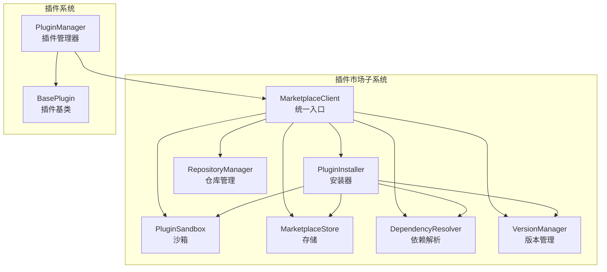
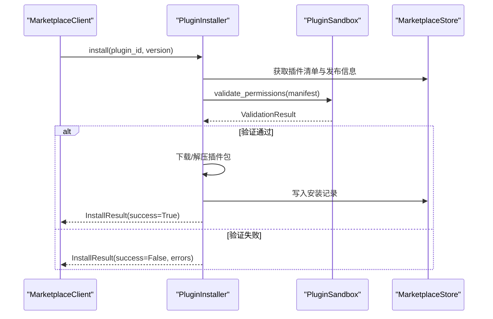
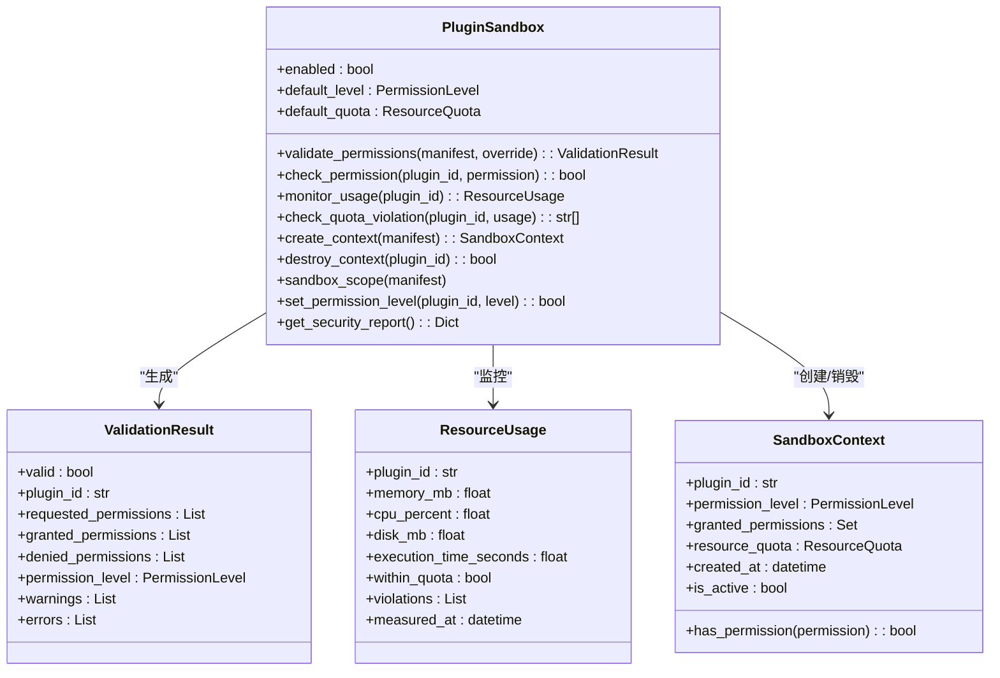
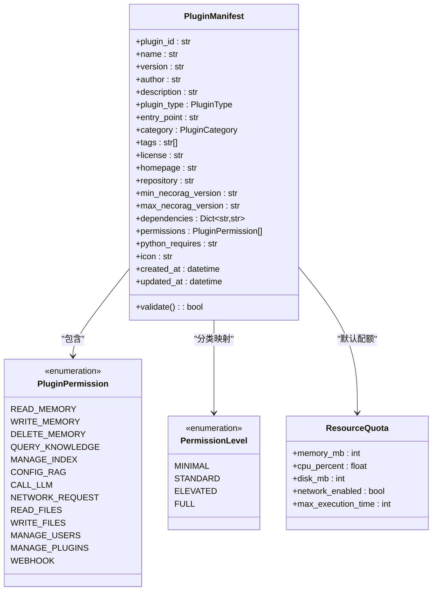
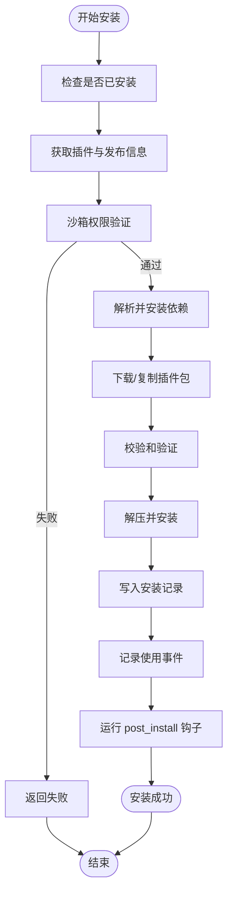
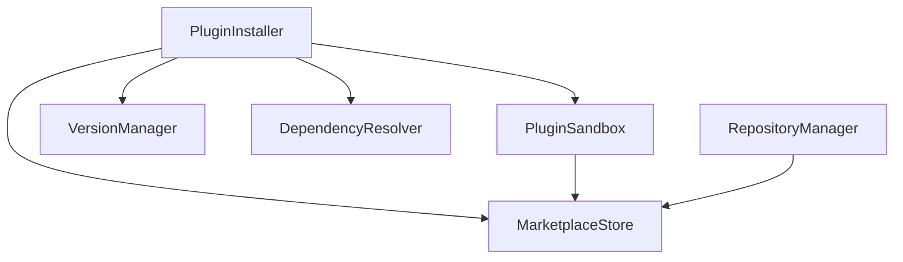

# 插件沙箱机制

<cite>
**本文档引用的文件**
- [src/marketplace/sandbox.py](file://src/marketplace/sandbox.py)
- [src/marketplace/models.py](file://src/marketplace/models.py)
- [src/marketplace/installer.py](file://src/marketplace/installer.py)
- [src/marketplace/client.py](file://src/marketplace/client.py)
- [src/plugins/base.py](file://src/plugins/base.py)
- [src/plugins/manager.py](file://src/plugins/manager.py)
- [src/security/protection.py](file://src/security/protection.py)
- [3rd/docker_scripts/import_docker_images.sh](file://3rd/docker_scripts/import_docker_images.sh)
</cite>

## 目录
1. [引言](#引言)
2. [项目结构](#项目结构)
3. [核心组件](#核心组件)
4. [架构总览](#架构总览)
5. [详细组件分析](#详细组件分析)
6. [依赖分析](#依赖分析)
7. [性能考虑](#性能考虑)
8. [故障排查指南](#故障排查指南)
9. [结论](#结论)
10. [附录](#附录)

## 引言
本文件面向插件沙箱机制的安全文档，系统阐述插件沙箱的设计目标、安全隔离原理、执行环境搭建、权限与资源管控、安装过程中的安全验证、监控与审计、配置与性能调优、安全漏洞预防与应急响应，以及与操作系统和容器技术的集成方式，并提供测试与验证方法。

## 项目结构
围绕插件沙箱的关键模块主要分布在 marketplace 子系统与 plugins 子系统中：
- marketplace/sandbox.py：插件沙箱核心实现，负责权限验证、运行时检查、资源配额与监控、上下文管理与安全审计。
- marketplace/models.py：定义插件清单、权限枚举、资源配额等数据模型。
- marketplace/installer.py：插件安装器，集成沙箱权限验证与安装流程。
- marketplace/client.py：市场客户端，组合沙箱、安装器等子系统，提供统一的高级 API。
- plugins/base.py：插件基类与市场元数据映射，便于生成与市场兼容的清单。
- plugins/manager.py：插件生命周期管理，与市场集成以支持从市场安装插件。
- security/protection.py：通用安全中间件（速率限制、CSRF、XSS），可与沙箱协同保障系统整体安全。
- 3rd/docker_scripts/import_docker_images.sh：容器镜像导入脚本，涉及磁盘空间检查，与沙箱资源限制形成互补。

**图表来源**
- [src/marketplace/client.py:47-104](file://src/marketplace/client.py#L47-L104)
- [src/marketplace/installer.py:152-214](file://src/marketplace/installer.py#L152-L214)
- [src/marketplace/sandbox.py:186-231](file://src/marketplace/sandbox.py#L186-L231)
- [src/plugins/manager.py:14-25](file://src/plugins/manager.py#L14-L25)

**章节来源**
- [src/marketplace/client.py:47-104](file://src/marketplace/client.py#L47-L104)
- [src/marketplace/installer.py:152-214](file://src/marketplace/installer.py#L152-L214)
- [src/marketplace/sandbox.py:186-231](file://src/marketplace/sandbox.py#L186-L231)
- [src/plugins/manager.py:14-25](file://src/plugins/manager.py#L14-L25)

## 核心组件
- 插件沙箱（PluginSandbox）：提供权限验证、运行时权限检查、资源配额管理、上下文生命周期管理与安全审计。
- 插件清单与权限模型（PluginManifest、PluginPermission、PermissionLevel、ResourceQuota）：定义插件元数据、权限集合与资源配额。
- 插件安装器（PluginInstaller）：在安装过程中执行沙箱权限验证、依赖解析与安装流程。
- 市场客户端（MarketplaceClient）：组合沙箱、安装器等子系统，提供统一 API。
- 插件基类（BasePlugin）：提供市场元数据映射，便于生成与市场兼容的清单。
- 插件管理器（PluginManager）：负责插件的加载、卸载、启用/禁用与事件处理，支持从市场安装插件。

**章节来源**
- [src/marketplace/sandbox.py:186-231](file://src/marketplace/sandbox.py#L186-L231)
- [src/marketplace/models.py:58-92](file://src/marketplace/models.py#L58-L92)
- [src/marketplace/installer.py:217-402](file://src/marketplace/installer.py#L217-L402)
- [src/marketplace/client.py:47-104](file://src/marketplace/client.py#L47-L104)
- [src/plugins/base.py:25-51](file://src/plugins/base.py#L25-L51)
- [src/plugins/manager.py:14-25](file://src/plugins/manager.py#L14-L25)

## 架构总览
插件沙箱贯穿插件生命周期：从安装前的权限验证，到运行时的权限与资源监控，再到卸载时的上下文清理。MarketplaceClient 作为统一入口，协调各子系统；PluginInstaller 在安装阶段调用沙箱进行权限校验；PluginSandbox 提供运行时的权限与资源控制。

**图表来源**
- [src/marketplace/client.py:265-293](file://src/marketplace/client.py#L265-L293)
- [src/marketplace/installer.py:217-402](file://src/marketplace/installer.py#L217-L402)
- [src/marketplace/sandbox.py:235-317](file://src/marketplace/sandbox.py#L235-L317)

**章节来源**
- [src/marketplace/client.py:265-293](file://src/marketplace/client.py#L265-L293)
- [src/marketplace/installer.py:217-402](file://src/marketplace/installer.py#L217-L402)
- [src/marketplace/sandbox.py:235-317](file://src/marketplace/sandbox.py#L235-L317)

## 详细组件分析

### 插件沙箱（PluginSandbox）
- 设计目标与隔离原理
  - 权限验证：根据插件清单与权限级别映射，对比请求权限与允许权限，拒绝未授权权限并生成警告。
  - 运行时权限检查：在插件执行关键操作时进行权限校验，未启用沙箱时默认放行。
  - 资源配额管理：支持内存、CPU、磁盘与执行时间的配额限制，结合监控与违规检测。
  - 上下文管理：创建/销毁沙箱上下文，自动清理资源，保证生命周期可控。
  - 安全审计：聚合活跃上下文、资源使用与违规信息，生成安全报告。
- 关键流程
  - 权限验证流程：确定有效权限级别 → 获取允许权限集合 → 对比请求权限 → 标记拒绝与敏感权限警告 → 生成验证结果。
  - 资源监控流程：计算执行时间 → 采集内存/CPU（优先 psutil，其次 resource 模块） → 检查配额 → 记录违规。
  - 安装与卸载：安装前验证权限，卸载时清理沙箱状态与上下文。
- 数据模型
  - ValidationResult：权限验证结果。
  - ResourceUsage：资源使用统计。
  - SandboxContext：沙箱执行上下文。
  - ResourceQuota：资源配额。

**图表来源**
- [src/marketplace/sandbox.py:97-182](file://src/marketplace/sandbox.py#L97-L182)
- [src/marketplace/sandbox.py:186-231](file://src/marketplace/sandbox.py#L186-L231)

**章节来源**
- [src/marketplace/sandbox.py:235-317](file://src/marketplace/sandbox.py#L235-L317)
- [src/marketplace/sandbox.py:429-576](file://src/marketplace/sandbox.py#L429-L576)
- [src/marketplace/sandbox.py:580-704](file://src/marketplace/sandbox.py#L580-L704)
- [src/marketplace/sandbox.py:787-840](file://src/marketplace/sandbox.py#L787-L840)

### 插件清单与权限模型
- 权限枚举（PluginPermission）：涵盖读写记忆、查询知识库、管理索引、配置RAG、调用LLM、网络请求、文件读写、用户与插件管理、Webhook等。
- 权限级别（PermissionLevel）：MINIMAL、STANDARD、ELEVATED、FULL 四级。
- 资源配额（ResourceQuota）：内存、CPU、磁盘、网络开关与最大执行时间。
- 敏感权限警告：对高风险权限（如删除记忆、用户管理、插件管理、文件写入、RAG配置）提供警告信息。

**图表来源**
- [src/marketplace/models.py:136-234](file://src/marketplace/models.py#L136-L234)
- [src/marketplace/models.py:58-92](file://src/marketplace/models.py#L58-L92)
- [src/marketplace/models.py:466-497](file://src/marketplace/models.py#L466-L497)

**章节来源**
- [src/marketplace/models.py:58-92](file://src/marketplace/models.py#L58-L92)
- [src/marketplace/models.py:136-234](file://src/marketplace/models.py#L136-L234)
- [src/marketplace/models.py:466-497](file://src/marketplace/models.py#L466-L497)

### 插件安装器（PluginInstaller）
- 安装流程：检查已安装状态 → 获取插件与发布信息 → 沙箱权限验证 → 依赖解析与安装 → 下载/校验/解压 → 写入安装记录 → 记录使用事件 → 钩子回调。
- 卸载流程：前置钩子 → 清理沙箱状态 → 清理安装目录 → 移除安装记录 → 记录使用事件 → 后置钩子。
- 升级/回滚：规划升级路径 → 兼容性验证 → 备份配置 → 安装新版本 → 迁移配置 → 清理旧版本 → 记录使用事件。
- 安全要点：校验和验证、安全解压（防目录穿越）、线程安全（锁保护）。

**图表来源**
- [src/marketplace/installer.py:217-402](file://src/marketplace/installer.py#L217-L402)
- [src/marketplace/installer.py:459-608](file://src/marketplace/installer.py#L459-L608)

**章节来源**
- [src/marketplace/installer.py:217-402](file://src/marketplace/installer.py#L217-L402)
- [src/marketplace/installer.py:659-754](file://src/marketplace/installer.py#L659-L754)
- [src/marketplace/installer.py:792-937](file://src/marketplace/installer.py#L792-L937)

### 市场客户端（MarketplaceClient）
- 组合子系统：Store、VersionManager、DependencyResolver、PluginInstaller、DiscoveryEngine、GDIAssessor、PluginSandbox、RepositoryManager。
- 安全相关 API：验证插件权限、获取安全报告、设置插件权限级别。
- 生命周期：初始化时按依赖顺序创建子系统；关闭时释放资源。

**章节来源**
- [src/marketplace/client.py:47-104](file://src/marketplace/client.py#L47-L104)
- [src/marketplace/client.py:710-742](file://src/marketplace/client.py#L710-L742)
- [src/marketplace/client.py:868-884](file://src/marketplace/client.py#L868-L884)

### 插件基类与管理器
- 插件基类（BasePlugin）：提供插件标准接口、生命周期方法与市场元数据映射，便于生成与市场兼容的清单。
- 插件管理器（PluginManager）：负责插件的加载、卸载、启用/禁用、事件处理与与市场集成（从市场安装插件）。

**章节来源**
- [src/plugins/base.py:25-51](file://src/plugins/base.py#L25-L51)
- [src/plugins/base.py:174-273](file://src/plugins/base.py#L174-L273)
- [src/plugins/manager.py:289-390](file://src/plugins/manager.py#L289-L390)

## 依赖分析
- 沙箱与安装器：安装器在安装阶段调用沙箱进行权限验证，确保只有通过验证的插件才能进入后续安装流程。
- 沙箱与存储：沙箱维护活跃上下文与资源使用记录，存储用于持久化安装信息与清单。
- 沙箱与版本管理：升级/回滚时依赖版本管理器规划升级路径与兼容性检查。
- 沙箱与依赖解析：安装器在安装前解析依赖，避免循环依赖与版本冲突。
- 沙箱与仓库管理：发布插件到本地仓库，便于后续安装与升级。

**图表来源**
- [src/marketplace/installer.py:173-214](file://src/marketplace/installer.py#L173-L214)
- [src/marketplace/sandbox.py:186-231](file://src/marketplace/sandbox.py#L186-L231)
- [src/marketplace/client.py:75-101](file://src/marketplace/client.py#L75-L101)

**章节来源**
- [src/marketplace/installer.py:173-214](file://src/marketplace/installer.py#L173-L214)
- [src/marketplace/sandbox.py:186-231](file://src/marketplace/sandbox.py#L186-L231)
- [src/marketplace/client.py:75-101](file://src/marketplace/client.py#L75-L101)

## 性能考虑
- 资源监控精度：优先使用 psutil 获取内存/CPU，若不可用则回退至 resource 模块（Unix 系统）。注意不同平台单位差异（macOS 与 Linux）。
- 执行时间统计：基于上下文启动时间计算，结合最大执行时间配额进行限制。
- 线程安全：沙箱内部使用锁保护活跃上下文、资源使用记录与覆盖配置，避免并发访问导致的数据竞争。
- I/O 优化：安装器采用原子写入与临时文件机制，减少文件损坏风险；缓存目录清理与统计提供磁盘空间管理能力。
- 配置建议：
  - 根据插件类型与预期负载调整默认资源配额（内存、CPU、磁盘、执行时间）。
  - 启用 psutil 以提升监控精度；在容器或受限环境中合理设置资源限制。
  - 定期清理缓存目录，避免磁盘空间不足影响安装与监控。

**章节来源**
- [src/marketplace/sandbox.py:492-528](file://src/marketplace/sandbox.py#L492-L528)
- [src/marketplace/installer.py:1319-1374](file://src/marketplace/installer.py#L1319-L1374)
- [src/marketplace/installer.py:1319-1374](file://src/marketplace/installer.py#L1319-L1374)

## 故障排查指南
- 权限验证失败
  - 现象：安装返回“权限验证失败”，包含被拒绝的权限列表与错误信息。
  - 排查：检查插件清单中的权限声明与分类默认权限级别；必要时通过客户端设置插件权限级别覆盖。
- 资源使用超限
  - 现象：监控报告中标记配额违规（内存/CPU/磁盘/执行时间）。
  - 排查：调整插件资源配额或优化插件实现；检查是否存在长时间占用资源的插件。
- 安装失败
  - 现象：安装返回失败，包含错误信息。
  - 排查：检查下载链接、校验和、目录权限与磁盘空间；查看依赖解析结果与冲突。
- 卸载失败
  - 现象：卸载返回失败或被其他插件依赖。
  - 排查：使用强制卸载（忽略反向依赖）或先卸载依赖插件。
- 安全报告异常
  - 现象：安全报告生成失败或包含错误字段。
  - 排查：检查沙箱状态与日志，确认上下文与资源使用记录一致性。

**章节来源**
- [src/marketplace/sandbox.py:235-317](file://src/marketplace/sandbox.py#L235-L317)
- [src/marketplace/sandbox.py:530-576](file://src/marketplace/sandbox.py#L530-L576)
- [src/marketplace/installer.py:290-300](file://src/marketplace/installer.py#L290-L300)
- [src/marketplace/installer.py:659-754](file://src/marketplace/installer.py#L659-L754)
- [src/marketplace/client.py:722-728](file://src/marketplace/client.py#L722-L728)

## 结论
插件沙箱机制通过“安装前权限验证 + 运行时权限与资源监控 + 生命周期上下文管理 + 安全审计”的闭环设计，实现了对第三方插件的强约束与可观测性。结合市场客户端与安装器，形成了从发现、安装、升级到卸载的全生命周期安全管控。配合容器与系统资源限制，可进一步提升隔离强度与稳定性。

## 附录

### 配置选项与性能调优
- 沙箱配置
  - enabled：是否启用沙箱隔离。
  - default_level：默认权限级别（MINIMAL/STANDARD/ELEVATED/FULL）。
  - default_quota：默认资源配额（内存、CPU、磁盘、执行时间）。
- 安装器配置
  - plugins_dir：插件安装目录。
  - cache_dir：下载缓存目录。
- 性能调优建议
  - 启用 psutil 以提升监控精度。
  - 合理设置资源配额，避免过度宽松导致资源争用。
  - 定期清理缓存与旧版本目录，保持磁盘空间充足。

**章节来源**
- [src/marketplace/sandbox.py:206-222](file://src/marketplace/sandbox.py#L206-L222)
- [src/marketplace/installer.py:173-214](file://src/marketplace/installer.py#L173-L214)

### 与操作系统和容器的集成
- 操作系统资源限制
  - 通过 resource 模块与 psutil 获取系统资源使用情况，支持 Unix 系统的内存单位差异。
- 容器集成
  - 3rd/docker_scripts/import_docker_images.sh 提供磁盘空间检查与建议，与沙箱资源限制形成互补，确保容器运行时有足够的磁盘空间。

**章节来源**
- [src/marketplace/sandbox.py:31-45](file://src/marketplace/sandbox.py#L31-L45)
- [3rd/docker_scripts/import_docker_images.sh:134-167](file://3rd/docker_scripts/import_docker_images.sh#L134-L167)

### 测试与验证方法
- 单元测试与集成测试
  - 利用 tests 目录下的测试框架与样例，验证插件生命周期、安装/卸载/升级流程与沙箱权限控制。
- 安全验证
  - 通过 MarketplaceClient 的安全 API（权限验证、安全报告）对插件进行安全评估。
- 性能验证
  - 结合资源监控与配额检查，评估插件在不同资源配额下的表现。

**章节来源**
- [src/marketplace/client.py:710-742](file://src/marketplace/client.py#L710-L742)
- [tests/integration_test.py:54-86](file://tests/integration_test.py#L54-L86)