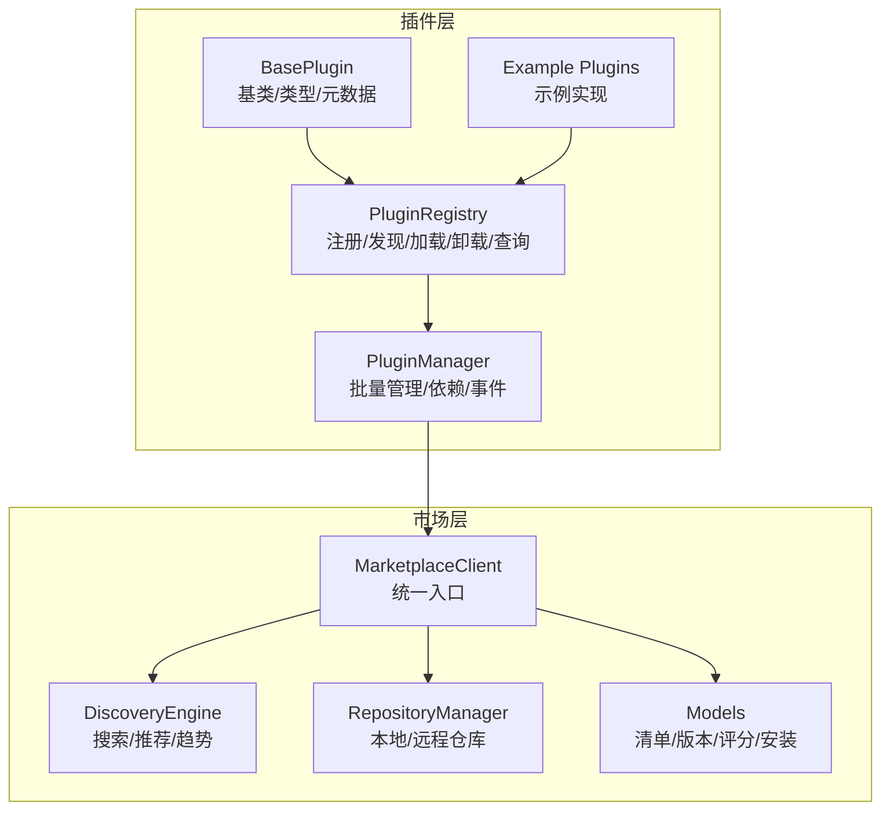
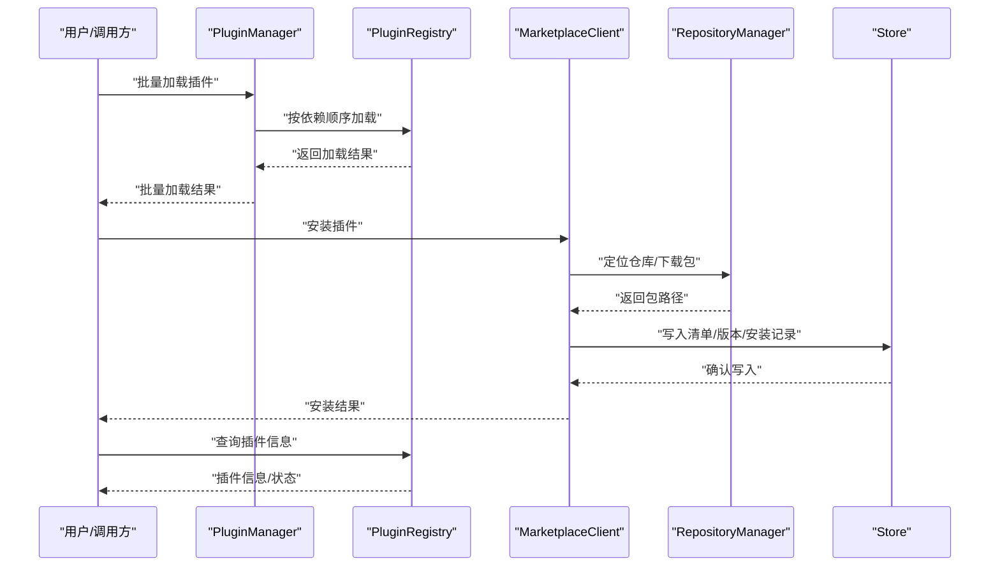
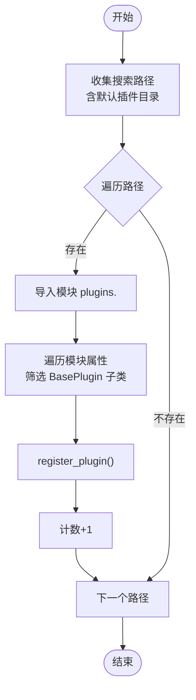
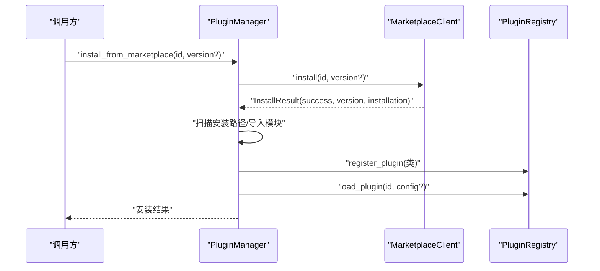
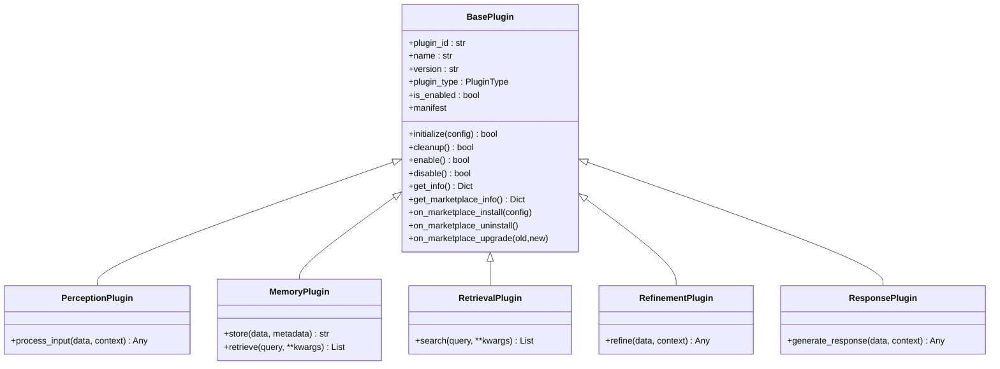
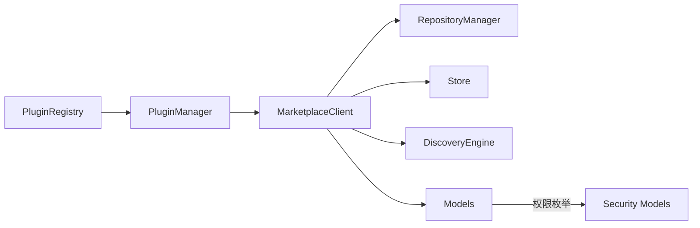

# 插件注册表

<cite>
**本文引用的文件**
- [src/plugins/registry.py](file://src/plugins/registry.py)
- [src/plugins/manager.py](file://src/plugins/manager.py)
- [src/plugins/base.py](file://src/plugins/base.py)
- [src/plugins/example_plugins.py](file://src/plugins/example_plugins.py)
- [src/plugins/__init__.py](file://src/plugins/__init__.py)
- [src/marketplace/models.py](file://src/marketplace/models.py)
- [src/marketplace/discovery.py](file://src/marketplace/discovery.py)
- [src/marketplace/repository.py](file://src/marketplace/repository.py)
- [src/marketplace/client.py](file://src/marketplace/client.py)
- [src/security/permission.py](file://src/security/permission.py)
- [src/security/protection.py](file://src/security/protection.py)
</cite>

## 目录
1. [引言](#引言)
2. [项目结构](#项目结构)
3. [核心组件](#核心组件)
4. [架构总览](#架构总览)
5. [详细组件分析](#详细组件分析)
6. [依赖分析](#依赖分析)
7. [性能考虑](#性能考虑)
8. [故障排查指南](#故障排查指南)
9. [结论](#结论)
10. [附录](#附录)

## 引言
本文件为“插件注册表”的架构文档，围绕插件的发现、注册、加载、卸载、查询与版本管理展开，同时阐述插件元数据与权限安全机制，并给出与市场系统（Marketplace）的集成关系与数据流。文档面向不同技术背景的读者，既提供高层架构说明，也包含代码级关系图与调用流程图，帮助理解插件注册表的设计模式与实现细节。

## 项目结构
插件注册表位于 src/plugins 目录，核心文件包括：
- registry.py：插件注册表，负责插件注册、发现、加载、卸载、查询与版本索引。
- manager.py：插件管理器，负责批量加载/卸载、依赖解析、事件处理与市场集成。
- base.py：插件基类与类型定义，提供插件生命周期、元数据与市场集成接口。
- example_plugins.py：示例插件，演示各层级插件的实现方式。
- __init__.py：导出插件模块的公共接口与全局实例。

此外，插件注册表与市场系统（src/marketplace）紧密集成，涉及：
- models.py：市场数据模型（清单、版本、评分、安装记录等）。
- discovery.py：搜索、推荐、趋势与场景匹配引擎。
- repository.py：本地/远程仓库抽象与实现。
- client.py：市场统一客户端，封装安装、升级、依赖解析、权限验证等能力。

图表来源
- [src/plugins/registry.py](file://src/plugins/registry.py)
- [src/plugins/manager.py](file://src/plugins/manager.py)
- [src/plugins/base.py](file://src/plugins/base.py)
- [src/plugins/example_plugins.py](file://src/plugins/example_plugins.py)
- [src/marketplace/client.py](file://src/marketplace/client.py)
- [src/marketplace/discovery.py](file://src/marketplace/discovery.py)
- [src/marketplace/repository.py](file://src/marketplace/repository.py)
- [src/marketplace/models.py](file://src/marketplace/models.py)

章节来源
- [src/plugins/__init__.py](file://src/plugins/__init__.py)

## 核心组件
- 插件注册表（PluginRegistry）
  - 负责插件类注册、实例加载/卸载、插件发现、版本索引与市场元数据缓存。
  - 提供按类型/状态/市场ID查询插件的能力。
- 插件管理器（PluginManager）
  - 负责批量加载/卸载、依赖拓扑排序、事件分发、启用/禁用与市场集成。
- 插件基类（BasePlugin）
  - 定义插件生命周期（initialize/cleanup）、启用/禁用、信息查询与市场元数据接口。
  - 提供层级插件基类（感知/记忆/检索/巩固/响应）。
- 市场客户端（MarketplaceClient）
  - 组合市场子系统，提供搜索、安装、升级、依赖解析、权限验证、GDI评分等统一API。
- 市场模型（Models）
  - 定义插件清单、版本、评分、安装记录、依赖图、灰度部署等数据结构。

章节来源
- [src/plugins/registry.py](file://src/plugins/registry.py)
- [src/plugins/manager.py](file://src/plugins/manager.py)
- [src/plugins/base.py](file://src/plugins/base.py)
- [src/marketplace/client.py](file://src/marketplace/client.py)
- [src/marketplace/models.py](file://src/marketplace/models.py)

## 架构总览
插件注册表与市场系统的交互采用“组合式客户端”模式：MarketplaceClient 组合 Store、VersionManager、DependencyResolver、PluginInstaller、DiscoveryEngine、GDIAssessor、PluginSandbox、RepositoryManager 等子系统，对外提供统一的插件管理能力；插件注册表与管理器作为系统内部的插件生命周期与依赖管理中枢，与市场客户端通过接口协作。

图表来源
- [src/plugins/manager.py](file://src/plugins/manager.py)
- [src/plugins/registry.py](file://src/plugins/registry.py)
- [src/marketplace/client.py](file://src/marketplace/client.py)
- [src/marketplace/repository.py](file://src/marketplace/repository.py)
- [src/marketplace/models.py](file://src/marketplace/models.py)

## 详细组件分析

### 插件注册表（PluginRegistry）
职责与能力
- 插件注册：校验插件类合法性，建立 marketplace_id 到注册键的映射。
- 插件发现：扫描指定路径，动态导入模块并注册插件类。
- 插件加载/卸载：创建实例、初始化、清理资源；支持重复加载保护。
- 插件查询：按类型过滤、按市场ID查找、获取插件类与实例。
- 版本索引：按插件ID维护版本映射，支持查询版本列表。
- 市场元数据缓存：缓存市场元数据，支持列出有元数据的插件。

关键流程图（插件发现）

图表来源
- [src/plugins/registry.py](file://src/plugins/registry.py)

章节来源
- [src/plugins/registry.py](file://src/plugins/registry.py)

### 插件管理器（PluginManager）
职责与能力
- 批量加载/卸载：根据依赖拓扑排序，保证加载顺序与卸载逆序。
- 依赖解析：构建正向/反向依赖图，检测循环依赖。
- 事件系统：注册/注销事件处理器，触发事件并通知插件。
- 插件查询：按类型获取实例列表，获取插件详细信息（含依赖/反向依赖）。
- 市场集成：延迟注入 MarketplaceClient，支持从市场安装/卸载/升级插件，调用生命周期钩子。

序列图（从市场安装插件）

图表来源
- [src/plugins/manager.py](file://src/plugins/manager.py)
- [src/marketplace/client.py](file://src/marketplace/client.py)
- [src/plugins/registry.py](file://src/plugins/registry.py)

章节来源
- [src/plugins/manager.py](file://src/plugins/manager.py)

### 插件基类（BasePlugin）
职责与能力
- 生命周期：initialize/cleanup/_initialize/_cleanup，enable/disable/_enable/_disable。
- 信息查询：get_info() 返回插件基本信息；支持市场元数据合并。
- 市场集成：manifest 属性与 get_marketplace_info()，提供与市场兼容的清单；on_marketplace_* 生命周期钩子。
- 层级插件：Perception/Memory/Retrieval/Refinement/Response 插件基类，定义各自处理接口。

类图（插件基类层次）

图表来源
- [src/plugins/base.py](file://src/plugins/base.py)

章节来源
- [src/plugins/base.py](file://src/plugins/base.py)

### 市场模型与搜索发现
- 市场模型：PluginManifest、PluginRelease、PluginRating、PluginInstallation、GDIScore、DependencyGraph 等。
- 搜索发现：DiscoveryEngine 提供多维度搜索、标签过滤、排序策略、推荐、趋势排行、场景匹配、相似插件等。
- 仓库管理：RepositoryManager 组合 LocalRepository/RemoteRepository/GitHubRepository，支持多源聚合与索引同步。

章节来源
- [src/marketplace/models.py](file://src/marketplace/models.py)
- [src/marketplace/discovery.py](file://src/marketplace/discovery.py)
- [src/marketplace/repository.py](file://src/marketplace/repository.py)

### 示例插件
- TextPreprocessorPlugin：感知层文本预处理。
- SimpleCachePlugin：记忆层简单缓存。
- KeywordRetrievalPlugin：检索层关键词检索。
- DataValidatorPlugin：巩固层数据验证。
- ResponseFormatterPlugin：响应层格式化输出。
- register_example_plugins：批量注册示例插件。

章节来源
- [src/plugins/example_plugins.py](file://src/plugins/example_plugins.py)

## 依赖分析
- 插件注册表与管理器
  - PluginManager 依赖 PluginRegistry 进行插件实例管理；两者共同构成插件生命周期与依赖管理中枢。
- 插件与市场集成
  - PluginRegistry 与 PluginManager 通过 marketplace_id 与市场元数据协同；MarketplaceClient 通过 RepositoryManager 与 Store 与市场交互。
- 市场模型与权限
  - 市场模型定义 PluginPermission；安全模块提供用户权限控制与中间件防护，可用于插件安装/升级的访问控制与安全检查。

图表来源
- [src/plugins/registry.py](file://src/plugins/registry.py)
- [src/plugins/manager.py](file://src/plugins/manager.py)
- [src/marketplace/client.py](file://src/marketplace/client.py)
- [src/marketplace/repository.py](file://src/marketplace/repository.py)
- [src/marketplace/models.py](file://src/marketplace/models.py)
- [src/security/permission.py](file://src/security/permission.py)

章节来源
- [src/plugins/registry.py](file://src/plugins/registry.py)
- [src/plugins/manager.py](file://src/plugins/manager.py)
- [src/marketplace/client.py](file://src/marketplace/client.py)
- [src/marketplace/models.py](file://src/marketplace/models.py)
- [src/security/permission.py](file://src/security/permission.py)

## 性能考虑
- 插件发现
  - 使用 pkgutil.iter_modules 遍历模块，建议限定搜索路径，避免扫描无关目录。
  - 对导入异常进行捕获与告警，避免影响整体发现流程。
- 插件加载
  - 重复加载保护：若插件已加载则直接返回实例，减少初始化开销。
  - 拓扑排序：依赖解析采用拓扑排序，避免循环依赖导致的死锁与无限等待。
- 市场集成
  - 本地仓库索引文件采用原子写入与重建机制，降低并发写入风险。
  - 远程仓库下载采用临时文件与原子移动，提升可靠性。
- 缓存策略
  - 注册表缓存市场元数据与版本索引，减少重复查询成本。
  - 建议在高频查询场景中引入内存缓存与失效策略（如基于时间戳或变更事件）。

[本节为通用性能指导，无需具体文件引用]

## 故障排查指南
- 插件注册失败
  - 检查插件类是否满足 BasePlugin 接口要求（必需方法、依赖声明等）。
  - 查看注册表日志，确认 marketplace_id 映射是否正确。
- 插件加载失败
  - 检查 initialize 返回值与异常日志；确认配置参数合法。
  - 若多次加载失败，确认 cleanup 是否正确释放资源。
- 插件卸载失败
  - 检查 cleanup 异常；确认插件实例状态一致性。
- 依赖问题
  - 使用 PluginManager 的依赖解析与拓扑排序，检查是否存在循环依赖。
  - 通过 get_plugin_info 获取依赖/反向依赖列表辅助诊断。
- 市场安装/升级失败
  - 检查 MarketplaceClient 的安装结果与错误信息。
  - 确认仓库可用性、包完整性与权限校验结果。
- 权限与安全
  - 使用安全中间件（速率限制、CSRF、XSS）与权限服务进行访问控制。
  - 对插件权限进行验证与审计，避免越权操作。

章节来源
- [src/plugins/registry.py](file://src/plugins/registry.py)
- [src/plugins/manager.py](file://src/plugins/manager.py)
- [src/marketplace/client.py](file://src/marketplace/client.py)
- [src/security/protection.py](file://src/security/protection.py)
- [src/security/permission.py](file://src/security/permission.py)

## 结论
插件注册表通过清晰的职责划分与市场集成，实现了插件的自动发现、安全注册、生命周期管理与版本控制。结合市场客户端提供的统一入口与丰富的搜索/推荐/趋势能力，系统能够高效地支撑插件生态的扩展与演进。建议在生产环境中配合缓存与安全中间件，持续优化加载性能与安全性。

[本节为总结性内容，无需具体文件引用]

## 附录

### API 接口与使用示例（路径指引）
- 插件注册与发现
  - [register_plugin](file://src/plugins/registry.py)
  - [discover_plugins](file://src/plugins/registry.py)
  - [list_plugins](file://src/plugins/registry.py)
- 插件加载与卸载
  - [load_plugin](file://src/plugins/registry.py)
  - [unload_plugin](file://src/plugins/registry.py)
  - [get_plugin](file://src/plugins/registry.py)
- 插件查询与版本
  - [get_plugin_class](file://src/plugins/registry.py)
  - [register_version/get_version/get_versions](file://src/plugins/registry.py)
- 市场集成
  - [install_from_marketplace/uninstall_marketplace_plugin/upgrade_marketplace_plugin](file://src/plugins/manager.py)
  - [set_marketplace_client](file://src/plugins/manager.py)
- 市场客户端（MarketplaceClient）
  - [search/install/uninstall/upgrade/check_updates](file://src/marketplace/client.py)
  - [get_recommendations/get_trending/get_popular_tags/find_similar](file://src/marketplace/client.py)
  - [get_dependency_tree/plan_upgrade_path](file://src/marketplace/client.py)
  - [validate_plugin_permissions/get_security_report](file://src/marketplace/client.py)

章节来源
- [src/plugins/registry.py](file://src/plugins/registry.py)
- [src/plugins/manager.py](file://src/plugins/manager.py)
- [src/marketplace/client.py](file://src/marketplace/client.py)